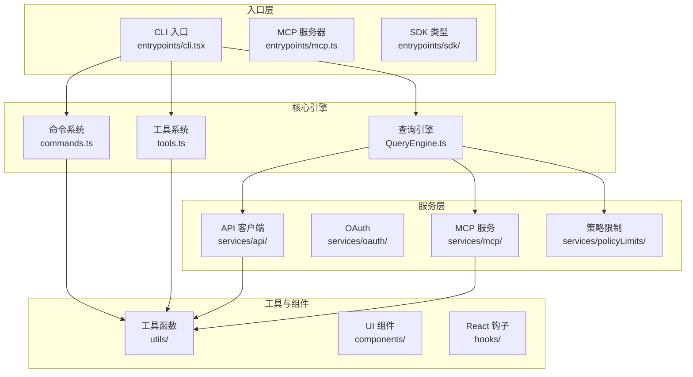
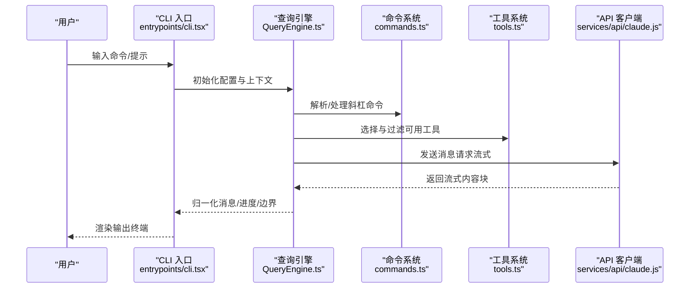
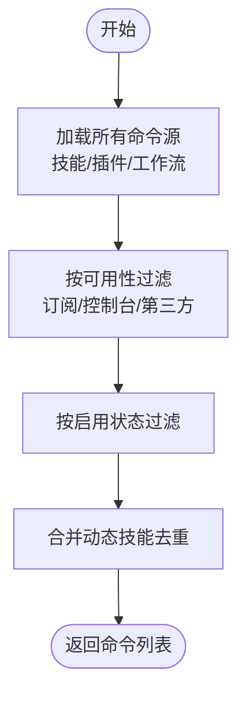
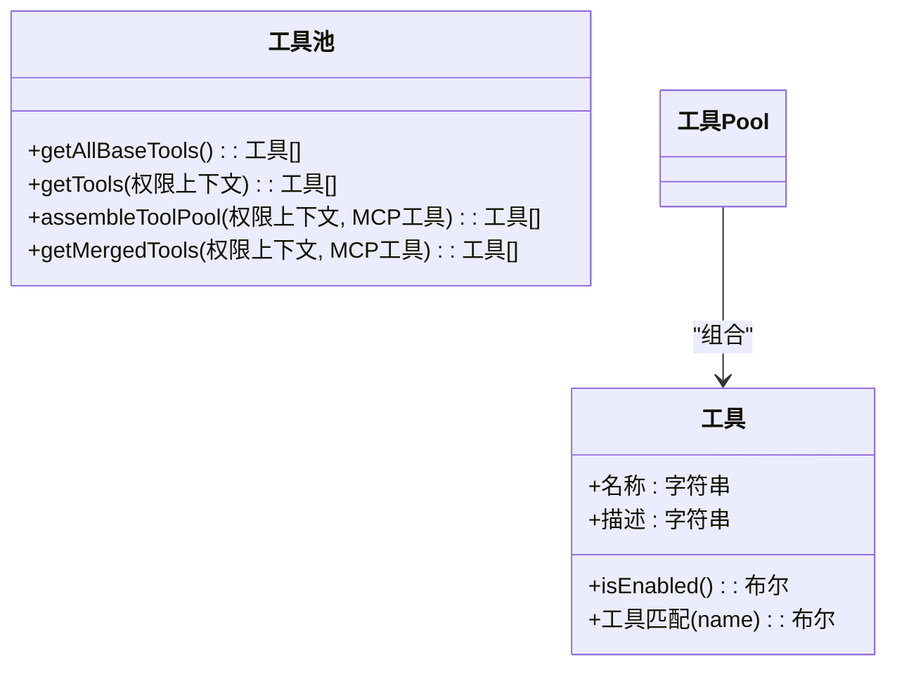
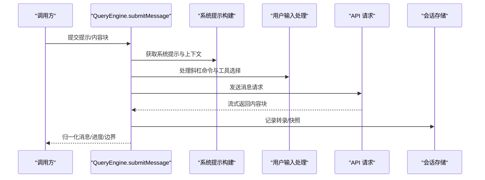
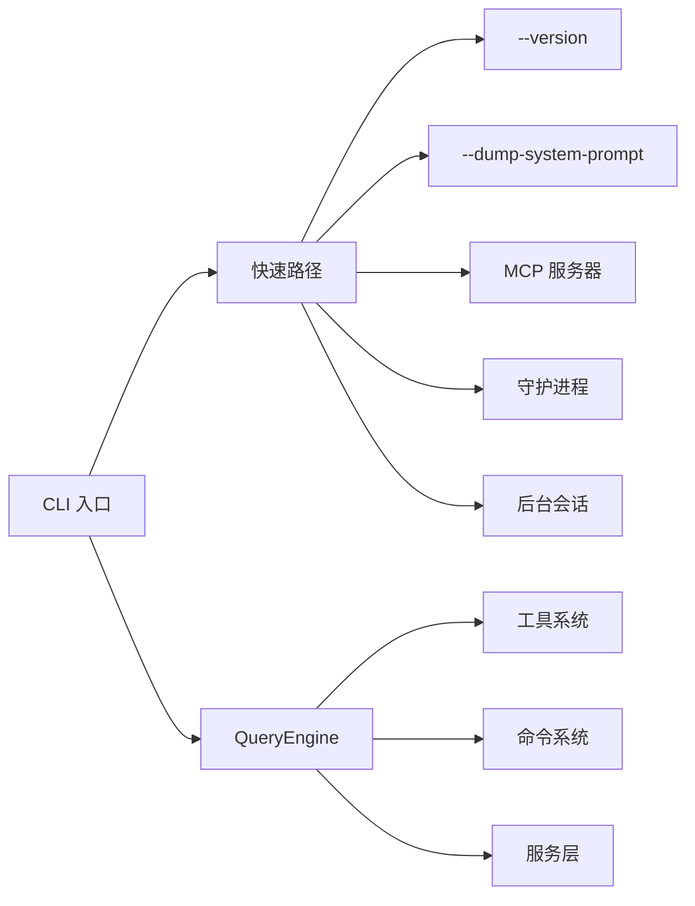

# API 参考文档

<cite>
**本文档引用的文件**
- [README.md](file://README.md)
- [package.json](file://package.json)
- [src/commands.ts](file://src/commands.ts)
- [src/tools.ts](file://src/tools.ts)
- [src/QueryEngine.ts](file://src/QueryEngine.ts)
- [src/entrypoints/cli.tsx](file://src/entrypoints/cli.tsx)
- [src/types/command.ts](file://src/types/command.ts)
- [src/Tool.ts](file://src/Tool.ts)
- [src/services/api/claude.js](file://src/services/api/claude.js)
- [src/utils/processUserInput/processUserInput.js](file://src/utils/processUserInput/processUserInput.js)
- [src/utils/queryHelpers.js](file://src/utils/queryHelpers.js)
- [src/utils/messages.js](file://src/utils/messages.js)
- [src/utils/systemPromptType.js](file://src/utils/systemPromptType.js)
- [src/utils/model/model.js](file://src/utils/model/model.js)
- [src/utils/config.js](file://src/utils/config.js)
- [src/utils/auth.js](file://src/utils/auth.js)
- [src/utils/sinks.js](file://src/utils/sinks.js)
- [src/bridge/bridgeMain.js](file://src/bridge/bridgeMain.js)
- [src/bridge/bridgeEnabled.js](file://src/bridge/bridgeEnabled.js)
- [src/services/policyLimits/index.js](file://src/services/policyLimits/index.js)
- [src/daemon/main.js](file://src/daemon/main.js)
- [src/daemon/workerRegistry.js](file://src/daemon/workerRegistry.js)
- [src/cli/bg.js](file://src/cli/bg.js)
- [src/utils/startupProfiler.js](file://src/utils/startupProfiler.js)
- [src/constants/prompts.js](file://src/constants/prompts.js)
- [src/utils/claudeInChrome/mcpServer.js](file://src/utils/claudeInChrome/mcpServer.js)
- [src/utils/computerUse/mcpServer.js](file://src/utils/computerUse/mcpServer.js)
- [src/utils/claudeInChrome/chromeNativeHost.js](file://src/utils/claudeInChrome/chromeNativeHost.js)
- [src/utils/worktree.js](file://src/utils/worktree.js)
- [src/utils/worktreeModeEnabled.js](file://src/utils/worktreeModeEnabled.js)
- [src/utils/earlyInput.js](file://src/utils/earlyInput.js)
- [src/main.js](file://src/main.js)
- [src/utils/sessionStorage.js](file://src/utils/sessionStorage.js)
- [src/utils/fileHistory.js](file://src/utils/fileHistory.js)
- [src/utils/headlessProfiler.js](file://src/utils/headlessProfiler.js)
- [src/utils/abortController.js](file://src/utils/abortController.js)
- [src/utils/process.js](file://src/utils/process.js)
- [src/utils/messages/mappers.js](file://src/utils/messages/mappers.js)
- [src/utils/messages/systemInit.js](file://src/utils/messages/systemInit.js)
- [src/utils/permissions/filesystem.js](file://src/utils/permissions/filesystem.js)
- [src/utils/permissions/permissions.js](file://src/utils/permissions/permissions.js)
- [src/utils/embeddedTools.js](file://src/utils/embeddedTools.js)
- [src/utils/toolSearch.js](file://src/utils/toolSearch.js)
- [src/utils/tasks.js](file://src/utils/tasks.js)
- [src/utils/shell/shellToolUtils.js](file://src/utils/shell/shellToolUtils.js)
- [src/utils/agentSwarmsEnabled.js](file://src/utils/agentSwarmsEnabled.js)
- [src/utils/worktreeModeEnabled.js](file://src/utils/worktreeModeEnabled.js)
- [src/tools/REPLTool/constants.js](file://src/tools/REPLTool/constants.js)
- [src/coordinator/coordinatorMode.js](file://src/coordinator/coordinatorMode.js)
- [src/services/api/errors.js](file://src/services/api/errors.js)
- [src/memdir/memdir.js](file://src/memdir/memdir.js)
- [src/memdir/paths.js](file://src/memdir/paths.js)
- [src/utils/queryContext.js](file://src/utils/queryContext.js)
- [src/utils/Shell.js](file://src/utils/Shell.js)
- [src/utils/systemTheme.js](file://src/utils/systemTheme.js)
- [src/utils/thinking.js](file://src/utils/thinking.js)
- [src/utils/fastMode.js](file://src/utils/fastMode.js)
- [src/utils/config.js](file://src/utils/config.js)
- [src/utils/cwd.js](file://src/utils/cwd.js)
- [src/utils/envUtils.js](file://src/utils/envUtils.js)
- [src/utils/fileStateCache.js](file://src/utils/fileStateCache.js)
- [src/utils/sessionStorage.js](file://src/utils/sessionStorage.js)
- [src/utils/log.js](file://src/utils/log.js)
- [src/utils/inMemoryErrors.js](file://src/utils/inMemoryErrors.js)
- [src/utils/hooks/hookHelpers.js](file://src/utils/hooks/hookHelpers.js)
- [src/utils/structuredOutputEnforcement.js](file://src/utils/structuredOutputEnforcement.js)
- [src/utils/countToolCalls.js](file://src/utils/countToolCalls.js)
- [src/utils/commitAttribution.js](file://src/utils/commitAttribution.js)
- [src/utils/scratchpad.js](file://src/utils/scratchpad.js)
- [src/utils/scratchpadDir.js](file://src/utils/scratchpadDir.js)
- [src/utils/permissions/filesystem.js](file://src/utils/permissions/filesystem.js)
- [src/utils/permissions/permissions.js](file://src/utils/permissions/permissions.js)
- [src/utils/embeddedTools.js](file://src/utils/embeddedTools.js)
- [src/utils/toolSearch.js](file://src/utils/toolSearch.js)
- [src/utils/tasks.js](file://src/utils/tasks.js)
- [src/utils/shell/shellToolUtils.js](file://src/utils/shell/shellToolUtils.js)
- [src/utils/agentSwarmsEnabled.js](file://src/utils/agentSwarmsEnabled.js)
- [src/utils/worktreeModeEnabled.js](file://src/utils/worktreeModeEnabled.js)
- [src/tools/REPLTool/constants.js](file://src/tools/REPLTool/constants.js)
- [src/coordinator/coordinatorMode.js](file://src/coordinator/coordinatorMode.js)
- [src/services/api/errors.js](file://src/services/api/errors.js)
- [src/memdir/memdir.js](file://src/memdir/memdir.js)
- [src/memdir/paths.js](file://src/memdir/paths.js)
- [src/utils/queryContext.js](file://src/utils/queryContext.js)
- [src/utils/Shell.js](file://src/utils/Shell.js)
- [src/utils/systemTheme.js](file://src/utils/systemTheme.js)
- [src/utils/thinking.js](file://src/utils/thinking.js)
- [src/utils/fastMode.js](file://src/utils/fastMode.js)
- [src/utils/config.js](file://src/utils/config.js)
- [src/utils/cwd.js](file://src/utils/cwd.js)
- [src/utils/envUtils.js](file://src/utils/envUtils.js)
- [src/utils/fileStateCache.js](file://src/utils/fileStateCache.js)
- [src/utils/sessionStorage.js](file://src/utils/sessionStorage.js)
- [src/utils/log.js](file://src/utils/log.js)
- [src/utils/inMemoryErrors.js](file://src/utils/inMemoryErrors.js)
- [src/utils/hooks/hookHelpers.js](file://src/utils/hooks/hookHelpers.js)
- [src/utils/structuredOutputEnforcement.js](file://src/utils/structuredOutputEnforcement.js)
- [src/utils/countToolCalls.js](file://src/utils/countToolCalls.js)
- [src/utils/commitAttribution.js](file://src/utils/commitAttribution.js)
- [src/utils/scratchpad.js](file://src/utils/scratchpad.js)
- [src/utils/scratchpadDir.js](file://src/utils/scratchpadDir.js)
</cite>

## 目录
1. [简介](#简介)
2. [项目结构](#项目结构)
3. [核心组件](#核心组件)
4. [架构总览](#架构总览)
5. [详细组件分析](#详细组件分析)
6. [依赖关系分析](#依赖关系分析)
7. [性能考虑](#性能考虑)
8. [故障排除指南](#故障排除指南)
9. [结论](#结论)
10. [附录](#附录)

## 简介
本项目是 Anthropic Claude Code 的开源分支，提供终端原生的 AI 编码代理能力。该项目移除了遥测与安全提示护栏，解锁了大量实验性功能，并以单一二进制文件形式分发，零回调。

主要特性包括：
- 命令行界面（CLI）与交互式 REPL
- 工具系统（Bash、文件读写、Web 搜索等）
- 命令系统（/slash 命令）
- 远程控制桥接（Bridge Mode）
- MCP 协议支持
- 会话管理与持久化
- 权限与策略限制
- 多种构建变体（生产、开发、全量解锁）

## 项目结构
项目采用模块化组织，核心目录与职责如下：
- src/entrypoints：入口点（CLI、MCP、沙箱类型等）
- src/commands：/slash 命令实现与注册
- src/tools：工具实现（Bash、文件操作、Web 搜索等）
- src/services：API 客户端、OAuth、MCP、分析等
- src/components：Ink/React 终端 UI 组件
- src/hooks：React 钩子
- src/state：应用状态存储
- src/utils：通用工具函数
- src/skills：技能系统
- src/plugins：插件系统
- src/bridge：IDE 远程控制桥接
- src/voice：语音输入
- src/tasks：后台任务管理
- scripts：构建脚本与特性开关

**图表来源**
- [src/entrypoints/cli.tsx:1-304](file://src/entrypoints/cli.tsx#L1-L304)
- [src/QueryEngine.ts:1-800](file://src/QueryEngine.ts#L1-L800)
- [src/commands.ts:1-755](file://src/commands.ts#L1-L755)
- [src/tools.ts:1-390](file://src/tools.ts#L1-L390)

**章节来源**
- [README.md:179-204](file://README.md#L179-L204)
- [package.json:1-122](file://package.json#L1-L122)

## 核心组件
本节概述三大 API 层级及其职责：

- 命令 API（/slash 命令）
  - 负责用户通过斜杠命令触发本地或模型调用行为
  - 支持动态加载、权限过滤、可用性检查
  - 提供命令列表、描述格式化、查找与校验

- 工具 API（Agent/Primitive 工具）
  - 提供 Bash、文件读写、Web 搜索、任务管理等能力
  - 支持权限规则过滤、REPL 模式隐藏原始工具
  - 支持 MCP 工具合并与去重

- 服务 API（SDK/Headless）
  - QueryEngine 封装查询生命周期与会话状态
  - 提供异步生成器接口，流式输出消息与进度
  - 支持系统提示注入、权限拒绝追踪、内存与历史快照

**章节来源**
- [src/commands.ts:255-517](file://src/commands.ts#L255-L517)
- [src/tools.ts:189-389](file://src/tools.ts#L189-L389)
- [src/QueryEngine.ts:130-173](file://src/QueryEngine.ts#L130-L173)

## 架构总览
整体架构围绕 CLI 启动、命令解析、工具执行与消息流式输出展开。QueryEngine 是核心，负责系统提示构建、消息处理、工具调用与结果归一化。

**图表来源**
- [src/entrypoints/cli.tsx:34-298](file://src/entrypoints/cli.tsx#L34-L298)
- [src/QueryEngine.ts:209-639](file://src/QueryEngine.ts#L209-L639)
- [src/commands.ts:476-517](file://src/commands.ts#L476-L517)
- [src/tools.ts:271-327](file://src/tools.ts#L271-L327)

## 详细组件分析

### 命令 API（/slash 命令）
- 命令注册与动态加载
  - 内置命令集合与条件导入（基于特性标志）
  - 技能目录、插件技能与工作流命令的动态发现与合并
  - 可用性要求（如 Claude.ai 订阅者、控制台 API 用户）与启用状态检查

- 命令过滤与安全
  - 远程模式安全命令白名单（REMOTE_SAFE_COMMANDS）
  - 桥接远程安全命令判定（BRIDGE_SAFE_COMMANDS）
  - 命令描述源标注（内置/插件/捆绑等）

- 关键函数与数据结构
  - getCommands：返回当前用户可用命令列表
  - getSkillToolCommands / getSlashCommandToolSkills：筛选可被模型调用的技能
  - findCommand / hasCommand / getCommand：命令查找与校验

**图表来源**
- [src/commands.ts:449-517](file://src/commands.ts#L449-L517)

**章节来源**
- [src/commands.ts:417-443](file://src/commands.ts#L417-L443)
- [src/commands.ts:619-676](file://src/commands.ts#L619-L676)
- [src/commands.ts:688-719](file://src/commands.ts#L688-L719)

### 工具 API（Agent/Primitive 工具）
- 工具集合与预设
  - getAllBaseTools：基础工具清单（含条件工具）
  - getTools：根据权限上下文过滤工具
  - assembleToolPool / getMergedTools：内置与 MCP 工具合并

- 权限与 REPL 模式
  - filterToolsByDenyRules：按拒绝规则过滤
  - REPL_ONLY_TOOLS：REPL 模式下隐藏原始工具
  - CLAUDE_CODE_SIMPLE：简化模式仅暴露 Bash/Read/Edit 等

- 关键函数与数据结构
  - getToolsForDefaultPreset：默认预设工具名列表
  - parseToolPreset：解析工具预设

**图表来源**
- [src/tools.ts:189-389](file://src/tools.ts#L189-L389)
- [src/Tool.ts](file://src/Tool.ts)

**章节来源**
- [src/tools.ts:165-183](file://src/tools.ts#L165-L183)
- [src/tools.ts:271-327](file://src/tools.ts#L271-L327)

### 服务 API（SDK/Headless）
- 查询引擎（QueryEngine）
  - 配置项：cwd、tools、commands、mcpClients、agents、canUseTool、appState、模型/预算/思考配置等
  - 生命周期：submitMessage 异步生成器，产出 assistant/user/progress/system 等消息
  - 系统提示构建：fetchSystemPromptParts、userContext/systemContext 注入
  - 权限拒绝追踪：permissionDenials
  - 会话持久化：recordTranscript、flushSessionStorage
  - 历史压缩与快照：fileHistory、snip 投影/回放

- 关键流程
  - 系统提示渲染与注入
  - 用户输入处理（processUserInput）
  - 工具调用与结果归一化
  - 流式消息与进度事件
  - 结果聚合（时延、用量、成本、权限拒绝）

**图表来源**
- [src/QueryEngine.ts:209-639](file://src/QueryEngine.ts#L209-L639)
- [src/utils/processUserInput/processUserInput.js](file://src/utils/processUserInput/processUserInput.js)
- [src/utils/queryHelpers.js](file://src/utils/queryHelpers.js)

**章节来源**
- [src/QueryEngine.ts:130-173](file://src/QueryEngine.ts#L130-L173)
- [src/QueryEngine.ts:540-551](file://src/QueryEngine.ts#L540-L551)
- [src/QueryEngine.ts:675-800](file://src/QueryEngine.ts#L675-L800)

## 依赖关系分析
- CLI 快速路径：版本查询、系统提示导出、MCP/Chrome/ComputerUse 服务器、守护进程、后台会话管理、模板作业、环境运行器等
- 特性门控：feature('...') 在构建期进行死代码消除，确保外部构建不包含内部专用功能
- 权限与策略：工具权限规则、策略限制（如远程控制）、登录状态检查

**图表来源**
- [src/entrypoints/cli.tsx:34-298](file://src/entrypoints/cli.tsx#L34-L298)
- [src/QueryEngine.ts:184-207](file://src/QueryEngine.ts#L184-L207)

**章节来源**
- [src/entrypoints/cli.tsx:34-298](file://src/entrypoints/cli.tsx#L34-L298)
- [src/QueryEngine.ts:184-207](file://src/QueryEngine.ts#L184-L207)

## 性能考虑
- 启动与模块评估
  - 动态导入最小化模块评估开销
  - 启动性能剖析（startupProfiler）用于定位瓶颈
- 会话持久化
  - recordTranscript 异步写入，避免阻塞流式响应
  - bare 模式下采用 fire-and-forget 降低延迟
- 工具与系统提示缓存
  - getSkills/getCommands 使用 memoize 缓存昂贵的磁盘 I/O
  - 系统提示构建与插件加载在 headless/CCR 场景中避免网络阻塞
- 内存与历史
  - 历史压缩（snip）、文件历史快照、紧凑边界消息减少内存占用
- 并发与去重
  - MCP 工具与内置工具合并时保持内置工具前缀顺序，避免缓存键失效

**章节来源**
- [src/entrypoints/cli.tsx:46-49](file://src/entrypoints/cli.tsx#L46-L49)
- [src/QueryEngine.ts:450-463](file://src/QueryEngine.ts#L450-L463)
- [src/commands.ts:449-469](file://src/commands.ts#L449-L469)
- [src/tools.ts:345-367](file://src/tools.ts#L345-L367)

## 故障排除指南
- 登录与认证
  - 远程控制桥接需要 Claude.ai OAuth 令牌；若未登录则退出并提示错误
  - 策略限制检查失败时直接退出并提示组织策略禁用
- 权限与拒绝
  - 工具调用被拒绝时记录 permissionDenials，可在结果中查看
  - 拒绝规则来自权限上下文与 MCP 服务器前缀规则
- 错误处理与重试
  - API 错误分类（categorizeRetryableAPIError），结合内存错误水印进行错误收集
  - 结构化输出工具调用计数与重试限制
- 诊断与日志
  - 启动性能剖析、头无模式检查点、内存错误收集、会话存储刷新

**章节来源**
- [src/bridge/bridgeMain.js](file://src/bridge/bridgeMain.js)
- [src/bridge/bridgeEnabled.js](file://src/bridge/bridgeEnabled.js)
- [src/services/policyLimits/index.js](file://src/services/policyLimits/index.js)
- [src/QueryEngine.ts:244-271](file://src/QueryEngine.ts#L244-L271)
- [src/services/api/errors.js](file://src/services/api/errors.js)
- [src/utils/inMemoryErrors.js](file://src/utils/inMemoryErrors.js)
- [src/utils/countToolCalls.js](file://src/utils/countToolCalls.js)

## 结论
本项目提供了完整的命令、工具与服务 API，覆盖从 CLI 到 SDK 的多种使用场景。通过特性门控、权限规则与策略限制，既保证了灵活性又确保了安全性。QueryEngine 作为核心，统一了系统提示、消息处理与工具调用，配合丰富的工具与命令生态，满足从简单脚本到复杂多智能体协作的需求。

## 附录

### 命令行接口（CLI）参考
- 基本用法
  - 运行已构建二进制：./cli 或 ./cli-dev
  - 设置 API 密钥：export ANTHROPIC_API_KEY="sk-ant-..."
  - 一键登录：./cli /login
- 快速测试
  - 一次性模式：./cli -p "what files are in this directory?"
  - 交互式 REPL（默认）
  - 指定模型：./cli --model claude-sonnet-4-6-20250514
- 版本信息
  - 查看版本：--version 或 -v

**章节来源**
- [README.md:145-176](file://README.md#L145-L176)

### 构建与变体
- 标准构建：./cli（仅 VOICE_MODE）
- 开发构建：./cli-dev（仅 VOICE_MODE）
- 全量解锁构建：./cli-dev（启用 45+ 实验性特性）
- 编译构建：./dist/cli（仅 VOICE_MODE）

**章节来源**
- [README.md:122-130](file://README.md#L122-L130)

### 重要环境变量与特性标志
- CLAUDE_CODE_SIMPLE：简化模式（仅 Bash/Read/Edit）
- CLAUDE_CODE_REMOTE：远程模式设置 NODE_OPTIONS --max-old-space-size
- CLAUDE_CODE_EAGER_FLUSH：会话存储急切刷新
- CLAUDE_CODE_IS_COWORK：协作模式标识
- ABLATION_BASELINE：屏蔽多项功能的实验基线
- CHICAGO_MCP：Computer Use MCP 服务器
- BRIDGE_MODE：远程控制桥接
- DAEMON：守护进程
- BG_SESSIONS：后台会话管理
- TEMPLATES：模板作业
- BYOC_ENVIRONMENT_RUNNER：BYOC 环境运行器
- SELF_HOSTED_RUNNER：自托管运行器
- WORKTREE：工作树模式
- TMUX：tmux 集成

**章节来源**
- [src/entrypoints/cli.tsx:8-27](file://src/entrypoints/cli.tsx#L8-L27)
- [src/entrypoints/cli.tsx:101-107](file://src/entrypoints/cli.tsx#L101-L107)
- [src/entrypoints/cli.tsx:186-210](file://src/entrypoints/cli.tsx#L186-L210)
- [src/entrypoints/cli.tsx:227-246](file://src/entrypoints/cli.tsx#L227-L246)
- [src/entrypoints/cli.tsx:249-275](file://src/entrypoints/cli.tsx#L249-L275)

### 远程控制桥接（Bridge Mode）
- 子命令：remote-control、rc、remote、sync、bridge
- 登录检查：需要 Claude.ai OAuth 令牌
- 版本检查：最小版本要求
- 策略限制：组织策略允许远程控制
- 主要流程：enableConfigs → getBridgeDisabledReason → checkBridgeMinVersion → 策略限制检查 → bridgeMain

**章节来源**
- [src/entrypoints/cli.tsx:109-163](file://src/entrypoints/cli.tsx#L109-L163)
- [src/bridge/bridgeMain.js](file://src/bridge/bridgeMain.js)
- [src/bridge/bridgeEnabled.js](file://src/bridge/bridgeEnabled.js)
- [src/services/policyLimits/index.js](file://src/services/policyLimits/index.js)

### 守护进程（Daemon）
- 子命令：daemon
- 初始化：enableConfigs → initSinks → daemonMain
- 工作进程：--daemon-worker=<kind>（内部）

**章节来源**
- [src/entrypoints/cli.tsx:165-181](file://src/entrypoints/cli.tsx#L165-L181)
- [src/daemon/main.js](file://src/daemon/main.js)
- [src/daemon/workerRegistry.js](file://src/daemon/workerRegistry.js)

### 后台会话管理（BG Sessions）
- 子命令：ps、logs、attach、kill
- 标志：--bg、--background
- 主要流程：enableConfigs → bg 模块处理

**章节来源**
- [src/entrypoints/cli.tsx:183-210](file://src/entrypoints/cli.tsx#L183-L210)
- [src/cli/bg.js](file://src/cli/bg.js)

### 模板作业（Templates）
- 子命令：new、list、reply
- 主要流程：templatesMain → process.exit(0)

**章节来源**
- [src/entrypoints/cli.tsx:212-223](file://src/entrypoints/cli.tsx#L212-L223)

### 环境运行器（Environment Runner）
- 子命令：environment-runner
- 主要流程：environmentRunnerMain

**章节来源**
- [src/entrypoints/cli.tsx:225-234](file://src/entrypoints/cli.tsx#L225-L234)

### 自托管运行器（Self Hosted Runner）
- 子命令：self-hosted-runner
- 主要流程：selfHostedRunnerMain

**章节来源**
- [src/entrypoints/cli.tsx:236-246](file://src/entrypoints/cli.tsx#L236-L246)

### 工作树与 tmux 集成
- 标志：--worktree、--tmux、--tmux=classic
- 主要流程：enableConfigs → isWorktreeModeEnabled → execIntoTmuxWorktree

**章节来源**
- [src/entrypoints/cli.tsx:248-275](file://src/entrypoints/cli.tsx#L248-L275)
- [src/utils/worktree.js](file://src/utils/worktree.js)
- [src/utils/worktreeModeEnabled.js](file://src/utils/worktreeModeEnabled.js)

### 系统提示导出
- 子命令：--dump-system-prompt
- 主要流程：enableConfigs → getMainLoopModel → getSystemPrompt → 输出

**章节来源**
- [src/entrypoints/cli.tsx:51-72](file://src/entrypoints/cli.tsx#L51-L72)
- [src/utils/config.js](file://src/utils/config.js)
- [src/utils/model/model.js](file://src/utils/model/model.js)
- [src/constants/prompts.js](file://src/constants/prompts.js)

### 版本信息
- 子命令：--version 或 -v
- 输出：MACRO.VERSION（构建时内联）

**章节来源**
- [src/entrypoints/cli.tsx:37-43](file://src/entrypoints/cli.tsx#L37-L43)

### 更新与升级
- 标志：--update 或 --upgrade
- 行为：重定向到 update 子命令

**章节来源**
- [src/entrypoints/cli.tsx:277-280](file://src/entrypoints/cli.tsx#L277-L280)

### 启动性能剖析
- 入口：profileCheckpoint('cli_entry')
- 中间点：dump-system-prompt、bridge、daemon、bg、templates、environment-runner、self-hosted-runner、tmux-worktree、main 导入完成等

**章节来源**
- [src/entrypoints/cli.tsx:46-49](file://src/entrypoints/cli.tsx#L46-L49)
- [src/entrypoints/cli.tsx:294-299](file://src/entrypoints/cli.tsx#L294-L299)
- [src/utils/startupProfiler.js](file://src/utils/startupProfiler.js)

### 系统提示构建与注入
- 系统提示来源：默认系统提示、用户上下文、系统上下文、记忆机制提示（可选）
- 注入时机：fetchSystemPromptParts → asSystemPrompt → buildSystemInitMessage

**章节来源**
- [src/QueryEngine.ts:286-325](file://src/QueryEngine.ts#L286-L325)
- [src/utils/systemPromptType.js](file://src/utils/systemPromptType.js)
- [src/utils/messages/systemInit.js](file://src/utils/messages/systemInit.js)

### 会话持久化与快照
- 记录转录：recordTranscript（异步/同步）
- 文件历史快照：fileHistoryMakeSnapshot
- 紧凑边界：compact_boundary 消息与 preservedSegment

**章节来源**
- [src/QueryEngine.ts:430-463](file://src/QueryEngine.ts#L430-L463)
- [src/QueryEngine.ts:641-655](file://src/QueryEngine.ts#L641-L655)
- [src/utils/sessionStorage.js](file://src/utils/sessionStorage.js)
- [src/utils/fileHistory.js](file://src/utils/fileHistory.js)

### 权限与策略
- 工具权限：filterToolsByDenyRules、getDenyRuleForTool
- 策略限制：waitForPolicyLimitsToLoad、isPolicyAllowed
- 登录检查：getClaudeAIOAuthTokens

**章节来源**
- [src/tools.ts:262-269](file://src/tools.ts#L262-L269)
- [src/utils/permissions/permissions.js](file://src/utils/permissions/permissions.js)
- [src/services/policyLimits/index.js](file://src/services/policyLimits/index.js)
- [src/bridge/bridgeMain.js](file://src/bridge/bridgeMain.js)
- [src/utils/auth.js](file://src/utils/auth.js)

### 错误处理与重试
- 错误分类：categorizeRetryableAPIError
- 内存错误水印：getInMemoryErrors
- 结构化输出调用计数：countToolCalls

**章节来源**
- [src/services/api/errors.js](file://src/services/api/errors.js)
- [src/utils/inMemoryErrors.js](file://src/utils/inMemoryErrors.js)
- [src/utils/countToolCalls.js](file://src/utils/countToolCalls.js)

### 会话状态与消息归一化
- 消息归一化：normalizeMessage
- 本地命令输出映射：localCommandOutputToSDKAssistantMessage
- 系统初始化消息：buildSystemInitMessage

**章节来源**
- [src/QueryEngine.ts:769-782](file://src/QueryEngine.ts#L769-L782)
- [src/utils/messages/mappers.js](file://src/utils/messages/mappers.js)
- [src/utils/messages/systemInit.js](file://src/utils/messages/systemInit.js)

### 模型与思考配置
- 主循环模型：getMainLoopModel / parseUserSpecifiedModel
- 思考配置：shouldEnableThinkingByDefault / ThinkingConfig

**章节来源**
- [src/utils/model/model.js](file://src/utils/model/model.js)
- [src/utils/thinking.js](file://src/utils/thinking.js)

### 配置与全局设置
- 启用配置：enableConfigs
- 全局配置：getGlobalConfig
- 主题解析：resolveThemeSetting

**章节来源**
- [src/utils/config.js](file://src/utils/config.js)
- [src/utils/systemTheme.js](file://src/utils/systemTheme.js)

### 文件与缓存
- 当前工作目录：getCwd / setCwd
- 文件状态缓存：cloneFileStateCache / FileStateCache
- 环境工具检测：hasEmbeddedSearchTools

**章节来源**
- [src/utils/cwd.js](file://src/utils/cwd.js)
- [src/utils/Shell.js](file://src/utils/Shell.js)
- [src/utils/fileStateCache.js](file://src/utils/fileStateCache.js)
- [src/utils/embeddedTools.js](file://src/utils/embeddedTools.js)

### 成本与用量跟踪
- 成本统计：accumulateUsage / updateUsage
- 用量聚合：EMPTY_USAGE / getModelUsage / getTotalAPIDuration / getTotalCost

**章节来源**
- [src/services/api/claude.js](file://src/services/api/claude.js)
- [src/QueryEngine.ts:17-31](file://src/QueryEngine.ts#L17-L31)

### 早期输入捕获
- startCapturingEarlyInput：在主模块导入前捕获早期输入

**章节来源**
- [src/entrypoints/cli.tsx:290-293](file://src/entrypoints/cli.tsx#L290-L293)
- [src/utils/earlyInput.js](file://src/utils/earlyInput.js)

### 主入口与生命周期
- main：启动流程（版本、系统提示、MCP、桥接、守护进程、后台会话、模板、环境运行器、自托管运行器、tmux 工作树、更新重定向、--bare、常规 CLI）
- profileCheckpoint：性能剖析标记

**章节来源**
- [src/entrypoints/cli.tsx:34-299](file://src/entrypoints/cli.tsx#L34-L299)
- [src/main.js](file://src/main.js)