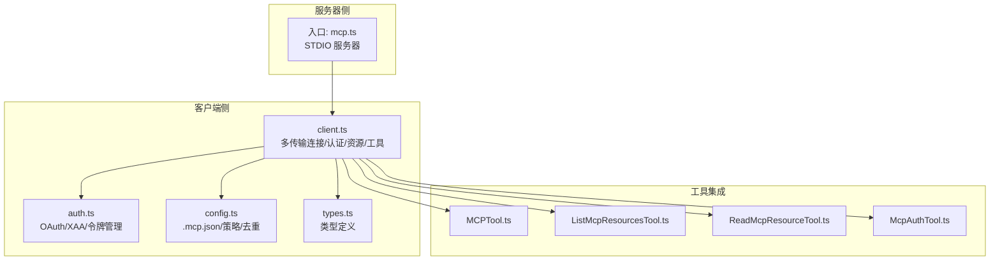
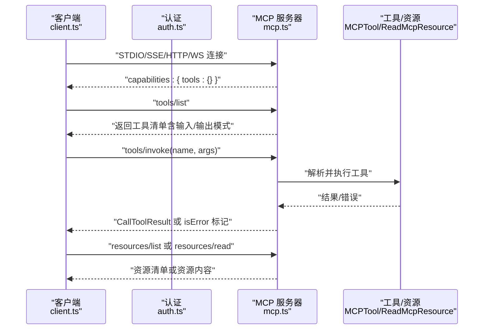
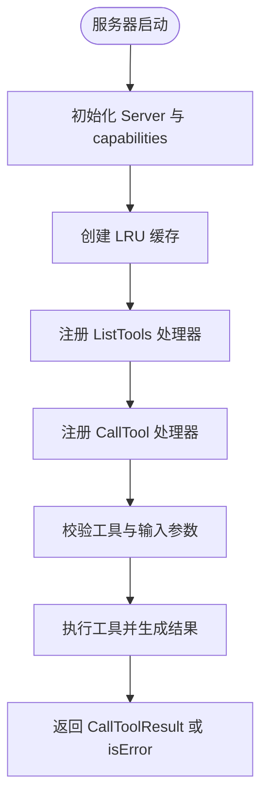
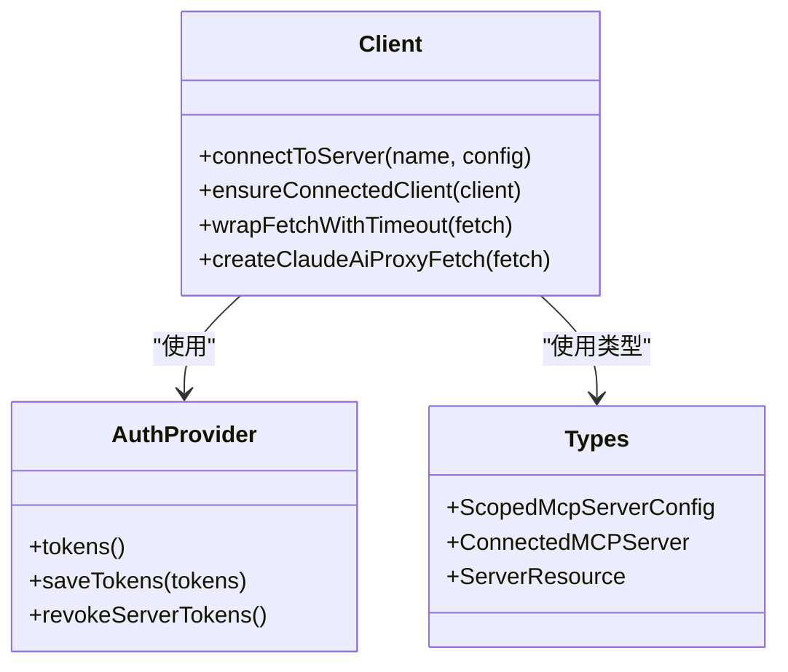
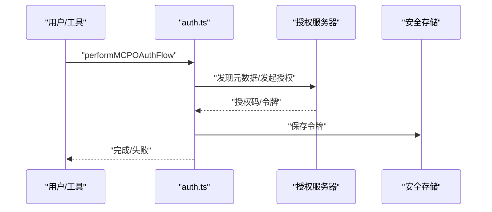
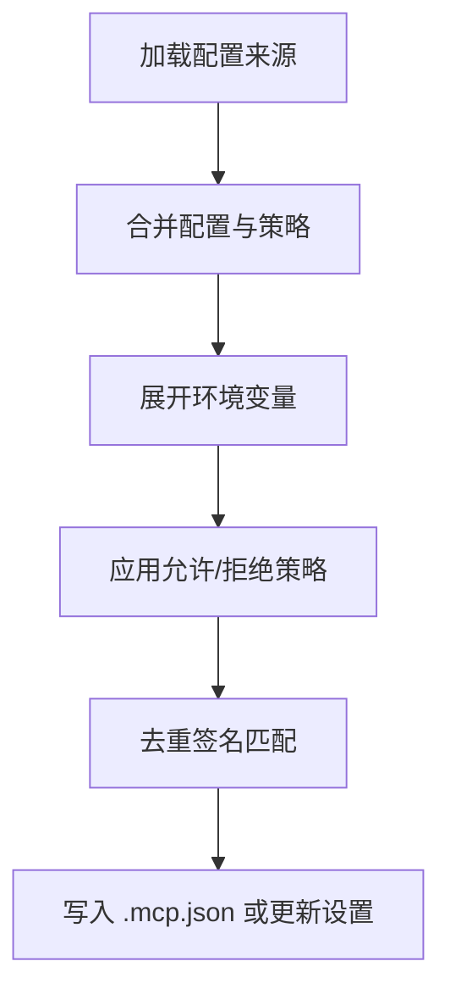
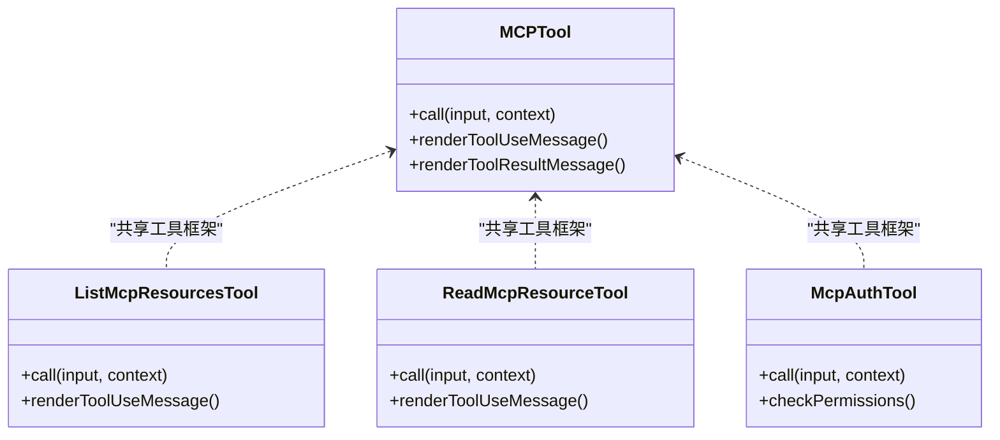
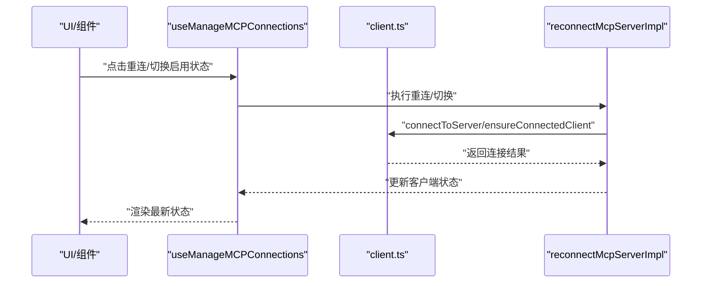
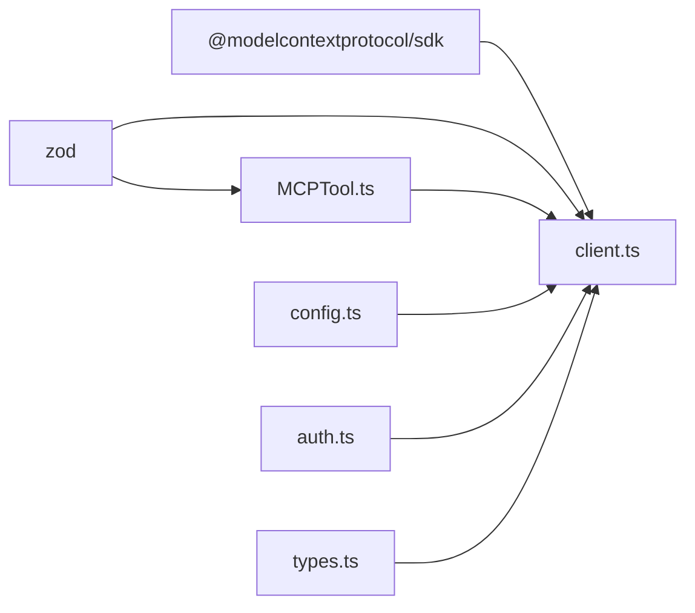

# MCP 协议 API

<cite>
**本文引用的文件**
- [mcp.ts](file://src/entrypoints/mcp.ts)
- [client.ts](file://src/services/mcp/client.ts)
- [auth.ts](file://src/services/mcp/auth.ts)
- [types.ts](file://src/services/mcp/types.ts)
- [config.ts](file://src/services/mcp/config.ts)
- [MCPTool.ts](file://src/tools/MCPTool/MCPTool.ts)
- [ListMcpResourcesTool.ts](file://src/tools/ListMcpResourcesTool/ListMcpResourcesTool.ts)
- [ReadMcpResourceTool.ts](file://src/tools/ReadMcpResourceTool/ReadMcpResourceTool.ts)
- [McpAuthTool.ts](file://src/tools/McpAuthTool/McpAuthTool.ts)
- [useManageMCPConnections.ts](file://src/services/mcp/useManageMCPConnections.ts)
</cite>

## 目录
1. [简介](#简介)
2. [项目结构](#项目结构)
3. [核心组件](#核心组件)
4. [架构总览](#架构总览)
5. [详细组件分析](#详细组件分析)
6. [依赖关系分析](#依赖关系分析)
7. [性能考虑](#性能考虑)
8. [故障排除指南](#故障排除指南)
9. [结论](#结论)
10. [附录](#附录)

## 简介
本文件为 free-code 中 MCP（Model Context Protocol）支持的详细 API 参考文档。内容覆盖 MCP 客户端与服务器接口、连接建立、能力协商、资源发现与工具调用机制；同时涵盖 MCP 服务器配置、认证方法、消息格式与事件处理；以及 MCP 工具集成、资源访问、权限控制与安全验证。文档还提供 MCP 服务器开发指南、客户端实现示例与调试工具使用方法，并包含协议版本兼容性、性能优化与故障排除建议。

## 项目结构
MCP 功能主要分布在以下模块：
- 入口与服务器：src/entrypoints/mcp.ts 提供 MCP 服务器入口，基于 @modelcontextprotocol/sdk 实现 STDIO 传输的 MCP 服务器。
- 客户端与连接管理：src/services/mcp/client.ts 负责多传输类型（STDIO/SSE/HTTP/WS/SDK/claude.ai proxy）的连接、认证、工具与资源发现、错误处理与重连。
- 认证与授权：src/services/mcp/auth.ts 提供 OAuth 发现、令牌刷新、跨应用访问（XAA）等认证流程。
- 配置与策略：src/services/mcp/config.ts 管理 .mcp.json 与设置来源合并、企业策略（允许/拒绝列表）、环境变量展开与去重。
- 类型定义：src/services/mcp/types.ts 定义服务器配置、连接状态、资源与工具序列化等类型。
- 工具集成：src/tools/MCPTool/MCPTool.ts、ListMcpResourcesTool.ts、ReadMcpResourceTool.ts、McpAuthTool.ts 将 MCP 服务器暴露为 Claude Code 工具集。
- 连接生命周期与 UI：src/services/mcp/useManageMCPConnections.ts 提供连接状态管理与重连逻辑。

图表来源
- [mcp.ts:35-196](file://src/entrypoints/mcp.ts#L35-L196)
- [client.ts:1-200](file://src/services/mcp/client.ts#L1-L200)
- [auth.ts:1-120](file://src/services/mcp/auth.ts#L1-L120)
- [config.ts:1-120](file://src/services/mcp/config.ts#L1-L120)
- [types.ts:1-120](file://src/services/mcp/types.ts#L1-L120)
- [MCPTool.ts:1-78](file://src/tools/MCPTool/MCPTool.ts#L1-L78)
- [ListMcpResourcesTool.ts:1-124](file://src/tools/ListMcpResourcesTool/ListMcpResourcesTool.ts#L1-L124)
- [ReadMcpResourceTool.ts:1-159](file://src/tools/ReadMcpResourceTool/ReadMcpResourceTool.ts#L1-L159)
- [McpAuthTool.ts:1-216](file://src/tools/McpAuthTool/McpAuthTool.ts#L1-L216)

章节来源
- [mcp.ts:35-196](file://src/entrypoints/mcp.ts#L35-L196)
- [client.ts:1-200](file://src/services/mcp/client.ts#L1-L200)
- [auth.ts:1-120](file://src/services/mcp/auth.ts#L1-L120)
- [config.ts:1-120](file://src/services/mcp/config.ts#L1-L120)
- [types.ts:1-120](file://src/services/mcp/types.ts#L1-L120)

## 核心组件
- MCP 服务器入口（STDIO）
  - 通过 STDIO 传输启动 MCP 服务器，声明能力为 tools，并注册 ListTools 与 CallTool 请求处理器。
  - 使用 LRU 缓存限制 readFileState 内存占用，避免无限增长。
- MCP 客户端
  - 支持多种传输：STDIO、SSE、HTTP、WebSocket、SDK、claude.ai proxy。
  - 统一的连接缓存与重连策略，支持批量连接与超时控制。
  - 提供资源发现（resources/list）、资源读取（resources/read）、工具调用（tools/invoke）等能力。
- 认证与授权
  - OAuth 自动发现（RFC 9728 → RFC 8414），令牌刷新与失效处理。
  - 跨应用访问（XAA/SEP-990）：一次 IdP 登录复用至所有 XAA 服务器。
  - 本地令牌存储与安全清理，支持服务端令牌撤销。
- 工具与资源
  - 将 MCP 工具与资源封装为 Claude Code 工具，支持只读与并发安全。
  - 列出资源与读取资源，自动处理二进制 blob 存储与路径替换。
- 配置与策略
  - 合并用户/项目/全局/策略来源配置，支持命令/URL/名称匹配的允许/拒绝列表。
  - 去重策略：插件/手动/claude.ai 连接按优先级与签名去重。

章节来源
- [mcp.ts:35-196](file://src/entrypoints/mcp.ts#L35-L196)
- [client.ts:595-800](file://src/services/mcp/client.ts#L595-L800)
- [auth.ts:256-311](file://src/services/mcp/auth.ts#L256-L311)
- [config.ts:223-310](file://src/services/mcp/config.ts#L223-L310)
- [MCPTool.ts:27-78](file://src/tools/MCPTool/MCPTool.ts#L27-L78)
- [ListMcpResourcesTool.ts:40-124](file://src/tools/ListMcpResourcesTool/ListMcpResourcesTool.ts#L40-L124)
- [ReadMcpResourceTool.ts:49-159](file://src/tools/ReadMcpResourceTool/ReadMcpResourceTool.ts#L49-L159)

## 架构总览
下图展示 MCP 客户端与服务器交互的关键流程：连接建立、能力协商、工具与资源发现、工具调用与资源读取。

图表来源
- [mcp.ts:47-96](file://src/entrypoints/mcp.ts#L47-L96)
- [client.ts:595-800](file://src/services/mcp/client.ts#L595-L800)
- [auth.ts:256-311](file://src/services/mcp/auth.ts#L256-L311)
- [ReadMcpResourceTool.ts:75-101](file://src/tools/ReadMcpResourceTool/ReadMcpResourceTool.ts#L75-L101)

## 详细组件分析

### 服务器端：STDIO MCP 服务器
- 初始化
  - 创建 Server 并声明 capabilities 为 tools。
  - 设置工作目录，初始化 LRU 缓存以限制 readFileState。
- 工具发现
  - 通过 getTools 获取可用工具，转换输入/输出模式为 JSON Schema。
  - 输出模式仅保留根级别 type: "object" 的模式，过滤 union/discriminatedUnion 等不兼容模式。
- 工具调用
  - 校验工具启用状态与输入参数。
  - 在工具上下文中注入命令、模型、调试开关等选项。
  - 捕获错误并转换为 isError 结果返回。

图表来源
- [mcp.ts:47-187](file://src/entrypoints/mcp.ts#L47-L187)

章节来源
- [mcp.ts:35-196](file://src/entrypoints/mcp.ts#L35-L196)

### 客户端：连接与传输
- 传输类型
  - STDIO：用于本地进程启动的 MCP 服务器。
  - SSE：长连接事件流，支持认证与代理。
  - HTTP：REST 风格请求，遵循 Streamable HTTP 规范（Accept: application/json, text/event-stream）。
  - WebSocket：持久连接，支持代理与 mTLS。
  - SDK：内联 SDK 客户端（无需外部进程）。
  - claude.ai proxy：通过会话入口令牌转发到远端 MCP。
- 连接与重连
  - 使用 memoize 缓存连接，批量连接与超时控制。
  - 对于 401/会话过期错误进行分类与重试，必要时清除缓存后重新连接。
- 资源与工具
  - resources/list 与 resources/read，自动处理二进制 blob 存储与路径替换。
  - 工具调用统一超时控制（默认约 27.8 小时，可通过环境变量覆盖）。

图表来源
- [client.ts:595-800](file://src/services/mcp/client.ts#L595-L800)
- [auth.ts:325-341](file://src/services/mcp/auth.ts#L325-L341)
- [types.ts:163-227](file://src/services/mcp/types.ts#L163-L227)

章节来源
- [client.ts:595-800](file://src/services/mcp/client.ts#L595-L800)
- [types.ts:23-135](file://src/services/mcp/types.ts#L23-L135)

### 认证与授权
- OAuth 发现与令牌管理
  - 自动发现授权服务器元数据（RFC 9728 → RFC 8414），支持自定义元数据 URL（HTTPS）。
  - 令牌刷新与无效令牌处理，标准化非标准错误码（如 invalid_refresh_token）。
  - 令牌撤销：先撤销刷新令牌，再撤销访问令牌；支持 RFC 7009 与回退方案。
- 跨应用访问（XAA/SEP-990）
  - 一次 IdP 登录复用至多个 XAA 服务器，支持 IdP 与 AS 分离。
  - 失败阶段可细分为 IdP 登录、发现、令牌交换、JWT Bearer。
- 本地存储与清理
  - 安全存储密钥链槽位，支持清理与跨会话复用。
  - 令牌变更时触发分析事件与日志记录。

图表来源
- [auth.ts:664-800](file://src/services/mcp/auth.ts#L664-L800)

章节来源
- [auth.ts:256-311](file://src/services/mcp/auth.ts#L256-L311)
- [auth.ts:664-800](file://src/services/mcp/auth.ts#L664-L800)

### 配置与策略
- 配置来源与合并
  - 支持 local/user/project/dynamic/enterprise/claudeai/managed 等作用域。
  - 合并策略：用户/项目/全局配置与策略设置合并，动态与企业配置具有更高优先级。
- 企业策略
  - 允许/拒绝列表：支持名称、命令数组（stdio）、URL 模式（通配符）匹配。
  - URL 去重：忽略 env 与 headers，基于命令/URL 计算签名，抑制重复。
- 策略应用
  - 插件 MCP 服务器与手动配置去重；claude.ai 连接与手动配置去重。
  - SDK 类型服务器不受策略影响，保持内联行为。

图表来源
- [config.ts:69-81](file://src/services/mcp/config.ts#L69-L81)
- [config.ts:223-310](file://src/services/mcp/config.ts#L223-L310)
- [config.ts:417-508](file://src/services/mcp/config.ts#L417-L508)

章节来源
- [config.ts:69-81](file://src/services/mcp/config.ts#L69-L81)
- [config.ts:223-310](file://src/services/mcp/config.ts#L223-L310)
- [config.ts:417-508](file://src/services/mcp/config.ts#L417-L508)

### 工具与资源集成
- MCP 工具
  - MCPTool.ts：通用 MCP 工具包装，支持 UI 渲染与权限检查。
- 资源工具
  - ListMcpResourcesTool.ts：列出已连接服务器的资源，支持按服务器过滤。
  - ReadMcpResourceTool.ts：读取指定资源，自动处理二进制 blob 存储与路径替换。
- 认证工具
  - McpAuthTool.ts：为未认证的服务器生成“认证”伪工具，触发 OAuth 流程并在完成后自动切换为真实工具。

图表来源
- [MCPTool.ts:27-78](file://src/tools/MCPTool/MCPTool.ts#L27-L78)
- [ListMcpResourcesTool.ts:40-124](file://src/tools/ListMcpResourcesTool/ListMcpResourcesTool.ts#L40-L124)
- [ReadMcpResourceTool.ts:49-159](file://src/tools/ReadMcpResourceTool/ReadMcpResourceTool.ts#L49-L159)
- [McpAuthTool.ts:49-216](file://src/tools/McpAuthTool/McpAuthTool.ts#L49-L216)

章节来源
- [MCPTool.ts:27-78](file://src/tools/MCPTool/MCPTool.ts#L27-L78)
- [ListMcpResourcesTool.ts:40-124](file://src/tools/ListMcpResourcesTool/ListMcpResourcesTool.ts#L40-L124)
- [ReadMcpResourceTool.ts:49-159](file://src/tools/ReadMcpResourceTool/ReadMcpResourceTool.ts#L49-L159)
- [McpAuthTool.ts:49-216](file://src/tools/McpAuthTool/McpAuthTool.ts#L49-L216)

### 连接生命周期与 UI
- 重连与状态管理
  - reconnectMcpServerImpl：根据连接状态与配置变化进行重连，清理缓存并恢复连接。
  - ensureConnectedClient：确保工具/资源调用前的连接有效性。
- UI 交互
  - useManageMCPConnections：提供重连、启用/禁用服务器等操作，稳定回调避免重复创建。

图表来源
- [useManageMCPConnections.ts:1043-1083](file://src/services/mcp/useManageMCPConnections.ts#L1043-L1083)
- [client.ts:1690-1706](file://src/services/mcp/client.ts#L1690-L1706)

章节来源
- [useManageMCPConnections.ts:1043-1083](file://src/services/mcp/useManageMCPConnections.ts#L1043-L1083)
- [client.ts:1690-1706](file://src/services/mcp/client.ts#L1690-L1706)

## 依赖关系分析
- 外部依赖
  - @modelcontextprotocol/sdk：提供客户端/服务器 SDK、传输层（STDIO/SSE/HTTP/WS）、类型与错误定义。
  - zod：用于 JSON Schema 与输入/输出模式转换。
  - lodash-es：常用工具函数（mapValues/memoize/pMap 等）。
- 内部依赖
  - 工具系统：Tool.js、tools.js、utils/* 提供工具构建、权限与消息处理。
  - 配置系统：config.js、settings/* 提供配置合并与策略。
  - 日志与分析：log.js、analytics/index.js 提供调试与遥测。

图表来源
- [client.ts:1-50](file://src/services/mcp/client.ts#L1-L50)
- [MCPTool.ts:1-20](file://src/tools/MCPTool/MCPTool.ts#L1-L20)
- [config.ts:1-50](file://src/services/mcp/config.ts#L1-L50)
- [auth.ts:1-20](file://src/services/mcp/auth.ts#L1-L20)
- [types.ts:1-10](file://src/services/mcp/types.ts#L1-L10)

章节来源
- [client.ts:1-50](file://src/services/mcp/client.ts#L1-L50)
- [MCPTool.ts:1-20](file://src/tools/MCPTool/MCPTool.ts#L1-L20)
- [config.ts:1-50](file://src/services/mcp/config.ts#L1-L50)
- [auth.ts:1-20](file://src/services/mcp/auth.ts#L1-L20)
- [types.ts:1-10](file://src/services/mcp/types.ts#L1-L10)

## 性能考虑
- 连接缓存与批量连接
  - connectToServer 使用 memoize 缓存连接，减少重复握手开销。
  - 批量连接大小可通过环境变量 MCP_SERVER_CONNECTION_BATCH_SIZE 控制，默认 3。
- 超时与信号
  - wrapFetchWithTimeout 为每个请求创建独立超时信号，避免单次 AbortSignal.timeout() 导致后续请求立即超时的问题。
  - GET 请求（SSE）不应用请求超时，避免中断长连接。
- 资源与工具调用
  - 工具调用默认超时约 27.8 小时（可通过 MCP_TOOL_TIMEOUT 覆盖），避免长时间阻塞。
  - 服务器端对工具输出进行截断与大小估算，防止内存膨胀。
- 缓存与去重
  - readFileState 使用 LRU 缓存限制内存增长。
  - 资源列表与连接状态通过 LRU 缓存与事件通知进行一致性维护。

章节来源
- [client.ts:492-550](file://src/services/mcp/client.ts#L492-L550)
- [client.ts:552-561](file://src/services/mcp/client.ts#L552-L561)
- [client.ts:224-229](file://src/services/mcp/client.ts#L224-L229)
- [mcp.ts:40-46](file://src/entrypoints/mcp.ts#L40-L46)
- [ListMcpResourcesTool.ts:79-84](file://src/tools/ListMcpResourcesTool/ListMcpResourcesTool.ts#L79-L84)

## 故障排除指南
- 认证问题
  - 401/会话过期：区分通用 404 与 MCP 会话过期（JSON-RPC -32001），必要时清除连接缓存后重连。
  - OAuth 失败：检查元数据发现、令牌刷新与错误归一化；关注非标准错误码映射。
  - XAA 失败：按阶段定位（IdP 登录/发现/令牌交换/JWT Bearer），必要时清理 IdP 缓存令牌。
- 连接问题
  - 传输异常：检查代理、TLS、SSE/HTTP Accept 头、WebSocket 协议与会话入口令牌。
  - 重连失败：确认配置未变更导致需要重建连接；查看连接统计与日志。
- 工具与资源
  - 工具不可用：确认服务器 capabilities 是否包含 tools；检查工具启用状态与输入模式。
  - 资源为空：确认服务器 capabilities 是否包含 resources；检查资源列表缓存与 onclose 事件后的重连。
- 配置问题
  - 企业策略阻止：检查允许/拒绝列表与 URL 模式匹配；确认去重策略是否误删。
  - .mcp.json 写入失败：检查文件权限与原子写入流程。

章节来源
- [client.ts:193-206](file://src/services/mcp/client.ts#L193-L206)
- [client.ts:340-361](file://src/services/mcp/client.ts#L340-L361)
- [auth.ts:157-191](file://src/services/mcp/auth.ts#L157-L191)
- [auth.ts:664-800](file://src/services/mcp/auth.ts#L664-L800)
- [config.ts:417-508](file://src/services/mcp/config.ts#L417-L508)

## 结论
free-code 的 MCP 支持在客户端与服务器两端均提供了完善的实现：服务器端通过 STDIO 快速暴露工具与资源，客户端支持多传输与强健的认证、连接与资源管理。配合企业策略与配置合并，MCP 能够在复杂环境中安全、高效地运行。工具与资源的封装使 MCP 无缝融入 Claude Code 的工具生态，提升模型对上下文与工具的利用效率。

## 附录

### MCP 协议版本兼容性
- 传输规范
  - Streamable HTTP：要求在 POST 请求中包含 Accept: application/json, text/event-stream。
  - WebSocket：使用协议 mcp。
- 错误码
  - 会话过期：HTTP 404 + JSON-RPC code -32001。
  - OAuth 错误：标准化非标准错误码（如 invalid_refresh_token）为 invalid_grant。
- 版本信息
  - 服务器端通过 MACRO.VERSION 注入版本号，便于客户端识别。

章节来源
- [client.ts:463-471](file://src/services/mcp/client.ts#L463-L471)
- [client.ts:193-206](file://src/services/mcp/client.ts#L193-L206)
- [auth.ts:177-184](file://src/services/mcp/auth.ts#L177-L184)
- [mcp.ts:48-51](file://src/entrypoints/mcp.ts#L48-L51)

### MCP 服务器开发指南
- 服务器能力
  - 至少声明 capabilities.tools。
  - 提供 tools/list 与 tools/invoke。
- 输入/输出模式
  - 使用 zod 转换为 JSON Schema；根级别需为 object。
  - 过滤 union/discriminatedUnion 等不兼容模式。
- 连接与调试
  - 使用 STDIO 作为最小实现入口。
  - 开启 debug/verbose 参数以便诊断。

章节来源
- [mcp.ts:53-96](file://src/entrypoints/mcp.ts#L53-L96)
- [mcp.ts:99-187](file://src/entrypoints/mcp.ts#L99-L187)

### 客户端实现示例
- 连接远程服务器
  - SSE/HTTP/WS：配置 URL、头与可选 OAuth；使用 wrapFetchWithTimeout 与认证提供者。
  - claude.ai proxy：通过会话入口令牌转发请求。
- 工具与资源
  - tools/invoke：传入工具名与参数，处理 isError 标记与 _meta。
  - resources/list/read：按服务器过滤与并发读取，自动处理二进制 blob。

章节来源
- [client.ts:619-800](file://src/services/mcp/client.ts#L619-L800)
- [client.ts:1690-1706](file://src/services/mcp/client.ts#L1690-L1706)
- [ReadMcpResourceTool.ts:75-101](file://src/tools/ReadMcpResourceTool/ReadMcpResourceTool.ts#L75-L101)

### 调试工具使用
- 日志与分析
  - 使用 logMCPDebug/logMCPError 输出调试信息。
  - 关注 tengu_mcp_* 事件（如 needs_auth、oauth_flow_success、session_expired 等）。
- 环境变量
  - MCP_TIMEOUT：连接超时（毫秒）。
  - MCP_TOOL_TIMEOUT：工具调用超时（毫秒）。
  - MCP_SERVER_CONNECTION_BATCH_SIZE：批量连接大小。
  - MCP_REMOTE_SERVER_CONNECTION_BATCH_SIZE：远程批量连接大小。
  - MCP_REQUEST_TIMEOUT_MS：请求超时（默认 60000）。

章节来源
- [client.ts:456-464](file://src/services/mcp/client.ts#L456-L464)
- [client.ts:552-561](file://src/services/mcp/client.ts#L552-L561)
- [client.ts:224-229](file://src/services/mcp/client.ts#L224-L229)
- [auth.ts:65-65](file://src/services/mcp/auth.ts#L65-L65)