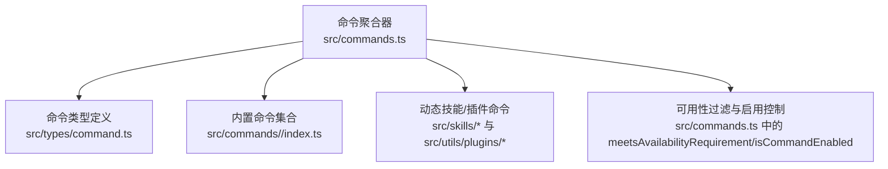
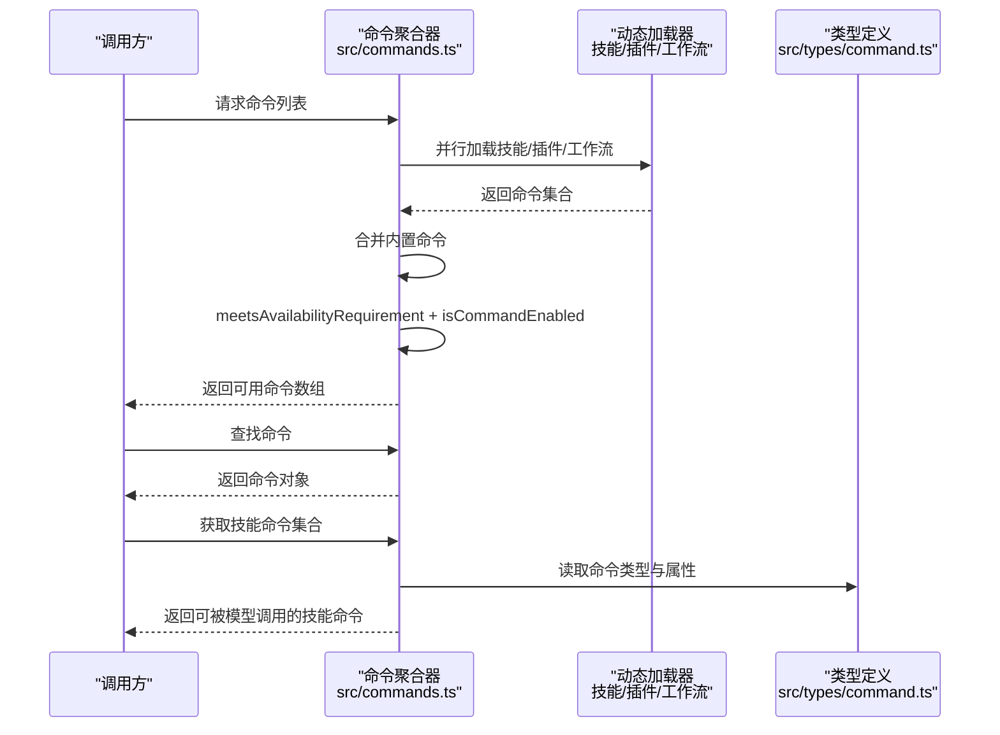
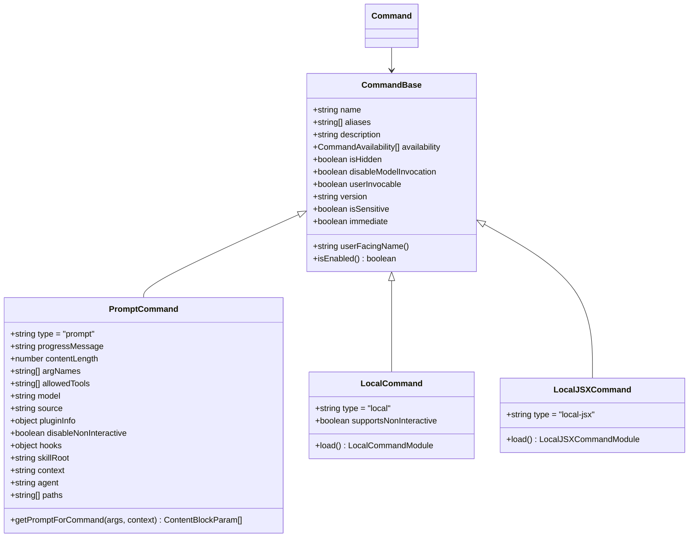
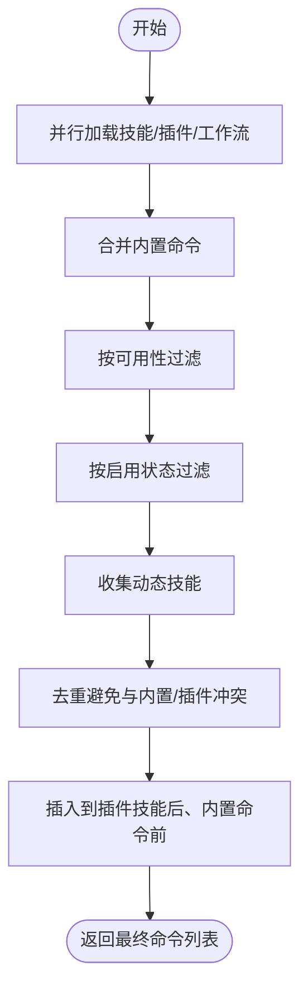
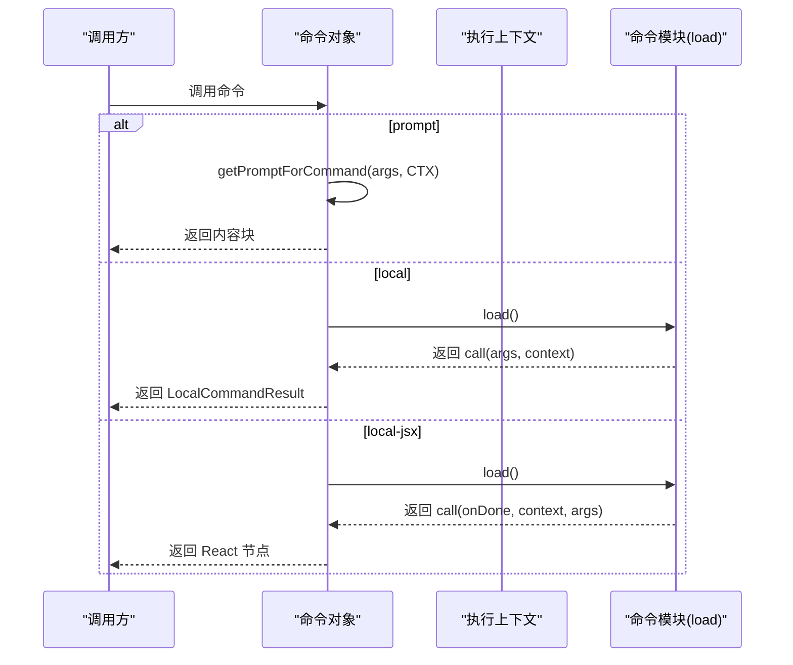
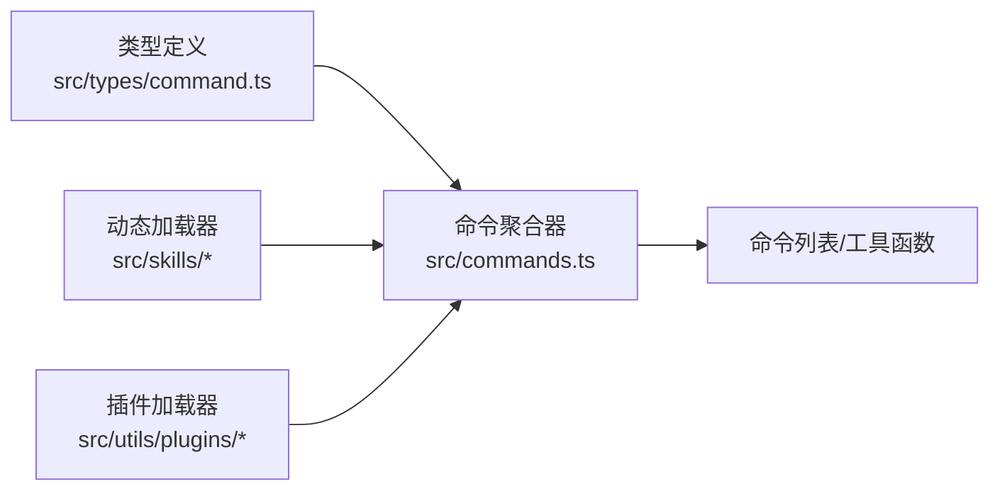

# 内置命令

<cite>
**本文引用的文件**
- [src/commands.ts](file://src/commands.ts)
- [src/times/command.ts](file://src/times/command.ts)
- [src/types/command.ts](file://src/types/command.ts)
</cite>

## 目录
1. [简介](#简介)
2. [项目结构](#项目结构)
3. [核心组件](#核心组件)
4. [架构总览](#架构总览)
5. [详细组件分析](#详细组件分析)
6. [依赖关系分析](#依赖关系分析)
7. [性能考量](#性能考量)
8. [故障排查指南](#故障排查指南)
9. [结论](#结论)
10. [附录](#附录)

## 简介
本文件为 free-code 的内置命令系统提供详细的 API 参考与使用说明。内容覆盖命令注册机制、命令执行流程、参数与返回值规范、命令类型与属性、执行上下文、错误处理、命令过滤与安全限制（REMOTE_SAFE_COMMANDS、BRIDGE_SAFE_COMMANDS），以及动态加载、缓存与性能优化建议。目标是帮助开发者与使用者准确理解并正确使用内置命令。

## 项目结构
内置命令系统的核心位于以下文件：
- 命令聚合与导出：src/commands.ts
- 命令类型定义：src/types/command.ts
- 典型命令实现示例（按需参考）：src/commands/<command>/index.ts 或对应入口文件

图表来源
- [src/commands.ts:255-346](file://src/commands.ts#L255-L346)
- [src/types/command.ts:175-206](file://src/types/command.ts#L175-L206)

章节来源
- [src/commands.ts:1-755](file://src/commands.ts#L1-L755)
- [src/types/command.ts:1-217](file://src/types/command.ts#L1-L217)

## 核心组件
- 命令类型与属性
  - 命令基础属性：名称、别名、描述、可用性要求、是否启用、是否隐藏、版本、是否可被模型调用等。
  - 命令类型：
    - prompt：面向模型的提示型命令，支持进度消息、内容长度、模型选择、工具白名单、上下文策略（内联/分叉）、路径匹配等。
    - local：本地命令，支持非交互式调用，延迟加载实现模块，返回文本或压缩结果。
    - local-jsx：本地 JSX 命令，延迟加载渲染组件，用于终端 UI 交互。
  - 执行上下文：ToolUseContext、LocalJSXCommandContext 提供消息更新、主题、IDE 安装状态、动态 MCP 配置等能力。
- 命令注册与发现
  - 统一从 src/commands.ts 聚合导出，内部通过 memoize 缓存命令列表，避免重复加载。
  - 支持动态技能、插件技能、工作流命令的动态注入，并在运行时进行去重与排序。
- 过滤与安全
  - REMOTE_SAFE_COMMANDS：远程模式下仅允许影响本地 TUI 状态的命令。
  - BRIDGE_SAFE_COMMANDS：远程桥接（移动端/网页）下允许执行的本地命令集合。
  - isBridgeSafeCommand：综合判断命令类型与白名单，确保安全。
- 工具函数
  - getCommands：获取当前用户可用的命令列表（含动态技能）。
  - getSkillToolCommands / getSlashCommandToolSkills：筛选可用于模型调用的“技能”命令。
  - findCommand / getCommand：按名称或别名查找命令。
  - formatDescriptionWithSource：为 UI 展示添加来源标注。

章节来源
- [src/types/command.ts:16-217](file://src/types/command.ts#L16-L217)
- [src/commands.ts:255-517](file://src/commands.ts#L255-L517)
- [src/commands.ts:619-686](file://src/commands.ts#L619-L686)
- [src/commands.ts:688-754](file://src/commands.ts#L688-L754)

## 架构总览
内置命令系统采用“集中注册 + 动态扩展 + 运行时过滤”的架构。命令来源包括：
- 内置命令（commands 目录）
- 技能目录命令（skills）
- 插件命令与技能
- 工作流命令
- MCP 提供的技能

图表来源
- [src/commands.ts:449-517](file://src/commands.ts#L449-L517)
- [src/commands.ts:563-608](file://src/commands.ts#L563-L608)
- [src/types/command.ts:175-206](file://src/types/command.ts#L175-L206)

## 详细组件分析

### 命令类型与属性
- 类型定义
  - PromptCommand：适用于模型调用，包含进度消息、内容长度、模型选择、工具白名单、上下文策略（内联/分叉）、路径过滤、钩子设置等。
  - LocalCommand：本地命令，支持非交互式调用，延迟加载实现模块，返回文本或压缩结果。
  - LocalJSXCommand：本地 JSX 命令，延迟加载渲染组件，适合终端 UI 交互。
- 命令基础属性
  - 可用性要求 availability：支持 claude-ai 与 console 两类环境。
  - 启用状态 isEnabled：默认启用，可通过自定义函数按条件启用。
  - 是否隐藏 isHidden：用于在自动完成/帮助中隐藏。
  - 版本号 version、是否敏感 isSensitive、是否立即执行 immediate 等。
  - 用户可见名称 userFacingName：可覆盖默认显示名称。
- 执行上下文
  - ToolUseContext：通用工具使用上下文。
  - LocalJSXCommandContext：扩展了消息更新、主题、IDE 安装状态、动态 MCP 配置、恢复会话等能力。

图表来源
- [src/types/command.ts:16-217](file://src/types/command.ts#L16-L217)

章节来源
- [src/types/command.ts:16-217](file://src/types/command.ts#L16-L217)

### 命令注册与动态加载
- 注册机制
  - 在 src/commands.ts 中统一导入各命令模块，并通过 memoize 缓存命令列表，避免重复初始化。
  - 支持按特性开关（feature flags）有条件加载命令（如 BRIDGE_MODE、VOICE_MODE、WORKFLOW_SCRIPTS 等）。
- 动态加载
  - 技能目录命令、插件命令与技能、工作流命令通过异步加载并在运行时合并。
  - getSkills 并行加载技能目录与插件技能，失败时记录日志并继续运行。
- 去重与排序
  - 动态技能与内置命令去重；插入到插件技能之后、内置命令之前的位置。

图表来源
- [src/commands.ts:449-517](file://src/commands.ts#L449-L517)
- [src/commands.ts:353-398](file://src/commands.ts#L353-L398)

章节来源
- [src/commands.ts:255-346](file://src/commands.ts#L255-L346)
- [src/commands.ts:449-517](file://src/commands.ts#L449-L517)
- [src/commands.ts:353-398](file://src/commands.ts#L353-L398)

### 命令执行流程
- prompt 命令
  - 通过 getPromptForCommand(args, context) 生成内容块，供模型消费。
  - 支持路径过滤、上下文策略（内联/分叉）、工具白名单等。
- local 命令
  - 通过 load() 模块延迟加载实现，调用 call(args, context) 返回 LocalCommandResult。
  - 返回类型支持文本、压缩结果或跳过消息。
- local-jsx 命令
  - 通过 load() 模块延迟加载实现，调用 call(onDone, context, args) 返回 React 节点。
  - onDone 支持显示方式、是否继续对话、元消息插入等选项。

图表来源
- [src/types/command.ts:53-152](file://src/types/command.ts#L53-L152)

章节来源
- [src/types/command.ts:53-152](file://src/types/command.ts#L53-L152)

### 参数验证与返回值规范
- 参数验证
  - 命令基础属性中的 availability、isEnabled、isHidden、disableModelInvocation 等共同决定命令是否可见与可用。
  - prompt 命令支持 argNames、allowedTools、paths 等约束。
- 返回值
  - local 命令返回 LocalCommandResult：文本、压缩结果或跳过。
  - local-jsx 命令返回 React 节点，通过 onDone 控制后续行为。
  - prompt 命令返回内容块，供模型消费。

章节来源
- [src/types/command.ts:16-152](file://src/types/command.ts#L16-L152)

### 命令执行上下文
- ToolUseContext：通用上下文，包含消息、日志、配置等。
- LocalJSXCommandContext：扩展能力包括消息更新、主题、IDE 安装状态、动态 MCP 配置、恢复会话回调等。

章节来源
- [src/types/command.ts:80-98](file://src/types/command.ts#L80-L98)

### 错误处理机制
- 动态加载失败
  - getSkills 对技能目录与插件技能加载分别捕获异常，记录错误日志并继续运行。
- 技能加载失败
  - getSlashCommandToolSkills 捕获异常并返回空数组，避免影响整体功能。
- 命令不存在
  - getCommand 抛出 ReferenceError，并提供可用命令列表提示。

章节来源
- [src/commands.ts:359-397](file://src/commands.ts#L359-L397)
- [src/commands.ts:600-606](file://src/commands.ts#L600-L606)
- [src/commands.ts:704-719](file://src/commands.ts#L704-L719)

### 命令过滤与安全限制
- REMOTE_SAFE_COMMANDS
  - 仅包含对本地 TUI 状态有影响且不依赖本地文件系统/IDE/Shell 的命令，用于远程模式预过滤。
- BRIDGE_SAFE_COMMANDS
  - 仅包含可在远程桥接（移动端/网页）上执行的本地命令，返回文本输出且无终端副作用。
- isBridgeSafeCommand
  - prompt 命令默认安全；local 命令需显式加入白名单；local-jsx 命令始终阻断。

章节来源
- [src/commands.ts:619-686](file://src/commands.ts#L619-L686)
- [src/commands.ts:672-676](file://src/commands.ts#L672-L676)

### 命令调用示例（语法与流程）
- 列出可用命令
  - 使用 getCommands(cwd) 获取当前用户可用命令列表（含动态技能）。
- 查找命令
  - 使用 findCommand(name, commands) 或 getCommand(name, commands) 获取命令对象。
- 执行命令
  - prompt：调用 getPromptForCommand(args, context) 获取内容块。
  - local：先 load()，再调用 call(args, context) 获取 LocalCommandResult。
  - local-jsx：先 load()，再调用 call(onDone, context, args) 渲染 UI。
- 结果处理
  - local：根据返回类型处理文本或压缩结果。
  - local-jsx：通过 onDone 控制显示方式与后续输入。
  - prompt：将内容块发送给模型。

章节来源
- [src/commands.ts:476-517](file://src/commands.ts#L476-L517)
- [src/commands.ts:688-719](file://src/commands.ts#L688-L719)
- [src/types/command.ts:53-152](file://src/types/command.ts#L53-L152)

## 依赖关系分析
- 命令聚合器依赖类型定义与工具函数，负责命令的注册、动态加载、过滤与缓存。
- 命令类型定义为所有命令提供统一的结构与约束。
- 动态技能与插件命令通过独立模块加载，降低启动成本并提升灵活性。

图表来源
- [src/commands.ts:449-517](file://src/commands.ts#L449-L517)
- [src/types/command.ts:175-206](file://src/types/command.ts#L175-L206)

章节来源
- [src/commands.ts:449-517](file://src/commands.ts#L449-L517)
- [src/types/command.ts:175-206](file://src/types/command.ts#L175-L206)

## 性能考量
- 缓存策略
  - loadAllCommands、getSkillToolCommands、getSlashCommandToolSkills 使用 memoize 缓存，避免重复磁盘 I/O 与动态导入。
  - clearCommandMemoizationCaches 仅清除命令相关缓存，不清理技能缓存，便于增量更新。
- 并行加载
  - getSkills 与插件命令、工作流命令并行加载，缩短启动时间。
- 动态注入
  - 动态技能在运行时注入，避免静态引入带来的体积与启动开销。
- 建议
  - 在频繁切换工作区时，合理使用 clearCommandsCache 清理缓存，确保最新命令生效。
  - 对于大型技能目录，建议按需启用相关特性开关，减少不必要的加载。

章节来源
- [src/commands.ts:523-539](file://src/commands.ts#L523-L539)
- [src/commands.ts:449-458](file://src/commands.ts#L449-L458)
- [src/commands.ts:563-581](file://src/commands.ts#L563-L581)
- [src/commands.ts:586-608](file://src/commands.ts#L586-L608)

## 故障排查指南
- 命令未出现
  - 检查 availability 与 isEnabled 是否满足当前环境与启用状态。
  - 确认命令是否被动态技能去重或未正确注入。
- 命令执行报错
  - 对于动态加载失败：查看日志中关于技能/插件加载失败的记录，确认文件权限与路径。
  - 对于命令不存在：使用 getCommand 获取可用命令列表，核对名称与别名。
- 远程/桥接不可用
  - 检查命令是否在 REMOTE_SAFE_COMMANDS 或 BRIDGE_SAFE_COMMANDS 白名单中。
  - 确认命令类型不是 local-jsx（该类型在桥接中始终阻断）。

章节来源
- [src/commands.ts:417-443](file://src/commands.ts#L417-L443)
- [src/commands.ts:619-686](file://src/commands.ts#L619-L686)
- [src/commands.ts:704-719](file://src/commands.ts#L704-L719)

## 结论
free-code 的内置命令系统通过统一的类型定义、集中注册与动态扩展机制，实现了灵活、可维护且高性能的命令生态。配合 REMOTE_SAFE_COMMANDS 与 BRIDGE_SAFE_COMMANDS 的安全过滤，既保证了远程与移动端的可用性，又确保了执行安全。建议在开发新命令时遵循现有类型与上下文约定，并充分利用缓存与并行加载机制以获得最佳性能。

## 附录
- 常用工具函数速览
  - getCommands(cwd)：获取可用命令列表
  - getSkillToolCommands(cwd)：获取可用于模型调用的技能命令
  - getSlashCommandToolSkills(cwd)：获取“/”命令形式的技能集合
  - findCommand / getCommand：按名称/别名查找命令
  - formatDescriptionWithSource：为 UI 展示添加来源标注
  - clearCommandsCache / clearCommandMemoizationCaches：清理缓存

章节来源
- [src/commands.ts:476-517](file://src/commands.ts#L476-L517)
- [src/commands.ts:563-608](file://src/commands.ts#L563-L608)
- [src/commands.ts:688-754](file://src/commands.ts#L688-L754)