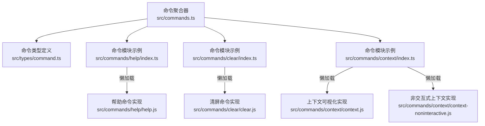
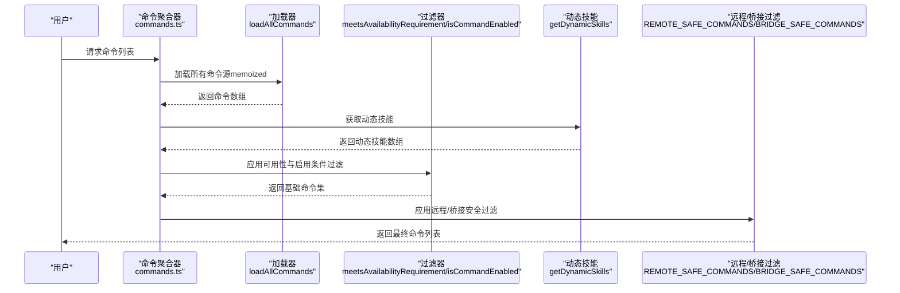
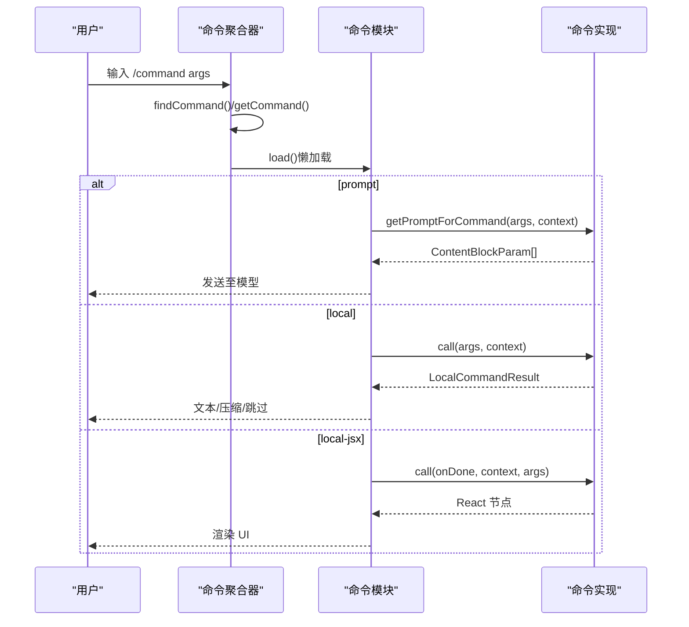
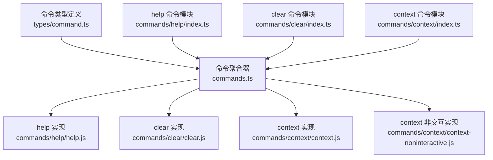

# 命令 API

<cite>
**本文引用的文件**
- [src/commands.ts](file://src/commands.ts)
- [src/types/command.ts](file://src/types/command.ts)
- [src/commands/help/index.ts](file://src/commands/help/index.ts)
- [src/commands/clear/index.ts](file://src/commands/clear/index.ts)
- [src/commands/context/index.ts](file://src/commands/context/index.ts)
</cite>

## 目录
1. [简介](#简介)
2. [项目结构](#项目结构)
3. [核心组件](#核心组件)
4. [架构总览](#架构总览)
5. [详细组件分析](#详细组件分析)
6. [依赖关系分析](#依赖关系分析)
7. [性能考量](#性能考量)
8. [故障排查指南](#故障排查指南)
9. [结论](#结论)
10. [附录](#附录)

## 简介
本文件为 free-code 的命令系统提供详细的 API 参考与使用说明。内容覆盖命令注册机制、命令类型与属性、命令执行上下文、参数与返回值规范、命令过滤与安全限制、动态加载与缓存策略，以及常见问题排查与性能优化建议。目标是帮助开发者与使用者准确理解命令 API 的行为与约束，并在不同运行模式（本地、远程、桥接）下正确使用命令。

## 项目结构
命令系统的核心由以下部分组成：
- 命令聚合与导出：集中声明与导出所有命令，负责动态加载、可用性过滤、缓存管理与安全过滤。
- 命令类型定义：统一定义命令的元数据、类型（prompt、local、local-jsx）、执行上下文与返回值格式。
- 具体命令模块：每个命令以独立模块形式存在，暴露最小元数据与懒加载入口，避免启动时的重负载。

图表来源
- [src/commands.ts](file://src/commands.ts)
- [src/types/command.ts](file://src/types/command.ts)
- [src/commands/help/index.ts](file://src/commands/help/index.ts)
- [src/commands/clear/index.ts](file://src/commands/clear/index.ts)
- [src/commands/context/index.ts](file://src/commands/context/index.ts)

章节来源
- [src/commands.ts](file://src/commands.ts)
- [src/types/command.ts](file://src/types/command.ts)
- [src/commands/help/index.ts](file://src/commands/help/index.ts)
- [src/commands/clear/index.ts](file://src/commands/clear/index.ts)
- [src/commands/context/index.ts](file://src/commands/context/index.ts)

## 核心组件
- 命令聚合器（commands.ts）
  - 职责：收集内置命令、技能命令、插件命令、工作流命令；按可用性与启用状态过滤；提供远程/桥接安全过滤；提供命令查询与去重；提供缓存清理与动态技能插入。
  - 关键函数与集合：
    - getCommands(cwd)：获取当前用户可用的命令列表（含动态技能）。
    - loadAllCommands(cwd)：加载所有命令源（memoized）。
    - meetsAvailabilityRequirement(cmd)：按认证/提供商要求过滤。
    - REMOTE_SAFE_COMMANDS、BRIDGE_SAFE_COMMANDS：远程/桥接安全命令白名单。
    - getSkillToolCommands(cwd)、getSlashCommandToolSkills(cwd)：模型可调用技能筛选。
    - findCommand()/getCommand()/hasCommand()：命令查找与校验。
    - clearCommandsCache()/clearCommandMemoizationCaches()：缓存清理。
- 命令类型定义（types/command.ts）
  - 职责：定义命令元数据、类型、执行上下文、返回值格式与可用性标注。
  - 关键类型：
    - CommandBase：命令通用字段（名称、别名、描述、可用性、启用条件、来源等）。
    - PromptCommand：面向模型的提示型命令，包含内容长度、进度消息、工具允许列表、上下文策略等。
    - LocalCommand：本地命令，支持懒加载与非交互式标志。
    - LocalJSXCommand：渲染 Ink 组件的本地命令，支持懒加载。
    - Command：三类命令的联合类型。
    - LocalCommandResult：本地命令返回值类型（文本、压缩结果、跳过）。
    - LocalJSXCommandContext：渲染型命令的上下文扩展（主题、IDE 状态、会话恢复等）。
    - CommandResultDisplay：命令完成后的显示策略（跳过、系统、用户）。

章节来源
- [src/commands.ts](file://src/commands.ts)
- [src/types/command.ts](file://src/types/command.ts)

## 架构总览
命令系统采用“聚合 + 懒加载 + 过滤 + 缓存”的架构设计，确保启动性能与运行灵活性兼顾。命令来源包括内置命令、技能目录、插件、工作流与 MCP 提供的技能。系统在不同运行模式下对命令进行预过滤，保证远程/桥接场景的安全性与一致性。

图表来源
- [src/commands.ts](file://src/commands.ts)

## 详细组件分析

### 命令类型与属性
- 类型
  - prompt：面向模型的提示型命令，支持内容长度估算、进度消息、工具白名单、上下文策略（内联/分叉）、代理类型、路径匹配等。
  - local：本地命令，支持懒加载与非交互式标志，返回文本或压缩结果。
  - local-jsx：渲染 Ink 组件的本地命令，支持懒加载，适合复杂 UI 场景。
- 属性
  - 基础属性：名称、别名、描述、是否隐藏、版本、可用性要求、启用条件、来源标记、是否禁用模型调用、是否用户可调用、是否敏感参数等。
  - prompt 特有：进度消息、内容长度、允许工具、模型指定、钩子设置、技能根目录、上下文策略、代理类型、努力值、路径匹配、提示生成函数。
  - local/local-jsx 特有：懒加载函数、非交互式支持、执行上下文扩展（主题、IDE 状态、会话恢复回调等）。
- 执行上下文
  - PromptCommand：通过 getPromptForCommand(args, context) 生成内容块，用于发送给模型。
  - LocalCommand：通过 load() 返回的 call(args, context) 执行，返回 LocalCommandResult。
  - LocalJSXCommand：通过 load() 返回的 call(onDone, context, args) 执行，返回 React 节点，支持 onDone 回调控制结果展示与后续输入。
- 参数与返回值
  - 参数：字符串形式的参数串，具体解析由各命令实现负责。
  - 返回值：本地命令支持文本、压缩结果、跳过；渲染型命令返回 UI 节点并通过 onDone 控制显示策略与是否继续对话。

章节来源
- [src/types/command.ts](file://src/types/command.ts)

### 命令注册与发现
- 注册方式
  - 内置命令：在命令聚合器中集中导入并加入 COMMANDS 数组。
  - 技能命令：从技能目录、插件、捆绑技能与内置插件技能动态加载。
  - 工作流命令：根据特性开关动态加载。
  - 动态技能：在文件操作过程中发现并注入，避免重复并在合适位置插入。
- 发现与过滤
  - meetsAvailabilityRequirement(cmd)：按认证/提供商要求过滤。
  - isCommandEnabled(cmd)：按启用条件过滤。
  - getCommands(cwd)：综合以上过滤并合并动态技能，返回最终命令集。

章节来源
- [src/commands.ts](file://src/commands.ts)

### 命令执行流程
- prompt 命令
  - 用户输入 /command 或模型触发 -> 查找命令 -> 调用 getPromptForCommand(args, context) 生成内容块 -> 发送到模型 -> 处理响应。
- local 命令
  - 用户输入 /command -> 查找命令 -> load() 懒加载 -> 调用 call(args, context) -> 返回 LocalCommandResult -> 根据类型决定展示策略。
- local-jsx 命令
  - 用户输入 /command -> 查找命令 -> load() 懒加载 -> 调用 call(onDone, context, args) -> 渲染 UI -> onDone 控制结果展示与是否继续对话。

图表来源
- [src/commands.ts](file://src/commands.ts)
- [src/types/command.ts](file://src/types/command.ts)

### 命令示例与调用规范
- 示例一：帮助命令（local-jsx）
  - 命令：help
  - 类型：local-jsx
  - 描述：显示帮助与可用命令
  - 懒加载入口：src/commands/help/index.ts -> src/commands/help/help.js
  - 调用：/help
- 示例二：清屏命令（local）
  - 命令：clear
  - 别名：reset、new
  - 类型：local
  - 描述：清空对话历史并释放上下文
  - 懒加载入口：src/commands/clear/index.ts -> src/commands/clear/clear.js
  - 调用：/clear
- 示例三：上下文命令（local-jsx 与 local 双实现）
  - 命令：context
  - 类型：交互式为 local-jsx，非交互式为 local
  - 描述：可视化当前上下文使用情况（交互式）；显示当前上下文使用情况（非交互式）
  - 懒加载入口：
    - 交互式：src/commands/context/index.ts -> src/commands/context/context.js
    - 非交互式：src/commands/context/index.ts -> src/commands/context/context-noninteractive.js
  - 调用：/context

章节来源
- [src/commands/help/index.ts](file://src/commands/help/index.ts)
- [src/commands/clear/index.ts](file://src/commands/clear/index.ts)
- [src/commands/context/index.ts](file://src/commands/context/index.ts)

### 安全与过滤机制
- 远程安全命令（REMOTE_SAFE_COMMANDS）
  - 仅包含对本地 TUI 状态有影响且不依赖本地文件系统、Git、Shell、IDE、MCP 等的命令，用于 --remote 模式预过滤。
  - 包括：session、exit、clear、help、theme、color、vim、cost、usage、copy、btw、feedback、plan、keybindings、statusline、stickers、mobile。
- 桥接安全命令（BRIDGE_SAFE_COMMANDS）
  - 仅允许通过远程控制桥（移动端/网页）执行的本地命令，返回文本输出且无终端副作用。
  - 包括：compact、clear、cost、summary、releaseNotes、files。
- 桥接命令判定（isBridgeSafeCommand）
  - prompt 命令默认安全（展开为文本发送给模型）。
  - local-jsx 命令禁止（渲染 Ink UI）。
  - local 命令需显式列入 BRIDGE_SAFE_COMMANDS。
- 远程模式预过滤（filterCommandsForRemoteMode）
  - 在 REPL 渲染前按 REMOTE_SAFE_COMMANDS 进行预过滤，避免与 CCR 初始化竞争导致短暂暴露本地命令。

章节来源
- [src/commands.ts](file://src/commands.ts)

### 动态加载与缓存
- 懒加载
  - 所有命令均提供 load() 懒加载入口，减少启动时的模块解析与内存占用。
- 缓存策略
  - loadAllCommands(cwd)：memoized，基于 cwd 缓存，避免重复磁盘 I/O 与动态导入。
  - getSkillToolCommands(cwd)/getSlashCommandToolSkills(cwd)：memoized，缓存模型可调用技能列表。
  - clearCommandMemoizationCaches()：清除命令相关 memo 缓存但不清理技能缓存。
  - clearCommandsCache()：清除命令与技能相关全部缓存。
- 动态技能注入
  - 在文件操作中发现的动态技能会在合适位置插入，避免与内置命令重复，保持顺序稳定。

章节来源
- [src/commands.ts](file://src/commands.ts)

## 依赖关系分析
命令系统的关键依赖关系如下：

图表来源
- [src/commands.ts](file://src/commands.ts)
- [src/types/command.ts](file://src/types/command.ts)
- [src/commands/help/index.ts](file://src/commands/help/index.ts)
- [src/commands/clear/index.ts](file://src/commands/clear/index.ts)
- [src/commands/context/index.ts](file://src/commands/context/index.ts)

章节来源
- [src/commands.ts](file://src/commands.ts)
- [src/types/command.ts](file://src/types/command.ts)
- [src/commands/help/index.ts](file://src/commands/help/index.ts)
- [src/commands/clear/index.ts](file://src/commands/clear/index.ts)
- [src/commands/context/index.ts](file://src/commands/context/index.ts)

## 性能考量
- 启动性能
  - 使用懒加载与 memoized 缓存，避免在启动阶段加载大量模块。
  - 将重型模块（如 insights）延迟到实际调用时再加载。
- 运行性能
  - 对命令列表与技能列表进行 memoized 缓存，减少重复计算。
  - 在远程/桥接模式下预过滤命令，降低 UI 渲染与交互开销。
- I/O 与网络
  - 技能目录与插件加载采用并发 Promise.all，缩短等待时间。
  - 错误兜底：技能加载失败不会中断主流程，返回空数组并记录日志。

[本节为通用指导，无需列出章节来源]

## 故障排查指南
- 命令找不到
  - 现象：抛出参考错误，提示命令不存在并列出可用命令。
  - 排查：确认命令名称与别名拼写；检查 isHidden 与 isEnabled 是否导致命令被隐藏或禁用；确认 availability 是否满足当前环境。
  - 参考：getCommand() 的错误抛出逻辑。
- 命令不可用
  - 现象：命令在 UI 中不可见或无法执行。
  - 排查：检查 meetsAvailabilityRequirement() 与 isCommandEnabled() 的过滤条件；确认特性开关与环境变量；确认是否处于远程/桥接模式且不在安全白名单。
- 懒加载失败
  - 现象：命令实现加载失败。
  - 排查：检查 load() 导入路径；确认模块导出的 call/onDone 符合类型定义；查看日志中关于“加载失败，继续执行”的记录。
- 动态技能未出现
  - 现象：动态发现的技能未出现在命令列表中。
  - 排查：确认动态技能名称未与内置命令重复；检查 meetsAvailabilityRequirement() 与 isCommandEnabled()；确认已调用 clearCommandMemoizationCaches() 以刷新缓存。
- 远程/桥接命令异常
  - 现象：某些命令在远程/桥接模式下不可用或报错。
  - 排查：确认命令是否在 REMOTE_SAFE_COMMANDS 或 BRIDGE_SAFE_COMMANDS 中；对于 local-jsx 命令默认禁止；对于 prompt 命令默认允许。

章节来源
- [src/commands.ts](file://src/commands.ts)
- [src/types/command.ts](file://src/types/command.ts)

## 结论
free-code 的命令系统通过清晰的类型定义、严格的可用性与启用条件过滤、完善的懒加载与缓存策略，以及针对远程/桥接场景的安全白名单，实现了高性能、可扩展且安全的命令执行框架。开发者在新增命令时应遵循统一的元数据与执行规范，充分利用懒加载与缓存能力，并在需要时将其纳入安全白名单以适配多端运行环境。

[本节为总结性内容，无需列出章节来源]

## 附录

### 命令类型与返回值对照表
- prompt
  - 元数据：进度消息、内容长度、允许工具、模型、上下文策略、路径匹配等
  - 执行：getPromptForCommand(args, context) -> ContentBlockParam[]
- local
  - 元数据：supportsNonInteractive、load()
  - 执行：call(args, context) -> LocalCommandResult（文本/压缩/跳过）
- local-jsx
  - 元数据：load()
  - 执行：call(onDone, context, args) -> React 节点；onDone(result?, options?)

章节来源
- [src/types/command.ts](file://src/types/command.ts)

### 命令安全白名单
- 远程安全命令（REMOTE_SAFE_COMMANDS）
  - session、exit、clear、help、theme、color、vim、cost、usage、copy、btw、feedback、plan、keybindings、statusline、stickers、mobile
- 桥接安全命令（BRIDGE_SAFE_COMMANDS）
  - compact、clear、cost、summary、releaseNotes、files

章节来源
- [src/commands.ts](file://src/commands.ts)