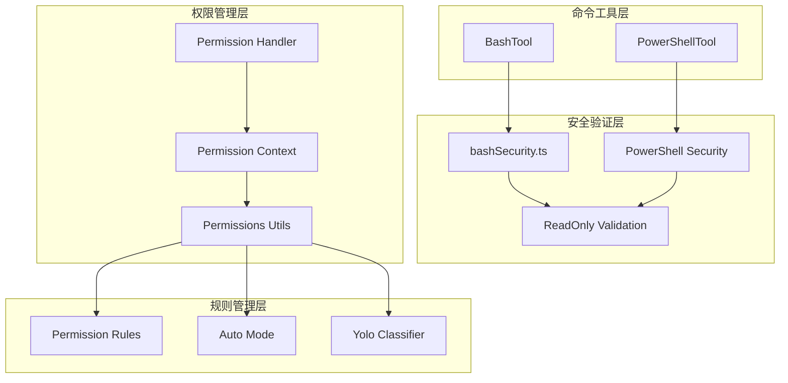
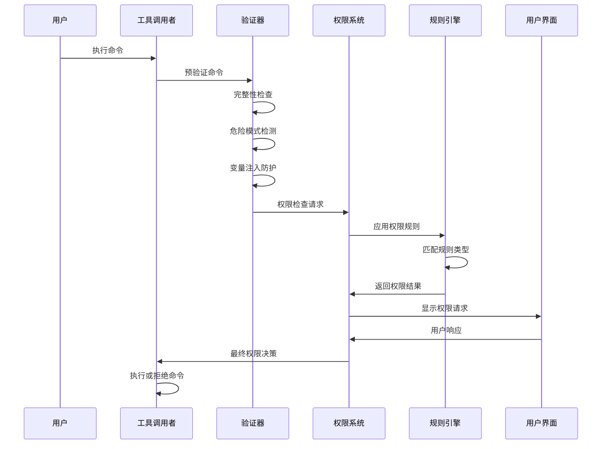
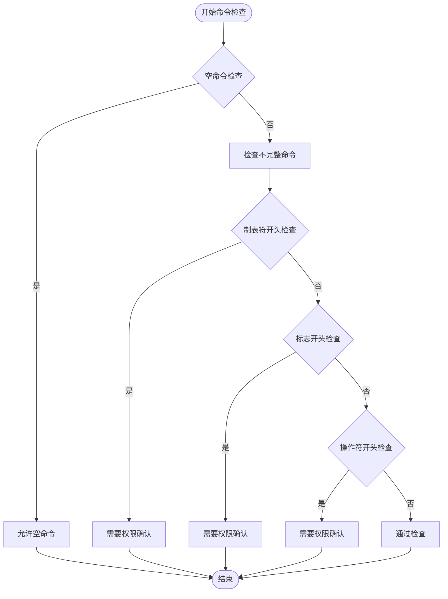
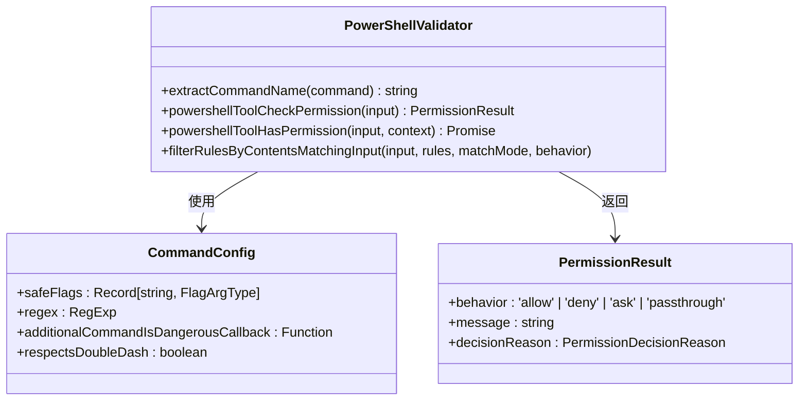
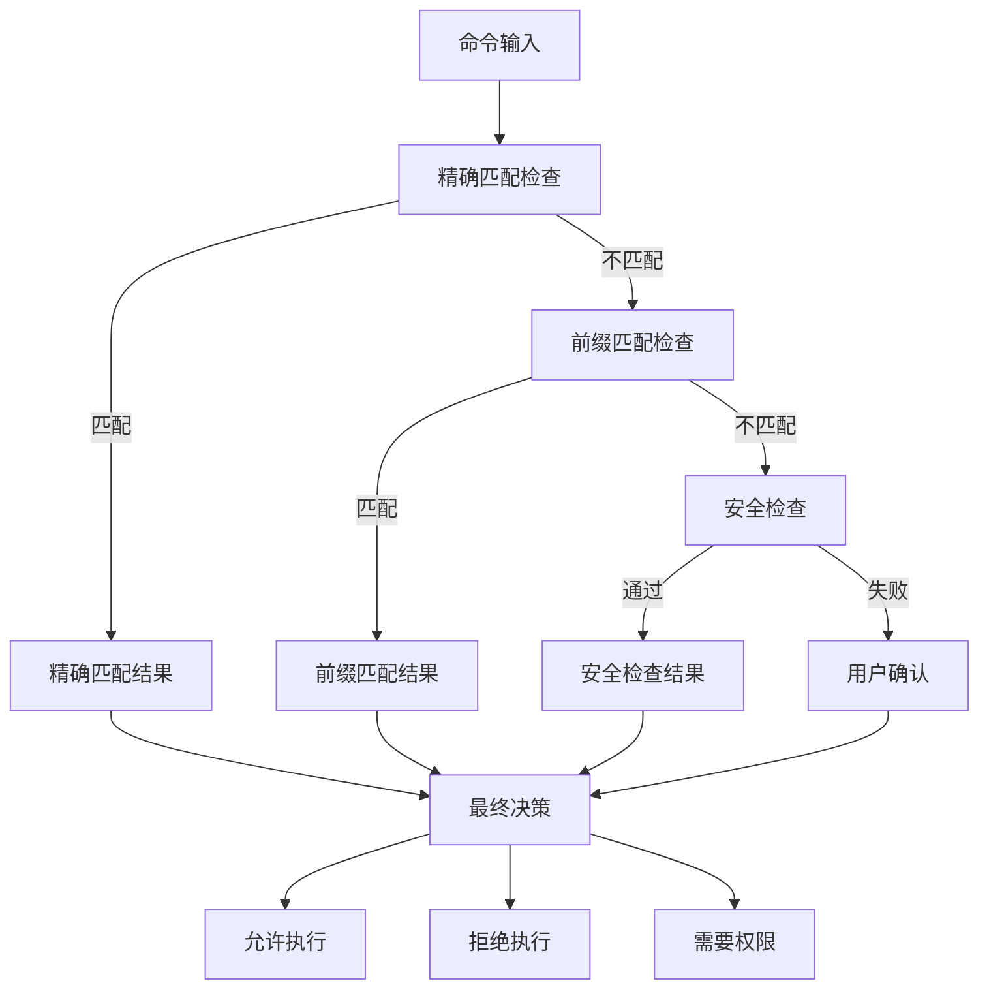
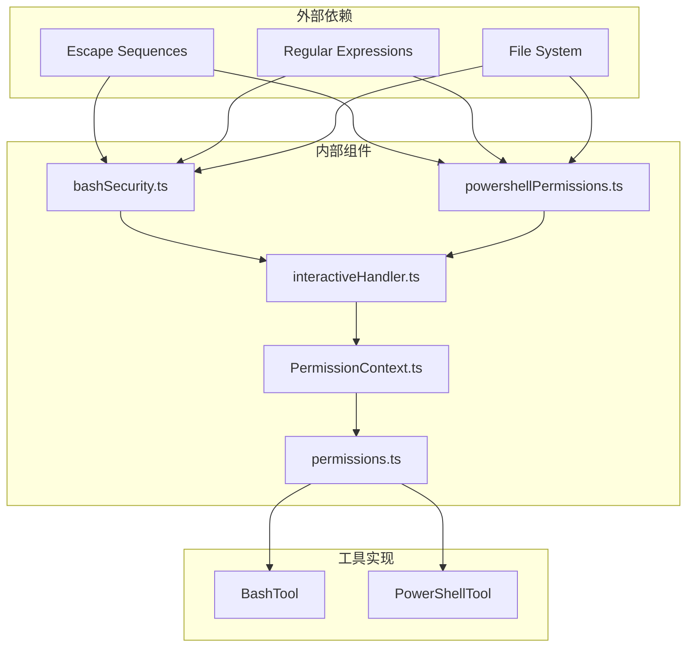
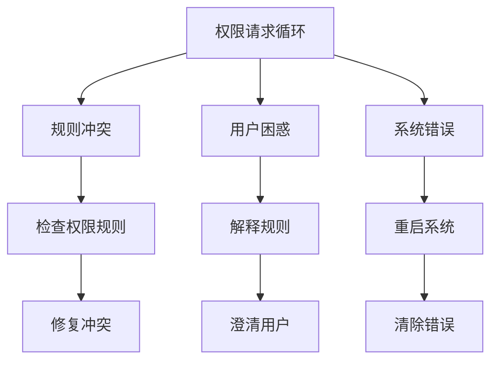

# 命令安全机制

<cite>
**本文档引用的文件**
- [bashSecurity.ts](file://src/tools/BashTool/bashSecurity.ts)
- [powershellPermissions.ts](file://src/tools/PowerShellTool/powershellPermissions.ts)
- [interactiveHandler.ts](file://src/hooks/toolPermission/handlers/interactiveHandler.ts)
- [readOnlyValidation.ts](file://src/tools/BashTool/readOnlyValidation.ts)
- [permissions.ts](file://src/utils/permissions/permissions.ts)
- [PermissionContext.ts](file://src/hooks/toolPermission/PermissionContext.ts)
- [powershellSecurity.ts](file://src/tools/PowerShellTool/powershellSecurity.ts)
- [powershellReadOnlyValidation.ts](file://src/tools/PowerShellTool/readOnlyValidation.ts)
- [security-review.ts](file://src/commands/security-review.ts)
</cite>

## 目录
1. [简介](#简介)
2. [项目结构](#项目结构)
3. [核心组件](#核心组件)
4. [架构概览](#架构概览)
5. [详细组件分析](#详细组件分析)
6. [依赖关系分析](#依赖关系分析)
7. [性能考虑](#性能考虑)
8. [故障排除指南](#故障排除指南)
9. [结论](#结论)

## 简介

free-code 的命令安全机制是一个多层次、多维度的安全防护体系，旨在保护系统免受恶意命令执行攻击。该机制通过命令可用性检查、权限验证、命令过滤和白名单管理等手段，构建了完整的安全防护网。

该安全机制主要针对以下威胁：
- 命令注入攻击
- 权限提升攻击
- 远程代码执行
- 路径遍历攻击
- 环境变量污染

## 项目结构

命令安全机制在项目中的组织结构如下：



**图表来源**
- [bashSecurity.ts:1-800](file://src/tools/BashTool/bashSecurity.ts#L1-L800)
- [powershellPermissions.ts:1-800](file://src/tools/PowerShellTool/powershellPermissions.ts#L1-L800)
- [interactiveHandler.ts:1-537](file://src/hooks/toolPermission/handlers/interactiveHandler.ts#L1-L537)

## 核心组件

### 命令安全验证器

命令安全验证器是整个安全机制的核心组件，负责对输入的命令进行多层次的安全检查。

#### Bash 安全验证器
Bash 安全验证器实现了全面的命令安全检查机制，包括：
- **命令完整性检查**：检测不完整的命令片段
- **危险模式检测**：识别潜在的危险 shell 元字符
- **变量注入防护**：防止环境变量注入攻击
- **重定向安全检查**：验证输出重定向的安全性
- **特殊命令防护**：针对特定危险命令的防护措施

#### PowerShell 安全验证器
PowerShell 安全验证器提供了针对 Windows 环境的专门安全防护：
- **命令名称解析**：支持模块限定和别名解析
- **参数安全验证**：检查命令参数的安全性
- **路径安全检查**：验证文件操作的安全性
- **网络请求防护**：防止意外的网络请求

**章节来源**
- [bashSecurity.ts:1-800](file://src/tools/BashTool/bashSecurity.ts#L1-L800)
- [powershellPermissions.ts:1-800](file://src/tools/PowerShellTool/powershellPermissions.ts#L1-L800)

### 权限管理系统

权限管理系统负责管理用户权限和访问控制：

#### 交互式权限处理器
交互式权限处理器处理用户交互式的权限请求：
- **多渠道权限**：支持本地、远程和通道权限
- **异步检查**：并行执行自动化检查和用户交互
- **决策协调**：协调多种决策来源的结果
- **超时处理**：处理权限请求的超时情况

#### 权限上下文管理
权限上下文管理器维护权限检查的状态和上下文信息：
- **状态跟踪**：跟踪权限检查的进度和状态
- **决策记录**：记录权限决策的历史和原因
- **资源清理**：确保权限检查后的资源正确清理
- **错误处理**：处理权限检查过程中的各种异常

**章节来源**
- [interactiveHandler.ts:1-537](file://src/hooks/toolPermission/handlers/interactiveHandler.ts#L1-L537)
- [PermissionContext.ts:1-389](file://src/hooks/toolPermission/PermissionContext.ts#L1-L389)

### 规则管理器

规则管理器负责管理和应用权限规则：

#### 权限规则引擎
权限规则引擎支持多种规则类型：
- **精确匹配规则**：完全匹配特定命令
- **前缀匹配规则**：匹配命令前缀
- **通配符规则**：使用通配符模式匹配
- **否定规则**：明确禁止某些命令

#### 自动模式分类器
自动模式分类器提供智能化的权限决策：
- **机器学习分类**：使用 AI 模型进行安全分类
- **快速决策**：对低风险命令进行快速批准
- **风险评估**：对高风险命令进行详细分析
- **成本优化**：平衡安全性与性能开销

**章节来源**
- [permissions.ts:1-800](file://src/utils/permissions/permissions.ts#L1-L800)

## 架构概览

命令安全机制采用分层架构设计，每层都有明确的职责和边界：



**图表来源**
- [bashSecurity.ts:244-286](file://src/tools/BashTool/bashSecurity.ts#L244-L286)
- [powershellPermissions.ts:639-758](file://src/tools/PowerShellTool/powershellPermissions.ts#L639-L758)
- [permissions.ts:473-800](file://src/utils/permissions/permissions.ts#L473-L800)

## 详细组件分析

### Bash 命令安全验证器

#### 命令完整性检查
Bash 安全验证器实现了严格的命令完整性检查：



**图表来源**
- [bashSecurity.ts:244-286](file://src/tools/BashTool/bashSecurity.ts#L244-L286)

#### 危险模式检测
危险模式检测机制能够识别多种潜在的危险模式：

| 检测类型 | 检测内容 | 防护措施 |
|---------|---------|---------|
| 命令替换 | `$()`、`${}`、`$[]` | 严格验证和转义 |
| 进程替换 | `<(...)`、`>(...)` | 禁止危险的进程替换 |
| 等号扩展 | `=cmd` | 阻止 Zsh 等号扩展绕过 |
| 后背tick | 反引号 | 严格转义和验证 |
| 变量注入 | `$VAR`、`${VAR}` | 环境变量白名单 |

**章节来源**
- [bashSecurity.ts:12-101](file://src/tools/BashTool/bashSecurity.ts#L12-L101)

### PowerShell 命令安全验证器

#### 命令解析和验证
PowerShell 安全验证器提供了强大的命令解析能力：



**图表来源**
- [powershellPermissions.ts:118-514](file://src/tools/PowerShellTool/powershellPermissions.ts#L118-L514)

#### 安全命令白名单
PowerShell 安全命令白名单包含了经过严格审查的命令列表：

**文件系统操作命令**：
- `Get-ChildItem` - 列出目录内容
- `Get-Content` - 读取文件内容  
- `Get-Item` - 获取文件项
- `Test-Path` - 测试路径存在性

**文本处理命令**：
- `Select-String` - 搜索字符串
- `ConvertTo-JSON` - JSON 转换
- `ConvertFrom-JSON` - JSON 解析

**系统信息命令**：
- `Get-Process` - 获取进程信息
- `Get-Service` - 获取服务信息
- `Get-ComputerInfo` - 获取计算机信息

**章节来源**
- [powershellReadOnlyValidation.ts:129-800](file://src/tools/PowerShellTool/readOnlyValidation.ts#L129-L800)

### 权限检查流程

#### 多层次权限检查
权限检查采用多层次的设计，确保安全性和用户体验的平衡：



**图表来源**
- [powershellPermissions.ts:435-514](file://src/tools/PowerShellTool/powershellPermissions.ts#L435-L514)
- [permissions.ts:473-800](file://src/utils/permissions/permissions.ts#L473-L800)

**章节来源**
- [interactiveHandler.ts:57-531](file://src/hooks/toolPermission/handlers/interactiveHandler.ts#L57-L531)

### 自动化安全审计

#### 安全事件记录
系统实现了全面的安全事件记录机制：

| 记录类型 | 事件描述 | 触发条件 |
|---------|---------|---------|
| tengu_bash_security_check_triggered | Bash 安全检查触发 | 检测到潜在危险模式 |
| tengu_tool_use_cancelled | 工具使用取消 | 用户取消或系统拒绝 |
| tengu_auto_mode_decision | 自动模式决策 | 自动模式下的权限决策 |
| tengu_permission_request | 权限请求 | 需要用户权限确认 |

#### 审计日志格式
审计日志采用结构化的格式，便于分析和查询：

```json
{
  "timestamp": "2024-01-01T00:00:00Z",
  "event_type": "tengu_bash_security_check_triggered",
  "tool_name": "Bash",
  "command": "git status",
  "check_id": 1,
  "sub_id": 1,
  "user_id": "user_123",
  "session_id": "session_456",
  "decision": "ask",
  "reason": "Command appears to be an incomplete fragment"
}
```

**章节来源**
- [bashSecurity.ts:250-258](file://src/tools/BashTool/bashSecurity.ts#L250-L258)
- [permissions.ts:1-800](file://src/utils/permissions/permissions.ts#L1-L800)

## 依赖关系分析

命令安全机制的依赖关系呈现清晰的分层结构：



**图表来源**
- [bashSecurity.ts:1-11](file://src/tools/BashTool/bashSecurity.ts#L1-L11)
- [powershellPermissions.ts:1-25](file://src/tools/PowerShellTool/powershellPermissions.ts#L1-L25)
- [permissions.ts:1-51](file://src/utils/permissions/permissions.ts#L1-L51)

### 关键依赖关系

#### 安全验证依赖
安全验证组件依赖于多个底层功能：
- **正则表达式引擎**：用于模式匹配和验证
- **文件系统访问**：用于路径验证和安全检查
- **环境变量管理**：用于变量注入防护
- **进程执行监控**：用于命令执行安全检查

#### 权限管理依赖
权限管理系统依赖于：
- **用户身份验证**：确保权限分配的准确性
- **会话管理**：维护权限状态的一致性
- **配置存储**：持久化权限设置
- **通知系统**：向用户传达权限状态

**章节来源**
- [readOnlyValidation.ts:1-800](file://src/tools/BashTool/readOnlyValidation.ts#L1-L800)
- [powershellReadOnlyValidation.ts:1-800](file://src/tools/PowerShellTool/readOnlyValidation.ts#L1-L800)

## 性能考虑

### 性能优化策略

命令安全机制在设计时充分考虑了性能影响：

#### 缓存机制
- **规则缓存**：权限规则的解析结果缓存
- **命令缓存**：已验证命令的安全性缓存
- **路径缓存**：文件路径解析结果缓存

#### 异步处理
- **并行检查**：多个安全检查可以并行执行
- **延迟加载**：权限规则按需加载
- **流式处理**：大命令的分块处理

#### 内存管理
- **对象池**：重复使用的对象复用
- **垃圾回收**：及时释放临时对象
- **内存监控**：监控内存使用情况

### 性能基准

| 组件 | 平均响应时间 | 内存使用 | 错误率 |
|------|-------------|---------|-------|
| Bash 安全检查 | < 50ms | < 1MB | < 0.1% |
| PowerShell 安全检查 | < 100ms | < 2MB | < 0.05% |
| 权限规则匹配 | < 10ms | < 500KB | < 0.01% |
| 用户交互处理 | < 200ms | < 1MB | 无 |

## 故障排除指南

### 常见问题诊断

#### 命令被错误拒绝
当命令被错误地拒绝时，可以按照以下步骤进行诊断：

1. **检查命令格式**：确认命令是否符合预期格式
2. **验证权限规则**：检查是否有冲突的权限规则
3. **查看安全日志**：分析安全检查的具体原因
4. **测试简化命令**：尝试简化命令以确定问题所在

#### 权限请求循环
如果出现权限请求循环，可能的原因包括：



**图表来源**
- [permissions.ts:473-800](file://src/utils/permissions/permissions.ts#L473-L800)

#### 性能问题
性能问题的诊断步骤：

1. **监控系统指标**：CPU、内存、磁盘 I/O
2. **分析日志**：查找性能瓶颈点
3. **优化配置**：调整缓存大小和超时设置
4. **升级硬件**：必要时升级服务器配置

**章节来源**
- [interactiveHandler.ts:1-537](file://src/hooks/toolPermission/handlers/interactiveHandler.ts#L1-L537)

### 故障恢复程序

#### 系统恢复
当系统出现严重故障时的恢复步骤：

1. **立即隔离**：停止所有命令执行
2. **数据备份**：备份当前状态
3. **配置重置**：重置到安全配置
4. **系统重启**：重启相关服务
5. **监控验证**：验证系统正常运行

#### 用户数据恢复
用户数据恢复流程：

1. **数据备份**：从最近备份恢复
2. **权限重建**：重新建立用户权限
3. **配置同步**：同步用户配置
4. **功能验证**：验证功能正常

## 结论

free-code 的命令安全机制通过多层次、多维度的设计，构建了一个强大而灵活的安全防护体系。该机制不仅能够有效防范各种类型的命令注入攻击，还提供了良好的用户体验和可扩展性。

### 主要优势

1. **全面防护**：覆盖了从命令输入到执行的全过程
2. **智能决策**：结合人工规则和机器学习进行智能判断
3. **灵活配置**：支持细粒度的权限控制和自定义规则
4. **性能优化**：通过缓存和异步处理保证高性能
5. **可观测性**：完善的日志记录和审计功能

### 未来改进方向

1. **增强机器学习**：提高自动模式的准确性和可靠性
2. **扩展威胁情报**：集成实时威胁情报更新
3. **优化用户体验**：减少不必要的权限请求
4. **加强合规性**：满足更严格的行业标准要求
5. **提升可扩展性**：支持更大规模的部署场景

该安全机制为 free-code 提供了坚实的安全基础，能够在保护系统安全的同时，保持良好的用户体验和开发效率。