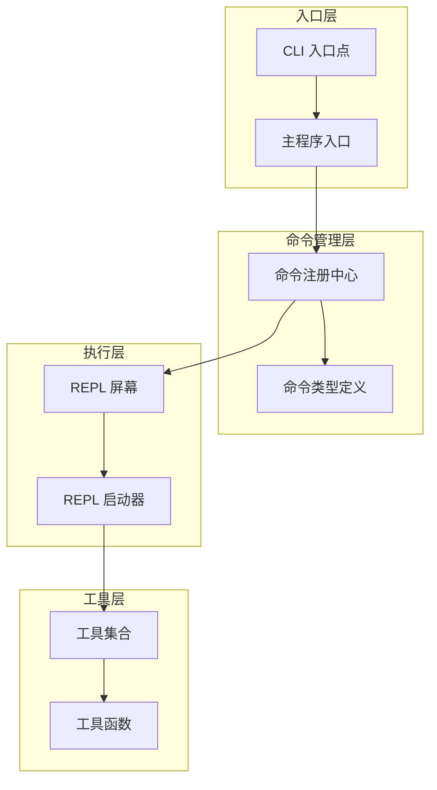
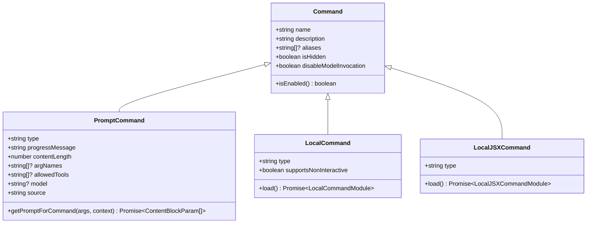
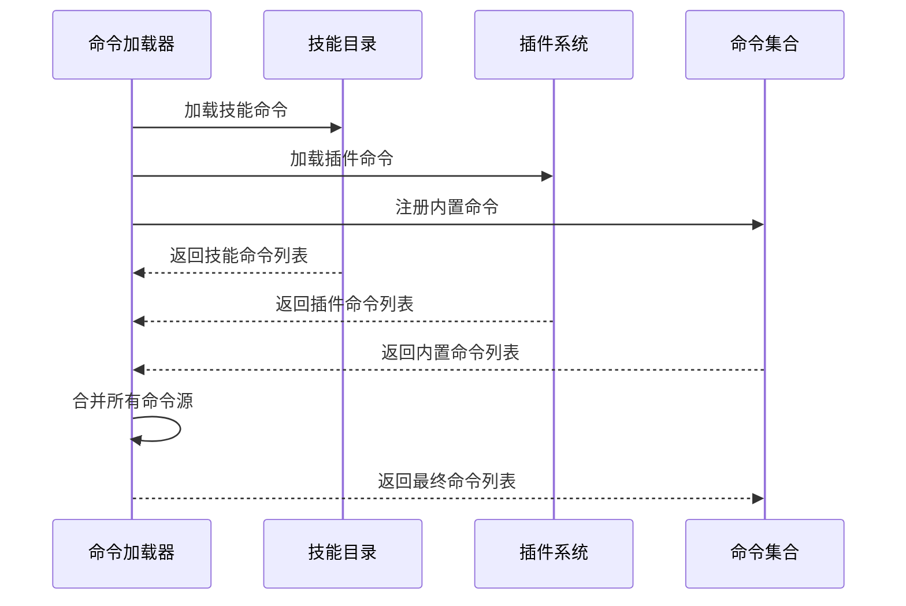
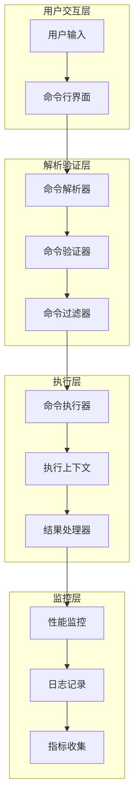
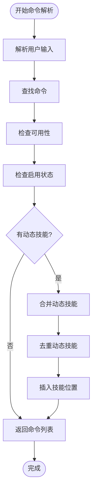
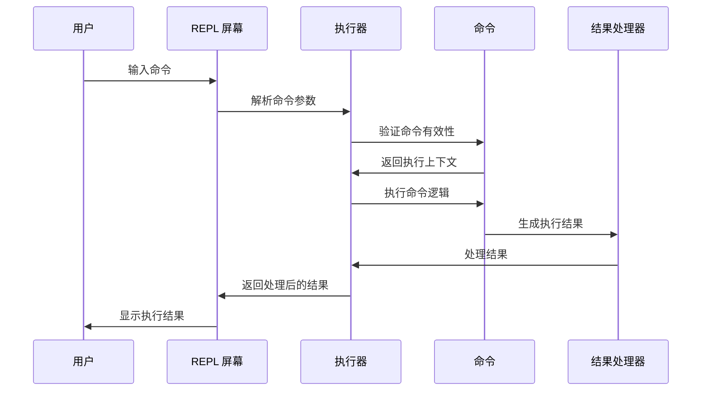
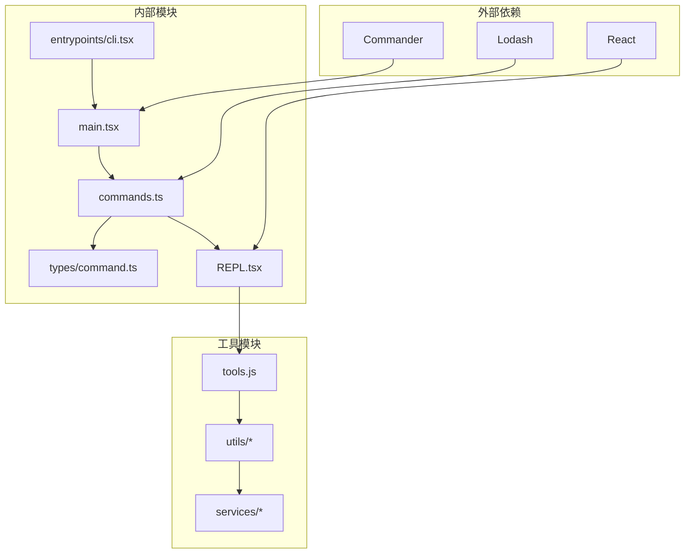
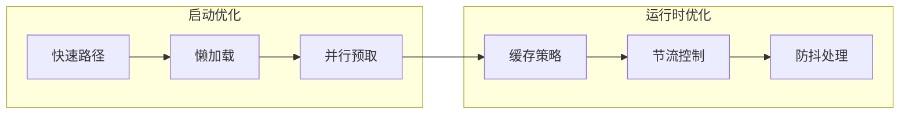

# 命令执行流程

<cite>
**本文档引用的文件**
- [commands.ts](file://src/commands.ts)
- [command.ts](file://src/types/command.ts)
- [cli.tsx](file://src/entrypoints/cli.tsx)
- [main.tsx](file://src/main.tsx)
- [REPL.tsx](file://src/screens/REPL.tsx)
- [replLauncher.tsx](file://src/replLauncher.tsx)
</cite>

## 目录
1. [简介](#简介)
2. [项目结构](#项目结构)
3. [核心组件](#核心组件)
4. [架构概览](#架构概览)
5. [详细组件分析](#详细组件分析)
6. [依赖关系分析](#依赖关系分析)
7. [性能考虑](#性能考虑)
8. [故障排除指南](#故障排除指南)
9. [结论](#结论)

## 简介

本文档详细描述了 free-code 项目中的命令执行流程，包括命令解析、命令验证、命令执行和结果处理的完整生命周期。该系统支持多种类型的命令（本地命令、提示型命令、本地 JSX 命令），并提供了丰富的配置选项、权限控制和性能优化策略。

## 项目结构

命令执行系统主要由以下模块组成：

**图表来源**
- [cli.tsx:43-313](file://src/entrypoints/cli.tsx#L43-L313)
- [main.tsx:585-856](file://src/main.tsx#L585-L856)
- [commands.ts:257-517](file://src/commands.ts#L257-L517)

**章节来源**
- [cli.tsx:1-313](file://src/entrypoints/cli.tsx#L1-L313)
- [main.tsx:1-800](file://src/main.tsx#L1-L800)
- [commands.ts:1-200](file://src/commands.ts#L1-L200)

## 核心组件

### 命令类型系统

系统支持三种主要的命令类型：

1. **本地命令 (Local Command)**：直接在本地执行的命令
2. **提示型命令 (Prompt Command)**：生成提示内容供模型使用的命令
3. **本地 JSX 命令 (Local JSX Command)**：渲染 React 组件的命令

**图表来源**
- [command.ts:16-206](file://src/types/command.ts#L16-L206)

### 命令注册与发现

命令系统通过动态加载机制实现灵活的命令注册：

**图表来源**
- [commands.ts:449-469](file://src/commands.ts#L449-L469)

**章节来源**
- [command.ts:1-217](file://src/types/command.ts#L1-L217)
- [commands.ts:257-517](file://src/commands.ts#L257-L517)

## 架构概览

命令执行系统采用分层架构设计，确保了良好的可扩展性和维护性：

**图表来源**
- [main.tsx:884-1599](file://src/main.tsx#L884-L1599)
- [REPL.tsx:575-800](file://src/screens/REPL.tsx#L575-L800)

## 详细组件分析

### 命令解析与验证

命令解析过程包含多个验证步骤：

1. **命令查找**：根据命令名称或别名查找命令
2. **可用性检查**：验证命令在当前环境下的可用性
3. **启用状态检查**：确认命令是否被启用
4. **动态技能合并**：将动态发现的技能与静态命令合并

**图表来源**
- [commands.ts:476-517](file://src/commands.ts#L476-L517)

**章节来源**
- [commands.ts:417-517](file://src/commands.ts#L417-L517)

### 命令执行引擎

命令执行引擎负责实际的命令执行和结果处理：

**图表来源**
- [REPL.tsx:575-800](file://src/screens/REPL.tsx#L575-L800)

**章节来源**
- [REPL.tsx:575-800](file://src/screens/REPL.tsx#L575-L800)

### 上下文管理

系统提供了完整的上下文管理机制：

| 上下文类型 | 描述 | 关键功能 |
|-----------|------|----------|
| 执行上下文 | 命令执行所需的运行时环境 | 工具使用权限、消息管理、选项配置 |
| 命令上下文 | 命令特定的执行环境 | 参数传递、结果回调、显示控制 |
| 模型上下文 | 与模型交互的上下文 | 提示构建、工具调用、进度跟踪 |

**章节来源**
- [command.ts:80-98](file://src/types/command.ts#L80-L98)

### 并发控制

系统实现了多层并发控制机制：

**图表来源**
- [main.tsx:884-1599](file://src/main.tsx#L884-L1599)

**章节来源**
- [main.tsx:884-1599](file://src/main.tsx#L884-L1599)

## 依赖关系分析

命令执行系统的依赖关系如下：

**图表来源**
- [commands.ts:1-200](file://src/commands.ts#L1-L200)
- [main.tsx:1-100](file://src/main.tsx#L1-L100)

**章节来源**
- [commands.ts:1-200](file://src/commands.ts#L1-L200)
- [main.tsx:1-200](file://src/main.tsx#L1-L200)

## 性能考虑

### 内存优化

系统采用了多种内存优化策略：

1. **命令缓存**：使用 `memoize` 对昂贵的命令加载操作进行缓存
2. **懒加载**：延迟加载大型模块，减少启动时间
3. **垃圾回收**：定期清理未使用的命令实例

### 并发优化

**图表来源**
- [cli.tsx:43-313](file://src/entrypoints/cli.tsx#L43-L313)
- [commands.ts:449-469](file://src/commands.ts#L449-L469)

**章节来源**
- [cli.tsx:43-313](file://src/entrypoints/cli.tsx#L43-L313)
- [commands.ts:449-469](file://src/commands.ts#L449-L469)

## 故障排除指南

### 常见问题诊断

| 问题类型 | 症状 | 诊断方法 | 解决方案 |
|---------|------|----------|----------|
| 命令未找到 | ReferenceError: Command not found | 检查命令名称和别名 | 验证命令注册和可用性 |
| 权限不足 | 访问被拒绝 | 检查权限设置和沙箱配置 | 更新权限配置或调整沙箱设置 |
| 性能问题 | 响应缓慢 | 分析性能监控数据 | 优化命令实现或增加缓存 |
| 内存泄漏 | 内存持续增长 | 监控内存使用情况 | 检查对象引用和清理逻辑 |

### 调试技巧

1. **启用调试模式**：使用 `--debug` 参数获取详细日志
2. **性能分析**：使用内置性能监控工具分析执行时间
3. **内存分析**：监控内存使用情况识别泄漏点
4. **网络诊断**：检查 API 调用和响应时间

**章节来源**
- [main.tsx:231-271](file://src/main.tsx#L231-L271)
- [commands.ts:704-719](file://src/commands.ts#L704-L719)

## 结论

free-code 项目的命令执行系统是一个高度模块化、可扩展且性能优化的架构。它通过清晰的分层设计、完善的上下文管理和强大的并发控制机制，为用户提供了一个稳定可靠的命令执行平台。

系统的主要优势包括：

1. **灵活性**：支持多种命令类型和动态加载机制
2. **安全性**：完善的权限控制和沙箱管理
3. **性能**：多层缓存和懒加载优化
4. **可观测性**：全面的监控和调试支持
5. **可维护性**：清晰的代码结构和文档

通过遵循本文档的指导和最佳实践，开发者可以有效地扩展和优化命令执行系统，满足各种复杂的使用场景需求。