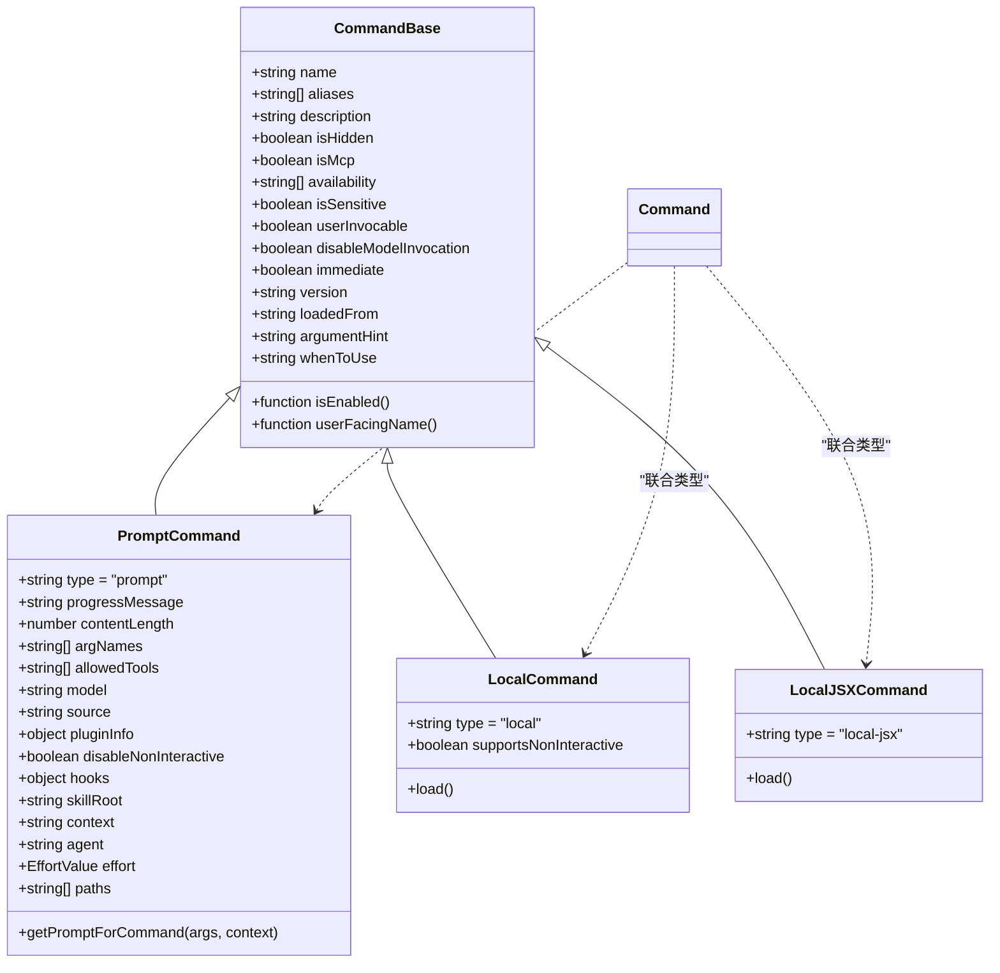
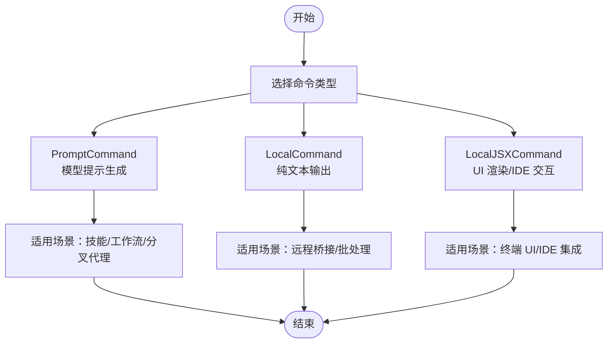
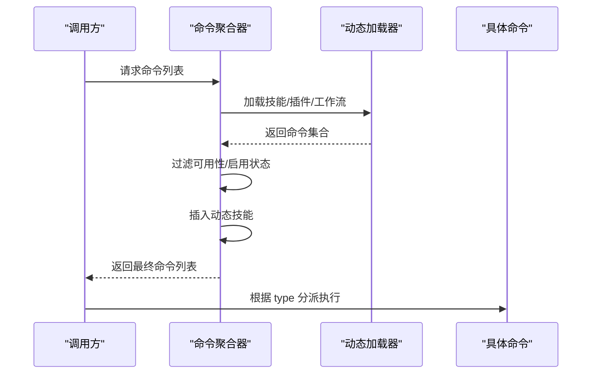
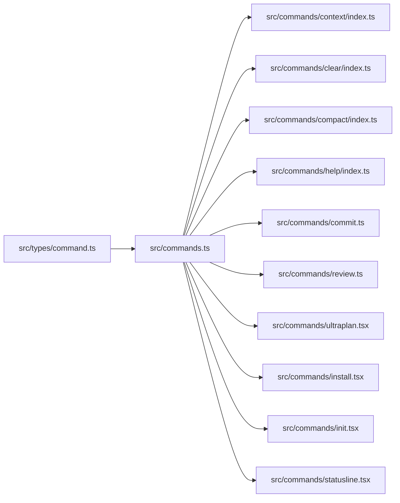

# 命令类型

<cite>
**本文引用的文件**
- [src/types/command.ts](file://src/types/command.ts)
- [src/commands.ts](file://src/commands.ts)
- [src/commands/context/index.ts](file://src/commands/context/index.ts)
- [src/commands/clear/index.ts](file://src/commands/clear/index.ts)
- [src/commands/compact/index.ts](file://src/commands/compact/index.ts)
- [src/commands/help/index.ts](file://src/commands/help/index.ts)
- [src/commands/commit.ts](file://src/commands/commit.ts)
- [src/commands/review.ts](file://src/commands/review.ts)
- [src/commands/ultraplan.tsx](file://src/commands/ultraplan.tsx)
- [src/commands/install.tsx](file://src/commands/install.tsx)
- [src/commands/init.tsx](file://src/commands/init.tsx)
- [src/commands/statusline.tsx](file://src/commands/statusline.tsx)
- [src/commands/terminalSetup/index.ts](file://src/commands/terminalSetup/index.ts)
- [src/commands/exit/index.ts](file://src/commands/exit/index.ts)
- [src/commands/export/index.ts](file://src/commands/export/index.ts)
- [src/commands/extra-usage/index.ts](file://src/commands/extra-usage/index.ts)
- [src/commands/fast/index.ts](file://src/commands/fast/index.ts)
- [src/commands/files/index.ts](file://src/commands/files/index.ts)
- [src/commands/feedback/index.ts](file://src/commands/feedback/index.ts)
- [src/commands/heapdump/index.ts](file://src/commands/heapdump/index.ts)
- [src/commands/keybindings/index.ts](file://src/commands/keybindings/index.ts)
- [src/commands/login/index.ts](file://src/commands/login/index.ts)
- [src/commands/logout/index.ts](file://src/commands/logout/index.ts)
- [src/commands/mcp/index.ts](file://src/commands/mcp/index.ts)
- [src/commands/memory/index.ts](file://src/commands/memory/index.ts)
- [src/commands/model/index.ts](file://src/commands/model/index.ts)
- [src/commands/output-style/index.ts](file://src/commands/output-style/index.ts)
- [src/commands/permissions/index.ts](file://src/commands/permissions/index.ts)
- [src/commands/plan/index.ts](file://src/commands/plan/index.ts)
- [src/commands/privacy-settings/index.ts](file://src/commands/privacy-settings/index.ts)
- [src/commands/reload-plugins/index.ts](file://src/commands/reload-plugins/index.ts)
- [src/commands/resume/index.ts](file://src/commands/resume/index.ts)
- [src/commands/review.ts](file://src/commands/review.ts)
- [src/commands/rewind/index.ts](file://src/commands/rewind/index.ts)
- [src/commands/session/index.ts](file://src/commands/session/index.ts)
- [src/commands/share/index.ts](file://src/commands/share/index.ts)
- [src/commands/skills/index.ts](file://src/commands/skills/index.ts)
- [src/commands/stats/index.ts](file://src/commands/stats/index.ts)
- [src/commands/status/index.ts](file://src/commands/status/index.ts)
- [src/commands/stickers/index.ts](file://src/commands/stickers/index.ts)
- [src/commands/tag/index.ts](file://src/commands/tag/index.ts)
- [src/commands/theme/index.ts](file://src/commands/theme/index.ts)
- [src/commands/vim/index.ts](file://src/commands/vim/index.ts)
- [src/commands/version.ts](file://src/commands/version.ts)
- [src/commands/voice/index.ts](file://src/commands/voice/index.ts)
- [src/commands/exit/index.ts](file://src/commands/exit/index.ts)
- [src/commands/exit/index.ts](file://src/commands/exit/index.ts)
- [src/commands/exit/index.ts](file://src/commands/exit/index.ts)
</cite>

## 目录
1. [简介](#简介)
2. [项目结构](#项目结构)
3. [核心组件](#核心组件)
4. [架构总览](#架构总览)
5. [详细组件分析](#详细组件分析)
6. [依赖分析](#依赖分析)
7. [性能考虑](#性能考虑)
8. [故障排查指南](#故障排查指南)
9. [结论](#结论)
10. [附录](#附录)

## 简介
本文件为 free-code 的命令类型系统提供详细的 API 参考与实践指南。内容覆盖命令基类（CommandBase）、提示命令（PromptCommand）、本地命令（LocalCommand）、本地 JSX 命令（LocalJSXCommand）的接口规范、区别与使用场景、类型转换规则、验证机制、序列化/反序列化与持久化建议、扩展方法、性能优化与调试技巧。文中所有技术细节均来自仓库源码，并通过图示与分层讲解帮助读者快速理解并正确使用命令类型系统。

## 项目结构
命令类型系统的核心定义位于类型模块，命令注册与过滤逻辑集中在命令聚合入口。各具体命令以模块形式组织在 commands 目录下，按功能域划分，支持动态加载与缓存。

```mermaid
graph TB
subgraph "类型定义"
A["src/types/command.ts<br/>命令类型与工具函数"]
end
subgraph "命令聚合与运行时"
B["src/commands.ts<br/>命令注册/可用性/过滤/缓存"]
end
subgraph "命令实现"
C["src/commands/context/index.ts"]
D["src/commands/clear/index.ts"]
E["src/commands/compact/index.ts"]
F["src/commands/help/index.ts"]
G["src/commands/commit.ts"]
H["src/commands/review.ts"]
I["src/commands/ultraplan.tsx"]
J["src/commands/install.tsx"]
K["src/commands/init.tsx"]
L["src/commands/statusline.tsx"]
M["src/commands/terminalSetup/index.ts"]
N["src/commands/exit/index.ts"]
O["src/commands/export/index.ts"]
P["src/commands/extra-usage/index.ts"]
Q["src/commands/fast/index.ts"]
R["src/commands/files/index.ts"]
S["src/commands/feedback/index.ts"]
T["src/commands/heapdump/index.ts"]
U["src/commands/keybindings/index.ts"]
V["src/commands/login/index.ts"]
W["src/commands/logout/index.ts"]
X["src/commands/mcp/index.ts"]
Y["src/commands/memory/index.ts"]
Z["src/commands/model/index.ts"]
AA["src/commands/output-style/index.ts"]
BB["src/commands/permissions/index.ts"]
CC["src/commands/plan/index.ts"]
DD["src/commands/privacy-settings/index.ts"]
EE["src/commands/reload-plugins/index.ts"]
FF["src/commands/resume/index.ts"]
GG["src/commands/review.ts"]
HH["src/commands/rewind/index.ts"]
II["src/commands/session/index.ts"]
JJ["src/commands/share/index.ts"]
KK["src/commands/skills/index.ts"]
LL["src/commands/stats/index.ts"]
MM["src/commands/status/index.ts"]
NN["src/commands/stickers/index.ts"]
OO["src/commands/tag/index.ts"]
PP["src/commands/theme/index.ts"]
QQ["src/commands/vim/index.ts"]
RR["src/commands/version.ts"]
SS["src/commands/voice/index.ts"]
end
A --> B
B --> C
B --> D
B --> E
B --> F
B --> G
B --> H
B --> I
B --> J
B --> K
B --> L
B --> M
B --> N
B --> O
B --> P
B --> Q
B --> R
B --> S
B --> T
B --> U
B --> V
B --> W
B --> X
B --> Y
B --> Z
B --> AA
B --> BB
B --> CC
B --> DD
B --> EE
B --> FF
B --> GG
B --> HH
B --> II
B --> JJ
B --> KK
B --> LL
B --> MM
B --> NN
B --> OO
B --> PP
B --> QQ
B --> RR
B --> SS
```

图表来源
- [src/types/command.ts:175-217](file://src/types/command.ts#L175-L217)
- [src/commands.ts:255-346](file://src/commands.ts#L255-L346)

章节来源
- [src/types/command.ts:1-217](file://src/types/command.ts#L1-L217)
- [src/commands.ts:1-755](file://src/commands.ts#L1-L755)

## 核心组件
本节对命令类型系统的关键类型进行逐项解析，明确字段语义、默认值、可选性与约束条件，并给出典型用法与注意事项。

- 命令基类（CommandBase）
  - 字段概览：名称、别名、描述、可见性、可用性、启用状态、加载来源、版本、是否敏感参数、是否模型可调用、是否即时执行、工作流标记等。
  - 工具函数：名称解析（优先 userFacingName 回调）、启用状态解析（默认 true）。
  - 典型用途：作为所有命令的统一基底，承载通用元数据与行为开关。
  - 参考路径：[src/types/command.ts:175-203](file://src/types/command.ts#L175-L203)，[src/types/command.ts:208-217](file://src/types/command.ts#L208-L217)

- 提示命令（PromptCommand）
  - 类型标识：type = 'prompt'
  - 关键字段：进度提示、内容长度（字符数，用于 token 估算）、参数名列表、允许工具列表、模型选择、来源（内置/插件/MCP/捆绑）、插件信息、非交互禁用标志、钩子设置、技能根目录、上下文模式（内联/分叉）、分叉代理类型、努力值、路径匹配通配符、获取提示的异步回调。
  - 使用场景：将用户输入转化为模型提示，支持分叉子代理、路径感知、工具限制、模型选择等高级能力。
  - 参考路径：[src/types/command.ts:25-57](file://src/types/command.ts#L25-L57)

- 本地命令（LocalCommand）
  - 类型标识：type = 'local'
  - 关键字段：supportsNonInteractive（是否支持非交互模式）、load（懒加载模块，返回包含 call 的模块对象）。
  - 使用场景：纯文本输出、无 UI 渲染、适合远程桥接或批处理。
  - 参考路径：[src/types/command.ts:74-78](file://src/types/command.ts#L74-L78)

- 本地 JSX 命令（LocalJSXCommand）
  - 类型标识：type = 'local-jsx'
  - 关键字段：load（懒加载模块，返回包含 call 的模块对象），call 签名接受 onDone 回调、工具上下文与参数，返回 React 节点。
  - 上下文扩展：LocalJSXCommandContext 在 ToolUseContext 基础上增加 canUseTool、setMessages、options（动态 MCP 配置、IDE 安装状态、主题）、回调（onChangeAPIKey、onChangeDynamicMcpConfig、onInstallIDEExtension）、resume 恢复会话等。
  - 使用场景：需要渲染 Ink UI、与 IDE 扩展交互、动态主题切换、消息注入等。
  - 参考路径：[src/types/command.ts:144-152](file://src/types/command.ts#L144-L152)，[src/types/command.ts:80-98](file://src/types/command.ts#L80-L98)

- 命令结果与显示控制
  - LocalCommandResult：文本、紧凑化结果、跳过三种类型；紧凑化结果可携带显示文本。
  - CommandResultDisplay：skip、system、user 三种显示策略。
  - 参考路径：[src/types/command.ts:16-24](file://src/types/command.ts#L16-L24)，[src/types/command.ts:107](file://src/types/command.ts#L107)

- 命令聚合与可用性
  - 命令集合：通过 memoize 缓存的 COMMANDS 数组，动态加载技能、插件、工作流等。
  - 可用性过滤：meetsAvailabilityRequirement 根据 auth/provider 条件筛选命令。
  - 启用状态：isCommandEnabled 支持 per-command 动态启用/禁用。
  - 参考路径：[src/commands.ts:255-346](file://src/commands.ts#L255-L346)，[src/commands.ts:417-443](file://src/commands.ts#L417-L443)，[src/commands.ts:212-222](file://src/commands.ts#L212-L222)

章节来源
- [src/types/command.ts:16-217](file://src/types/command.ts#L16-L217)
- [src/commands.ts:255-346](file://src/commands.ts#L255-L346)
- [src/commands.ts:417-443](file://src/commands.ts#L417-L443)
- [src/commands.ts:212-222](file://src/commands.ts#L212-L222)

## 架构总览
命令类型系统采用“类型定义 + 聚合入口 + 动态加载”的架构。类型定义集中于 types/command.ts，命令注册与过滤逻辑集中在 commands.ts，具体命令以模块形式分布在 commands 目录下。系统通过 memoize 缓存昂贵的加载操作，并提供多级过滤（可用性、启用状态、动态技能插入）。

图表来源
- [src/types/command.ts:175-217](file://src/types/command.ts#L175-L217)
- [src/types/command.ts:25-57](file://src/types/command.ts#L25-L57)
- [src/types/command.ts:74-78](file://src/types/command.ts#L74-L78)
- [src/types/command.ts:144-152](file://src/types/command.ts#L144-L152)

## 详细组件分析

### 命令类型差异与使用场景
- PromptCommand：面向模型的提示生成，适合需要复杂上下文、工具限制、模型选择、分叉代理的工作流。
- LocalCommand：面向纯文本输出的本地命令，适合远程桥接与批处理。
- LocalJSXCommand：面向 UI 命令，适合需要渲染 Ink 组件、与 IDE 交互、动态主题切换的场景。

### 命令类型转换规则
- Command = CommandBase & (PromptCommand | LocalCommand | LocalJSXCommand)
- 类型守卫：通过 type 字段判断具体类型，再访问对应字段。
- 可用性与启用状态：先 meetsAvailabilityRequirement，后 isCommandEnabled，最后加入动态技能。

图表来源
- [src/commands.ts:449-469](file://src/commands.ts#L449-L469)
- [src/commands.ts:476-517](file://src/commands.ts#L476-L517)

### 命令验证机制
- 可用性验证：meetsAvailabilityRequirement 基于 auth/provider 条件判定。
- 启用状态验证：isCommandEnabled 支持 per-command 动态开关。
- 描述格式化：formatDescriptionWithSource 为 UI 展示添加来源标注。
- 参考路径：[src/commands.ts:417-443](file://src/commands.ts#L417-L443)，[src/commands.ts:212-222](file://src/commands.ts#L212-L222)，[src/commands.ts:728-754](file://src/commands.ts#L728-L754)

### 命令序列化、反序列化与持久化
- 当前代码未提供命令对象的序列化/反序列化 API。建议遵循以下原则：
  - 序列化：仅保存命令的稳定标识（name/aliases）与必要参数（如 paths、allowedTools 等），避免序列化运行时上下文。
  - 反序列化：通过命令名称在运行时注册表中查找命令，再根据 type 重建调用上下文。
  - 持久化：将命令历史与参数写入会话存储，不保存命令实现体。
- 参考路径：[src/commands.ts:688-719](file://src/commands.ts#L688-L719)

### 命令类型定义示例与继承关系
- 示例一：PromptCommand（技能型命令）
  - 定义位置：[src/commands/context/index.ts](file://src/commands/context/index.ts)
  - 特点：type='prompt'，提供 getPromptForCommand，支持路径匹配、工具限制、模型选择。
  - 参考路径：[src/types/command.ts:25-57](file://src/types/command.ts#L25-L57)

- 示例二：LocalCommand（本地文本命令）
  - 定义位置：[src/commands/clear/index.ts](file://src/commands/clear/index.ts)
  - 特点：type='local'，supportsNonInteractive=true，load 返回包含 call 的模块。
  - 参考路径：[src/types/command.ts:74-78](file://src/types/command.ts#L74-L78)

- 示例三：LocalJSXCommand（UI 命令）
  - 定义位置：[src/commands/init.tsx](file://src/commands/init.tsx)
  - 特点：type='local-jsx'，load 返回包含 call 的模块，call 接受 onDone、上下文与参数，返回 React 节点。
  - 参考路径：[src/types/command.ts:144-152](file://src/types/command.ts#L144-L152)，[src/types/command.ts:80-98](file://src/types/command.ts#L80-L98)

- 示例四：PromptCommand（工作流命令）
  - 定义位置：[src/commands/ultraplan.tsx](file://src/commands/ultraplan.tsx)
  - 特点：kind='workflow'，source='plugin'，提供 getPromptForCommand。
  - 参考路径：[src/types/command.ts:25-57](file://src/types/command.ts#L25-L57)

### 命令实例化方法
- PromptCommand：通过模块导出的对象，包含 name、description、type、contentLength、progressMessage、source、getPromptForCommand 等。
- LocalCommand：通过 load() 返回的模块对象，调用 call(args, context)。
- LocalJSXCommand：通过 load() 返回的模块对象，调用 call(onDone, context, args)。
- 参考路径：[src/commands.ts:190-202](file://src/commands.ts#L190-L202)，[src/types/command.ts:62-72](file://src/types/command.ts#L62-L72)，[src/types/command.ts:131-142](file://src/types/command.ts#L131-L142)

### 命令扩展方法
- 新增命令：在 commands 目录下创建新模块，导出符合 CommandBase 的对象，并按需实现 PromptCommand/LocalCommand/LocalJSXCommand。
- 动态技能：通过技能目录、插件、工作流等方式动态注入命令。
- 参考路径：[src/commands.ts:449-469](file://src/commands.ts#L449-L469)，[src/commands.ts:563-581](file://src/commands.ts#L563-L581)，[src/commands.ts:586-608](file://src/commands.ts#L586-L608)

### 命令类型使用场景速览
- PromptCommand：技能/工作流、路径感知、工具限制、模型选择、分叉代理。
- LocalCommand：远程桥接安全命令、纯文本输出、批处理。
- LocalJSXCommand：终端 UI、IDE 集成、动态主题、消息注入。
- 参考路径：[src/commands.ts:619-676](file://src/commands.ts#L619-L676)，[src/commands.ts:728-754](file://src/commands.ts#L728-L754)

章节来源
- [src/types/command.ts:16-217](file://src/types/command.ts#L16-L217)
- [src/commands.ts:190-202](file://src/commands.ts#L190-L202)
- [src/commands.ts:449-469](file://src/commands.ts#L449-L469)
- [src/commands.ts:563-581](file://src/commands.ts#L563-L581)
- [src/commands.ts:586-608](file://src/commands.ts#L586-L608)
- [src/commands.ts:619-676](file://src/commands.ts#L619-L676)
- [src/commands.ts:728-754](file://src/commands.ts#L728-L754)

## 依赖分析
命令类型系统的依赖关系清晰：类型定义独立于实现，命令聚合器负责组装与过滤，具体命令模块按需懒加载。

图表来源
- [src/types/command.ts:175-217](file://src/types/command.ts#L175-L217)
- [src/commands.ts:255-346](file://src/commands.ts#L255-L346)

章节来源
- [src/types/command.ts:175-217](file://src/types/command.ts#L175-L217)
- [src/commands.ts:255-346](file://src/commands.ts#L255-L346)

## 性能考虑
- 懒加载与缓存：命令聚合器使用 memoize 缓存昂贵的加载过程（技能、插件、工作流），减少重复 I/O 与动态导入开销。
- 动态技能去重：插入动态技能前进行去重，避免重复计算。
- 远程安全命令白名单：REMOTE_SAFE_COMMANDS 与 BRIDGE_SAFE_COMMANDS 降低 UI 渲染与本地依赖，提升远程模式下的响应速度。
- 参考路径：[src/commands.ts:449-469](file://src/commands.ts#L449-L469)，[src/commands.ts:476-517](file://src/commands.ts#L476-L517)，[src/commands.ts:619-676](file://src/commands.ts#L619-L676)

## 故障排查指南
- 命令不可见：检查 availability 与 isEnabled 是否满足当前环境；确认是否被动态技能覆盖或去重。
- 命令加载失败：查看 getSkills 中的错误捕获日志，确认技能目录、插件、工作流加载是否成功。
- 远程模式异常：确认命令是否在 REMOTE_SAFE_COMMANDS 或 BRIDGE_SAFE_COMMANDS 白名单中。
- 参考路径：[src/commands.ts:353-398](file://src/commands.ts#L353-L398)，[src/commands.ts:417-443](file://src/commands.ts#L417-L443)，[src/commands.ts:619-676](file://src/commands.ts#L619-L676)

## 结论
命令类型系统通过清晰的类型定义与严格的运行时过滤，实现了高扩展性与高性能。开发者应依据命令类型选择合适的实现方式（Prompt/Local/LocalJSX），并遵循懒加载与缓存策略，确保在复杂场景下仍保持良好的用户体验与稳定性。

## 附录
- 常用命令示例（路径参考）
  - PromptCommand：[src/commands/context/index.ts](file://src/commands/context/index.ts)
  - LocalCommand：[src/commands/clear/index.ts](file://src/commands/clear/index.ts)，[src/commands/compact/index.ts](file://src/commands/compact/index.ts)，[src/commands/help/index.ts](file://src/commands/help/index.ts)
  - LocalJSXCommand：[src/commands/init.tsx](file://src/commands/init.tsx)，[src/commands/statusline.tsx](file://src/commands/statusline.tsx)，[src/commands/ultraplan.tsx](file://src/commands/ultraplan.tsx)，[src/commands/install.tsx](file://src/commands/install.tsx)