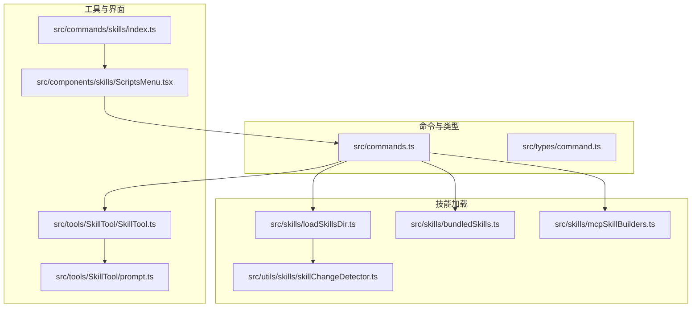
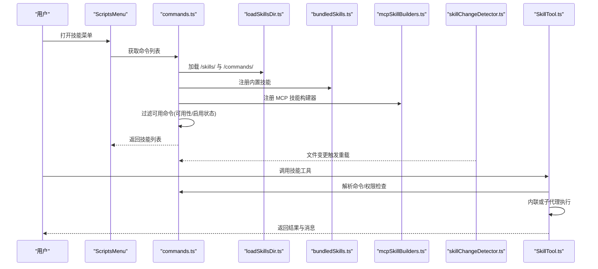
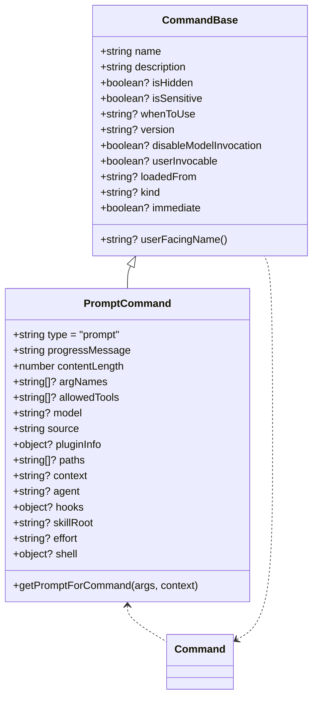
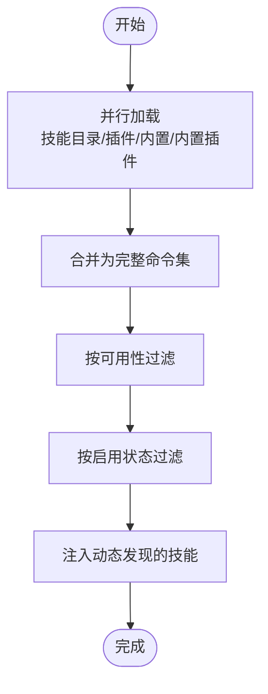
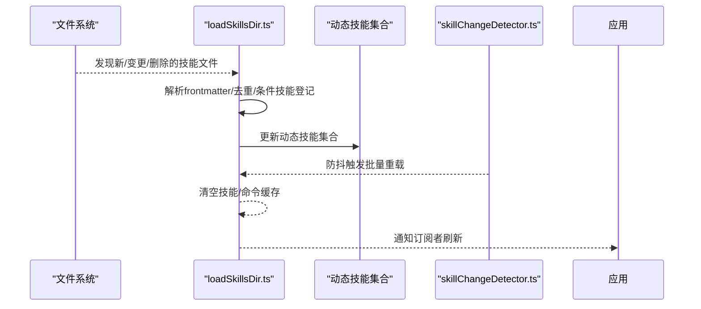
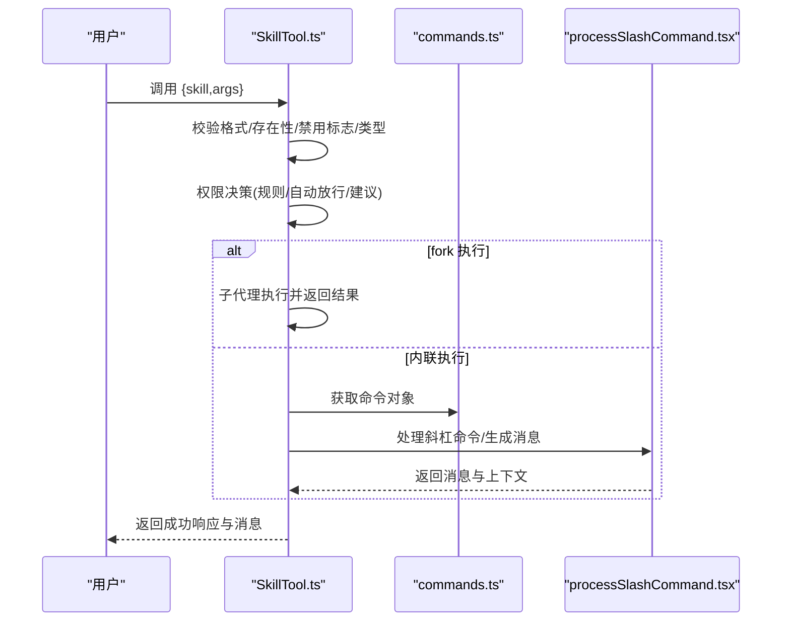
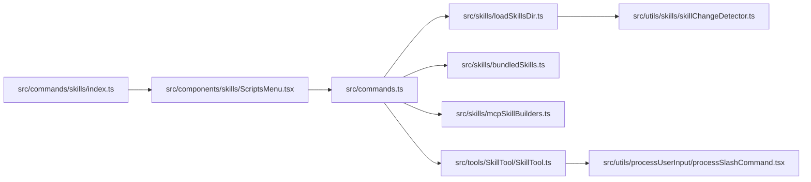

# 技能命令

<cite>
**本文引用的文件**
- [src/commands.ts](file://src/commands.ts)
- [src/types/command.ts](file://src/types/command.ts)
- [src/skills/loadSkillsDir.ts](file://src/skills/loadSkillsDir.ts)
- [src/skills/bundledSkills.ts](file://src/skills/bundledSkills.ts)
- [src/skills/mcpSkillBuilders.ts](file://src/skills/mcpSkillBuilders.ts)
- [src/utils/skills/skillChangeDetector.ts](file://src/utils/skills/skillChangeDetector.ts)
- [src/tools/SkillTool/SkillTool.ts](file://src/tools/SkillTool/SkillTool.ts)
- [src/components/skills/ScriptsMenu.tsx](file://src/components/skills/ScriptsMenu.tsx)
- [src/commands/skills/index.ts](file://src/commands/skills/index.ts)
- [src/utils/processUserInput/processSlashCommand.tsx](file://src/utils/processUserInput/processSlashCommand.tsx)
- [src/tools/SkillTool/prompt.ts](file://src/tools/SkillTool/prompt.ts)
</cite>

## 目录
1. [简介](#简介)
2. [项目结构](#项目结构)
3. [核心组件](#核心组件)
4. [架构总览](#架构总览)
5. [详细组件分析](#详细组件分析)
6. [依赖关系分析](#依赖关系分析)
7. [性能考量](#性能考量)
8. [故障排查指南](#故障排查指南)
9. [结论](#结论)
10. [附录](#附录)

## 简介
本文件为 free-code 的“技能命令”系统提供权威的 API 参考与实现解析，覆盖以下主题：
- 技能命令的接口规范与数据模型
- 注册机制、动态加载与发现流程
- 参数校验规则与返回值格式
- 特殊属性（loadedFrom、disableModelInvocation、whenToUse）语义与使用场景
- 生命周期管理、缓存与性能优化策略
- 调试方法、来源分类（bundled、skills、plugin）与过滤机制
- 动态发现与技能索引管理

## 项目结构
技能命令系统围绕“命令(Command)”抽象展开，统一承载 prompt 型命令、本地命令与 JSX 命令。技能命令作为 prompt 命令的一种，由多种来源加载并参与权限与可用性过滤。

**图表来源**
- [src/commands.ts:449-469](file://src/commands.ts#L449-L469)
- [src/skills/loadSkillsDir.ts:638-714](file://src/skills/loadSkillsDir.ts#L638-L714)
- [src/skills/bundledSkills.ts:106-108](file://src/skills/bundledSkills.ts#L106-L108)
- [src/skills/mcpSkillBuilders.ts:33-44](file://src/skills/mcpSkillBuilders.ts#L33-L44)
- [src/utils/skills/skillChangeDetector.ts:85-141](file://src/utils/skills/skillChangeDetector.ts#L85-L141)
- [src/tools/SkillTool/SkillTool.ts:331-340](file://src/tools/SkillTool/SkillTool.ts#L331-L340)
- [src/tools/SkillTool/prompt.ts:178-208](file://src/tools/SkillTool/prompt.ts#L178-L208)
- [src/components/skills/ScriptsMenu.tsx:47-224](file://src/components/skills/ScriptsMenu.tsx#L47-L224)
- [src/commands/skills/index.ts:3-8](file://src/commands/skills/index.ts#L3-L8)

**章节来源**
- [src/commands.ts:257-346](file://src/commands.ts#L257-L346)
- [src/skills/loadSkillsDir.ts:638-714](file://src/skills/loadSkillsDir.ts#L638-L714)
- [src/skills/bundledSkills.ts:106-108](file://src/skills/bundledSkills.ts#L106-L108)
- [src/skills/mcpSkillBuilders.ts:33-44](file://src/skills/mcpSkillBuilders.ts#L33-L44)
- [src/utils/skills/skillChangeDetector.ts:85-141](file://src/utils/skills/skillChangeDetector.ts#L85-L141)
- [src/tools/SkillTool/SkillTool.ts:331-340](file://src/tools/SkillTool/SkillTool.ts#L331-L340)
- [src/tools/SkillTool/prompt.ts:178-208](file://src/tools/SkillTool/prompt.ts#L178-L208)
- [src/components/skills/ScriptsMenu.tsx:47-224](file://src/components/skills/ScriptsMenu.tsx#L47-L224)
- [src/commands/skills/index.ts:3-8](file://src/commands/skills/index.ts#L3-L8)

## 核心组件
- 命令与类型
  - Command/PromptCommand 定义了技能命令的数据结构与行为契约，包括名称、描述、参数提示、模型选择、工具允许列表、执行上下文等。
  - CommandBase 提供通用字段：loadedFrom、disableModelInvocation、whenToUse、userInvocable 等，用于标识来源、控制模型调用与展示逻辑。
- 技能加载器
  - loadSkillsDir：从用户/项目/附加目录加载 /skills/ 与 /commands/ 中的技能；支持去重、条件技能激活、路径解析与缓存。
  - bundledSkills：在启动时注册内置技能，支持首次调用时抽取参考文件到磁盘。
  - mcpSkillBuilders：注册 MCP 技能构建器，使 MCP 技能可被动态发现与加载。
- 工具与界面
  - SkillTool：对外暴露的工具，负责输入校验、权限决策、调用执行与结果返回；支持内联与子代理派生两种执行模式。
  - ScriptsMenu：以 UI 展示技能来源分组与统计信息，辅助调试与运维。
- 变更检测
  - skillChangeDetector：基于 chokidar 的文件变更监听，防抖批量重载，避免事件风暴导致的死锁与性能问题。

**章节来源**
- [src/types/command.ts:25-57](file://src/types/command.ts#L25-L57)
- [src/types/command.ts:175-203](file://src/types/command.ts#L175-L203)
- [src/skills/loadSkillsDir.ts:638-714](file://src/skills/loadSkillsDir.ts#L638-L714)
- [src/skills/bundledSkills.ts:53-100](file://src/skills/bundledSkills.ts#L53-L100)
- [src/skills/mcpSkillBuilders.ts:33-44](file://src/skills/mcpSkillBuilders.ts#L33-L44)
- [src/tools/SkillTool/SkillTool.ts:331-340](file://src/tools/SkillTool/SkillTool.ts#L331-L340)
- [src/components/skills/ScriptsMenu.tsx:47-224](file://src/components/skills/ScriptsMenu.tsx#L47-L224)
- [src/utils/skills/skillChangeDetector.ts:247-279](file://src/utils/skills/skillChangeDetector.ts#L247-L279)

## 架构总览
技能命令的生命周期从“发现与加载”开始，经“过滤与缓存”，最终通过“工具调用”进入执行阶段，并在“变更检测”下保持动态更新。

**图表来源**
- [src/components/skills/ScriptsMenu.tsx:47-224](file://src/components/skills/ScriptsMenu.tsx#L47-L224)
- [src/commands.ts:449-469](file://src/commands.ts#L449-L469)
- [src/skills/loadSkillsDir.ts:638-714](file://src/skills/loadSkillsDir.ts#L638-L714)
- [src/skills/bundledSkills.ts:106-108](file://src/skills/bundledSkills.ts#L106-L108)
- [src/skills/mcpSkillBuilders.ts:33-44](file://src/skills/mcpSkillBuilders.ts#L33-L44)
- [src/utils/skills/skillChangeDetector.ts:247-279](file://src/utils/skills/skillChangeDetector.ts#L247-L279)
- [src/tools/SkillTool/SkillTool.ts:580-643](file://src/tools/SkillTool/SkillTool.ts#L580-L643)

## 详细组件分析

### 数据模型与接口规范
- PromptCommand 字段要点
  - type: 'prompt'
  - progressMessage/contentLength：进度提示与内容长度估算
  - argNames/allowedTools/model：参数名、允许工具与模型覆盖
  - source/loadedFrom：来源标识（如 userSettings、projectSettings、plugin、bundled、mcp）
  - hooks/skillRoot/context/agent/effort/shell：钩子、资源根目录、执行上下文、代理类型、努力度、shell 配置
  - getPromptForCommand(args, context)：生成内容块数组
- CommandBase 字段要点
  - availability/isEnabled/isHidden：可用性、启用状态、隐藏标记
  - description/hasUserSpecifiedDescription/whenToUse/version：描述、是否用户指定描述、使用场景、版本
  - disableModelInvocation/userInvocable：禁用模型调用、用户可调用
  - loadedFrom/kind/immediate/isSensitive/userFacingName：来源、工作流类型、立即执行、敏感参数、显示名称
- Command 组合
  - PromptCommand | LocalCommand | LocalJSXCommand

**图表来源**
- [src/types/command.ts:25-57](file://src/types/command.ts#L25-L57)
- [src/types/command.ts:175-203](file://src/types/command.ts#L175-L203)
- [src/types/command.ts:205-206](file://src/types/command.ts#L205-L206)

**章节来源**
- [src/types/command.ts:25-57](file://src/types/command.ts#L25-L57)
- [src/types/command.ts:175-203](file://src/types/command.ts#L175-L203)
- [src/types/command.ts:205-206](file://src/types/command.ts#L205-L206)

### 注册机制与来源分类
- 来源分类
  - bundled：内置技能，启动时注册
  - skills：用户/项目/附加目录中的 /skills/ 技能
  - plugin：插件提供的技能
  - mcp：MCP 服务器提供的技能
  - commands_DEPRECATED：遗留 /commands/ 目录中的自定义命令
- 注册与加载
  - getSkills() 并行加载：技能目录、插件技能、内置技能、内置插件技能
  - getCommands() 在此基础上过滤可用性与启用状态，并注入动态发现的技能
  - getSkillToolCommands()/getSlashCommandToolSkills() 用于不同场景下的技能筛选

**图表来源**
- [src/commands.ts:353-398](file://src/commands.ts#L353-L398)
- [src/commands.ts:449-469](file://src/commands.ts#L449-L469)
- [src/commands.ts:476-517](file://src/commands.ts#L476-L517)

**章节来源**
- [src/commands.ts:353-398](file://src/commands.ts#L353-L398)
- [src/commands.ts:449-469](file://src/commands.ts#L449-L469)
- [src/commands.ts:476-517](file://src/commands.ts#L476-L517)

### 动态加载与发现
- 文件系统发现
  - loadSkillsDir：扫描用户/项目/附加目录的 /skills/ 与 /commands/，解析 frontmatter，构建 Command
  - 支持去重（同文件不同路径视为重复）、条件技能（paths 前言）延迟激活
- MCP 技能
  - mcpSkillBuilders：注册构建器，供 MCP 技能发现与创建
- 内置技能
  - bundledSkills：注册内置技能，必要时抽取参考文件到磁盘
- 变更检测
  - skillChangeDetector：监听技能/命令目录，防抖批量重载，清空缓存并通知订阅者

**图表来源**
- [src/skills/loadSkillsDir.ts:638-714](file://src/skills/loadSkillsDir.ts#L638-L714)
- [src/skills/loadSkillsDir.ts:953-983](file://src/skills/loadSkillsDir.ts#L953-L983)
- [src/skills/mcpSkillBuilders.ts:33-44](file://src/skills/mcpSkillBuilders.ts#L33-L44)
- [src/skills/bundledSkills.ts:53-100](file://src/skills/bundledSkills.ts#L53-L100)
- [src/utils/skills/skillChangeDetector.ts:247-279](file://src/utils/skills/skillChangeDetector.ts#L247-L279)

**章节来源**
- [src/skills/loadSkillsDir.ts:638-714](file://src/skills/loadSkillsDir.ts#L638-L714)
- [src/skills/loadSkillsDir.ts:953-983](file://src/skills/loadSkillsDir.ts#L953-L983)
- [src/skills/mcpSkillBuilders.ts:33-44](file://src/skills/mcpSkillBuilders.ts#L33-L44)
- [src/skills/bundledSkills.ts:53-100](file://src/skills/bundledSkills.ts#L53-L100)
- [src/utils/skills/skillChangeDetector.ts:247-279](file://src/utils/skills/skillChangeDetector.ts#L247-L279)

### 参数校验与调用流程
- 输入校验
  - 必须是非空字符串；可接受前导斜杠；远程规范名（_canonical_）需已发现
  - 禁止 disableModelInvocation 的技能；必须是 prompt 类型
- 权限决策
  - 按规则匹配 exact/prefix；deny 优先；远程规范名自动放行；仅安全属性的技能自动放行
  - 默认弹窗询问并提供规则建议
- 调用执行
  - fork 执行：子代理独立上下文与预算
  - 内联执行：直接扩展为对话消息
  - 记录使用统计、打点与追踪

**图表来源**
- [src/tools/SkillTool/SkillTool.ts:354-430](file://src/tools/SkillTool/SkillTool.ts#L354-L430)
- [src/tools/SkillTool/SkillTool.ts:432-578](file://src/tools/SkillTool/SkillTool.ts#L432-L578)
- [src/tools/SkillTool/SkillTool.ts:580-643](file://src/tools/SkillTool/SkillTool.ts#L580-L643)
- [src/utils/processUserInput/processSlashCommand.tsx:838-869](file://src/utils/processUserInput/processSlashCommand.tsx#L838-L869)

**章节来源**
- [src/tools/SkillTool/SkillTool.ts:354-430](file://src/tools/SkillTool/SkillTool.ts#L354-L430)
- [src/tools/SkillTool/SkillTool.ts:432-578](file://src/tools/SkillTool/SkillTool.ts#L432-L578)
- [src/tools/SkillTool/SkillTool.ts:580-643](file://src/tools/SkillTool/SkillTool.ts#L580-L643)
- [src/utils/processUserInput/processSlashCommand.tsx:838-869](file://src/utils/processUserInput/processSlashCommand.tsx#L838-L869)

### 特殊属性与生命周期
- loadedFrom
  - 标识技能来源：skills、plugin、bundled、mcp、commands_DEPRECATED
- disableModelInvocation
  - 禁止模型直接调用该技能，仍可通过工具显式调用
- whenToUse
  - 用于帮助筛选与 UI 展示，作为“何时使用”的说明
- 生命周期
  - 注册：bundledSkills 注册；mcpSkillBuilders 注册；文件系统发现
  - 过滤：可用性/启用状态；动态技能注入
  - 执行：工具调用；fork 或内联
  - 缓存：命令列表与技能内容缓存；变更检测触发清理
  - 销毁：子代理执行完毕释放状态

**章节来源**
- [src/types/command.ts:175-203](file://src/types/command.ts#L175-L203)
- [src/skills/bundledSkills.ts:53-100](file://src/skills/bundledSkills.ts#L53-L100)
- [src/skills/mcpSkillBuilders.ts:33-44](file://src/skills/mcpSkillBuilders.ts#L33-L44)
- [src/commands.ts:476-517](file://src/commands.ts#L476-L517)
- [src/tools/SkillTool/SkillTool.ts:122-289](file://src/tools/SkillTool/SkillTool.ts#L122-L289)

### 缓存机制与性能优化
- 缓存策略
  - 命令列表与技能索引采用 memoize 缓存；仅清理命令层缓存以保留技能缓存，避免重复加载
  - 批量重载时清空技能与命令缓存，并重置已发送技能名集合
- 性能优化
  - 防抖重载：300ms 防抖，避免事件风暴
  - 轮询监听：在特定运行时使用轮询，降低 FSWatcher 死锁风险
  - 去重与条件技能：减少重复加载与无效展示
  - 子代理执行：隔离上下文，避免主线程阻塞

**章节来源**
- [src/commands.ts:523-539](file://src/commands.ts#L523-L539)
- [src/utils/skills/skillChangeDetector.ts:247-279](file://src/utils/skills/skillChangeDetector.ts#L247-L279)
- [src/utils/skills/skillChangeDetector.ts:62-63](file://src/utils/skills/skillChangeDetector.ts#L62-L63)

### 调试方法与技能索引
- 调试入口
  - ScriptsMenu：按来源分组展示技能数量与路径，估算描述 token 数
  - 技能工具提示：明确调用方式与注意事项
- 技能索引
  - getSkillToolCommands()/getSlashCommandToolSkills() 用于不同场景的技能索引
  - useSkillsChange：订阅变更并刷新命令列表

**章节来源**
- [src/components/skills/ScriptsMenu.tsx:47-224](file://src/components/skills/ScriptsMenu.tsx#L47-L224)
- [src/tools/SkillTool/prompt.ts:178-208](file://src/tools/SkillTool/prompt.ts#L178-L208)
- [src/commands.ts:563-608](file://src/commands.ts#L563-L608)
- [src/hooks/useSkillsChange.ts:24-43](file://src/hooks/useSkillsChange.ts#L24-L43)

## 依赖关系分析

**图表来源**
- [src/commands.ts:157-168](file://src/commands.ts#L157-L168)
- [src/skills/loadSkillsDir.ts:638-714](file://src/skills/loadSkillsDir.ts#L638-L714)
- [src/skills/bundledSkills.ts:106-108](file://src/skills/bundledSkills.ts#L106-L108)
- [src/skills/mcpSkillBuilders.ts:33-44](file://src/skills/mcpSkillBuilders.ts#L33-L44)
- [src/tools/SkillTool/SkillTool.ts:635-643](file://src/tools/SkillTool/SkillTool.ts#L635-L643)
- [src/utils/skills/skillChangeDetector.ts:85-141](file://src/utils/skills/skillChangeDetector.ts#L85-L141)
- [src/utils/processUserInput/processSlashCommand.tsx:838-869](file://src/utils/processUserInput/processSlashCommand.tsx#L838-L869)
- [src/components/skills/ScriptsMenu.tsx:47-224](file://src/components/skills/ScriptsMenu.tsx#L47-L224)
- [src/commands/skills/index.ts:3-8](file://src/commands/skills/index.ts#L3-L8)

**章节来源**
- [src/commands.ts:157-168](file://src/commands.ts#L157-L168)
- [src/skills/loadSkillsDir.ts:638-714](file://src/skills/loadSkillsDir.ts#L638-L714)
- [src/skills/bundledSkills.ts:106-108](file://src/skills/bundledSkills.ts#L106-L108)
- [src/skills/mcpSkillBuilders.ts:33-44](file://src/skills/mcpSkillBuilders.ts#L33-L44)
- [src/tools/SkillTool/SkillTool.ts:635-643](file://src/tools/SkillTool/SkillTool.ts#L635-L643)
- [src/utils/skills/skillChangeDetector.ts:85-141](file://src/utils/skills/skillChangeDetector.ts#L85-L141)
- [src/utils/processUserInput/processSlashCommand.tsx:838-869](file://src/utils/processUserInput/processSlashCommand.tsx#L838-L869)
- [src/components/skills/ScriptsMenu.tsx:47-224](file://src/components/skills/ScriptsMenu.tsx#L47-L224)
- [src/commands/skills/index.ts:3-8](file://src/commands/skills/index.ts#L3-L8)

## 性能考量
- I/O 与并行加载：getSkills() 使用 Promise.all 并行加载多来源技能，显著降低冷启动时间
- 缓存与去重：memoize 缓存命令列表；文件级去重避免重复解析；条件技能延迟激活
- 防抖与轮询：300ms 防抖与 2s 轮询降低事件风暴与 stat 调用频率
- 子代理执行：隔离上下文，避免主线程阻塞与内存泄漏

[本节为通用指导，无需具体文件引用]

## 故障排查指南
- 技能未出现
  - 检查 loadedFrom 是否为 skills/plugin/bundled/mcp；确认路径存在且未被忽略
  - 使用 ScriptsMenu 查看来源与路径
- 调用失败
  - 校验 disableModelInvocation 与类型限制
  - 检查权限规则与自动放行条件
- 变更不生效
  - 确认 skillChangeDetector 初始化与订阅
  - 观察防抖时间与批处理日志
- 性能问题
  - 关注批量重载次数与事件风暴
  - 检查轮询设置与 FSWatcher 死锁规避

**章节来源**
- [src/components/skills/ScriptsMenu.tsx:47-224](file://src/components/skills/ScriptsMenu.tsx#L47-L224)
- [src/tools/SkillTool/SkillTool.ts:354-430](file://src/tools/SkillTool/SkillTool.ts#L354-L430)
- [src/utils/skills/skillChangeDetector.ts:85-141](file://src/utils/skills/skillChangeDetector.ts#L85-L141)
- [src/utils/skills/skillChangeDetector.ts:247-279](file://src/utils/skills/skillChangeDetector.ts#L247-L279)

## 结论
技能命令系统通过统一的 Command 抽象与多来源加载机制，实现了灵活、可扩展且高性能的技能生态。配合严格的参数校验、权限控制与变更检测，既保证了安全性，也提升了开发与运维效率。建议在实际使用中：
- 明确技能来源与 loadedFrom 标记
- 合理使用 whenToUse 与 userInvocable 提升可用性
- 利用 ScriptsMenu 与工具提示进行调试
- 在大规模变更场景下关注防抖与缓存策略

[本节为总结，无需具体文件引用]

## 附录
- 调用示例（步骤说明）
  - 准备输入：skill（必填，非空字符串；可带前导斜杠；远程规范名需已发现）
  - 可选参数：args（传递给技能的参数字符串）
  - 权限决策：根据规则匹配 exact/prefix；deny 优先；远程规范名自动放行；仅安全属性自动放行
  - 执行方式：fork（子代理）或内联（直接扩展为消息）
  - 结果处理：返回 success、commandName、allowedTools/model（内联）或 agentId/result（fork）

**章节来源**
- [src/tools/SkillTool/SkillTool.ts:354-430](file://src/tools/SkillTool/SkillTool.ts#L354-L430)
- [src/tools/SkillTool/SkillTool.ts:432-578](file://src/tools/SkillTool/SkillTool.ts#L432-L578)
- [src/tools/SkillTool/SkillTool.ts:580-643](file://src/tools/SkillTool/SkillTool.ts#L580-L643)
- [src/tools/SkillTool/prompt.ts:178-208](file://src/tools/SkillTool/prompt.ts#L178-L208)