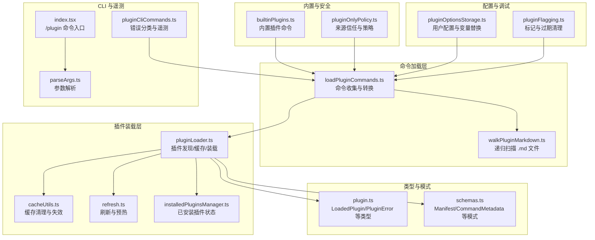
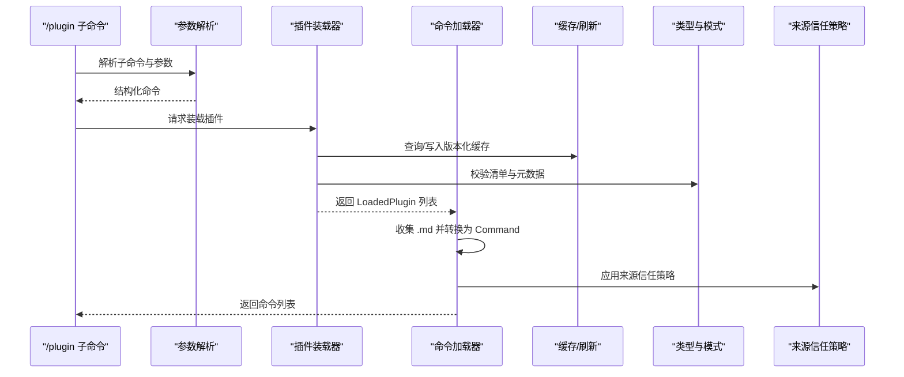
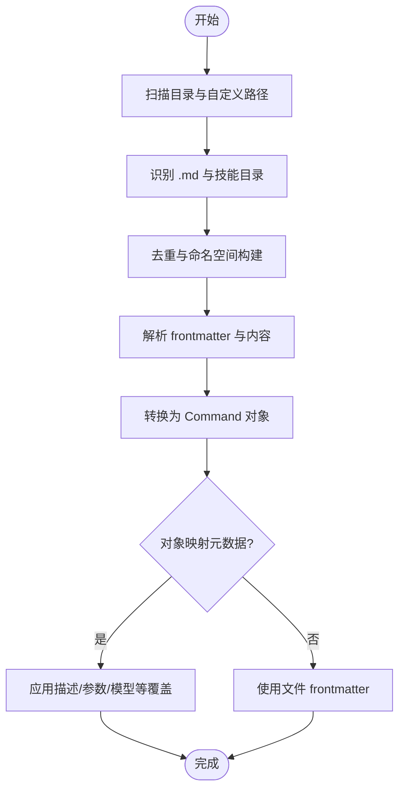
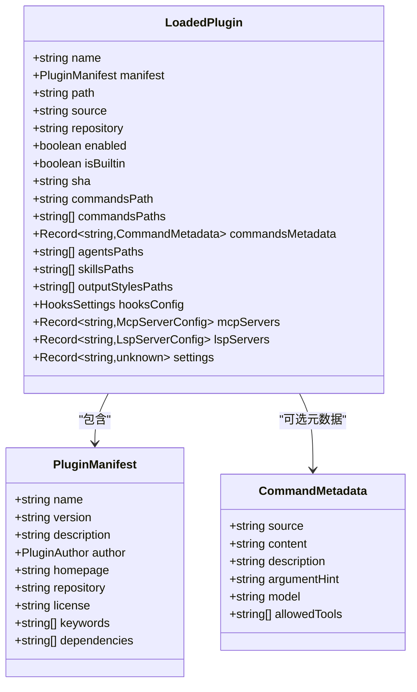
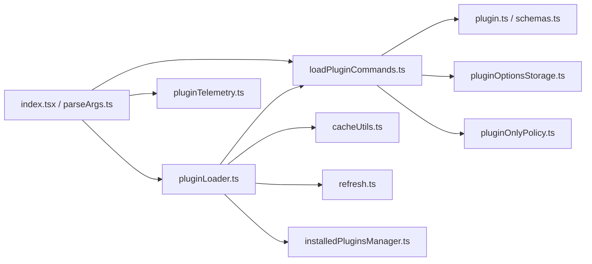

# 插件命令

<cite>
**本文引用的文件**
- [loadPluginCommands.ts](file://src/utils/plugins/loadPluginCommands.ts)
- [pluginLoader.ts](file://src/utils/plugins/pluginLoader.ts)
- [plugin.ts](file://src/types/plugin.ts)
- [schemas.ts](file://src/utils/plugins/schemas.ts)
- [builtinPlugins.ts](file://src/plugins/builtinPlugins.ts)
- [cacheUtils.ts](file://src/utils/plugins/cacheUtils.ts)
- [refresh.ts](file://src/utils/plugins/refresh.ts)
- [installedPluginsManager.ts](file://src/utils/plugins/installedPluginsManager.ts)
- [pluginOptionsStorage.ts](file://src/utils/plugins/pluginOptionsStorage.ts)
- [pluginFlagging.ts](file://src/utils/plugins/pluginFlagging.ts)
- [walkPluginMarkdown.ts](file://src/utils/plugins/walkPluginMarkdown.ts)
- [pluginOnlyPolicy.ts](file://src/utils/settings/pluginOnlyPolicy.ts)
- [pluginCliCommands.ts](file://src/services/plugins/pluginCliCommands.ts)
- [pluginTelemetry.ts](file://src/utils/telemetry/pluginTelemetry.ts)
- [index.tsx](file://src/commands/plugin/index.tsx)
- [parseArgs.ts](file://src/commands/plugin/parseArgs.ts)
- [ValidatePlugin.tsx](file://src/commands/plugin/ValidatePlugin.tsx)
</cite>

## 目录
1. [简介](#简介)
2. [项目结构](#项目结构)
3. [核心组件](#核心组件)
4. [架构总览](#架构总览)
5. [详细组件分析](#详细组件分析)
6. [依赖关系分析](#依赖关系分析)
7. [性能考量](#性能考量)
8. [故障排查指南](#故障排查指南)
9. [结论](#结论)
10. [附录](#附录)

## 简介
本文件为 free-code 的“插件命令”子系统提供完整的 API 参考与实现解析，覆盖以下主题：
- 插件命令的注册机制与动态加载流程
- 参数校验规则与返回值格式
- 特殊属性（pluginInfo、source、loadedFrom）
- 生命周期管理、缓存机制与性能优化策略
- 动态发现、过滤与调试方法
- 安全验证与来源分类（plugin、builtin）

## 项目结构
围绕插件命令的关键模块如下：
- 命令加载与转换：loadPluginCommands.ts
- 插件装载与缓存：pluginLoader.ts、cacheUtils.ts、refresh.ts、installedPluginsManager.ts
- 类型与模式：plugin.ts、schemas.ts
- 内置插件：builtinPlugins.ts
- 配置与变量替换：pluginOptionsStorage.ts
- 调试与标记：pluginFlagging.ts、walkPluginMarkdown.ts
- 权限与来源信任：pluginOnlyPolicy.ts
- CLI 命令与错误分类：pluginCliCommands.ts、pluginTelemetry.ts
- 命令入口与参数解析：index.tsx、parseArgs.ts、ValidatePlugin.tsx

图表来源
- [loadPluginCommands.ts](file://src/utils/plugins/loadPluginCommands.ts)
- [pluginLoader.ts](file://src/utils/plugins/pluginLoader.ts)
- [cacheUtils.ts](file://src/utils/plugins/cacheUtils.ts)
- [refresh.ts](file://src/utils/plugins/refresh.ts)
- [installedPluginsManager.ts](file://src/utils/plugins/installedPluginsManager.ts)
- [plugin.ts](file://src/types/plugin.ts)
- [schemas.ts](file://src/utils/plugins/schemas.ts)
- [builtinPlugins.ts](file://src/plugins/builtinPlugins.ts)
- [pluginOnlyPolicy.ts](file://src/utils/settings/pluginOnlyPolicy.ts)
- [pluginOptionsStorage.ts](file://src/utils/plugins/pluginOptionsStorage.ts)
- [pluginFlagging.ts](file://src/utils/plugins/pluginFlagging.ts)
- [walkPluginMarkdown.ts](file://src/utils/plugins/walkPluginMarkdown.ts)
- [index.tsx](file://src/commands/plugin/index.tsx)
- [parseArgs.ts](file://src/commands/plugin/parseArgs.ts)
- [pluginCliCommands.ts](file://src/services/plugins/pluginCliCommands.ts)

章节来源
- [loadPluginCommands.ts](file://src/utils/plugins/loadPluginCommands.ts)
- [pluginLoader.ts](file://src/utils/plugins/pluginLoader.ts)
- [plugin.ts](file://src/types/plugin.ts)
- [schemas.ts](file://src/utils/plugins/schemas.ts)
- [builtinPlugins.ts](file://src/plugins/builtinPlugins.ts)
- [cacheUtils.ts](file://src/utils/plugins/cacheUtils.ts)
- [refresh.ts](file://src/utils/plugins/refresh.ts)
- [installedPluginsManager.ts](file://src/utils/plugins/installedPluginsManager.ts)
- [pluginOptionsStorage.ts](file://src/utils/plugins/pluginOptionsStorage.ts)
- [pluginFlagging.ts](file://src/utils/plugins/pluginFlagging.ts)
- [walkPluginMarkdown.ts](file://src/utils/plugins/walkPluginMarkdown.ts)
- [pluginOnlyPolicy.ts](file://src/utils/settings/pluginOnlyPolicy.ts)
- [index.tsx](file://src/commands/plugin/index.tsx)
- [parseArgs.ts](file://src/commands/plugin/parseArgs.ts)
- [pluginCliCommands.ts](file://src/services/plugins/pluginCliCommands.ts)

## 核心组件
- 命令加载器：从插件目录与清单中收集命令，生成统一的 Command 对象；支持对象映射与内联内容两种元数据格式。
- 插件装载器：负责从市场或本地路径装载插件，维护版本化缓存、ZIP 缓存与种子缓存，处理严格模式与策略限制。
- 类型与模式：定义 LoadedPlugin、PluginError、CommandMetadata 等类型，并通过 Zod 模式进行强约束校验。
- 内置插件：将内置能力以命令形式暴露，遵循与外部插件一致的 Command 接口。
- 缓存与刷新：提供全局缓存清理、按组件粒度清理、按会话缓存清理等策略。
- 配置与变量替换：在命令渲染前注入用户配置、会话信息与插件根路径等变量。
- 来源信任与策略：区分 plugin、builtin、bundled 等来源，用于权限与定制限制。
- CLI 与遥测：提供 /plugin 子命令、参数解析与错误分类，便于诊断与统计。

章节来源
- [loadPluginCommands.ts](file://src/utils/plugins/loadPluginCommands.ts)
- [pluginLoader.ts](file://src/utils/plugins/pluginLoader.ts)
- [plugin.ts](file://src/types/plugin.ts)
- [schemas.ts](file://src/utils/plugins/schemas.ts)
- [builtinPlugins.ts](file://src/plugins/builtinPlugins.ts)
- [cacheUtils.ts](file://src/utils/plugins/cacheUtils.ts)
- [pluginOptionsStorage.ts](file://src/utils/plugins/pluginOptionsStorage.ts)
- [pluginOnlyPolicy.ts](file://src/utils/settings/pluginOnlyPolicy.ts)
- [pluginCliCommands.ts](file://src/services/plugins/pluginCliCommands.ts)

## 架构总览
下图展示插件命令从发现到呈现的端到端流程，包括动态加载、缓存与错误处理。

图表来源
- [pluginLoader.ts](file://src/utils/plugins/pluginLoader.ts)
- [loadPluginCommands.ts](file://src/utils/plugins/loadPluginCommands.ts)
- [cacheUtils.ts](file://src/utils/plugins/cacheUtils.ts)
- [pluginOnlyPolicy.ts](file://src/utils/settings/pluginOnlyPolicy.ts)
- [plugin.ts](file://src/types/plugin.ts)
- [schemas.ts](file://src/utils/plugins/schemas.ts)
- [index.tsx](file://src/commands/plugin/index.tsx)
- [parseArgs.ts](file://src/commands/plugin/parseArgs.ts)

## 详细组件分析

### 组件一：命令加载与转换（loadPluginCommands.ts）
职责与特性：
- 递归扫描插件 commands/ 目录与自定义路径，识别 .md 与技能目录（含 SKILL.md），去重与命名空间构建。
- 将 Markdown 文件转换为 Command 对象，支持 frontmatter 解析、参数名提取、工具允许列表、模型/努力度、shell 执行等。
- 支持对象映射格式的命令元数据（source 或 content），以及内联内容命令。
- 生成的 Command 具有统一的结构，包含 pluginInfo、source、loadedFrom 等特殊属性。

关键流程图（命令收集与转换）：

图表来源
- [loadPluginCommands.ts](file://src/utils/plugins/loadPluginCommands.ts)
- [walkPluginMarkdown.ts](file://src/utils/plugins/walkPluginMarkdown.ts)

章节来源
- [loadPluginCommands.ts](file://src/utils/plugins/loadPluginCommands.ts)
- [walkPluginMarkdown.ts](file://src/utils/plugins/walkPluginMarkdown.ts)

### 组件二：插件装载与缓存（pluginLoader.ts、cacheUtils.ts、refresh.ts、installedPluginsManager.ts）
职责与特性：
- 发现与装载插件：支持市场来源（npm/github/url/git-subdir）与本地相对路径；处理严格模式与策略限制。
- 缓存策略：版本化缓存、ZIP 缓存、种子缓存；支持会话级缓存与持久缓存。
- 刷新与预热：先全量装载，再并发获取命令与代理定义，避免缓存不一致。
- 已安装插件状态：提供内存快照与磁盘直读两种视图，保证后台更新不影响运行时一致性。

类图（核心类型与关系）：

图表来源
- [pluginLoader.ts](file://src/utils/plugins/pluginLoader.ts)
- [plugin.ts](file://src/types/plugin.ts)
- [schemas.ts](file://src/utils/plugins/schemas.ts)

章节来源
- [pluginLoader.ts](file://src/utils/plugins/pluginLoader.ts)
- [cacheUtils.ts](file://src/utils/plugins/cacheUtils.ts)
- [refresh.ts](file://src/utils/plugins/refresh.ts)
- [installedPluginsManager.ts](file://src/utils/plugins/installedPluginsManager.ts)
- [plugin.ts](file://src/types/plugin.ts)
- [schemas.ts](file://src/utils/plugins/schemas.ts)

### 组件三：内置插件命令（builtinPlugins.ts）
职责与特性：
- 将内置能力（如技能）以命令形式暴露，遵循与外部插件一致的 Command 接口。
- 仅启用的内置插件才会输出命令，禁用则忽略。

章节来源
- [builtinPlugins.ts](file://src/plugins/builtinPlugins.ts)

### 组件四：来源分类与安全策略（pluginOnlyPolicy.ts、plugin.ts）
职责与特性：
- 来源分类：plugin（来自市场或本地）、builtin（内置）、bundled（随 CLI 内置）等。
- 策略控制：在严格模式下，仅允许受信任来源的定制项生效，避免用户侧来源污染。

章节来源
- [pluginOnlyPolicy.ts](file://src/utils/settings/pluginOnlyPolicy.ts)
- [plugin.ts](file://src/types/plugin.ts)

### 组件五：配置与变量替换（pluginOptionsStorage.ts、loadPluginCommands.ts）
职责与特性：
- 用户配置：在清单中声明 userConfig，启用时提示用户输入，敏感项存储于安全存储，非敏感项存储于设置文件。
- 变量替换：在命令渲染前，替换 ${CLAUDE_PLUGIN_ROOT}、${CLAUDE_PLUGIN_DATA}、${CLAUDE_SKILL_DIR}、${CLAUDE_SESSION_ID} 以及 ${user_config.*} 等变量。

章节来源
- [pluginOptionsStorage.ts](file://src/utils/plugins/pluginOptionsStorage.ts)
- [loadPluginCommands.ts](file://src/utils/plugins/loadPluginCommands.ts)

### 组件六：动态发现与过滤（walkPluginMarkdown.ts、loadPluginCommands.ts）
职责与特性：
- 动态发现：递归遍历插件目录，遇到包含 SKILL.md 的目录作为叶子容器，不再继续深入。
- 过滤机制：通过 frontmatter 控制可见性（如 user-invocable），并通过 memoize 缓存结果。

章节来源
- [walkPluginMarkdown.ts](file://src/utils/plugins/walkPluginMarkdown.ts)
- [loadPluginCommands.ts](file://src/utils/plugins/loadPluginCommands.ts)

### 组件七：CLI 与调试（index.tsx、parseArgs.ts、pluginCliCommands.ts、pluginTelemetry.ts、ValidatePlugin.tsx）
职责与特性：
- 命令入口：/plugin 主命令，别名 /plugins 与 /marketplace。
- 参数解析：install/manage/uninstall/enable/disable/validate/marketplace 等子命令解析。
- 错误分类与遥测：根据错误消息分类网络/未找到/权限/校验/未知，上报事件以便监控。
- 验证：提供 /plugin validate 用于校验清单与目录。

章节来源
- [index.tsx](file://src/commands/plugin/index.tsx)
- [parseArgs.ts](file://src/commands/plugin/parseArgs.ts)
- [pluginCliCommands.ts](file://src/services/plugins/pluginCliCommands.ts)
- [pluginTelemetry.ts](file://src/utils/telemetry/pluginTelemetry.ts)
- [ValidatePlugin.tsx](file://src/commands/plugin/ValidatePlugin.tsx)

## 依赖关系分析
- 命令加载依赖插件装载与清单模式，同时受来源信任策略约束。
- 缓存层贯穿装载与加载阶段，确保性能与一致性。
- CLI 层负责入口与参数解析，错误处理与遥测贯穿全流程。

图表来源
- [pluginLoader.ts](file://src/utils/plugins/pluginLoader.ts)
- [loadPluginCommands.ts](file://src/utils/plugins/loadPluginCommands.ts)
- [cacheUtils.ts](file://src/utils/plugins/cacheUtils.ts)
- [refresh.ts](file://src/utils/plugins/refresh.ts)
- [installedPluginsManager.ts](file://src/utils/plugins/installedPluginsManager.ts)
- [plugin.ts](file://src/types/plugin.ts)
- [schemas.ts](file://src/utils/plugins/schemas.ts)
- [pluginOptionsStorage.ts](file://src/utils/plugins/pluginOptionsStorage.ts)
- [pluginOnlyPolicy.ts](file://src/utils/settings/pluginOnlyPolicy.ts)
- [index.tsx](file://src/commands/plugin/index.tsx)
- [parseArgs.ts](file://src/commands/plugin/parseArgs.ts)
- [pluginTelemetry.ts](file://src/utils/telemetry/pluginTelemetry.ts)

## 性能考量
- 缓存策略
  - 版本化缓存：按 marketplace/name/version 组织，避免重复下载与克隆。
  - ZIP 缓存：对外部来源优先使用 ZIP 缓存，减少解压开销。
  - 种子缓存：在只读镜像场景复用预烘焙内容，提升启动速度。
  - 会话缓存：在会话临时目录解压 ZIP，避免影响主缓存。
- 并发与去重
  - 插件与命令加载采用 Promise.all 并发，内部使用 Set 去重，降低 IO 与重复工作。
- 记忆化
  - 命令加载、选项加载等使用 memoize，减少重复计算与系统调用。
- 刷新顺序
  - 先全量装载，再并发获取命令与代理定义，避免缓存竞争与不一致。

章节来源
- [pluginLoader.ts](file://src/utils/plugins/pluginLoader.ts)
- [cacheUtils.ts](file://src/utils/plugins/cacheUtils.ts)
- [refresh.ts](file://src/utils/plugins/refresh.ts)
- [loadPluginCommands.ts](file://src/utils/plugins/loadPluginCommands.ts)
- [pluginOptionsStorage.ts](file://src/utils/plugins/pluginOptionsStorage.ts)

## 故障排查指南
- 常见错误分类
  - 网络类：DNS/连接/超时/拒绝等
  - 未找到：插件/资源不存在
  - 权限类：鉴权/权限不足
  - 校验类：清单/模式/解析错误
  - 未知：其他异常
- 诊断步骤
  - 使用 /plugin validate 校验清单与目录
  - 查看日志与错误消息中的具体路径与组件
  - 清理缓存后重试：/reload-plugins 或触发 clearAllPluginCaches
  - 检查来源策略与严格模式限制
- 关键入口
  - 错误分类与遥测：pluginTelemetry.ts
  - CLI 错误处理：pluginCliCommands.ts
  - 验证命令：ValidatePlugin.tsx

章节来源
- [pluginTelemetry.ts](file://src/utils/telemetry/pluginTelemetry.ts)
- [pluginCliCommands.ts](file://src/services/plugins/pluginCliCommands.ts)
- [ValidatePlugin.tsx](file://src/commands/plugin/ValidatePlugin.tsx)
- [cacheUtils.ts](file://src/utils/plugins/cacheUtils.ts)

## 结论
插件命令系统通过严格的类型与模式约束、完善的缓存与刷新策略、清晰的来源信任机制与健壮的错误分类，实现了高可用、高性能且可扩展的动态命令加载与执行框架。开发者可通过对象映射与内联内容两种方式快速发布命令，配合用户配置与变量替换实现灵活的上下文适配，并借助 CLI 与遥测工具进行高效调试与运维。

## 附录

### 插件命令接口规范（概要）
- 输入
  - 插件清单（plugin.json）与命令元数据（manifest.commands）
  - Markdown 命令文件（frontmatter 包含描述、参数、工具、模型、努力度等）
  - 用户配置（manifest.userConfig）与会话上下文变量
- 处理
  - 递归扫描与去重、命名空间构建、frontmatter 解析、变量替换、shell 执行
- 输出
  - 统一的 Command 对象，包含 name、description、allowedTools、argNames、model、effort、pluginInfo、source、loadedFrom 等字段

章节来源
- [loadPluginCommands.ts](file://src/utils/plugins/loadPluginCommands.ts)
- [schemas.ts](file://src/utils/plugins/schemas.ts)
- [pluginOptionsStorage.ts](file://src/utils/plugins/pluginOptionsStorage.ts)

### 插件命令来源分类
- plugin：来自市场或本地路径的插件
- builtin：内置插件（随 CLI 提供）
- bundled：随 CLI 内置的资源

章节来源
- [pluginOnlyPolicy.ts](file://src/utils/settings/pluginOnlyPolicy.ts)
- [plugin.ts](file://src/types/plugin.ts)

### 插件命令生命周期
- 发现：扫描目录与清单，识别命令与技能
- 装载：版本化缓存/ZIP/种子缓存，装载插件
- 转换：解析 frontmatter，生成 Command 对象
- 过滤：应用来源信任与可见性控制
- 呈现：供 CLI 与 UI 使用

章节来源
- [pluginLoader.ts](file://src/utils/plugins/pluginLoader.ts)
- [loadPluginCommands.ts](file://src/utils/plugins/loadPluginCommands.ts)
- [pluginOnlyPolicy.ts](file://src/utils/settings/pluginOnlyPolicy.ts)

### 插件命令缓存与刷新
- 缓存清理：clearAllPluginCaches、clearPluginCommandCache、clearPluginOptionsCache
- 刷新顺序：loadAllPlugins → 并发获取命令与代理定义 → 合并结果
- 会话缓存：ZIP 解压至会话目录，避免影响主缓存

章节来源
- [cacheUtils.ts](file://src/utils/plugins/cacheUtils.ts)
- [refresh.ts](file://src/utils/plugins/refresh.ts)
- [pluginLoader.ts](file://src/utils/plugins/pluginLoader.ts)

### 插件命令调用示例（步骤说明）
- 定义命令
  - 在插件目录编写 Markdown 文件，frontmatter 中声明描述、参数、工具、模型、努力度等
  - 使用对象映射或内联内容定义命令元数据
- 参数传递
  - frontmatter 中的 arguments 与 argument-hint 用于提示与校验
  - 命令执行前进行变量替换（${CLAUDE_PLUGIN_ROOT}、${CLAUDE_PLUGIN_DATA}、${CLAUDE_SESSION_ID}、${user_config.*}）
- 结果处理
  - Command.getPromptForCommand 返回文本片段，供后续工具调用
  - 可通过 allowed-tools 与 user-invocable 控制可见性与权限

章节来源
- [loadPluginCommands.ts](file://src/utils/plugins/loadPluginCommands.ts)
- [pluginOptionsStorage.ts](file://src/utils/plugins/pluginOptionsStorage.ts)