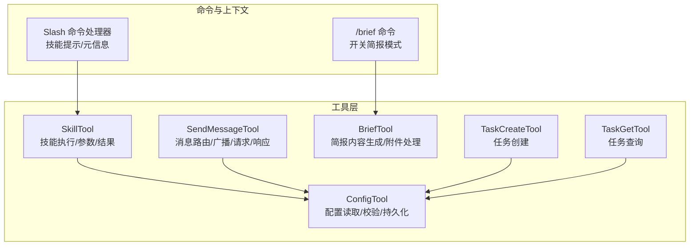
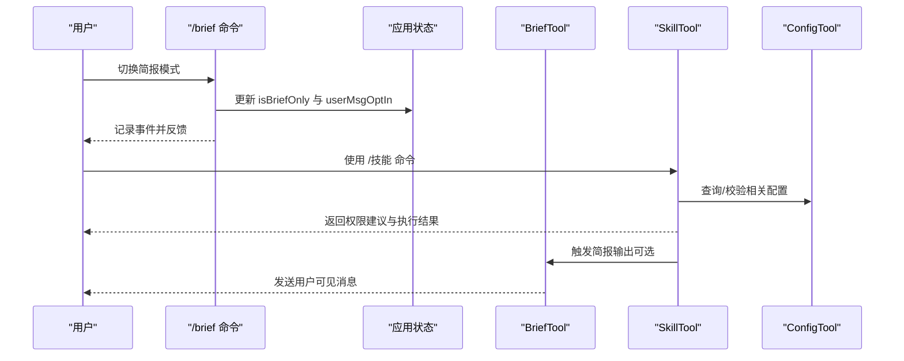
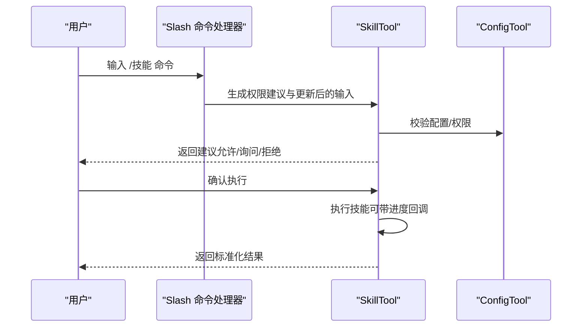
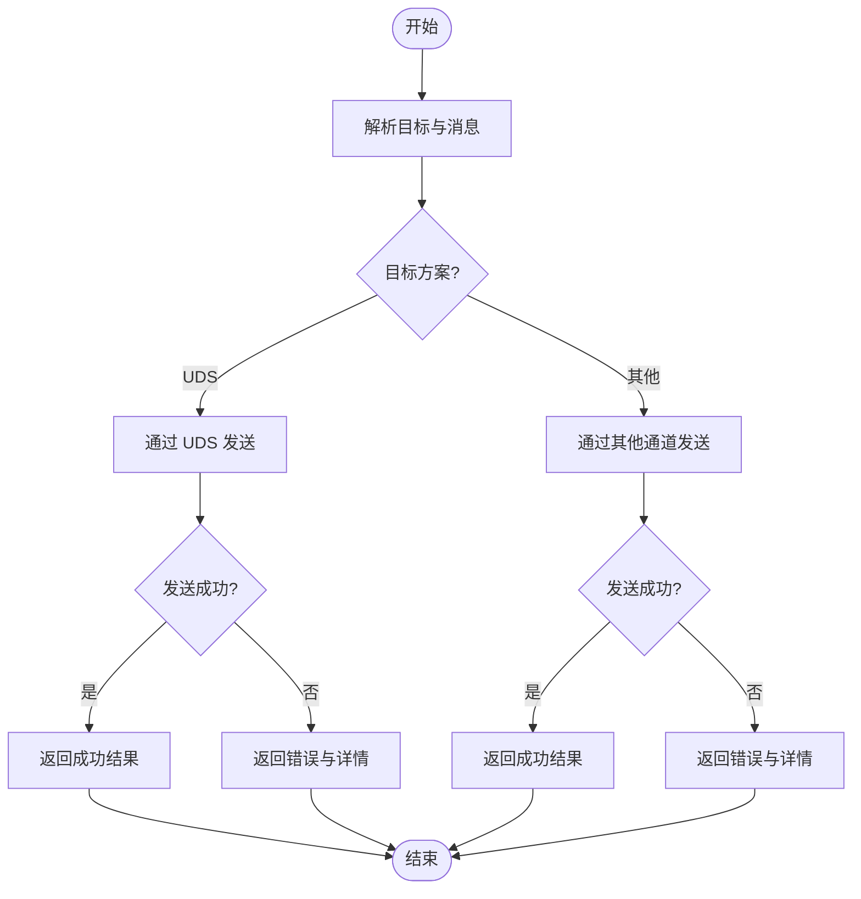
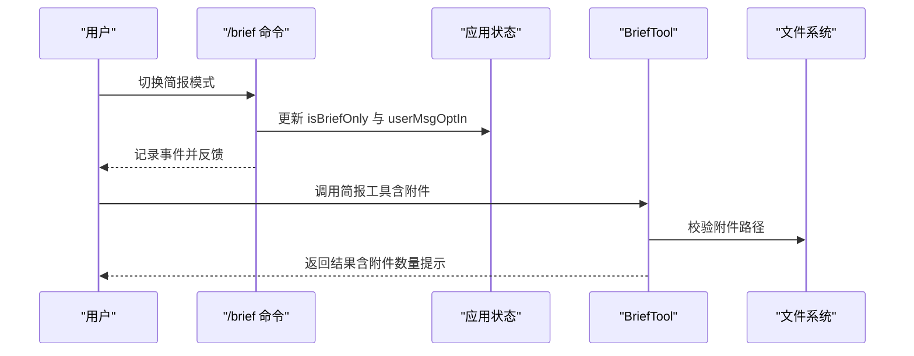
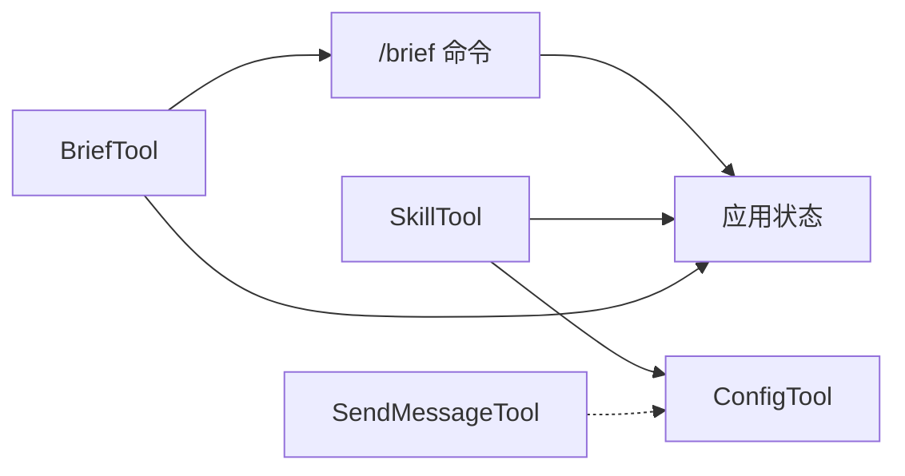

# 实用工具

<cite>
**本文引用的文件**
- [src/tools/ConfigTool/constants.ts](file://src/tools/ConfigTool/constants.ts)
- [src/tools/SkillTool/SkillTool.ts](file://src/tools/SkillTool/SkillTool.ts)
- [src/tools/SkillTool/constants.ts](file://src/tools/SkillTool/constants.ts)
- [src/utils/processUserInput/processSlashCommand.tsx](file://src/utils/processUserInput/processSlashCommand.tsx)
- [src/tools/SendMessageTool/SendMessageTool.ts](file://src/tools/SendMessageTool/SendMessageTool.ts)
- [src/tools/SendMessageTool/constants.ts](file://src/tools/SendMessageTool/constants.ts)
- [src/tools/BriefTool/BriefTool.ts](file://src/tools/BriefTool/BriefTool.ts)
- [src/tools/BriefTool/prompt.ts](file://src/tools/BriefTool/prompt.ts)
- [src/commands/brief.ts](file://src/commands/brief.ts)
- [src/tools/TaskCreateTool/constants.ts](file://src/tools/TaskCreateTool/constants.ts)
- [src/tools/TaskGetTool/constants.ts](file://src/tools/TaskGetTool/constants.ts)
</cite>

## 目录
1. [简介](#简介)
2. [项目结构](#项目结构)
3. [核心组件](#核心组件)
4. [架构总览](#架构总览)
5. [详细组件分析](#详细组件分析)
6. [依赖分析](#依赖分析)
7. [性能考虑](#性能考虑)
8. [故障排查指南](#故障排查指南)
9. [结论](#结论)
10. [附录](#附录)

## 简介
本文件为 free-code 实用工具的 API 参考文档，聚焦以下工具与能力：
- 配置管理：ConfigTool 的配置读取、校验与持久化接口
- 技能执行：SkillTool 的技能调用、参数传递与结果处理
- 任务管理：TaskCreate/TaskGet 等任务生命周期接口与状态跟踪
- 消息发送：SendMessageTool 的消息格式、目标选择与确认机制
- 简报工具：SendUserMessage（BriefTool）的内容生成与附件处理
- 工具配置与自动化：批量操作、权限建议与自动化触发

## 项目结构
实用工具主要位于 src/tools 下，围绕“工具即服务”的模式组织，每个工具以独立模块暴露统一的 Tool 接口规范（名称、输入输出模式、可用性、并发安全等），并通过命令系统或上下文交互进行激活。

图表来源
- [src/tools/ConfigTool/constants.ts:1-1](file://src/tools/ConfigTool/constants.ts#L1-L1)
- [src/tools/SkillTool/SkillTool.ts:580-592](file://src/tools/SkillTool/SkillTool.ts#L580-L592)
- [src/tools/SendMessageTool/SendMessageTool.ts:92-132](file://src/tools/SendMessageTool/SendMessageTool.ts#L92-L132)
- [src/tools/BriefTool/BriefTool.ts:136-187](file://src/tools/BriefTool/BriefTool.ts#L136-L187)
- [src/commands/brief.ts:47-99](file://src/commands/brief.ts#L47-L99)
- [src/utils/processUserInput/processSlashCommand.tsx:838-869](file://src/utils/processUserInput/processSlashCommand.tsx#L838-L869)

章节来源
- [src/tools/ConfigTool/constants.ts:1-1](file://src/tools/ConfigTool/constants.ts#L1-L1)
- [src/tools/SkillTool/SkillTool.ts:580-592](file://src/tools/SkillTool/SkillTool.ts#L580-L592)
- [src/tools/SendMessageTool/SendMessageTool.ts:92-132](file://src/tools/SendMessageTool/SendMessageTool.ts#L92-L132)
- [src/tools/BriefTool/BriefTool.ts:136-187](file://src/tools/BriefTool/BriefTool.ts#L136-L187)
- [src/commands/brief.ts:47-99](file://src/commands/brief.ts#L47-L99)
- [src/utils/processUserInput/processSlashCommand.tsx:838-869](file://src/utils/processUserInput/processSlashCommand.tsx#L838-L869)

## 核心组件
- ConfigTool：提供配置项的读取、校验与持久化能力，作为其他工具的配置后端
- SkillTool：负责技能的解析、权限建议、调用与结果映射
- SendMessageTool：支持点对点消息、广播、请求/响应等多形态消息路由
- BriefTool：面向用户的简报输出工具，支持附件与状态标记
- TaskCreateTool/TaskGetTool：任务生命周期中的创建与查询接口
- /brief 命令：用于切换简报模式，影响工具可用性与提示策略

章节来源
- [src/tools/ConfigTool/constants.ts:1-1](file://src/tools/ConfigTool/constants.ts#L1-L1)
- [src/tools/SkillTool/SkillTool.ts:580-592](file://src/tools/SkillTool/SkillTool.ts#L580-L592)
- [src/tools/SendMessageTool/SendMessageTool.ts:92-132](file://src/tools/SendMessageTool/SendMessageTool.ts#L92-L132)
- [src/tools/BriefTool/BriefTool.ts:136-187](file://src/tools/BriefTool/BriefTool.ts#L136-L187)
- [src/commands/brief.ts:47-99](file://src/commands/brief.ts#L47-L99)

## 架构总览
工具通过统一的 Tool 接口对外暴露能力，内部通过上下文（如应用状态、权限策略、配置中心）协作完成业务闭环。命令系统与用户输入处理模块负责将自然语言意图转化为工具调用。

图表来源
- [src/commands/brief.ts:47-99](file://src/commands/brief.ts#L47-L99)
- [src/tools/BriefTool/BriefTool.ts:136-187](file://src/tools/BriefTool/BriefTool.ts#L136-L187)
- [src/tools/SkillTool/SkillTool.ts:580-592](file://src/tools/SkillTool/SkillTool.ts#L580-L592)
- [src/tools/ConfigTool/constants.ts:1-1](file://src/tools/ConfigTool/constants.ts#L1-L1)

## 详细组件分析

### ConfigTool：配置管理接口
- 工具名称常量：用于标识配置工具的统一名称
- 职责边界
  - 读取：从配置源获取键值对，支持默认值与类型校验
  - 校验：对输入进行格式与范围校验，返回验证结果
  - 持久化：将变更写回配置存储，确保一致性与原子性
- 典型调用链
  - 其他工具在执行前先调用 validateInput 进行参数校验
  - 在需要时调用持久化接口保存配置
- 错误处理
  - 输入非法：返回明确的错误信息，避免继续执行
  - 写入失败：回滚或重试策略，保证数据一致性

章节来源
- [src/tools/ConfigTool/constants.ts:1-1](file://src/tools/ConfigTool/constants.ts#L1-L1)

### SkillTool：技能执行接口
- 工具名称常量：用于标识技能工具
- 输入输出
  - 输入：包含技能名与参数对象
  - 输出：标准化的结果对象，包含执行状态与附加信息
- 参数传递与校验
  - 解析命令名与参数，生成权限建议（精确匹配与通配符前缀）
  - 默认行为为“询问用户”，允许自动授权或拒绝
- 执行流程
  - validateInput：确认技能存在、可加载、未禁用模型调用
  - call：执行技能逻辑，支持进度回调（onProgress）
  - 结果映射：将执行结果映射为工具块参数，便于下游消费
- 权限与安全
  - 通过“添加规则”建议授予临时工具权限
  - 支持本地设置目的地，避免越权

图表来源
- [src/utils/processUserInput/processSlashCommand.tsx:838-869](file://src/utils/processUserInput/processSlashCommand.tsx#L838-L869)
- [src/tools/SkillTool/SkillTool.ts:580-592](file://src/tools/SkillTool/SkillTool.ts#L580-L592)
- [src/tools/ConfigTool/constants.ts:1-1](file://src/tools/ConfigTool/constants.ts#L1-L1)

章节来源
- [src/tools/SkillTool/SkillTool.ts:580-592](file://src/tools/SkillTool/SkillTool.ts#L580-L592)
- [src/tools/SkillTool/constants.ts:1-1](file://src/tools/SkillTool/constants.ts#L1-L1)
- [src/utils/processUserInput/processSlashCommand.tsx:838-869](file://src/utils/processUserInput/processSlashCommand.tsx#L838-L869)

### 任务管理工具：生命周期与状态跟踪
- 工具命名
  - TaskCreateTool：任务创建
  - TaskGetTool：任务查询
- 生命周期
  - 创建：接收任务描述、参数与优先级，返回任务标识
  - 查询：按标识获取任务状态、进度与结果
  - 更新/停止：支持进度上报与中止
- 状态与进度
  - 统一的状态枚举与进度指标，便于前端渲染与用户感知
  - 支持批量查询与过滤条件

章节来源
- [src/tools/TaskCreateTool/constants.ts:1-1](file://src/tools/TaskCreateTool/constants.ts#L1-L1)
- [src/tools/TaskGetTool/constants.ts:1-1](file://src/tools/TaskGetTool/constants.ts#L1-L1)

### 消息发送工具：接口规范
- 工具名称常量：用于标识消息发送工具
- 类型定义
  - MessageOutput：点对点消息发送结果
  - BroadcastOutput：广播发送结果（含收件人列表）
  - RequestOutput：请求/响应模式（含请求 ID）
  - SendMessageToolOutput：联合类型，覆盖上述所有输出形态
- 路由与目标
  - 支持多种目标方案（例如基于名称或标识）
  - 自动解析颜色与摘要，提升可读性
- 协议与传输
  - 支持 Unix Domain Socket（UDS）直连发送
  - 失败时返回错误信息与预览摘要
- 确认机制
  - 成功/失败标志与消息文本
  - 广播场景下返回收件人列表

图表来源
- [src/tools/SendMessageTool/SendMessageTool.ts:92-132](file://src/tools/SendMessageTool/SendMessageTool.ts#L92-L132)
- [src/tools/SendMessageTool/SendMessageTool.ts:775-798](file://src/tools/SendMessageTool/SendMessageTool.ts#L775-L798)

章节来源
- [src/tools/SendMessageTool/SendMessageTool.ts:92-132](file://src/tools/SendMessageTool/SendMessageTool.ts#L92-L132)
- [src/tools/SendMessageTool/constants.ts:1-1](file://src/tools/SendMessageTool/constants.ts#L1-L1)

### 简报工具：内容生成与附件处理
- 工具名称与别名
  - 主名：SendUserMessage
  - 别名：Brief
- 启用控制
  - 通过功能门控与用户开关共同决定是否启用
  - 支持“仅简报模式”（brief-only）切换
- 输入与校验
  - 支持消息正文与附件路径数组
  - 附件路径校验：确保可访问与合规
- 输出与渲染
  - 将结果映射为工具块参数，包含附件数量提示
  - 渲染用户可见的消息块
- 状态标记
  - status 字段用于表达意图（正常/主动），驱动下游路由

图表来源
- [src/commands/brief.ts:47-99](file://src/commands/brief.ts#L47-L99)
- [src/tools/BriefTool/BriefTool.ts:136-187](file://src/tools/BriefTool/BriefTool.ts#L136-L187)
- [src/tools/BriefTool/prompt.ts:1-16](file://src/tools/BriefTool/prompt.ts#L1-L16)

章节来源
- [src/tools/BriefTool/BriefTool.ts:136-187](file://src/tools/BriefTool/BriefTool.ts#L136-L187)
- [src/tools/BriefTool/prompt.ts:1-16](file://src/tools/BriefTool/prompt.ts#L1-L16)
- [src/commands/brief.ts:47-99](file://src/commands/brief.ts#L47-L99)

## 依赖分析
- 工具间耦合
  - SkillTool 依赖 ConfigTool 进行配置校验与权限建议
  - SendMessageTool 与 ConfigTool 无直接耦合，但可复用其配置能力
  - BriefTool 与 /brief 命令强关联，受用户开关与功能门控影响
- 外部依赖
  - 功能门控（feature）用于编译期/运行期裁剪
  - 应用状态（appState）用于共享用户偏好与开关
  - 文件系统用于附件校验与读取

图表来源
- [src/tools/SkillTool/SkillTool.ts:580-592](file://src/tools/SkillTool/SkillTool.ts#L580-L592)
- [src/tools/ConfigTool/constants.ts:1-1](file://src/tools/ConfigTool/constants.ts#L1-L1)
- [src/commands/brief.ts:47-99](file://src/commands/brief.ts#L47-L99)

章节来源
- [src/tools/SkillTool/SkillTool.ts:580-592](file://src/tools/SkillTool/SkillTool.ts#L580-L592)
- [src/tools/ConfigTool/constants.ts:1-1](file://src/tools/ConfigTool/constants.ts#L1-L1)
- [src/commands/brief.ts:47-99](file://src/commands/brief.ts#L47-L99)

## 性能考虑
- 工具并发安全
  - BriefTool 标记为并发安全，适合高并发输出
  - SkillTool 的并发取决于具体技能实现，建议在工具层面做好隔离
- I/O 优化
  - 附件路径校验应避免重复扫描，缓存校验结果
  - UDS 发送失败时快速失败并返回错误，减少阻塞
- 配置访问
  - 使用惰性模式与缓存策略降低频繁读取开销

## 故障排查指南
- 技能执行被拒绝
  - 检查权限建议是否正确生成，确认用户是否授权
  - 核对技能是否存在、可加载且未禁用模型调用
- 消息发送失败
  - 检查目标方案与地址合法性
  - 查看 UDS 连接状态与权限
- 简报不可见
  - 确认 /brief 命令已开启，且用户具备简报资格
  - 检查 isBriefOnly 与 userMsgOptIn 是否同步

章节来源
- [src/tools/SkillTool/SkillTool.ts:580-592](file://src/tools/SkillTool/SkillTool.ts#L580-L592)
- [src/tools/SendMessageTool/SendMessageTool.ts:775-798](file://src/tools/SendMessageTool/SendMessageTool.ts#L775-L798)
- [src/commands/brief.ts:47-99](file://src/commands/brief.ts#L47-L99)

## 结论
本文档梳理了 free-code 实用工具的核心接口与行为边界，涵盖配置、技能、任务、消息与简报五大类能力。通过统一的工具接口与命令系统，实现了从意图到执行再到反馈的完整闭环。建议在生产使用中结合功能门控与用户开关，确保工具能力的安全与可控。

## 附录
- 工具命名常量
  - ConfigTool：CONFIG_TOOL_NAME
  - SkillTool：SKILL_TOOL_NAME
  - SendMessageTool：SEND_MESSAGE_TOOL_NAME
  - BriefTool：BRIEF_TOOL_NAME / LEGACY_BRIEF_TOOL_NAME
  - TaskCreateTool：TASK_CREATE_TOOL_NAME
  - TaskGetTool：TASK_GET_TOOL_NAME

章节来源
- [src/tools/ConfigTool/constants.ts:1-1](file://src/tools/ConfigTool/constants.ts#L1-L1)
- [src/tools/SkillTool/constants.ts:1-1](file://src/tools/SkillTool/constants.ts#L1-L1)
- [src/tools/SendMessageTool/constants.ts:1-1](file://src/tools/SendMessageTool/constants.ts#L1-L1)
- [src/tools/BriefTool/prompt.ts:1-2](file://src/tools/BriefTool/prompt.ts#L1-L2)
- [src/tools/TaskCreateTool/constants.ts:1-1](file://src/tools/TaskCreateTool/constants.ts#L1-L1)
- [src/tools/TaskGetTool/constants.ts:1-1](file://src/tools/TaskGetTool/constants.ts#L1-L1)