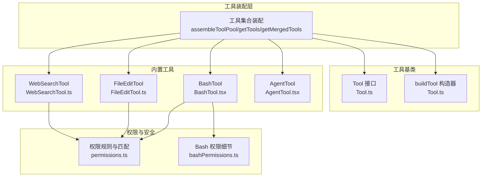
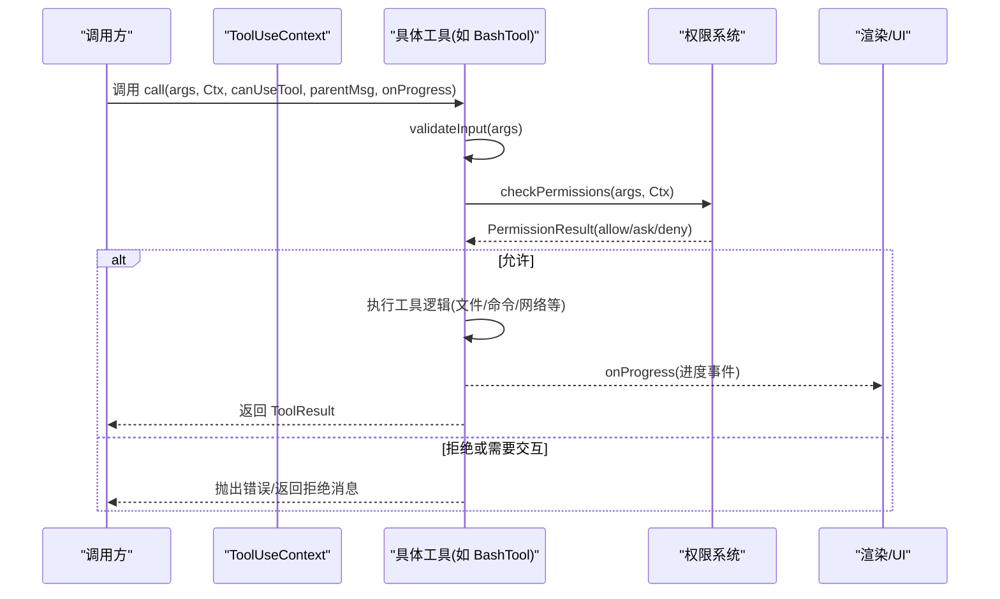
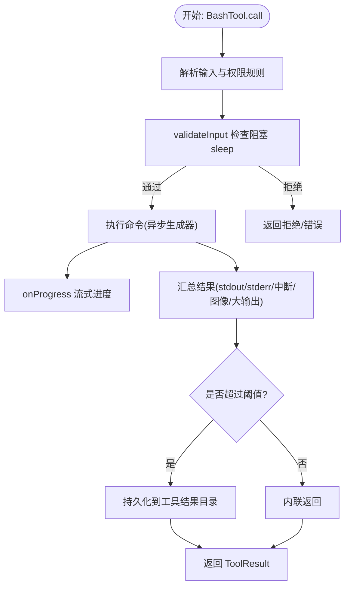
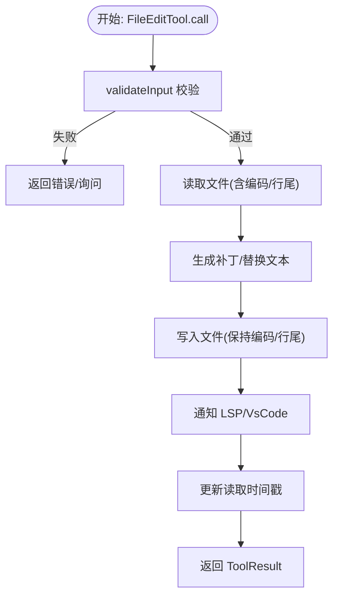
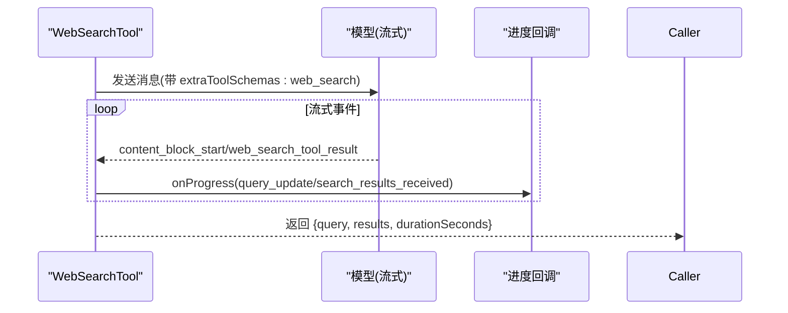
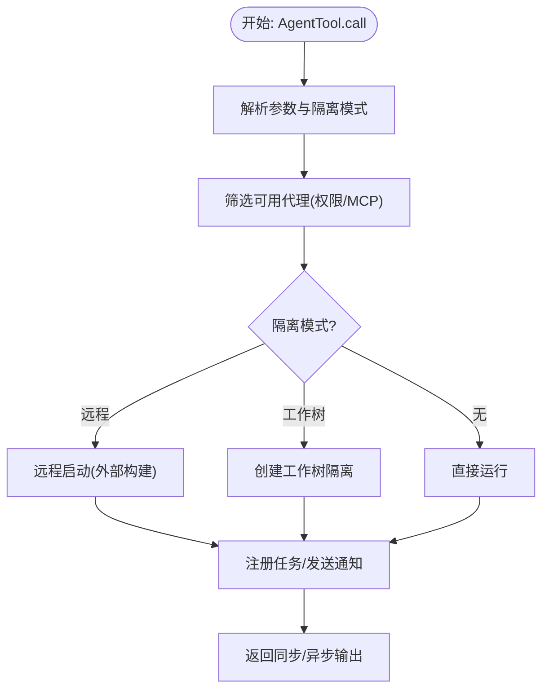
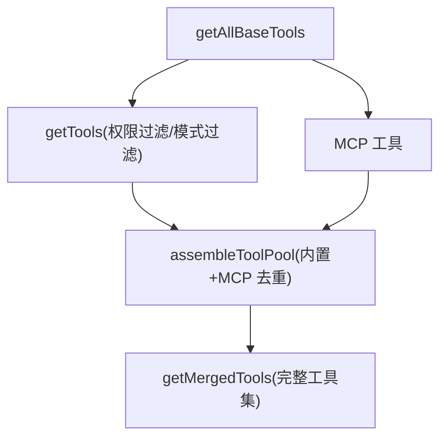
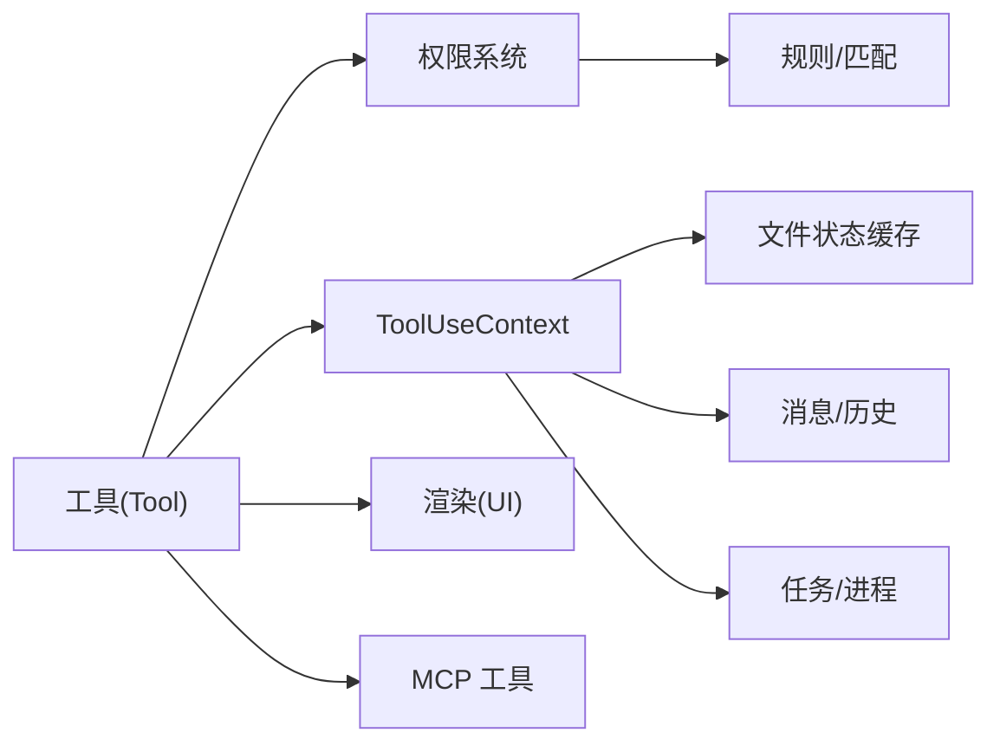

# 工具 API

<cite>
**本文引用的文件**
- [src/tools.ts](file://src/tools.ts)
- [src/Tool.ts](file://src/Tool.ts)
- [src/tools/BashTool/BashTool.tsx](file://src/tools/BashTool/BashTool.tsx)
- [src/tools/FileEditTool/FileEditTool.ts](file://src/tools/FileEditTool/FileEditTool.ts)
- [src/tools/WebSearchTool/WebSearchTool.ts](file://src/tools/WebSearchTool/WebSearchTool.ts)
- [src/tools/AgentTool/AgentTool.tsx](file://src/tools/AgentTool/AgentTool.tsx)
- [src/constants/tools.ts](file://src/constants/tools.ts)
- [src/utils/permissions/permissions.ts](file://src/utils/permissions/permissions.ts)
- [src/tools/BashTool/bashPermissions.ts](file://src/tools/BashTool/bashPermissions.ts)
- [src/tools/FileEditTool/types.ts](file://src/tools/FileEditTool/types.ts)
</cite>

## 目录
1. [简介](#简介)
2. [项目结构](#项目结构)
3. [核心组件](#核心组件)
4. [架构总览](#架构总览)
5. [详细组件分析](#详细组件分析)
6. [依赖关系分析](#依赖关系分析)
7. [性能考量](#性能考量)
8. [故障排查指南](#故障排查指南)
9. [结论](#结论)
10. [附录](#附录)

## 简介
本文件为 free-code 工具系统的全面 API 参考与开发指南，覆盖工具注册机制、工具执行流程、权限控制系统与安全验证规则，并对典型工具类型（如 BashTool、FileEditTool、WebSearchTool、AgentTool）进行接口规范说明。内容包括：
- 工具类型定义与调用契约
- 工具执行上下文、输入输出格式、错误处理与异常场景
- 权限声明、安全校验与自动模式分类器
- 工具开发最佳实践：继承 buildTool、输入输出模式、渲染与进度 UI、调试方法
- 性能监控、资源限制与优化建议

## 项目结构
free-code 的工具系统以“工具即对象”的方式组织，每个工具实现遵循统一的 Tool 接口契约；工具池由集中装配函数生成，结合权限规则与 MCP 工具进行合并。



**图表来源**
- [src/tools.ts](file://src/tools.ts)
- [src/Tool.ts](file://src/Tool.ts)
- [src/tools/BashTool/BashTool.tsx](file://src/tools/BashTool/BashTool.tsx)
- [src/tools/FileEditTool/FileEditTool.ts](file://src/tools/FileEditTool/FileEditTool.ts)
- [src/tools/WebSearchTool/WebSearchTool.ts](file://src/tools/WebSearchTool/WebSearchTool.ts)
- [src/tools/AgentTool/AgentTool.tsx](file://src/tools/AgentTool/AgentTool.tsx)
- [src/utils/permissions/permissions.ts](file://src/utils/permissions/permissions.ts)
- [src/tools/BashTool/bashPermissions.ts](file://src/tools/BashTool/bashPermissions.ts)

**章节来源**
- [src/tools.ts](file://src/tools.ts)
- [src/Tool.ts](file://src/Tool.ts)

## 核心组件
- 工具接口与契约
  - 工具类型 Tool 定义了 call、checkPermissions、validateInput、render 系列方法、输入输出模式、并发安全、只读/破坏性标记、搜索/读取命令识别等能力。
  - 工具通过 buildTool 构造器统一注入默认行为（如默认允许、并发安全、只读、破坏性、权限检查、分类器输入等），避免重复实现。
- 工具装配与过滤
  - getAllBaseTools 提供当前环境可用的全部内置工具清单；
  - getTools 基于权限上下文过滤工具并考虑 REPL 模式、简单模式、协调者模式等；
  - assembleToolPool 合并内置工具与 MCP 工具，按名称去重且内置工具优先；
  - filterToolsByDenyRules 依据拒绝规则剔除工具。
- 工具上下文 ToolUseContext
  - 包含运行选项、AbortController、文件状态缓存、应用状态读写、消息与历史、工具决策追踪、文件读取/全局搜索限制、SDK 状态回调、请求提示等。
- 权限系统
  - ToolPermissionContext 描述权限模式、额外工作目录、允许/拒绝/询问规则源、是否可绕过权限等；
  - hasPermissionsToUseTool 内部流程：规则匹配、Hook 自动审批、自动模式分类器、拒绝计数与降级提示等。

**章节来源**
- [src/Tool.ts](file://src/Tool.ts)
- [src/tools.ts](file://src/tools.ts)
- [src/utils/permissions/permissions.ts](file://src/utils/permissions/permissions.ts)

## 架构总览
工具系统围绕“工具定义 + 上下文 + 权限 + 渲染”展开，形成如下调用链：



**图表来源**
- [src/Tool.ts](file://src/Tool.ts)
- [src/utils/permissions/permissions.ts](file://src/utils/permissions/permissions.ts)
- [src/tools/BashTool/BashTool.tsx](file://src/tools/BashTool/BashTool.tsx)

## 详细组件分析

### 工具基类与构造器
- Tool 接口关键点
  - 输入/输出模式：inputSchema、outputSchema（可选），支持 Zod 或 JSON Schema；
  - 生命周期钩子：validateInput、checkPermissions、call、renderToolUseMessage/Result/Progress/Rejected/Error 等；
  - 行为特性：isConcurrencySafe、isReadOnly、isDestructive、shouldDefer、alwaysLoad、interruptBehavior、isSearchOrReadCommand、toAutoClassifierInput、mapToolResultToToolResultBlockParam 等；
  - 运行时观察：backfillObservableInput、preparePermissionMatcher、getPath、getToolUseSummary、getActivityDescription、extractSearchText、isResultTruncated、renderToolUseTag、renderGroupedToolUse 等。
- buildTool 默认策略
  - 默认启用、并发不安全、非只读、非破坏性、直接放行权限、空分类器输入、名称即用户可见名；
  - 统一注入，减少工具实现样板代码。

```mermaid
classDiagram
class Tool {
+name : string
+aliases? : string[]
+searchHint? : string
+inputSchema
+outputSchema?
+maxResultSizeChars : number
+strict? : boolean
+call(args, context, canUseTool, parentMessage, onProgress)
+checkPermissions(input, context)
+validateInput?(input, context)
+isConcurrencySafe(input)
+isReadOnly(input)
+isDestructive?(input)
+isSearchOrReadCommand?(input)
+isOpenWorld?(input)
+requiresUserInteraction?()
+isMcp? : boolean
+isLsp? : boolean
+shouldDefer? : boolean
+alwaysLoad? : boolean
+mcpInfo? : {serverName, toolName}
+userFacingName(input?)
+userFacingNameBackgroundColor?(input?)
+getToolUseSummary?(input?)
+getActivityDescription?(input?)
+toAutoClassifierInput(input)
+mapToolResultToToolResultBlockParam(content, toolUseID)
+renderToolUseMessage(input, options)
+renderToolResultMessage?(content, progress, options)
+renderToolUseProgressMessage?(progress, options)
+renderToolUseRejectedMessage?(input, options)
+renderToolUseErrorMessage?(result, options)
+renderGroupedToolUse?(toolUses, options)
}
class ToolDef {
+name
+inputSchema
+outputSchema?
+call
+checkPermissions?
+validateInput?
+isConcurrencySafe?
+isReadOnly?
+isDestructive?
+userFacingName?
+toAutoClassifierInput?
}
class Builder {
+buildTool(def) : Tool
}
ToolDef --> Tool : "构建"
Builder --> ToolDef : "填充默认值"
```

**图表来源**
- [src/Tool.ts](file://src/Tool.ts)

**章节来源**
- [src/Tool.ts](file://src/Tool.ts)

### BashTool（Shell 命令执行）
- 功能要点
  - 输入：command、timeout、description、run_in_background、dangerouslyDisableSandbox、内部字段 _simulatedSedEdit；
  - 输出：stdout/stderr/rawOutputPath/interrupted/isImage/backgroundTaskId/structuredContent/persistedOutputPath/size 等；
  - 并发安全：基于 isReadOnly 判定；
  - 只读约束：checkReadOnlyConstraints 结合命令解析；
  - 权限：bashToolHasPermission，支持前缀规则、通配符匹配、安全包装剥离、二进制劫持变量阻断；
  - 进度：BashProgress，流式输出累积与超阈值提示；
  - 大输出：超过阈值持久化到磁盘并通过预览消息回传；
  - 沙箱：shouldUseSandbox 控制，SandboxManager 注解错误信息；
  - 搜索/读取命令折叠：isSearchOrReadCommand 基于命令拆分与操作符识别。
- 关键流程
  - validateInput：检测阻塞 sleep 模式（MONITOR_TOOL）；
  - call：异步生成器驱动执行，捕获进度事件，处理中断、解释退出码、输出截断与图像处理、大输出落盘与链接复制、统计与日志。



**图表来源**
- [src/tools/BashTool/BashTool.tsx](file://src/tools/BashTool/BashTool.tsx)
- [src/tools/BashTool/bashPermissions.ts](file://src/tools/BashTool/bashPermissions.ts)

**章节来源**
- [src/tools/BashTool/BashTool.tsx](file://src/tools/BashTool/BashTool.tsx)
- [src/tools/BashTool/bashPermissions.ts](file://src/tools/BashTool/bashPermissions.ts)

### FileEditTool（文件编辑）
- 功能要点
  - 输入：file_path、old_string、new_string、replace_all；
  - 输出：filePath/oldString/newString/originalFile/structuredPatch/userModified/replaceAll/gitDiff；
  - 输入校验：路径展开、大小限制、存在性与修改时间一致性、旧字符串查找、多处替换提示、设置文件安全校验、笔记文件拦截；
  - 权限：checkWritePermissionForTool；
  - 并发安全：非并发安全（默认）；
  - 进度：无专用进度 UI；
  - 大输出：maxResultSizeChars 限制，必要时持久化；
  - LSP/VsCode 集成：变更通知与保存触发诊断；
  - Git Diff：可选远程仓库差异计算。
- 关键流程
  - validateInput：路径合法性、文件状态、编码检测、权限规则匹配、UNC 路径安全、设置文件校验；
  - call：原子读改写、更新读取时间戳、技能发现与加载、LSP/VsCode 通知、统计与日志。



**图表来源**
- [src/tools/FileEditTool/FileEditTool.ts](file://src/tools/FileEditTool/FileEditTool.ts)
- [src/tools/FileEditTool/types.ts](file://src/tools/FileEditTool/types.ts)

**章节来源**
- [src/tools/FileEditTool/FileEditTool.ts](file://src/tools/FileEditTool/FileEditTool.ts)
- [src/tools/FileEditTool/types.ts](file://src/tools/FileEditTool/types.ts)

### WebSearchTool（网页搜索）
- 功能要点
  - 输入：query、allowed_domains、blocked_domains；
  - 输出：query/results[数组，元素为文本摘要或搜索结果对象]/durationSeconds；
  - 并发安全：isConcurrencySafe(true)、只读；
  - 权限：checkPermissions 返回“需要许可”，建议添加本地规则；
  - 延迟加载：shouldDefer(true)，配合 ToolSearch 使用；
  - 进度：WebSearchProgress，查询更新与结果到达事件；
  - 大输出：maxResultSizeChars 限制；
  - 模型选择：根据 Provider 与模型能力启用。
- 关键流程
  - validateInput：必填校验、域白名单/黑名单互斥；
  - call：构建工具模式、流式查询、聚合内容块、提取搜索结果、格式化输出。



**图表来源**
- [src/tools/WebSearchTool/WebSearchTool.ts](file://src/tools/WebSearchTool/WebSearchTool.ts)

**章节来源**
- [src/tools/WebSearchTool/WebSearchTool.ts](file://src/tools/WebSearchTool/WebSearchTool.ts)

### AgentTool（子代理/团队成员）
- 功能要点
  - 输入：description、prompt、subagent_type、model、run_in_background、name、team_name、mode、isolation、cwd；
  - 输出：同步完成或异步启动两类，异步包含 agentId、outputFile、canReadOutputFile；
  - 多代理：支持团队成员 spawn、tmux 分屏、计划模式要求；
  - 远程隔离：外部构建下可远程启动；
  - 工作树隔离：创建临时工作树，结束后清理或保留；
  - 权限：按 Agent(AgentType) 规则过滤，MCP 服务器可用性检查；
  - 进度：AgentToolProgress + 子进程 Shell 进度转发。
- 关键流程
  - prompt：动态生成可用代理列表（MCP 服务器、权限规则、协调者模式）；
  - call：根据参数选择 fork/普通/远程/工作树路径，注册异步任务或同步执行，写入元数据与清理钩子。



**图表来源**
- [src/tools/AgentTool/AgentTool.tsx](file://src/tools/AgentTool/AgentTool.tsx)
- [src/constants/tools.ts](file://src/constants/tools.ts)

**章节来源**
- [src/tools/AgentTool/AgentTool.tsx](file://src/tools/AgentTool/AgentTool.tsx)
- [src/constants/tools.ts](file://src/constants/tools.ts)

### 工具装配与过滤
- getAllBaseTools：按环境特征（嵌入搜索工具、TodoV2、工作树模式、代理群组、PowerShell 工具等）组装基础工具集；
- getTools：简单模式/协调者模式/REPL 模式/拒绝规则过滤/条件工具；
- assembleToolPool：内置工具 + MCP 工具合并，按名称排序并去重，内置优先；
- filterToolsByDenyRules：基于 ToolPermissionContext 的拒绝规则剔除工具。



**图表来源**
- [src/tools.ts](file://src/tools.ts)

**章节来源**
- [src/tools.ts](file://src/tools.ts)

## 依赖关系分析
- 工具与权限
  - 工具通过 checkPermissions 与 hasPermissionsToUseToolInner 协作，前者工具级规则，后者综合规则、Hook、自动模式分类器与拒绝计数；
  - BashTool 的权限匹配支持前缀规则、通配符、安全包装剥离、二进制劫持变量阻断；
  - AgentTool 在 spawn 前检查 MCP 服务器可用性与权限规则。
- 工具与 UI
  - renderToolUseMessage/Result/Progress/Rejected/Error 系列方法负责不同视图下的展示；
  - renderGroupedToolUse 支持非 verbose 模式下的批量渲染；
  - extractSearchText 用于转录索引，确保渲染可见与索引一致。
- 工具与上下文
  - ToolUseContext 提供文件状态缓存、消息历史、工具决策追踪、文件读取/全局搜索限制、AbortController、SDK 状态回调等；
  - 进程/任务管理：LocalAgentTask/LocalShellTask/RemoteAgentTask 等模块与工具协作。



**图表来源**
- [src/Tool.ts](file://src/Tool.ts)
- [src/utils/permissions/permissions.ts](file://src/utils/permissions/permissions.ts)
- [src/tools/BashTool/bashPermissions.ts](file://src/tools/BashTool/bashPermissions.ts)

**章节来源**
- [src/Tool.ts](file://src/Tool.ts)
- [src/utils/permissions/permissions.ts](file://src/utils/permissions/permissions.ts)
- [src/tools/BashTool/bashPermissions.ts](file://src/tools/BashTool/bashPermissions.ts)

## 性能考量
- 工具结果大小
  - maxResultSizeChars 限制工具输出大小，超过阈值将持久化到磁盘并通过预览消息回传，避免内存溢出；
  - BashTool 对大输出进行文件链接/复制与截断控制，防止超大文件影响传输。
- 并发与阻塞
  - isConcurrencySafe 与 isReadOnly 影响工具并发策略与 UI 展示；
  - BashTool 对阻塞命令提供后台运行建议与自动后台阈值，避免主线程阻塞。
- 自动模式与分类器
  - hasPermissionsToUseTool 内置 acceptEdits 快速路径、安全工具白名单与分类器决策，降低不必要的 API 调用成本；
  - 分类器阶段与耗时指标记录，便于性能分析与优化。
- 文件与 I/O
  - FileEditTool 采用原子读改写、增量更新时间戳、LSP/VsCode 通知与 Git Diff 计算，兼顾一致性与可观测性。

[本节为通用指导，无需列出具体文件来源]

## 故障排查指南
- 权限相关
  - 拒绝/需要交互：检查 ToolPermissionContext 中的 allow/deny/ask 规则、Hook 返回、自动模式分类器决策；
  - BashTool：确认前缀规则、通配符匹配、安全包装剥离、二进制劫持变量阻断；
  - AgentTool：确认 MCP 服务器连接/认证状态、Agent(AgentType) 规则、团队成员 spawn 权限。
- 输入校验
  - FileEditTool：路径不存在/被修改、旧字符串未找到、多处匹配但未开启 replace_all、设置文件安全校验失败；
  - WebSearchTool：query 缺失、allowed_domains 与 blocked_domains 同时指定；
  - BashTool：阻塞 sleep 检测、超长命令拆分上限、大输出持久化失败。
- 输出与渲染
  - 大输出未显示：检查 persistedOutputPath 与预览生成；
  - 图像输出：确认 isImage 与尺寸压缩逻辑；
  - 搜索/读取折叠：确认 isSearchOrReadCommand 的命令拆分与操作符处理。
- 调试方法
  - 使用 onProgress 获取实时进度；
  - 设置工具的 userFacingName/getActivityDescription/getToolUseSummary 辅助定位；
  - 开启 debug/verbose 模式查看详细日志与消息。

**章节来源**
- [src/utils/permissions/permissions.ts](file://src/utils/permissions/permissions.ts)
- [src/tools/BashTool/bashPermissions.ts](file://src/tools/BashTool/bashPermissions.ts)
- [src/tools/FileEditTool/FileEditTool.ts](file://src/tools/FileEditTool/FileEditTool.ts)
- [src/tools/WebSearchTool/WebSearchTool.ts](file://src/tools/WebSearchTool/WebSearchTool.ts)
- [src/tools/BashTool/BashTool.tsx](file://src/tools/BashTool/BashTool.tsx)

## 结论
free-code 工具系统以统一的 Tool 接口与 buildTool 构造器为核心，结合严格的权限控制、自动模式分类器与丰富的 UI 渲染能力，提供了高扩展性与强安全性的工具生态。通过工具装配与过滤机制，系统在不同模式（简单/协调者/REPL）下灵活组合内置与 MCP 工具，满足多样化的使用场景。开发者应遵循输入输出模式、权限声明、并发安全与渲染约定，充分利用进度与调试能力，确保工具在安全性与性能之间取得平衡。

[本节为总结性内容，无需列出具体文件来源]

## 附录

### 工具开发指南（最佳实践）
- 继承与构造
  - 使用 buildTool 定义工具，仅覆盖必要方法（如 inputSchema、outputSchema、call、checkPermissions、render 系列）；
  - 明确并发安全与只读/破坏性语义，避免误判；
  - 为 shouldDefer/alwaysLoad 提供合理默认值，配合 ToolSearch 与系统提示缓存。
- 权限与安全
  - 在 checkPermissions 中实现工具级规则匹配与建议（如 addRules）；
  - BashTool：利用前缀/通配符匹配、安全包装剥离、二进制劫持变量阻断；
  - FileEditTool：严格校验路径、文件状态与设置文件安全规则。
- 输入输出与渲染
  - 使用 Zod 或 JSON Schema 定义输入输出，确保类型安全；
  - 实现 renderToolUseMessage/Result/Progress/Rejected/Error，必要时提供 extractSearchText；
  - 大输出使用持久化与预览，避免内存压力。
- 调试与监控
  - onProgress 提供细粒度进度反馈；
  - 记录工具使用统计与分类器决策指标，辅助性能分析；
  - 在复杂工具中拆分职责（如 FileEditTool 的补丁生成与写入分离）。

[本节为通用指导，无需列出具体文件来源]