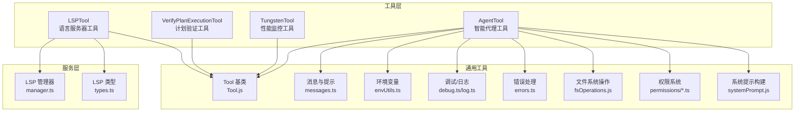
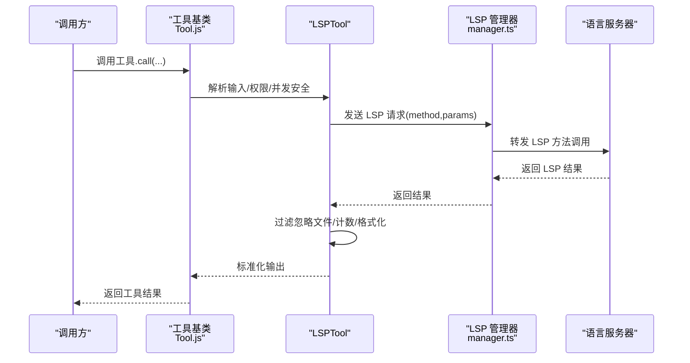
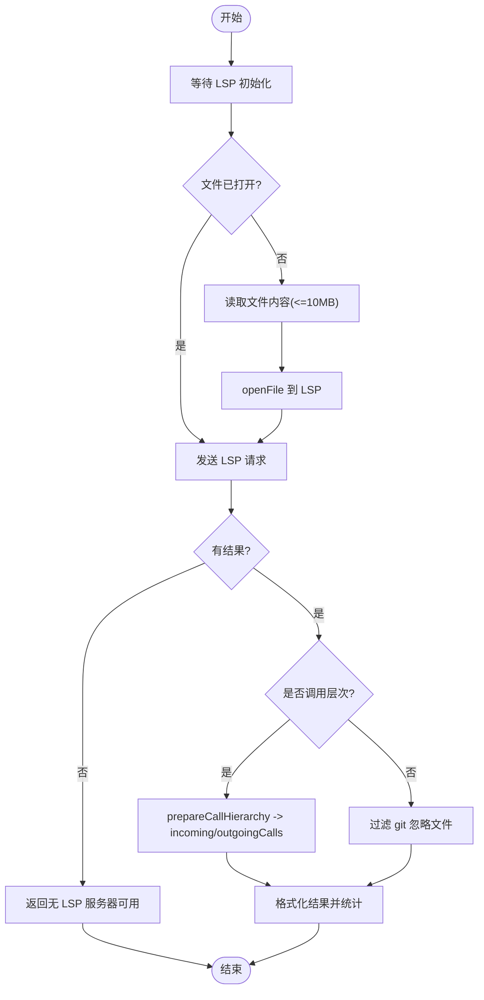
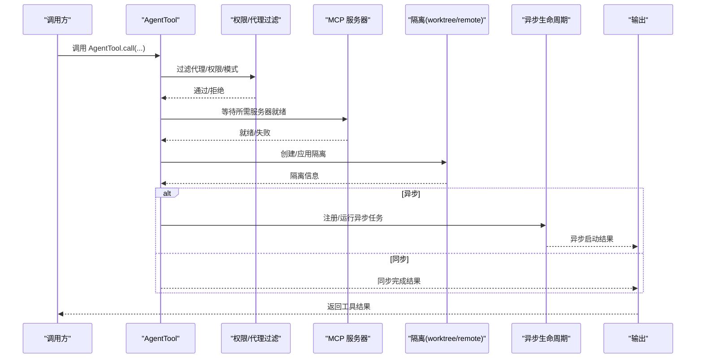
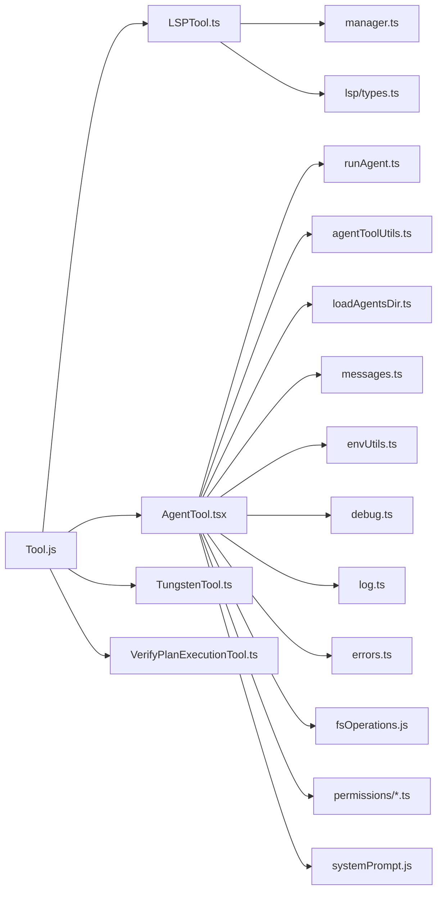

# 开发工具

<cite>
**本文引用的文件**
- [LSPTool.ts](file://src/tools/LSPTool/LSPTool.ts)
- [formatters.ts](file://src/tools/LSPTool/formatters.ts)
- [schemas.ts](file://src/tools/LSPTool/schemas.ts)
- [prompt.ts](file://src/tools/LSPTool/prompt.ts)
- [UI.tsx](file://src/tools/LSPTool/UI.tsx)
- [AgentTool.tsx](file://src/tools/AgentTool/AgentTool.tsx)
- [runAgent.ts](file://src/tools/AgentTool/runAgent.ts)
- [agentToolUtils.ts](file://src/tools/AgentTool/agentToolUtils.ts)
- [loadAgentsDir.ts](file://src/tools/AgentTool/loadAgentsDir.ts)
- [UI.tsx](file://src/tools/AgentTool/UI.tsx)
- [TungstenTool.ts](file://src/tools/TungstenTool/TungstenTool.ts)
- [TungstenLiveMonitor.tsx](file://src/tools/TungstenTool/TungstenLiveMonitor.tsx)
- [VerifyPlanExecutionTool.ts](file://src/tools/VerifyPlanExecutionTool/VerifyPlanExecutionTool.ts)
- [constants.ts](file://src/tools/VerifyPlanExecutionTool/constants.ts)
- [Tool.js](file://src/Tool.js)
- [manager.ts](file://src/services/lsp/manager.ts)
- [types.ts](file://src/services/lsp/types.ts)
- [types.ts](file://src/types/tools.ts)
- [envUtils.ts](file://src/utils/envUtils.ts)
- [lazySchema.ts](file://src/utils/lazySchema.ts)
- [messages.ts](file://src/utils/messages.ts)
- [sleep.ts](file://src/utils/sleep.ts)
- [debug.ts](file://src/utils/debug.ts)
- [log.ts](file://src/utils/log.ts)
- [errors.ts](file://src/utils/errors.ts)
- [cwd.ts](file://src/utils/cwd.ts)
- [execFileNoThrow.ts](file://src/utils/execFileNoThrow.js)
- [fsOperations.ts](file://src/utils/fsOperations.js)
- [permissions.ts](file://src/utils/permissions/filesystem.js)
- [permissions.ts](file://src/utils/permissions/PermissionResult.js)
- [permissions.ts](file://src/utils/permissions/permissions.js)
- [systemPrompt.ts](file://src/utils/systemPrompt.js)
</cite>

## 目录
1. [简介](#简介)
2. [项目结构](#项目结构)
3. [核心组件](#核心组件)
4. [架构总览](#架构总览)
5. [详细组件分析](#详细组件分析)
6. [依赖关系分析](#依赖关系分析)
7. [性能考量](#性能考量)
8. [故障排查指南](#故障排查指南)
9. [结论](#结论)
10. [附录](#附录)

## 简介
本文件为 free-code 开发工具的 API 参考与技术文档，聚焦以下能力：
- LSPTool：语言服务器协议接口、符号导航与代码补全（基于 LSP 的定义跳转、引用查找、悬停信息、文档/工作区符号、调用层次等）。
- AgentTool：智能代理接口、任务分配与结果聚合，支持本地/远程异步执行、工作树隔离、权限模式与多代理编排。
- TungstenTool：性能监控接口与资源使用统计（当前为内部构建可用，外部不可用）。
- 计划验证工具：执行验证接口与结果评估机制（当前为内部构建可用，外部不可用）。
同时涵盖开发工具的配置选项、调试模式与性能分析功能，以及工具间协作机制与数据交换格式。

## 项目结构
开发工具位于 src/tools 下，围绕 Tool 基类与统一的工具生命周期进行扩展；语言服务通过 src/services/lsp 提供管理器与类型；AgentTool 依赖任务系统、权限系统与消息上下文；TungstenTool 与 VerifyPlanExecutionTool 作为占位或受限工具存在。

**图示来源**
- [LSPTool.ts:127-422](file://src/tools/LSPTool/LSPTool.ts#L127-L422)
- [AgentTool.tsx:196-800](file://src/tools/AgentTool/AgentTool.tsx#L196-L800)
- [TungstenTool.ts:27-72](file://src/tools/TungstenTool/TungstenTool.ts#L27-L72)
- [VerifyPlanExecutionTool.ts:22-67](file://src/tools/VerifyPlanExecutionTool/VerifyPlanExecutionTool.ts#L22-L67)
- [manager.ts](file://src/services/lsp/manager.ts)
- [types.ts](file://src/services/lsp/types.ts)
- [Tool.js](file://src/Tool.js)

**章节来源**
- [LSPTool.ts:127-422](file://src/tools/LSPTool/LSPTool.ts#L127-L422)
- [AgentTool.tsx:196-800](file://src/tools/AgentTool/AgentTool.tsx#L196-L800)
- [TungstenTool.ts:27-72](file://src/tools/TungstenTool/TungstenTool.ts#L27-L72)
- [VerifyPlanExecutionTool.ts:22-67](file://src/tools/VerifyPlanExecutionTool/VerifyPlanExecutionTool.ts#L22-L67)

## 核心组件
- LSPTool：封装 LSP 操作（定义跳转、引用查找、悬停、文档/工作区符号、调用层次），负责输入校验、权限检查、请求发送、结果过滤与格式化，并输出标准化结果。
- AgentTool：提供代理启动、参数解析、权限与 MCP 服务器校验、工作树隔离、异步/同步执行、进度事件与结果聚合，支持多代理编排与远程执行。
- TungstenTool：性能监控占位工具，当前仅返回不可用状态（内部构建可用）。
- VerifyPlanExecutionTool：计划执行验证占位工具，当前仅返回不可用状态（内部构建可用）。

**章节来源**
- [LSPTool.ts:127-422](file://src/tools/LSPTool/LSPTool.ts#L127-L422)
- [AgentTool.tsx:196-800](file://src/tools/AgentTool/AgentTool.tsx#L196-L800)
- [TungstenTool.ts:27-72](file://src/tools/TungstenTool/TungstenTool.ts#L27-L72)
- [VerifyPlanExecutionTool.ts:22-67](file://src/tools/VerifyPlanExecutionTool/VerifyPlanExecutionTool.ts#L22-L67)

## 架构总览
下图展示工具调用到服务层的关键交互路径与职责边界。

**图示来源**
- [LSPTool.ts:224-414](file://src/tools/LSPTool/LSPTool.ts#L224-L414)
- [manager.ts](file://src/services/lsp/manager.ts)
- [Tool.js](file://src/Tool.js)

## 详细组件分析

### LSPTool：语言服务器协议接口与符号导航
- 输入/输出模式
  - 输入包含操作类型（goToDefinition、findReferences、hover、documentSymbol、workspaceSymbol、goToImplementation、prepareCallHierarchy、incomingCalls、outgoingCalls）、文件路径、行列坐标。
  - 输出包含操作名、格式化结果文本、文件路径、结果数量与文件数量统计。
- 关键流程
  - 初始化等待与连接检查：在调用前等待 LSP 初始化完成，避免“无服务器可用”误报。
  - 文件打开策略：若文件未在 LSP 中打开且大小未超限，则读取内容并 openFile，以满足大多数 LSP 服务器要求。
  - 特殊调用层次：incomingCalls/outgoingCalls 先通过 prepareCallHierarchy 获取 CallHierarchyItem，再请求具体调用列表。
  - 结果过滤：对位置型结果（定义/引用/实现/工作区符号）使用 git check-ignore 批量过滤忽略文件，减少噪声。
  - 结果格式化：根据操作类型调用对应格式化器，生成用户可读文本，并统计结果数量与文件数量。
- 错误处理
  - 文件不存在/非文件、权限不足、LSP 管理器未初始化、LSP 服务器不可用、请求异常均被捕获并转化为标准化输出。
- 并发与只读
  - 并发安全：标记为并发安全；只读：不修改文件系统。
- 数据交换格式
  - 工具调用输入/输出遵循 Zod 模式，最终通过 mapToolResultToToolResultBlockParam 映射为统一的 tool_result 结构。

**图示来源**
- [LSPTool.ts:224-414](file://src/tools/LSPTool/LSPTool.ts#L224-L414)
- [formatters.ts](file://src/tools/LSPTool/formatters.ts)
- [schemas.ts](file://src/tools/LSPTool/schemas.ts)
- [prompt.ts](file://src/tools/LSPTool/prompt.ts)
- [UI.tsx](file://src/tools/LSPTool/UI.tsx)

**章节来源**
- [LSPTool.ts:127-422](file://src/tools/LSPTool/LSPTool.ts#L127-L422)
- [formatters.ts](file://src/tools/LSPTool/formatters.ts)
- [schemas.ts](file://src/tools/LSPTool/schemas.ts)
- [prompt.ts](file://src/tools/LSPTool/prompt.ts)
- [UI.tsx](file://src/tools/LSPTool/UI.tsx)

### AgentTool：智能代理接口、任务分配与结果聚合
- 输入/输出模式
  - 输入：简短描述、任务提示、可选子代理类型、模型覆盖、后台运行标志、团队/名称、权限模式、隔离模式（worktree/remote）、工作目录覆盖。
  - 输出：同步完成（包含状态与提示）或异步启动（包含代理 ID、输出文件路径、可读性判断）。
- 关键流程
  - 多代理编排：支持按名称/团队派生“队友”（tmux/进程内），并进行权限与 MCP 服务器校验。
  - 子代理实验：fork 子代理路径在缓存一致性与上下文继承方面有特殊处理。
  - MCP 服务器校验：等待必要服务器连接/认证完成，确保工具可用后再派生代理。
  - 隔离与清理：worktree 隔离时自动创建/清理；远程隔离委托至 CCR。
  - 异步生命周期：注册异步任务、进度追踪、摘要与清理钩子，支持后台通知。
  - 同步执行：在当前会话中直接运行，提供初始进度消息与活动描述解析。
- 权限与安全
  - 严格基于工具权限上下文与代理定义的权限模式进行过滤与拒绝。
  - 支持计划模式（plan）等权限模式，必要时要求审批。
- 数据交换格式
  - 统一通过工具基类的映射函数输出 tool_result 结构，便于上层消费。

**图示来源**
- [AgentTool.tsx:196-800](file://src/tools/AgentTool/AgentTool.tsx#L196-L800)
- [runAgent.ts](file://src/tools/AgentTool/runAgent.ts)
- [agentToolUtils.ts](file://src/tools/AgentTool/agentToolUtils.ts)
- [loadAgentsDir.ts](file://src/tools/AgentTool/loadAgentsDir.ts)
- [UI.tsx](file://src/tools/AgentTool/UI.tsx)

**章节来源**
- [AgentTool.tsx:196-800](file://src/tools/AgentTool/AgentTool.tsx#L196-L800)
- [runAgent.ts](file://src/tools/AgentTool/runAgent.ts)
- [agentToolUtils.ts](file://src/tools/AgentTool/agentToolUtils.ts)
- [loadAgentsDir.ts](file://src/tools/AgentTool/loadAgentsDir.ts)
- [UI.tsx](file://src/tools/AgentTool/UI.tsx)

### TungstenTool：性能监控接口与资源使用统计
- 当前状态：仅在内部构建可用，外部构建返回不可用。
- 接口：无输入，输出布尔值与消息；提供清理会话与重置初始化状态的空实现。
- 使用建议：在内部构建启用后，结合 TungstenLiveMonitor 进行实时监控。

**章节来源**
- [TungstenTool.ts:1-73](file://src/tools/TungstenTool/TungstenTool.ts#L1-L73)
- [TungstenLiveMonitor.tsx](file://src/tools/TungstenTool/TungstenLiveMonitor.tsx)

### 计划验证工具：执行验证接口与结果评估机制
- 当前状态：仅在内部构建可用，外部构建返回不可用。
- 接口：无输入，输出布尔值与消息；用于评估计划执行结果。
- 使用建议：在内部构建启用后，结合计划模式与 AgentTool 的摘要/进度进行综合评估。

**章节来源**
- [VerifyPlanExecutionTool.ts:1-68](file://src/tools/VerifyPlanExecutionTool/VerifyPlanExecutionTool.ts#L1-L68)
- [constants.ts](file://src/tools/VerifyPlanExecutionTool/constants.ts)

## 依赖关系分析
- 工具基类与模式
  - 所有工具通过 buildTool 构建，共享 inputSchema/outputSchema、权限检查、只读/并发安全标记、渲染与映射函数。
- LSPTool 依赖
  - LSP 管理器与类型定义；文件系统与路径工具；权限系统；git 忽略过滤；调试/日志/错误工具。
- AgentTool 依赖
  - 任务系统（本地/远程）、权限系统、MCP 工具池、消息与系统提示构建、工作目录与工作树工具、fork 子代理逻辑。
- 通用工具
  - 环境变量解析、延迟模式、消息规范化、休眠、调试/日志/错误、文件系统操作、权限规则与拒绝策略、系统提示构建。

**图示来源**
- [Tool.js](file://src/Tool.js)
- [LSPTool.ts:127-422](file://src/tools/LSPTool/LSPTool.ts#L127-L422)
- [AgentTool.tsx:196-800](file://src/tools/AgentTool/AgentTool.tsx#L196-L800)
- [TungstenTool.ts:27-72](file://src/tools/TungstenTool/TungstenTool.ts#L27-L72)
- [VerifyPlanExecutionTool.ts:22-67](file://src/tools/VerifyPlanExecutionTool/VerifyPlanExecutionTool.ts#L22-L67)
- [manager.ts](file://src/services/lsp/manager.ts)
- [types.ts](file://src/services/lsp/types.ts)
- [runAgent.ts](file://src/tools/AgentTool/runAgent.ts)
- [agentToolUtils.ts](file://src/tools/AgentTool/agentToolUtils.ts)
- [loadAgentsDir.ts](file://src/tools/AgentTool/loadAgentsDir.ts)
- [messages.ts](file://src/utils/messages.ts)
- [envUtils.ts](file://src/utils/envUtils.ts)
- [debug.ts](file://src/utils/debug.ts)
- [log.ts](file://src/utils/log.ts)
- [errors.ts](file://src/utils/errors.ts)
- [fsOperations.ts](file://src/utils/fsOperations.js)
- [permissions.ts](file://src/utils/permissions/filesystem.js)
- [permissions.ts](file://src/utils/permissions/permissions.js)
- [systemPrompt.ts](file://src/utils/systemPrompt.js)

**章节来源**
- [Tool.js](file://src/Tool.js)
- [LSPTool.ts:127-422](file://src/tools/LSPTool/LSPTool.ts#L127-L422)
- [AgentTool.tsx:196-800](file://src/tools/AgentTool/AgentTool.tsx#L196-L800)
- [TungstenTool.ts:27-72](file://src/tools/TungstenTool/TungstenTool.ts#L27-L72)
- [VerifyPlanExecutionTool.ts:22-67](file://src/tools/VerifyPlanExecutionTool/VerifyPlanExecutionTool.ts#L22-L67)

## 性能考量
- LSPTool
  - 文件大小限制：超过 10MB 的文件直接拒绝分析，避免 LSP 服务器压力。
  - git 忽略过滤采用批量命令（git check-ignore），分批处理以控制超时与内存占用。
  - 并发安全：允许并发调用，减少阻塞。
- AgentTool
  - 异步执行：默认强制异步（fork 实验/助手模式/协调者模式/主动模式），避免主线程阻塞。
  - 工作树隔离：变更检测后决定保留/删除，减少磁盘冗余。
  - 进度事件：转发子代理与 Shell 进度，便于前端及时反馈。
- TungstenTool/VerifyPlanExecutionTool
  - 当前为占位实现，不参与性能计算；启用后应结合监控组件进行指标采集与可视化。

[本节为通用性能讨论，无需特定文件来源]

## 故障排查指南
- LSPTool
  - “无 LSP 服务器可用”：确认文件类型是否受支持；等待初始化完成；检查文件大小是否超过限制。
  - “文件不存在/非文件”：核对输入路径与权限；UNC 路径跳过文件系统检查以防凭据泄露。
  - “引用/定义为空”：确认 git 忽略规则是否导致结果被过滤；检查 LSP 服务器是否正确打开文件。
- AgentTool
  - “代理类型被拒绝”：检查权限规则与 Agent(AgentName) 语法；确认所需 MCP 服务器已连接/认证。
  - “远程隔离不可用”：检查资格条件与打包失败提示；必要时切换为 worktree 隔离。
  - “异步任务未响应”：查看输出文件路径与可读性；使用进度事件确认生命周期阶段。
- 通用
  - 调试与日志：使用调试模式输出诊断信息；错误统一转换为可读消息；必要时开启详细日志。
  - 环境变量：如禁用后台任务、启用自动后台等，可通过环境变量控制行为。

**章节来源**
- [LSPTool.ts:155-209](file://src/tools/LSPTool/LSPTool.ts#L155-L209)
- [LSPTool.ts:283-297](file://src/tools/LSPTool/LSPTool.ts#L283-L297)
- [AgentTool.tsx:261-280](file://src/tools/AgentTool/AgentTool.tsx#L261-L280)
- [AgentTool.tsx:406-410](file://src/tools/AgentTool/AgentTool.tsx#L406-L410)
- [AgentTool.tsx:435-452](file://src/tools/AgentTool/AgentTool.tsx#L435-L452)
- [debug.ts](file://src/utils/debug.ts)
- [log.ts](file://src/utils/log.ts)
- [errors.ts](file://src/utils/errors.ts)
- [envUtils.ts](file://src/utils/envUtils.ts)

## 结论
- LSPTool 提供稳定、可扩展的语言服务器集成，具备完善的输入校验、权限控制、结果过滤与格式化能力。
- AgentTool 支持复杂场景的代理编排与执行，兼顾安全性、隔离性与可观测性。
- TungstenTool 与 VerifyPlanExecutionTool 当前为受限可用，后续可结合监控与评估组件完善性能与质量保障。
- 工具间通过统一的工具基类与消息格式协作，配合权限与 MCP 体系实现灵活扩展。

[本节为总结，无需特定文件来源]

## 附录

### 配置选项与调试模式
- 环境变量
  - 禁用后台任务：用于控制 AgentTool 的异步行为。
  - 协调者模式：影响 AgentTool 的系统提示与执行策略。
  - 主动模式/助手模式：影响 AgentTool 的异步强制策略。
- 调试与日志
  - 调试输出：用于诊断 LSP 请求与 Agent 生命周期问题。
  - 错误日志：统一记录工具调用异常，便于定位。
- 性能分析
  - AgentTool 进度事件与摘要可用于分析执行耗时与吞吐。
  - LSPTool 的 git 忽略过滤与文件大小限制有助于控制资源消耗。

**章节来源**
- [AgentTool.tsx:66-77](file://src/tools/AgentTool/AgentTool.tsx#L66-L77)
- [AgentTool.tsx:223-224](file://src/tools/AgentTool/AgentTool.tsx#L223-L224)
- [AgentTool.tsx:566-567](file://src/tools/AgentTool/AgentTool.tsx#L566-L567)
- [debug.ts](file://src/utils/debug.ts)
- [log.ts](file://src/utils/log.ts)
- [LSPTool.ts:265-272](file://src/tools/LSPTool/LSPTool.ts#L265-L272)