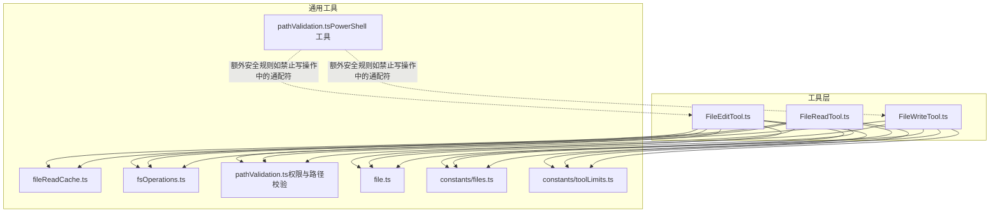
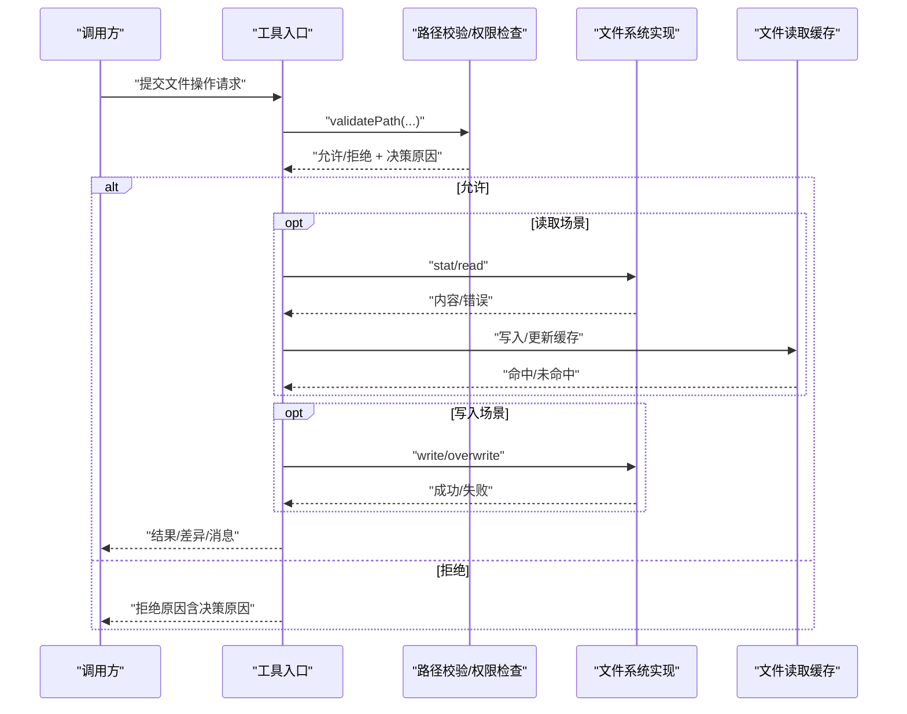
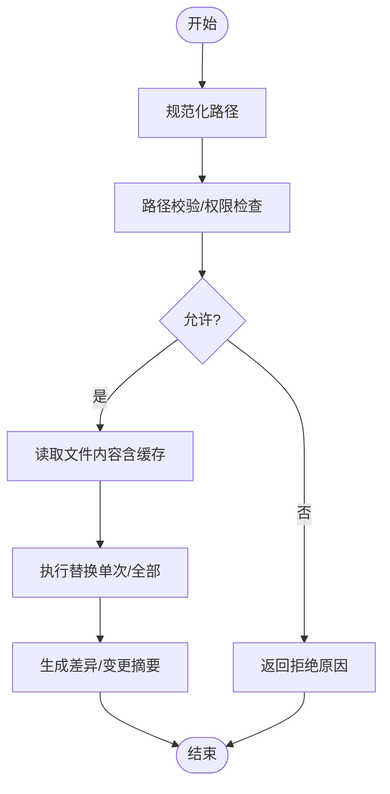
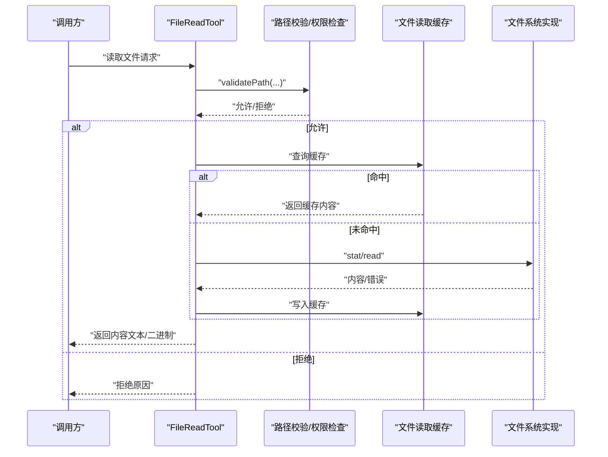
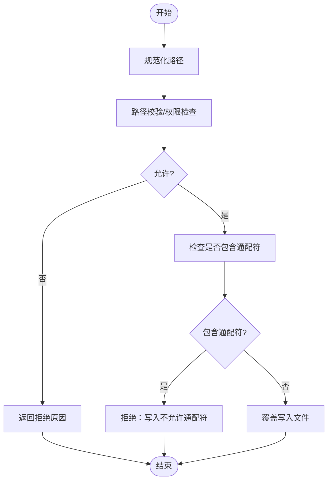
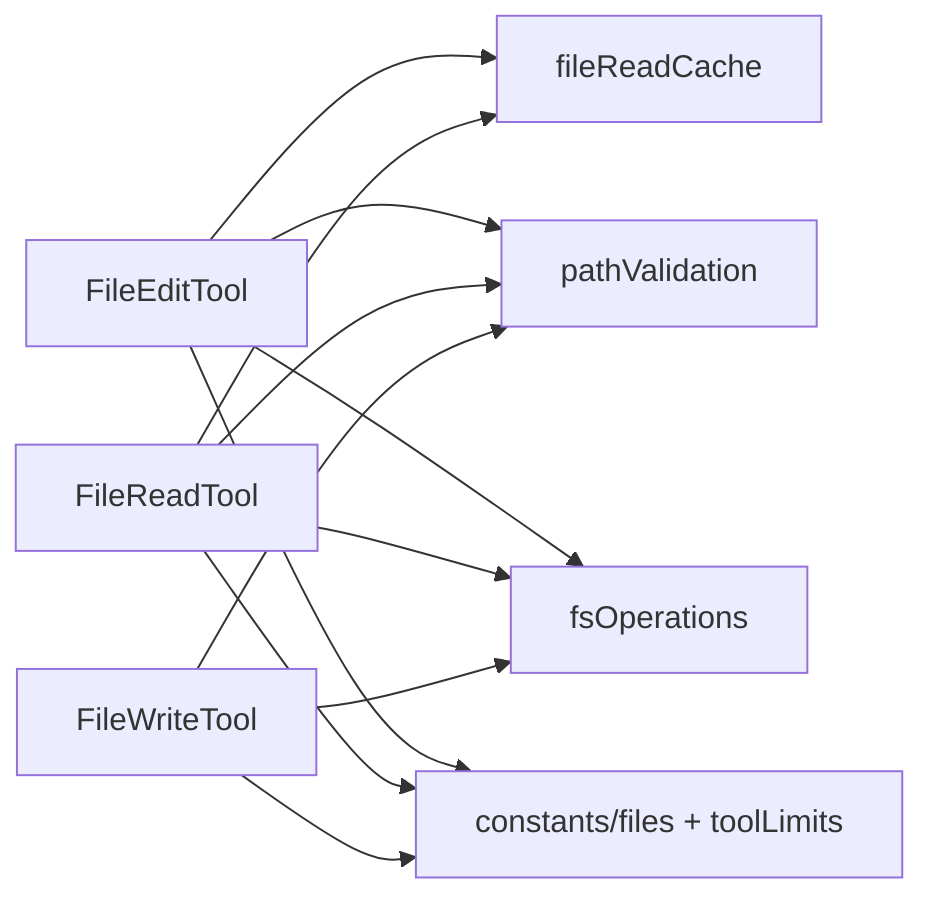

# 文件工具

<cite>
**本文引用的文件**
- [FileEditTool.ts](file://src/tools/FileEditTool/FileEditTool.ts)
- [FileReadTool.ts](file://src/tools/FileReadTool/FileReadTool.ts)
- [FileWriteTool.ts](file://src/tools/FileWriteTool/FileWriteTool.ts)
- [prompt.ts（FileEditTool）](file://src/tools/FileEditTool/prompt.ts)
- [prompt.ts（FileWriteTool）](file://src/tools/FileWriteTool/prompt.ts)
- [fileReadCache.ts](file://src/utils/fileReadCache.ts)
- [file.ts](file://src/utils/file.ts)
- [pathValidation.ts（权限与路径校验）](file://src/utils/permissions/pathValidation.ts)
- [fsOperations.ts（文件系统操作与权限路径集合）](file://src/utils/fsOperations.ts)
- [pathValidation.ts（PowerShell 工具中的路径校验）](file://src/tools/PowerShellTool/pathValidation.ts)
- [tools.ts（工具注册与导出）](file://src/tools.ts)
- [files.ts（常量：文件相关）](file://src/constants/files.ts)
- [toolLimits.ts（工具使用限制）](file://src/constants/toolLimits.ts)
</cite>

## 目录
1. [简介](#简介)
2. [项目结构](#项目结构)
3. [核心组件](#核心组件)
4. [架构总览](#架构总览)
5. [详细组件分析](#详细组件分析)
6. [依赖关系分析](#依赖关系分析)
7. [性能考量](#性能考量)
8. [故障排查指南](#故障排查指南)
9. [结论](#结论)
10. [附录](#附录)

## 简介
本文件为 free-code 的文件工具 API 参考文档，聚焦以下三个工具：
- FileEditTool：在本地文件系统中进行内容替换与编辑
- FileReadTool：读取文件内容
- FileWriteTool：写入或覆盖文件内容

文档涵盖：
- 接口规范与输入输出
- 路径验证与权限检查机制
- 安全策略、路径遍历防护与文件大小限制
- 编码处理、图像与二进制文件支持
- 文件搜索与匹配（通配符与正则）
- 事务性保证与回滚机制

## 项目结构
文件工具位于 src/tools 下，每个工具独立实现，并共享通用的路径校验、权限检查与缓存机制。

图表来源
- [FileEditTool.ts:128-141](file://src/tools/FileEditTool/FileEditTool.ts#L128-L141)
- [FileReadTool.ts](file://src/tools/FileReadTool/FileReadTool.ts)
- [FileWriteTool.ts](file://src/tools/FileWriteTool/FileWriteTool.ts)
- [fileReadCache.ts:1-44](file://src/utils/fileReadCache.ts#L1-L44)
- [fsOperations.ts:272-308](file://src/utils/fsOperations.ts#L272-L308)
- [pathValidation.ts（权限与路径校验）:373-485](file://src/utils/permissions/pathValidation.ts#L373-L485)
- [pathValidation.ts（PowerShell 工具中的路径校验）:1147-1197](file://src/tools/PowerShellTool/pathValidation.ts#L1147-L1197)
- [file.ts:345-352](file://src/utils/file.ts#L345-L352)
- [files.ts](file://src/constants/files.ts)
- [toolLimits.ts](file://src/constants/toolLimits.ts)

章节来源
- [FileEditTool.ts:128-141](file://src/tools/FileEditTool/FileEditTool.ts#L128-L141)
- [FileReadTool.ts](file://src/tools/FileReadTool/FileReadTool.ts)
- [FileWriteTool.ts](file://src/tools/FileWriteTool/FileWriteTool.ts)
- [fileReadCache.ts:1-44](file://src/utils/fileReadCache.ts#L1-L44)
- [fsOperations.ts:272-308](file://src/utils/fsOperations.ts#L272-L308)
- [pathValidation.ts（权限与路径校验）:373-485](file://src/utils/permissions/pathValidation.ts#L373-L485)
- [pathValidation.ts（PowerShell 工具中的路径校验）:1147-1197](file://src/tools/PowerShellTool/pathValidation.ts#L1147-L1197)
- [file.ts:345-352](file://src/utils/file.ts#L345-L352)
- [files.ts](file://src/constants/files.ts)
- [toolLimits.ts](file://src/constants/toolLimits.ts)

## 核心组件
- FileEditTool：执行“旧字符串 → 新字符串”的替换；支持批量替换；读取前需先用 FileReadTool 获取内容；内部使用文件读取缓存以减少重复 I/O。
- FileReadTool：读取文件内容；支持检测编码；对大文件有读取限制；可处理文本与二进制文件（返回字节视图）。
- FileWriteTool：写入或覆盖文件；要求先读取再写入；禁止在写操作中使用通配符；对大文件写入有大小限制。

章节来源
- [FileEditTool.ts:128-141](file://src/tools/FileEditTool/FileEditTool.ts#L128-L141)
- [FileReadTool.ts](file://src/tools/FileReadTool/FileReadTool.ts)
- [FileWriteTool.ts](file://src/tools/FileWriteTool/FileWriteTool.ts)
- [prompt.ts（FileEditTool）](file://src/tools/FileEditTool/prompt.ts)
- [prompt.ts（FileWriteTool）:1-18](file://src/tools/FileWriteTool/prompt.ts#L1-L18)
- [fileReadCache.ts:1-44](file://src/utils/fileReadCache.ts#L1-L44)
- [file.ts:345-352](file://src/utils/file.ts#L345-L352)

## 架构总览
文件工具通过统一的路径校验与权限检查模块，确保所有文件操作均在受控范围内执行。读取侧采用缓存提升性能，写入侧强调“先读取后写入”的约束，避免覆盖风险。

图表来源
- [pathValidation.ts（权限与路径校验）:373-485](file://src/utils/permissions/pathValidation.ts#L373-L485)
- [fsOperations.ts:272-308](file://src/utils/fsOperations.ts#L272-L308)
- [fileReadCache.ts:1-44](file://src/utils/fileReadCache.ts#L1-L44)
- [FileEditTool.ts:128-141](file://src/tools/FileEditTool/FileEditTool.ts#L128-L141)
- [FileReadTool.ts](file://src/tools/FileReadTool/FileReadTool.ts)
- [FileWriteTool.ts](file://src/tools/FileWriteTool/FileWriteTool.ts)

## 详细组件分析

### FileEditTool（文件编辑）
- 功能要点
  - 输入参数：目标文件路径、旧字符串、新字符串、是否替换全部
  - 执行流程：先规范化路径，再读取文件内容，执行替换，生成差异展示
  - 读取优化：使用文件读取缓存，避免重复 I/O
  - 输出：工具使用消息、结果消息、被拒绝消息、错误消息
- 路径与权限
  - 使用统一的路径校验与权限检查
  - 支持通配符的读取场景（由上层工具链解析），但写入不支持通配符
- 安全与限制
  - 不允许在写入/创建时使用通配符
  - 对路径遍历进行严格校验
  - 大文件写入受工具限制约束
- 事务性与回滚
  - 该工具本身不提供原子写入或自动回滚；建议结合外部版本控制或备份策略

图表来源
- [FileEditTool.ts:128-141](file://src/tools/FileEditTool/FileEditTool.ts#L128-L141)
- [fileReadCache.ts:1-44](file://src/utils/fileReadCache.ts#L1-L44)
- [pathValidation.ts（权限与路径校验）:373-485](file://src/utils/permissions/pathValidation.ts#L373-L485)

章节来源
- [FileEditTool.ts:128-141](file://src/tools/FileEditTool/FileEditTool.ts#L128-L141)
- [prompt.ts（FileEditTool）](file://src/tools/FileEditTool/prompt.ts)
- [fileReadCache.ts:1-44](file://src/utils/fileReadCache.ts#L1-L44)
- [pathValidation.ts（权限与路径校验）:373-485](file://src/utils/permissions/pathValidation.ts#L373-L485)
- [pathValidation.ts（PowerShell 工具中的路径校验）:1147-1197](file://src/tools/PowerShellTool/pathValidation.ts#L1147-L1197)

### FileReadTool（文件读取）
- 功能要点
  - 输入参数：文件路径
  - 输出：文件内容（按检测到的编码返回）
  - 支持二进制文件：返回字节视图；文本文件按编码解码
  - 大小限制：受工具限制约束
- 编码处理
  - 自动检测文件编码
  - 文本文件按编码解码为字符串
- 图像与二进制
  - 支持读取图像与二进制文件（返回原始字节）
- 性能
  - 使用文件读取缓存，基于修改时间自动失效

图表来源
- [FileReadTool.ts](file://src/tools/FileReadTool/FileReadTool.ts)
- [fileReadCache.ts:1-44](file://src/utils/fileReadCache.ts#L1-L44)
- [file.ts:345-352](file://src/utils/file.ts#L345-L352)
- [pathValidation.ts（权限与路径校验）:373-485](file://src/utils/permissions/pathValidation.ts#L373-L485)

章节来源
- [FileReadTool.ts](file://src/tools/FileReadTool/FileReadTool.ts)
- [fileReadCache.ts:1-44](file://src/utils/fileReadCache.ts#L1-L44)
- [file.ts:345-352](file://src/utils/file.ts#L345-L352)
- [pathValidation.ts（权限与路径校验）:373-485](file://src/utils/permissions/pathValidation.ts#L373-L485)

### FileWriteTool（文件写入）
- 功能要点
  - 输入参数：文件路径、内容
  - 行为：覆盖写入；要求先使用 FileReadTool 读取后再写入
  - 通配符限制：写入/创建时不支持通配符
  - 大小限制：受工具限制约束
- 安全策略
  - 在写入/创建阶段禁止通配符，防止绕过权限检查
  - 路径遍历与 UNC 等高危路径均被阻断
- 事务性与回滚
  - 该工具本身不提供原子写入或自动回滚；建议配合外部版本控制或备份

图表来源
- [FileWriteTool.ts](file://src/tools/FileWriteTool/FileWriteTool.ts)
- [prompt.ts（FileWriteTool）:1-18](file://src/tools/FileWriteTool/prompt.ts#L1-L18)
- [pathValidation.ts（权限与路径校验）:438-463](file://src/utils/permissions/pathValidation.ts#L438-L463)
- [pathValidation.ts（PowerShell 工具中的路径校验）:1161-1174](file://src/tools/PowerShellTool/pathValidation.ts#L1161-L1174)

章节来源
- [FileWriteTool.ts](file://src/tools/FileWriteTool/FileWriteTool.ts)
- [prompt.ts（FileWriteTool）:1-18](file://src/tools/FileWriteTool/prompt.ts#L1-L18)
- [pathValidation.ts（权限与路径校验）:438-463](file://src/utils/permissions/pathValidation.ts#L438-L463)
- [pathValidation.ts（PowerShell 工具中的路径校验）:1161-1174](file://src/tools/PowerShellTool/pathValidation.ts#L1161-L1174)

## 依赖关系分析
- FileEditTool 依赖
  - 文件读取缓存：减少重复读取
  - 路径校验与权限检查：统一的安全入口
  - 文件工具常量与工具限制：统一行为边界
- FileReadTool 依赖
  - 文件读取缓存、编码检测、文件系统实现
- FileWriteTool 依赖
  - 路径校验与权限检查、文件系统实现、工具限制

图表来源
- [FileEditTool.ts:128-141](file://src/tools/FileEditTool/FileEditTool.ts#L128-L141)
- [FileReadTool.ts](file://src/tools/FileReadTool/FileReadTool.ts)
- [FileWriteTool.ts](file://src/tools/FileWriteTool/FileWriteTool.ts)
- [fileReadCache.ts:1-44](file://src/utils/fileReadCache.ts#L1-L44)
- [fsOperations.ts:272-308](file://src/utils/fsOperations.ts#L272-L308)
- [pathValidation.ts（权限与路径校验）:373-485](file://src/utils/permissions/pathValidation.ts#L373-L485)
- [files.ts](file://src/constants/files.ts)
- [toolLimits.ts](file://src/constants/toolLimits.ts)

章节来源
- [FileEditTool.ts:128-141](file://src/tools/FileEditTool/FileEditTool.ts#L128-L141)
- [FileReadTool.ts](file://src/tools/FileReadTool/FileReadTool.ts)
- [FileWriteTool.ts](file://src/tools/FileWriteTool/FileWriteTool.ts)
- [fileReadCache.ts:1-44](file://src/utils/fileReadCache.ts#L1-L44)
- [fsOperations.ts:272-308](file://src/utils/fsOperations.ts#L272-L308)
- [pathValidation.ts（权限与路径校验）:373-485](file://src/utils/permissions/pathValidation.ts#L373-L485)
- [files.ts](file://src/constants/files.ts)
- [toolLimits.ts](file://src/constants/toolLimits.ts)

## 性能考量
- 文件读取缓存
  - 基于修改时间的缓存键，命中后直接返回内容，显著降低重复读取开销
  - 适用于 FileEditTool 的多次编辑场景
- 编码检测
  - 仅在首次读取时进行编码检测，后续从缓存复用
- 大文件处理
  - 读取与写入均受工具限制约束，避免超大文件导致资源耗尽

章节来源
- [fileReadCache.ts:1-44](file://src/utils/fileReadCache.ts#L1-L44)
- [file.ts:345-352](file://src/utils/file.ts#L345-L352)
- [toolLimits.ts](file://src/constants/toolLimits.ts)

## 故障排查指南
- 路径被拒绝
  - 检查路径是否包含通配符（写入/创建不允许）
  - 检查是否包含路径遍历（如 ..）
  - 检查是否为 UNC 路径或不受支持的 tilde 变体
- 读取失败
  - 确认文件存在且可读
  - 检查权限与沙箱限制
  - 清理缓存后重试（缓存键包含修改时间）
- 写入失败
  - 确认已先读取再写入
  - 确认路径不包含通配符
  - 检查文件大小是否超过限制
- 工具未注册或不可用
  - 确认工具已在工具注册处导出

章节来源
- [pathValidation.ts（权限与路径校验）:373-485](file://src/utils/permissions/pathValidation.ts#L373-L485)
- [pathValidation.ts（PowerShell 工具中的路径校验）:1147-1197](file://src/tools/PowerShellTool/pathValidation.ts#L1147-L1197)
- [fileReadCache.ts:1-44](file://src/utils/fileReadCache.ts#L1-L44)
- [FileEditTool.ts:128-141](file://src/tools/FileEditTool/FileEditTool.ts#L128-L141)
- [FileWriteTool.ts](file://src/tools/FileWriteTool/FileWriteTool.ts)
- [tools.ts](file://src/tools.ts)

## 结论
- FileEditTool、FileReadTool、FileWriteTool 提供了统一的安全边界与性能优化（缓存、编码检测）
- 路径校验与权限检查贯穿所有操作，严格限制通配符、路径遍历与高危路径
- 写入强调“先读取后写入”，并禁止通配符，保障一致性与安全性
- 事务性与回滚不在工具内实现，建议结合外部版本控制或备份策略

## 附录

### API 规范与输入输出

- FileEditTool
  - 输入
    - file_path: string（目标文件路径）
    - old_string: string（待替换的旧内容）
    - new_string: string（替换后的新内容）
    - replace_all?: boolean（是否替换全部匹配项）
  - 输出
    - 工具使用消息、结果消息、被拒绝消息、错误消息
  - 依赖
    - 文件读取缓存、路径校验、权限检查、工具限制

- FileReadTool
  - 输入
    - file_path: string（目标文件路径）
  - 输出
    - 文件内容（文本或二进制）
  - 依赖
    - 文件读取缓存、编码检测、路径校验、权限检查、工具限制

- FileWriteTool
  - 输入
    - file_path: string（目标文件路径）
    - content: string | Uint8Array（要写入的内容）
  - 输出
    - 成功/失败状态
  - 依赖
    - 路径校验、权限检查、工具限制

章节来源
- [FileEditTool.ts:128-141](file://src/tools/FileEditTool/FileEditTool.ts#L128-L141)
- [FileReadTool.ts](file://src/tools/FileReadTool/FileReadTool.ts)
- [FileWriteTool.ts](file://src/tools/FileWriteTool/FileWriteTool.ts)
- [prompt.ts（FileEditTool）](file://src/tools/FileEditTool/prompt.ts)
- [prompt.ts（FileWriteTool）:1-18](file://src/tools/FileWriteTool/prompt.ts#L1-L18)

### 路径验证与权限检查机制
- 统一入口
  - validatePath：清理路径、处理波浪号展开、阻断 UNC、禁止 tilde 变体、通配符策略、路径解析与最终允许判定
- 通配符与写入
  - 写入/创建阶段禁止通配符
  - 读取阶段对包含路径遍历的模式进行安全解析与允许判定
- 权限路径集合
  - getPathsForPermissionCheck：收集原始路径、符号链接链路与最终解析路径，确保规则对所有层级生效

章节来源
- [pathValidation.ts（权限与路径校验）:373-485](file://src/utils/permissions/pathValidation.ts#L373-L485)
- [fsOperations.ts:272-308](file://src/utils/fsOperations.ts#L272-L308)
- [pathValidation.ts（PowerShell 工具中的路径校验）:1147-1197](file://src/tools/PowerShellTool/pathValidation.ts#L1147-L1197)

### 安全策略与防护
- 路径遍历防护
  - 对包含 .. 的路径进行安全解析与允许判定
- UNC 路径阻断
  - 阻止网络路径引发凭据泄漏与远程访问
- 通配符限制
  - 写入/创建阶段禁止通配符，读取阶段对基目录进行允许判定
- 编码与二进制
  - 自动检测编码；二进制文件返回字节视图

章节来源
- [pathValidation.ts（权限与路径校验）:373-485](file://src/utils/permissions/pathValidation.ts#L373-L485)
- [file.ts:345-352](file://src/utils/file.ts#L345-L352)

### 文件大小限制
- 读取与写入均受工具限制约束，避免超大文件导致资源耗尽
- 具体限制值参考工具限制常量

章节来源
- [toolLimits.ts](file://src/constants/toolLimits.ts)

### 文件搜索与匹配（通配符与正则）
- 通配符
  - 读取阶段支持通配符，但会对基目录进行权限检查
  - 写入/创建阶段禁止通配符
- 正则表达式
  - 当前文件工具未提供正则匹配接口；如需正则匹配，请结合其他工具或外部脚本

章节来源
- [pathValidation.ts（权限与路径校验）:269-315](file://src/utils/permissions/pathValidation.ts#L269-L315)
- [pathValidation.ts（权限与路径校验）:438-463](file://src/utils/permissions/pathValidation.ts#L438-L463)

### 事务性保证与回滚机制
- 文件工具未内置原子写入或自动回滚
- 建议结合外部版本控制（如 Git）或备份策略实现回滚与一致性

章节来源
- [FileEditTool.ts:128-141](file://src/tools/FileEditTool/FileEditTool.ts#L128-L141)
- [FileWriteTool.ts](file://src/tools/FileWriteTool/FileWriteTool.ts)