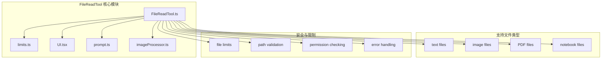
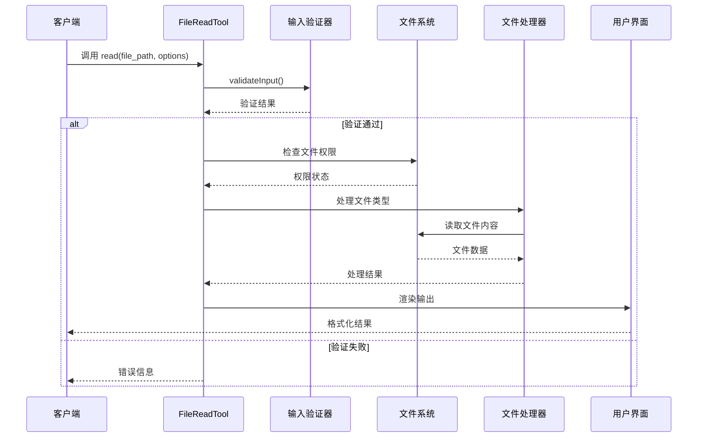
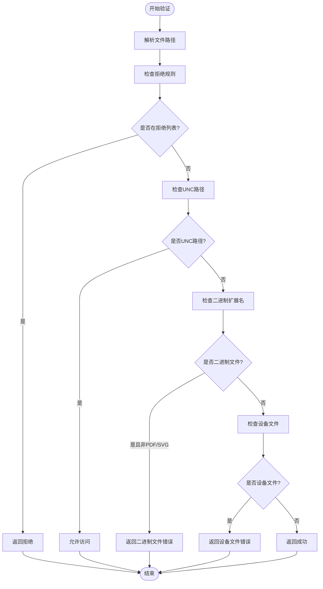
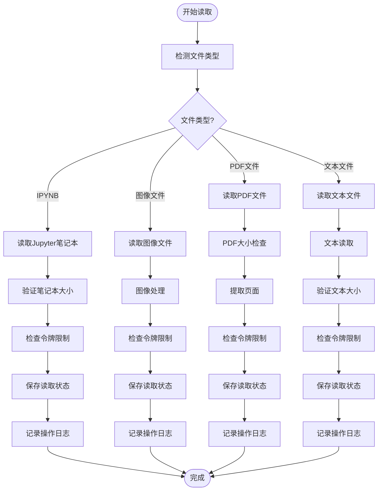
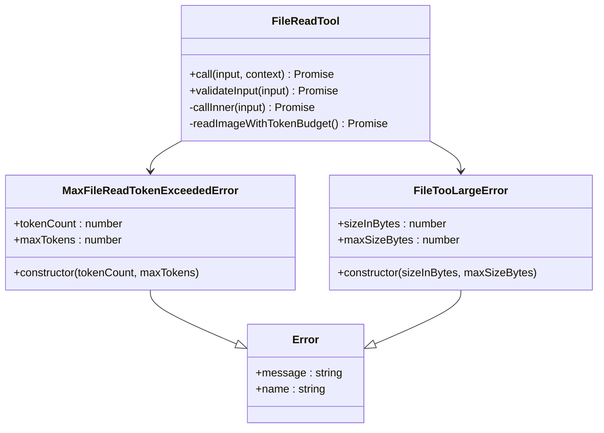
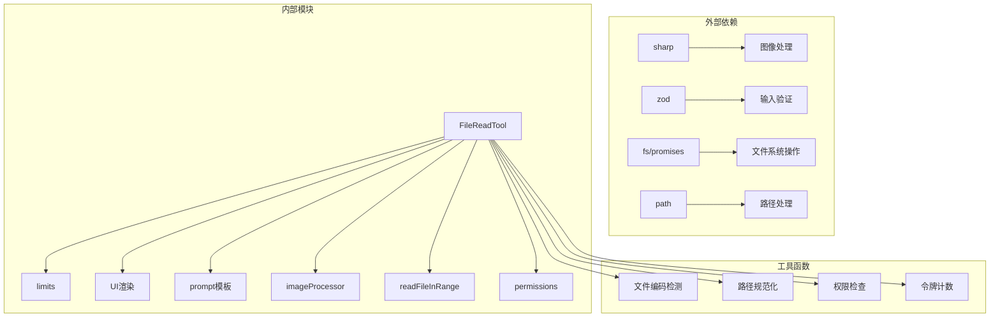

# 文件读取工具

<cite>
**本文档引用的文件**
- [FileReadTool.ts](file://src/tools/FileReadTool/FileReadTool.ts)
- [limits.ts](file://src/tools/FileReadTool/limits.ts)
- [UI.tsx](file://src/tools/FileReadTool/UI.tsx)
- [prompt.ts](file://src/tools/FileReadTool/prompt.ts)
- [imageProcessor.ts](file://src/tools/FileReadTool/imageProcessor.ts)
- [readFileInRange.ts](file://src/utils/readFileInRange.ts)
- [files.ts](file://src/constants/files.ts)
- [zip.ts](file://src/utils/dxt/zip.ts)
- [attachments.ts](file://src/utils/attachments.ts)
</cite>

## 目录
1. [简介](#简介)
2. [项目结构](#项目结构)
3. [核心组件](#核心组件)
4. [架构概览](#架构概览)
5. [详细组件分析](#详细组件分析)
6. [依赖关系分析](#依赖关系分析)
7. [性能考虑](#性能考虑)
8. [故障排除指南](#故障排除指南)
9. [结论](#结论)

## 简介

文件读取工具（FileReadTool）是 Claude Code 中用于安全读取本地文件的核心工具。该工具支持多种文件类型，包括文本文件、图像文件、PDF 文件和 Jupyter 笔记本文件，并提供了完善的安全策略、权限检查和错误处理机制。

## 项目结构

文件读取工具位于 `src/tools/FileReadTool/` 目录下，包含以下关键文件：

**图表来源**
- [FileReadTool.ts:1-1184](file://src/tools/FileReadTool/FileReadTool.ts#L1-L1184)
- [limits.ts:1-93](file://src/tools/FileReadTool/limits.ts#L1-L93)

## 核心组件

### 主要功能特性

1. **多格式文件支持**
   - 文本文件：支持任意编码的文本文件
   - 图像文件：PNG、JPG、JPEG、GIF、WebP
   - PDF 文件：完整的 PDF 处理和页面提取
   - Jupyter 笔记本：完整的 cell 结构和输出

2. **智能文件类型检测**
   - 基于文件扩展名的自动识别
   - 智能编码检测和转换
   - 文件大小和行数统计

3. **安全防护机制**
   - 路径遍历攻击防护
   - 设备文件访问限制
   - 权限控制系统
   - 内容令牌限制

**章节来源**
- [FileReadTool.ts:187-189](file://src/tools/FileReadTool/FileReadTool.ts#L187-L189)
- [files.ts:1-112](file://src/constants/files.ts#L1-L112)

## 架构概览

**图表来源**
- [FileReadTool.ts:418-495](file://src/tools/FileReadTool/FileReadTool.ts#L418-L495)
- [FileReadTool.ts:496-718](file://src/tools/FileReadTool/FileReadTool.ts#L496-L718)

## 详细组件分析

### 输入验证与权限检查

文件读取工具实现了多层次的安全验证机制：

**图表来源**
- [FileReadTool.ts:418-495](file://src/tools/FileReadTool/FileReadTool.ts#L418-L495)

### 文件读取流程

**图表来源**
- [FileReadTool.ts:804-1086](file://src/tools/FileReadTool/FileReadTool.ts#L804-L1086)

### 输出格式化

文件读取工具提供了多种输出格式：

| 输出类型 | 数据结构 | 描述 |
|---------|----------|------|
| text | `{ type: 'text', file: { filePath, content, numLines, startLine, totalLines } }` | 文本文件内容，带行号格式化 |
| image | `{ type: 'image', file: { base64, type, originalSize, dimensions } }` | 图像文件，Base64 编码 |
| notebook | `{ type: 'notebook', file: { filePath, cells } }` | Jupyter 笔记本完整结构 |
| pdf | `{ type: 'pdf', file: { filePath, base64, originalSize } }` | PDF 文件元数据 |
| parts | `{ type: 'parts', file: { filePath, originalSize, count, outputDir } }` | 提取的PDF页面 |

**章节来源**
- [FileReadTool.ts:248-332](file://src/tools/FileReadTool/FileReadTool.ts#L248-L332)

### 错误处理机制

**图表来源**
- [FileReadTool.ts:175-185](file://src/tools/FileReadTool/FileReadTool.ts#L175-L185)
- [readFileInRange.ts:57-67](file://src/utils/readFileInRange.ts#L57-L67)

**章节来源**
- [FileReadTool.ts:593-651](file://src/tools/FileReadTool/FileReadTool.ts#L593-L651)
- [FileReadTool.ts:755-772](file://src/tools/FileReadTool/FileReadTool.ts#L755-L772)

## 依赖关系分析

**图表来源**
- [FileReadTool.ts:1-95](file://src/tools/FileReadTool/FileReadTool.ts#L1-L95)
- [imageProcessor.ts:1-95](file://src/tools/FileReadTool/imageProcessor.ts#L1-L95)

### 关键依赖项

1. **图像处理依赖**
   - `sharp`: 主要图像处理库
   - `image-processor-napi`: 原生图像处理器（可选）

2. **验证依赖**
   - `zod`: 运行时类型验证
   - 自定义权限检查模块

3. **文件系统依赖**
   - Node.js 内置 `fs/promises`
   - 路径处理模块

**章节来源**
- [imageProcessor.ts:37-85](file://src/tools/FileReadTool/imageProcessor.ts#L37-L85)

## 性能考虑

### 文件大小限制

文件读取工具实施了双重限制机制：

| 限制类型 | 默认值 | 最大值 | 用途 |
|---------|--------|--------|------|
| maxSizeBytes | 256 KB | 无限制 | 总文件大小限制（预读阶段） |
| maxTokens | 25,000 | 可配置 | 实际输出令牌限制（后读阶段） |

### 优化策略

1. **智能缓存机制**
   - 文件修改时间戳跟踪
   - 相同范围重复读取去重
   - 自动内存文件新鲜度提示

2. **分块读取**
   - 支持行范围读取（offset 和 limit）
   - 大文件分段处理
   - 流式处理避免内存溢出

3. **图像压缩优化**
   - 令牌预算驱动的图像压缩
   - 多级降级策略
   - 智能尺寸调整

**章节来源**
- [limits.ts:1-93](file://src/tools/FileReadTool/limits.ts#L1-L93)
- [FileReadTool.ts:518-517](file://src/tools/FileReadTool/FileReadTool.ts#L518-L517)

## 故障排除指南

### 常见问题及解决方案

| 问题类型 | 症状 | 解决方案 |
|---------|------|---------|
| 文件不存在 | 报错 "File does not exist" | 使用相似文件建议或路径补全 |
| 权限不足 | 报错 "File is in a directory that is denied" | 检查权限设置或使用允许的路径 |
| 文件过大 | 报错 "exceeds maximum allowed size" | 使用 offset 和 limit 参数分段读取 |
| 令牌超限 | 报错 "exceeds maximum allowed tokens" | 减少读取范围或增加令牌限制 |
| 设备文件访问 | 报错 "device file would block" | 避免读取特殊设备文件 |

### 调试技巧

1. **启用详细日志**
   - 检查文件操作日志
   - 监控令牌使用情况
   - 跟踪文件类型检测

2. **验证输入参数**
   - 确认文件路径格式
   - 检查权限规则匹配
   - 验证文件存在性

**章节来源**
- [FileReadTool.ts:610-648](file://src/tools/FileReadTool/FileReadTool.ts#L610-L648)
- [UI.tsx:144-164](file://src/tools/FileReadTool/UI.tsx#L144-L164)

## 结论

文件读取工具提供了安全、高效、多格式的文件读取能力。其设计重点在于：

1. **安全性优先**：多重验证机制确保文件访问安全
2. **性能优化**：智能缓存和分块处理提升大文件处理效率
3. **用户体验**：友好的错误提示和自动路径补全
4. **扩展性**：模块化设计支持新文件类型的添加

通过合理配置限制参数和权限规则，可以确保文件读取操作既满足功能需求又保持高度安全性。