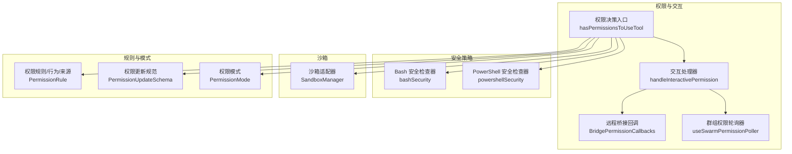
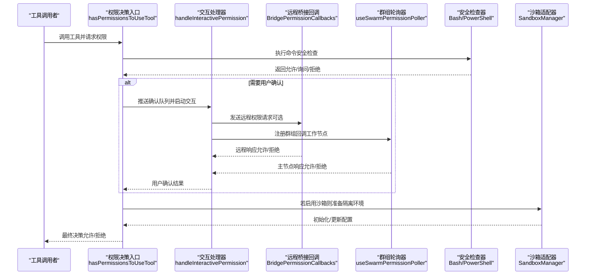
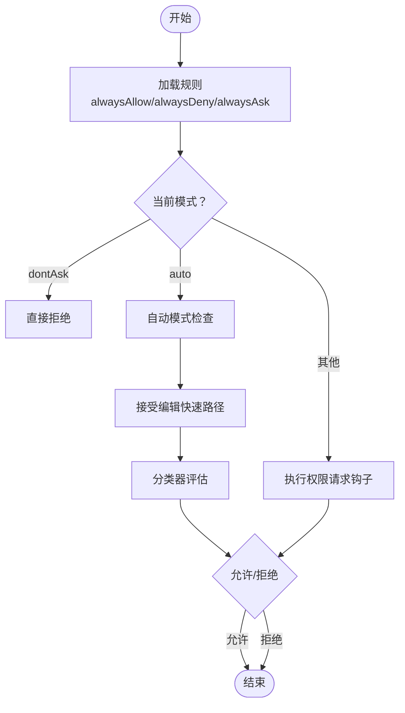
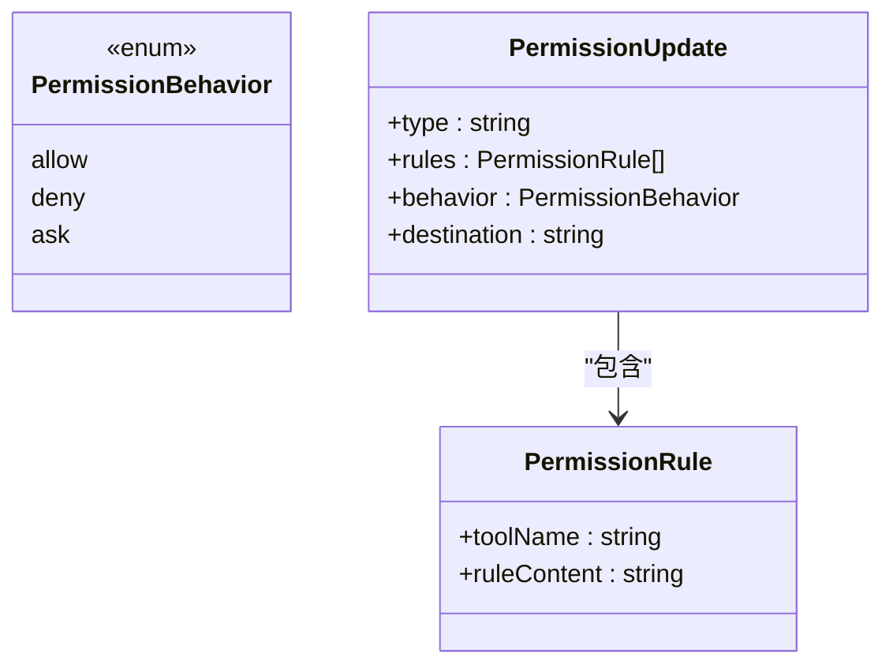
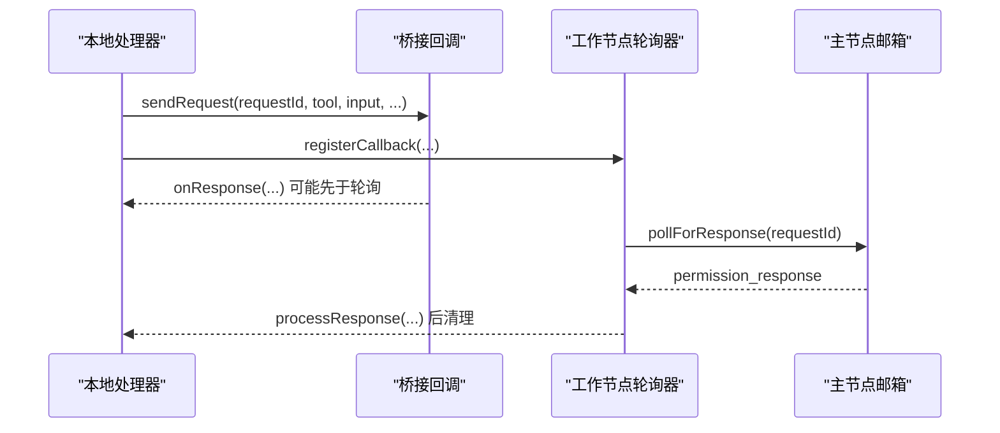
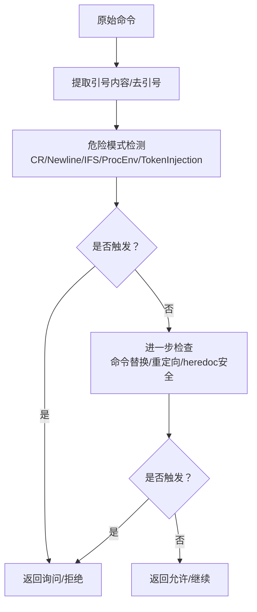
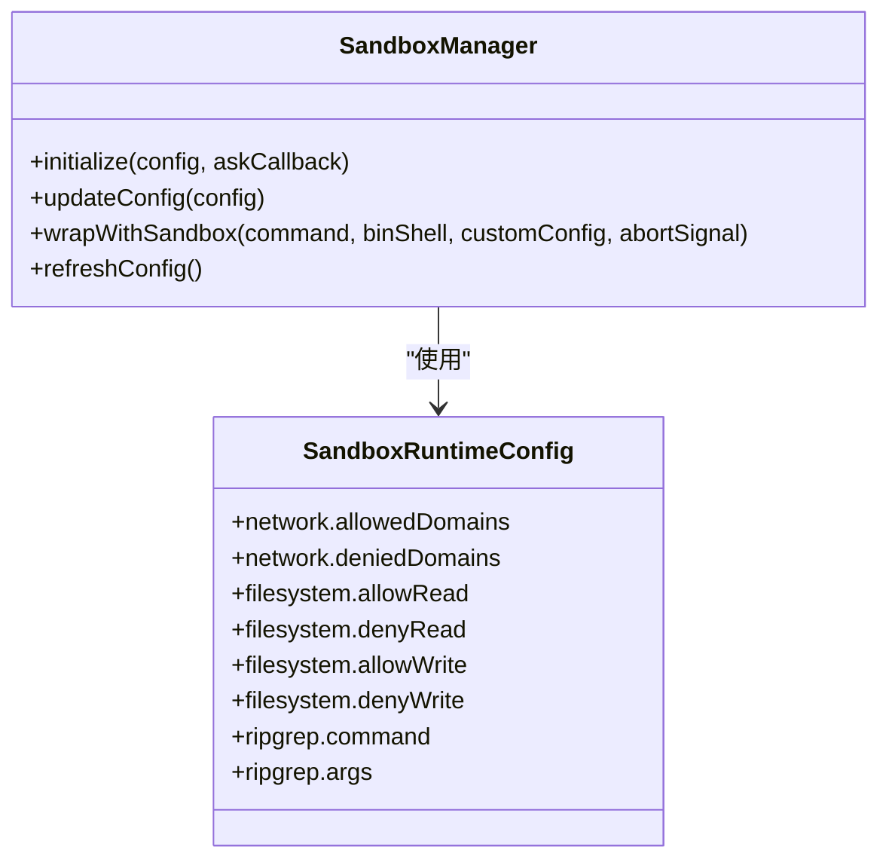
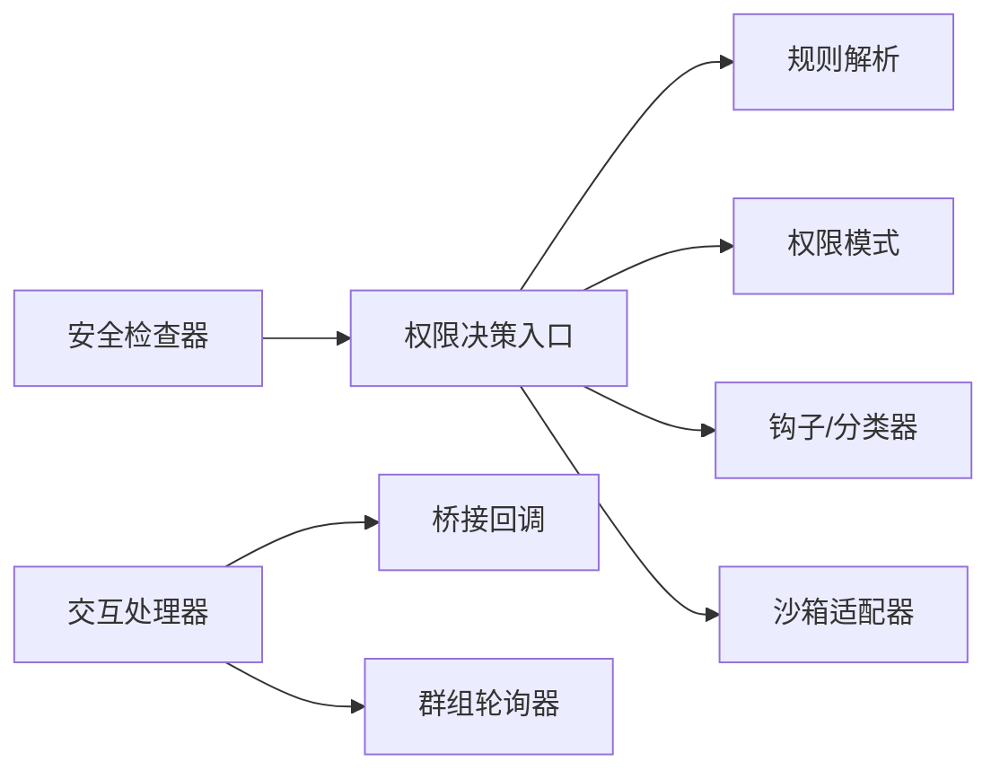

# 权限与安全

<cite>
**本文引用的文件**
- [bridgePermissionCallbacks.ts](file://src/bridge/bridgePermissionCallbacks.ts)
- [useSwarmPermissionPoller.ts](file://src/hooks/useSwarmPermissionPoller.ts)
- [interactiveHandler.ts](file://src/hooks/toolPermission/handlers/interactiveHandler.ts)
- [bashSecurity.ts](file://src/tools/BashTool/bashSecurity.ts)
- [powershellSecurity.ts](file://src/tools/PowerShellTool/powershellSecurity.ts)
- [sandbox-adapter.ts](file://src/utils/sandbox/sandbox-adapter.ts)
- [permissions.ts](file://src/utils/permissions/permissions.ts)
- [PermissionUpdateSchema.ts](file://src/utils/permissions/PermissionUpdateSchema.ts)
- [PermissionResult.ts](file://src/utils/permissions/PermissionResult.ts)
- [PermissionRule.ts](file://src/utils/permissions/PermissionRule.ts)
- [PermissionMode.ts](file://src/utils/permissions/PermissionMode.ts)
- [toolExecution.ts](file://src/services/tools/toolExecution.ts)
- [REPL.tsx](file://src/screens/REPL.tsx)
</cite>

## 目录
1. [简介](#简介)
2. [项目结构](#项目结构)
3. [核心组件](#核心组件)
4. [架构总览](#架构总览)
5. [详细组件分析](#详细组件分析)
6. [依赖关系分析](#依赖关系分析)
7. [性能考量](#性能考量)
8. [故障排查指南](#故障排查指南)
9. [结论](#结论)
10. [附录](#附录)

## 简介
本文件面向 free-code 的工具权限与安全系统，提供全面的 API 文档与实现解析，覆盖以下主题：
- 权限检查机制：规则匹配、模式与钩子、AI 自动审批（可选）
- 权限规则解析与持久化：规则值、行为、来源与目标
- 权限决策流程：本地交互、远程桥接、通道中继、沙箱权限请求
- 安全策略实施：命令白名单、路径限制、危险操作防护
- 工具执行前的安全验证接口、沙箱隔离机制与资源访问控制
- 权限配置 API 规范：规则定义、权限继承与动态授权
- 安全审计日志、违规检测与自动防护机制
- 安全策略配置项与调试方法

## 项目结构
围绕“权限与安全”的关键模块分布如下：
- 权限决策与交互层：工具权限上下文、交互处理器、远程桥接回调、群组权限轮询器
- 安全策略层：Bash/PowerShell 命令安全检查器
- 沙箱适配层：沙箱运行时配置转换、初始化与更新、网络/文件系统限制
- 权限规则与模式：规则值/行为/来源、更新规范、模式枚举与显示
- 执行与审计：工具执行时的规则来源映射、审计事件

图表来源
- [permissions.ts:473-800](file://src/utils/permissions/permissions.ts#L473-L800)
- [interactiveHandler.ts:57-537](file://src/hooks/toolPermission/handlers/interactiveHandler.ts#L57-L537)
- [bridgePermissionCallbacks.ts:10-43](file://src/bridge/bridgePermissionCallbacks.ts#L10-L43)
- [useSwarmPermissionPoller.ts:268-331](file://src/hooks/useSwarmPermissionPoller.ts#L268-L331)
- [bashSecurity.ts:1-2593](file://src/tools/BashTool/bashSecurity.ts#L1-L2593)
- [powershellSecurity.ts:1054-1090](file://src/tools/PowerShellTool/powershellSecurity.ts#L1054-L1090)
- [sandbox-adapter.ts:172-803](file://src/utils/sandbox/sandbox-adapter.ts#L172-L803)
- [PermissionRule.ts:19-41](file://src/utils/permissions/PermissionRule.ts#L19-L41)
- [PermissionUpdateSchema.ts:24-79](file://src/utils/permissions/PermissionUpdateSchema.ts#L24-L79)
- [PermissionMode.ts:21-142](file://src/utils/permissions/PermissionMode.ts#L21-L142)

章节来源
- [permissions.ts:109-121](file://src/utils/permissions/permissions.ts#L109-L121)
- [PermissionRule.ts:19-41](file://src/utils/permissions/PermissionRule.ts#L19-L41)
- [PermissionUpdateSchema.ts:24-79](file://src/utils/permissions/PermissionUpdateSchema.ts#L24-L79)
- [PermissionMode.ts:21-142](file://src/utils/permissions/PermissionMode.ts#L21-L142)

## 核心组件
- 权限决策入口：统一的工具使用权限检查函数，负责规则匹配、模式处理、自动审批与拒绝追踪
- 交互处理器：在主代理侧协调用户交互、远程桥接、通道中继、钩子与分类器检查
- 远程桥接回调：用于与远程控制台（如 claude.ai）进行权限请求/响应的桥接接口
- 群组权限轮询器：工作节点通过邮箱消息轮询主节点的权限响应
- Bash/PowerShell 安全检查器：对命令进行多维度安全校验，必要时要求用户确认
- 沙箱适配器：将权限与设置转换为沙箱运行时配置，支持动态更新与平台限制
- 权限规则与模式：规则值/行为/来源、更新规范、外部模式映射
- 工具执行审计：将规则来源映射到可观测性源标签，便于审计与统计

章节来源
- [permissions.ts:473-800](file://src/utils/permissions/permissions.ts#L473-L800)
- [interactiveHandler.ts:57-537](file://src/hooks/toolPermission/handlers/interactiveHandler.ts#L57-L537)
- [bridgePermissionCallbacks.ts:10-43](file://src/bridge/bridgePermissionCallbacks.ts#L10-L43)
- [useSwarmPermissionPoller.ts:268-331](file://src/hooks/useSwarmPermissionPoller.ts#L268-L331)
- [bashSecurity.ts:1-2593](file://src/tools/BashTool/bashSecurity.ts#L1-L2593)
- [powershellSecurity.ts:1054-1090](file://src/tools/PowerShellTool/powershellSecurity.ts#L1054-L1090)
- [sandbox-adapter.ts:172-803](file://src/utils/sandbox/sandbox-adapter.ts#L172-L803)
- [PermissionRule.ts:19-41](file://src/utils/permissions/PermissionRule.ts#L19-L41)
- [PermissionUpdateSchema.ts:24-79](file://src/utils/permissions/PermissionUpdateSchema.ts#L24-L79)
- [PermissionMode.ts:21-142](file://src/utils/permissions/PermissionMode.ts#L21-L142)
- [toolExecution.ts:173-194](file://src/services/tools/toolExecution.ts#L173-L194)

## 架构总览
下图展示从工具调用到权限决策、安全检查与沙箱执行的关键流程。

图表来源
- [permissions.ts:473-800](file://src/utils/permissions/permissions.ts#L473-L800)
- [interactiveHandler.ts:57-537](file://src/hooks/toolPermission/handlers/interactiveHandler.ts#L57-L537)
- [bridgePermissionCallbacks.ts:10-43](file://src/bridge/bridgePermissionCallbacks.ts#L10-L43)
- [useSwarmPermissionPoller.ts:268-331](file://src/hooks/useSwarmPermissionPoller.ts#L268-L331)
- [bashSecurity.ts:1-2593](file://src/tools/BashTool/bashSecurity.ts#L1-L2593)
- [powershellSecurity.ts:1054-1090](file://src/tools/PowerShellTool/powershellSecurity.ts#L1054-L1090)
- [sandbox-adapter.ts:730-803](file://src/utils/sandbox/sandbox-adapter.ts#L730-L803)

## 详细组件分析

### 权限检查机制与决策流程
- 规则匹配：按来源顺序合并“总是允许/总是拒绝/总是询问”规则，支持工具名与 MCP 服务器级规则匹配
- 模式处理：默认、计划模式、接受编辑、绕过权限、不询问、自动模式等；自动模式可结合分类器快速放行或拦截
- 钩子与分类器：异步执行权限请求钩子与自动模式分类器，优先于用户交互
- 远程与通道：桥接回调与通道中继作为远程输入来源，先于本地交互获胜
- 拒绝追踪：在自动模式下记录连续拒绝次数，成功后清零，避免长期阻断

图表来源
- [permissions.ts:473-800](file://src/utils/permissions/permissions.ts#L473-L800)
- [interactiveHandler.ts:410-431](file://src/hooks/toolPermission/handlers/interactiveHandler.ts#L410-L431)
- [PermissionMode.ts:21-142](file://src/utils/permissions/PermissionMode.ts#L21-L142)

章节来源
- [permissions.ts:233-302](file://src/utils/permissions/permissions.ts#L233-L302)
- [permissions.ts:473-800](file://src/utils/permissions/permissions.ts#L473-L800)
- [interactiveHandler.ts:410-431](file://src/hooks/toolPermission/handlers/interactiveHandler.ts#L410-L431)
- [PermissionMode.ts:21-142](file://src/utils/permissions/PermissionMode.ts#L21-L142)

### 权限规则解析与持久化
- 规则值：由工具名与可选内容组成，支持 MCP 服务器级规则
- 行为：允许/拒绝/询问
- 来源：用户设置、项目设置、本地设置、会话、命令行参数等
- 更新规范：新增/替换/移除规则、设置模式、增删目录等，目标可落盘至不同来源

图表来源
- [PermissionRule.ts:19-41](file://src/utils/permissions/PermissionRule.ts#L19-L41)
- [PermissionUpdateSchema.ts:24-79](file://src/utils/permissions/PermissionUpdateSchema.ts#L24-L79)

章节来源
- [PermissionRule.ts:19-41](file://src/utils/permissions/PermissionRule.ts#L19-L41)
- [PermissionUpdateSchema.ts:24-79](file://src/utils/permissions/PermissionUpdateSchema.ts#L24-L79)

### 远程桥接与群组权限
- 远程桥接回调：发送/接收权限请求与响应，支持更新输入与权限建议
- 群组轮询器：工作节点注册回调，主节点通过邮箱消息返回响应，处理完成后清理响应文件
- 本地/远程/通道三路竞速：以原子方式确保仅一次决议生效

图表来源
- [bridgePermissionCallbacks.ts:10-43](file://src/bridge/bridgePermissionCallbacks.ts#L10-L43)
- [useSwarmPermissionPoller.ts:118-156](file://src/hooks/useSwarmPermissionPoller.ts#L118-L156)
- [useSwarmPermissionPoller.ts:297-310](file://src/hooks/useSwarmPermissionPoller.ts#L297-L310)

章节来源
- [bridgePermissionCallbacks.ts:10-43](file://src/bridge/bridgePermissionCallbacks.ts#L10-L43)
- [useSwarmPermissionPoller.ts:75-116](file://src/hooks/useSwarmPermissionPoller.ts#L75-L116)
- [useSwarmPermissionPoller.ts:118-156](file://src/hooks/useSwarmPermissionPoller.ts#L118-L156)
- [useSwarmPermissionPoller.ts:268-331](file://src/hooks/useSwarmPermissionPoller.ts#L268-L331)

### Bash/PowerShell 安全策略
- Bash 安全检查器：覆盖换行注入、IFS 注入、/proc 环境变量访问、畸形令牌注入、危险元字符、命令替换、heredoc 安全模式、git 提交消息校验、jq 危险标志等
- PowerShell 安全检查器：覆盖 Invoke-Expression、动态命令名、编码命令、下载链、类型加载、运行时状态操控、WMI 进程等

图表来源
- [bashSecurity.ts:1017-1067](file://src/tools/BashTool/bashSecurity.ts#L1017-L1067)
- [bashSecurity.ts:1082-1128](file://src/tools/BashTool/bashSecurity.ts#L1082-L1128)
- [bashSecurity.ts:2571-2592](file://src/tools/BashTool/bashSecurity.ts#L2571-L2592)
- [powershellSecurity.ts:1054-1090](file://src/tools/PowerShellTool/powershellSecurity.ts#L1054-L1090)

章节来源
- [bashSecurity.ts:1017-1067](file://src/tools/BashTool/bashSecurity.ts#L1017-L1067)
- [bashSecurity.ts:1082-1128](file://src/tools/BashTool/bashSecurity.ts#L1082-L1128)
- [bashSecurity.ts:2571-2592](file://src/tools/BashTool/bashSecurity.ts#L2571-L2592)
- [powershellSecurity.ts:1054-1090](file://src/tools/PowerShellTool/powershellSecurity.ts#L1054-L1090)

### 沙箱隔离与资源访问控制
- 配置转换：从权限与设置中提取网络域、文件系统路径、Ripgrep 命令等，生成运行时配置
- 初始化与更新：按需初始化沙箱，订阅设置变更以动态更新配置
- 平台与依赖：检查平台支持与依赖可用性，支持 macOS、Linux、WSL2；可限制启用平台列表
- 访问控制：网络域白/黑名单、文件系统读写/只读路径、忽略违规、弱化隔离开关、裸仓库防护

图表来源
- [sandbox-adapter.ts:172-381](file://src/utils/sandbox/sandbox-adapter.ts#L172-L381)
- [sandbox-adapter.ts:730-803](file://src/utils/sandbox/sandbox-adapter.ts#L730-L803)

章节来源
- [sandbox-adapter.ts:172-381](file://src/utils/sandbox/sandbox-adapter.ts#L172-L381)
- [sandbox-adapter.ts:730-803](file://src/utils/sandbox/sandbox-adapter.ts#L730-L803)

### 工具执行前的安全验证接口与沙箱集成
- 在工具执行前，若启用沙箱且满足条件，将命令包装进沙箱运行，确保网络与文件系统受限
- 对于 Bash 工具，可基于设置决定是否自动允许已沙箱化的命令
- REPL 屏幕中对网络域的沙箱权限请求采用队列与回调机制，支持主节点响应与本地 UI 协同

章节来源
- [sandbox-adapter.ts:704-725](file://src/utils/sandbox/sandbox-adapter.ts#L704-L725)
- [REPL.tsx:2224-2252](file://src/screens/REPL.tsx#L2224-L2252)
- [REPL.tsx:4627-4642](file://src/screens/REPL.tsx#L4627-L4642)

### 权限配置 API 规范
- 规则定义：工具名 + 可选内容；行为为 allow/deny/ask
- 权限继承：按来源顺序合并规则，支持工具级与 MCP 服务器级规则
- 动态授权：通过更新规范对规则进行新增、替换、移除，或设置模式、增删目录
- 规则来源映射：将规则来源映射到可观测性源标签，便于审计

章节来源
- [PermissionRule.ts:19-41](file://src/utils/permissions/PermissionRule.ts#L19-L41)
- [PermissionUpdateSchema.ts:24-79](file://src/utils/permissions/PermissionUpdateSchema.ts#L24-L79)
- [permissions.ts:109-121](file://src/utils/permissions/permissions.ts#L109-L121)
- [toolExecution.ts:173-194](file://src/services/tools/toolExecution.ts#L173-L194)

### 安全审计日志、违规检测与自动防护
- 审计事件：将规则来源映射为可观测性源标签，记录自动模式决策、分类器使用量与延迟等
- 违规检测：安全检查器在发现可疑模式时返回“询问”，由用户或自动模式决定
- 自动防护：自动模式下对可接受编辑的快速路径与分类器进行短路放行，减少 API 调用与风险

章节来源
- [toolExecution.ts:173-194](file://src/services/tools/toolExecution.ts#L173-L194)
- [permissions.ts:626-793](file://src/utils/permissions/permissions.ts#L626-L793)

## 依赖关系分析
- 权限决策入口依赖：规则解析、模式、钩子、分类器、拒绝追踪、沙箱管理
- 交互处理器依赖：桥接回调、群组轮询器、分类器批准状态、工具输入与上下文
- 安全检查器独立于权限决策入口，但其结果影响最终决策
- 沙箱适配器依赖：设置系统、平台信息、依赖检查、路径解析

图表来源
- [permissions.ts:473-800](file://src/utils/permissions/permissions.ts#L473-L800)
- [interactiveHandler.ts:57-537](file://src/hooks/toolPermission/handlers/interactiveHandler.ts#L57-L537)
- [bridgePermissionCallbacks.ts:10-43](file://src/bridge/bridgePermissionCallbacks.ts#L10-L43)
- [useSwarmPermissionPoller.ts:268-331](file://src/hooks/useSwarmPermissionPoller.ts#L268-L331)
- [sandbox-adapter.ts:172-803](file://src/utils/sandbox/sandbox-adapter.ts#L172-L803)

章节来源
- [permissions.ts:473-800](file://src/utils/permissions/permissions.ts#L473-L800)
- [interactiveHandler.ts:57-537](file://src/hooks/toolPermission/handlers/interactiveHandler.ts#L57-L537)
- [sandbox-adapter.ts:172-803](file://src/utils/sandbox/sandbox-adapter.ts#L172-L803)

## 性能考量
- 分类器短路：接受编辑快速路径与安全工具白名单可显著降低分类器调用开销
- 设置变更订阅：沙箱配置按需更新，避免每次执行都重建运行时
- 平台与依赖检查缓存：平台支持与依赖可用性采用记忆化缓存，减少重复计算
- 并发控制：群组轮询器防止并发轮询，避免资源争用

## 故障排查指南
- 沙箱不可用原因：当用户显式启用沙箱但平台不支持或依赖缺失时，系统会给出明确提示
- 依赖缺失：根据平台提示安装缺失工具或运行诊断命令
- 平台限制：可通过启用平台列表限制仅在特定平台启用沙箱
- 设置锁定：策略来源可能锁定某些沙箱设置，导致本地修改无效
- Linux/WSL 全局模式警告：在这些平台上存在通配符路径的规则会给出警告

章节来源
- [sandbox-adapter.ts:562-592](file://src/utils/sandbox/sandbox-adapter.ts#L562-L592)
- [sandbox-adapter.ts:597-642](file://src/utils/sandbox/sandbox-adapter.ts#L597-L642)
- [sandbox-adapter.ts:647-664](file://src/utils/sandbox/sandbox-adapter.ts#L647-L664)

## 结论
该权限与安全系统通过“规则 + 模式 + 钩子/分类器 + 远程/通道 + 沙箱”的组合，实现了灵活而强大的工具使用控制。Bash/PowerShell 安全检查器提供了针对高危模式的深度防护，沙箱适配器则在执行层面提供强隔离。配合权限更新规范与审计事件，系统既保证了安全性，也兼顾了易用性与可观测性。

## 附录
- 安全策略配置项
  - 沙箱启用、自动允许沙箱化命令、允许非沙箱命令、失败即停
  - 网络域白/黑名单、Unix Socket/本地绑定、HTTP/SOCKS 代理端口
  - 文件系统读写/只读路径、忽略违规、弱化隔离开关
  - 启用平台列表、依赖检查、裸仓库防护
- 调试方法
  - 查看沙箱不可用原因与依赖缺失提示
  - 使用诊断命令查看沙箱状态与配置
  - 在 REPL 中观察网络域沙箱权限请求队列与响应

章节来源
- [sandbox-adapter.ts:172-381](file://src/utils/sandbox/sandbox-adapter.ts#L172-L381)
- [sandbox-adapter.ts:562-592](file://src/utils/sandbox/sandbox-adapter.ts#L562-L592)
- [REPL.tsx:2224-2252](file://src/screens/REPL.tsx#L2224-L2252)