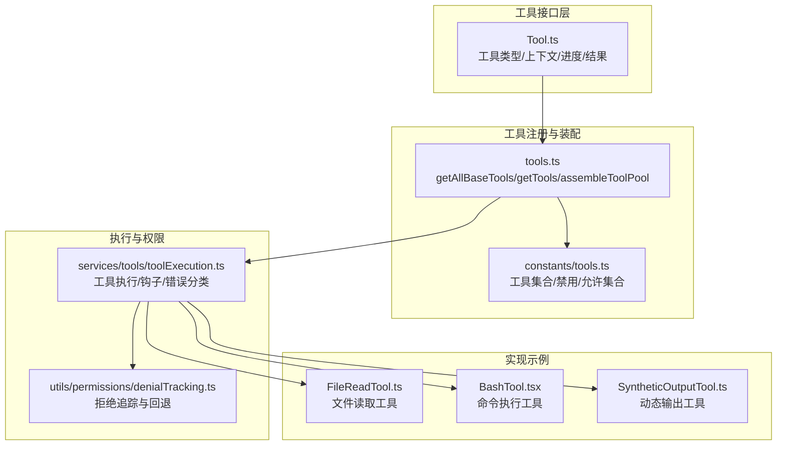
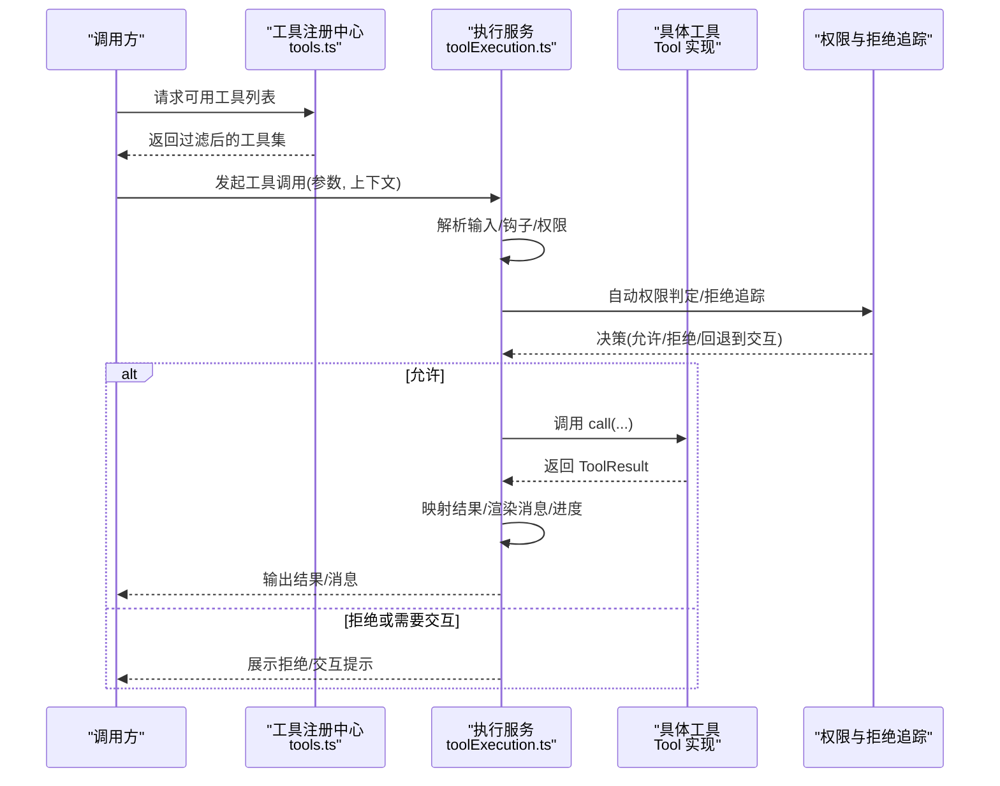
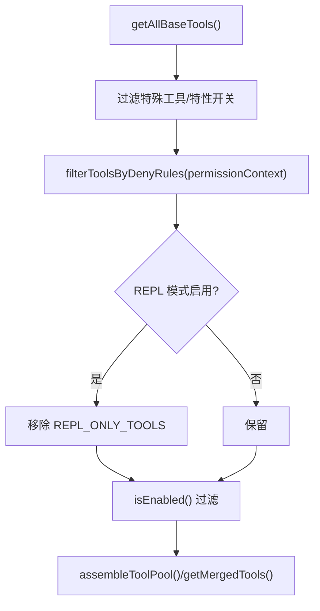
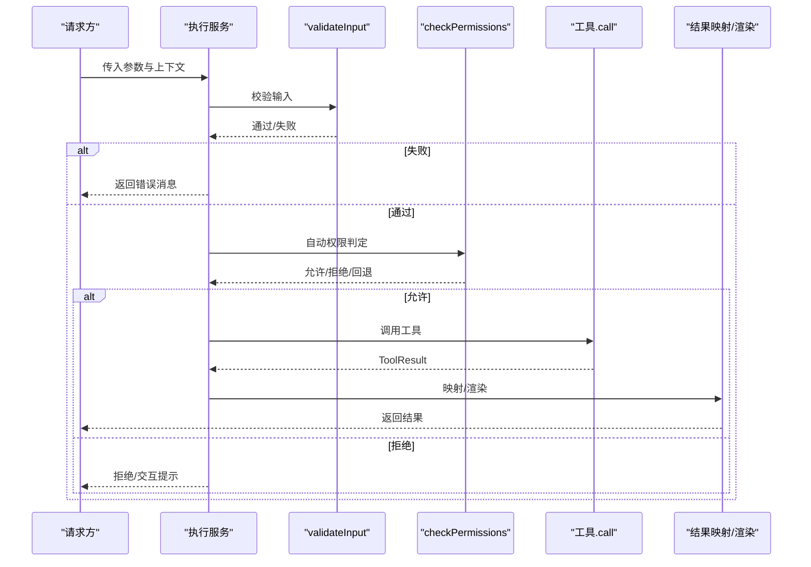
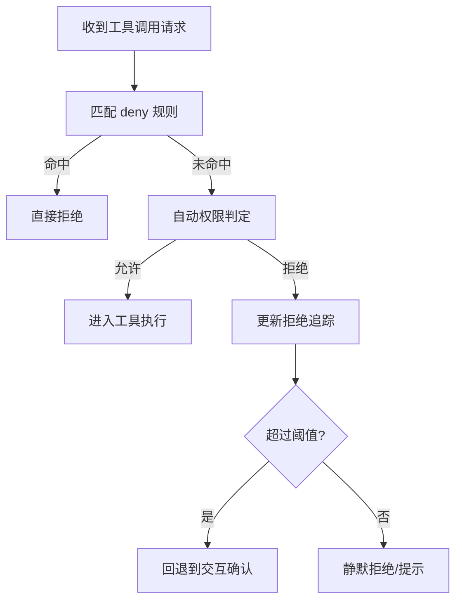
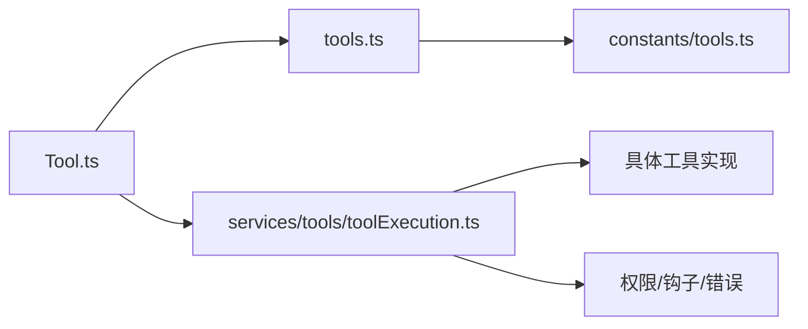

# 核心工具接口

<cite>
**本文引用的文件**
- [Tool.ts](file://src/Tool.ts)
- [tools.ts](file://src/tools.ts)
- [tools.ts（常量）](file://src/constants/tools.ts)
- [toolExecution.ts](file://src/services/tools/toolExecution.ts)
- [denialTracking.ts](file://src/utils/permissions/denialTracking.ts)
- [toolErrors.ts](file://src/utils/toolErrors.ts)
- [FileReadTool.ts](file://src/tools/FileReadTool/FileReadTool.ts)
- [BashTool.tsx](file://src/tools/BashTool/BashTool.tsx)
- [SyntheticOutputTool.ts](file://src/tools/SyntheticOutputTool/SyntheticOutputTool.ts)
</cite>

## 目录
1. [简介](#简介)
2. [项目结构](#项目结构)
3. [核心组件](#核心组件)
4. [架构总览](#架构总览)
5. [详细组件分析](#详细组件分析)
6. [依赖关系分析](#依赖关系分析)
7. [性能考量](#性能考量)
8. [故障排查指南](#故障排查指南)
9. [结论](#结论)
10. [附录](#附录)

## 简介
本文件面向 free-code 的“核心工具接口”，系统性梳理 Tool 基类的设计模式、工具注册与装配机制、工具生命周期与执行流程、权限与安全控制、结果格式化与错误处理、元数据与分类体系，并给出工具开发最佳实践、测试与调试建议。目标是帮助开发者在不深入源码细节的前提下，快速理解并正确扩展工具生态。

## 项目结构
围绕工具接口的关键模块如下：
- 工具类型与基类：定义工具契约、上下文、进度、结果等核心类型与默认行为
- 工具注册与装配：集中式聚合内置工具、MCP 工具，按权限与模式过滤
- 工具执行服务：统一调度工具调用、权限校验、钩子、错误分类与日志
- 权限与拒绝追踪：对自动化权限决策失败进行阈值控制与回退策略
- 工具实现示例：文件读取、命令执行、动态输出工具等典型实现



图表来源
- [Tool.ts:362-792](file://src/Tool.ts#L362-L792)
- [tools.ts:193-367](file://src/tools.ts#L193-L367)
- [toolExecution.ts:1-200](file://src/services/tools/toolExecution.ts#L1-L200)
- [denialTracking.ts:1-46](file://src/utils/permissions/denialTracking.ts#L1-L46)
- [FileReadTool.ts:1-200](file://src/tools/FileReadTool/FileReadTool.ts#L1-L200)
- [BashTool.tsx:1-200](file://src/tools/BashTool/BashTool.tsx#L1-L200)
- [SyntheticOutputTool.ts:103-136](file://src/tools/SyntheticOutputTool/SyntheticOutputTool.ts#L103-L136)

章节来源
- [Tool.ts:1-793](file://src/Tool.ts#L1-L793)
- [tools.ts:1-390](file://src/tools.ts#L1-L390)
- [toolExecution.ts:1-200](file://src/services/tools/toolExecution.ts#L1-L200)

## 核心组件
- 工具类型与契约
  - 工具类型 Tool 定义了输入/输出/进度、生命周期钩子、渲染与消息生成、权限与安全判定、并发与只读属性、延迟加载与 MCP 元信息等能力边界
  - 上下文 ToolUseContext 提供运行期环境（命令、调试开关、模型、MCP 客户端/资源、会话状态、通知、文件历史、内容替换预算等）
  - 结果 ToolResult 统一承载数据、新增消息、上下文修改器与 MCP 元数据
- 构建器与默认行为
  - buildTool 将部分实现缺省为安全默认，避免重复样板代码
  - TOOL_DEFAULTS 覆盖启用、并发安全、只读、破坏性、权限、自动分类输入、用户可见名等
- 注册与装配
  - getAllBaseTools 汇总所有内置工具（受特性开关与模式影响）
  - getTools 在权限上下文与 REPL 模式下进一步过滤
  - assembleToolPool 合并内置与 MCP 工具，去重并保持提示词缓存稳定排序
- 执行与生命周期
  - toolExecution.ts 统一编排：解析输入、钩子、权限、工具执行、结果映射、UI 渲染、错误分类与日志

章节来源
- [Tool.ts:362-792](file://src/Tool.ts#L362-L792)
- [tools.ts:193-367](file://src/tools.ts#L193-L367)
- [toolExecution.ts:682-698](file://src/services/tools/toolExecution.ts#L682-L698)

## 架构总览
工具从“注册—选择—执行—渲染”的闭环流转，贯穿权限、钩子、错误与 UI。



图表来源
- [tools.ts:271-327](file://src/tools.ts#L271-L327)
- [toolExecution.ts:682-698](file://src/services/tools/toolExecution.ts#L682-L698)
- [denialTracking.ts:40-46](file://src/utils/permissions/denialTracking.ts#L40-L46)

## 详细组件分析

### Tool 基类与设计模式
- 类型与职责
  - 输入/输出/进度：通过泛型约束输入 Zod 模式、输出类型与进度类型，确保强类型链路
  - 生命周期钩子：描述、渲染、进度、拒绝/错误 UI、分组渲染等
  - 安全与权限：validateInput、checkPermissions、isReadOnly/isDestructive、toAutoClassifierInput
  - 运行时特性：isConcurrencySafe、interruptBehavior、shouldDefer/alwaysLoad、mcpInfo
- 默认行为与构建器
  - buildTool 将常用可选方法填充为安全默认，减少工具实现样板
  - TOOL_DEFAULTS 采用“失败关闭”策略，确保安全边界
- 设计要点
  - 可插拔：通过 renderToolUseMessage/renderToolResultMessage 等钩子解耦 UI
  - 可观察：backfillObservableInput、extractSearchText、getToolUseSummary
  - 可扩展：mcpInfo、isMcp、inputJSONSchema 支持 MCP 工具直连

```mermaid
classDiagram
class Tool {
+name : string
+aliases? : string[]
+searchHint? : string
+inputSchema
+outputSchema?
+call(args, context, canUseTool, parentMessage, onProgress?)
+description(input, options)
+isEnabled() : boolean
+isReadOnly(input) : boolean
+isDestructive?(input) : boolean
+isConcurrencySafe(input) : boolean
+interruptBehavior?() : "cancel"|"block"
+isSearchOrReadCommand?(input) : {isSearch,isRead,isList?}
+isOpenWorld?(input) : boolean
+requiresUserInteraction?() : boolean
+isMcp? : boolean
+isLsp? : boolean
+shouldDefer? : boolean
+alwaysLoad? : boolean
+mcpInfo? : {serverName,toolName}
+maxResultSizeChars : number
+strict? : boolean
+backfillObservableInput?(input)
+validateInput?(input, context)
+checkPermissions(input, context)
+getPath?(input)
+preparePermissionMatcher?(input)
+prompt(options)
+userFacingName(input?)
+userFacingNameBackgroundColor?(input?)
+isTransparentWrapper?() : boolean
+getToolUseSummary?(input?) : string|null
+getActivityDescription?(input?) : string|null
+toAutoClassifierInput(input)
+mapToolResultToToolResultBlockParam(content, toolUseID)
+renderToolResultMessage?(content, progress, options)
+extractSearchText?(out)
+renderToolUseMessage(input, options)
+isResultTruncated?(output)
+renderToolUseTag?(input)
+renderToolUseProgressMessage?(progress, options)
+renderToolUseQueuedMessage?()
+renderToolUseRejectedMessage?(input, options)
+renderToolUseErrorMessage?(result, options)
+renderGroupedToolUse?(toolUses, options)
}
class ToolUseContext {
+options
+abortController
+readFileState
+getAppState()
+setAppState()
+setAppStateForTasks?
+handleElicitation?
+setToolJSX?
+addNotification?
+appendSystemMessage?
+sendOSNotification?
+setInProgressToolUseIDs
+setHasInterruptibleToolInProgress?
+setResponseLength
+pushApiMetricsEntry?
+setStreamMode?
+onCompactProgress?
+setSDKStatus?
+openMessageSelector?
+updateFileHistoryState()
+updateAttributionState()
+setConversationId?
+agentId?
+agentType?
+requireCanUseTool?
+messages
+fileReadingLimits?
+globLimits?
+toolDecisions?
+queryTracking?
+requestPrompt?
+toolUseId?
+criticalSystemReminder_EXPERIMENTAL?
+preserveToolUseResults?
+localDenialTracking?
+contentReplacementState?
+renderedSystemPrompt?
}
Tool --> ToolUseContext : "使用"
```

图表来源
- [Tool.ts:362-792](file://src/Tool.ts#L362-L792)

章节来源
- [Tool.ts:362-792](file://src/Tool.ts#L362-L792)

### 工具注册机制与装配
- 工具聚合
  - getAllBaseTools：根据特性开关与模式返回内置工具全集
  - getTools：在权限上下文与 REPL 模式下过滤工具（含特殊工具剔除与 REPL 专用工具隐藏）
  - assembleToolPool：合并内置与 MCP 工具，按名称排序并去重，内置优先
  - getMergedTools：返回内置与 MCP 工具拼接（不强制去重）
- 权限过滤
  - filterToolsByDenyRules：基于权限规则对工具进行黑名单过滤
- 预设与选择
  - TOOL_PRESETS 与 getToolsForDefaultPreset：支持按预设筛选工具名



图表来源
- [tools.ts:193-367](file://src/tools.ts#L193-L367)
- [tools.ts（常量）:36-113](file://src/constants/tools.ts#L36-L113)

章节来源
- [tools.ts:193-367](file://src/tools.ts#L193-L367)
- [tools.ts（常量）:36-113](file://src/constants/tools.ts#L36-L113)

### 工具生命周期与执行流程
- 执行入口
  - toolExecution.ts 统一编排：解析输入、钩子、权限、工具执行、结果映射、UI 渲染、错误分类与日志
- 关键阶段
  - 输入校验：validateInput（如工具自定义），Zod 错误格式化
  - 权限判定：checkPermissions（工具特定），结合拒绝追踪与自动分类
  - 工具调用：call(...)，支持进度回调
  - 结果映射：mapToolResultToToolResultBlockParam、renderToolResultMessage
  - 错误处理：classifyToolError、renderToolUseErrorMessage、错误日志与遥测
- 并发与中断
  - isConcurrencySafe 控制并发安全
  - interruptBehavior 控制用户新消息到达时的行为（取消/阻塞）



图表来源
- [toolExecution.ts:682-698](file://src/services/tools/toolExecution.ts#L682-L698)
- [Tool.ts:489-503](file://src/Tool.ts#L489-L503)

章节来源
- [toolExecution.ts:1-200](file://src/services/tools/toolExecution.ts#L1-L200)
- [toolExecution.ts:682-698](file://src/services/tools/toolExecution.ts#L682-L698)
- [Tool.ts:489-503](file://src/Tool.ts#L489-L503)

### 权限检查机制与拒绝追踪
- 权限上下文
  - ToolPermissionContext 描述权限模式、附加工作目录、规则集、是否允许绕过权限等
  - getEmptyToolPermissionContext 提供默认空上下文
- 自动权限与拒绝追踪
  - deny 规则匹配工具名（含 MCP 前缀），直接屏蔽
  - denialTracking 记录连续与累计拒绝次数，达到阈值后回退到交互确认
- 工具内权限
  - checkPermissions 由工具自定义；若未覆盖，默认允许



图表来源
- [tools.ts:262-269](file://src/tools.ts#L262-L269)
- [denialTracking.ts:12-46](file://src/utils/permissions/denialTracking.ts#L12-L46)
- [Tool.ts:123-148](file://src/Tool.ts#L123-L148)

章节来源
- [tools.ts:262-269](file://src/tools.ts#L262-L269)
- [denialTracking.ts:1-46](file://src/utils/permissions/denialTracking.ts#L1-L46)
- [Tool.ts:123-148](file://src/Tool.ts#L123-L148)

### 结果格式化与错误处理
- 结果格式
  - ToolResult.data：工具输出主体
  - newMessages：可选追加消息（用户/助手/附件/系统）
  - contextModifier：对上下文进行不可并发安全工具的串行化调整
  - mcpMeta：传递 MCP 协议元数据
- 错误分类
  - classifyToolError：对未知/外部/系统错误进行语义化分类，便于遥测与诊断
  - formatZodValidationError：将 Zod 校验错误转为人类可读提示
- UI 渲染
  - renderToolUseMessage / renderToolResultMessage / renderToolUseErrorMessage / renderToolUseRejectedMessage
  - extractSearchText：用于转录搜索索引

章节来源
- [Tool.ts:321-336](file://src/Tool.ts#L321-L336)
- [toolExecution.ts:150-171](file://src/services/tools/toolExecution.ts#L150-L171)
- [toolErrors.ts:66-132](file://src/utils/toolErrors.ts#L66-L132)

### 工具元数据、分类与优先级
- 元数据
  - name/aliases/searchHint：命名与关键词检索
  - shouldDefer/alwaysLoad：延迟加载与强制加载
  - mcpInfo：MCP 工具的服务器与工具名
  - maxResultSizeChars：结果大小阈值，超限持久化
  - strict：严格模式（受特性开关）
- 分类与集合
  - constants/tools.ts 定义 ALL_AGENT_DISALLOWED_TOOLS、ASYNC_AGENT_ALLOWED_TOOLS、IN_PROCESS_TEAMMATE_ALLOWED_TOOLS、COORDINATOR_MODE_ALLOWED_TOOLS 等集合
- 优先级与排序
  - assembleToolPool 对内置与 MCP 工具分别排序后合并，内置优先，保证提示词缓存稳定性

章节来源
- [Tool.ts:442-472](file://src/Tool.ts#L442-L472)
- [tools.ts（常量）:36-113](file://src/constants/tools.ts#L36-L113)
- [tools.ts:345-367](file://src/tools.ts#L345-L367)

### 典型工具实现示例

#### 文件读取工具（FileReadTool）
- 能力点
  - 输入校验与路径展开、设备路径阻断、macOS 截图路径兼容
  - 令牌/大小限制、PDF/图像处理、监听器回调
  - 用户可见名、摘要、错误/使用消息渲染
- 安全与并发
  - isReadOnly(true)、isDestructive(false)
  - isConcurrencySafe(false)（默认），需串行化处理

章节来源
- [FileReadTool.ts:1-200](file://src/tools/FileReadTool/FileReadTool.ts#L1-L200)

#### 命令执行工具（BashTool）
- 能力点
  - 命令解析与语义识别（搜索/读取/列表）、静默命令判断
  - 只读约束、沙箱策略、任务管理、输出截断与预览
  - 用户可见名、摘要、进度与队列消息渲染
- 安全与并发
  - isReadOnly(false)、isDestructive(true)、isConcurrencySafe(false)
  - interruptBehavior 默认 'block'

章节来源
- [BashTool.tsx:1-200](file://src/tools/BashTool/BashTool.tsx#L1-L200)

#### 动态输出工具（SyntheticOutputTool）
- 能力点
  - 基于 JSON Schema 动态生成工具，带 Ajv 校验与缓存
  - createSyntheticOutputTool 返回 {tool} 或 {error}

章节来源
- [SyntheticOutputTool.ts:103-136](file://src/tools/SyntheticOutputTool/SyntheticOutputTool.ts#L103-L136)

## 依赖关系分析
- 模块耦合
  - Tool.ts 作为核心契约被 tools.ts、toolExecution.ts、各工具实现广泛依赖
  - tools.ts 依赖 constants/tools.ts 的集合与特性开关
  - toolExecution.ts 依赖工具实现、权限与钩子、消息与附件工具
- 外部依赖
  - Zod 用于输入模式校验
  - Bun 特性开关与 Node 环境变量用于条件编译/功能开关
  - MCP/SDK 类型用于协议对接



图表来源
- [Tool.ts:1-793](file://src/Tool.ts#L1-L793)
- [tools.ts:1-390](file://src/tools.ts#L1-L390)
- [toolExecution.ts:1-200](file://src/services/tools/toolExecution.ts#L1-L200)
- [tools.ts（常量）:1-113](file://src/constants/tools.ts#L1-L113)

章节来源
- [Tool.ts:1-793](file://src/Tool.ts#L1-L793)
- [tools.ts:1-390](file://src/tools.ts#L1-L390)
- [toolExecution.ts:1-200](file://src/services/tools/toolExecution.ts#L1-L200)

## 性能考量
- 输入与结果体积
  - maxResultSizeChars 控制大结果落地文件，避免内存与传输压力
- 排序与缓存
  - assembleToolPool 对工具名排序并去重，保持提示词缓存稳定，降低下游缓存失效
- 并发与中断
  - isConcurrencySafe 与 interruptBehavior 影响吞吐与响应性
- 日志与遥测
  - classifyToolError 与统计埋点有助于定位热点问题

[本节为通用指导，无需列出章节来源]

## 故障排查指南
- 输入校验失败
  - 使用 formatZodValidationError 获取清晰的缺失/多余/类型不匹配提示
- 权限被拒绝
  - 检查 deny 规则与拒绝追踪阈值，必要时回退到交互确认
- 工具执行错误
  - 通过 classifyToolError 获取稳定可读的错误类别，结合日志与遥测定位
- 结果过大或渲染异常
  - 调整 maxResultSizeChars，或在工具中实现 extractSearchText 与 isResultTruncated

章节来源
- [toolErrors.ts:66-132](file://src/utils/toolErrors.ts#L66-L132)
- [denialTracking.ts:40-46](file://src/utils/permissions/denialTracking.ts#L40-L46)
- [toolExecution.ts:150-171](file://src/services/tools/toolExecution.ts#L150-L171)

## 结论
free-code 的工具接口以 Tool.ts 为核心契约，辅以 buildTool 的默认安全策略、tools.ts 的集中注册与装配、toolExecution.ts 的统一执行与错误处理，形成“强类型—可插拔—可观察—可扩展”的完整工具生态。通过权限与拒绝追踪保障安全边界，通过元数据与集合实现灵活的分类与控制。遵循本文最佳实践与调试建议，可高效、安全地扩展工具能力。

[本节为总结，无需列出章节来源]

## 附录

### 工具接口规范速查
- 方法签名
  - call(args, context, canUseTool, parentMessage, onProgress?)：执行工具
  - description(input, options)：生成工具描述
  - validateInput?(input, context)：输入校验
  - checkPermissions(input, context)：权限判定
  - renderToolUseMessage(input, options)：渲染工具使用消息
  - renderToolResultMessage?(content, progress, options)：渲染结果消息
  - renderToolUseErrorMessage?(result, options)：渲染错误消息
  - renderToolUseRejectedMessage?(input, options)：渲染拒绝消息
- 元数据与特性
  - name/aliases/searchHint/shouldDefer/alwaysLoad/mcpInfo/maxResultSizeChars/strict
  - isReadOnly/isDestructive/isConcurrencySafe/interruptBehavior/isOpenWorld
- 上下文字段
  - options、abortController、setToolJSX、addNotification、appendSystemMessage、requestPrompt、fileReadingLimits/globLimits、toolDecisions、queryTracking、contentReplacementState、renderedSystemPrompt 等

章节来源
- [Tool.ts:362-792](file://src/Tool.ts#L362-L792)

### 工具开发最佳实践
- 命名约定
  - 使用语义化 name，必要时提供 aliases；searchHint 用于关键词检索
- 参数验证
  - 优先使用 Zod 模式；在 validateInput 中补充复杂约束
- 安全考虑
  - 明确 isReadOnly/isDestructive/isConcurrencySafe；对潜在破坏性操作实现只读/沙箱/并发保护
  - 使用 toAutoClassifierInput 提供分类器输入，避免安全盲区
- 渲染与消息
  - 实现 renderToolUseMessage 与 renderToolResultMessage；必要时实现 extractSearchText
  - 对大结果实现 isResultTruncated 与分页/预览
- 生命周期
  - 合理设置 interruptBehavior；在 contextModifier 中串行化非并发安全工具
- MCP 工具
  - 设置 mcpInfo；必要时提供 inputJSONSchema

章节来源
- [Tool.ts:362-792](file://src/Tool.ts#L362-L792)

### 工具测试与调试
- 单元测试
  - 验证输入模式与 validateInput 行为
  - 模拟权限上下文与拒绝追踪，覆盖自动/交互路径
- 集成测试
  - 通过 toolExecution 流程端到端验证工具调用、进度、错误与渲染
- 调试技巧
  - 开启 verbose/调试开关，观察 progress 与消息链
  - 使用 classifyToolError 快速定位错误类别
  - 利用 getToolUseSummary 与 extractSearchText 辅助问题复现与索引验证

章节来源
- [toolExecution.ts:1-200](file://src/services/tools/toolExecution.ts#L1-L200)
- [toolErrors.ts:66-132](file://src/utils/toolErrors.ts#L66-L132)