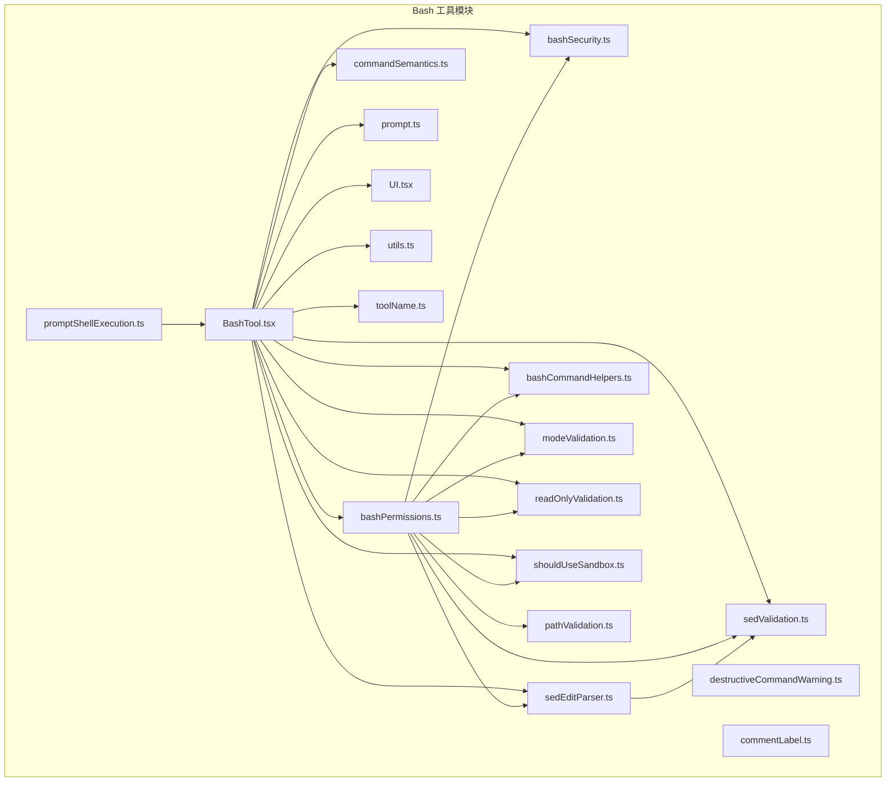
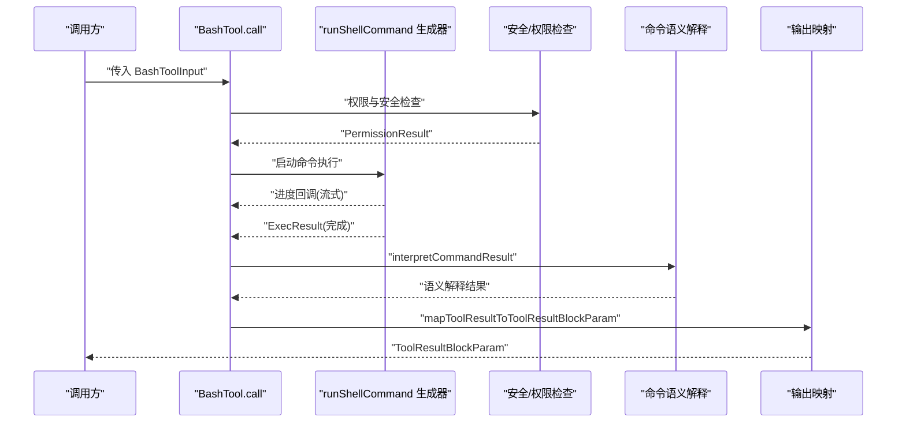
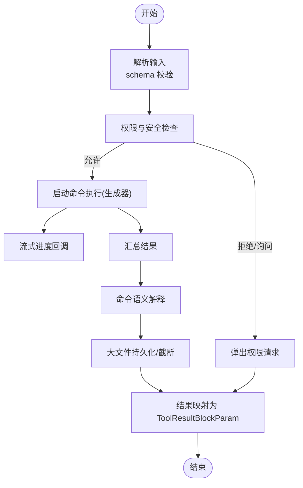
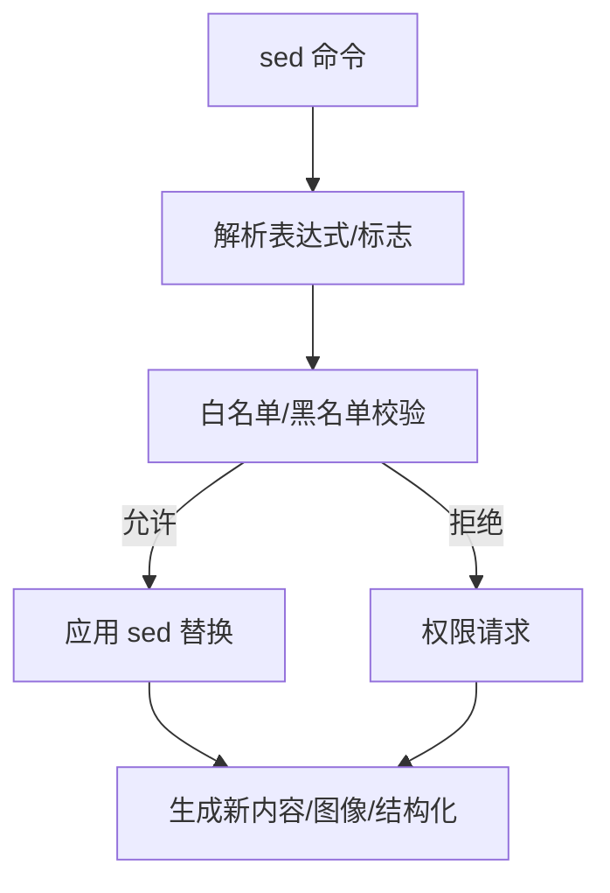
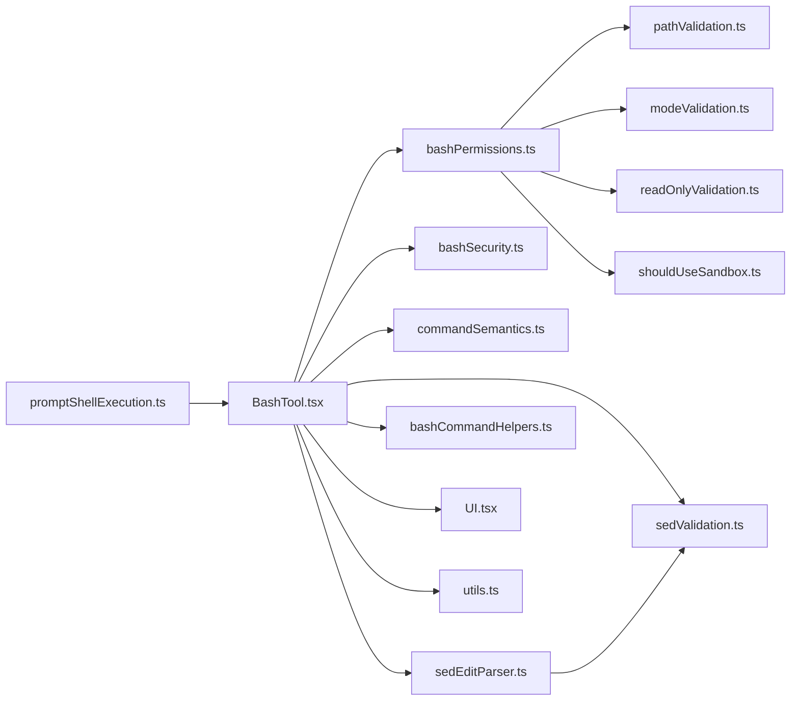

# Bash 工具

<cite>
**本文档引用的文件**
- [BashTool.tsx](file://src/tools/BashTool/BashTool.tsx)
- [bashPermissions.ts](file://src/tools/BashTool/bashPermissions.ts)
- [bashSecurity.ts](file://src/tools/BashTool/bashSecurity.ts)
- [commandSemantics.ts](file://src/tools/BashTool/commandSemantics.ts)
- [sedEditParser.ts](file://src/tools/BashTool/sedEditParser.ts)
- [sedValidation.ts](file://src/tools/BashTool/sedValidation.ts)
- [bashCommandHelpers.ts](file://src/tools/BashTool/bashCommandHelpers.ts)
- [prompt.ts](file://src/tools/BashTool/prompt.ts)
- [modeValidation.ts](file://src/tools/BashTool/modeValidation.ts)
- [readOnlyValidation.ts](file://src/tools/BashTool/readOnlyValidation.ts)
- [shouldUseSandbox.ts](file://src/tools/BashTool/shouldUseSandbox.ts)
- [UI.tsx](file://src/tools/BashTool/UI.tsx)
- [utils.ts](file://src/tools/BashTool/utils.ts)
- [toolName.ts](file://src/tools/BashTool/toolName.ts)
- [pathValidation.ts](file://src/tools/BashTool/pathValidation.ts)
- [destructiveCommandWarning.ts](file://src/tools/BashTool/destructiveCommandWarning.ts)
- [commentLabel.ts](file://src/tools/BashTool/commentLabel.ts)
- [promptShellExecution.ts](file://src/utils/promptShellExecution.ts)
</cite>

## 目录
1. [简介](#简介)
2. [项目结构](#项目结构)
3. [核心组件](#核心组件)
4. [架构总览](#架构总览)
5. [详细组件分析](#详细组件分析)
6. [依赖关系分析](#依赖关系分析)
7. [性能考虑](#性能考虑)
8. [故障排除指南](#故障排除指南)
9. [结论](#结论)

## 简介
本文件为 Bash 工具的详细 API 参考与实现说明，覆盖命令执行接口、参数解析、输出处理、命令语义分析、sed 编辑器集成、安全策略、权限控制、破坏性命令警告、只读模式验证、命令历史与自动补全、错误恢复、沙箱隔离、环境变量与工作目录管理、性能监控与调试等主题。内容基于源码分析，旨在帮助开发者与使用者理解工具的行为边界与最佳实践。

## 项目结构
Bash 工具位于 `src/tools/BashTool/` 目录下，核心文件包括：
- BashTool.tsx：工具定义、输入/输出模式、调用流程、UI 渲染与结果映射
- bashPermissions.ts：权限匹配、规则过滤、分类器集成、沙箱自动允许
- bashSecurity.ts：安全检查器（命令注入、危险模式、重定向、变量、元字符等）
- commandSemantics.ts：命令退出码语义解释（如 grep、find、diff 等）
- sedEditParser.ts：sed in-place 编辑解析与预计算
- sedValidation.ts：sed 命令白名单/黑名单校验与约束
- bashCommandHelpers.ts：管道/复合命令权限检查辅助
- prompt.ts、modeValidation.ts、readOnlyValidation.ts、shouldUseSandbox.ts：提示、模式与只读、沙箱策略
- UI.tsx、utils.ts、toolName.ts：UI 渲染、工具名称、工具结果处理
- pathValidation.ts：路径约束与写入目标校验
- destructiveCommandWarning.ts、commentLabel.ts：破坏性命令警告与注释标签
- promptShellExecution.ts：在提示中执行 shell 命令的格式化与替换逻辑

**图表来源**
- [BashTool.tsx:1-120](file://src/tools/BashTool/BashTool.tsx#L1-120)
- [bashPermissions.ts:1-120](file://src/tools/BashTool/bashPermissions.ts#L1-120)
- [bashSecurity.ts:1-120](file://src/tools/BashTool/bashSecurity.ts#L1-120)
- [commandSemantics.ts:1-60](file://src/tools/BashTool/commandSemantics.ts#L1-60)
- [sedEditParser.ts:1-60](file://src/tools/BashTool/sedEditParser.ts#L1-60)
- [sedValidation.ts:1-60](file://src/tools/BashTool/sedValidation.ts#L1-60)
- [bashCommandHelpers.ts:1-60](file://src/tools/BashTool/bashCommandHelpers.ts#L1-60)
- [prompt.ts:1-60](file://src/tools/BashTool/prompt.ts#L1-60)
- [modeValidation.ts:1-60](file://src/tools/BashTool/modeValidation.ts#L1-60)
- [readOnlyValidation.ts:1-60](file://src/tools/BashTool/readOnlyValidation.ts#L1-60)
- [shouldUseSandbox.ts:1-60](file://src/tools/BashTool/shouldUseSandbox.ts#L1-60)
- [UI.tsx:1-60](file://src/tools/BashTool/UI.tsx#L1-60)
- [utils.ts:1-60](file://src/tools/BashTool/utils.ts#L1-60)
- [toolName.ts:1-60](file://src/tools/BashTool/toolName.ts#L1-60)
- [pathValidation.ts:1-60](file://src/tools/BashTool/pathValidation.ts#L1-60)
- [destructiveCommandWarning.ts:1-60](file://src/tools/BashTool/destructiveCommandWarning.ts#L1-60)
- [commentLabel.ts:1-60](file://src/tools/BashTool/commentLabel.ts#L1-60)
- [promptShellExecution.ts:115-165](file://src/utils/promptShellExecution.ts#L115-165)

**章节来源**
- [BashTool.tsx:1-120](file://src/tools/BashTool/BashTool.tsx#L1-120)
- [bashPermissions.ts:1-120](file://src/tools/BashTool/bashPermissions.ts#L1-120)

## 核心组件
- 工具定义与生命周期
  - 输入模式：支持命令字符串、超时、描述、后台运行、禁用沙箱标志、内部预计算 sed 编辑结果
  - 输出模式：标准输出、标准错误、原始输出路径、中断标记、图像标记、后台任务标识、返回码语义解释、无输出预期、结构化内容、持久化输出路径与大小
  - 并发安全：基于只读判断
  - 权限匹配：支持按 AST/前缀规则匹配
  - 搜索/只读命令识别：基于分词与集合判定
  - 调用流程：生成器驱动的流式进度回调，最终汇总输出并进行大文件持久化与图像压缩
- 安全与权限
  - 多层安全检查：不完整命令、heredoc 替换、命令注入、危险变量、元字符、重定向、换行/回车、IFS 注入、/proc 环境访问、畸形令牌注入、混淆标志、反斜线转义空白、Zsh 危险命令等
  - 规则匹配：精确匹配、前缀匹配、通配符匹配；支持拒绝/询问/允许规则；带环境变量剥离与包装器剥离
  - 分类器：可选的 Bash 允许分类器，支持推测式并行检查
  - 沙箱自动允许：在启用沙箱且无显式规则时，对复合命令逐子命令检查拒绝/询问规则后自动允许
- 命令语义
  - 针对 grep、find、diff、test/[、wc/cat 等命令的退出码语义解释，区分“无匹配/部分成功/条件为假”等非错误情况
- sed 编辑器集成
  - 解析 sed -i 表达式，提取文件路径、模式、替换、标志、扩展正则
  - 应用 sed 替换到内容，处理 BRE/ERE 转换与转义
  - 严格白名单/黑名单校验：仅允许安全的打印命令或替换命令（可选允许文件写入），拒绝写入/执行/复杂地址等危险操作
- 模式与只读
  - 模式验证：根据工具上下文模式决定是否允许文件写入、接受编辑等
  - 只读约束：检测命令是否仅读取/列出/统计等，允许只读命令直接通过
- 沙箱与隔离
  - 沙箱策略：根据环境变量与规则决定是否使用沙箱，支持禁用沙箱的危险覆盖
  - 沙箱失败标注：在输出中标注沙箱违规
- UI 与结果映射
  - 进度消息、排队消息、结果消息渲染
  - 结果块映射：支持结构化内容、图像内容、大文件持久化、后台任务信息拼接
- 提示与自动补全
  - 提示构建与默认提示
  - 命令历史与自动补全：基于历史与类型提示
- 错误恢复与诊断
  - 中断标记与错误消息拼接
  - Git lock 错误事件记录
  - 大输出截断与复制/链接持久化
  - 图像输出压缩与尺寸限制

**章节来源**
- [BashTool.tsx:227-296](file://src/tools/BashTool/BashTool.tsx#L227-296)
- [commandSemantics.ts:1-141](file://src/tools/BashTool/commandSemantics.ts#L1-141)
- [sedEditParser.ts:1-323](file://src/tools/BashTool/sedEditParser.ts#L1-323)
- [sedValidation.ts:1-685](file://src/tools/BashTool/sedValidation.ts#L1-685)
- [bashPermissions.ts:1-200](file://src/tools/BashTool/bashPermissions.ts#L1-200)
- [bashSecurity.ts:1-200](file://src/tools/BashTool/bashSecurity.ts#L1-200)
- [UI.tsx:1-120](file://src/tools/BashTool/UI.tsx#L1-120)
- [utils.ts:1-120](file://src/tools/BashTool/utils.ts#L1-120)
- [prompt.ts:1-120](file://src/tools/BashTool/prompt.ts#L1-120)
- [modeValidation.ts:1-120](file://src/tools/BashTool/modeValidation.ts#L1-120)
- [readOnlyValidation.ts:1-120](file://src/tools/BashTool/readOnlyValidation.ts#L1-120)
- [shouldUseSandbox.ts:1-120](file://src/tools/BashTool/shouldUseSandbox.ts#L1-120)
- [pathValidation.ts:1-120](file://src/tools/BashTool/pathValidation.ts#L1-120)
- [destructiveCommandWarning.ts:1-120](file://src/tools/BashTool/destructiveCommandWarning.ts#L1-120)
- [commentLabel.ts:1-120](file://src/tools/BashTool/commentLabel.ts#L1-120)
- [promptShellExecution.ts:115-165](file://src/utils/promptShellExecution.ts#L115-165)

## 架构总览
Bash 工具采用“工具定义 + 多层安全与权限 + 语义解释 + sed 集成 + 沙箱与模式控制”的分层架构。调用流程通过生成器推进，实时上报进度，最终统一映射为模型可用的结果块。

**图表来源**
- [BashTool.tsx:624-800](file://src/tools/BashTool/BashTool.tsx#L624-800)
- [bashSecurity.ts:1217-1240](file://src/tools/BashTool/bashSecurity.ts#L1217-1240)
- [bashPermissions.ts:1183-1255](file://src/tools/BashTool/bashPermissions.ts#L1183-1255)
- [commandSemantics.ts:124-141](file://src/tools/BashTool/commandSemantics.ts#L124-141)
- [UI.tsx:1-120](file://src/tools/BashTool/UI.tsx#L1-120)

## 详细组件分析

### 命令执行接口与调用流程
- 输入模式
  - 必填：command（字符串）
  - 可选：timeout、description、run_in_background、dangerouslyDisableSandbox、_simulatedSedEdit（内部）
- 输出模式
  - stdout/stderr、rawOutputPath、interrupted、isImage、backgroundTaskId、backgroundedByUser、assistantAutoBackgrounded、dangerouslyDisableSandbox、returnCodeInterpretation、noOutputExpected、structuredContent、persistedOutputPath、persistedOutputSize
- 调用流程要点
  - 使用生成器版本的 runShellCommand，逐批消费并推送进度
  - 收集最终 ExecResult，进行语义解释、沙箱失败标注、中断标记处理
  - 大输出文件持久化至工具结果目录，必要时截断
  - 结构化内容优先，否则按文本/图像/大文件路径映射

**图表来源**
- [BashTool.tsx:624-800](file://src/tools/BashTool/BashTool.tsx#L624-800)
- [bashPermissions.ts:1183-1255](file://src/tools/BashTool/bashPermissions.ts#L1183-1255)
- [commandSemantics.ts:124-141](file://src/tools/BashTool/commandSemantics.ts#L124-141)

**章节来源**
- [BashTool.tsx:227-296](file://src/tools/BashTool/BashTool.tsx#L227-296)
- [BashTool.tsx:624-800](file://src/tools/BashTool/BashTool.tsx#L624-800)

### 参数解析与命令语义分析
- 命令拆分与集合判定
  - 基于运算符拆分命令片段，跳过重定向目标、语义中性命令（如 echo、printf、true、false）
  - 判定是否为搜索/读取/列表命令，用于 UI 折叠显示
- 退出码语义解释
  - 针对 grep/rg、find、diff、test/[、wc/cat 等命令，区分“无匹配/部分成功/条件为假”等非错误场景
- 无声命令检测
  - 对 mv/cp/rm/mkdir/chmod 等通常无 stdout 的命令，UI 显示“已完成”而非“(无输出)”

**章节来源**
- [BashTool.tsx:95-217](file://src/tools/BashTool/BashTool.tsx#L95-217)
- [commandSemantics.ts:1-141](file://src/tools/BashTool/commandSemantics.ts#L1-141)

### sed 编辑器集成与安全策略
- 解析与应用
  - 解析 sed -i 表达式，提取文件路径、模式、替换、标志、扩展正则
  - 将 sed 模式转换为 JS 正则，应用替换，处理 BRE/ERE 差异与转义
  - 支持内部预计算 sed 编辑结果，避免实际执行 sed，确保预览与写入一致
- 白名单/黑名单策略
  - 严格允许：仅打印命令（-n）或替换命令（可选允许 -i 文件写入）
  - 严格拒绝：写入命令（w/W）、执行命令（e/E）、复杂地址、非 ASCII 字符、注释、花括号、波浪号步进、逗号偏移、反斜杠技巧、可疑分隔符等
- 约束检查
  - 在任何模式下均阻断危险 sed 操作；在 acceptEdits 模式下允许文件写入但仍需严格校验

**图表来源**
- [sedEditParser.ts:49-238](file://src/tools/BashTool/sedEditParser.ts#L49-238)
- [sedValidation.ts:247-301](file://src/tools/BashTool/sedValidation.ts#L247-301)
- [sedValidation.ts:644-685](file://src/tools/BashTool/sedValidation.ts#L644-685)

**章节来源**
- [sedEditParser.ts:1-323](file://src/tools/BashTool/sedEditParser.ts#L1-323)
- [sedValidation.ts:1-685](file://src/tools/BashTool/sedValidation.ts#L1-685)

### 权限控制系统与破坏性命令警告
- 规则匹配
  - 精确匹配、前缀匹配、通配符匹配；支持拒绝/询问/允许规则
  - 包装器剥离（timeout/time/nice/nohup）、环境变量剥离（安全列表）、注释剥离
  - 复合命令：逐子命令检查拒绝/询问规则，避免绕过
- 安全检查
  - 不完整命令、heredoc 替换、命令注入、危险变量、元字符、重定向、换行/回车、IFS 注入、/proc 环境访问、畸形令牌注入、混淆标志、反斜线转义空白、Zsh 危险命令等
- 模式与只读
  - 模式验证：根据上下文模式决定是否允许文件写入、接受编辑
  - 只读约束：检测命令是否仅读取/列出/统计等，允许只读命令直接通过
- 破坏性命令警告
  - 针对可能造成数据丢失或系统变更的操作给出明确警告
- 自动沙箱自动允许
  - 在启用沙箱且无显式规则时，对复合命令逐子命令检查后自动允许

**章节来源**
- [bashPermissions.ts:778-986](file://src/tools/BashTool/bashPermissions.ts#L778-986)
- [bashSecurity.ts:244-286](file://src/tools/BashTool/bashSecurity.ts#L244-286)
- [bashSecurity.ts:846-903](file://src/tools/BashTool/bashSecurity.ts#L846-903)
- [bashSecurity.ts:1082-1128](file://src/tools/BashTool/bashSecurity.ts#L1082-1128)
- [modeValidation.ts:1-120](file://src/tools/BashTool/modeValidation.ts#L1-120)
- [readOnlyValidation.ts:1-120](file://src/tools/BashTool/readOnlyValidation.ts#L1-120)
- [destructiveCommandWarning.ts:1-120](file://src/tools/BashTool/destructiveCommandWarning.ts#L1-120)
- [bashPermissions.ts:1257-1359](file://src/tools/BashTool/bashPermissions.ts#L1257-1359)

### 命令历史管理与自动补全
- 历史与自动补全
  - 基于历史与类型提示提供命令建议
- 提示中的 shell 执行
  - 在提示中执行 shell 命令时，对输出进行格式化与替换，避免任意字符串替换导致的注入风险

**章节来源**
- [promptShellExecution.ts:115-165](file://src/utils/promptShellExecution.ts#L115-165)

### 错误恢复机制
- 中断处理：在结果中标记 interrupted，并在错误消息中追加提示
- Git lock 错误事件记录：检测 .git/index.lock 文件存在时记录事件
- 大输出处理：超过阈值时截断并持久化，UI 展示预览与“还有更多”
- 图像输出：解码后压缩尺寸与分辨率，保持 UI 标签一致性

**章节来源**
- [BashTool.tsx:692-720](file://src/tools/BashTool/BashTool.tsx#L692-720)
- [BashTool.tsx:728-753](file://src/tools/BashTool/BashTool.tsx#L728-753)
- [utils.ts:1-120](file://src/tools/BashTool/utils.ts#L1-120)

### 沙箱隔离配置、环境变量传递与工作目录管理
- 沙箱策略
  - 是否使用沙箱由 shouldUseSandbox 决定，支持禁用沙箱的危险覆盖
  - 沙箱失败会在 stderr 中标注，便于用户理解
- 环境变量传递
  - 安全环境变量列表（如 LANG、TERM、TZ 等）可剥离用于规则匹配
  - ANT-only 安全环境变量（如 KUBECONFIG、DOCKER_HOST 等）在特定用户类型下允许剥离
- 工作目录管理
  - 主线程任务禁止更改工作目录；助手模式下若超出项目范围会重置并追加提示

**章节来源**
- [shouldUseSandbox.ts:1-120](file://src/tools/BashTool/shouldUseSandbox.ts#L1-120)
- [bashPermissions.ts:378-497](file://src/tools/BashTool/bashPermissions.ts#L378-497)
- [bashPermissions.ts:524-615](file://src/tools/BashTool/bashPermissions.ts#L524-615)
- [BashTool.tsx:702-707](file://src/tools/BashTool/BashTool.tsx#L702-707)

## 依赖关系分析

**图表来源**
- [BashTool.tsx:1-120](file://src/tools/BashTool/BashTool.tsx#L1-120)
- [bashPermissions.ts:1-120](file://src/tools/BashTool/bashPermissions.ts#L1-120)
- [bashSecurity.ts:1-120](file://src/tools/BashTool/bashSecurity.ts#L1-120)
- [commandSemantics.ts:1-60](file://src/tools/BashTool/commandSemantics.ts#L1-60)
- [sedEditParser.ts:1-60](file://src/tools/BashTool/sedEditParser.ts#L1-60)
- [sedValidation.ts:1-60](file://src/tools/BashTool/sedValidation.ts#L1-60)
- [bashCommandHelpers.ts:1-60](file://src/tools/BashTool/bashCommandHelpers.ts#L1-60)
- [UI.tsx:1-60](file://src/tools/BashTool/UI.tsx#L1-60)
- [utils.ts:1-60](file://src/tools/BashTool/utils.ts#L1-60)
- [pathValidation.ts:1-60](file://src/tools/BashTool/pathValidation.ts#L1-60)
- [modeValidation.ts:1-60](file://src/tools/BashTool/modeValidation.ts#L1-60)
- [readOnlyValidation.ts:1-60](file://src/tools/BashTool/readOnlyValidation.ts#L1-60)
- [shouldUseSandbox.ts:1-60](file://src/tools/BashTool/shouldUseSandbox.ts#L1-60)
- [promptShellExecution.ts:115-165](file://src/utils/promptShellExecution.ts#L115-165)

**章节来源**
- [BashTool.tsx:1-120](file://src/tools/BashTool/BashTool.tsx#L1-120)
- [bashPermissions.ts:1-120](file://src/tools/BashTool/bashPermissions.ts#L1-120)

## 性能考虑
- 生成器流式执行：减少一次性内存占用，提升长命令响应性
- 大输出截断与持久化：超过阈值时截断并链接到工具结果目录，避免内存溢出
- 图像输出压缩：在保证可读性的前提下降低尺寸与分辨率
- 分类器推测式并行：在允许的情况下提前启动分类器检查，缩短等待时间
- 背景任务：支持长时间运行命令在后台执行，并提供通知与输出路径

[本节为通用指导，无需具体文件分析]

## 故障排除指南
- 命令被拒绝/需要审批
  - 检查是否存在精确/前缀/通配符规则匹配；查看建议的规则保存
  - 若为复合命令，确认每个子命令是否触发拒绝/询问规则
- 命令注入/安全风险提示
  - 关注不完整命令、heredoc 替换、元字符、重定向、换行/回车、IFS 注入、混淆标志等触发项
- 沙箱失败
  - 查看 stderr 中的沙箱失败标注，确认是否因权限不足或路径越界
- Git lock 错误
  - 系统记录了 tengu_git_index_lock_error 事件，检查 .git/index.lock 文件状态
- 大输出未显示完整
  - 确认已持久化到工具结果目录，UI 展示预览与“还有更多”提示
- 图像输出异常
  - 确认 isImage 标记与解析结果一致，必要时调整压缩策略

**章节来源**
- [bashSecurity.ts:244-286](file://src/tools/BashTool/bashSecurity.ts#L244-286)
- [bashSecurity.ts:846-903](file://src/tools/BashTool/bashSecurity.ts#L846-903)
- [bashSecurity.ts:1082-1128](file://src/tools/BashTool/bashSecurity.ts#L1082-1128)
- [BashTool.tsx:692-696](file://src/tools/BashTool/BashTool.tsx#L692-696)
- [BashTool.tsx:728-753](file://src/tools/BashTool/BashTool.tsx#L728-753)
- [UI.tsx:1-120](file://src/tools/BashTool/UI.tsx#L1-120)

## 结论
Bash 工具通过严格的权限与安全检查、命令语义解释、sed 编辑器集成、沙箱隔离与模式控制，提供了安全、可控且高效的命令执行能力。其生成器驱动的流式执行与大输出持久化机制，兼顾了性能与可观测性。建议在生产环境中结合只读模式与沙箱策略，谨慎启用“禁用沙箱”与“接受编辑”模式，并充分利用权限规则与分类器以提升自动化程度与安全性。