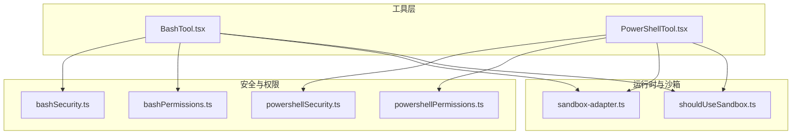
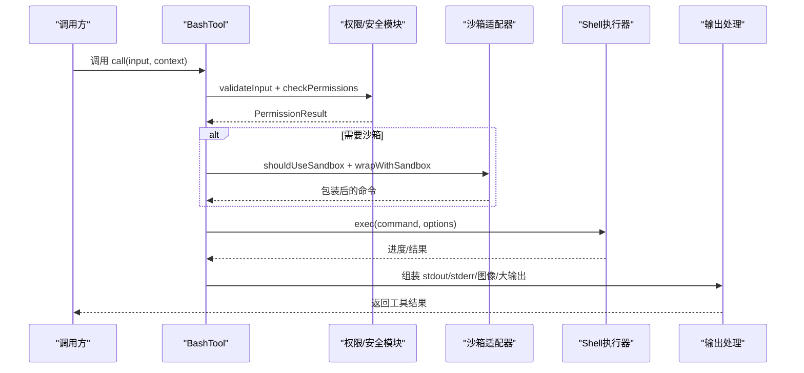
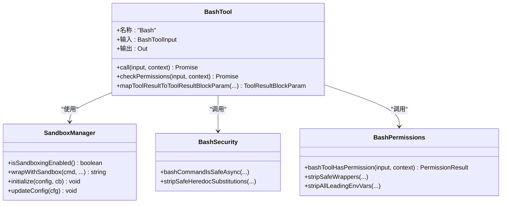
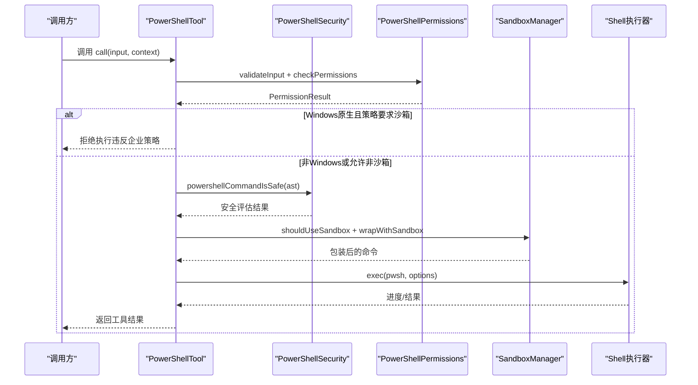
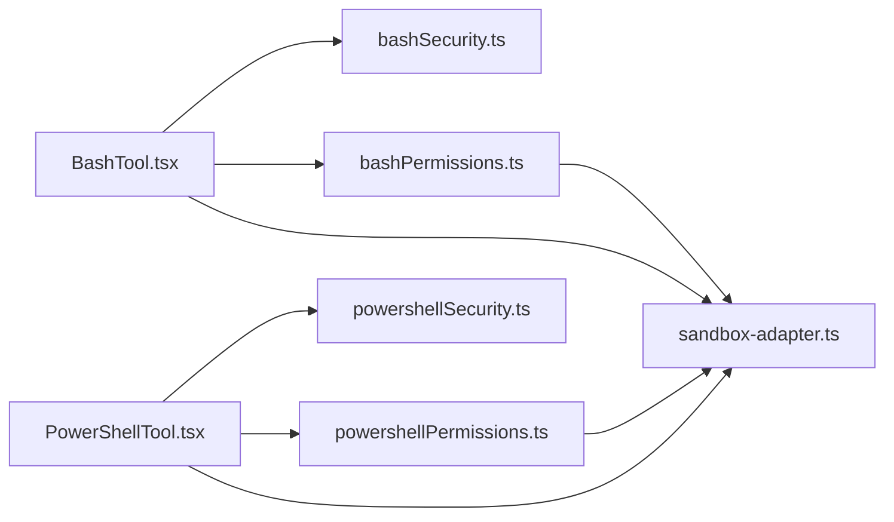

# 系统工具

<cite>
**本文档引用的文件**
- [BashTool.tsx](file://src/tools/BashTool/BashTool.tsx)
- [PowerShellTool.tsx](file://src/tools/PowerShellTool/PowerShellTool.tsx)
- [bashSecurity.ts](file://src/tools/BashTool/bashSecurity.ts)
- [powershellSecurity.ts](file://src/tools/PowerShellTool/powershellSecurity.ts)
- [bashPermissions.ts](file://src/tools/BashTool/bashPermissions.ts)
- [powershellPermissions.ts](file://src/tools/PowerShellTool/powershellPermissions.ts)
- [shouldUseSandbox.ts](file://src/tools/BashTool/shouldUseSandbox.ts)
- [sandbox-adapter.ts](file://src/utils/sandbox/sandbox-adapter.ts)
</cite>

## 目录
1. [简介](#简介)
2. [项目结构](#项目结构)
3. [核心组件](#核心组件)
4. [架构总览](#架构总览)
5. [详细组件分析](#详细组件分析)
6. [依赖关系分析](#依赖关系分析)
7. [性能考虑](#性能考虑)
8. [故障排除指南](#故障排除指南)
9. [结论](#结论)

## 简介
本文件为 free-code 项目的系统工具（BashTool 与 PowerShellTool）提供全面的 API 参考文档。内容涵盖命令执行接口、参数传递与输出处理机制；系统工具的安全策略、沙箱隔离与权限控制；执行上下文、环境变量传递与工作目录管理；配置选项、超时设置与资源限制；命令历史管理、自动补全与错误恢复机制；以及工具性能监控与调试方法。

## 项目结构
系统工具位于 src/tools 目录下，分别实现 BashTool 与 PowerShellTool 两大类 Shell 工具。二者均通过统一的工具框架（Tool.ts）进行封装，并共享大量通用能力：权限检查、安全校验、沙箱适配器、任务调度与输出持久化等。

图表来源
- [BashTool.tsx](file://src/tools/BashTool/BashTool.tsx)
- [PowerShellTool.tsx](file://src/tools/PowerShellTool/PowerShellTool.tsx)
- [bashSecurity.ts](file://src/tools/BashTool/bashSecurity.ts)
- [powershellSecurity.ts](file://src/tools/PowerShellTool/powershellSecurity.ts)
- [bashPermissions.ts](file://src/tools/BashTool/bashPermissions.ts)
- [powershellPermissions.ts](file://src/tools/PowerShellTool/powershellPermissions.ts)
- [shouldUseSandbox.ts](file://src/tools/BashTool/shouldUseSandbox.ts)
- [sandbox-adapter.ts](file://src/utils/sandbox/sandbox-adapter.ts)

章节来源
- [BashTool.tsx](file://src/tools/BashTool/BashTool.tsx)
- [PowerShellTool.tsx](file://src/tools/PowerShellTool/PowerShellTool.tsx)

## 核心组件
- BashTool：面向 Bash 的系统工具，支持命令解析、权限校验、安全检查、沙箱策略、后台任务与输出持久化。
- PowerShellTool：面向 PowerShell 的系统工具，支持 AST 解析、安全检查、权限校验、沙箱策略与后台任务。
- 沙箱适配器（SandboxManager）：统一接入外部 sandbox-runtime，负责网络与文件系统隔离、路径解析与动态配置更新。
- 权限与安全模块：分别针对 Bash 与 PowerShell 提供规则匹配、AST 安全检查、只读约束与路径约束等。

章节来源
- [BashTool.tsx](file://src/tools/BashTool/BashTool.tsx)
- [PowerShellTool.tsx](file://src/tools/PowerShellTool/PowerShellTool.tsx)
- [sandbox-adapter.ts](file://src/utils/sandbox/sandbox-adapter.ts)

## 架构总览
系统工具的整体执行流程包括：输入验证与权限检查、安全策略评估、可选沙箱包装、命令执行与进度回调、输出聚合与持久化、错误处理与恢复、以及性能与调试指标采集。

图表来源
- [BashTool.tsx](file://src/tools/BashTool/BashTool.tsx)
- [PowerShellTool.tsx](file://src/tools/PowerShellTool/PowerShellTool.tsx)
- [sandbox-adapter.ts](file://src/utils/sandbox/sandbox-adapter.ts)

## 详细组件分析

### BashTool 组件分析
- 输入/输出模式
  - 输入 schema 包含 command、timeout、description、run_in_background、dangerouslyDisableSandbox 等字段。
  - 输出 schema 包含 stdout、stderr、interrupted、returnCodeInterpretation、isImage、persistedOutputPath、backgroundTaskId 等。
- 命令执行与进度
  - 使用异步生成器 runShellCommand，支持 onProgress 回调，周期性返回输出片段与统计信息。
  - 支持自动后台化（长耗时命令在助手模式下自动转入后台），并记录任务 ID 与输出路径。
- 安全与权限
  - 采用 Bash 安全检查链（bashSecurity.ts）与权限匹配（bashPermissions.ts），支持前缀/通配符规则、环境变量剥离、包装器剥离、危险模式检测等。
  - 对 sed 预览写入提供“模拟写入”路径，确保预览与实际写入一致。
- 沙箱策略
  - shouldUseSandbox 判断是否启用沙箱，考虑用户排除规则、动态禁用命令、策略允许等。
  - SandboxManager 提供网络/文件系统隔离、路径解析与动态配置更新。
- 输出处理
  - 大输出自动落盘并生成预览；支持图像输出压缩与尺寸限制；支持 Claude Code Hints 协议标记提取与清理。
- 执行上下文
  - 支持工作目录变更隔离（主线程跟踪重置）、环境变量传递（安全白名单）、平台差异处理（Windows 原生不支持沙箱）。

图表来源
- [BashTool.tsx](file://src/tools/BashTool/BashTool.tsx)
- [bashSecurity.ts](file://src/tools/BashTool/bashSecurity.ts)
- [bashPermissions.ts](file://src/tools/BashTool/bashPermissions.ts)
- [sandbox-adapter.ts](file://src/utils/sandbox/sandbox-adapter.ts)

章节来源
- [BashTool.tsx](file://src/tools/BashTool/BashTool.tsx)
- [bashSecurity.ts](file://src/tools/BashTool/bashSecurity.ts)
- [bashPermissions.ts](file://src/tools/BashTool/bashPermissions.ts)
- [shouldUseSandbox.ts](file://src/tools/BashTool/shouldUseSandbox.ts)
- [sandbox-adapter.ts](file://src/utils/sandbox/sandbox-adapter.ts)

### PowerShellTool 组件分析
- 输入/输出模式
  - 输入 schema 包含 command、timeout、description、run_in_background、dangerouslyDisableSandbox。
  - 输出 schema 类似 BashTool，但针对 PowerShell 的 AST 特性优化。
- 命令执行与进度
  - 使用异步生成器 runPowerShellCommand，支持 onProgress 回调与后台任务注册。
  - 在 Windows 原生平台对沙箱策略有特殊限制（不支持沙箱），会拒绝执行以符合企业策略。
- 安全与权限
  - PowerShell 安全检查（powershellSecurity.ts）基于 AST，覆盖动态命令名、脚本块注入、下载器、COM 对象、类型限制等。
  - 权限检查（powershellPermissions.ts）支持大小写无关的别名解析、模块限定命令、UNC 路径阻断等。
- 输出处理
  - 图像输出压缩、大输出持久化、Claude Code Hints 提取与清理、背景任务信息注入。
- 执行上下文
  - 支持工作目录隔离（主线程重置）、PowerShell 路径探测、平台差异处理。

图表来源
- [PowerShellTool.tsx](file://src/tools/PowerShellTool/PowerShellTool.tsx)
- [powershellSecurity.ts](file://src/tools/PowerShellTool/powershellSecurity.ts)
- [powershellPermissions.ts](file://src/tools/PowerShellTool/powershellPermissions.ts)
- [sandbox-adapter.ts](file://src/utils/sandbox/sandbox-adapter.ts)

章节来源
- [PowerShellTool.tsx](file://src/tools/PowerShellTool/PowerShellTool.tsx)
- [powershellSecurity.ts](file://src/tools/PowerShellTool/powershellSecurity.ts)
- [powershellPermissions.ts](file://src/tools/PowerShellTool/powershellPermissions.ts)
- [sandbox-adapter.ts](file://src/utils/sandbox/sandbox-adapter.ts)

### 安全策略与权限控制
- Bash 安全检查
  - 命令替换、heredoc 替换、Zsh 扩展、危险变量、不完整命令、重定向剥离、引号与转义处理等。
  - 支持早期放行（如安全 heredoc 替换）与严格回退（passthrough/ask/allow）。
- PowerShell 安全检查
  - AST 驱动：动态命令名、脚本块注入、下载器、COM 对象、类型限制、成员调用、展开字符串、子表达式、停止解析令牌等。
- 权限匹配
  - Bash：支持 exact/prefix/wildcard 规则，环境变量剥离、包装器剥离、首词/前缀建议、安全环境变量白名单。
  - PowerShell：大小写无关匹配、模块限定命令、UNC 路径阻断、应用级命令分类、安全输出命令过滤。

章节来源
- [bashSecurity.ts](file://src/tools/BashTool/bashSecurity.ts)
- [powershellSecurity.ts](file://src/tools/PowerShellTool/powershellSecurity.ts)
- [bashPermissions.ts](file://src/tools/BashTool/bashPermissions.ts)
- [powershellPermissions.ts](file://src/tools/PowerShellTool/powershellPermissions.ts)

### 沙箱隔离与权限控制
- 沙箱启用条件
  - 平台支持（macOS/Linux/WSL2）、依赖检查、用户设置、平台白名单。
- 配置转换
  - 将权限规则与 sandbox 设置转换为 sandbox-runtime 配置：网络域、文件系统读写/读禁止、ripgrep 命令等。
- 动态更新
  - 监听设置变化，实时刷新沙箱配置；支持工作树主仓库路径识别与裸仓库防护。
- 排除规则
  - 用户自定义排除命令（支持 exact/prefix/wildcard），动态禁用命令（ANT 专用）。

章节来源
- [sandbox-adapter.ts](file://src/utils/sandbox/sandbox-adapter.ts)
- [shouldUseSandbox.ts](file://src/tools/BashTool/shouldUseSandbox.ts)

### 执行上下文、环境变量与工作目录
- 环境变量传递
  - Bash：安全环境变量白名单剥离；包装器剥离；所有前缀剥离（deny 规则）。
  - PowerShell：大小写无关匹配；模块限定命令；UNC 路径阻断。
- 工作目录管理
  - 主线程执行时重置到项目外的 CWD 会追加提示信息；代理执行（agent）拥有独立 CWD。
- 超时与资源限制
  - 默认/最大超时由工具侧提供；执行器侧按毫秒级超时控制；输出截断与大文件持久化。

章节来源
- [BashTool.tsx](file://src/tools/BashTool/BashTool.tsx)
- [PowerShellTool.tsx](file://src/tools/PowerShellTool/PowerShellTool.tsx)
- [bashPermissions.ts](file://src/tools/BashTool/bashPermissions.ts)
- [powershellPermissions.ts](file://src/tools/PowerShellTool/powershellPermissions.ts)

### 配置选项、超时与资源限制
- BashTool 配置
  - run_in_background：后台执行开关（受环境变量与特性开关影响）。
  - dangerouslyDisableSandbox：危险地禁用沙箱（需策略允许）。
  - timeout：毫秒级超时，受默认/最大值限制。
- PowerShellTool 配置
  - 同上，且 Windows 原生平台受企业策略限制。
- 资源限制
  - 输出长度阈值与大文件持久化；图像输出压缩与尺寸限制；终端行截断检测。

章节来源
- [BashTool.tsx](file://src/tools/BashTool/BashTool.tsx)
- [PowerShellTool.tsx](file://src/tools/PowerShellTool/PowerShellTool.tsx)

### 命令历史管理、自动补全与错误恢复
- 历史管理
  - BashTool：支持历史搜索对话框、输入缓冲与快捷键；文件历史跟踪与撤销支持。
- 自动补全
  - 命令行补全与类型提示；工具使用摘要与活动描述。
- 错误恢复
  - 中断信号区分（用户中断 vs 超时/进程终止）；错误消息去重与解释；预生成失败场景优雅降级。

章节来源
- [BashTool.tsx](file://src/tools/BashTool/BashTool.tsx)
- [PowerShellTool.tsx](file://src/tools/PowerShellTool/PowerShellTool.tsx)

### 性能监控与调试
- 性能指标
  - 命令执行事件日志（退出码、输出长度、是否中断）；代码索引工具使用计数；输出截断检测。
- 调试能力
  - 沙箱初始化与配置更新日志；依赖检查与不可用原因提示；Linux/WSL 全局通配符警告。
- 进度回调
  - 实时输出统计（字节数、行数、耗时）；后台任务状态通知。

章节来源
- [BashTool.tsx](file://src/tools/BashTool/BashTool.tsx)
- [PowerShellTool.tsx](file://src/tools/PowerShellTool/PowerShellTool.tsx)
- [sandbox-adapter.ts](file://src/utils/sandbox/sandbox-adapter.ts)

## 依赖关系分析
BashTool 与 PowerShellTool 共享大量底层能力，形成清晰的分层：

图表来源
- [BashTool.tsx](file://src/tools/BashTool/BashTool.tsx)
- [PowerShellTool.tsx](file://src/tools/PowerShellTool/PowerShellTool.tsx)
- [bashSecurity.ts](file://src/tools/BashTool/bashSecurity.ts)
- [powershellSecurity.ts](file://src/tools/PowerShellTool/powershellSecurity.ts)
- [bashPermissions.ts](file://src/tools/BashTool/bashPermissions.ts)
- [powershellPermissions.ts](file://src/tools/PowerShellTool/powershellPermissions.ts)
- [sandbox-adapter.ts](file://src/utils/sandbox/sandbox-adapter.ts)

章节来源
- [BashTool.tsx](file://src/tools/BashTool/BashTool.tsx)
- [PowerShellTool.tsx](file://src/tools/PowerShellTool/PowerShellTool.tsx)

## 性能考虑
- 异步生成器与进度回调避免阻塞 UI，支持长输出流式展示。
- 大输出自动落盘与预览，避免内存峰值；图像输出压缩减少传输与渲染开销。
- 沙箱配置动态更新与缓存失效策略，降低重复计算成本。
- BashTool 对复杂复合命令的子命令数量与建议规则数量设限，防止分类器过载。

## 故障排除指南
- 沙箱不可用
  - 检查平台支持、依赖缺失与策略限制；查看不可用原因提示。
- Windows 原生拒绝执行
  - 企业策略要求沙箱但原生不支持，需调整策略或使用支持平台。
- 权限被阻断
  - 查看 deny/ask 规则匹配与建议；确认环境变量与包装器剥离是否影响匹配。
- 输出异常
  - 检查输出截断、图像解析失败与大文件持久化；确认预览与真实大小一致性。
- 超时与中断
  - 区分用户中断与系统中断；调整超时或改为后台执行。

章节来源
- [sandbox-adapter.ts](file://src/utils/sandbox/sandbox-adapter.ts)
- [PowerShellTool.tsx](file://src/tools/PowerShellTool/PowerShellTool.tsx)
- [BashTool.tsx](file://src/tools/BashTool/BashTool.tsx)

## 结论
BashTool 与 PowerShellTool 在统一的工具框架下实现了跨平台的命令执行能力，结合严格的权限与安全策略、灵活的沙箱隔离与动态配置、完善的输出处理与错误恢复机制，为系统工具提供了高安全性、高可用性的执行环境。通过合理的配置与调试手段，用户可在保证安全的前提下高效完成各类系统操作。