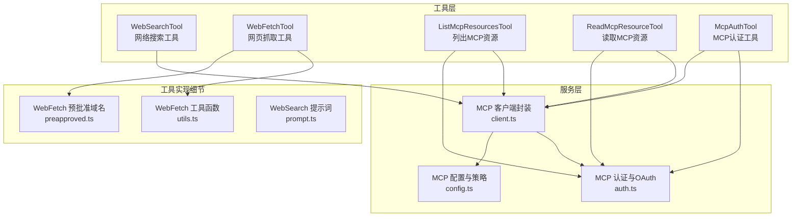
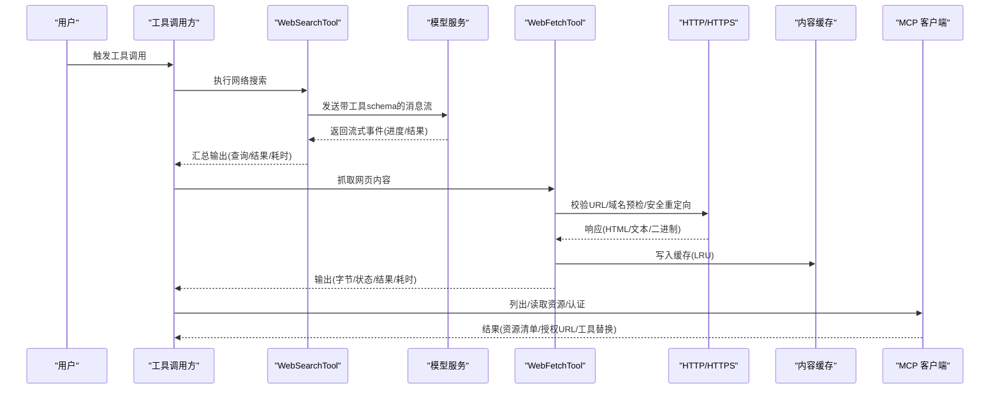
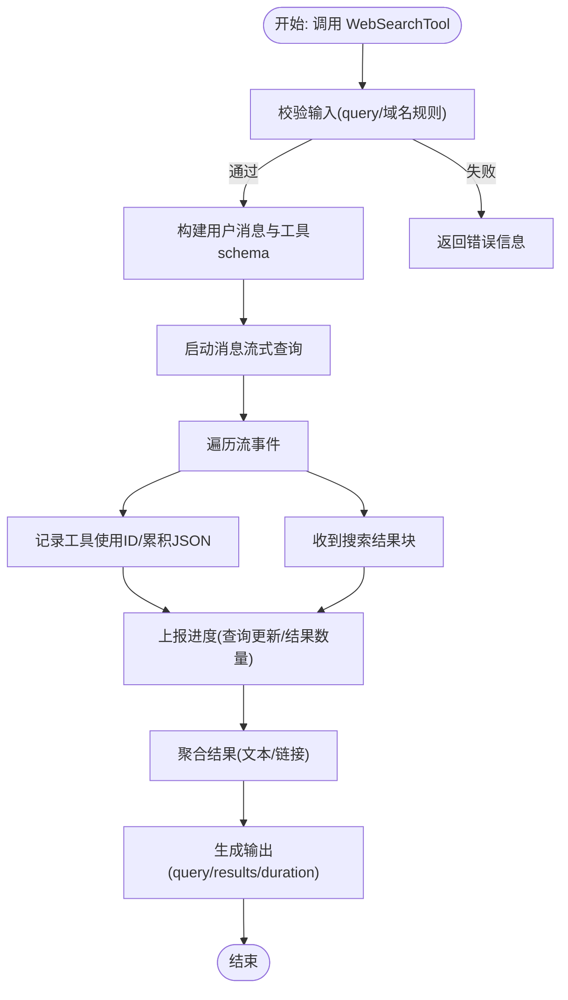
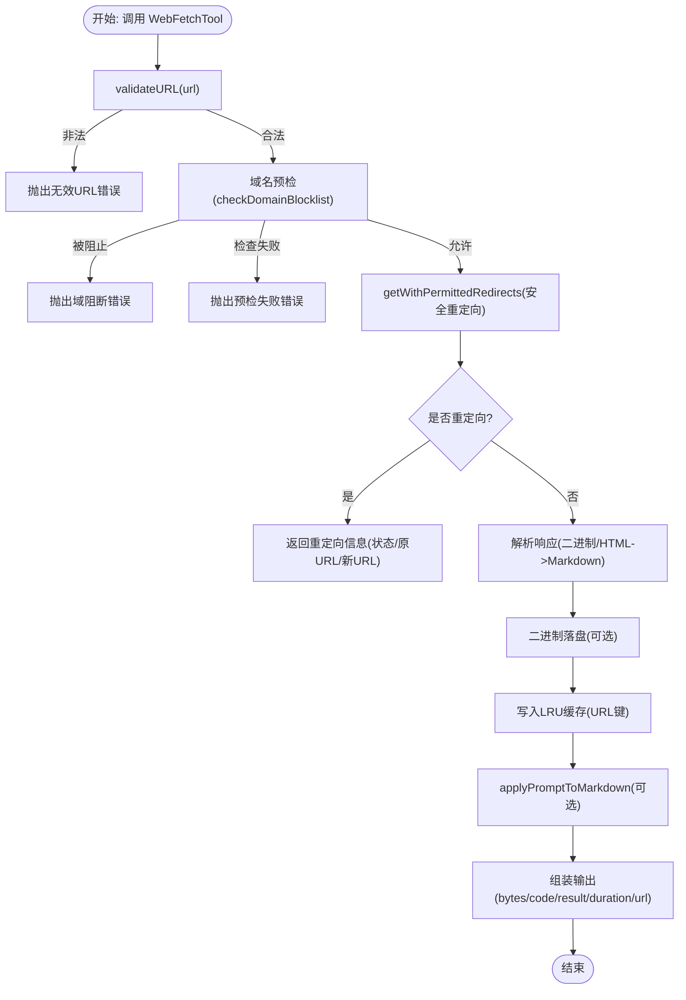
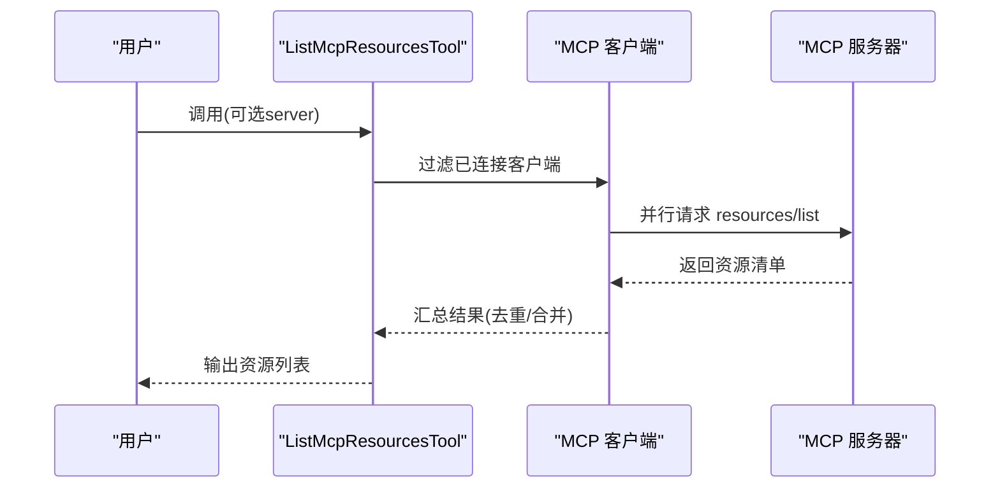
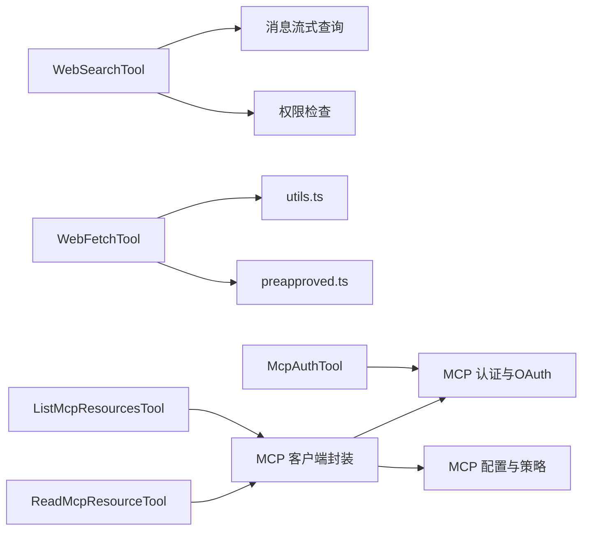

# 网络工具

<cite>
**本文引用的文件**   
- [WebSearchTool.ts](file://src/tools/WebSearchTool/WebSearchTool.ts)
- [prompt.ts](file://src/tools/WebSearchTool/prompt.ts)
- [WebFetchTool.ts](file://src/tools/WebFetchTool/WebFetchTool.ts)
- [utils.ts](file://src/tools/WebFetchTool/utils.ts)
- [preapproved.ts](file://src/tools/WebFetchTool/preapproved.ts)
- [ListMcpResourcesTool.ts](file://src/tools/ListMcpResourcesTool/ListMcpResourcesTool.ts)
- [ReadMcpResourceTool.ts](file://src/tools/ReadMcpResourceTool/ReadMcpResourceTool.ts)
- [McpAuthTool.ts](file://src/tools/McpAuthTool/McpAuthTool.ts)
- [client.ts](file://src/services/mcp/client.ts)
- [auth.ts](file://src/services/mcp/auth.ts)
- [config.ts](file://src/services/mcp/config.ts)
</cite>

## 目录
1. [简介](#简介)
2. [项目结构](#项目结构)
3. [核心组件](#核心组件)
4. [架构总览](#架构总览)
5. [详细组件分析](#详细组件分析)
6. [依赖关系分析](#依赖关系分析)
7. [性能考量](#性能考量)
8. [故障排查指南](#故障排查指南)
9. [结论](#结论)
10. [附录](#附录)

## 简介
本文件为 free-code 项目的网络工具提供全面的 API 参考与技术说明，重点覆盖以下能力：
- WebSearchTool：面向“网络搜索”的工具，支持查询参数校验、域名白名单/黑名单、流式进度回调、结果解析与输出格式化。
- WebFetchTool：面向“网页抓取与内容抽取”的工具，支持 URL 校验、预检域名检查、重定向安全策略、内容缓存、二进制内容落盘、权限与预批准域名豁免、提示词驱动的内容抽取。
- MCP 资源管理工具：包括列出资源、读取资源、认证工具等，涵盖资源发现、认证与访问控制、连接与传输层封装、代理与超时策略。

同时，文档说明了网络请求的超时设置、重试机制、错误处理、内容缓存策略、CDN 支持与代理配置、网络安全与隐私保护措施。

## 项目结构
网络工具相关代码主要位于 src/tools 与 src/services/mcp 下：
- WebSearchTool：消息流式调用、工具 schema 注入、进度回调、结果聚合与输出。
- WebFetchTool：URL 校验、域名预检、重定向安全、HTTP 请求与内容解析、缓存与二进制落盘、权限与预批准域名豁免。
- MCP 工具链：列出资源、读取资源、认证工具；服务端封装：连接、传输、超时、代理、鉴权与会话管理。

**图表来源**
- [WebSearchTool.ts:152-436](file://src/tools/WebSearchTool/WebSearchTool.ts#L152-L436)
- [WebFetchTool.ts:66-308](file://src/tools/WebFetchTool/WebFetchTool.ts#L66-L308)
- [utils.ts:1-531](file://src/tools/WebFetchTool/utils.ts#L1-L531)
- [preapproved.ts:1-167](file://src/tools/WebFetchTool/preapproved.ts#L1-L167)
- [ListMcpResourcesTool.ts:40-124](file://src/tools/ListMcpResourcesTool/ListMcpResourcesTool.ts#L40-L124)
- [ReadMcpResourceTool.ts:47-101](file://src/tools/ReadMcpResourceTool/ReadMcpResourceTool.ts#L47-L101)
- [McpAuthTool.ts:49-216](file://src/tools/McpAuthTool/McpAuthTool.ts#L49-L216)
- [client.ts:1-800](file://src/services/mcp/client.ts#L1-L800)
- [auth.ts:1-800](file://src/services/mcp/auth.ts#L1-L800)
- [config.ts:657-679](file://src/services/mcp/config.ts#L657-L679)

**章节来源**
- [WebSearchTool.ts:1-436](file://src/tools/WebSearchTool/WebSearchTool.ts#L1-L436)
- [WebFetchTool.ts:1-319](file://src/tools/WebFetchTool/WebFetchTool.ts#L1-L319)
- [utils.ts:1-531](file://src/tools/WebFetchTool/utils.ts#L1-L531)
- [preapproved.ts:1-167](file://src/tools/WebFetchTool/preapproved.ts#L1-L167)
- [ListMcpResourcesTool.ts:1-124](file://src/tools/ListMcpResourcesTool/ListMcpResourcesTool.ts#L1-L124)
- [ReadMcpResourceTool.ts:1-101](file://src/tools/ReadMcpResourceTool/ReadMcpResourceTool.ts#L1-L101)
- [McpAuthTool.ts:1-216](file://src/tools/McpAuthTool/McpAuthTool.ts#L1-L216)
- [client.ts:1-800](file://src/services/mcp/client.ts#L1-L800)
- [auth.ts:1-800](file://src/services/mcp/auth.ts#L1-L800)
- [config.ts:657-679](file://src/services/mcp/config.ts#L657-L679)

## 核心组件
- WebSearchTool
  - 输入：查询字符串、允许域名列表、禁止域名列表（二者不可同时指定）
  - 输出：查询、结果数组（文本摘要或搜索命中）、耗时
  - 特性：并发安全、只读、权限检查、提示词描述、流式进度回调、结果解析与格式化
- WebFetchTool
  - 输入：URL、提示词
  - 输出：字节数、HTTP状态码与文本、处理后结果、耗时、原始 URL
  - 特性：URL 校验、域名预检、重定向安全检查、LRU 缓存、二进制内容落盘、权限与预批准域名豁免、提示词驱动的内容抽取
- MCP 资源管理工具
  - 列出资源：按服务器筛选，LRU 缓存、健康重连、失败降级
  - 读取资源：基于已连接客户端发起资源读取请求
  - 认证工具：触发 OAuth 流程，返回授权 URL 或静默完成，自动替换伪工具为真实工具

**章节来源**
- [WebSearchTool.ts:25-66](file://src/tools/WebSearchTool/WebSearchTool.ts#L25-L66)
- [WebSearchTool.ts:152-436](file://src/tools/WebSearchTool/WebSearchTool.ts#L152-L436)
- [WebFetchTool.ts:24-46](file://src/tools/WebFetchTool/WebFetchTool.ts#L24-L46)
- [WebFetchTool.ts:66-308](file://src/tools/WebFetchTool/WebFetchTool.ts#L66-L308)
- [ListMcpResourcesTool.ts:15-36](file://src/tools/ListMcpResourcesTool/ListMcpResourcesTool.ts#L15-L36)
- [ListMcpResourcesTool.ts:40-124](file://src/tools/ListMcpResourcesTool/ListMcpResourcesTool.ts#L40-L124)
- [ReadMcpResourceTool.ts:47-101](file://src/tools/ReadMcpResourceTool/ReadMcpResourceTool.ts#L47-L101)
- [McpAuthTool.ts:49-216](file://src/tools/McpAuthTool/McpAuthTool.ts#L49-L216)

## 架构总览
网络工具在系统中的交互路径如下：
- WebSearchTool：通过消息流式调用模型，注入工具 schema，解析流事件，聚合搜索结果并输出。
- WebFetchTool：先进行 URL 校验与域名预检，再发起 HTTP 请求，解析响应为 Markdown，必要时调用二级模型进行内容抽取，并支持缓存与二进制落盘。
- MCP 工具链：由 MCP 客户端封装负责连接、传输、超时与代理，认证模块负责 OAuth 发现、令牌刷新与撤销，配置模块负责企业策略与白名单/黑名单检查。

**图表来源**
- [WebSearchTool.ts:254-400](file://src/tools/WebSearchTool/WebSearchTool.ts#L254-L400)
- [WebFetchTool.ts:208-299](file://src/tools/WebFetchTool/WebFetchTool.ts#L208-L299)
- [utils.ts:347-482](file://src/tools/WebFetchTool/utils.ts#L347-L482)
- [client.ts:595-800](file://src/services/mcp/client.ts#L595-L800)
- [auth.ts:198-237](file://src/services/mcp/auth.ts#L198-L237)

## 详细组件分析

### WebSearchTool 组件分析
- 接口与输入输出
  - 输入：query（必填，最小长度 2）、allowed_domains（可选）、blocked_domains（可选，二者不可同时出现）
  - 输出：query、results（字符串摘要或搜索命中列表）、durationSeconds
- 权限与可用性
  - 并发安全、只读
  - 权限检查返回“允许/询问/拒绝”建议
  - 可用性根据提供商与模型版本动态启用
- 进度与流式处理
  - 通过流事件追踪工具使用 ID、累积输入 JSON、提取查询并上报进度
  - 搜索结果到达时上报结果数量与查询
- 结果解析与格式化
  - 解析 server_tool_use、web_search_tool_result、text 块，生成统一输出结构
  - 将结果映射为工具结果块参数，包含“必须包含来源链接”的提醒

**图表来源**
- [WebSearchTool.ts:235-388](file://src/tools/WebSearchTool/WebSearchTool.ts#L235-L388)
- [WebSearchTool.ts:86-150](file://src/tools/WebSearchTool/WebSearchTool.ts#L86-L150)
- [WebSearchTool.ts:401-434](file://src/tools/WebSearchTool/WebSearchTool.ts#L401-L434)

**章节来源**
- [WebSearchTool.ts:25-66](file://src/tools/WebSearchTool/WebSearchTool.ts#L25-L66)
- [WebSearchTool.ts:152-436](file://src/tools/WebSearchTool/WebSearchTool.ts#L152-L436)
- [prompt.ts:1-34](file://src/tools/WebSearchTool/prompt.ts#L1-L34)

### WebFetchTool 组件分析
- 接口与输入输出
  - 输入：url（必须为合法 URL）、prompt（对内容执行的抽取任务）
  - 输出：bytes、code、codeText、result、durationMs、url
- URL 验证与域名预检
  - 最大 URL 长度限制、协议校验、用户名/密码禁止、主机名可解析性
  - 域名预检：调用 api.anthropic.com 获取是否允许抓取，支持跳过预检（企业策略）
- 重定向安全策略
  - 仅允许协议、端口一致，且主机名变化限定为添加/移除 www 或完全相同
  - 最大重定向次数限制，防止循环重定向
- 内容获取与缓存
  - 升级 http 至 https
  - LRU 缓存：15 分钟 TTL、50MB 总大小限制
  - HTML 自动转 Markdown，非 HTML 直接使用 UTF-8 文本
  - 二进制内容保存到磁盘并记录路径与大小
- 权限与预批准域名
  - 预批准域名集合（代码类文档站点）豁免权限检查
  - 权限规则匹配：deny/ask/allow，支持建议快速添加规则
- 提示词驱动的内容抽取
  - 对长内容截断至最大长度，调用二级模型生成摘要或抽取结果
  - 中断信号传播，避免 UI 呈现空结果

**图表来源**
- [utils.ts:139-203](file://src/tools/WebFetchTool/utils.ts#L139-L203)
- [utils.ts:262-329](file://src/tools/WebFetchTool/utils.ts#L262-L329)
- [utils.ts:347-482](file://src/tools/WebFetchTool/utils.ts#L347-L482)
- [WebFetchTool.ts:191-204](file://src/tools/WebFetchTool/WebFetchTool.ts#L191-L204)
- [WebFetchTool.ts:208-299](file://src/tools/WebFetchTool/WebFetchTool.ts#L208-L299)

**章节来源**
- [WebFetchTool.ts:24-46](file://src/tools/WebFetchTool/WebFetchTool.ts#L24-L46)
- [WebFetchTool.ts:66-308](file://src/tools/WebFetchTool/WebFetchTool.ts#L66-L308)
- [utils.ts:50-83](file://src/tools/WebFetchTool/utils.ts#L50-L83)
- [utils.ts:139-203](file://src/tools/WebFetchTool/utils.ts#L139-L203)
- [utils.ts:262-329](file://src/tools/WebFetchTool/utils.ts#L262-L329)
- [utils.ts:484-531](file://src/tools/WebFetchTool/utils.ts#L484-L531)
- [preapproved.ts:14-167](file://src/tools/WebFetchTool/preapproved.ts#L14-L167)

### MCP 资源管理工具分析
- 列出资源（ListMcpResourcesTool）
  - 输入：server（可选，按服务器筛选）
  - 行为：对每个已连接客户端确保连接并拉取资源，LRU 缓存与失效策略保证新鲜度
  - 失败降级：单个服务器异常不影响整体结果
- 读取资源（ReadMcpResourceTool）
  - 输入：server、uri
  - 行为：查找对应客户端，校验连接与能力，发起 resources/read 请求，返回结果
- 认证工具（McpAuthTool）
  - 触发 OAuth 流程，返回授权 URL 或静默完成
  - 后台自动清理认证缓存并重新连接，替换伪工具为真实工具

**图表来源**
- [ListMcpResourcesTool.ts:66-100](file://src/tools/ListMcpResourcesTool/ListMcpResourcesTool.ts#L66-L100)
- [ReadMcpResourceTool.ts:75-101](file://src/tools/ReadMcpResourceTool/ReadMcpResourceTool.ts#L75-L101)
- [McpAuthTool.ts:85-206](file://src/tools/McpAuthTool/McpAuthTool.ts#L85-L206)

**章节来源**
- [ListMcpResourcesTool.ts:15-36](file://src/tools/ListMcpResourcesTool/ListMcpResourcesTool.ts#L15-L36)
- [ListMcpResourcesTool.ts:40-124](file://src/tools/ListMcpResourcesTool/ListMcpResourcesTool.ts#L40-L124)
- [ReadMcpResourceTool.ts:47-101](file://src/tools/ReadMcpResourceTool/ReadMcpResourceTool.ts#L47-L101)
- [McpAuthTool.ts:49-216](file://src/tools/McpAuthTool/McpAuthTool.ts#L49-L216)

## 依赖关系分析
- WebSearchTool
  - 依赖：消息流式查询、工具 schema 注入、权限检查、UI 渲染
- WebFetchTool
  - 依赖：URL 校验、域名预检、HTTP 请求、缓存、二进制落盘、权限规则、提示词抽取
- MCP 工具链
  - 依赖：MCP 客户端封装（连接、传输、超时、代理、鉴权）、认证模块（OAuth 发现/刷新/撤销）、配置模块（企业策略）

**图表来源**
- [WebSearchTool.ts:1-17](file://src/tools/WebSearchTool/WebSearchTool.ts#L1-L17)
- [WebFetchTool.ts:1-16](file://src/tools/WebFetchTool/WebFetchTool.ts#L1-L16)
- [utils.ts:1-17](file://src/tools/WebFetchTool/utils.ts#L1-L17)
- [preapproved.ts:1-13](file://src/tools/WebFetchTool/preapproved.ts#L1-L13)
- [ListMcpResourcesTool.ts:1-13](file://src/tools/ListMcpResourcesTool/ListMcpResourcesTool.ts#L1-L13)
- [ReadMcpResourceTool.ts:1-11](file://src/tools/ReadMcpResourceTool/ReadMcpResourceTool.ts#L1-L11)
- [McpAuthTool.ts:1-11](file://src/tools/McpAuthTool/McpAuthTool.ts#L1-L11)
- [client.ts:1-50](file://src/services/mcp/client.ts#L1-L50)
- [auth.ts:1-50](file://src/services/mcp/auth.ts#L1-L50)
- [config.ts:657-679](file://src/services/mcp/config.ts#L657-L679)

**章节来源**
- [WebSearchTool.ts:1-17](file://src/tools/WebSearchTool/WebSearchTool.ts#L1-L17)
- [WebFetchTool.ts:1-16](file://src/tools/WebFetchTool/WebFetchTool.ts#L1-L16)
- [utils.ts:1-17](file://src/tools/WebFetchTool/utils.ts#L1-L17)
- [preapproved.ts:1-13](file://src/tools/WebFetchTool/preapproved.ts#L1-L13)
- [ListMcpResourcesTool.ts:1-13](file://src/tools/ListMcpResourcesTool/ListMcpResourcesTool.ts#L1-L13)
- [ReadMcpResourceTool.ts:1-11](file://src/tools/ReadMcpResourceTool/ReadMcpResourceTool.ts#L1-L11)
- [McpAuthTool.ts:1-11](file://src/tools/McpAuthTool/McpAuthTool.ts#L1-L11)
- [client.ts:1-50](file://src/services/mcp/client.ts#L1-L50)
- [auth.ts:1-50](file://src/services/mcp/auth.ts#L1-L50)
- [config.ts:657-679](file://src/services/mcp/config.ts#L657-L679)

## 性能考量
- WebSearchTool
  - 使用思考配置开关与小模型选择以优化延迟；并发安全，适合多实例并行
- WebFetchTool
  - LRU 缓存：15 分钟 TTL、50MB 限额，避免重复抓取；最大内容长度限制与截断，减少模型负载
  - HTTP 层面：最大内容长度限制、60 秒主请求超时、10 秒域预检超时、最多 10 次重定向
  - 二进制内容落盘：避免内存峰值，便于后续人工审阅
- MCP
  - 请求超时：默认约 27.8 小时（可通过环境变量覆盖），HTTP/SSE/WS 传输分别封装超时与 Accept 头
  - 连接批大小：本地/远程可配置，降低握手开销
  - 代理与 TLS：支持 HTTP(S)_PROXY、NO_PROXY、WebSocket 代理与 mTLS 选项

**章节来源**
- [WebSearchTool.ts:262-290](file://src/tools/WebSearchTool/WebSearchTool.ts#L262-L290)
- [utils.ts:61-69](file://src/tools/WebFetchTool/utils.ts#L61-L69)
- [utils.ts:114-125](file://src/tools/WebFetchTool/utils.ts#L114-L125)
- [client.ts:224-229](file://src/services/mcp/client.ts#L224-L229)
- [client.ts:456-463](file://src/services/mcp/client.ts#L456-L463)
- [client.ts:552-561](file://src/services/mcp/client.ts#L552-L561)

## 故障排查指南
- WebSearchTool
  - 输入校验失败：检查 query 是否为空、是否同时设置了允许/禁止域名
  - 权限未授予：根据建议添加规则或手动授权
  - 流事件解析：关注 server_tool_use 与 web_search_tool_result 的顺序与完整性
- WebFetchTool
  - 域名阻断：预检返回 blocked 或 check_failed，检查网络策略或跳过预检设置
  - 重定向异常：检测是否超出最大重定向次数或主机变更不被允许
  - 缓存命中：确认 URL 键一致，注意升级后的 https 与重定向后的最终 URL
  - 中断与超时：检查中止信号与 60 秒主请求超时
- MCP
  - 认证失败：检查 OAuth 元数据发现、令牌刷新与撤销流程；必要时清理认证缓存
  - 连接问题：确认代理、TLS、超时与批大小配置；关注 needs-auth 状态与缓存
  - 企业策略：检查 allowlist/denylist 与白名单/黑名单策略

**章节来源**
- [WebSearchTool.ts:235-253](file://src/tools/WebSearchTool/WebSearchTool.ts#L235-L253)
- [WebFetchTool.ts:104-180](file://src/tools/WebFetchTool/WebFetchTool.ts#L104-L180)
- [utils.ts:176-203](file://src/tools/WebFetchTool/utils.ts#L176-L203)
- [utils.ts:262-329](file://src/tools/WebFetchTool/utils.ts#L262-L329)
- [client.ts:340-361](file://src/services/mcp/client.ts#L340-L361)
- [auth.ts:313-318](file://src/services/mcp/auth.ts#L313-L318)
- [config.ts:657-679](file://src/services/mcp/config.ts#L657-L679)

## 结论
本文件系统性梳理了 free-code 的网络工具能力边界与实现要点：
- WebSearchTool 提供了完整的搜索工作流，具备严格的输入校验、流式进度与结果聚合能力
- WebFetchTool 在安全性与性能之间取得平衡，通过 URL 校验、域预检、安全重定向、缓存与二进制落盘等机制保障稳定与高效
- MCP 工具链围绕资源发现、认证与访问控制构建，结合传输层封装与企业策略，形成可扩展的外部系统接入方案

建议在生产环境中：
- 明确 URL 白名单与黑名单策略，结合预批准域名提升合规效率
- 合理配置缓存与超时参数，平衡响应速度与资源占用
- 强化 MCP 认证与代理配置，确保跨网络与跨域访问的安全可控

## 附录
- API 参考要点
  - WebSearchTool
    - 输入字段：query、allowed_domains、blocked_domains
    - 输出字段：query、results、durationSeconds
    - 关键行为：并发安全、只读、权限检查、流式进度、结果解析
  - WebFetchTool
    - 输入字段：url、prompt
    - 输出字段：bytes、code、codeText、result、durationMs、url
    - 关键行为：URL 校验、域预检、安全重定向、LRU 缓存、二进制落盘、权限与预批准豁免、提示词抽取
  - MCP 工具
    - 列出资源：server（可选）
    - 读取资源：server、uri
    - 认证工具：触发 OAuth，返回授权 URL 或静默完成