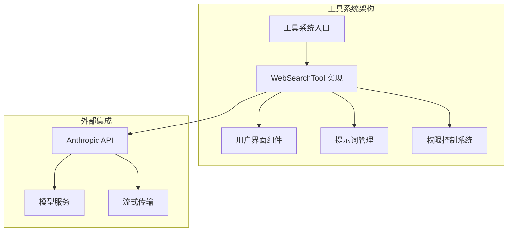
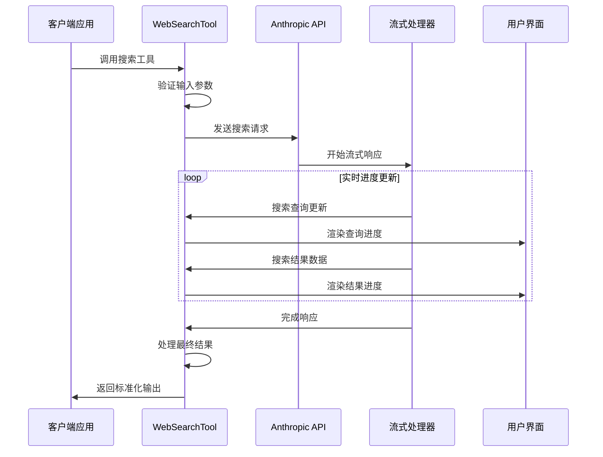
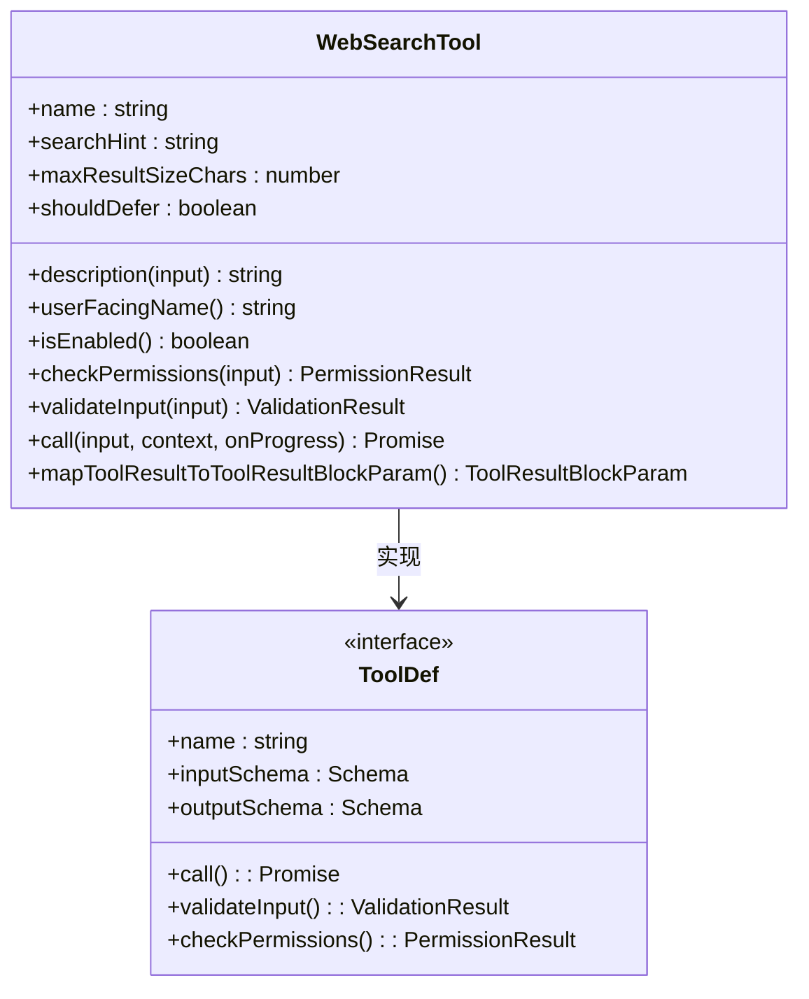
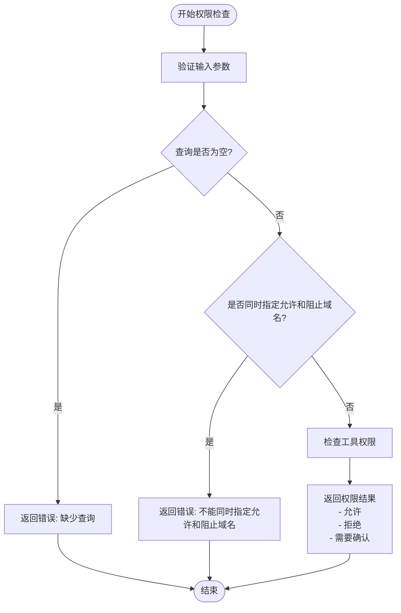
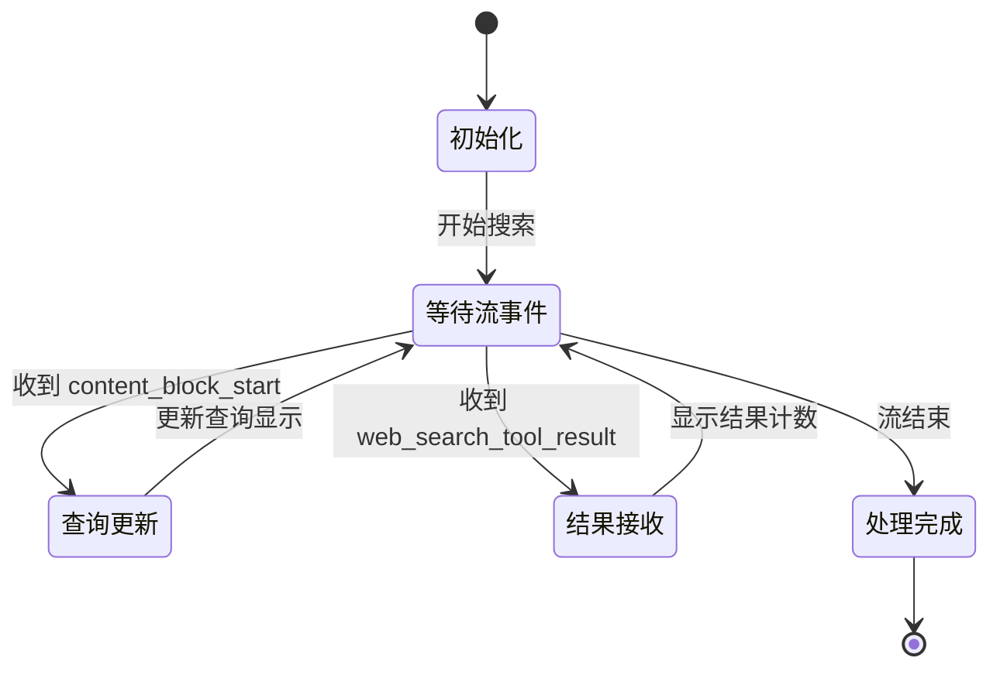
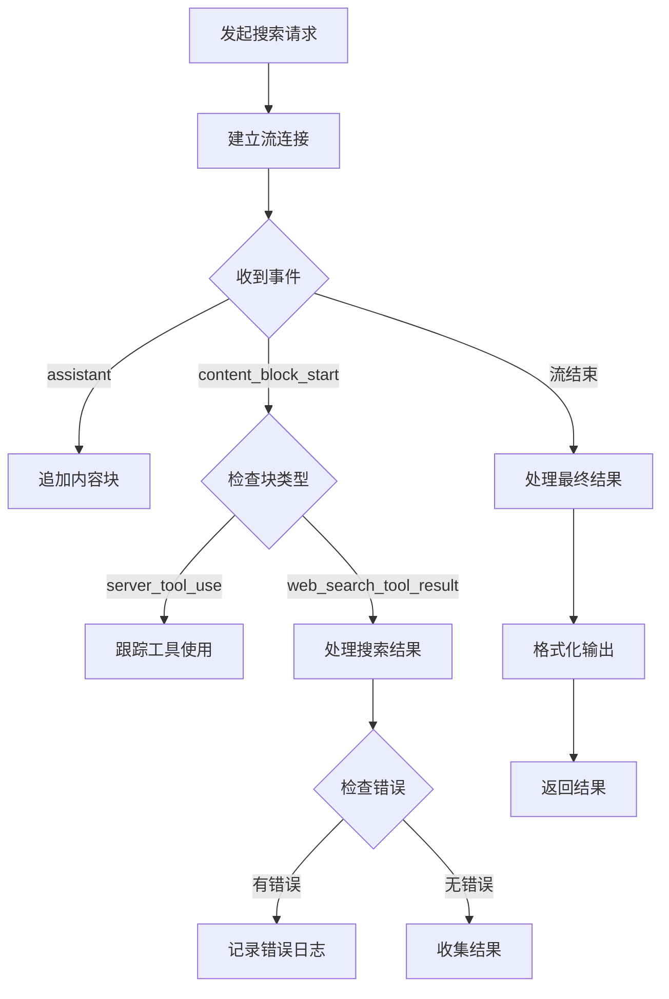
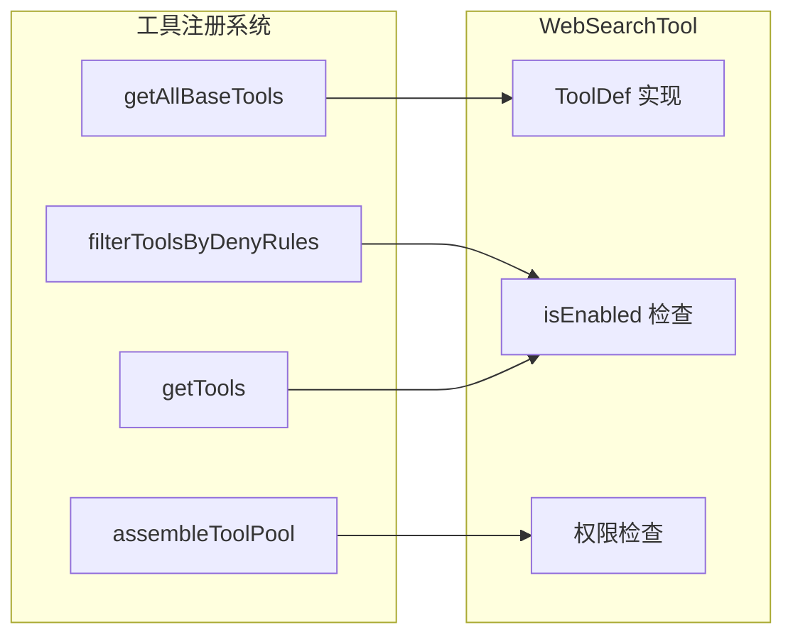

# 网页搜索工具

<cite>
**本文档引用的文件**
- [WebSearchTool.ts](file://src/tools/WebSearchTool/WebSearchTool.ts)
- [UI.tsx](file://src/tools/WebSearchTool/UI.tsx)
- [prompt.ts](file://src/tools/WebSearchTool/prompt.ts)
- [Tool.ts](file://src/Tool.ts)
- [tools.ts](file://src/tools.ts)
- [tools.ts](file://src/constants/tools.ts)
- [PermissionResult.ts](file://src/utils/permissions/PermissionResult.ts)
</cite>

## 目录
1. [简介](#简介)
2. [项目结构](#项目结构)
3. [核心组件](#核心组件)
4. [架构概览](#架构概览)
5. [详细组件分析](#详细组件分析)
6. [依赖关系分析](#依赖关系分析)
7. [性能考虑](#性能考虑)
8. [故障排除指南](#故障排除指南)
9. [结论](#结论)
10. [附录](#附录)

## 简介
网页搜索工具（WebSearchTool）是一个基于 Anthropic Claude API 的智能搜索工具，能够执行实时网络搜索并将结果整合到对话流程中。该工具支持域名校验、权限控制、流式响应处理和详细的搜索进度跟踪。

## 项目结构
WebSearchTool 位于工具系统的核心目录结构中，与其它工具共享相同的架构模式：



**图表来源**
- [WebSearchTool.ts:152-435](file://src/tools/WebSearchTool/WebSearchTool.ts#L152-L435)
- [tools.ts:193-251](file://src/tools.ts#L193-L251)

**章节来源**
- [WebSearchTool.ts:1-436](file://src/tools/WebSearchTool/WebSearchTool.ts#L1-L436)
- [tools.ts:193-251](file://src/tools.ts#L193-L251)

## 核心组件
WebSearchTool 由以下核心组件构成：

### 输入参数定义
工具接受三个主要输入参数：
- **query**: 必需的搜索查询字符串
- **allowed_domains**: 可选的允许访问的域名数组
- **blocked_domains**: 可选的阻止访问的域名数组

### 输出格式结构
工具返回标准化的输出格式，包含：
- **query**: 执行的原始查询
- **results**: 搜索结果数组（可包含文本摘要或搜索结果对象）
- **durationSeconds**: 搜索操作耗时（秒）

### 进度事件类型
工具支持两种主要的进度事件：
- **query_update**: 搜索查询更新事件
- **search_results_received**: 搜索结果接收事件

**章节来源**
- [WebSearchTool.ts:25-66](file://src/tools/WebSearchTool/WebSearchTool.ts#L25-L66)
- [WebSearchTool.ts:86-150](file://src/tools/WebSearchTool/WebSearchTool.ts#L86-L150)
- [UI.tsx:64-77](file://src/tools/WebSearchTool/UI.tsx#L64-L77)

## 架构概览
WebSearchTool 采用模块化架构设计，实现了完整的搜索生命周期管理：



**图表来源**
- [WebSearchTool.ts:254-400](file://src/tools/WebSearchTool/WebSearchTool.ts#L254-L400)
- [WebSearchTool.ts:299-388](file://src/tools/WebSearchTool/WebSearchTool.ts#L299-L388)

## 详细组件分析

### 工具定义与配置
WebSearchTool 通过 `buildTool` 函数构建，配置了完整的工具行为：



**图表来源**
- [WebSearchTool.ts:152-435](file://src/tools/WebSearchTool/WebSearchTool.ts#L152-L435)
- [Tool.ts:1-200](file://src/Tool.ts#L1-L200)

### 权限检查机制
工具实施了严格的权限控制策略：



**图表来源**
- [WebSearchTool.ts:235-253](file://src/tools/WebSearchTool/WebSearchTool.ts#L235-L253)
- [WebSearchTool.ts:209-222](file://src/tools/WebSearchTool/WebSearchTool.ts#L209-L222)

### 域名校验和安全限制
工具实现了多层安全验证：

| 验证类型 | 规则 | 错误信息 |
|---------|------|----------|
| 查询验证 | 必须非空且长度≥2 | "Error: Missing query" |
| 域名冲突 | 不能同时指定 allowed_domains 和 blocked_domains | "Error: Cannot specify both allowed_domains and blocked_domains" |
| 平台兼容性 | 仅在支持的提供商上启用 | 仅在 firstParty、vertex 或 foundry 上可用 |
| 模型兼容性 | 仅支持特定 Claude 模型 | claude-opus-4, claude-sonnet-4, claude-haiku-4 |

### 搜索进度事件处理
工具提供了丰富的进度反馈机制：



**图表来源**
- [WebSearchTool.ts:363-387](file://src/tools/WebSearchTool/WebSearchTool.ts#L363-L387)
- [UI.tsx:55-78](file://src/tools/WebSearchTool/UI.tsx#L55-L78)

### 流式响应处理
工具实现了高效的流式数据处理：

| 处理阶段 | 数据类型 | 处理逻辑 |
|---------|----------|----------|
| 初始响应 | assistant | 提取消息内容块 |
| 工具使用开始 | content_block_start | 记录工具使用ID |
| JSON增量 | input_json_delta | 解析查询参数 |
| 结果开始 | content_block_start | 触发进度事件 |
| 最终处理 | 流结束 | 组装最终结果 |

### 错误处理策略
工具采用多层次的错误处理机制：



**图表来源**
- [WebSearchTool.ts:86-150](file://src/tools/WebSearchTool/WebSearchTool.ts#L86-L150)
- [WebSearchTool.ts:390-400](file://src/tools/WebSearchTool/WebSearchTool.ts#L390-L400)

**章节来源**
- [WebSearchTool.ts:152-435](file://src/tools/WebSearchTool/WebSearchTool.ts#L152-L435)
- [UI.tsx:1-101](file://src/tools/WebSearchTool/UI.tsx#L1-101)

## 依赖关系分析

### 工具注册与发现
WebSearchTool 在工具系统中的注册位置：



**图表来源**
- [tools.ts:193-251](file://src/tools.ts#L193-L251)
- [constants/tools.ts:55-71](file://src/constants/tools.ts#L55-L71)

### 外部依赖关系
WebSearchTool 主要依赖以下外部组件：

| 依赖组件 | 用途 | 版本要求 |
|---------|------|----------|
| @anthropic-ai/sdk | Anthropic API 客户端 | 最新版本 |
| zod | 输入参数验证 | v4 |
| react | 用户界面渲染 | 最新版本 |
| @modelcontextprotocol/sdk | MCP 协议支持 | 可选 |

**章节来源**
- [WebSearchTool.ts:1-17](file://src/tools/WebSearchTool/WebSearchTool.ts#L1-L17)
- [tools.ts:1-103](file://src/tools.ts#L1-L103)

## 性能考虑
WebSearchTool 在性能方面采用了多项优化策略：

### 并发安全性
- 工具标记为并发安全（`isConcurrencySafe: true`）
- 支持多实例同时运行
- 内存使用优化，避免重复数据存储

### 流式处理优化
- 实时进度反馈，提升用户体验
- 增量解析 JSON 数据，减少内存占用
- 异步处理，不阻塞主线程

### 缓存策略
- 使用懒加载模式（lazySchema）优化启动时间
- 功能特性缓存（getFeatureValue_CACHED_MAY_BE_STALE）
- 结果大小限制（maxResultSizeChars: 100,000）

## 故障排除指南

### 常见问题诊断

| 问题类型 | 症状 | 可能原因 | 解决方案 |
|---------|------|----------|----------|
| 权限拒绝 | 工具无法调用 | 未配置工具权限规则 | 添加工具权限规则 |
| 查询无效 | 返回错误: 缺少查询 | 输入参数为空 | 确保提供有效的查询字符串 |
| 域名冲突 | 返回错误: 同时指定允许和阻止域名 | 参数配置冲突 | 仅使用一种域名过滤方式 |
| 平台不支持 | 工具不可用 | 不支持的提供商或模型 | 检查平台兼容性设置 |

### 错误码对照表

| 错误码 | 错误类型 | 描述 |
|-------|----------|------|
| 1 | 输入验证错误 | 缺少查询参数 |
| 2 | 配置冲突错误 | 同时指定允许和阻止域名 |
| 3 | 权限错误 | 工具未获得授权 |
| 4 | 平台不支持 | 当前环境不支持 WebSearchTool |

**章节来源**
- [WebSearchTool.ts:235-253](file://src/tools/WebSearchTool/WebSearchTool.ts#L235-L253)
- [WebSearchTool.ts:115-122](file://src/tools/WebSearchTool/WebSearchTool.ts#L115-L122)

## 结论
WebSearchTool 是一个功能完整、架构清晰的搜索工具实现。它提供了：

- **完整的搜索功能**：支持实时网络搜索和结果展示
- **严格的安全控制**：多层权限验证和域名校验
- **优秀的用户体验**：流式响应和进度反馈
- **良好的扩展性**：模块化设计便于维护和升级

该工具适合在需要实时信息检索的应用场景中使用，并且具有良好的性能表现和错误处理能力。

## 附录

### 使用示例

#### 基本搜索调用
```javascript
// 简单搜索示例
const result = await webSearchTool.call({
  query: "最新的人工智能技术发展"
});

// 带域名过滤的搜索
const result = await webSearchTool.call({
  query: "React 框架最新版本",
  allowed_domains: ["reactjs.org", "github.com"],
  blocked_domains: ["example.com"]
});
```

#### 进度监控示例
```javascript
// 监控搜索进度
await webSearchTool.call(input, context, (progress) => {
  switch (progress.data.type) {
    case 'query_update':
      console.log(`正在搜索: ${progress.data.query}`);
      break;
    case 'search_results_received':
      console.log(`找到 ${progress.data.resultCount} 个结果`);
      break;
  }
});
```

### 最佳实践

#### 参数配置建议
1. **查询优化**：确保查询包含必要的上下文信息
2. **域名过滤**：合理使用 allowed_domains 提高结果质量
3. **错误处理**：始终检查返回的错误信息
4. **进度监控**：实现进度回调以改善用户体验

#### 安全配置
1. **权限管理**：定期审查工具权限设置
2. **输入验证**：对用户输入进行适当的清理和验证
3. **结果审核**：对搜索结果进行内容审核
4. **日志记录**：记录重要的搜索活动以便审计