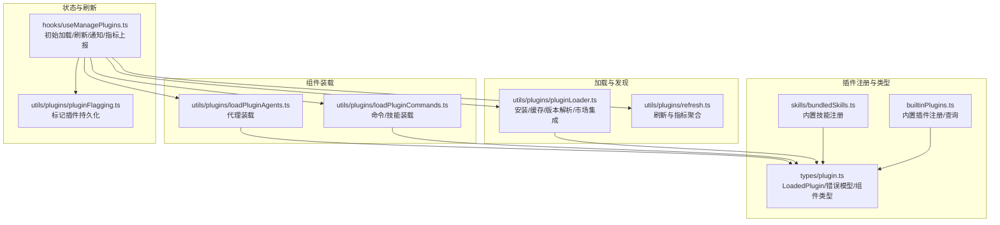
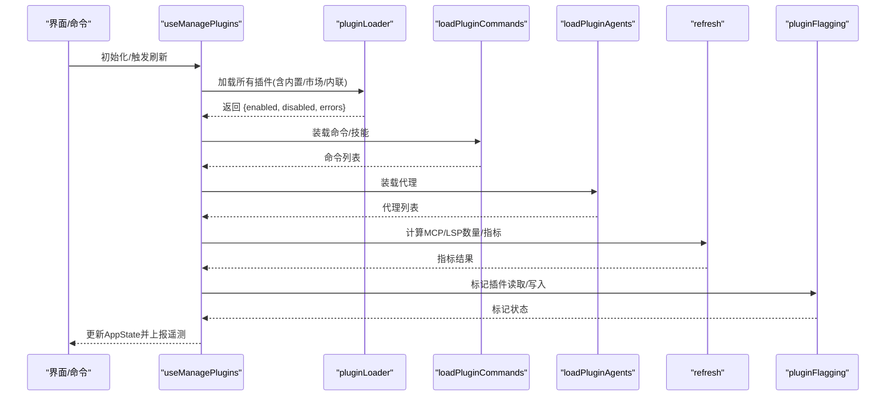
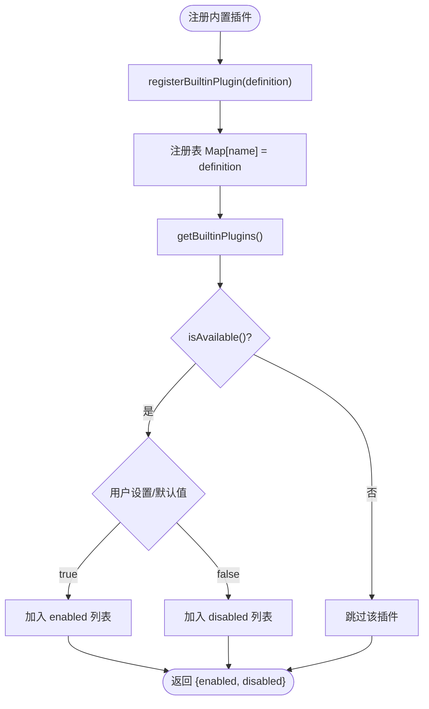
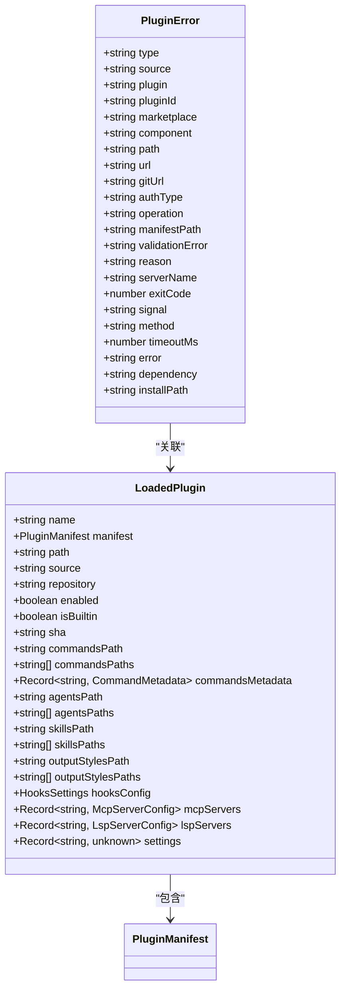
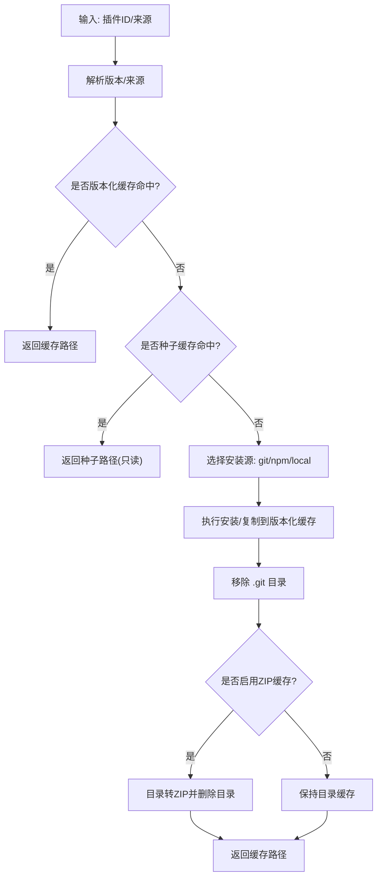
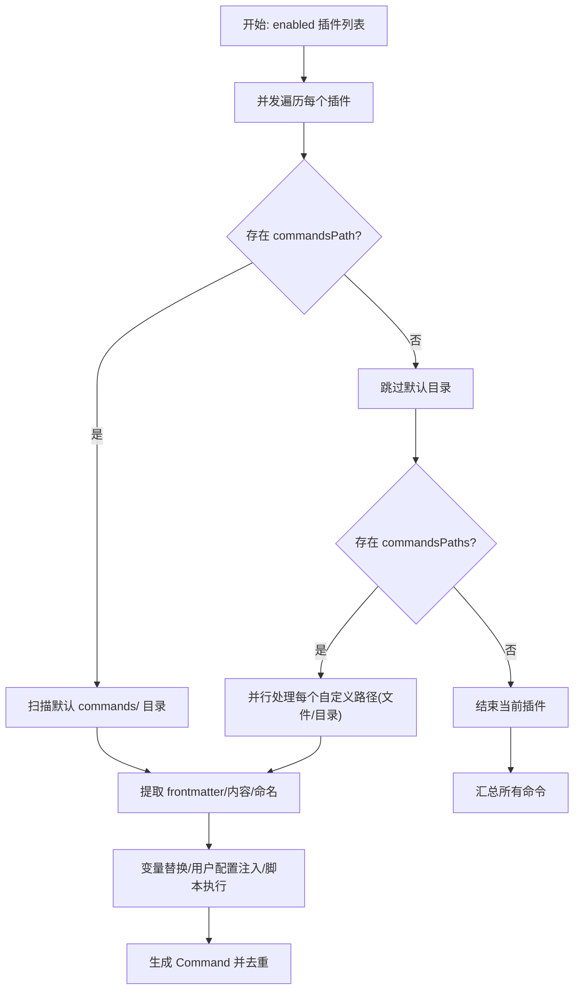
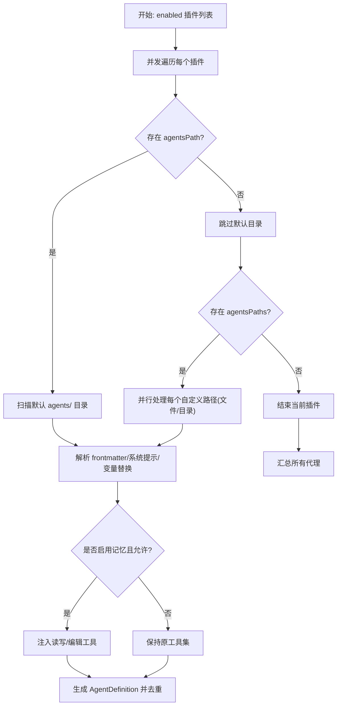
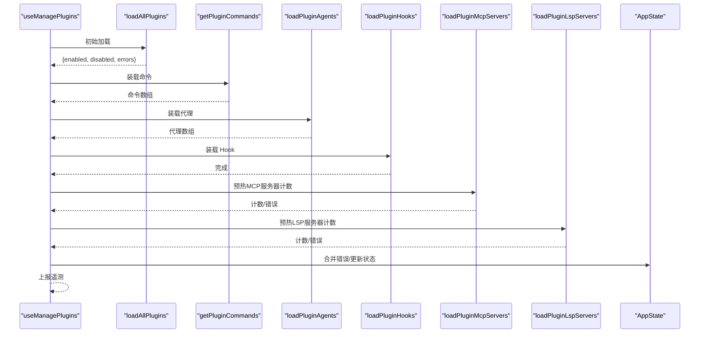
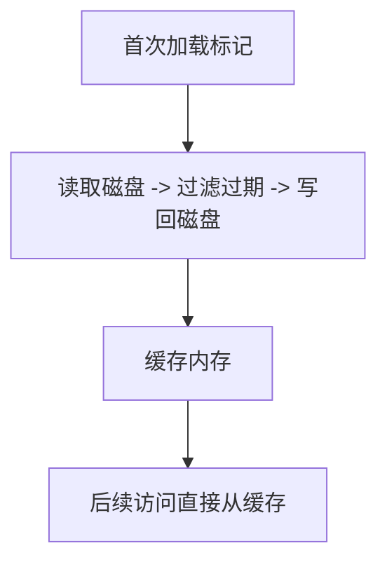
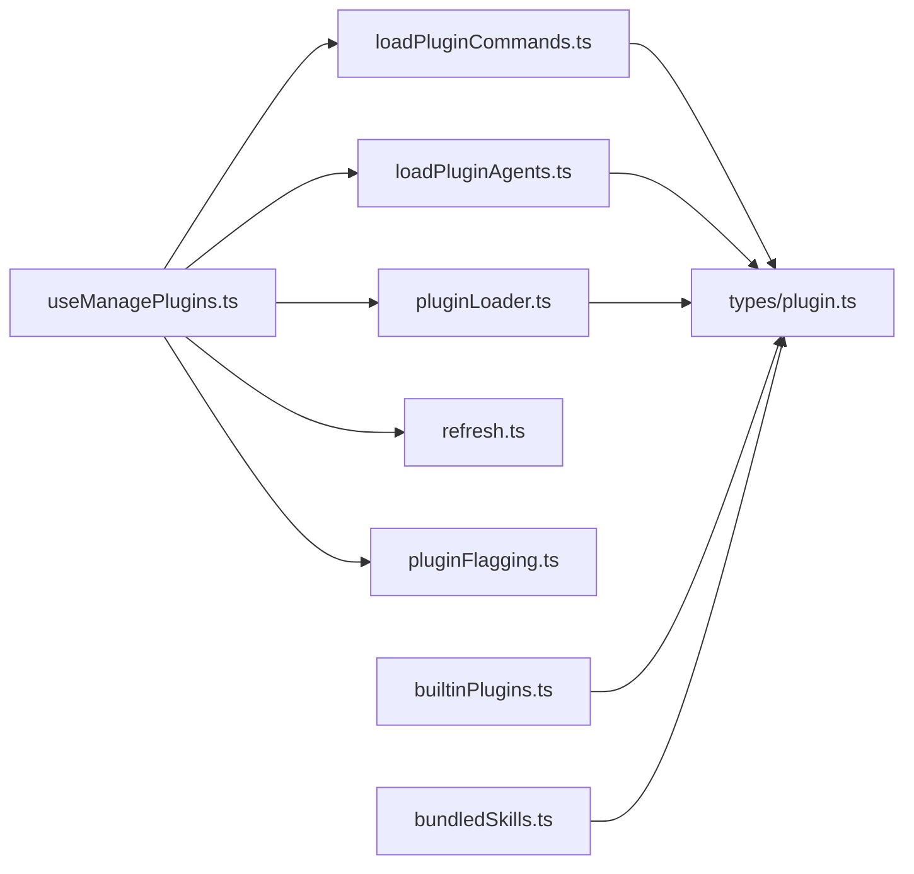

# 插件 API

<cite>
**本文引用的文件**
- [builtinPlugins.ts](file://src/plugins/builtinPlugins.ts)
- [plugin.ts（类型定义）](file://src/types/plugin.ts)
- [useManagePlugins.ts](file://src/hooks/useManagePlugins.ts)
- [bundledSkills.ts](file://src/skills/bundledSkills.ts)
- [pluginLoader.ts](file://src/utils/plugins/pluginLoader.ts)
- [loadPluginCommands.ts](file://src/utils/plugins/loadPluginCommands.ts)
- [loadPluginAgents.ts](file://src/utils/plugins/loadPluginAgents.ts)
- [pluginFlagging.ts](file://src/utils/plugins/pluginFlagging.ts)
- [refresh.ts](file://src/utils/plugins/refresh.ts)
</cite>

## 目录
1. [简介](#简介)
2. [项目结构](#项目结构)
3. [核心组件](#核心组件)
4. [架构总览](#架构总览)
5. [详细组件分析](#详细组件分析)
6. [依赖关系分析](#依赖关系分析)
7. [性能考量](#性能考量)
8. [故障排查指南](#故障排查指南)
9. [结论](#结论)
10. [附录](#附录)

## 简介
本文件为 free-code 插件系统的全面 API 参考与开发指南，覆盖插件开发接口、生命周期管理、插件间通信与扩展机制；说明插件注册流程、依赖管理、版本控制与兼容性检查；记录插件 API 接口、回调函数、事件系统与状态管理；并提供插件开发规范、配置文件约定、打包发布与测试方法，以及安全策略、权限控制、性能监控与调试工具使用建议。

## 项目结构
free-code 的插件系统由“内置插件注册中心”“插件加载器”“组件装载器（命令/代理/Hook/LSP/MCP）”“状态与刷新钩子”等模块组成。插件来源包括内置插件、市场插件、内联插件与种子缓存；插件清单（manifest）支持多路径命令/代理/技能/输出样式等组件声明，并通过统一错误模型进行诊断与提示。

**图表来源**
- [builtinPlugins.ts:1-160](file://src/plugins/builtinPlugins.ts#L1-L160)
- [plugin.ts（类型定义）:1-364](file://src/types/plugin.ts#L1-L364)
- [bundledSkills.ts:1-221](file://src/skills/bundledSkills.ts#L1-L221)
- [pluginLoader.ts:1-800](file://src/utils/plugins/pluginLoader.ts#L1-L800)
- [loadPluginCommands.ts:1-947](file://src/utils/plugins/loadPluginCommands.ts#L1-L947)
- [loadPluginAgents.ts:1-349](file://src/utils/plugins/loadPluginAgents.ts#L1-L349)
- [useManagePlugins.ts:1-305](file://src/hooks/useManagePlugins.ts#L1-L305)
- [pluginFlagging.ts:86-144](file://src/utils/plugins/pluginFlagging.ts#L86-L144)
- [refresh.ts:94-121](file://src/utils/plugins/refresh.ts#L94-L121)

**章节来源**
- [builtinPlugins.ts:1-160](file://src/plugins/builtinPlugins.ts#L1-L160)
- [plugin.ts（类型定义）:1-364](file://src/types/plugin.ts#L1-L364)
- [bundledSkills.ts:1-221](file://src/skills/bundledSkills.ts#L1-L221)
- [pluginLoader.ts:1-800](file://src/utils/plugins/pluginLoader.ts#L1-L800)
- [loadPluginCommands.ts:1-947](file://src/utils/plugins/loadPluginCommands.ts#L1-L947)
- [loadPluginAgents.ts:1-349](file://src/utils/plugins/loadPluginAgents.ts#L1-L349)
- [useManagePlugins.ts:1-305](file://src/hooks/useManagePlugins.ts#L1-L305)
- [pluginFlagging.ts:86-144](file://src/utils/plugins/pluginFlagging.ts#L86-L144)
- [refresh.ts:94-121](file://src/utils/plugins/refresh.ts#L94-L121)

## 核心组件
- 内置插件注册中心：提供注册、可用性过滤、启用状态合并、内置技能转命令等能力。
- 插件类型与错误模型：统一 LoadedPlugin 结构、组件类型枚举、详尽的 PluginError 类型与消息映射。
- 插件加载器：负责从市场或本地源安装/缓存/版本解析、复制到版本化缓存、处理 zip 缓存、种子缓存命中、git/npm 安装、网络与权限错误分类。
- 组件装载器：命令/技能与代理装载，支持 frontmatter 元数据、变量替换、用户配置注入、脚本执行、命名空间与去重。
- 状态与刷新钩子：初始化加载、后台刷新、错误收集与去重、指标统计、通知与遥测上报。
- 标记与合规：插件标记持久化与过期清理，企业策略阻断与卸载。

**章节来源**
- [builtinPlugins.ts:25-128](file://src/plugins/builtinPlugins.ts#L25-L128)
- [plugin.ts（类型定义）:18-70](file://src/types/plugin.ts#L18-L70)
- [plugin.ts（类型定义）:101-289](file://src/types/plugin.ts#L101-L289)
- [pluginLoader.ts:123-287](file://src/utils/plugins/pluginLoader.ts#L123-L287)
- [loadPluginCommands.ts:169-412](file://src/utils/plugins/loadPluginCommands.ts#L169-L412)
- [loadPluginAgents.ts:37-229](file://src/utils/plugins/loadPluginAgents.ts#L37-L229)
- [useManagePlugins.ts:37-304](file://src/hooks/useManagePlugins.ts#L37-L304)
- [pluginFlagging.ts:117-144](file://src/utils/plugins/pluginFlagging.ts#L117-L144)

## 架构总览
下图展示插件系统从“注册/发现”到“装载/运行”的端到端流程，以及错误与指标在各阶段的汇聚点。

**图表来源**
- [useManagePlugins.ts:51-180](file://src/hooks/useManagePlugins.ts#L51-L180)
- [pluginLoader.ts:1-800](file://src/utils/plugins/pluginLoader.ts#L1-L800)
- [loadPluginCommands.ts:414-677](file://src/utils/plugins/loadPluginCommands.ts#L414-L677)
- [loadPluginAgents.ts:231-343](file://src/utils/plugins/loadPluginAgents.ts#L231-L343)
- [refresh.ts:94-121](file://src/utils/plugins/refresh.ts#L94-L121)
- [pluginFlagging.ts:117-144](file://src/utils/plugins/pluginFlagging.ts#L117-L144)

## 详细组件分析

### 内置插件注册中心（builtinPlugins）
- 注册与查询：提供注册函数、ID 判定、按名查询、可用性过滤与默认启用状态合并。
- 内置技能转换：将内置技能定义转换为命令对象，保留用户可调用性、工具限制、上下文与代理等元信息。
- 输出：返回已启用/禁用的内置插件集合，供 UI 与装载器消费。

**图表来源**
- [builtinPlugins.ts:25-102](file://src/plugins/builtinPlugins.ts#L25-L102)

**章节来源**
- [builtinPlugins.ts:25-128](file://src/plugins/builtinPlugins.ts#L25-L128)

### 插件类型与错误模型（types/plugin）
- LoadedPlugin：统一承载插件元数据、路径、来源、仓库标识、启用状态、组件路径与配置、设置等。
- 错误模型：以判别联合类型表达多种错误场景（路径不存在、git 认证失败、网络错误、清单解析/校验失败、市场不可用/加载失败、MCP/LSP 配置无效/启动失败、依赖不满足、缓存缺失等），并提供统一的消息生成函数。

**图表来源**
- [plugin.ts（类型定义）:48-70](file://src/types/plugin.ts#L48-L70)
- [plugin.ts（类型定义）:101-289](file://src/types/plugin.ts#L101-L289)

**章节来源**
- [plugin.ts（类型定义）:18-70](file://src/types/plugin.ts#L18-L70)
- [plugin.ts（类型定义）:101-289](file://src/types/plugin.ts#L101-L289)

### 插件加载器（pluginLoader）
- 发现与来源：优先市场插件（plugin@marketplace），其次会话内联插件（--plugin-dir 或 SDK 插件选项）。
- 缓存与版本：支持版本化缓存路径、种子缓存探测、ZIP 缓存模式、遗留缓存回退。
- 安装与复制：支持 git 子目录浅克隆与稀疏检出、git 仓库克隆、npm 包缓存安装、目录复制与符号链接处理。
- 错误分类：对路径、git、网络、清单、市场、MCP/LSP、依赖、缓存等错误进行细粒度分类与诊断。

**图表来源**
- [pluginLoader.ts:123-287](file://src/utils/plugins/pluginLoader.ts#L123-L287)
- [pluginLoader.ts:365-465](file://src/utils/plugins/pluginLoader.ts#L365-L465)
- [pluginLoader.ts:526-524](file://src/utils/plugins/pluginLoader.ts#L526-L524)
- [pluginLoader.ts:645-657](file://src/utils/plugins/pluginLoader.ts#L645-L657)
- [pluginLoader.ts:718-800](file://src/utils/plugins/pluginLoader.ts#L718-L800)

**章节来源**
- [pluginLoader.ts:10-33](file://src/utils/plugins/pluginLoader.ts#L10-L33)
- [pluginLoader.ts:123-287](file://src/utils/plugins/pluginLoader.ts#L123-L287)
- [pluginLoader.ts:365-465](file://src/utils/plugins/pluginLoader.ts#L365-L465)
- [pluginLoader.ts:526-524](file://src/utils/plugins/pluginLoader.ts#L526-L524)
- [pluginLoader.ts:645-657](file://src/utils/plugins/pluginLoader.ts#L645-L657)
- [pluginLoader.ts:718-800](file://src/utils/plugins/pluginLoader.ts#L718-L800)

### 命令/技能装载器（loadPluginCommands）
- 文件扫描：递归遍历 commands/ 与自定义路径，支持对象映射格式的 metadata 与内联内容。
- 命名与命名空间：基于文件路径与技能目录规则生成命令名，支持命名空间拼接。
- 元数据解析：frontmatter 解析、参数名提取、effort 解析、allowed-tools 解析、模型继承策略。
- 变量与配置：支持 ${CLAUDE_PLUGIN_ROOT}、${CLAUDE_SKILL_DIR}、${CLAUDE_SESSION_ID}、${user_config.X} 等变量替换与敏感键占位。
- 执行与脚本：支持在提示中执行 shell 命令，结合工具权限上下文。
- 去重与缓存：同插件内重复路径检测，memoized 缓存。

**图表来源**
- [loadPluginCommands.ts:169-412](file://src/utils/plugins/loadPluginCommands.ts#L169-L412)
- [loadPluginCommands.ts:414-677](file://src/utils/plugins/loadPluginCommands.ts#L414-L677)
- [loadPluginCommands.ts:687-800](file://src/utils/plugins/loadPluginCommands.ts#L687-L800)

**章节来源**
- [loadPluginCommands.ts:169-412](file://src/utils/plugins/loadPluginCommands.ts#L169-L412)
- [loadPluginCommands.ts:414-677](file://src/utils/plugins/loadPluginCommands.ts#L414-L677)
- [loadPluginCommands.ts:687-800](file://src/utils/plugins/loadPluginCommands.ts#L687-L800)

### 代理装载器（loadPluginAgents）
- 文件扫描：递归遍历 agents/ 与自定义路径，支持命名空间前缀。
- 元数据解析：名称、描述、工具集、技能、颜色、模型、隔离模式、记忆范围、effort、最大轮次、禁止工具等。
- 安全约束：忽略 frontmatter 中可能提升权限的字段（如 permissionMode、hooks、mcpServers），仅在用户显式编辑的 .claude/agents/ 中生效。
- 记忆增强：当自动记忆开启且代理启用记忆时，自动注入文件读写/编辑工具。
- 去重与缓存：同插件内重复路径检测，memoized 缓存。

**图表来源**
- [loadPluginAgents.ts:37-229](file://src/utils/plugins/loadPluginAgents.ts#L37-L229)
- [loadPluginAgents.ts:231-343](file://src/utils/plugins/loadPluginAgents.ts#L231-L343)

**章节来源**
- [loadPluginAgents.ts:37-229](file://src/utils/plugins/loadPluginAgents.ts#L37-L229)
- [loadPluginAgents.ts:231-343](file://src/utils/plugins/loadPluginAgents.ts#L231-L343)

### 状态与刷新钩子（useManagePlugins）
- 初始加载：一次性加载插件、执行下架检测与标记通知、装载命令/代理/Hook、预热 MCP/LSP 数量与缓存、更新 AppState 并上报遥测。
- 后台刷新：监听 needsRefresh，提示用户执行 /reload-plugins；刷新通过 refreshActivePlugins 完成，确保一致性。
- 错误聚合：合并现有 LSP/插件错误，去重后写回 AppState。
- 指标统计：统计启用/禁用、内联/市场、错误数、命令/代理/Hook/MCP/LSP 数量等。

**图表来源**
- [useManagePlugins.ts:51-180](file://src/hooks/useManagePlugins.ts#L51-L180)
- [useManagePlugins.ts:269-285](file://src/hooks/useManagePlugins.ts#L269-L285)

**章节来源**
- [useManagePlugins.ts:37-304](file://src/hooks/useManagePlugins.ts#L37-L304)

### 标记与合规（pluginFlagging）
- 持久化：将标记插件写入磁盘，带有限时过期与原子写入。
- 加载与清理：启动时加载并清理过期条目，提供内存缓存访问。
- 与刷新钩子协作：在初始加载后检查并提示用户查看 /plugins。

**图表来源**
- [pluginFlagging.ts:117-144](file://src/utils/plugins/pluginFlagging.ts#L117-L144)

**章节来源**
- [pluginFlagging.ts:86-144](file://src/utils/plugins/pluginFlagging.ts#L86-L144)

## 依赖关系分析
- 组件耦合：useManagePlugins 作为编排者，依赖 pluginLoader、loadPluginCommands、loadPluginAgents、refresh、pluginFlagging；各装载器依赖 pluginLoader 的缓存与路径解析。
- 外部依赖：git、npm、文件系统操作、网络请求、市场配置与策略检查。
- 循环依赖：未见明显循环；类型定义被多处引用但无循环导入。

**图表来源**
- [useManagePlugins.ts:1-305](file://src/hooks/useManagePlugins.ts#L1-L305)
- [pluginLoader.ts:1-800](file://src/utils/plugins/pluginLoader.ts#L1-L800)
- [loadPluginCommands.ts:1-947](file://src/utils/plugins/loadPluginCommands.ts#L1-L947)
- [loadPluginAgents.ts:1-349](file://src/utils/plugins/loadPluginAgents.ts#L1-L349)
- [plugin.ts（类型定义）:1-364](file://src/types/plugin.ts#L1-L364)
- [builtinPlugins.ts:1-160](file://src/plugins/builtinPlugins.ts#L1-L160)
- [bundledSkills.ts:1-221](file://src/skills/bundledSkills.ts#L1-L221)
- [pluginFlagging.ts:86-144](file://src/utils/plugins/pluginFlagging.ts#L86-L144)
- [refresh.ts:94-121](file://src/utils/plugins/refresh.ts#L94-L121)

**章节来源**
- [useManagePlugins.ts:1-305](file://src/hooks/useManagePlugins.ts#L1-L305)
- [pluginLoader.ts:1-800](file://src/utils/plugins/pluginLoader.ts#L1-L800)
- [loadPluginCommands.ts:1-947](file://src/utils/plugins/loadPluginCommands.ts#L1-L947)
- [loadPluginAgents.ts:1-349](file://src/utils/plugins/loadPluginAgents.ts#L1-L349)
- [plugin.ts（类型定义）:1-364](file://src/types/plugin.ts#L1-L364)
- [builtinPlugins.ts:1-160](file://src/plugins/builtinPlugins.ts#L1-L160)
- [bundledSkills.ts:1-221](file://src/skills/bundledSkills.ts#L1-L221)
- [pluginFlagging.ts:86-144](file://src/utils/plugins/pluginFlagging.ts#L86-L144)
- [refresh.ts:94-121](file://src/utils/plugins/refresh.ts#L94-L121)

## 性能考量
- 缓存与并行：版本化缓存与 ZIP 缓存显著降低重复下载与解压成本；装载器对插件级任务并行化，减少 I/O 等待。
- 浅克隆与稀疏检出：git 子目录安装采用浅克隆与 cone 模式稀疏检出，大幅减少网络与存储开销。
- 去重与缓存：装载器内部使用 Set 去重与 memoized 缓存，避免重复解析与 IO。
- 指标预热：刷新阶段预热 MCP/LSP 计数与缓存，减少连接建立时的冷启动延迟。

[本节为通用指导，无需特定文件来源]

## 故障排查指南
- 错误类型定位：使用统一的 PluginError 类型与消息映射函数快速识别问题类别（路径、git、网络、清单、市场、MCP/LSP、依赖、缓存等）。
- 刷新与重试：当检测到插件变更时，遵循提示执行 /reload-plugins，确保缓存与连接正确重建。
- 标记插件：若出现被下架或违规插件，系统会写入标记并在 UI 提示，按指引处理。
- 日志与遥测：利用调试日志与诊断日志、遥测事件（如 tengu_plugins_loaded）辅助定位问题。

**章节来源**
- [plugin.ts（类型定义）:295-363](file://src/types/plugin.ts#L295-L363)
- [useManagePlugins.ts:289-303](file://src/hooks/useManagePlugins.ts#L289-L303)
- [pluginFlagging.ts:117-144](file://src/utils/plugins/pluginFlagging.ts#L117-L144)

## 结论
free-code 的插件系统通过“内置插件注册中心 + 统一类型与错误模型 + 强大的加载器 + 组件装载器 + 状态与刷新钩子 + 标记与合规”的架构，实现了可扩展、可观测、可维护的插件生态。开发者可依据本文档的接口与流程，安全高效地开发、发布与运维插件。

[本节为总结，无需特定文件来源]

## 附录

### 插件开发指南（实践要点）
- 插件结构：在插件根目录提供可选的清单文件与 commands/、agents/、hooks/ 等目录；技能可通过 SKILL.md 与目录组织。
- 清单与元数据：frontmatter 支持描述、工具限制、模型、effort、命名空间、用户配置注入等；命令/代理支持变量替换与脚本执行。
- 注册与装载：内置插件通过注册中心集中管理；市场插件由加载器解析来源与版本，支持 git/npm/本地源与缓存策略。
- 生命周期：初始加载与后台刷新分离；错误统一收集与去重；指标与遥测贯穿全流程。
- 安全与合规：严格限制插件代理的权限字段；企业策略可阻断市场；标记系统用于下架与违规提示。

[本节为通用指导，无需特定文件来源]