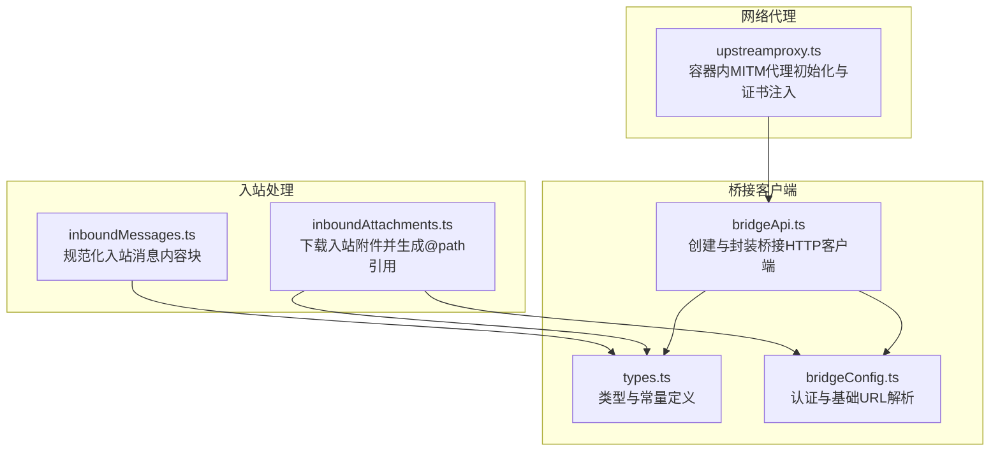
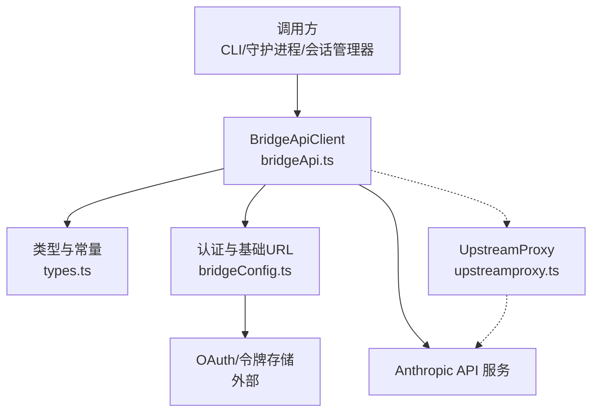
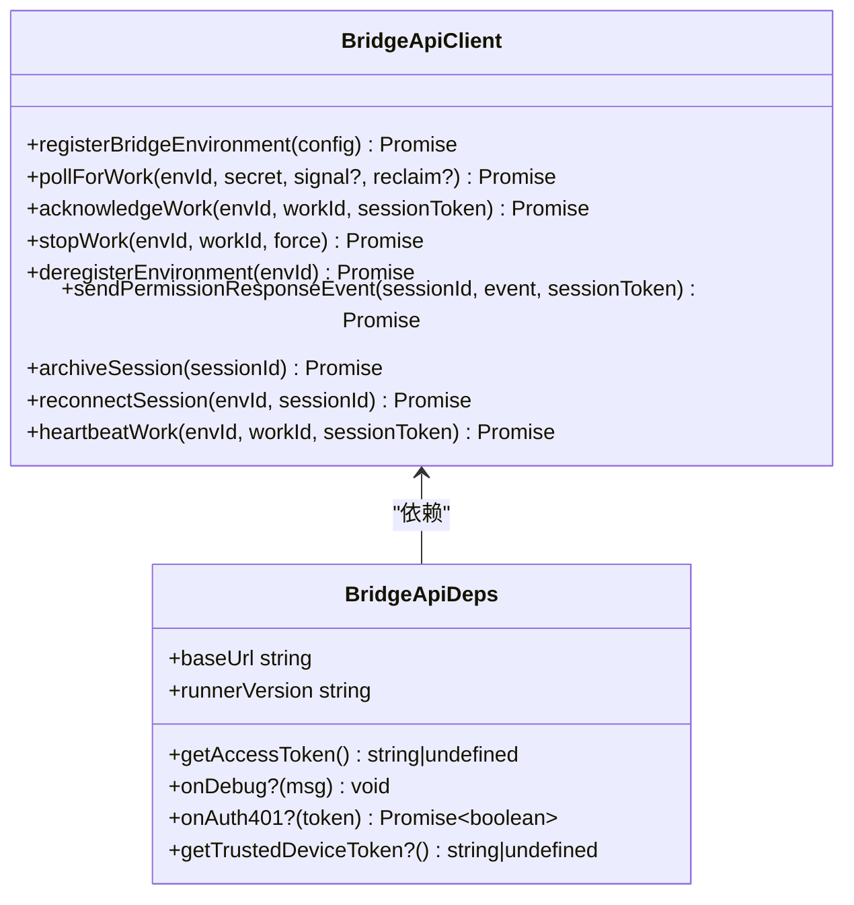
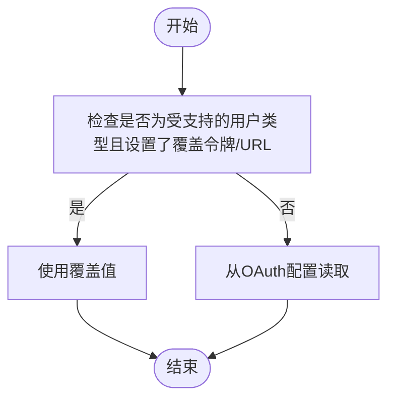
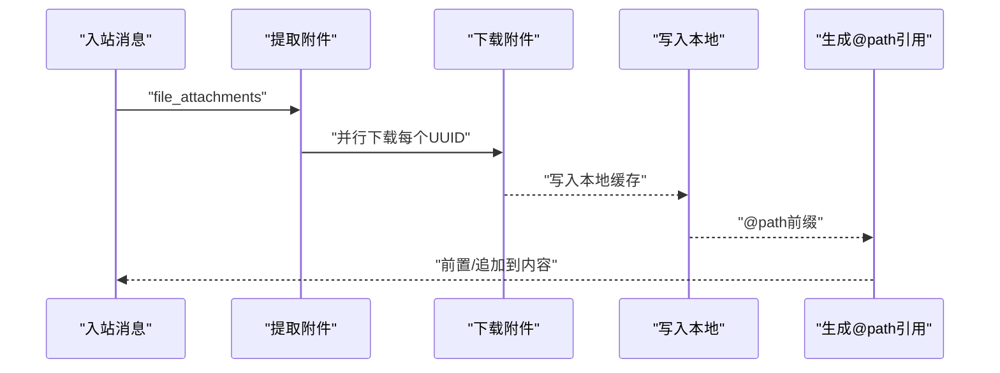
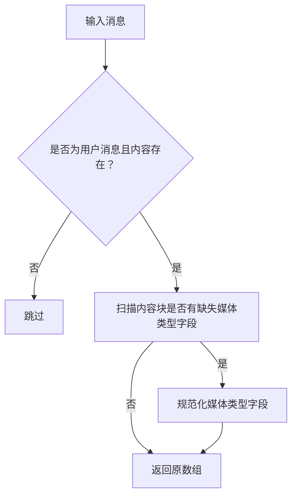
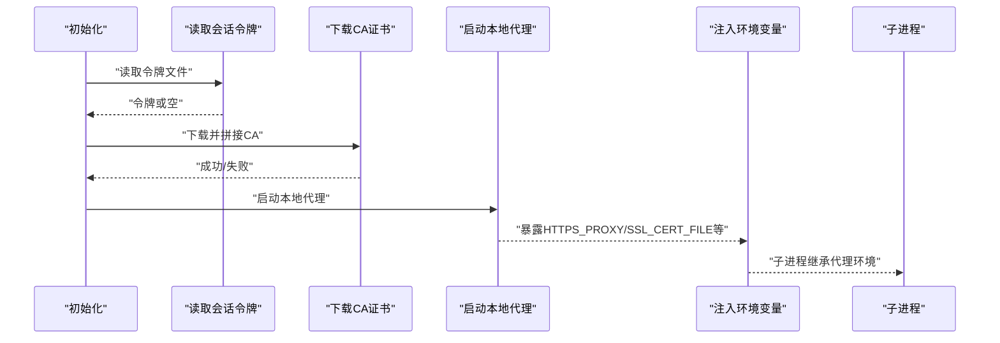
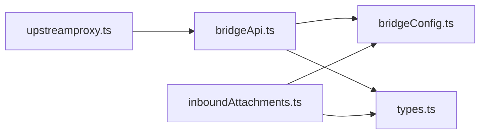

# API 客户端

<cite>
**本文引用的文件**
- [bridgeApi.ts](file://src/bridge/bridgeApi.ts)
- [types.ts](file://src/bridge/types.ts)
- [bridgeConfig.ts](file://src/bridge/bridgeConfig.ts)
- [inboundAttachments.ts](file://src/bridge/inboundAttachments.ts)
- [inboundMessages.ts](file://src/bridge/inboundMessages.ts)
- [upstreamproxy.ts](file://src/upstreamproxy/upstreamproxy.ts)
</cite>

## 目录
1. [简介](#简介)
2. [项目结构](#项目结构)
3. [核心组件](#核心组件)
4. [架构总览](#架构总览)
5. [详细组件分析](#详细组件分析)
6. [依赖关系分析](#依赖关系分析)
7. [性能考量](#性能考量)
8. [故障排查指南](#故障排查指南)
9. [结论](#结论)
10. [附录](#附录)

## 简介
本文件为 free-code 项目的 API 客户端参考文档，聚焦于与远程控制（Bridge）相关的核心 HTTP 客户端能力，包括：
- 桥接环境注册与注销
- 工作项轮询、确认、停止与心跳
- 会话归档与重连
- 权限事件上报
- 入站消息与附件解析
- 认证与重试机制
- 超时、并发与安全策略

文档同时覆盖上游代理（upstreamproxy）在容器环境中的网络代理与证书注入流程，帮助理解在受限网络环境下如何正确路由与信任请求。

## 项目结构
与 API 客户端直接相关的模块主要位于 src/bridge 与 src/upstreamproxy 目录中：
- 桥接 API 客户端：src/bridge/bridgeApi.ts
- 类型与常量定义：src/bridge/types.ts
- 桥接认证与基础地址解析：src/bridge/bridgeConfig.ts
- 入站附件下载与路径拼接：src/bridge/inboundAttachments.ts
- 入站消息内容规范化：src/bridge/inboundMessages.ts
- 上游代理初始化与环境变量注入：src/upstreamproxy/upstreamproxy.ts

图表来源
- [bridgeApi.ts:1-540](file://src/bridge/bridgeApi.ts#L1-L540)
- [types.ts:1-263](file://src/bridge/types.ts#L1-L263)
- [bridgeConfig.ts:1-49](file://src/bridge/bridgeConfig.ts#L1-L49)
- [inboundAttachments.ts:1-176](file://src/bridge/inboundAttachments.ts#L1-L176)
- [inboundMessages.ts:1-81](file://src/bridge/inboundMessages.ts#L1-L81)
- [upstreamproxy.ts:1-286](file://src/upstreamproxy/upstreamproxy.ts#L1-L286)

章节来源
- [bridgeApi.ts:1-540](file://src/bridge/bridgeApi.ts#L1-L540)
- [types.ts:1-263](file://src/bridge/types.ts#L1-L263)
- [bridgeConfig.ts:1-49](file://src/bridge/bridgeConfig.ts#L1-L49)
- [inboundAttachments.ts:1-176](file://src/bridge/inboundAttachments.ts#L1-L176)
- [inboundMessages.ts:1-81](file://src/bridge/inboundMessages.ts#L1-L81)
- [upstreamproxy.ts:1-286](file://src/upstreamproxy/upstreamproxy.ts#L1-L286)

## 核心组件
- 桥接 API 客户端（BridgeApiClient）
  - 提供环境注册/注销、工作轮询、工作确认/停止、心跳、权限事件上报、会话归档与重连等方法
  - 内置 OAuth 401 自动刷新与重试逻辑
  - 统一的错误处理与致命错误分类
- 类型与常量（types.ts）
  - 定义工作响应、会话活动、桥接配置、权限事件等协议类型
  - 定义桥接工作类型、工作模式、默认会话超时等常量
- 认证与基础地址（bridgeConfig.ts）
  - 提供桥接访问令牌与基础 URL 的解析逻辑，支持开发环境覆盖
- 入站附件处理（inboundAttachments.ts）
  - 将远端上传的文件 UUID 解析为本地 @path 引用，支持多附件并行下载
- 入站消息处理（inboundMessages.ts）
  - 规范化图片内容块字段，确保媒体类型字段一致
- 上游代理（upstreamproxy.ts）
  - 在容器环境中启用 HTTPS 代理与证书注入，保障 MITM 下的安全与可路由性

章节来源
- [types.ts:133-176](file://src/bridge/types.ts#L133-L176)
- [bridgeApi.ts:68-452](file://src/bridge/bridgeApi.ts#L68-L452)
- [bridgeConfig.ts:17-48](file://src/bridge/bridgeConfig.ts#L17-L48)
- [inboundAttachments.ts:67-134](file://src/bridge/inboundAttachments.ts#L67-L134)
- [inboundMessages.ts:21-81](file://src/bridge/inboundMessages.ts#L21-L81)
- [upstreamproxy.ts:79-153](file://src/upstreamproxy/upstreamproxy.ts#L79-L153)

## 架构总览
下图展示了桥接客户端在系统中的位置与交互关系，以及与上游代理的协作方式。

图表来源
- [bridgeApi.ts:68-452](file://src/bridge/bridgeApi.ts#L68-L452)
- [types.ts:1-263](file://src/bridge/types.ts#L1-L263)
- [bridgeConfig.ts:17-48](file://src/bridge/bridgeConfig.ts#L17-L48)
- [upstreamproxy.ts:79-153](file://src/upstreamproxy/upstreamproxy.ts#L79-L153)

## 详细组件分析

### 桥接 API 客户端（BridgeApiClient）
- 初始化与依赖
  - 依赖项：基础 URL、访问令牌获取器、运行器版本、调试回调、可选的 401 自动刷新处理器、可选的信任设备令牌获取器
  - 通过工厂函数创建，返回一组方法用于与桥接后端交互
- 请求头与安全
  - 默认包含授权头、内容类型、Anthropic 版本头、Beta 头、运行器版本头
  - 可选添加信任设备令牌头（当可用时）
- 错误处理与重试
  - 对 401 响应尝试一次自动刷新（若提供刷新处理器），成功后重试一次请求
  - 非 401 的 4xx/5xx 统一抛出错误；401/403/404/410/429 分类为“致命错误”或特定提示
  - 支持对“过期”类型的错误进行识别与用户提示
- 方法清单与行为
  - 注册桥接环境：幂等重注册、携带最大会话数与元数据
  - 轮询工作：支持可选的“回收旧任务”参数；空闲轮询有日志节流
  - 确认工作、停止工作、心跳：分别使用环境密钥或会话令牌进行鉴权
  - 发送权限事件：向会话上报控制响应事件
  - 归档会话与重连：幂等归档、强制停止并重排队列
  - ID 校验：对路径段中的服务器端 ID 进行安全校验，防止路径注入

图表来源
- [bridgeApi.ts:68-452](file://src/bridge/bridgeApi.ts#L68-L452)
- [types.ts:133-176](file://src/bridge/types.ts#L133-L176)

章节来源
- [bridgeApi.ts:68-452](file://src/bridge/bridgeApi.ts#L68-L452)
- [types.ts:133-176](file://src/bridge/types.ts#L133-L176)

### 认证与基础地址（bridgeConfig.ts）
- 开发覆盖
  - 支持通过环境变量覆盖桥接访问令牌与基础 URL（仅限特定用户类型）
- 访问令牌解析
  - 优先使用覆盖值，否则从 OAuth 存储中读取
- 基础 URL 解析
  - 优先使用覆盖值，否则从 OAuth 配置中读取生产地址

图表来源
- [bridgeConfig.ts:17-48](file://src/bridge/bridgeConfig.ts#L17-L48)

章节来源
- [bridgeConfig.ts:17-48](file://src/bridge/bridgeConfig.ts#L17-L48)

### 入站附件处理（inboundAttachments.ts）
- 功能概述
  - 从入站消息中提取文件 UUID 列表
  - 并行下载附件内容到本地缓存目录
  - 生成 @path 引用字符串，前置到文本内容或追加到最后一个文本块
- 安全与容错
  - 文件名清洗，避免路径穿越与非法字符
  - 最大化容错：无令牌、网络失败、非 200、磁盘写入失败均记录调试信息并跳过该附件
- 超时与并发
  - 单次下载超时上限
  - 多附件并发下载，最终合并为引用前缀

图表来源
- [inboundAttachments.ts:67-134](file://src/bridge/inboundAttachments.ts#L67-L134)

章节来源
- [inboundAttachments.ts:67-134](file://src/bridge/inboundAttachments.ts#L67-L134)

### 入站消息处理（inboundMessages.ts）
- 功能概述
  - 提取用户消息的内容与可选 UUID
  - 规范化图片内容块的媒体类型字段，兼容不同客户端发送格式
- 性能
  - 快速路径：若无需规范化则直接返回原数组引用，零分配优化

图表来源
- [inboundMessages.ts:21-81](file://src/bridge/inboundMessages.ts#L21-L81)

章节来源
- [inboundMessages.ts:21-81](file://src/bridge/inboundMessages.ts#L21-L81)

### 上游代理（upstreamproxy.ts）
- 功能概述
  - 在容器环境中启用 HTTPS 代理与证书注入，使子进程统一走本地代理通道
  - 下载并拼接 CA 证书，注入多种运行时的证书环境变量
  - 设置 NO_PROXY 白名单，避免对内网与关键域名的代理
- 安全
  - 通过系统调用限制堆转储，降低令牌被探测的风险
- 容错
  - 每一步失败均降级关闭代理，不阻断会话

图表来源
- [upstreamproxy.ts:79-153](file://src/upstreamproxy/upstreamproxy.ts#L79-L153)
- [upstreamproxy.ts:160-199](file://src/upstreamproxy/upstreamproxy.ts#L160-L199)

章节来源
- [upstreamproxy.ts:79-153](file://src/upstreamproxy/upstreamproxy.ts#L79-L153)
- [upstreamproxy.ts:160-199](file://src/upstreamproxy/upstreamproxy.ts#L160-L199)

## 依赖关系分析
- 模块耦合
  - bridgeApi.ts 依赖 bridgeConfig.ts 获取认证与基础 URL，并依赖 types.ts 的类型定义
  - inboundAttachments.ts 依赖 bridgeConfig.ts 与 types.ts，并通过 OAuth 令牌访问文件内容
  - upstreamproxy.ts 与 bridgeApi.ts 通过环境变量间接协作，确保子进程网络行为一致
- 外部依赖
  - HTTP 客户端：axios
  - SDK 类型：@anthropic-ai/sdk
  - 运行时：Bun（用于 FFI 调用）

图表来源
- [bridgeApi.ts:1-540](file://src/bridge/bridgeApi.ts#L1-L540)
- [bridgeConfig.ts:1-49](file://src/bridge/bridgeConfig.ts#L1-L49)
- [inboundAttachments.ts:1-176](file://src/bridge/inboundAttachments.ts#L1-L176)
- [upstreamproxy.ts:1-286](file://src/upstreamproxy/upstreamproxy.ts#L1-L286)

章节来源
- [bridgeApi.ts:1-540](file://src/bridge/bridgeApi.ts#L1-L540)
- [bridgeConfig.ts:1-49](file://src/bridge/bridgeConfig.ts#L1-L49)
- [inboundAttachments.ts:1-176](file://src/bridge/inboundAttachments.ts#L1-L176)
- [upstreamproxy.ts:1-286](file://src/upstreamproxy/upstreamproxy.ts#L1-L286)

## 性能考量
- 轮询与空闲处理
  - 工作轮询采用较短超时与“连续空轮询”日志节流，避免频繁轮询带来的资源消耗
- 并发下载
  - 入站附件采用 Promise.all 并行下载，提升整体吞吐
- 证书与代理
  - 代理启用时集中注入环境变量，减少子进程重复初始化成本
- 超时与重试
  - 各 API 调用设置合理超时；401 自动刷新仅触发一次重试，避免过度重试

章节来源
- [bridgeApi.ts:204-247](file://src/bridge/bridgeApi.ts#L204-L247)
- [inboundAttachments.ts:123-134](file://src/bridge/inboundAttachments.ts#L123-L134)
- [upstreamproxy.ts:160-199](file://src/upstreamproxy/upstreamproxy.ts#L160-L199)

## 故障排查指南
- 认证失败（401）
  - 若提供 401 刷新处理器，客户端会尝试刷新并重试；若仍失败，抛出“致命错误”
  - 未登录或令牌无效时，会提示登录指引
- 权限不足（403）
  - 可能因角色缺少相应作用域或操作权限导致；部分“可抑制”的 403 不应显示给用户
- 资源不存在（404）
  - 可能为组织未开放远程控制或资源已被删除
- 会话/环境过期（410）
  - 需要重新启动远程控制会话
- 频率限制（429）
  - 轮询过于频繁，需降低轮询频率
- 空闲轮询日志
  - 当出现大量连续空轮询时，客户端会按固定间隔输出日志，便于定位问题

章节来源
- [bridgeApi.ts:454-508](file://src/bridge/bridgeApi.ts#L454-L508)
- [bridgeApi.ts:516-524](file://src/bridge/bridgeApi.ts#L516-L524)

## 结论
本文档梳理了 free-code 项目中桥接 API 客户端及相关网络代理的关键实现与使用要点，涵盖初始化配置、请求/响应模式、错误处理与重试机制、端点与参数规范、认证与超时策略、并发与性能优化建议。结合上游代理的证书注入与代理通道，可在受限网络环境中稳定地完成远程控制会话的生命周期管理。

## 附录

### API 端点与参数规范（概览）
- 注册桥接环境
  - 方法：POST
  - 路径：/v1/environments/bridge
  - 请求体字段：机器名、目录、分支、Git 仓库 URL、最大会话数、元数据（worker_type）、可选复用环境 ID
  - 返回：环境 ID 与环境密钥
- 轮询工作
  - 方法：GET
  - 路径：/v1/environments/{environmentId}/work/poll
  - 查询参数：可选 reclaim_older_than_ms
  - 返回：工作对象或空
- 确认工作
  - 方法：POST
  - 路径：/v1/environments/{environmentId}/work/{workId}/ack
  - 返回：无（204）
- 停止工作
  - 方法：POST
  - 路径：/v1/environments/{environmentId}/work/{workId}/stop
  - 请求体：force
  - 返回：无（204）
- 注销环境
  - 方法：DELETE
  - 路径：/v1/environments/bridge/{environmentId}
  - 返回：无（204）
- 发送权限事件
  - 方法：POST
  - 路径：/v1/sessions/{sessionId}/events
  - 请求体：事件数组（control_response）
  - 返回：无（204）
- 归档会话
  - 方法：POST
  - 路径：/v1/sessions/{sessionId}/archive
  - 返回：无（204 或 409 幂等）
- 重连会话
  - 方法：POST
  - 路径：/v1/environments/{environmentId}/bridge/reconnect
  - 请求体：session_id
  - 返回：无（204）
- 心跳工作
  - 方法：POST
  - 路径：/v1/environments/{environmentId}/work/{workId}/heartbeat
  - 返回：心跳结果（lease_extended、state 等）

章节来源
- [bridgeApi.ts:142-417](file://src/bridge/bridgeApi.ts#L142-L417)

### 认证与安全
- 认证方式
  - 环境注册/注销/停止/重连：使用环境密钥（EnvironmentSecretAuth）
  - 工作轮询/确认/心跳：使用会话令牌（SessionIngressAuth）
  - 权限事件上报：使用会话令牌
- 信任设备令牌
  - 可选头：X-Trusted-Device-Token，用于增强安全层级
- 令牌刷新
  - 401 时可触发一次刷新并重试

章节来源
- [bridgeApi.ts:76-89](file://src/bridge/bridgeApi.ts#L76-L89)
- [bridgeApi.ts:106-139](file://src/bridge/bridgeApi.ts#L106-L139)

### 超时与并发
- 超时
  - 注册/停止/注销/归档/重连/心跳/事件上报：约 10 秒
  - 轮询：约 10 秒
  - 附件下载：约 30 秒
  - 代理 CA 下载：约 5 秒
- 并发
  - 附件下载采用 Promise.all 并行
  - 轮询空闲时按固定间隔输出日志，避免过度轮询

章节来源
- [bridgeApi.ts:179-184](file://src/bridge/bridgeApi.ts#L179-L184)
- [bridgeApi.ts:220-224](file://src/bridge/bridgeApi.ts#L220-L224)
- [inboundAttachments.ts:25](file://src/bridge/inboundAttachments.ts#L25)

### 最佳实践
- 使用桥接配置模块解析认证与基础 URL，优先使用覆盖值进行测试
- 在容器环境中启用上游代理以统一网络策略与证书信任
- 对工作轮询设置合理的频率，避免 429 限制
- 对 401 场景提供刷新处理器，确保会话持续可用
- 对入站附件下载做好容错处理，避免单点失败影响整体流程

章节来源
- [bridgeConfig.ts:17-48](file://src/bridge/bridgeConfig.ts#L17-L48)
- [upstreamproxy.ts:79-153](file://src/upstreamproxy/upstreamproxy.ts#L79-L153)
- [inboundAttachments.ts:88-116](file://src/bridge/inboundAttachments.ts#L88-L116)