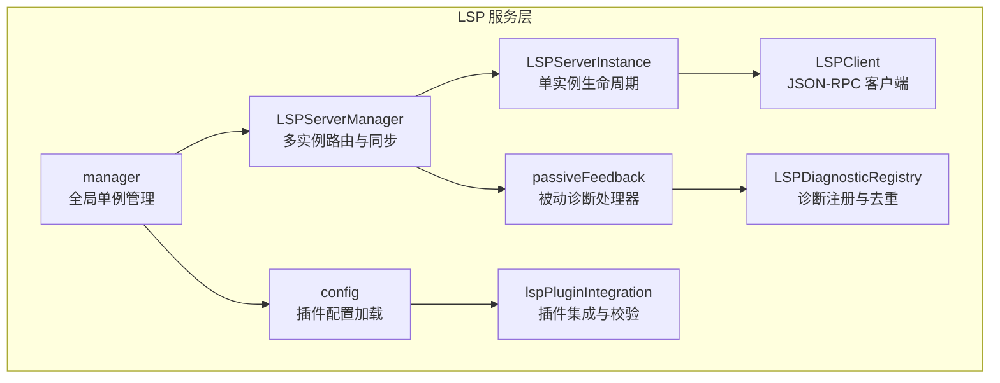
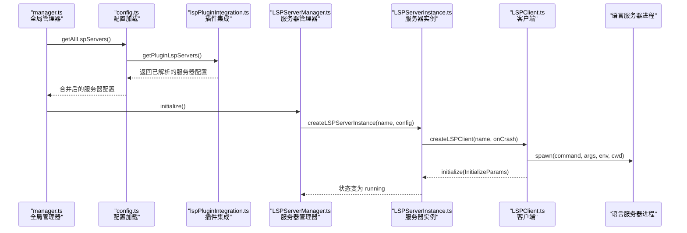
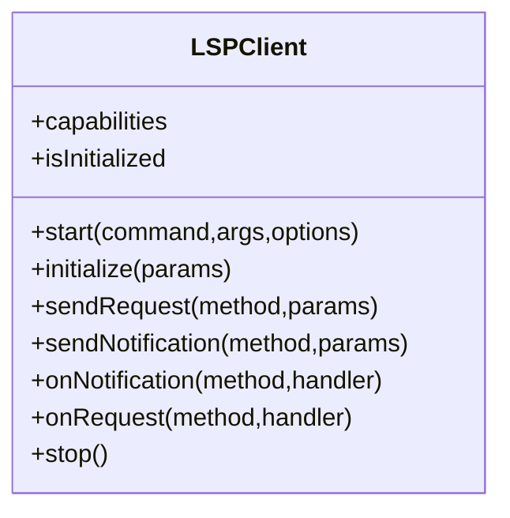
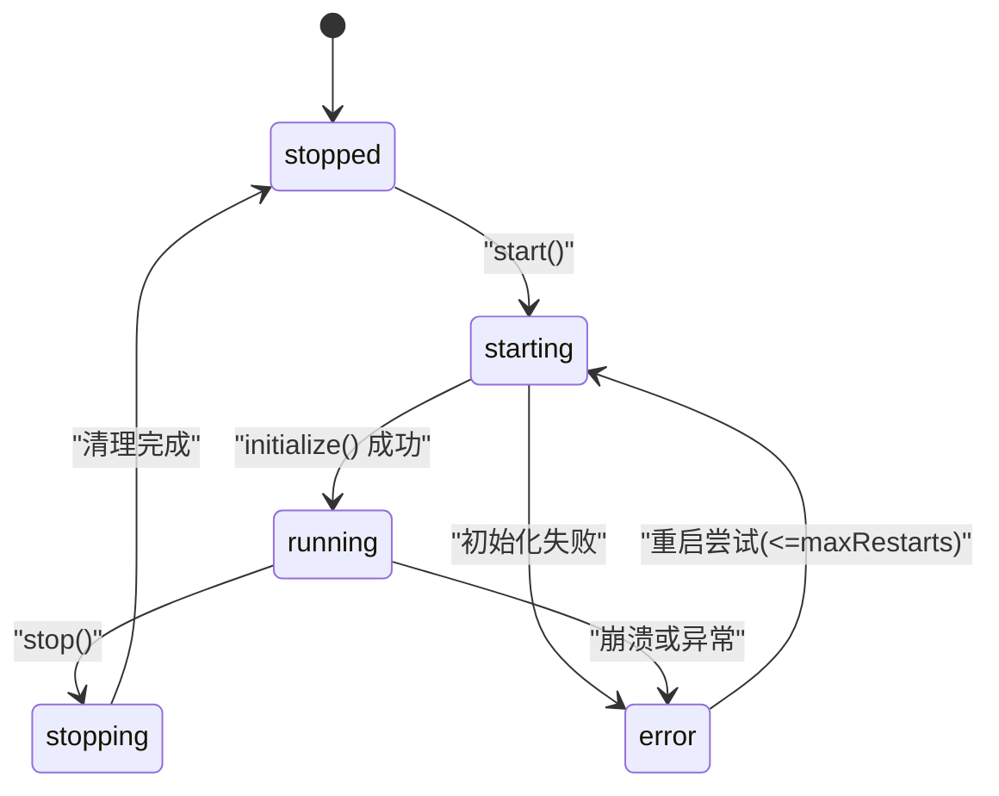
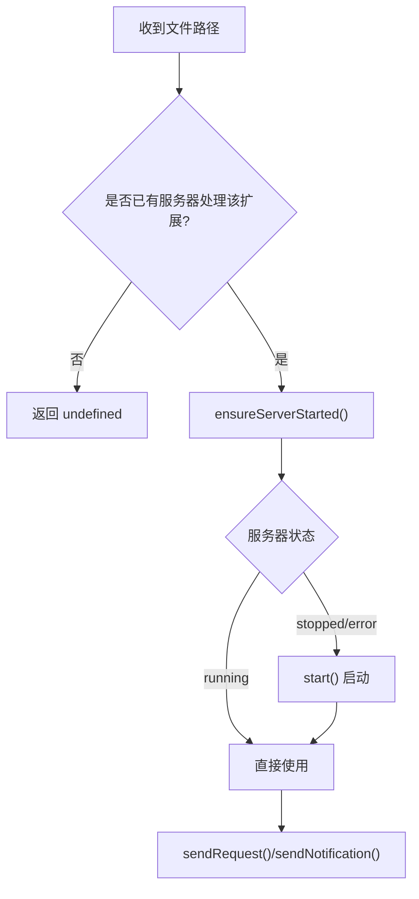
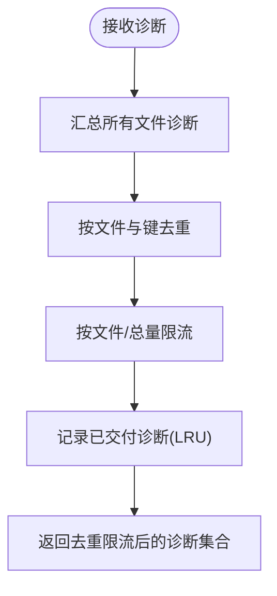
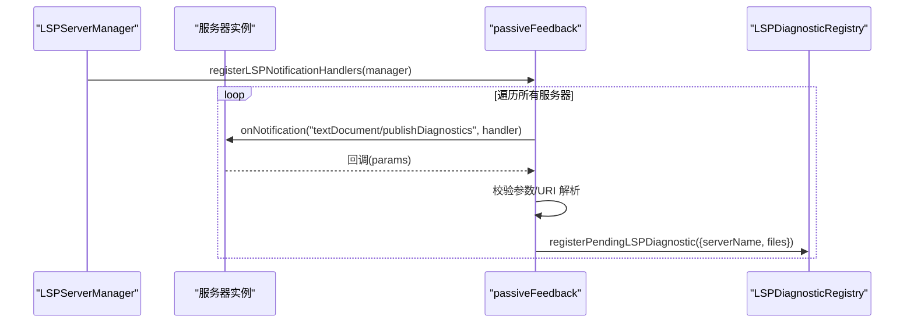
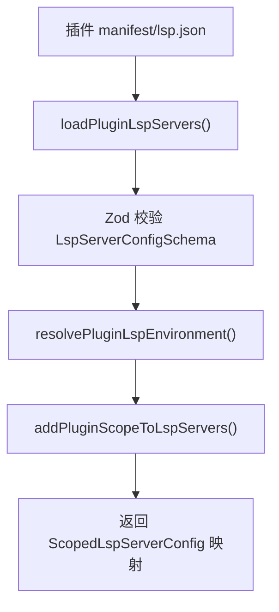
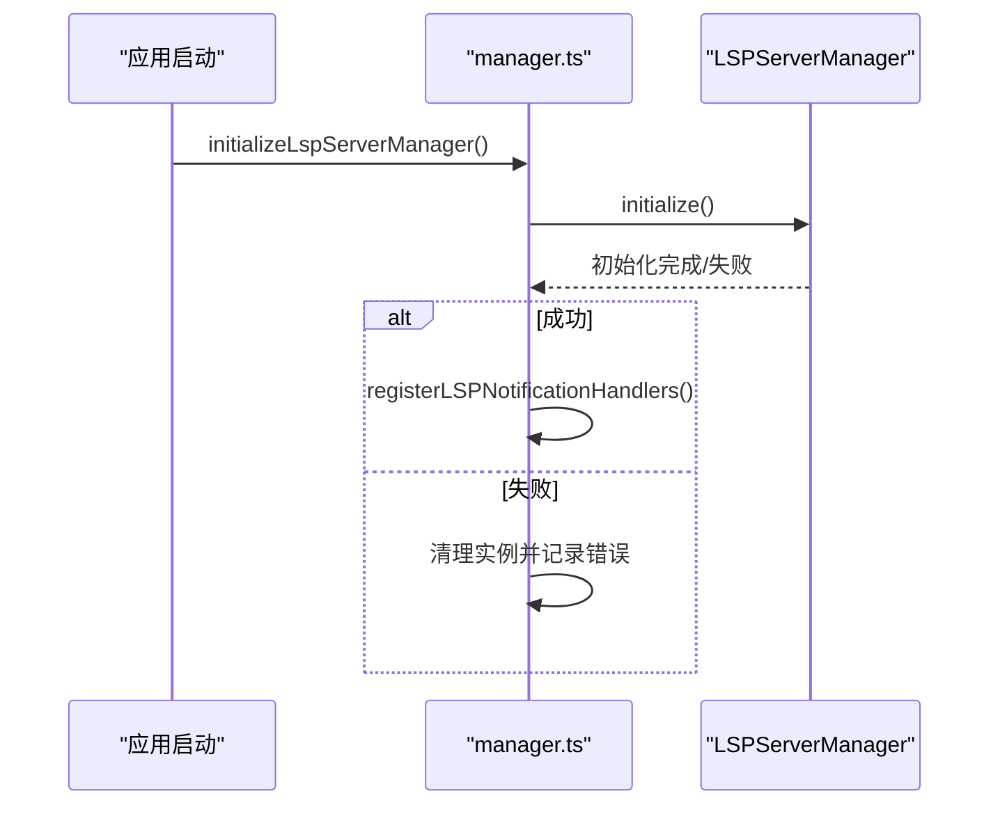
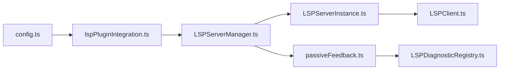

# LSP 服务

<cite>
**本文引用的文件**
- [LSPClient.ts](file://src/services/lsp/LSPClient.ts)
- [LSPServerInstance.ts](file://src/services/lsp/LSPServerInstance.ts)
- [LSPServerManager.ts](file://src/services/lsp/LSPServerManager.ts)
- [LSPDiagnosticRegistry.ts](file://src/services/lsp/LSPDiagnosticRegistry.ts)
- [config.ts](file://src/services/lsp/config.ts)
- [manager.ts](file://src/services/lsp/manager.ts)
- [passiveFeedback.ts](file://src/services/lsp/passiveFeedback.ts)
- [lspPluginIntegration.ts](file://src/utils/plugins/lspPluginIntegration.ts)
- [schemas.ts](file://src/utils/plugins/schemas.ts)
</cite>

## 目录
1. [简介](#简介)
2. [项目结构](#项目结构)
3. [核心组件](#核心组件)
4. [架构总览](#架构总览)
5. [详细组件分析](#详细组件分析)
6. [依赖关系分析](#依赖关系分析)
7. [性能考量](#性能考量)
8. [故障排查指南](#故障排查指南)
9. [结论](#结论)
10. [附录](#附录)

## 简介
本文件为 free-code 项目中的 LSP（Language Server Protocol）服务的详细 API 参考与实现说明。内容覆盖 LSP 客户端接口、服务器管理、诊断注册与被动反馈机制、配置加载与扩展集成、连接建立、消息传递与状态同步、语言服务器发现与自动配置、错误处理与性能监控等。同时提供 LSP 扩展开发、自定义诊断、智能提示与代码补全的实现要点与最佳实践。

## 项目结构
LSP 服务位于 src/services/lsp 目录下，核心模块包括：
- LSPClient：基于 vscode-jsonrpc 的 LSP 客户端封装，负责进程启动、JSON-RPC 连接、请求/通知发送与处理、生命周期管理。
- LSPServerInstance：单个 LSP 服务器实例的生命周期与健康检查，支持重试、超时、崩溃恢复与请求转发。
- LSPServerManager：多服务器管理器，按文件扩展名路由请求，维护打开文件状态，同步文件事件（open/change/save/close）。
- LSPDiagnosticRegistry：异步诊断注册表，用于被动收集与去重、限流与跨轮次去重，统一交付到对话附件系统。
- passiveFeedback：被动诊断反馈处理器，注册 textDocument/publishDiagnostics 处理器，格式化并注册到诊断注册表。
- config：从插件加载 LSP 服务器配置，合并各插件结果。
- manager：全局单例管理器，初始化、重初始化、关闭与状态查询。
- lspPluginIntegration：插件侧 LSP 配置加载、环境变量解析、作用域命名与缓存。
- schemas：插件 LSP 配置的 Zod 校验模式，确保配置合法。

图表来源
- [LSPClient.ts:1-448](file://src/services/lsp/LSPClient.ts#L1-L448)
- [LSPServerInstance.ts:1-512](file://src/services/lsp/LSPServerInstance.ts#L1-L512)
- [LSPServerManager.ts:1-421](file://src/services/lsp/LSPServerManager.ts#L1-L421)
- [LSPDiagnosticRegistry.ts:1-387](file://src/services/lsp/LSPDiagnosticRegistry.ts#L1-L387)
- [passiveFeedback.ts:1-329](file://src/services/lsp/passiveFeedback.ts#L1-L329)
- [config.ts:1-80](file://src/services/lsp/config.ts#L1-L80)
- [manager.ts:1-290](file://src/services/lsp/manager.ts#L1-L290)
- [lspPluginIntegration.ts:1-388](file://src/utils/plugins/lspPluginIntegration.ts#L1-L388)

章节来源
- [LSPClient.ts:1-448](file://src/services/lsp/LSPClient.ts#L1-L448)
- [LSPServerInstance.ts:1-512](file://src/services/lsp/LSPServerInstance.ts#L1-L512)
- [LSPServerManager.ts:1-421](file://src/services/lsp/LSPServerManager.ts#L1-L421)
- [LSPDiagnosticRegistry.ts:1-387](file://src/services/lsp/LSPDiagnosticRegistry.ts#L1-L387)
- [passiveFeedback.ts:1-329](file://src/services/lsp/passiveFeedback.ts#L1-L329)
- [config.ts:1-80](file://src/services/lsp/config.ts#L1-L80)
- [manager.ts:1-290](file://src/services/lsp/manager.ts#L1-L290)
- [lspPluginIntegration.ts:1-388](file://src/utils/plugins/lspPluginIntegration.ts#L1-L388)

## 核心组件
- LSPClient：提供 start/initialize/sendRequest/sendNotification/onNotification/onRequest/stop 等方法；内部使用 vscode-jsonrpc 建立 stdio 连接，支持协议追踪、延迟初始化队列、错误与关闭处理。
- LSPServerInstance：封装单个 LSP 服务器实例，提供 start/stop/restart/isHealthy/sendRequest/sendNotification/onNotification/onRequest；内置对“内容已修改”类瞬态错误的指数退避重试与超时控制。
- LSPServerManager：按文件扩展名选择服务器，确保服务器启动，转发请求；维护打开文件映射，同步 didOpen/didChange/didSave/didClose；提供 getAllServers/openFile/changeFile/saveFile/closeFile/isFileOpen。
- LSPDiagnosticRegistry：注册待交付诊断、跨轮次去重、体积限制（每文件与总量）、跟踪已交付项；提供检查与清理接口。
- passiveFeedback：注册 textDocument/publishDiagnostics 处理器，格式化为 Claude 诊断格式并注册到诊断注册表；统计注册与运行时失败。
- config：从已启用插件中加载 LSP 服务器配置，合并结果并返回；lspPluginIntegration 负责解析环境变量、添加插件作用域、缓存与校验。
- manager：全局单例初始化、重初始化、关闭；提供状态查询与连接性判断；在初始化完成后注册被动诊断处理器。

章节来源
- [LSPClient.ts:21-41](file://src/services/lsp/LSPClient.ts#L21-L41)
- [LSPServerInstance.ts:33-65](file://src/services/lsp/LSPServerInstance.ts#L33-L65)
- [LSPServerManager.ts:16-43](file://src/services/lsp/LSPServerManager.ts#L16-L43)
- [LSPDiagnosticRegistry.ts:24-39](file://src/services/lsp/LSPDiagnosticRegistry.ts#L24-L39)
- [passiveFeedback.ts:117-124](file://src/services/lsp/passiveFeedback.ts#L117-L124)
- [config.ts:15-79](file://src/services/lsp/config.ts#L15-L79)
- [manager.ts:145-208](file://src/services/lsp/manager.ts#L145-L208)

## 架构总览
LSP 服务采用“插件驱动 + 单例管理 + 实例路由”的架构：
- 插件通过 .lsp.json 或 manifest.lspServers 提供 LSP 服务器配置，经由 lspPluginIntegration 解析与校验，并添加插件作用域。
- manager 初始化时调用 config 加载所有插件的 LSP 配置，构建 LSPServerManager。
- LSPServerManager 维护扩展名到服务器名称列表的映射，按需启动 LSPServerInstance。
- LSPServerInstance 使用 LSPClient 与语言服务器进程通信，支持请求重试与超时。
- passiveFeedback 注册被动诊断处理器，将 LSP 发布的诊断转换为 Claude 附件格式并交由诊断注册表统一交付。

图表来源
- [manager.ts:145-208](file://src/services/lsp/manager.ts#L145-L208)
- [config.ts:15-79](file://src/services/lsp/config.ts#L15-L79)
- [lspPluginIntegration.ts:322-358](file://src/utils/plugins/lspPluginIntegration.ts#L322-L358)
- [LSPServerManager.ts:71-148](file://src/services/lsp/LSPServerManager.ts#L71-L148)
- [LSPServerInstance.ts:135-264](file://src/services/lsp/LSPServerInstance.ts#L135-L264)
- [LSPClient.ts:88-254](file://src/services/lsp/LSPClient.ts#L88-L254)

## 详细组件分析

### LSPClient：客户端接口与消息传递
- 关键职责
  - 进程启动：spawn 子进程，等待 spawn 成功，捕获 stderr 输出，处理进程错误与退出码。
  - JSON-RPC 连接：基于 stdio 创建 StreamMessageReader/Writer，建立 MessageConnection，注册 onError/onClose。
  - 请求/通知：sendRequest/sendNotification；onNotification/onRequest 支持延迟注册（连接未就绪时入队）。
  - 生命周期：start/initialize/sendRequest/sendNotification/onNotification/onRequest/stop；支持协议追踪与调试日志。
- 错误处理
  - 连接错误与关闭：避免在正常停止时标记为错误；非预期退出设置 startFailed/startError 并回调 onCrash。
  - 通知失败：记录但不抛出，保证不会中断调用链。
- 性能与可靠性
  - 使用协议追踪便于调试；延迟初始化队列避免竞态；stdin 错误隔离防止未处理异常。

图表来源
- [LSPClient.ts:21-41](file://src/services/lsp/LSPClient.ts#L21-L41)

章节来源
- [LSPClient.ts:88-254](file://src/services/lsp/LSPClient.ts#L88-L254)
- [LSPClient.ts:256-371](file://src/services/lsp/LSPClient.ts#L256-L371)
- [LSPClient.ts:373-445](file://src/services/lsp/LSPClient.ts#L373-L445)

### LSPServerInstance：实例生命周期与健康检查
- 关键职责
  - 状态机：stopped → starting → running → stopping → stopped；错误时进入 error 并可重试。
  - 初始化：构造 InitializeParams（工作区、能力声明、兼容字段），支持 startupTimeout。
  - 请求转发：sendRequest 包含瞬态错误重试（指数退避）与最大重试次数；sendNotification fire-and-forget。
  - 健康检查：isHealthy 判断运行且已初始化。
- 错误与恢复
  - 内容已修改（-32801）类瞬态错误自动重试；崩溃后记录 lastError 并触发上层 manager 的重启策略。
- 超时与资源清理
  - withTimeout 封装超时逻辑；stop 时 dispose 连接、kill 进程、移除监听器，避免泄漏。

图表来源
- [LSPServerInstance.ts:74-79](file://src/services/lsp/LSPServerInstance.ts#L74-L79)
- [LSPServerInstance.ts:135-264](file://src/services/lsp/LSPServerInstance.ts#L135-L264)
- [LSPServerInstance.ts:355-410](file://src/services/lsp/LSPServerInstance.ts#L355-L410)

章节来源
- [LSPServerInstance.ts:135-264](file://src/services/lsp/LSPServerInstance.ts#L135-L264)
- [LSPServerInstance.ts:355-410](file://src/services/lsp/LSPServerInstance.ts#L355-L410)
- [LSPServerInstance.ts:499-511](file://src/services/lsp/LSPServerInstance.ts#L499-L511)

### LSPServerManager：多实例路由与文件同步
- 关键职责
  - 配置加载：getAllLspServers 返回服务器映射；构建 extension → serverName 列表。
  - 服务器选择：按文件扩展名获取首个匹配服务器；ensureServerStarted 自动启动。
  - 请求分发：sendRequest 转发至对应服务器；失败记录日志并抛出。
  - 文件同步：openFile/changeFile/saveFile/closeFile/isFileOpen；didOpen/didChange/didSave/didClose。
- 并发与一致性
  - 批量关闭使用 Promise.allSettled；openedFiles 映射 URI → serverName 防止重复 didOpen。
  - 对未打开文件先 didOpen 再 didChange，满足 LSP 规范。

图表来源
- [LSPServerManager.ts:192-236](file://src/services/lsp/LSPServerManager.ts#L192-L236)
- [LSPServerManager.ts:244-263](file://src/services/lsp/LSPServerManager.ts#L244-L263)
- [LSPServerManager.ts:270-400](file://src/services/lsp/LSPServerManager.ts#L270-L400)

章节来源
- [LSPServerManager.ts:71-148](file://src/services/lsp/LSPServerManager.ts#L71-L148)
- [LSPServerManager.ts:192-236](file://src/services/lsp/LSPServerManager.ts#L192-L236)
- [LSPServerManager.ts:244-263](file://src/services/lsp/LSPServerManager.ts#L244-L263)
- [LSPServerManager.ts:270-400](file://src/services/lsp/LSPServerManager.ts#L270-L400)

### LSPDiagnosticRegistry：诊断注册与被动反馈
- 关键职责
  - 注册：registerPendingLSPDiagnostic 接收服务器诊断，生成唯一 ID 并入队。
  - 去重：按文件 URI 与诊断键（消息、严重性、范围、来源、编码）去重；LRU 记录跨轮次去重。
  - 限流：每文件最多 N 条，总量最多 M 条；按严重性排序优先保留错误。
  - 交付：checkForLSPDiagnostics 汇总并返回，标记已交付以便后续清理。
- 清理与重置
  - clearAllLSPDiagnostics/clearDeliveredDiagnosticsForFile/resetAllLSPDiagnosticState 控制内存增长与会话边界。

图表来源
- [LSPDiagnosticRegistry.ts:65-338](file://src/services/lsp/LSPDiagnosticRegistry.ts#L65-L338)

章节来源
- [LSPDiagnosticRegistry.ts:65-338](file://src/services/lsp/LSPDiagnosticRegistry.ts#L65-L338)

### passiveFeedback：被动诊断处理器
- 关键职责
  - 注册：遍历所有服务器实例，注册 textDocument/publishDiagnostics 处理器。
  - 格式化：将 LSP PublishDiagnosticsParams 转换为 Claude 诊断格式（含 URI 解析、严重性映射、范围标准化）。
  - 注册：调用 registerPendingLSPDiagnostic 将诊断加入注册表，支持失败计数与警告。
- 容错
  - 参数校验、URI 解析回退、异常捕获与失败计数，避免单个服务器影响整体。

图表来源
- [passiveFeedback.ts:125-329](file://src/services/lsp/passiveFeedback.ts#L125-L329)
- [LSPServerManager.ts:123-136](file://src/services/lsp/LSPServerManager.ts#L123-L136)

章节来源
- [passiveFeedback.ts:125-329](file://src/services/lsp/passiveFeedback.ts#L125-L329)

### 配置加载与插件集成
- 配置来源
  - 插件目录下的 .lsp.json 与 manifest.lspServers；支持字符串路径（相对插件根）、内联对象与数组混合。
- 解析与校验
  - 使用 Zod 模式 LspServerConfigSchema 校验；支持命令、参数、扩展映射、传输、环境变量、初始化选项、工作区、超时、重启与最大重启次数等字段。
- 环境变量与作用域
  - resolvePluginLspEnvironment 支持 ${CLAUDE_PLUGIN_ROOT}、${CLAUDE_PLUGIN_DATA}、${user_config.X} 与通用环境变量替换；addPluginScopeToLspServers 添加前缀避免冲突。
- 缓存与错误收集
  - loadPluginLspServers 缓存解析结果；getPluginLspServers 合并解析与作用域；错误收集到 PluginError[]。

图表来源
- [lspPluginIntegration.ts:57-122](file://src/utils/plugins/lspPluginIntegration.ts#L57-L122)
- [lspPluginIntegration.ts:229-292](file://src/utils/plugins/lspPluginIntegration.ts#L229-L292)
- [lspPluginIntegration.ts:298-315](file://src/utils/plugins/lspPluginIntegration.ts#L298-L315)
- [schemas.ts:708-788](file://src/utils/plugins/schemas.ts#L708-L788)

章节来源
- [config.ts:15-79](file://src/services/lsp/config.ts#L15-L79)
- [lspPluginIntegration.ts:57-122](file://src/utils/plugins/lspPluginIntegration.ts#L57-L122)
- [lspPluginIntegration.ts:229-292](file://src/utils/plugins/lspPluginIntegration.ts#L229-L292)
- [lspPluginIntegration.ts:298-315](file://src/utils/plugins/lspPluginIntegration.ts#L298-L315)
- [schemas.ts:708-788](file://src/utils/plugins/schemas.ts#L708-L788)

### 全局管理器与状态同步
- 初始化流程
  - initializeLspServerManager 创建单例并异步 initialize；成功后注册被动诊断处理器；失败则清理实例并记录错误。
- 重初始化
  - reinitializeLspServerManager 在插件刷新后强制重新加载配置并启动。
- 关闭与清理
  - shutdownLspServerManager 停止所有运行中的服务器，清理单例与状态；吞掉错误以避免退出路径上的异常。
- 连接性检测
  - isLspConnected 检查至少一个服务器处于非 error 状态。

图表来源
- [manager.ts:145-208](file://src/services/lsp/manager.ts#L145-L208)
- [manager.ts:226-253](file://src/services/lsp/manager.ts#L226-L253)
- [manager.ts:267-289](file://src/services/lsp/manager.ts#L267-L289)

章节来源
- [manager.ts:145-208](file://src/services/lsp/manager.ts#L145-L208)
- [manager.ts:226-253](file://src/services/lsp/manager.ts#L226-L253)
- [manager.ts:267-289](file://src/services/lsp/manager.ts#L267-L289)

## 依赖关系分析
- 组件耦合
  - LSPServerManager 依赖 LSPServerInstance；LSPServerInstance 依赖 LSPClient。
  - passiveFeedback 依赖 LSPServerManager 获取服务器实例并注册通知处理器。
  - LSPDiagnosticRegistry 独立于具体服务器，仅消费来自处理器的诊断数据。
  - config 与 lspPluginIntegration 共同提供配置加载与解析。
- 外部依赖
  - vscode-jsonrpc：JSON-RPC 连接与消息编解码。
  - lru-cache：跨轮次去重的 LRU 缓存。
- 循环依赖
  - 无循环依赖；模块间通过函数接口与工厂模式解耦。

图表来源
- [config.ts:15-79](file://src/services/lsp/config.ts#L15-L79)
- [lspPluginIntegration.ts:322-358](file://src/utils/plugins/lspPluginIntegration.ts#L322-L358)
- [LSPServerManager.ts:71-148](file://src/services/lsp/LSPServerManager.ts#L71-L148)
- [LSPServerInstance.ts:106-125](file://src/services/lsp/LSPServerInstance.ts#L106-L125)
- [LSPClient.ts:106-112](file://src/services/lsp/LSPClient.ts#L106-L112)
- [passiveFeedback.ts:125-139](file://src/services/lsp/passiveFeedback.ts#L125-L139)
- [LSPDiagnosticRegistry.ts:49-56](file://src/services/lsp/LSPDiagnosticRegistry.ts#L49-L56)

章节来源
- [LSPServerManager.ts:71-148](file://src/services/lsp/LSPServerManager.ts#L71-L148)
- [LSPServerInstance.ts:106-125](file://src/services/lsp/LSPServerInstance.ts#L106-L125)
- [passiveFeedback.ts:125-139](file://src/services/lsp/passiveFeedback.ts#L125-L139)
- [LSPDiagnosticRegistry.ts:49-56](file://src/services/lsp/LSPDiagnosticRegistry.ts#L49-L56)

## 性能考量
- 连接与协议
  - 使用协议追踪便于诊断；stdio 传输简单可靠；避免不必要的协议切换。
- 重试与超时
  - LSPServerInstance 对瞬态错误进行指数退避重试，避免频繁失败导致抖动；startupTimeout 防止卡死。
- 资源管理
  - stop 时主动 dispose 连接、kill 子进程、移除监听器，防止资源泄漏。
- 诊断处理
  - LSPDiagnosticRegistry 采用 LRU 与限流策略，避免长时间会话内存膨胀；按严重性排序优先保留关键问题。
- 并发与稳定性
  - passiveFeedback 对每个服务器的注册与处理独立捕获异常，避免单点故障影响整体。

## 故障排查指南
- 启动失败
  - 检查 LSPClient 的 spawn 是否成功、stderr 输出、进程错误与退出码；查看 startFailed/startError 与 onCrash 回调。
- 初始化失败
  - 查看 LSPServerInstance 初始化日志与超时；确认 InitializeParams 中工作区与能力声明是否正确。
- 请求失败
  - 检查 isHealthy 状态；瞬态错误（-32801）应自动重试；非瞬态错误需根据错误码与消息定位。
- 诊断未显示
  - 确认 passiveFeedback 已注册处理器；检查 formatDiagnosticsForAttachment 的 URI 解析与参数校验；查看 LSPDiagnosticRegistry 的去重与限流策略。
- 服务器未响应
  - 使用 isLspConnected 检查连接状态；必要时调用 LSPServerInstance.restart() 或 LSPServerManager.shutdown()/initialize() 重置。

章节来源
- [LSPClient.ts:144-167](file://src/services/lsp/LSPClient.ts#L144-L167)
- [LSPServerInstance.ts:254-263](file://src/services/lsp/LSPServerInstance.ts#L254-L263)
- [LSPServerInstance.ts:355-410](file://src/services/lsp/LSPServerInstance.ts#L355-L410)
- [passiveFeedback.ts:168-183](file://src/services/lsp/passiveFeedback.ts#L168-L183)
- [LSPDiagnosticRegistry.ts:218-239](file://src/services/lsp/LSPDiagnosticRegistry.ts#L218-L239)

## 结论
free-code 的 LSP 服务通过插件驱动的配置加载、严格的生命周期管理与稳健的错误处理，实现了对多语言服务器的统一接入与诊断反馈。其设计强调：
- 可靠性：瞬态错误重试、超时控制、资源清理与单点故障隔离。
- 可扩展性：插件作用域命名、延迟初始化与动态注册。
- 可观测性：协议追踪、调试日志与诊断注册表的去重与限流。
- 可维护性：模块职责清晰、接口稳定、状态机明确。

## 附录
- LSP 配置字段说明（摘自 schemas）
  - command：服务器可执行文件路径（建议使用 args 数组而非空格拼接）。
  - args：命令行参数数组。
  - extensionToLanguage：文件扩展名到语言 ID 的映射。
  - transport：通信方式（stdio/socket，默认 stdio）。
  - env：启动时的环境变量。
  - initializationOptions：初始化阶段传入的选项。
  - settings：通过 workspace/didChangeConfiguration 传递的设置。
  - workspaceFolder：工作区路径。
  - startupTimeout：启动超时（毫秒）。
  - shutdownTimeout：优雅关闭超时（毫秒）。
  - restartOnCrash：崩溃后重启（当前未实现）。
  - maxRestarts：最大重启次数。
- 插件 LSP 配置加载流程
  - 从 .lsp.json 或 manifest.lspServers 读取；
  - Zod 校验；
  - 环境变量替换；
  - 添加插件作用域；
  - 合并到全局配置映射。

章节来源
- [schemas.ts:708-788](file://src/utils/plugins/schemas.ts#L708-L788)
- [lspPluginIntegration.ts:57-122](file://src/utils/plugins/lspPluginIntegration.ts#L57-L122)
- [lspPluginIntegration.ts:229-292](file://src/utils/plugins/lspPluginIntegration.ts#L229-L292)
- [lspPluginIntegration.ts:298-315](file://src/utils/plugins/lspPluginIntegration.ts#L298-L315)