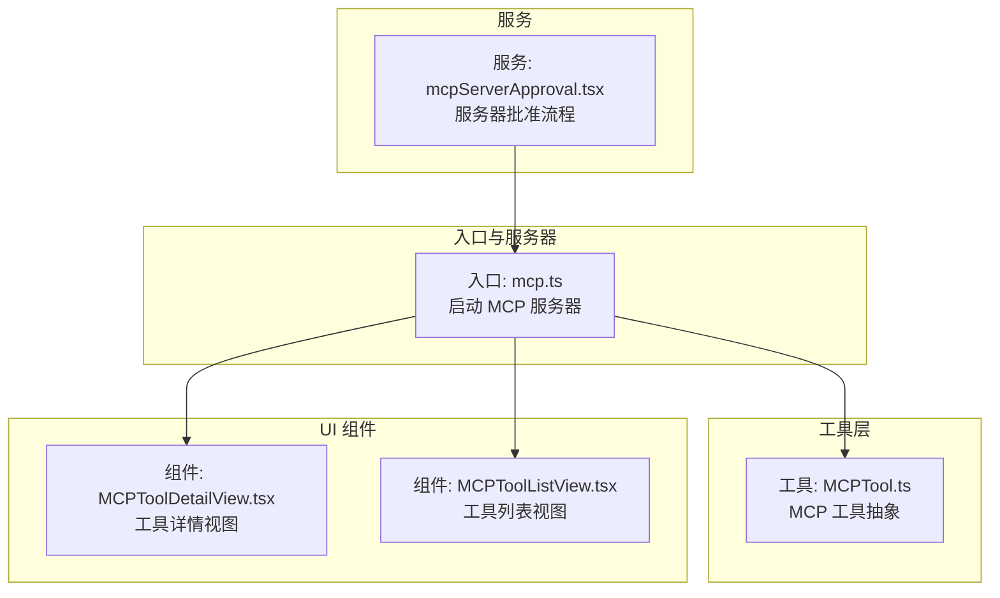
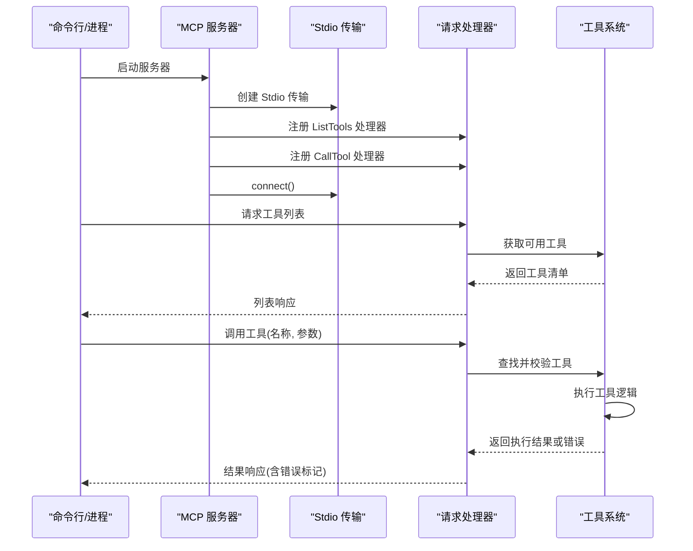
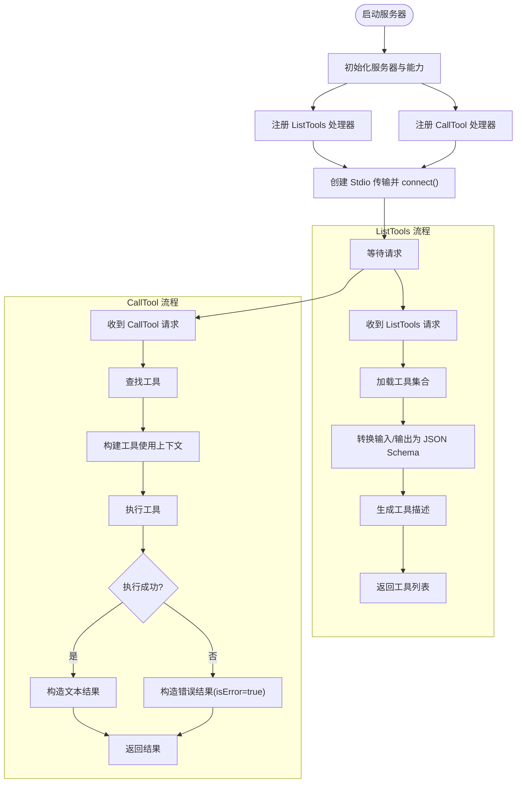
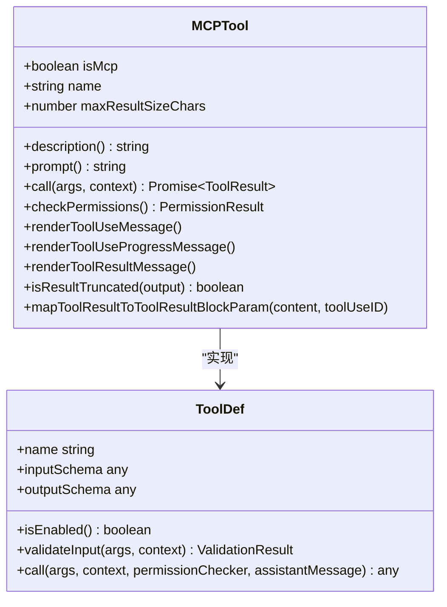
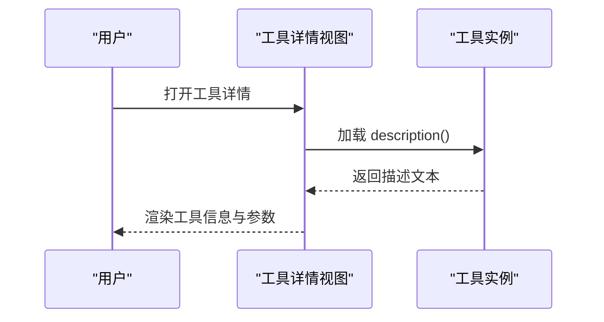
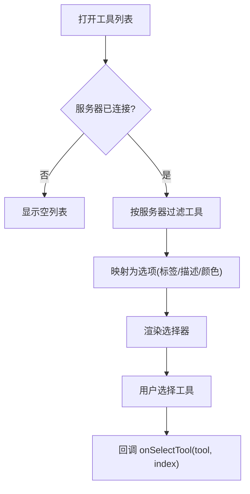
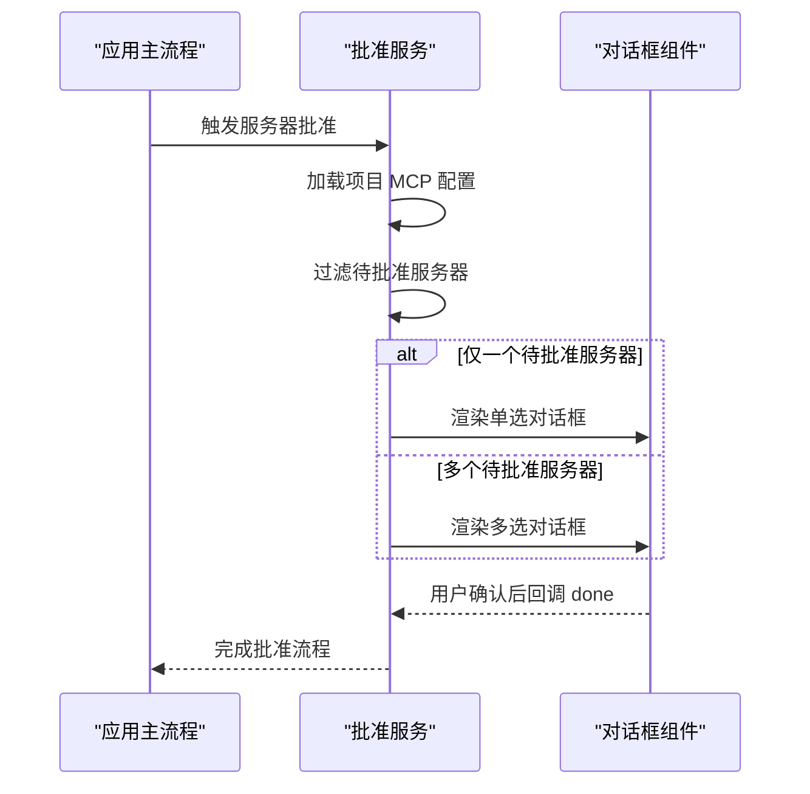
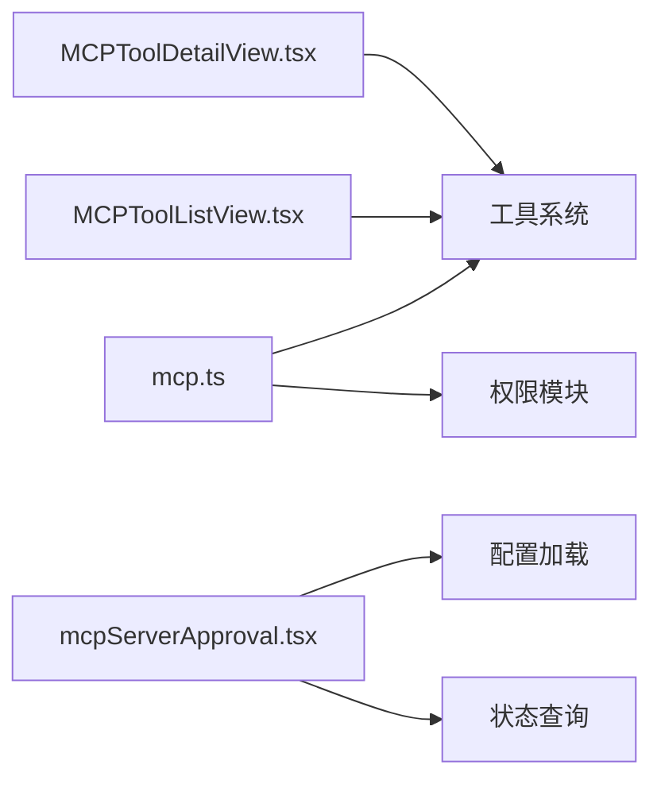

# MCP 服务

<cite>
**本文档引用的文件**
- [mcp.ts](file://src/entrypoints/mcp.ts)
- [MCPTool.ts](file://src/tools/MCPTool/MCPTool.ts)
- [MCPToolDetailView.tsx](file://src/components/mcp/MCPToolDetailView.tsx)
- [MCPToolListView.tsx](file://src/components/mcp/MCPToolListView.tsx)
- [mcpServerApproval.tsx](file://src/services/mcpServerApproval.tsx)
</cite>

## 目录
1. [简介](#简介)
2. [项目结构](#项目结构)
3. [核心组件](#核心组件)
4. [架构总览](#架构总览)
5. [详细组件分析](#详细组件分析)
6. [依赖关系分析](#依赖关系分析)
7. [性能考虑](#性能考虑)
8. [故障排除指南](#故障排除指南)
9. [结论](#结论)
10. [附录](#附录)

## 简介
本文件为 free-code 项目的 MCP（模型上下文协议）服务提供详细的 API 参考文档。内容涵盖 MCP 客户端接口、连接管理、认证与权限控制、工具发现与调用流程、消息传输与状态管理，以及 MCP 服务器侧的工具注册、资源获取与性能优化等接口规范。文档同时给出关键流程的时序图与类图，帮助开发者快速理解与集成。

## 项目结构
围绕 MCP 的相关实现主要分布在以下模块：
- 入口与服务器：负责启动 MCP 服务器、注册请求处理器、处理工具列表与调用
- 工具层：定义 MCP 工具抽象与通用行为
- UI 组件：展示 MCP 工具详情与工具列表，支持交互选择
- 服务：处理 MCP 服务器批准流程与配置加载

**图表来源**
- [mcp.ts:35-196](file://src/entrypoints/mcp.ts#L35-L196)
- [MCPTool.ts:27-77](file://src/tools/MCPTool/MCPTool.ts#L27-L77)
- [MCPToolDetailView.tsx:14-207](file://src/components/mcp/MCPToolDetailView.tsx#L14-L207)
- [MCPToolListView.tsx:20-133](file://src/components/mcp/MCPToolListView.tsx#L20-L133)
- [mcpServerApproval.tsx:15-40](file://src/services/mcpServerApproval.tsx#L15-L40)

**章节来源**
- [mcp.ts:35-196](file://src/entrypoints/mcp.ts#L35-L196)
- [MCPTool.ts:27-77](file://src/tools/MCPTool/MCPTool.ts#L27-L77)
- [MCPToolDetailView.tsx:14-207](file://src/components/mcp/MCPToolDetailView.tsx#L14-L207)
- [MCPToolListView.tsx:20-133](file://src/components/mcp/MCPToolListView.tsx#L20-L133)
- [mcpServerApproval.tsx:15-40](file://src/services/mcpServerApproval.tsx#L15-L40)

## 核心组件
- MCP 服务器入口：初始化服务器、设置能力、注册 ListTools 与 CallTool 请求处理器，并通过标准输入输出进行传输
- MCP 工具抽象：提供统一的工具接口、输入/输出模式、权限检查、结果渲染与截断策略
- UI 工具视图：展示工具名称、描述、参数与特性标注；支持在服务器连接状态下筛选与选择工具
- 服务器批准服务：根据项目配置加载待批准的 MCP 服务器，弹出单选或多选对话框供用户确认

**章节来源**
- [mcp.ts:35-196](file://src/entrypoints/mcp.ts#L35-L196)
- [MCPTool.ts:27-77](file://src/tools/MCPTool/MCPTool.ts#L27-L77)
- [MCPToolDetailView.tsx:14-207](file://src/components/mcp/MCPToolDetailView.tsx#L14-L207)
- [MCPToolListView.tsx:20-133](file://src/components/mcp/MCPToolListView.tsx#L20-L133)
- [mcpServerApproval.tsx:15-40](file://src/services/mcpServerApproval.tsx#L15-L40)

## 架构总览
下图展示了 MCP 服务器从启动到工具调用的关键交互路径，包括请求处理器注册、工具发现与调用、错误处理与日志记录。

**图表来源**
- [mcp.ts:47-57](file://src/entrypoints/mcp.ts#L47-L57)
- [mcp.ts:59-96](file://src/entrypoints/mcp.ts#L59-L96)
- [mcp.ts:99-187](file://src/entrypoints/mcp.ts#L99-L187)
- [mcp.ts:190-196](file://src/entrypoints/mcp.ts#L190-L196)

## 详细组件分析

### MCP 服务器入口（mcp.ts）
- 服务器初始化：设置服务器元信息与能力声明（工具能力）
- 请求处理器：
  - ListTools：收集工具、转换输入/输出模式为 JSON Schema、生成描述文本
  - CallTool：查找工具、构建工具使用上下文、执行工具、返回文本结果或错误标记
- 传输层：StdioServerTransport 连接标准输入输出
- 缓存与性能：为文件状态读取提供大小受限的 LRU 缓存
- 错误处理：捕获异常、格式化错误信息并以 isError 标记返回

**图表来源**
- [mcp.ts:35-196](file://src/entrypoints/mcp.ts#L35-L196)

**章节来源**
- [mcp.ts:35-196](file://src/entrypoints/mcp.ts#L35-L196)

### MCP 工具抽象（MCPTool.ts）
- 工具标识：isMcp 标记、名称占位符、用户可见名称
- 输入/输出模式：输入模式允许任意对象（由 MCP 工具自定义），输出模式为字符串
- 权限检查：提供权限检查钩子，当前行为为“放行但提示需要权限”
- 渲染与截断：提供工具使用消息、进度消息与结果消息的渲染方法；支持输出截断检测
- 结果映射：将工具结果映射为消息块参数

**图表来源**
- [MCPTool.ts:27-77](file://src/tools/MCPTool/MCPTool.ts#L27-L77)

**章节来源**
- [MCPTool.ts:27-77](file://src/tools/MCPTool/MCPTool.ts#L27-L77)

### 工具详情视图（MCPToolDetailView.tsx）
- 功能：展示工具名称、完整名称、描述、参数列表与特性标注（只读、破坏性、开放世界）
- 数据来源：从工具实例动态加载描述，结合工具权限上下文与工具集合
- 交互：支持返回操作与快捷键提示

**图表来源**
- [MCPToolDetailView.tsx:14-207](file://src/components/mcp/MCPToolDetailView.tsx#L14-L207)

**章节来源**
- [MCPToolDetailView.tsx:14-207](file://src/components/mcp/MCPToolDetailView.tsx#L14-L207)

### 工具列表视图（MCPToolListView.tsx）
- 功能：在服务器连接状态下筛选属于该服务器的工具，展示工具标签、描述与特性标注
- 交互：支持键盘导航、选择与返回操作

**图表来源**
- [MCPToolListView.tsx:20-133](file://src/components/mcp/MCPToolListView.tsx#L20-L133)

**章节来源**
- [MCPToolListView.tsx:20-133](file://src/components/mcp/MCPToolListView.tsx#L20-L133)

### 服务器批准服务（mcpServerApproval.tsx）
- 功能：扫描项目范围内的待批准 MCP 服务器，弹出单选或多选对话框供用户确认
- 集成：复用现有 Ink 根实例进行渲染，避免重复创建

**图表来源**
- [mcpServerApproval.tsx:15-40](file://src/services/mcpServerApproval.tsx#L15-L40)

**章节来源**
- [mcpServerApproval.tsx:15-40](file://src/services/mcpServerApproval.tsx#L15-L40)

## 依赖关系分析
- 服务器入口依赖工具系统与权限模块，用于工具发现、校验与执行
- UI 组件依赖工具实例与字符串工具函数，用于显示工具信息与过滤
- 服务器批准服务依赖配置加载与状态查询，用于确定待批准服务器集合

**图表来源**
- [mcp.ts:35-196](file://src/entrypoints/mcp.ts#L35-L196)
- [MCPToolListView.tsx:20-133](file://src/components/mcp/MCPToolListView.tsx#L20-L133)
- [MCPToolDetailView.tsx:14-207](file://src/components/mcp/MCPToolDetailView.tsx#L14-L207)
- [mcpServerApproval.tsx:15-40](file://src/services/mcpServerApproval.tsx#L15-L40)

**章节来源**
- [mcp.ts:35-196](file://src/entrypoints/mcp.ts#L35-L196)
- [MCPToolListView.tsx:20-133](file://src/components/mcp/MCPToolListView.tsx#L20-L133)
- [MCPToolDetailView.tsx:14-207](file://src/components/mcp/MCPToolDetailView.tsx#L14-L207)
- [mcpServerApproval.tsx:15-40](file://src/services/mcpServerApproval.tsx#L15-L40)

## 性能考虑
- 文件状态缓存：为文件读取状态提供大小受限的 LRU 缓存，防止内存无限增长
- 模式转换：将工具输入/输出模式转换为 JSON Schema 时，跳过根级别包含联合类型的复杂模式，确保 MCP SDK 兼容性
- 非交互会话：工具调用上下文中启用非交互模式，减少不必要的渲染与等待
- 错误快速返回：工具调用失败时直接返回错误文本与标记，避免额外处理开销

**章节来源**
- [mcp.ts:40-45](file://src/entrypoints/mcp.ts#L40-L45)
- [mcp.ts:66-82](file://src/entrypoints/mcp.ts#L66-L82)
- [mcp.ts:112-124](file://src/entrypoints/mcp.ts#L112-L124)
- [mcp.ts:170-186](file://src/entrypoints/mcp.ts#L170-L186)

## 故障排除指南
- 工具未找到：当 CallTool 请求的目标工具不存在时，服务器抛出错误并返回错误结果
- 工具未启用：若工具被禁用，调用将失败并返回错误
- 输入校验失败：若输入校验返回失败，服务器将返回错误结果
- 异常处理：所有未捕获异常会被记录并格式化为文本错误返回

建议排查步骤：
- 确认工具已在工具集合中注册且处于启用状态
- 检查工具输入模式是否符合预期
- 查看服务器日志以定位具体错误原因

**章节来源**
- [mcp.ts:105-108](file://src/entrypoints/mcp.ts#L105-L108)
- [mcp.ts:138-149](file://src/entrypoints/mcp.ts#L138-L149)
- [mcp.ts:170-186](file://src/entrypoints/mcp.ts#L170-L186)

## 结论
本文档对 free-code 的 MCP 服务进行了全面的 API 参考说明，覆盖了客户端接口、连接与传输、认证与权限、工具发现与调用、错误处理与重连机制、服务器管理与性能优化等方面。通过入口服务器、工具抽象、UI 组件与批准服务的协同，实现了从工具注册到用户交互的完整链路。建议在集成时遵循本文档的接口规范与最佳实践，确保稳定与高效的运行。

## 附录

### MCP 服务器配置要点
- 服务器元信息：名称与版本
- 能力声明：工具能力
- 传输方式：标准输入输出（Stdio）

**章节来源**
- [mcp.ts:47-57](file://src/entrypoints/mcp.ts#L47-L57)
- [mcp.ts:190-196](file://src/entrypoints/mcp.ts#L190-L196)

### 工具注册与发现
- 工具集合：通过工具系统获取
- 描述生成：基于工具 prompt 生成
- 模式转换：输入/输出模式转换为 JSON Schema

**章节来源**
- [mcp.ts:64-94](file://src/entrypoints/mcp.ts#L64-L94)

### 工具调用流程
- 上下文构建：包含命令、工具、模型、调试与详细日志开关
- 权限检查：通过权限模块进行校验
- 结果封装：统一返回文本内容或错误标记

**章节来源**
- [mcp.ts:101-187](file://src/entrypoints/mcp.ts#L101-L187)

### UI 交互与服务器批准
- 工具列表：按服务器过滤并展示特性标注
- 工具详情：动态加载描述与参数信息
- 服务器批准：单选或多选对话框确认

**章节来源**
- [MCPToolListView.tsx:20-133](file://src/components/mcp/MCPToolListView.tsx#L20-L133)
- [MCPToolDetailView.tsx:14-207](file://src/components/mcp/MCPToolDetailView.tsx#L14-L207)
- [mcpServerApproval.tsx:15-40](file://src/services/mcpServerApproval.tsx#L15-L40)