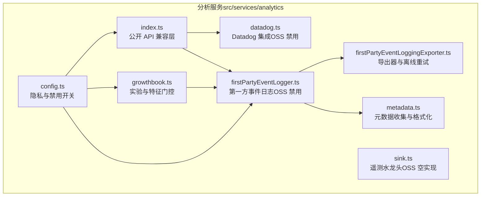
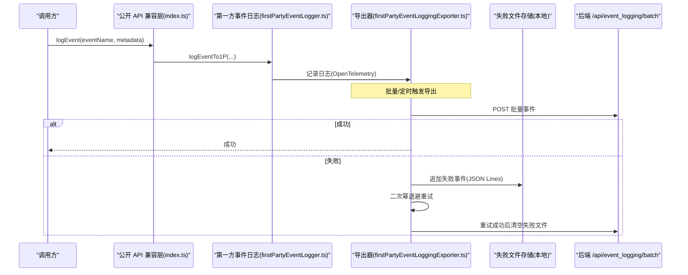
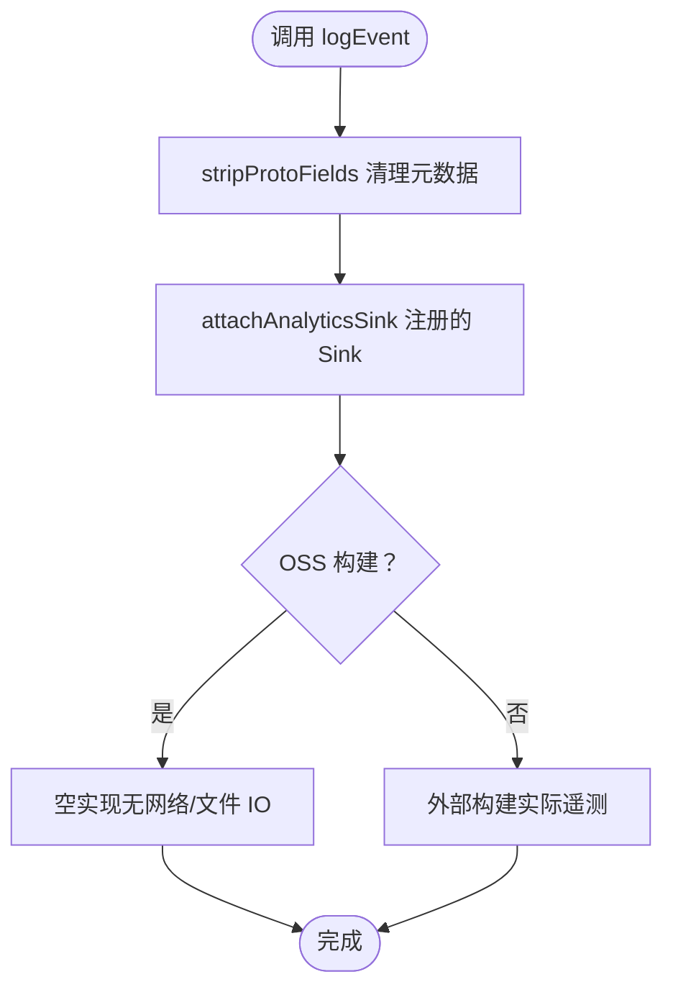
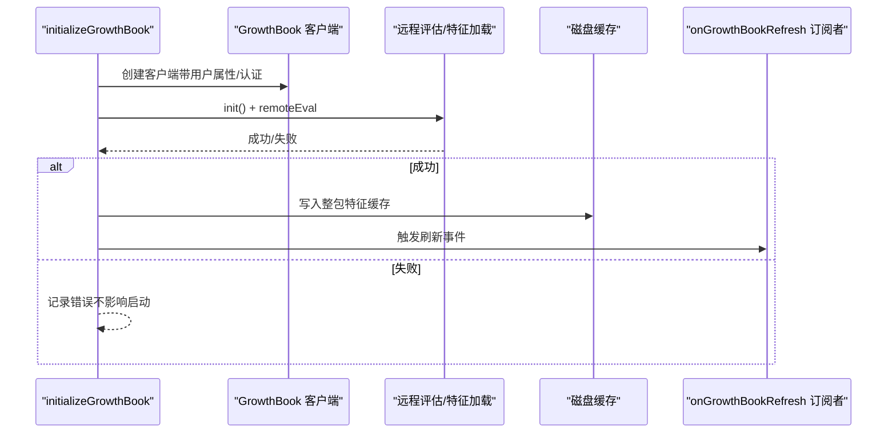
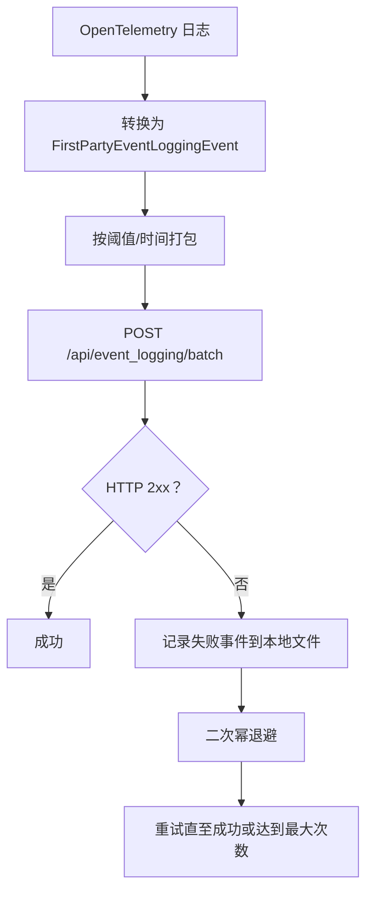
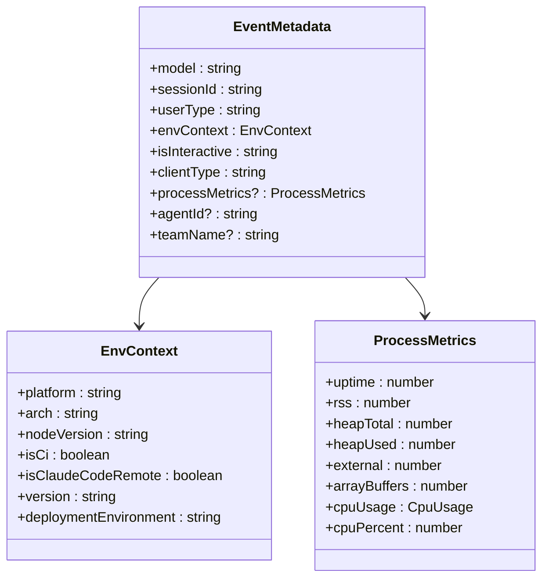
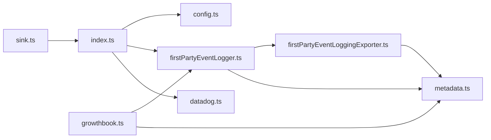

# 分析服务

<cite>
**本文引用的文件**
- [index.ts](file://src/services/analytics/index.ts)
- [config.ts](file://src/services/analytics/config.ts)
- [datadog.ts](file://src/services/analytics/datadog.ts)
- [growthbook.ts](file://src/services/analytics/growthbook.ts)
- [firstPartyEventLogger.ts](file://src/services/analytics/firstPartyEventLogger.ts)
- [firstPartyEventLoggingExporter.ts](file://src/services/analytics/firstPartyEventLoggingExporter.ts)
- [metadata.ts](file://src/services/analytics/metadata.ts)
- [sink.ts](file://src/services/analytics/sink.ts)
- [bridgeMain.ts](file://src/bridge/bridgeMain.ts)
</cite>

## 目录
1. [简介](#简介)
2. [项目结构](#项目结构)
3. [核心组件](#核心组件)
4. [架构总览](#架构总览)
5. [详细组件分析](#详细组件分析)
6. [依赖关系分析](#依赖关系分析)
7. [性能考量](#性能考量)
8. [故障排查指南](#故障排查指南)
9. [结论](#结论)
10. [附录](#附录)

## 简介
本文件为 free-code 的分析服务 API 参考文档，聚焦事件收集接口、指标上报 API、实验分配与 A/B 测试配置、Datadog 集成、增长书（GrowthBook）配置、元数据收集与事件导出机制、分析客户端初始化、事件追踪、性能监控与用户行为分析接口。同时涵盖事件格式规范、采样策略、隐私保护与数据匿名化处理、分析配置选项、环境变量设置、批量上传与离线处理能力。

在开源构建中，分析系统默认处于“兼容边界”模式：所有公开 API 均存在但不执行任何遥测操作，以确保现有调用点无需修改即可运行。本文将明确区分“公开 API（兼容层）”与“实际遥测实现（外部构建）”，并给出 OSS 构建下的行为说明。

## 项目结构
分析服务位于 src/services/analytics 目录下，核心模块包括：
- 公开 API 兼容层：事件日志、采样、隐私开关等
- Datadog 集成：在 OSS 构建中禁用
- 增长书（GrowthBook）：实验分组、特征门控、曝光日志
- 第一方事件日志：OpenTelemetry 导出器、失败重试、离线存储
- 元数据收集：环境上下文、进程指标、会话信息、订阅与代理信息
- 采样与隐私：全局禁用开关、反馈调查抑制
- 水龙头（Sink）：遥测水龙头初始化（OSS 构建中为空实现）

**图表来源**
- [index.ts:1-41](file://src/services/analytics/index.ts#L1-L41)
- [config.ts:1-39](file://src/services/analytics/config.ts#L1-L39)
- [datadog.ts:1-13](file://src/services/analytics/datadog.ts#L1-L13)
- [growthbook.ts:1-120](file://src/services/analytics/growthbook.ts#L1-L120)
- [firstPartyEventLogger.ts:1-49](file://src/services/analytics/firstPartyEventLogger.ts#L1-L49)
- [firstPartyEventLoggingExporter.ts:73-139](file://src/services/analytics/firstPartyEventLoggingExporter.ts#L73-L139)
- [metadata.ts:472-743](file://src/services/analytics/metadata.ts#L472-L743)
- [sink.ts:1-11](file://src/services/analytics/sink.ts#L1-L11)

**章节来源**
- [index.ts:1-41](file://src/services/analytics/index.ts#L1-L41)
- [config.ts:1-39](file://src/services/analytics/config.ts#L1-L39)
- [datadog.ts:1-13](file://src/services/analytics/datadog.ts#L1-L13)
- [growthbook.ts:1-120](file://src/services/analytics/growthbook.ts#L1-L120)
- [firstPartyEventLogger.ts:1-49](file://src/services/analytics/firstPartyEventLogger.ts#L1-L49)
- [firstPartyEventLoggingExporter.ts:73-139](file://src/services/analytics/firstPartyEventLoggingExporter.ts#L73-L139)
- [metadata.ts:472-743](file://src/services/analytics/metadata.ts#L472-L743)
- [sink.ts:1-11](file://src/services/analytics/sink.ts#L1-L11)

## 核心组件
- 公开 API 兼容层（index.ts）
  - 提供事件日志接口：同步与异步日志函数、附加自定义 Sink、元数据清理工具
  - 在 OSS 构建中，这些函数均为“空实现”，仅保留签名以兼容调用点
- 隐私与禁用开关（config.ts）
  - 统一判断是否禁用分析：测试环境、第三方云提供商标记、隐私级别
  - 反馈调查抑制逻辑（不阻断第三方云提供商）
- Datadog 集成（datadog.ts）
  - 初始化返回 false，事件写入函数为空实现；关闭函数为空
- 增长书（GrowthBook）（growthbook.ts）
  - 用户属性、实验分组、特征值获取（阻塞与非阻塞）、曝光日志、刷新监听
  - 支持环境变量覆盖、本地配置覆盖、远程评估缓存与磁盘同步
- 第一方事件日志（firstPartyEventLogger.ts）
  - 采样配置、事件写入、启用状态、初始化与重新初始化
  - 在 OSS 构建中，全部为“空实现”
- 导出器（firstPartyEventLoggingExporter.ts）
  - OpenTelemetry 批量导出器：时间/大小阈值触发、失败事件追加日志、二次幂退避重试、分批发送、认证回退
  - 支持离线重试与失败文件管理
- 元数据（metadata.ts）
  - 环境上下文、进程指标、会话与代理信息、订阅类型、MCP/技能名称脱敏、工具输入截断与序列化
- 水龙头（sink.ts）
  - 初始化入口（OSS 构建中为空实现）

**章节来源**
- [index.ts:12-41](file://src/services/analytics/index.ts#L12-L41)
- [config.ts:11-39](file://src/services/analytics/config.ts#L11-L39)
- [datadog.ts:1-13](file://src/services/analytics/datadog.ts#L1-L13)
- [growthbook.ts:420-485](file://src/services/analytics/growthbook.ts#L420-L485)
- [firstPartyEventLogger.ts:10-49](file://src/services/analytics/firstPartyEventLogger.ts#L10-L49)
- [firstPartyEventLoggingExporter.ts:73-139](file://src/services/analytics/firstPartyEventLoggingExporter.ts#L73-L139)
- [metadata.ts:472-743](file://src/services/analytics/metadata.ts#L472-L743)
- [sink.ts:1-11](file://src/services/analytics/sink.ts#L1-L11)

## 架构总览
分析服务采用“公开 API 兼容层 + 多后端实现”的分层设计。在 OSS 构建中，Datadog 与第一方事件日志均被禁用，仅保留 API 签名；在外部构建中，GrowthBook 负责实验与特征门控，第一方事件日志通过 OpenTelemetry 导出器批量上报并具备离线重试能力。

**图表来源**
- [index.ts:30-38](file://src/services/analytics/index.ts#L30-L38)
- [firstPartyEventLogger.ts:30-33](file://src/services/analytics/firstPartyEventLogger.ts#L30-L33)
- [firstPartyEventLoggingExporter.ts:277-377](file://src/services/analytics/firstPartyEventLoggingExporter.ts#L277-L377)
- [firstPartyEventLoggingExporter.ts:429-517](file://src/services/analytics/firstPartyEventLoggingExporter.ts#L429-L517)

## 详细组件分析

### 公开 API 兼容层（index.ts）
- 功能要点
  - 事件日志接口：logEvent、logEventAsync
  - 自定义 Sink 附加：attachAnalyticsSink
  - 元数据清理：stripProtoFields（移除协议字段键前缀）
  - 类型安全：AnalyticsMetadata_I_VERIFIED_THIS_IS_NOT_CODE_OR_FILEPATHS 用于标注已验证非敏感字符串
- 行为特性
  - OSS 构建中，所有函数为空实现，避免引入遥测依赖
  - 保留签名以兼容调用点，便于切换到外部构建时无缝迁移

**图表来源**
- [index.ts:12-41](file://src/services/analytics/index.ts#L12-L41)

**章节来源**
- [index.ts:12-41](file://src/services/analytics/index.ts#L12-L41)

### Datadog 集成（datadog.ts）
- 功能要点
  - initializeDatadog 返回 false（OSS 构建中不初始化）
  - trackDatadogEvent 为空实现（不产生网络请求）
  - shutdownDatadog 为空实现
- 使用建议
  - 在 OSS 构建中，调用这些函数不会产生任何副作用
  - 切换到外部构建时，需确保 Datadog 客户端正确初始化

**章节来源**
- [datadog.ts:1-13](file://src/services/analytics/datadog.ts#L1-L13)

### 增长书（GrowthBook）配置与实验分配
- 用户属性与目标
  - 用户标识、会话 ID、设备 ID、平台、组织/账户 UUID、订阅类型、首 token 时间、邮箱、应用版本、GitHub Actions 元数据
- 实验与特征
  - 远程评估（remoteEval）：预计算特征值，减少本地规则评估开销
  - 缓存与磁盘同步：每次成功加载后整包写入磁盘，保证跨进程一致性
  - 曝光日志：首次访问特征时记录实验曝光，支持去重
  - 刷新监听：onGrowthBookRefresh 提供订阅机制，用于重建依赖特征值的对象
- 环境与配置覆盖
  - 环境变量覆盖（仅 ant 用户）：CLAUDE_INTERNAL_FC_OVERRIDES
  - 本地配置覆盖（ant 用户）：/config Gates 页面动态修改
- 初始化与认证
  - 在信任建立后才使用认证头；未建立信任时使用磁盘缓存
  - 重新初始化：当认证可用性变化时重建客户端

**图表来源**
- [growthbook.ts:488-664](file://src/services/analytics/growthbook.ts#L488-L664)
- [growthbook.ts:327-417](file://src/services/analytics/growthbook.ts#L327-L417)
- [growthbook.ts:139-157](file://src/services/analytics/growthbook.ts#L139-L157)

**章节来源**
- [growthbook.ts:28-48](file://src/services/analytics/growthbook.ts#L28-L48)
- [growthbook.ts:420-485](file://src/services/analytics/growthbook.ts#L420-L485)
- [growthbook.ts:622-664](file://src/services/analytics/growthbook.ts#L622-L664)
- [growthbook.ts:734-775](file://src/services/analytics/growthbook.ts#L734-L775)
- [growthbook.ts:139-157](file://src/services/analytics/growthbook.ts#L139-L157)

### 第一方事件日志与导出机制
- 采样与启用
  - getEventSamplingConfig：返回空配置（OSS 构建中不采样）
  - is1PEventLoggingEnabled：返回 false（OSS 构建中禁用）
- 导出器（FirstPartyEventLoggingExporter）
  - 批量阈值：默认最大批次 200，时间间隔 5 秒
  - 失败重试：二次幂退避，最多尝试 8 次；失败事件追加到当前会话失败文件
  - 分批发送：按批次大小切分，批次间延迟
  - 认证回退：遇到 401 时自动降级为无认证请求
  - 离线重试：启动时扫描上一次会话失败文件并重试
- 数据格式
  - 支持两类事件：ClaudeCodeInternalEvent、GrowthbookExperimentEvent
  - 将 OpenTelemetry 日志转换为服务端期望的 JSON 结构，并进行 PII 字段剥离

**图表来源**
- [firstPartyEventLoggingExporter.ts:277-377](file://src/services/analytics/firstPartyEventLoggingExporter.ts#L277-L377)
- [firstPartyEventLoggingExporter.ts:379-428](file://src/services/analytics/firstPartyEventLoggingExporter.ts#L379-L428)
- [firstPartyEventLoggingExporter.ts:429-517](file://src/services/analytics/firstPartyEventLoggingExporter.ts#L429-L517)

**章节来源**
- [firstPartyEventLogger.ts:10-49](file://src/services/analytics/firstPartyEventLogger.ts#L10-L49)
- [firstPartyEventLoggingExporter.ts:73-139](file://src/services/analytics/firstPartyEventLoggingExporter.ts#L73-L139)
- [firstPartyEventLoggingExporter.ts:277-377](file://src/services/analytics/firstPartyEventLoggingExporter.ts#L277-L377)
- [firstPartyEventLoggingExporter.ts:429-517](file://src/services/analytics/firstPartyEventLoggingExporter.ts#L429-L517)

### 元数据收集与事件格式规范
- 核心元数据（EventMetadata）
  - 模型、会话 ID、用户类型、Beta 版本、环境上下文、交互性、客户端类型、SWE-Bench 相关字段、代理/团队识别、订阅类型、仓库远程哈希等
- 环境上下文（EnvContext）
  - 平台、架构、Node 版本、终端、包管理器与运行时、CI/容器/远程环境、WSL/Linux 发行版、VCS、部署环境、GitHub Actions 信息等
- 进程指标（ProcessMetrics）
  - 内存（rss/heap/external/arrayBuffers/constrainedMemory）、CPU 使用与百分比、uptime
- 工具与输入脱敏
  - MCP 工具名称脱敏：mcp__<server>__<tool> → mcp_tool（除非满足特定传输/URL 白名单）
  - 技能名称提取：从 Skill 工具输入中提取
  - 工具输入截断：字符串超长截断、深度限制、集合项数量限制、JSON 最大长度限制
- 文件扩展名脱敏
  - 超长扩展名替换为 other，避免泄露哈希类文件名
- 事件格式（第一方导出）
  - 环境字段（snake_case）、核心字段（snake_case）、认证信息、额外元数据（additional_metadata，Base64 编码 JSON）

**图表来源**
- [metadata.ts:472-743](file://src/services/analytics/metadata.ts#L472-L743)
- [metadata.ts:414-452](file://src/services/analytics/metadata.ts#L414-L452)
- [metadata.ts:454-467](file://src/services/analytics/metadata.ts#L454-L467)

**章节来源**
- [metadata.ts:472-743](file://src/services/analytics/metadata.ts#L472-L743)
- [metadata.ts:102-116](file://src/services/analytics/metadata.ts#L102-L116)
- [metadata.ts:236-303](file://src/services/analytics/metadata.ts#L236-L303)
- [metadata.ts:311-337](file://src/services/analytics/metadata.ts#L311-L337)

### 隐私保护与数据匿名化
- 全局禁用策略
  - 测试环境、第三方云提供商标记、隐私级别为 no-telemetry 或 essential-traffic 时禁用分析
- 反馈调查抑制
  - 不阻断第三方云提供商，但本地 UI 提示不上传转录数据
- PII 字段剥离
  - 导出前对 _PROTO_* 键进行剥离，防止敏感列落入通用访问的 additional_metadata
- 工具名称与输入脱敏
  - MCP 工具名称统一脱敏；工具输入按长度/深度/集合项数截断并序列化
- 文件扩展名脱敏
  - 超长扩展名统一替换为 other

**章节来源**
- [config.ts:11-39](file://src/services/analytics/config.ts#L11-L39)
- [firstPartyEventLoggingExporter.ts:714-726](file://src/services/analytics/firstPartyEventLoggingExporter.ts#L714-L726)
- [metadata.ts:70-77](file://src/services/analytics/metadata.ts#L70-L77)
- [metadata.ts:236-303](file://src/services/analytics/metadata.ts#L236-L303)
- [metadata.ts:311-337](file://src/services/analytics/metadata.ts#L311-L337)

### 分析配置选项与环境变量
- 隐私与禁用
  - NODE_ENV=‘test’、CLAUDE_CODE_USE_BEDROCK、CLAUDE_CODE_USE_VERTEX、CLAUDE_CODE_USE_FOUNDRY、隐私级别
- GrowthBook
  - CLAUDE_INTERNAL_FC_OVERRIDES（仅 ant 用户）：覆盖特征值
  - /config Gates 页面：动态覆盖（ant 用户）
  - CLAUDE_CODE_GB_BASE_URL：指定增长书 API 主机（ant 用户）
- 第一方事件日志
  - tengu_1p_event_batch_config：基础 URL、超时、批次大小、退避参数等（由外部构建注入）
- Datadog
  - 初始化在 OSS 构建中为空实现
- 其他
  - OTEL_LOG_TOOL_DETAILS：开启工具详情日志（MCP/技能名称）
  - CLAUDE_CODE_ENTRYPOINT：入口点（如 local-agent）
  - CI/GITHUB_ACTIONS 等环境变量：影响环境上下文与采样

**章节来源**
- [config.ts:11-39](file://src/services/analytics/config.ts#L11-L39)
- [growthbook.ts:167-192](file://src/services/analytics/growthbook.ts#L167-L192)
- [growthbook.ts:211-220](file://src/services/analytics/growthbook.ts#L211-L220)
- [growthbook.ts:503-506](file://src/services/analytics/growthbook.ts#L503-L506)
- [firstPartyEventLoggingExporter.ts:112-139](file://src/services/analytics/firstPartyEventLoggingExporter.ts#L112-L139)
- [metadata.ts:86-88](file://src/services/analytics/metadata.ts#L86-L88)

### 批量上传与离线处理
- 批量阈值
  - 默认最大批次 200，时间间隔 5 秒
- 失败重试
  - 二次幂退避（baseAttempts^2），最多 8 次
  - 失败事件追加到当前会话失败文件（JSON Lines）
- 启动重试
  - 启动时扫描当前会话历史失败文件并重试
- 认证回退
  - 遇到 401 自动降级为无认证请求
- 分批发送与延迟
  - 按批次大小切分，批次间可配置延迟

**章节来源**
- [firstPartyEventLoggingExporter.ts:73-139](file://src/services/analytics/firstPartyEventLoggingExporter.ts#L73-L139)
- [firstPartyEventLoggingExporter.ts:277-377](file://src/services/analytics/firstPartyEventLoggingExporter.ts#L277-L377)
- [firstPartyEventLoggingExporter.ts:429-517](file://src/services/analytics/firstPartyEventLoggingExporter.ts#L429-L517)
- [firstPartyEventLoggingExporter.ts:527-615](file://src/services/analytics/firstPartyEventLoggingExporter.ts#L527-L615)

### 分析客户端初始化与桥接集成
- 初始化流程
  - 公开 API：logEvent/logEventAsync（OSS 构建中为空）
  - 第一方事件日志：initialize1PEventLogging（OSS 构建中为空）
  - Datadog：initializeDatadog（OSS 构建中返回 false）
  - GrowthBook：initializeGrowthBook（根据信任与认证状态创建客户端）
- 桥接集成（bridgeMain.ts）
  - 在桥接生命周期中调用 shutdownDatadog、shutdown1PEventLogging、checkGate_CACHED_OR_BLOCKING 等分析相关函数
  - 通过 AnalyticsMetadata_I_VERIFIED_THIS_IS_NOT_CODE_OR_FILEPATHS 类型标注确保日志元数据不含敏感内容

**章节来源**
- [bridgeMain.ts:5-12](file://src/bridge/bridgeMain.ts#L5-L12)
- [bridgeMain.ts:2044-2048](file://src/bridge/bridgeMain.ts#L2044-L2048)
- [index.ts:30-38](file://src/services/analytics/index.ts#L30-L38)
- [firstPartyEventLogger.ts:46-48](file://src/services/analytics/firstPartyEventLogger.ts#L46-L48)
- [datadog.ts:5-7](file://src/services/analytics/datadog.ts#L5-L7)
- [growthbook.ts:622-664](file://src/services/analytics/growthbook.ts#L622-L664)

## 依赖关系分析
- 模块耦合
  - index.ts 作为公开 API 边界，低耦合，仅依赖隐私开关与元数据清理
  - growthbook.ts 依赖用户状态、认证头、配置与调试工具，高内聚于实验与特征门控
  - firstPartyEventLogger.ts 依赖 growthbook 的实验曝光日志与采样配置（OSS 构建中为空）
  - firstPartyEventLoggingExporter.ts 依赖 OpenTelemetry、HTTP 客户端、文件系统与用户代理
  - metadata.ts 依赖大量运行时信息（平台、Git、订阅、代理等），负责统一格式化
- 外部依赖
  - @growthbook/growthbook：实验与特征门控
  - @opentelemetry/*：日志记录与导出
  - axios：HTTP 请求
  - lodash-es：memoize、isEqual 等
- 循环依赖
  - 通过“公开 API 兼容层”避免直接循环；导出器通过回调注入 killswitch 与调度器，避免导入环

**图表来源**
- [index.ts:1-41](file://src/services/analytics/index.ts#L1-L41)
- [config.ts:1-39](file://src/services/analytics/config.ts#L1-L39)
- [growthbook.ts:1-26](file://src/services/analytics/growthbook.ts#L1-L26)
- [firstPartyEventLogger.ts:1-49](file://src/services/analytics/firstPartyEventLogger.ts#L1-L49)
- [firstPartyEventLoggingExporter.ts:1-36](file://src/services/analytics/firstPartyEventLoggingExporter.ts#L1-L36)
- [metadata.ts:1-42](file://src/services/analytics/metadata.ts#L1-L42)
- [sink.ts:1-11](file://src/services/analytics/sink.ts#L1-L11)
- [datadog.ts:1-13](file://src/services/analytics/datadog.ts#L1-L13)

**章节来源**
- [index.ts:1-41](file://src/services/analytics/index.ts#L1-L41)
- [growthbook.ts:1-26](file://src/services/analytics/growthbook.ts#L1-L26)
- [firstPartyEventLoggingExporter.ts:1-36](file://src/services/analytics/firstPartyEventLoggingExporter.ts#L1-L36)

## 性能考量
- 启动路径
  - GrowthBook 初始化采用记忆化与延迟创建，避免重复网络请求
  - 非阻塞特征读取（getFeatureValue_CACHED_MAY_BE_STALE）优先使用内存缓存，必要时回退磁盘缓存
- 导出性能
  - 批量阈值与时间间隔可调，默认 200 事件/5 秒，降低网络开销
  - 分批发送与批次间延迟减少单次请求压力
- 重试策略
  - 二次幂退避避免雪崩效应；达到最大尝试次数后丢弃，防止无限占用资源
- 资源采集
  - 进程指标按需计算，失败时降级为空，避免影响主流程

[本节为通用性能讨论，不直接分析具体文件]

## 故障排查指南
- Datadog
  - initializeDatadog 返回 false，trackDatadogEvent/shutdownDatadog 为空实现；若期望有遥测，请确认构建类型
- 第一方事件日志
  - 若出现“导出失败”错误，检查失败文件（telemetry 目录下以 1p_failed_events 开头）并查看最近一次会话的 JSON Lines 文件
  - 关注 401 错误：导出器会自动回退为无认证请求；若仍失败，检查认证头生成逻辑与令牌有效期
  - 批次过大导致超时：调整 maxBatchSize 或 baseBackoffDelayMs
- GrowthBook
  - 未建立信任时仅使用磁盘缓存：等待信任对话完成或非交互式会话建立
  - 特征值未更新：确认周期刷新是否生效，或使用 onGrowthBookRefresh 订阅重建依赖对象
- 隐私与禁用
  - 若分析完全不工作：检查 NODE_ENV、第三方云提供商标记与隐私级别设置

**章节来源**
- [datadog.ts:1-13](file://src/services/analytics/datadog.ts#L1-L13)
- [firstPartyEventLoggingExporter.ts:277-377](file://src/services/analytics/firstPartyEventLoggingExporter.ts#L277-L377)
- [firstPartyEventLoggingExporter.ts:527-615](file://src/services/analytics/firstPartyEventLoggingExporter.ts#L527-L615)
- [growthbook.ts:622-664](file://src/services/analytics/growthbook.ts#L622-L664)
- [config.ts:11-39](file://src/services/analytics/config.ts#L11-L39)

## 结论
free-code 的分析服务在 OSS 构建中以“兼容边界”形式提供完整的 API 签名，确保现有调用点无需修改即可运行；在外部构建中，GrowthBook 负责实验与特征门控，第一方事件日志通过 OpenTelemetry 导出器实现批量上报与离线重试，配合严格的隐私保护与数据匿名化策略，保障用户隐私与系统稳定性。通过合理的采样策略、环境变量配置与性能优化，分析服务能够在不同部署环境下高效运行。

[本节为总结性内容，不直接分析具体文件]

## 附录

### API 一览（OSS 构建中的行为）
- 公开事件日志
  - logEvent(eventName, metadata)：空实现
  - logEventAsync(eventName, metadata)：空实现
  - attachAnalyticsSink(sink)：空实现
  - stripProtoFields(metadata)：返回原字典（清理协议字段键前缀）
- Datadog
  - initializeDatadog()：返回 false
  - trackDatadogEvent(name, props)：空实现
  - shutdownDatadog()：空实现
- 第一方事件日志
  - getEventSamplingConfig()：返回空对象
  - shouldSampleEvent(name)：返回 0
  - is1PEventLoggingEnabled()：返回 false
  - logEventTo1P(name, metadata)：空实现
  - initialize1PEventLogging()：空实现
  - reinitialize1PEventLoggingIfConfigChanged()：空实现
  - shutdown1PEventLogging()：空实现
- 隐私与禁用
  - isAnalyticsDisabled()：根据环境与隐私级别判断
  - isFeedbackSurveyDisabled()：根据环境与隐私级别判断

**章节来源**
- [index.ts:12-41](file://src/services/analytics/index.ts#L12-L41)
- [datadog.ts:1-13](file://src/services/analytics/datadog.ts#L1-L13)
- [firstPartyEventLogger.ts:10-49](file://src/services/analytics/firstPartyEventLogger.ts#L10-L49)
- [config.ts:11-39](file://src/services/analytics/config.ts#L11-L39)