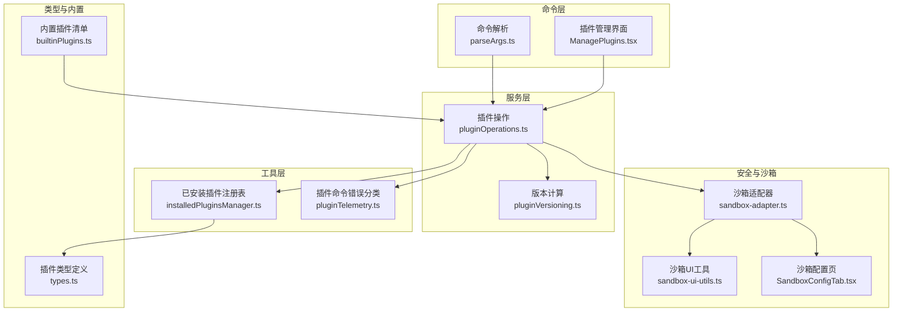
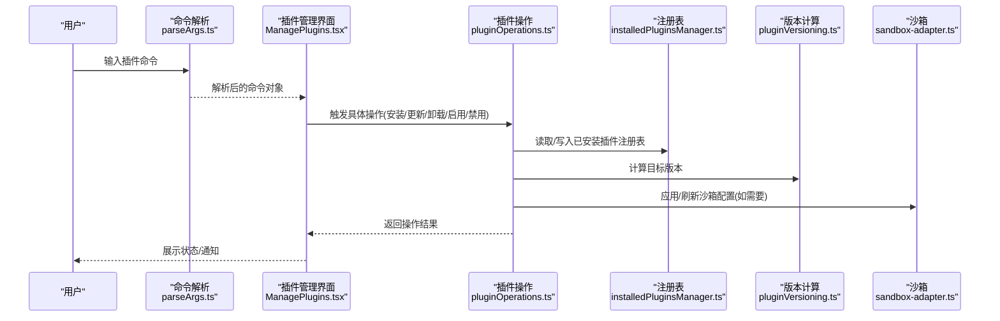
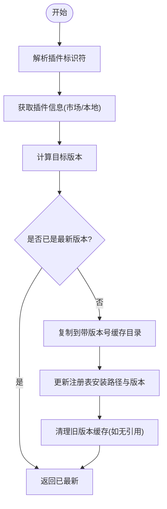
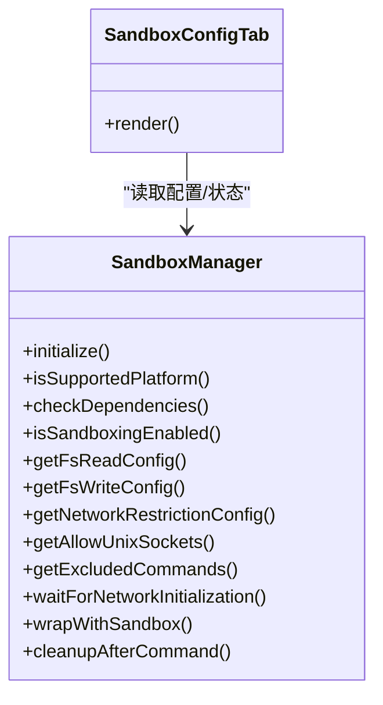
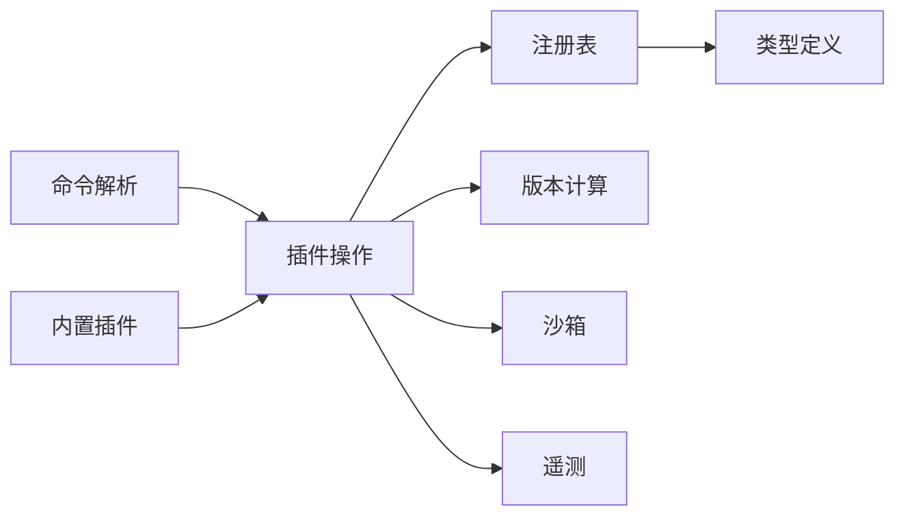

# 插件服务

<cite>
**本文引用的文件**
- [installedPluginsManager.ts](file://src/utils/plugins/installedPluginsManager.ts)
- [pluginOperations.ts](file://src/services/plugins/pluginOperations.ts)
- [parseArgs.ts](file://src/commands/plugin/parseArgs.ts)
- [ManagePlugins.tsx](file://src/commands/plugin/ManagePlugins.tsx)
- [pluginVersioning.ts](file://src/utils/plugins/pluginVersioning.ts)
- [pluginTelemetry.ts](file://src/utils/telemetry/pluginTelemetry.ts)
- [sandbox-adapter.ts](file://src/utils/sandbox/sandbox-adapter.ts)
- [sandbox-ui-utils.ts](file://src/utils/sandbox/sandbox-ui-utils.ts)
- [SandboxConfigTab.tsx](file://src/components/sandbox/SandboxConfigTab.tsx)
- [builtinPlugins.ts](file://src/plugins/builtinPlugins.ts)
- [types.ts](file://src/types/plugin.ts)
</cite>

## 目录
1. [简介](#简介)
2. [项目结构](#项目结构)
3. [核心组件](#核心组件)
4. [架构总览](#架构总览)
5. [详细组件分析](#详细组件分析)
6. [依赖关系分析](#依赖关系分析)
7. [性能考量](#性能考量)
8. [故障排查指南](#故障排查指南)
9. [结论](#结论)
10. [附录](#附录)

## 简介
本文件为 free-code 的插件服务提供详细的 API 参考与实现说明，覆盖插件安装管理、插件操作接口、插件生命周期管理、插件发现机制、版本管理、依赖解析与冲突处理、插件配置选项、安装策略、卸载流程、更新机制、以及安全检查、权限验证、沙箱隔离与资源限制等实现细节。内容基于仓库中实际存在的源码文件进行梳理与可视化呈现，帮助开发者与使用者理解插件系统的整体设计与使用方式。

## 项目结构
插件服务相关的核心模块分布于以下位置：
- 命令行入口与参数解析：src/commands/plugin
- 插件操作与生命周期：src/services/plugins
- 已安装插件注册表与状态管理：src/utils/plugins
- 版本计算与校验：src/utils/plugins
- 沙箱与安全控制：src/utils/sandbox 与 src/components/sandbox
- 类型定义：src/types
- 内置插件清单：src/plugins

图表来源
- [parseArgs.ts:1-103](file://src/commands/plugin/parseArgs.ts#L1-L103)
- [ManagePlugins.tsx:1074-1101](file://src/commands/plugin/ManagePlugins.tsx#L1074-L1101)
- [pluginOperations.ts:814-1053](file://src/services/plugins/pluginOperations.ts#L814-L1053)
- [pluginVersioning.ts:18-58](file://src/utils/plugins/pluginVersioning.ts#L18-L58)
- [installedPluginsManager.ts:423-949](file://src/utils/plugins/installedPluginsManager.ts#L423-L949)
- [pluginTelemetry.ts:238-259](file://src/utils/telemetry/pluginTelemetry.ts#L238-L259)
- [sandbox-adapter.ts:537-985](file://src/utils/sandbox/sandbox-adapter.ts#L537-L985)
- [sandbox-ui-utils.ts:1-12](file://src/utils/sandbox/sandbox-ui-utils.ts#L1-L12)
- [SandboxConfigTab.tsx:1-34](file://src/components/sandbox/SandboxConfigTab.tsx#L1-L34)
- [types.ts](file://src/types/plugin.ts)
- [builtinPlugins.ts](file://src/plugins/builtinPlugins.ts)

章节来源
- [parseArgs.ts:1-103](file://src/commands/plugin/parseArgs.ts#L1-L103)
- [ManagePlugins.tsx:1074-1101](file://src/commands/plugin/ManagePlugins.tsx#L1074-L1101)
- [pluginOperations.ts:814-1053](file://src/services/plugins/pluginOperations.ts#L814-L1053)
- [pluginVersioning.ts:18-58](file://src/utils/plugins/pluginVersioning.ts#L18-L58)
- [installedPluginsManager.ts:423-949](file://src/utils/plugins/installedPluginsManager.ts#L423-L949)
- [pluginTelemetry.ts:238-259](file://src/utils/telemetry/pluginTelemetry.ts#L238-L259)
- [sandbox-adapter.ts:537-985](file://src/utils/sandbox/sandbox-adapter.ts#L537-L985)
- [sandbox-ui-utils.ts:1-12](file://src/utils/sandbox/sandbox-ui-utils.ts#L1-L12)
- [SandboxConfigTab.tsx:1-34](file://src/components/sandbox/SandboxConfigTab.tsx#L1-L34)
- [types.ts](file://src/types/plugin.ts)
- [builtinPlugins.ts](file://src/plugins/builtinPlugins.ts)

## 核心组件
- 命令解析与CLI接口：负责将用户输入解析为具体插件操作命令（安装、卸载、启用、禁用、市场管理、验证等）。
- 插件操作服务：封装安装、更新、卸载、启用、禁用等操作流程，并处理非就地更新策略、版本路径与缓存管理。
- 已安装插件注册表：维护插件安装条目（含作用域、路径、版本、时间戳等），支持内存快照与磁盘读取，用于非就地更新场景。
- 版本计算：根据插件清单、市场信息、Git 提交 SHA 等来源计算版本号，确保一致性与可追溯性。
- 沙箱与安全：提供沙箱初始化、依赖检查、平台支持判断、运行时配置动态刷新、网络/文件系统/套接字等资源限制与违规检测。
- 错误分类与遥测：对网络、权限、验证等错误进行分类，辅助诊断与统计。
- 类型与内置插件：统一插件数据结构定义，内置插件清单作为默认可用集合。

章节来源
- [parseArgs.ts:1-103](file://src/commands/plugin/parseArgs.ts#L1-L103)
- [pluginOperations.ts:814-1053](file://src/services/plugins/pluginOperations.ts#L814-L1053)
- [installedPluginsManager.ts:423-949](file://src/utils/plugins/installedPluginsManager.ts#L423-L949)
- [pluginVersioning.ts:18-58](file://src/utils/plugins/pluginVersioning.ts#L18-L58)
- [sandbox-adapter.ts:537-985](file://src/utils/sandbox/sandbox-adapter.ts#L537-L985)
- [pluginTelemetry.ts:238-259](file://src/utils/telemetry/pluginTelemetry.ts#L238-L259)
- [types.ts](file://src/types/plugin.ts)
- [builtinPlugins.ts](file://src/plugins/builtinPlugins.ts)

## 架构总览
下图展示从 CLI 到插件操作、版本计算、注册表更新与沙箱控制的整体调用链路。

图表来源
- [parseArgs.ts:1-103](file://src/commands/plugin/parseArgs.ts#L1-L103)
- [ManagePlugins.tsx:1074-1101](file://src/commands/plugin/ManagePlugins.tsx#L1074-L1101)
- [pluginOperations.ts:814-1053](file://src/services/plugins/pluginOperations.ts#L814-L1053)
- [installedPluginsManager.ts:423-949](file://src/utils/plugins/installedPluginsManager.ts#L423-L949)
- [pluginVersioning.ts:18-58](file://src/utils/plugins/pluginVersioning.ts#L18-L58)
- [sandbox-adapter.ts:537-985](file://src/utils/sandbox/sandbox-adapter.ts#L537-L985)

## 详细组件分析

### 命令解析与CLI接口
- 功能概述
  - 将字符串命令解析为结构化命令对象，支持 install、uninstall、enable、disable、manage、marketplace、validate 等动作。
  - 支持短命令别名与 marketplace URL/路径识别。
- 关键行为
  - install 子命令支持 plugin@marketplace 格式或 marketplace URL/路径。
  - marketplace 子命令支持 add/remove/update/list 动作。
  - validate 子命令接收路径参数。
- 典型调用
  - CLI 解析后由插件管理界面或服务层执行对应操作。

章节来源
- [parseArgs.ts:1-103](file://src/commands/plugin/parseArgs.ts#L1-L103)

### 插件操作接口与生命周期
- 安装流程
  - 获取插件信息（来自市场或本地源）。
  - 计算版本（优先使用清单版本，其次市场提供的版本，再回退到 Git 提交 SHA）。
  - 对远程插件下载至临时目录并计算版本；对本地插件从源计算版本。
  - 若新版本不同于当前安装版本，则复制到带版本号的缓存目录。
  - 更新注册表中的安装路径与版本，不改变内存视图（需重启生效）。
- 卸载流程
  - 从注册表移除指定作用域的安装条目；若无剩余条目则删除该插件的全部记录。
  - 建议后续清理物理缓存目录以完成彻底卸载。
- 启用/禁用
  - 通过注册表标记插件状态；具体启用与否取决于运行时加载逻辑。
- 更新机制
  - 非就地更新策略：先在缓存中准备新版本，再更新注册表条目，避免运行时中断。
  - 检查是否已是最新版本；若是则返回“已最新”提示。
  - 清理不再被任何安装条目引用的旧版本缓存。
- 冲突与依赖
  - 注册表按作用域与项目路径区分安装条目，避免同插件多实例冲突。
  - 依赖解析与冲突处理由上层工具链负责，插件服务提供版本与路径管理支撑。

图表来源
- [pluginOperations.ts:814-1053](file://src/services/plugins/pluginOperations.ts#L814-L1053)
- [pluginVersioning.ts:18-58](file://src/utils/plugins/pluginVersioning.ts#L18-L58)

章节来源
- [pluginOperations.ts:814-1053](file://src/services/plugins/pluginOperations.ts#L814-L1053)
- [pluginVersioning.ts:18-58](file://src/utils/plugins/pluginVersioning.ts#L18-L58)

### 已安装插件注册表与状态管理
- 数据模型
  - 插件安装条目包含：作用域、安装路径、版本、安装时间、最后更新时间、Git 提交 SHA、项目路径（当作用域为项目级时）。
  - 注册表采用 V2 结构，支持多条目与跨作用域管理。
- 内存与磁盘一致性
  - 提供会话内内存快照（启动时加载，运行时不随后台操作更新）。
  - 提供直接从磁盘读取的能力，用于后台更新器检查变更而不影响当前会话视图。
  - 对比内存与磁盘差异，计算待更新数量，便于提示用户重启以应用更改。
- 增删改
  - 添加/更新：根据作用域与项目路径定位条目，更新或新增。
  - 删除：移除指定作用域与项目路径的条目；若无剩余条目则删除整个插件记录。
  - 移除已安装插件：仅更新注册表，不删除物理文件，建议配合缓存清理。

章节来源
- [installedPluginsManager.ts:423-949](file://src/utils/plugins/installedPluginsManager.ts#L423-L949)

### 版本管理与依赖解析
- 版本来源优先级
  - 插件清单中的版本字段（最高优先级）。
  - 来自市场的版本信息。
  - 来自安装路径的 Git 提交 SHA。
  - 回退为“unknown”。
- 依赖解析与冲突处理
  - 通过作用域与项目路径区分不同安装实例，避免同插件多实例冲突。
  - 上层工具链负责依赖解析与冲突解决，插件服务提供版本与路径管理支撑。

章节来源
- [pluginVersioning.ts:18-58](file://src/utils/plugins/pluginVersioning.ts#L18-L58)
- [installedPluginsManager.ts:423-949](file://src/utils/plugins/installedPluginsManager.ts#L423-L949)

### 沙箱隔离与安全控制
- 沙箱能力
  - 平台支持检测与依赖检查。
  - 运行时配置动态刷新（基于设置变化）。
  - 文件系统读写限制、网络访问限制、Unix 套接字与本地绑定例外、代理端口配置。
  - 违规事件存储与错误标注，便于诊断。
- UI 展示
  - 提供沙箱配置页，展示当前启用状态、读写限制、网络限制、允许的 Unix 套接字、排除命令列表等。
  - 提供清理函数，避免裸 Git 仓库残留影响安全。
- 使用建议
  - 在需要强制隔离与权限控制的场景启用沙箱。
  - 设置变更后及时刷新配置，确保策略一致。

图表来源
- [sandbox-adapter.ts:537-985](file://src/utils/sandbox/sandbox-adapter.ts#L537-L985)
- [SandboxConfigTab.tsx:1-34](file://src/components/sandbox/SandboxConfigTab.tsx#L1-L34)

章节来源
- [sandbox-adapter.ts:537-985](file://src/utils/sandbox/sandbox-adapter.ts#L537-L985)
- [sandbox-ui-utils.ts:1-12](file://src/utils/sandbox/sandbox-ui-utils.ts#L1-L12)
- [SandboxConfigTab.tsx:1-34](file://src/components/sandbox/SandboxConfigTab.tsx#L1-L34)

### 插件发现机制与内置插件
- 发现机制
  - 通过市场标识符或本地源路径解析插件信息。
  - 支持 plugin@marketplace 格式与 marketplace URL/路径识别。
- 内置插件
  - 提供内置插件清单，作为默认可用集合，便于首次使用与基础功能保障。

章节来源
- [parseArgs.ts:1-103](file://src/commands/plugin/parseArgs.ts#L1-L103)
- [builtinPlugins.ts](file://src/plugins/builtinPlugins.ts)

### 插件配置选项与安装策略
- 配置选项
  - 沙箱启用、自动允许沙箱内 Bash、允许未沙箱命令、平台白名单、文件系统读写限制、网络限制、Unix 套接字与本地绑定例外、代理端口、忽略违规策略等。
- 安装策略
  - 非就地更新：先在缓存中准备新版本，再更新注册表，避免运行时中断。
  - 多实例隔离：按作用域与项目路径区分安装，避免冲突。
- 卸载流程
  - 注销注册表条目 → 清理物理缓存（建议步骤）。
- 更新机制
  - 检测是否已是最新 → 是则提示；否则复制到新版本缓存 → 更新注册表 → 清理旧版本。

章节来源
- [sandbox-adapter.ts:537-985](file://src/utils/sandbox/sandbox-adapter.ts#L537-L985)
- [pluginOperations.ts:814-1053](file://src/services/plugins/pluginOperations.ts#L814-L1053)
- [installedPluginsManager.ts:423-949](file://src/utils/plugins/installedPluginsManager.ts#L423-L949)

### 错误处理与遥测
- 错误分类
  - 网络类错误（DNS/连接/超时等）、未找到、权限/授权、验证/解析错误、未知错误。
- 遥测
  - 基于错误消息正则匹配进行分类，辅助统计与问题定位。

章节来源
- [pluginTelemetry.ts:238-259](file://src/utils/telemetry/pluginTelemetry.ts#L238-L259)

## 依赖关系分析
- 组件耦合
  - 命令层与服务层解耦：命令解析仅生成结构化命令，具体执行由服务层完成。
  - 服务层依赖注册表与版本计算，必要时联动沙箱。
  - 注册表与类型定义强关联，保证数据结构一致性。
- 外部依赖
  - 沙箱依赖平台能力与系统环境；UI 依赖设置变化事件以动态刷新配置。
- 循环依赖
  - 当前结构清晰，未见循环依赖迹象。

图表来源
- [parseArgs.ts:1-103](file://src/commands/plugin/parseArgs.ts#L1-L103)
- [pluginOperations.ts:814-1053](file://src/services/plugins/pluginOperations.ts#L814-L1053)
- [installedPluginsManager.ts:423-949](file://src/utils/plugins/installedPluginsManager.ts#L423-L949)
- [pluginVersioning.ts:18-58](file://src/utils/plugins/pluginVersioning.ts#L18-L58)
- [pluginTelemetry.ts:238-259](file://src/utils/telemetry/pluginTelemetry.ts#L238-L259)
- [types.ts](file://src/types/plugin.ts)
- [builtinPlugins.ts](file://src/plugins/builtinPlugins.ts)

章节来源
- [parseArgs.ts:1-103](file://src/commands/plugin/parseArgs.ts#L1-L103)
- [pluginOperations.ts:814-1053](file://src/services/plugins/pluginOperations.ts#L814-L1053)
- [installedPluginsManager.ts:423-949](file://src/utils/plugins/installedPluginsManager.ts#L423-L949)
- [pluginVersioning.ts:18-58](file://src/utils/plugins/pluginVersioning.ts#L18-L58)
- [pluginTelemetry.ts:238-259](file://src/utils/telemetry/pluginTelemetry.ts#L238-L259)
- [types.ts](file://src/types/plugin.ts)
- [builtinPlugins.ts](file://src/plugins/builtinPlugins.ts)

## 性能考量
- 非就地更新策略降低运行时中断风险，但会增加磁盘空间占用与缓存管理开销。
- 版本计算优先使用清单版本，减少网络请求与复杂解析成本。
- 注册表对比仅在需要时进行（如显示待更新数量），避免频繁磁盘读取。
- 沙箱初始化失败会优雅降级，不影响主流程，但应关注设置变更导致的配置刷新频率。

## 故障排查指南
- 网络相关错误
  - 现象：无法解析主机、连接被拒绝、超时、连接重置。
  - 排查：检查网络连通性、代理设置、防火墙规则。
- 权限相关错误
  - 现象：权限不足、未授权、拒绝访问。
  - 排查：确认用户权限、沙箱策略、文件系统访问限制。
- 插件未找到或格式错误
  - 现象：插件不存在、标识符格式不正确、清单解析失败。
  - 排查：核对插件标识符、市场地址、清单字段。
- 沙箱不可用
  - 现象：沙箱启用但平台不支持或依赖缺失。
  - 排查：查看沙箱不可用原因、升级平台或安装依赖。
- 待更新提示
  - 现象：注册表与内存视图不一致，提示重启以应用更新。
  - 排查：确认更新流程已完成且已重启应用。

章节来源
- [pluginTelemetry.ts:238-259](file://src/utils/telemetry/pluginTelemetry.ts#L238-L259)
- [sandbox-adapter.ts:537-985](file://src/utils/sandbox/sandbox-adapter.ts#L537-L985)
- [installedPluginsManager.ts:599-649](file://src/utils/plugins/installedPluginsManager.ts#L599-L649)

## 结论
本插件服务通过清晰的命令解析、稳健的插件操作与注册表管理、可靠的版本计算与非就地更新策略，以及完善的沙箱与安全控制，实现了从安装、更新、卸载到启用/禁用的全生命周期管理。结合错误分类与遥测，能够有效支撑开发与运维场景下的问题定位与优化。

## 附录
- 类型定义与内置插件
  - 类型定义确保数据结构一致性，内置插件提供默认可用集合。
- 命令菜单与交互
  - CLI 菜单与管理界面提供直观的操作入口，便于用户快速完成插件管理任务。

章节来源
- [types.ts](file://src/types/plugin.ts)
- [builtinPlugins.ts](file://src/plugins/builtinPlugins.ts)
- [ManagePlugins.tsx:1074-1101](file://src/commands/plugin/ManagePlugins.tsx#L1074-L1101)