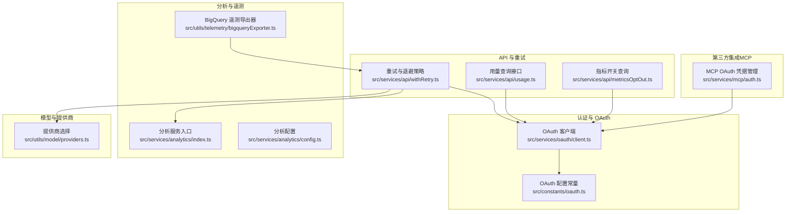
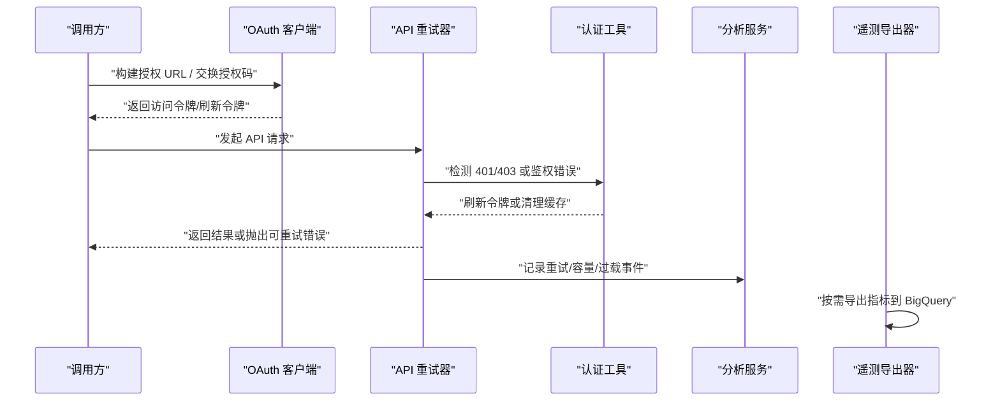
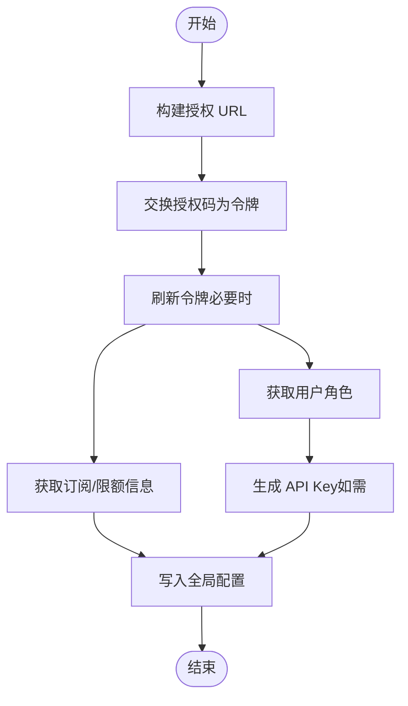
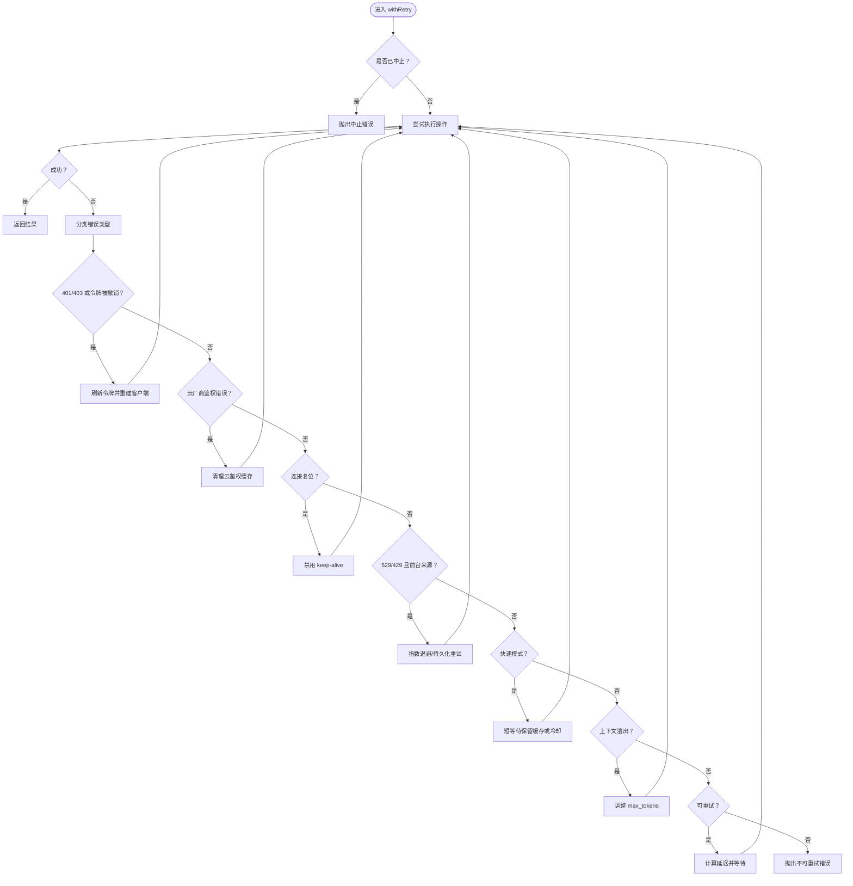
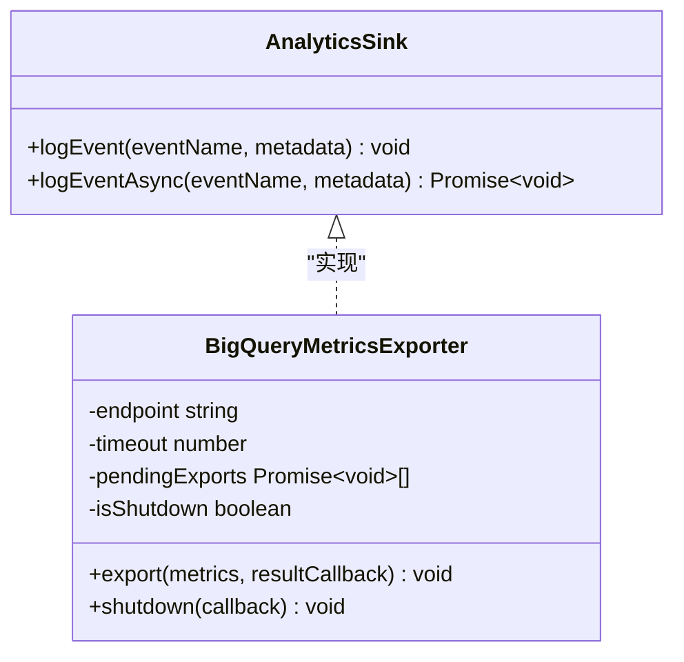
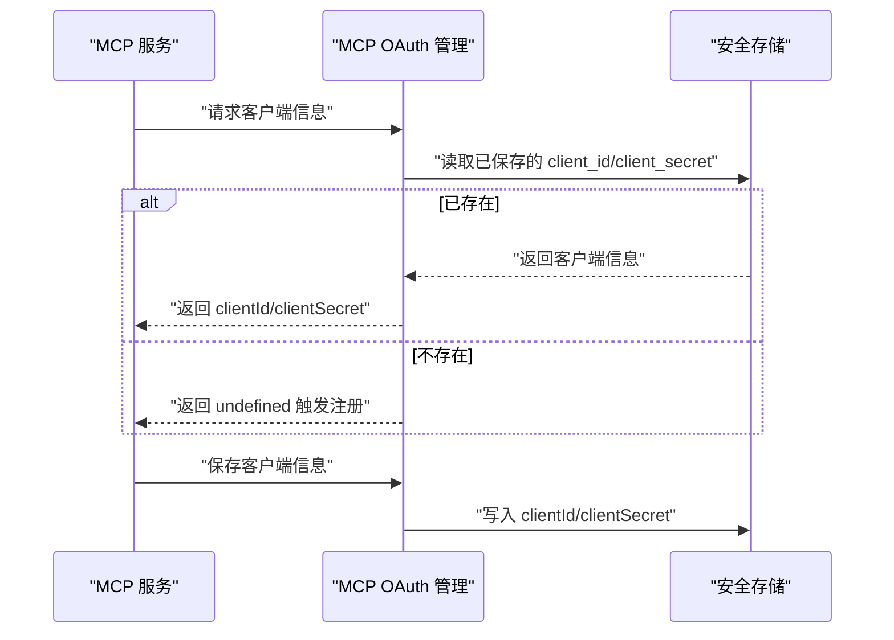
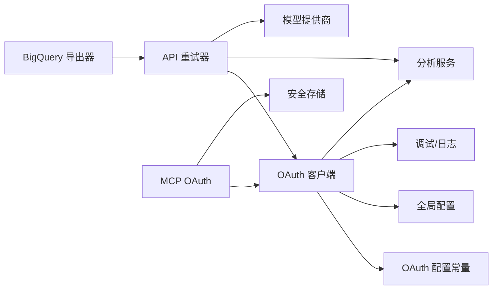

# 服务 API

<cite>
**本文引用的文件**
- [src/services/oauth/client.ts](file://src/services/oauth/client.ts)
- [src/constants/oauth.ts](file://src/constants/oauth.ts)
- [src/services/api/withRetry.ts](file://src/services/api/withRetry.ts)
- [src/services/api/usage.ts](file://src/services/api/usage.ts)
- [src/services/api/metricsOptOut.ts](file://src/services/api/metricsOptOut.ts)
- [src/services/analytics/index.ts](file://src/services/analytics/index.ts)
- [src/services/analytics/config.ts](file://src/services/analytics/config.ts)
- [src/utils/telemetry/bigqueryExporter.ts](file://src/utils/telemetry/bigqueryExporter.ts)
- [src/utils/model/providers.ts](file://src/utils/model/providers.ts)
- [src/services/mcp/auth.ts](file://src/services/mcp/auth.ts)
</cite>

## 目录
1. [简介](#简介)
2. [项目结构](#项目结构)
3. [核心组件](#核心组件)
4. [架构总览](#架构总览)
5. [详细组件分析](#详细组件分析)
6. [依赖关系分析](#依赖关系分析)
7. [性能考量](#性能考量)
8. [故障排查指南](#故障排查指南)
9. [结论](#结论)
10. [附录](#附录)

## 简介
本文件为 free-code 的服务层 API 参考文档，覆盖以下主题：
- OAuth 认证客户端与令牌管理
- 分析服务（事件日志、遥测导出）
- HTTP 客户端重试与错误处理机制
- 第三方集成（MCP）的 OAuth 流程与凭据存储
- 服务配置项、环境变量、连接池与性能监控接口
- 扩展点、中间件机制与自定义服务开发指南

## 项目结构
服务层主要分布在如下模块：
- 认证与 OAuth：src/services/oauth/client.ts、src/constants/oauth.ts
- API 调用与重试：src/services/api/withRetry.ts、src/services/api/usage.ts、src/services/api/metricsOptOut.ts
- 分析与遥测：src/services/analytics/index.ts、src/services/analytics/config.ts、src/utils/telemetry/bigqueryExporter.ts
- 模型与提供商：src/utils/model/providers.ts
- 第三方集成（MCP）：src/services/mcp/auth.ts

**图表来源**
- [src/services/oauth/client.ts:1-595](file://src/services/oauth/client.ts#L1-L595)
- [src/constants/oauth.ts:127-163](file://src/constants/oauth.ts#L127-L163)
- [src/services/api/withRetry.ts:1-823](file://src/services/api/withRetry.ts#L1-L823)
- [src/services/api/usage.ts:49-63](file://src/services/api/usage.ts#L49-L63)
- [src/services/api/metricsOptOut.ts:39-159](file://src/services/api/metricsOptOut.ts#L39-L159)
- [src/services/analytics/index.ts:1-41](file://src/services/analytics/index.ts#L1-L41)
- [src/services/analytics/config.ts:1-38](file://src/services/analytics/config.ts#L1-L38)
- [src/utils/telemetry/bigqueryExporter.ts:1-44](file://src/utils/telemetry/bigqueryExporter.ts#L1-L44)
- [src/utils/model/providers.ts:1-42](file://src/utils/model/providers.ts#L1-L42)
- [src/services/mcp/auth.ts:1487-1518](file://src/services/mcp/auth.ts#L1487-L1518)

**章节来源**
- [src/services/oauth/client.ts:1-595](file://src/services/oauth/client.ts#L1-L595)
- [src/services/api/withRetry.ts:1-823](file://src/services/api/withRetry.ts#L1-L823)
- [src/services/analytics/index.ts:1-41](file://src/services/analytics/index.ts#L1-L41)

## 核心组件
- OAuth 客户端与令牌管理：负责构建授权 URL、交换授权码、刷新令牌、获取用户角色与 API Key、解析订阅信息与账户信息等。
- API 重试与退避：统一处理 429/529 过载、401/403 认证失败、云厂商鉴权错误、连接复位等，支持持久化重试、快速模式降级与令牌自动刷新。
- 分析服务：提供事件日志接口与遥测导出器，支持禁用策略与属性注入。
- MCP 集成：管理 MCP 服务器的 OAuth 客户端信息与安全存储。

**章节来源**
- [src/services/oauth/client.ts:135-302](file://src/services/oauth/client.ts#L135-L302)
- [src/services/api/withRetry.ts:170-517](file://src/services/api/withRetry.ts#L170-L517)
- [src/services/analytics/index.ts:20-41](file://src/services/analytics/index.ts#L20-L41)
- [src/services/mcp/auth.ts:1487-1518](file://src/services/mcp/auth.ts#L1487-L1518)

## 架构总览
下图展示服务层关键交互：客户端通过 OAuth 获取令牌，API 层使用重试策略与令牌刷新，分析与遥测贯穿调用链，MCP 作为第三方集成点参与凭据管理。

**图表来源**
- [src/services/oauth/client.ts:135-302](file://src/services/oauth/client.ts#L135-L302)
- [src/services/api/withRetry.ts:212-251](file://src/services/api/withRetry.ts#L212-L251)
- [src/utils/telemetry/bigqueryExporter.ts:40-44](file://src/utils/telemetry/bigqueryExporter.ts#L40-L44)

## 详细组件分析

### OAuth 客户端与认证服务
- 授权 URL 构建：支持 Claude.ai 与控制台授权、手动/本地回调、PKCE code_challenge、登录提示与方法参数。
- 授权码交换：向令牌端点发送授权码换取访问/刷新令牌，带超时与状态校验。
- 刷新令牌：根据请求作用域刷新令牌，自动拉取订阅与限额信息并写入全局配置。
- 用户角色与 API Key：从角色端点获取组织/工作区角色，必要时生成 API Key 并保存。
- 令牌过期判断与账户信息填充：支持从令牌解析组织 UUID、显示名、计费类型、订阅时间等，并在需要时回补全局配置。
- 环境变量注入：SDK 场景可通过环境变量直接注入账户信息，避免网络调用。

**图表来源**
- [src/services/oauth/client.ts:74-133](file://src/services/oauth/client.ts#L74-L133)
- [src/services/oauth/client.ts:135-172](file://src/services/oauth/client.ts#L135-L172)
- [src/services/oauth/client.ts:174-302](file://src/services/oauth/client.ts#L174-L302)
- [src/services/oauth/client.ts:304-370](file://src/services/oauth/client.ts#L304-L370)
- [src/services/oauth/client.ts:383-448](file://src/services/oauth/client.ts#L383-L448)
- [src/services/oauth/client.ts:479-543](file://src/services/oauth/client.ts#L479-L543)

**章节来源**
- [src/services/oauth/client.ts:74-133](file://src/services/oauth/client.ts#L74-L133)
- [src/services/oauth/client.ts:135-172](file://src/services/oauth/client.ts#L135-L172)
- [src/services/oauth/client.ts:174-302](file://src/services/oauth/client.ts#L174-L302)
- [src/services/oauth/client.ts:304-370](file://src/services/oauth/client.ts#L304-L370)
- [src/services/oauth/client.ts:383-448](file://src/services/oauth/client.ts#L383-L448)
- [src/services/oauth/client.ts:479-543](file://src/services/oauth/client.ts#L479-L543)

### API 客户端与重试机制
- 统一重试器 withRetry：支持最大重试次数、指数退避、抖动、持久化重试（无界等待）、529/429 背景任务丢弃策略、快速模式降级与回退模型触发。
- 错误分类与处理：
  - 401/403：触发 OAuth 401 处理（刷新令牌、清理缓存），必要时重新获取客户端实例。
  - 云厂商鉴权错误：AWS（凭证提供器错误/403）与 GCP（凭证刷新失败/401）分别清理缓存后重试。
  - 连接复位（ECONNRESET/EPIPE）：在特定特性开启时禁用 keep-alive 并重连。
  - 上下文溢出（max_tokens 超限）：动态调整 max_tokens 后重试。
- 前台/后台来源区分：前台来源（如 REPL、SDK、Agent）对 529 会重试，后台来源（摘要、建议等）遇到 529 直接放弃以避免放大效应。
- 快速模式：在 529/429 时优先短等待保留缓存，否则进入冷却或切换标准速度模型。
- 取消与中止：支持 AbortSignal，及时响应用户取消。

**图表来源**
- [src/services/api/withRetry.ts:170-517](file://src/services/api/withRetry.ts#L170-L517)

**章节来源**
- [src/services/api/withRetry.ts:170-517](file://src/services/api/withRetry.ts#L170-L517)
- [src/services/api/withRetry.ts:530-548](file://src/services/api/withRetry.ts#L530-L548)
- [src/services/api/withRetry.ts:609-621](file://src/services/api/withRetry.ts#L609-L621)
- [src/services/api/withRetry.ts:623-630](file://src/services/api/withRetry.ts#L623-L630)
- [src/services/api/withRetry.ts:631-644](file://src/services/api/withRetry.ts#L631-L644)
- [src/services/api/withRetry.ts:650-656](file://src/services/api/withRetry.ts#L650-L656)
- [src/services/api/withRetry.ts:669-694](file://src/services/api/withRetry.ts#L669-L694)
- [src/services/api/withRetry.ts:696-787](file://src/services/api/withRetry.ts#L696-L787)

### 分析服务与遥测导出
- 分析服务入口：提供 attachAnalyticsSink、logEvent、logEventAsync 等接口；在开放版本中这些调用为“兼容边界”，不产生实际行为。
- 分析配置：集中判断是否禁用分析（测试环境、第三方云提供商、隐私级别）。
- BigQuery 遥测导出器：基于 OpenTelemetry PushMetricExporter 实现，按需导出指标，支持启用状态检查与缓存、非交互会话识别、用户代理与认证头注入。

**图表来源**
- [src/services/analytics/index.ts:20-41](file://src/services/analytics/index.ts#L20-L41)
- [src/utils/telemetry/bigqueryExporter.ts:40-44](file://src/utils/telemetry/bigqueryExporter.ts#L40-L44)

**章节来源**
- [src/services/analytics/index.ts:1-41](file://src/services/analytics/index.ts#L1-L41)
- [src/services/analytics/config.ts:1-38](file://src/services/analytics/config.ts#L1-L38)
- [src/utils/telemetry/bigqueryExporter.ts:1-44](file://src/utils/telemetry/bigqueryExporter.ts#L1-L44)

### 第三方集成接口（MCP）
- OAuth 客户端信息存储与恢复：优先使用会话内存储的 clientId/clientSecret，其次使用服务器配置中的预设值，否则触发动态注册。
- 安全存储：使用受保护存储保存 OAuth 客户端信息，避免明文泄露。

**图表来源**
- [src/services/mcp/auth.ts:1487-1518](file://src/services/mcp/auth.ts#L1487-L1518)

**章节来源**
- [src/services/mcp/auth.ts:1487-1518](file://src/services/mcp/auth.ts#L1487-L1518)

## 依赖关系分析
- OAuth 客户端依赖 OAuth 配置常量与全局配置、调试与分析服务。
- API 重试器依赖认证工具（刷新令牌、清理缓存）、分析服务（事件上报）、模型提供商（统计标签）。
- 遥测导出器依赖分析服务与认证头注入。
- MCP 集成依赖 OAuth 客户端与安全存储。

**图表来源**
- [src/services/oauth/client.ts:1-595](file://src/services/oauth/client.ts#L1-L595)
- [src/constants/oauth.ts:127-163](file://src/constants/oauth.ts#L127-L163)
- [src/services/api/withRetry.ts:1-823](file://src/services/api/withRetry.ts#L1-L823)
- [src/utils/model/providers.ts:1-42](file://src/utils/model/providers.ts#L1-L42)
- [src/utils/telemetry/bigqueryExporter.ts:1-44](file://src/utils/telemetry/bigqueryExporter.ts#L1-L44)
- [src/services/mcp/auth.ts:1487-1518](file://src/services/mcp/auth.ts#L1487-L1518)

**章节来源**
- [src/services/oauth/client.ts:1-595](file://src/services/oauth/client.ts#L1-L595)
- [src/services/api/withRetry.ts:1-823](file://src/services/api/withRetry.ts#L1-L823)
- [src/utils/telemetry/bigqueryExporter.ts:1-44](file://src/utils/telemetry/bigqueryExporter.ts#L1-L44)
- [src/services/mcp/auth.ts:1487-1518](file://src/services/mcp/auth.ts#L1487-L1518)

## 性能考量
- 重试与退避：默认指数退避加抖动，支持持久化重试（无界等待）与 529/429 背景任务丢弃策略，避免放大效应。
- 快速模式：在 529/429 时短等待保留缓存，长等待则进入冷却并切换标准速度模型，减少缓存抖动。
- 连接复位处理：在特定特性开启时禁用 keep-alive 并重连，降低无效重试成本。
- 指标导出：按需导出，支持启用状态检查与缓存，避免频繁网络调用。
- 提供商选择：通过环境变量选择第一方或第三方 API 提供商，影响分析与统计标签。

**章节来源**
- [src/services/api/withRetry.ts:530-548](file://src/services/api/withRetry.ts#L530-L548)
- [src/services/api/withRetry.ts:284-304](file://src/services/api/withRetry.ts#L284-L304)
- [src/services/api/withRetry.ts:212-230](file://src/services/api/withRetry.ts#L212-L230)
- [src/utils/telemetry/bigqueryExporter.ts:1-44](file://src/utils/telemetry/bigqueryExporter.ts#L1-L44)
- [src/utils/model/providers.ts:1-42](file://src/utils/model/providers.ts#L1-L42)

## 故障排查指南
- 401/403 认证失败
  - 自动触发 OAuth 401 处理（刷新令牌、清理缓存），必要时重建客户端实例。
  - 若为令牌撤销错误，同样触发刷新逻辑。
- 云厂商鉴权错误
  - AWS：凭证提供器错误或 403，清理 AWS 凭证缓存后重试。
  - GCP：凭证刷新失败或 401，清理 GCP 凭证缓存后重试。
- 连接复位（ECONNRESET/EPIPE）
  - 在特性开启时禁用 keep-alive 并重连，减少无效重试。
- 529/429 过载
  - 前台来源会重试，后台来源直接丢弃；快速模式下短等待保留缓存，否则进入冷却。
- 上下文溢出（max_tokens 超限）
  - 动态调整 max_tokens，确保思考与输出所需最小令牌数，避免过小导致失败。
- 指标导出异常
  - 检查指标启用状态与缓存，确认网络可达性与认证头正确注入。

**章节来源**
- [src/services/api/withRetry.ts:232-251](file://src/services/api/withRetry.ts#L232-L251)
- [src/services/api/withRetry.ts:240-249](file://src/services/api/withRetry.ts#L240-L249)
- [src/services/api/withRetry.ts:631-644](file://src/services/api/withRetry.ts#L631-L644)
- [src/services/api/withRetry.ts:669-694](file://src/services/api/withRetry.ts#L669-L694)
- [src/services/api/withRetry.ts:212-230](file://src/services/api/withRetry.ts#L212-L230)
- [src/services/api/withRetry.ts:316-324](file://src/services/api/withRetry.ts#L316-L324)
- [src/services/api/withRetry.ts:267-305](file://src/services/api/withRetry.ts#L267-L305)
- [src/services/api/withRetry.ts:388-427](file://src/services/api/withRetry.ts#L388-L427)

## 结论
本服务层围绕 OAuth 认证、API 重试与错误处理、分析与遥测导出以及 MCP 集成展开，形成高可用、可观测、可扩展的基础设施。通过统一的重试策略与令牌管理，结合分析与遥测能力，能够有效应对过载与认证波动，保障用户体验与系统稳定性。

## 附录

### 服务配置与环境变量
- OAuth 配置
  - 授权端点、令牌端点、客户端 ID、成功跳转地址等由 OAuth 配置常量提供，支持多环境（生产/预发）与第三方平台。
- API 重试
  - 最大重试次数可通过环境变量覆盖；持久化重试仅在特定特性与环境变量开启时生效。
- 指标导出
  - 指标启用状态检查与缓存，支持非交互会话识别与用户代理注入。
- 提供商选择
  - 通过环境变量选择第一方或第三方 API 提供商，影响统计标签与部分行为。

**章节来源**
- [src/constants/oauth.ts:127-163](file://src/constants/oauth.ts#L127-L163)
- [src/services/api/withRetry.ts:789-797](file://src/services/api/withRetry.ts#L789-L797)
- [src/services/api/metricsOptOut.ts:128-154](file://src/services/api/metricsOptOut.ts#L128-L154)
- [src/utils/model/providers.ts:1-42](file://src/utils/model/providers.ts#L1-L42)

### API 接口清单（概要）
- OAuth
  - 构建授权 URL：buildAuthUrl(...)
  - 交换授权码：exchangeCodeForTokens(...)
  - 刷新令牌：refreshOAuthToken(...)
  - 获取用户角色：fetchAndStoreUserRoles(...)
  - 生成 API Key：createAndStoreApiKey(...)
  - 获取订阅与限额信息：fetchProfileInfo(...)
  - 填充账户信息：populateOAuthAccountInfoIfNeeded(...)
- API
  - 重试执行：withRetry(getClient, operation, options)
  - 用量查询：usage API（基于 OAuth 配置）
  - 指标启用检查：metricsOptOut API（基于 OAuth 配置）

**章节来源**
- [src/services/oauth/client.ts:74-133](file://src/services/oauth/client.ts#L74-L133)
- [src/services/oauth/client.ts:135-172](file://src/services/oauth/client.ts#L135-L172)
- [src/services/oauth/client.ts:174-302](file://src/services/oauth/client.ts#L174-L302)
- [src/services/oauth/client.ts:304-370](file://src/services/oauth/client.ts#L304-L370)
- [src/services/oauth/client.ts:383-448](file://src/services/oauth/client.ts#L383-L448)
- [src/services/oauth/client.ts:479-543](file://src/services/oauth/client.ts#L479-L543)
- [src/services/api/withRetry.ts:170-517](file://src/services/api/withRetry.ts#L170-L517)
- [src/services/api/usage.ts:49-63](file://src/services/api/usage.ts#L49-L63)
- [src/services/api/metricsOptOut.ts:39-51](file://src/services/api/metricsOptOut.ts#L39-L51)