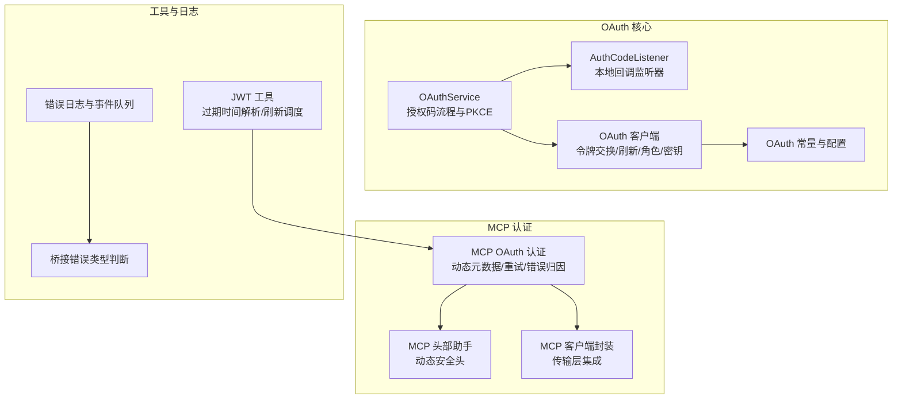
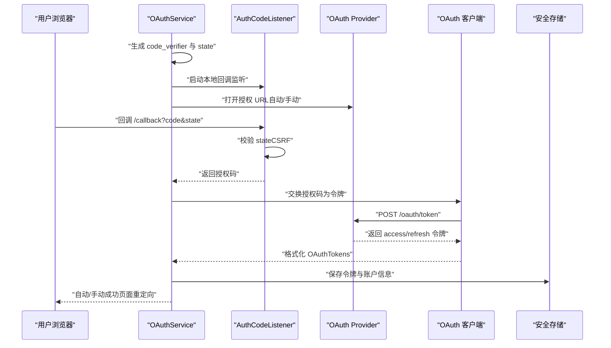
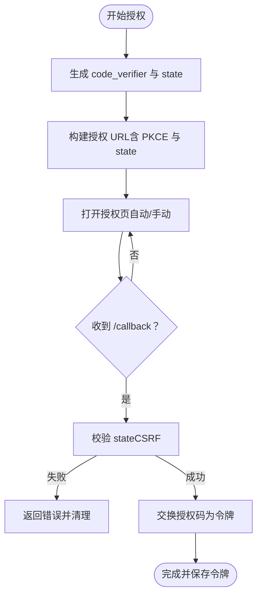
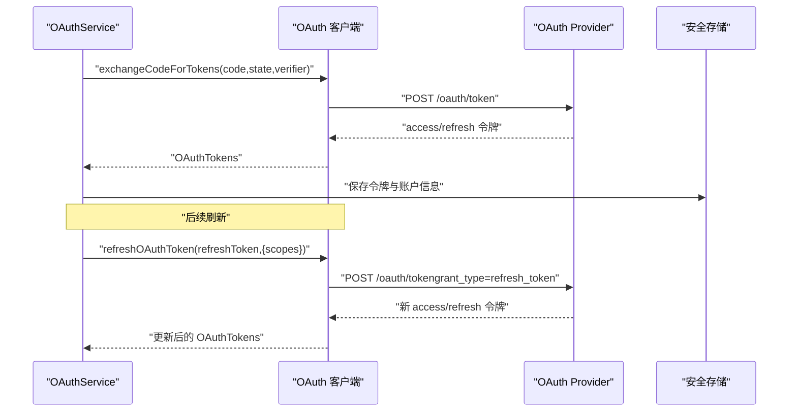
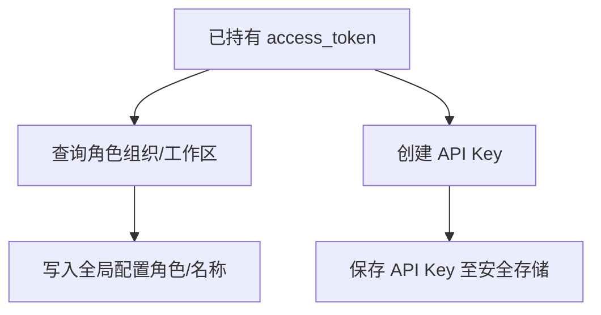
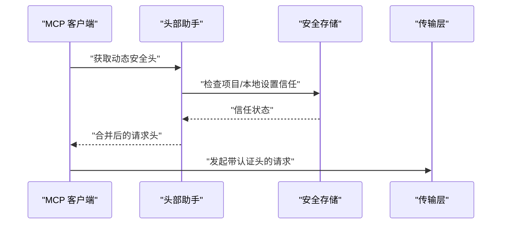
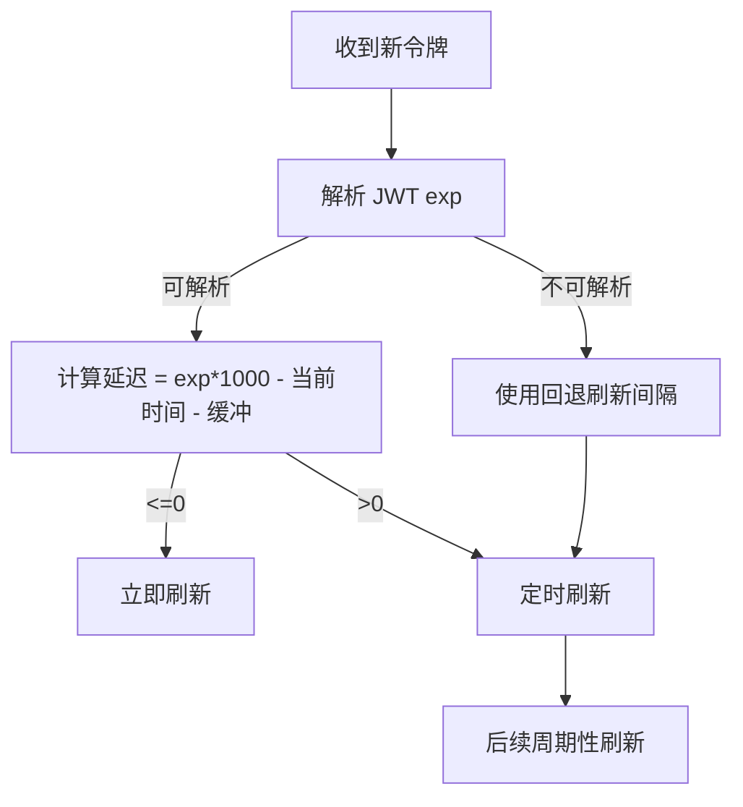
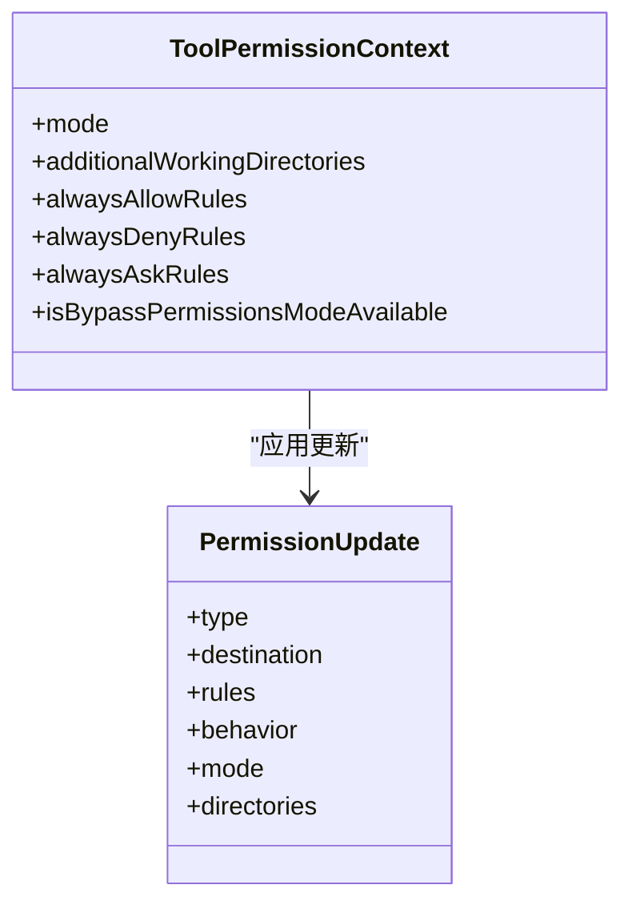
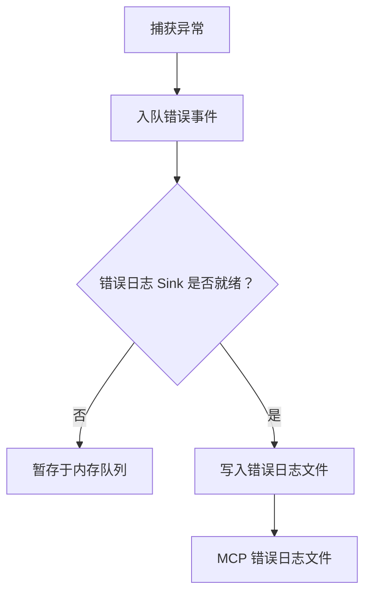
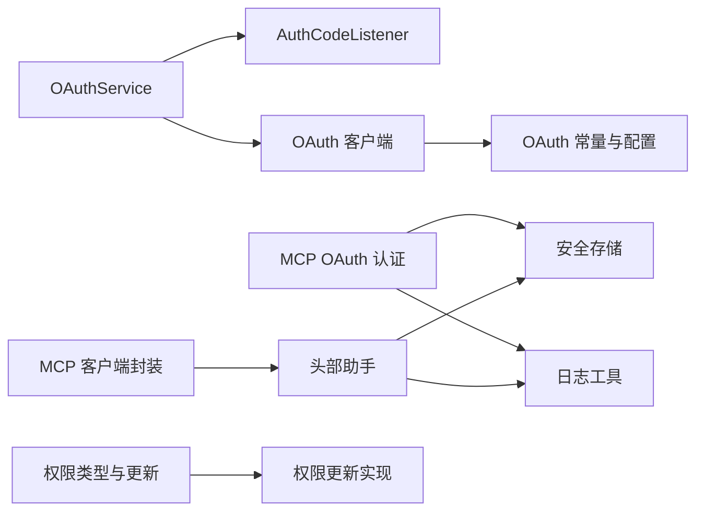

# 认证服务

<cite>
**本文档引用的文件**
- [src/services/oauth/index.ts](file://src/services/oauth/index.ts)
- [src/services/oauth/client.ts](file://src/services/oauth/client.ts)
- [src/services/oauth/auth-code-listener.ts](file://src/services/oauth/auth-code-listener.ts)
- [src/constants/oauth.ts](file://src/constants/oauth.ts)
- [src/bridge/jwtUtils.ts](file://src/bridge/jwtUtils.ts)
- [src/services/mcp/auth.ts](file://src/services/mcp/auth.ts)
- [src/services/mcp/headersHelper.ts](file://src/services/mcp/headersHelper.ts)
- [src/services/mcp/client.ts](file://src/services/mcp/client.ts)
- [src/utils/errorLogSink.ts](file://src/utils/errorLogSink.ts)
- [src/utils/log.ts](file://src/utils/log.ts)
- [src/bridge/bridgeApi.ts](file://src/bridge/bridgeApi.ts)
- [src/utils/permissions/PermissionUpdate.ts](file://src/utils/permissions/PermissionUpdate.ts)
- [src/types/permissions.ts](file://src/types/permissions.ts)
</cite>

## 目录
1. [简介](#简介)
2. [项目结构](#项目结构)
3. [核心组件](#核心组件)
4. [架构总览](#架构总览)
5. [详细组件分析](#详细组件分析)
6. [依赖关系分析](#依赖关系分析)
7. [性能考量](#性能考量)
8. [故障排查指南](#故障排查指南)
9. [结论](#结论)
10. [附录](#附录)

## 简介
本文件为 free-code 的认证服务提供详细的 API 参考文档，覆盖 OAuth 认证流程、令牌管理、权限验证与安全策略。内容包括：
- OAuth 授权码流程（含 PKCE）与令牌交换
- 令牌刷新机制与会话管理
- 管理员请求接口、日志记录 API 与错误处理接口
- 认证配置选项、安全头设置、CSRF 保护与 CORS 配置
- 认证中间件、权限检查、角色管理与访问控制清单的实现细节

## 项目结构
认证相关模块主要分布在以下路径：
- OAuth 流程与令牌管理：src/services/oauth/*
- MCP OAuth 与安全头：src/services/mcp/*
- JWT 工具与令牌调度：src/bridge/jwtUtils.ts
- 权限类型与更新：src/utils/permissions/* 与 src/types/permissions.ts
- 错误日志与调试：src/utils/errorLogSink.ts、src/utils/log.ts、src/bridge/bridgeApi.ts
- OAuth 常量与配置：src/constants/oauth.ts

图表来源
- [src/services/oauth/index.ts:21-132](file://src/services/oauth/index.ts#L21-L132)
- [src/services/oauth/auth-code-listener.ts:18-72](file://src/services/oauth/auth-code-listener.ts#L18-L72)
- [src/services/oauth/client.ts:135-172](file://src/services/oauth/client.ts#L135-L172)
- [src/constants/oauth.ts:70-96](file://src/constants/oauth.ts#L70-L96)
- [src/services/mcp/auth.ts:1-125](file://src/services/mcp/auth.ts#L1-L125)
- [src/services/mcp/headersHelper.ts:125-138](file://src/services/mcp/headersHelper.ts#L125-L138)
- [src/services/mcp/client.ts:623-641](file://src/services/mcp/client.ts#L623-L641)
- [src/bridge/jwtUtils.ts:34-61](file://src/bridge/jwtUtils.ts#L34-L61)
- [src/utils/errorLogSink.ts:1-174](file://src/utils/errorLogSink.ts#L1-L174)
- [src/bridge/bridgeApi.ts:502-539](file://src/bridge/bridgeApi.ts#L502-L539)

章节来源
- [src/services/oauth/index.ts:1-199](file://src/services/oauth/index.ts#L1-L199)
- [src/services/oauth/auth-code-listener.ts:1-212](file://src/services/oauth/auth-code-listener.ts#L1-L212)
- [src/services/oauth/client.ts:1-595](file://src/services/oauth/client.ts#L1-L595)
- [src/constants/oauth.ts:1-267](file://src/constants/oauth.ts#L1-L267)
- [src/services/mcp/auth.ts:1-200](file://src/services/mcp/auth.ts#L1-L200)
- [src/services/mcp/headersHelper.ts:1-138](file://src/services/mcp/headersHelper.ts#L1-L138)
- [src/services/mcp/client.ts:623-641](file://src/services/mcp/client.ts#L623-L641)
- [src/bridge/jwtUtils.ts:34-256](file://src/bridge/jwtUtils.ts#L34-L256)
- [src/utils/errorLogSink.ts:1-174](file://src/utils/errorLogSink.ts#L1-L174)
- [src/bridge/bridgeApi.ts:502-539](file://src/bridge/bridgeApi.ts#L502-L539)

## 核心组件
- OAuthService：负责启动授权码流程（自动/手动），生成 PKCE 参数与 state，等待授权码，交换令牌，并格式化返回的 OAuthTokens。
- AuthCodeListener：在本地启动 HTTP 服务器捕获回调，校验 state，完成浏览器重定向。
- OAuth 客户端：构建授权 URL、交换授权码为令牌、刷新令牌、拉取用户角色与 API Key、解析订阅信息等。
- OAuth 常量与配置：集中管理授权端点、令牌端点、客户端 ID、作用域集合与成功跳转页。
- MCP OAuth 认证：支持动态发现授权服务器元数据、CIMD（客户端元数据文档）、状态参数校验、错误归因与重试策略。
- MCP 头部助手：从脚本动态获取安全头，结合静态头合并，支持项目/本地设置的信任检查。
- JWT 工具：解码 JWT 的 exp，基于过期时间调度令牌刷新，带缓冲与回退间隔。
- 权限系统：规则来源、行为（允许/拒绝/询问）、模式（默认/自动/绕过等）与更新持久化。

章节来源
- [src/services/oauth/index.ts:21-199](file://src/services/oauth/index.ts#L21-L199)
- [src/services/oauth/auth-code-listener.ts:18-212](file://src/services/oauth/auth-code-listener.ts#L18-L212)
- [src/services/oauth/client.ts:74-302](file://src/services/oauth/client.ts#L74-L302)
- [src/constants/oauth.ts:70-267](file://src/constants/oauth.ts#L70-L267)
- [src/services/mcp/auth.ts:108-200](file://src/services/mcp/auth.ts#L108-L200)
- [src/services/mcp/headersHelper.ts:32-138](file://src/services/mcp/headersHelper.ts#L32-L138)
- [src/bridge/jwtUtils.ts:34-163](file://src/bridge/jwtUtils.ts#L34-L163)
- [src/utils/permissions/PermissionUpdate.ts:55-206](file://src/utils/permissions/PermissionUpdate.ts#L55-L206)
- [src/types/permissions.ts:16-132](file://src/types/permissions.ts#L16-L132)

## 架构总览
下图展示从用户授权到令牌使用的关键交互：

图表来源
- [src/services/oauth/index.ts:32-132](file://src/services/oauth/index.ts#L32-L132)
- [src/services/oauth/auth-code-listener.ts:62-175](file://src/services/oauth/auth-code-listener.ts#L62-L175)
- [src/services/oauth/client.ts:135-172](file://src/services/oauth/client.ts#L135-L172)

章节来源
- [src/services/oauth/index.ts:32-132](file://src/services/oauth/index.ts#L32-L132)
- [src/services/oauth/auth-code-listener.ts:62-175](file://src/services/oauth/auth-code-listener.ts#L62-L175)
- [src/services/oauth/client.ts:135-172](file://src/services/oauth/client.ts#L135-L172)

## 详细组件分析

### OAuth 授权码流程与 PKCE
- 自动/手动两种授权码获取方式：自动通过本地回调监听器捕获，手动由用户复制粘贴授权码。
- PKCE：生成 code_verifier，计算 code_challenge，state 用于 CSRF 防护。
- 授权 URL 构建：支持 Claude.ai 与 Console 两套授权端点，可按需选择推理专用作用域或全量作用域。
- 回调处理：严格校验 state，确保无 CSRF 攻击风险；根据授权范围选择成功页面。

图表来源
- [src/services/oauth/index.ts:32-132](file://src/services/oauth/index.ts#L32-L132)
- [src/services/oauth/auth-code-listener.ts:134-175](file://src/services/oauth/auth-code-listener.ts#L134-L175)
- [src/services/oauth/client.ts:74-133](file://src/services/oauth/client.ts#L74-L133)

章节来源
- [src/services/oauth/index.ts:32-132](file://src/services/oauth/index.ts#L32-L132)
- [src/services/oauth/auth-code-listener.ts:134-175](file://src/services/oauth/auth-code-listener.ts#L134-L175)
- [src/services/oauth/client.ts:74-133](file://src/services/oauth/client.ts#L74-L133)

### 令牌交换与刷新
- 令牌交换：向令牌端点发送授权码、code_verifier、state 与 redirect_uri，返回 access/refresh 令牌与作用域。
- 刷新令牌：支持指定作用域刷新，允许作用域扩展；若已有订阅与限额信息则复用，避免重复网络请求。
- 过期检测：基于 expires_in 与缓冲时间判断是否需要刷新；对不可解析 JWT 的令牌采用回退刷新间隔。

图表来源
- [src/services/oauth/client.ts:135-172](file://src/services/oauth/client.ts#L135-L172)
- [src/services/oauth/client.ts:174-302](file://src/services/oauth/client.ts#L174-L302)
- [src/bridge/jwtUtils.ts:34-61](file://src/bridge/jwtUtils.ts#L34-L61)

章节来源
- [src/services/oauth/client.ts:135-172](file://src/services/oauth/client.ts#L135-L172)
- [src/services/oauth/client.ts:174-302](file://src/services/oauth/client.ts#L174-L302)
- [src/bridge/jwtUtils.ts:34-61](file://src/bridge/jwtUtils.ts#L34-L61)

### 角色与 API Key 管理
- 获取用户角色：通过角色端点查询组织与工作区角色，并写入全局配置。
- 创建 API Key：在用户授权后创建 CLI 专用 API Key 并保存至安全存储。
- 账户信息缓存：优先从环境变量与安全存储中读取，避免不必要的网络请求。

图表来源
- [src/services/oauth/client.ts:304-370](file://src/services/oauth/client.ts#L304-L370)

章节来源
- [src/services/oauth/client.ts:304-370](file://src/services/oauth/client.ts#L304-L370)

### MCP OAuth 与安全头
- 动态元数据发现：支持通过 CIMD（客户端元数据文档）替代动态客户端注册，提升兼容性。
- 状态参数校验：严格校验 state，防止 CSRF 攻击；失败原因稳定归因（超时、端口不可用、SDK 认证失败等）。
- 安全头合并：静态头与动态头（来自脚本）合并，项目/本地设置场景需先建立信任。
- 请求包装：为 MCP 请求注入认证头与超时控制，支持逐步升级检测与 403 检测。

图表来源
- [src/services/mcp/headersHelper.ts:32-138](file://src/services/mcp/headersHelper.ts#L32-L138)
- [src/services/mcp/client.ts:623-641](file://src/services/mcp/client.ts#L623-L641)
- [src/services/mcp/auth.ts:108-125](file://src/services/mcp/auth.ts#L108-L125)

章节来源
- [src/services/mcp/auth.ts:108-200](file://src/services/mcp/auth.ts#L108-L200)
- [src/services/mcp/headersHelper.ts:32-138](file://src/services/mcp/headersHelper.ts#L32-L138)
- [src/services/mcp/client.ts:623-641](file://src/services/mcp/client.ts#L623-L641)

### 会话管理与令牌调度
- JWT 解析：解码 exp（过期时间），用于精确调度刷新。
- 刷新调度：基于 exp 减去缓冲时间定时刷新；若无法解析 JWT，则采用回退刷新间隔维持长期会话。
- 失败重试：连续失败达到阈值后停止刷新链路，避免雪崩。

图表来源
- [src/bridge/jwtUtils.ts:34-61](file://src/bridge/jwtUtils.ts#L34-L61)
- [src/bridge/jwtUtils.ts:102-163](file://src/bridge/jwtUtils.ts#L102-L163)

章节来源
- [src/bridge/jwtUtils.ts:34-163](file://src/bridge/jwtUtils.ts#L34-L163)

### 权限验证与访问控制
- 权限模式：默认、自动、绕过权限、接受编辑等模式，支持外部与内部模式集合。
- 规则来源：用户/项目/本地/会话/命令行等来源，支持添加/替换/移除规则与工作目录。
- 决策结果：允许、询问、拒绝或透传，支持异步分类器评估与建议更新。
- 更新持久化：仅对可持久化来源进行规则与目录的增删改操作。

图表来源
- [src/types/permissions.ts:441-442](file://src/types/permissions.ts#L441-L442)
- [src/utils/permissions/PermissionUpdate.ts:55-206](file://src/utils/permissions/PermissionUpdate.ts#L55-L206)

章节来源
- [src/types/permissions.ts:16-132](file://src/types/permissions.ts#L16-L132)
- [src/utils/permissions/PermissionUpdate.ts:55-206](file://src/utils/permissions/PermissionUpdate.ts#L55-L206)

### 日志记录与错误处理
- 错误日志：统一错误事件队列与文件落盘，支持 MCP 专属错误日志路径。
- 错误上下文：对 Axios 错误提取 URL、状态码与服务器消息，便于定位问题。
- 桥接错误类型：识别会话/生命周期过期与可抑制的 403 权限错误，避免干扰用户体验。

图表来源
- [src/utils/log.ts:109-133](file://src/utils/log.ts#L109-L133)
- [src/utils/errorLogSink.ts:124-174](file://src/utils/errorLogSink.ts#L124-L174)
- [src/bridge/bridgeApi.ts:502-539](file://src/bridge/bridgeApi.ts#L502-L539)

章节来源
- [src/utils/log.ts:109-133](file://src/utils/log.ts#L109-L133)
- [src/utils/errorLogSink.ts:124-174](file://src/utils/errorLogSink.ts#L124-L174)
- [src/bridge/bridgeApi.ts:502-539](file://src/bridge/bridgeApi.ts#L502-L539)

## 依赖关系分析
- OAuthService 依赖 AuthCodeListener 与 OAuth 客户端；OAuth 客户端依赖常量配置与工具函数。
- MCP OAuth 认证依赖安全存储、平台信息与日志；MCP 客户端封装依赖头部助手与传输层。
- 权限系统类型与实现分离，避免循环依赖；权限更新通过设置源持久化。

图表来源
- [src/services/oauth/index.ts:1-30](file://src/services/oauth/index.ts#L1-L30)
- [src/services/oauth/auth-code-listener.ts:1-25](file://src/services/oauth/auth-code-listener.ts#L1-L25)
- [src/services/oauth/client.ts:1-32](file://src/services/oauth/client.ts#L1-L32)
- [src/constants/oauth.ts:1-31](file://src/constants/oauth.ts#L1-L31)
- [src/services/mcp/auth.ts:1-51](file://src/services/mcp/auth.ts#L1-L51)
- [src/services/mcp/headersHelper.ts:1-14](file://src/services/mcp/headersHelper.ts#L1-L14)
- [src/services/mcp/client.ts:623-641](file://src/services/mcp/client.ts#L623-L641)
- [src/utils/permissions/PermissionUpdate.ts:1-25](file://src/utils/permissions/PermissionUpdate.ts#L1-L25)
- [src/types/permissions.ts:1-10](file://src/types/permissions.ts#L1-L10)

章节来源
- [src/services/oauth/index.ts:1-30](file://src/services/oauth/index.ts#L1-L30)
- [src/services/oauth/auth-code-listener.ts:1-25](file://src/services/oauth/auth-code-listener.ts#L1-L25)
- [src/services/oauth/client.ts:1-32](file://src/services/oauth/client.ts#L1-L32)
- [src/constants/oauth.ts:1-31](file://src/constants/oauth.ts#L1-L31)
- [src/services/mcp/auth.ts:1-51](file://src/services/mcp/auth.ts#L1-L51)
- [src/services/mcp/headersHelper.ts:1-14](file://src/services/mcp/headersHelper.ts#L1-L14)
- [src/services/mcp/client.ts:623-641](file://src/services/mcp/client.ts#L623-L641)
- [src/utils/permissions/PermissionUpdate.ts:1-25](file://src/utils/permissions/PermissionUpdate.ts#L1-L25)
- [src/types/permissions.ts:1-10](file://src/types/permissions.ts#L1-L10)

## 性能考量
- 令牌刷新优化：在已具备订阅与限额信息时跳过额外的资料轮询，减少每日请求量。
- 刷新调度：基于 JWT exp 精确调度，缓冲与回退间隔平衡实时性与稳定性。
- 请求超时：为 OAuth 请求设置独立超时信号，避免旧超时导致的误判。
- 日志落盘：批量写入与队列化，降低 I/O 压力。

## 故障排查指南
- 授权失败
  - 检查 state 是否匹配，确认未被 CSRF 攻击。
  - 查看回调服务器端口占用与可用性。
  - 关注令牌交换失败的 HTTP 状态与错误描述。
- 刷新失败
  - 核对 refresh_token 是否有效；非标准错误码会被标准化为 invalid_grant。
  - 若多次失败，检查网络连通性与服务端限制。
- MCP 认证问题
  - 确认动态头脚本执行前已完成工作区信任检查。
  - 检查合并后的请求头是否正确注入。
- 权限问题
  - 使用权限更新 API 添加/替换/移除规则，必要时调整默认模式。
  - 对于敏感路径，考虑启用自动模式配合分类器评估。
- 错误日志
  - 通过错误日志文件定位具体请求与响应体；Axios 错误会附加 URL、状态与服务器消息。

章节来源
- [src/services/oauth/auth-code-listener.ts:164-169](file://src/services/oauth/auth-code-listener.ts#L164-L169)
- [src/services/oauth/client.ts:194-201](file://src/services/oauth/client.ts#L194-L201)
- [src/services/mcp/auth.ts:147-191](file://src/services/mcp/auth.ts#L147-L191)
- [src/services/mcp/headersHelper.ts:40-56](file://src/services/mcp/headersHelper.ts#L40-L56)
- [src/utils/errorLogSink.ts:150-174](file://src/utils/errorLogSink.ts#L150-L174)

## 结论
该认证服务以 OAuth 授权码流程为核心，结合 PKCE 与 CSRF 保护，提供稳健的令牌管理与刷新机制；通过 MCP OAuth 与安全头策略强化跨服务访问控制；配合完善的权限模型与日志体系，满足企业级安全与可观测性需求。建议在生产环境中：
- 严格校验 state 与回调端口
- 合理配置刷新缓冲与回退间隔
- 使用动态元数据与 CIMD 提升兼容性
- 通过权限更新与自动模式平衡安全与体验

## 附录

### 认证配置选项
- OAuth 端点与客户端 ID：可通过环境变量覆盖，支持自定义 OAuth 基础地址（仅白名单）。
- 作用域集合：支持 Claude.ai、Console 与 OpenAI 三类作用域组合。
- 成功跳转页：根据授权范围选择不同成功页面。

章节来源
- [src/constants/oauth.ts:218-267](file://src/constants/oauth.ts#L218-L267)
- [src/constants/oauth.ts:66-68](file://src/constants/oauth.ts#L66-L68)
- [src/constants/oauth.ts:100-125](file://src/constants/oauth.ts#L100-L125)

### 安全头设置与 CSRF 保护
- CSRF：state 参数严格校验，本地回调监听器在收到回调时进行校验。
- 安全头：动态头与静态头合并，项目/本地设置场景需先建立信任。
- 日志脱敏：敏感 OAuth 参数在日志中被红名单脱敏。

章节来源
- [src/services/oauth/auth-code-listener.ts:164-169](file://src/services/oauth/auth-code-listener.ts#L164-L169)
- [src/services/mcp/headersHelper.ts:40-56](file://src/services/mcp/headersHelper.ts#L40-L56)
- [src/services/mcp/auth.ts:112-125](file://src/services/mcp/auth.ts#L112-L125)

### CORS 配置
- 本仓库未直接暴露 CORS 配置代码；MCP OAuth 通过授权服务器元数据与客户端元数据文档进行兼容适配，不涉及前端 CORS 设置。

[本节为概念性说明，不直接分析具体文件]