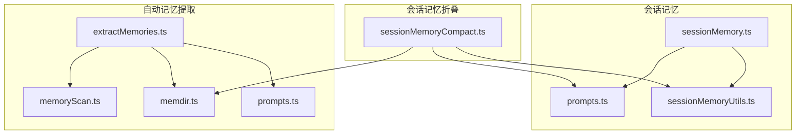
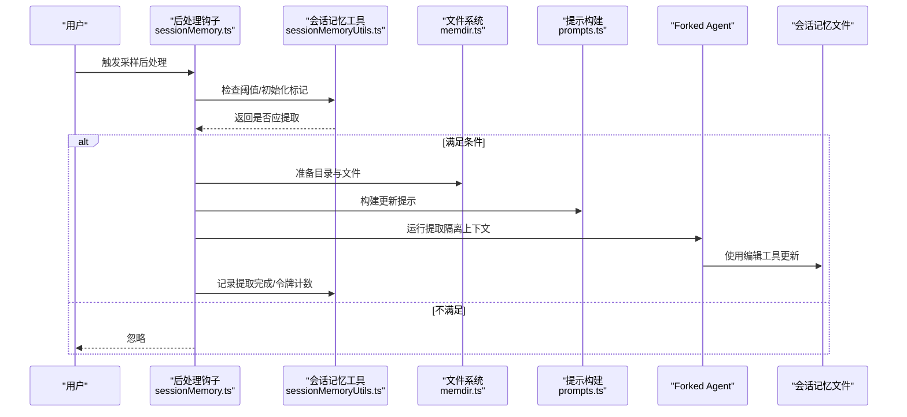
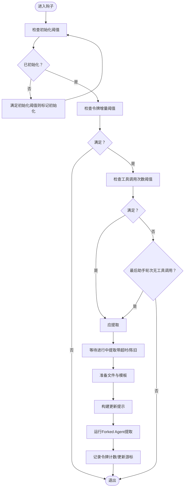
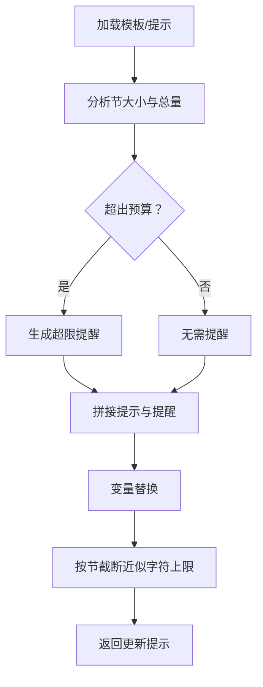
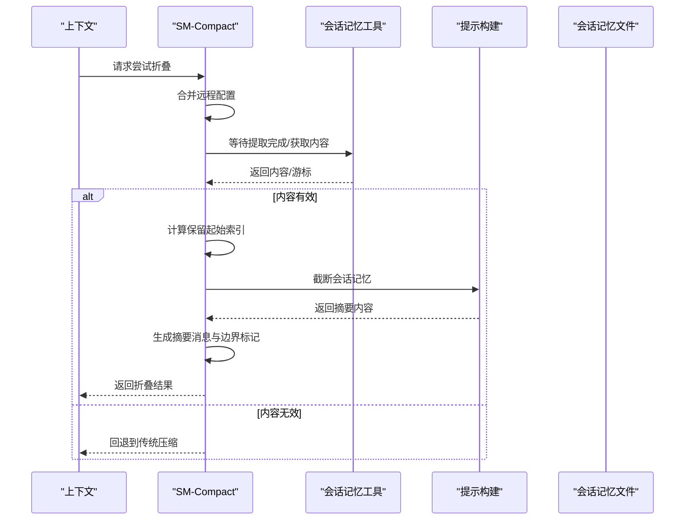
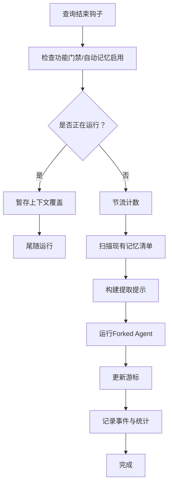
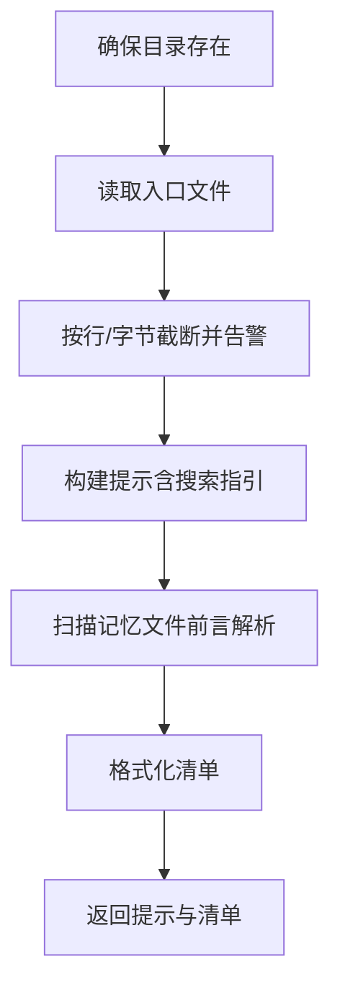
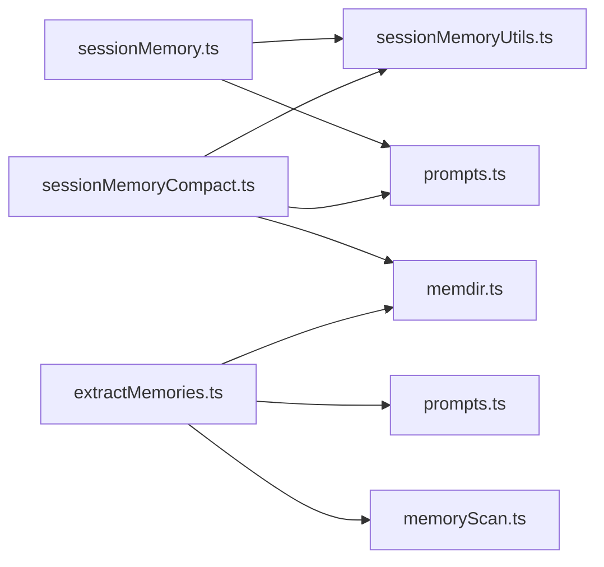

# 记忆服务

<cite>
**本文引用的文件**
- [src/services/SessionMemory/sessionMemory.ts](file://src/services/SessionMemory/sessionMemory.ts)
- [src/services/SessionMemory/sessionMemoryUtils.ts](file://src/services/SessionMemory/sessionMemoryUtils.ts)
- [src/services/SessionMemory/prompts.ts](file://src/services/SessionMemory/prompts.ts)
- [src/services/compact/sessionMemoryCompact.ts](file://src/services/compact/sessionMemoryCompact.ts)
- [src/services/extractMemories/extractMemories.ts](file://src/services/extractMemories/extractMemories.ts)
- [src/services/extractMemories/prompts.ts](file://src/services/extractMemories/prompts.ts)
- [src/memdir/memdir.ts](file://src/memdir/memdir.ts)
- [src/memdir/memoryScan.ts](file://src/memdir/memoryScan.ts)
</cite>

## 目录
1. [简介](#简介)
2. [项目结构](#项目结构)
3. [核心组件](#核心组件)
4. [架构总览](#架构总览)
5. [详细组件分析](#详细组件分析)
6. [依赖关系分析](#依赖关系分析)
7. [性能考量](#性能考量)
8. [故障排查指南](#故障排查指南)
9. [结论](#结论)
10. [附录](#附录)

## 简介
本文件为 free-code 记忆服务的取证与技术文档，聚焦以下能力：
- 会话记忆管理：自动维护会话笔记文件，基于阈值触发提取，支持手动触发与并发控制。
- 压缩算法：以会话记忆内容作为摘要，结合最小令牌数与文本块数量约束，生成紧凑消息链。
- 记忆提取：在查询循环结束时，后台提取对话要点并写入自动记忆目录，具备权限控制与幂等处理。
- 上下文折叠：通过“会话记忆折叠”替代传统压缩，将长会话摘要注入上下文，避免重复加载与冗余传输。

文档同时覆盖配置项、持久化格式、缓存策略、清理规则、检索接口与相似度/去重思路，并提供性能调优与故障恢复建议。

## 项目结构
记忆服务由三大子系统协同实现：
- 会话记忆（Session Memory）：负责会话笔记的创建、更新与读取；提供阈值判断、并发保护与事件埋点。
- 自动记忆提取（Extract Memories）：在查询结束时后台提取要点，写入自动记忆目录，具备工具权限与去重逻辑。
- 会话记忆折叠（SM-Compact）：将会话记忆作为摘要注入上下文，替代传统压缩，确保 API 兼容性与内容完整性。

**图表来源**
- [src/services/SessionMemory/sessionMemory.ts:1-496](file://src/services/SessionMemory/sessionMemory.ts#L1-L496)
- [src/services/SessionMemory/sessionMemoryUtils.ts:1-177](file://src/services/SessionMemory/sessionMemoryUtils.ts#L1-L177)
- [src/services/SessionMemory/prompts.ts:1-325](file://src/services/SessionMemory/prompts.ts#L1-L325)
- [src/services/extractMemories/extractMemories.ts:1-616](file://src/services/extractMemories/extractMemories.ts#L1-L616)
- [src/services/extractMemories/prompts.ts:1-155](file://src/services/extractMemories/prompts.ts#L1-L155)
- [src/memdir/memdir.ts:1-508](file://src/memdir/memdir.ts#L1-L508)
- [src/memdir/memoryScan.ts:1-95](file://src/memdir/memoryScan.ts#L1-L95)
- [src/services/compact/sessionMemoryCompact.ts:1-631](file://src/services/compact/sessionMemoryCompact.ts#L1-L631)

**章节来源**
- [src/services/SessionMemory/sessionMemory.ts:1-496](file://src/services/SessionMemory/sessionMemory.ts#L1-L496)
- [src/services/extractMemories/extractMemories.ts:1-616](file://src/services/extractMemories/extractMemories.ts#L1-L616)
- [src/services/compact/sessionMemoryCompact.ts:1-631](file://src/services/compact/sessionMemoryCompact.ts#L1-L631)

## 核心组件
- 会话记忆模块（sessionMemory.ts）
  - 功能：注册后处理钩子，在满足阈值时异步提取会话笔记；提供手动触发接口；限制仅主 REPL 线程执行；使用 forked agent 隔离状态。
  - 关键流程：阈值检查（初始化阈值、令牌增量阈值、工具调用次数）、并发保护（等待进行中提取、超时与陈旧检测）、文件准备与模板加载、构建更新提示、运行提取、记录事件与统计。
- 会话记忆工具集（sessionMemoryUtils.ts）
  - 功能：会话记忆配置（远程合并默认值）、初始化标记、阈值判断、提取状态跟踪、内容读取、等待提取完成。
  - 关键数据：配置对象、上次提取令牌计数、初始化标志、提取开始时间戳。
- 会话记忆提示与截断（prompts.ts）
  - 功能：加载自定义模板与提示词；分析各节长度并生成提醒；变量替换；按令牌预算截断单节内容；检测空模板。
- 会话记忆折叠（sessionMemoryCompact.ts）
  - 功能：从会话记忆文件读取内容，计算保留区间，截断过长节，生成摘要消息与边界标记，注入上下文；支持环境变量开关与远程配置。
- 自动记忆提取（extractMemories.ts）
  - 功能：查询结束时后台提取要点；互斥与排队（防止重叠运行）；节流与尾随运行；扫描现有记忆清单；工具权限白名单；日志与事件埋点。
- 记忆目录与索引（memdir.ts）
  - 功能：构建记忆系统提示（含索引与搜索指引）；确保目录存在；截断入口文件；统计目录规模；组合团队记忆提示。
- 记忆扫描（memoryScan.ts）
  - 功能：扫描目录、解析前言元数据、格式化清单；限制最大文件数与读取行数，避免高成本操作。

**章节来源**
- [src/services/SessionMemory/sessionMemory.ts:134-181](file://src/services/SessionMemory/sessionMemory.ts#L134-L181)
- [src/services/SessionMemory/sessionMemoryUtils.ts:18-177](file://src/services/SessionMemory/sessionMemoryUtils.ts#L18-L177)
- [src/services/SessionMemory/prompts.ts:226-325](file://src/services/SessionMemory/prompts.ts#L226-L325)
- [src/services/compact/sessionMemoryCompact.ts:514-631](file://src/services/compact/sessionMemoryCompact.ts#L514-L631)
- [src/services/extractMemories/extractMemories.ts:296-587](file://src/services/extractMemories/extractMemories.ts#L296-L587)
- [src/memdir/memdir.ts:419-508](file://src/memdir/memdir.ts#L419-L508)
- [src/memdir/memoryScan.ts:35-95](file://src/memdir/memoryScan.ts#L35-L95)

## 架构总览
记忆服务整体采用“后台提取 + 折叠摘要”的模式，既保证上下文紧凑，又保留可读性强的结构化摘要。关键交互如下：

**图表来源**
- [src/services/SessionMemory/sessionMemory.ts:272-350](file://src/services/SessionMemory/sessionMemory.ts#L272-L350)
- [src/services/SessionMemory/sessionMemoryUtils.ts:89-177](file://src/services/SessionMemory/sessionMemoryUtils.ts#L89-L177)
- [src/services/SessionMemory/prompts.ts:226-247](file://src/services/SessionMemory/prompts.ts#L226-L247)
- [src/memdir/memdir.ts:129-147](file://src/memdir/memdir.ts#L129-L147)

## 详细组件分析

### 会话记忆管理（阈值、并发与事件）
- 阈值判定
  - 初始化阈值：累计上下文窗口令牌达到最小值后才开始初始化。
  - 更新阈值：自上次提取以来的令牌增长达到阈值；或最后一次助手轮次无工具调用时也可触发。
  - 工具调用阈值：自上次总结消息以来的工具调用次数达到设定值。
- 并发与等待
  - 提供等待进行中提取的函数，带超时与陈旧阈值保护，避免长时间阻塞。
  - 手动触发接口绕过阈值，直接运行提取。
- 文件与模板
  - 首次创建时写入模板；读取当前内容用于增量更新。
- 事件与统计
  - 记录提取事件、令牌用量、配置参数、手动提取等指标，便于观测与调优。

**图表来源**
- [src/services/SessionMemory/sessionMemory.ts:134-181](file://src/services/SessionMemory/sessionMemory.ts#L134-L181)
- [src/services/SessionMemory/sessionMemoryUtils.ts:89-177](file://src/services/SessionMemory/sessionMemoryUtils.ts#L89-L177)
- [src/services/SessionMemory/prompts.ts:226-247](file://src/services/SessionMemory/prompts.ts#L226-L247)

**章节来源**
- [src/services/SessionMemory/sessionMemory.ts:134-181](file://src/services/SessionMemory/sessionMemory.ts#L134-L181)
- [src/services/SessionMemory/sessionMemoryUtils.ts:89-177](file://src/services/SessionMemory/sessionMemoryUtils.ts#L89-L177)

### 会话记忆提示与截断
- 模板与提示
  - 支持自定义模板与提示词文件，变量替换（如当前内容、路径），并根据节大小与总量生成提醒。
- 截断策略
  - 对单节内容按近似字符上限进行截断，保留头部并添加截断提示，避免折叠阶段占用过多预算。
- 空模板检测
  - 判断内容是否仍为模板，若是则回退到传统压缩行为。

**图表来源**
- [src/services/SessionMemory/prompts.ts:86-129](file://src/services/SessionMemory/prompts.ts#L86-L129)
- [src/services/SessionMemory/prompts.ts:226-325](file://src/services/SessionMemory/prompts.ts#L226-L325)

**章节来源**
- [src/services/SessionMemory/prompts.ts:86-129](file://src/services/SessionMemory/prompts.ts#L86-L129)
- [src/services/SessionMemory/prompts.ts:226-325](file://src/services/SessionMemory/prompts.ts#L226-L325)

### 会话记忆折叠（上下文折叠）
- 启用条件
  - 会话记忆功能与折叠功能均开启；可通过环境变量覆盖。
- 配置来源
  - 远程配置合并默认值，包含最小保留令牌数、最少文本块消息数、硬上限令牌数。
- 边界与保留
  - 从上次总结消息位置开始，向历史扩展以满足最小令牌数与文本块数量；遇到最大令牌上限停止；调整索引以避免拆分工具对与思考块。
- 摘要生成
  - 截断会话记忆后生成用户可见摘要消息，必要时附加路径提示；构建边界标记与附件。
- 回退策略
  - 若无会话记忆文件、内容为空模板或边界不明确，则回退到传统压缩。

**图表来源**
- [src/services/compact/sessionMemoryCompact.ts:514-631](file://src/services/compact/sessionMemoryCompact.ts#L514-L631)
- [src/services/SessionMemory/sessionMemoryUtils.ts:109-126](file://src/services/SessionMemory/sessionMemoryUtils.ts#L109-L126)
- [src/services/SessionMemory/prompts.ts:256-296](file://src/services/SessionMemory/prompts.ts#L256-L296)

**章节来源**
- [src/services/compact/sessionMemoryCompact.ts:403-432](file://src/services/compact/sessionMemoryCompact.ts#L403-L432)
- [src/services/compact/sessionMemoryCompact.ts:514-631](file://src/services/compact/sessionMemoryCompact.ts#L514-L631)

### 自动记忆提取（后台要点抽取）
- 触发时机
  - 查询循环结束且模型产生最终响应（无工具调用）时触发。
- 幂等与互斥
  - 互斥运行，若正在运行则暂存上下文并在完成后尾随执行一次；节流参数可配置。
- 权限控制
  - 仅允许只读工具（读取/Grep/Glob、只读 Bash）、编辑/写入仅限自动记忆目录。
- 输出与反馈
  - 统计写入文件数、回合数、缓存命中率；成功时向系统消息注入“已保存的记忆”提示；失败记录事件但不中断主线程。

**图表来源**
- [src/services/extractMemories/extractMemories.ts:527-587](file://src/services/extractMemories/extractMemories.ts#L527-L587)
- [src/services/extractMemories/prompts.ts:29-44](file://src/services/extractMemories/prompts.ts#L29-L44)

**章节来源**
- [src/services/extractMemories/extractMemories.ts:527-587](file://src/services/extractMemories/extractMemories.ts#L527-L587)
- [src/services/extractMemories/prompts.ts:29-44](file://src/services/extractMemories/prompts.ts#L29-L44)

### 记忆目录与索引（持久化与检索）
- 目录与入口
  - 确保记忆目录存在；入口文件（MEMORY.md）按行数与字节数上限截断并警告；统计文件/子目录数量。
- 指南与搜索
  - 提供四类型记忆分类、禁止保存内容、何时访问记忆等指导；在特定特性开启时提供搜索指引（grep 或工具调用）。
- 扫描与清单
  - 扫描 .md 文件，解析前言元数据，格式化清单；限制最大文件数与读取行数，避免高成本操作。

**图表来源**
- [src/memdir/memdir.ts:129-147](file://src/memdir/memdir.ts#L129-L147)
- [src/memdir/memdir.ts:272-316](file://src/memdir/memdir.ts#L272-L316)
- [src/memdir/memoryScan.ts:35-95](file://src/memdir/memoryScan.ts#L35-L95)

**章节来源**
- [src/memdir/memdir.ts:419-508](file://src/memdir/memdir.ts#L419-L508)
- [src/memdir/memoryScan.ts:35-95](file://src/memdir/memoryScan.ts#L35-L95)

## 依赖关系分析
- 组件耦合
  - 会话记忆与工具集：前者依赖后者进行阈值判断、提取状态与内容读取。
  - 会话记忆与提示：构建更新提示时依赖模板与截断逻辑。
  - 会话记忆折叠：依赖会话记忆内容、提示截断与目录路径。
  - 自动记忆提取：依赖记忆目录、扫描与提示模板；受工具权限控制。
- 外部依赖
  - 文件系统抽象、forked agent、缓存安全参数、远程配置（GrowthBook）、事件埋点。
- 循环依赖规避
  - 提示构建与扫描拆分为独立模块，避免与查询侧形成闭环。

**图表来源**
- [src/services/SessionMemory/sessionMemory.ts:44-62](file://src/services/SessionMemory/sessionMemory.ts#L44-L62)
- [src/services/compact/sessionMemoryCompact.ts:26-42](file://src/services/compact/sessionMemoryCompact.ts#L26-L42)
- [src/services/extractMemories/extractMemories.ts:59-62](file://src/services/extractMemories/extractMemories.ts#L59-L62)

**章节来源**
- [src/services/SessionMemory/sessionMemory.ts:44-62](file://src/services/SessionMemory/sessionMemory.ts#L44-L62)
- [src/services/compact/sessionMemoryCompact.ts:26-42](file://src/services/compact/sessionMemoryCompact.ts#L26-L42)
- [src/services/extractMemories/extractMemories.ts:59-62](file://src/services/extractMemories/extractMemories.ts#L59-L62)

## 性能考量
- 缓存与提示复用
  - forked agent 使用缓存安全参数共享父线程提示缓存，减少重复计算。
- I/O 与扫描
  - 记忆扫描限制最大文件数与读取行数，避免高成本操作；入口文件截断避免超大索引影响加载。
- 并发与节流
  - 会话记忆提取等待进行中任务完成并设置超时；自动记忆提取互斥运行并支持尾随执行；可配置节流参数。
- 折叠预算
  - 会话记忆折叠前对单节内容进行截断，避免占用过多预算；远程配置控制最小/最大令牌数与最少文本块消息数。

[本节为通用性能讨论，无需具体文件分析]

## 故障排查指南
- 会话记忆未提取
  - 检查功能门禁与自动压缩是否启用；确认阈值是否满足；查看是否处于远程模式；检查提取等待与陈旧阈值。
- 提取失败或内容异常
  - 查看事件日志中的错误信息；确认文件权限与路径；验证模板与提示是否正确加载。
- 自动记忆提取未生效
  - 确认功能门禁开启；检查是否处于远程模式；查看互斥状态与尾随运行日志；核对工具权限白名单。
- 折叠未发生
  - 检查会话记忆文件是否存在且非空模板；确认上次总结消息游标；查看配置是否启用折叠功能。

**章节来源**
- [src/services/SessionMemory/sessionMemory.ts:284-291](file://src/services/SessionMemory/sessionMemory.ts#L284-L291)
- [src/services/SessionMemory/sessionMemoryUtils.ts:89-105](file://src/services/SessionMemory/sessionMemoryUtils.ts#L89-L105)
- [src/services/extractMemories/extractMemories.ts:536-552](file://src/services/extractMemories/extractMemories.ts#L536-L552)
- [src/services/compact/sessionMemoryCompact.ts:518-536](file://src/services/compact/sessionMemoryCompact.ts#L518-L536)

## 结论
记忆服务通过“会话记忆 + 自动提取 + 折叠摘要”的组合，实现了高效、可控且可审计的上下文管理。其设计强调：
- 阈值驱动与并发安全，避免过度提取；
- 结构化模板与截断策略，保障摘要质量；
- 权限严格控制与事件可观测，便于运维与调试；
- 远程配置与环境变量开关，支持灰度与实验。

建议在生产环境中结合遥测指标持续优化阈值与预算参数，并定期审查记忆目录规模与索引质量。

[本节为总结性内容，无需具体文件分析]

## 附录

### 会话记忆配置项（远程合并默认值）
- minimumMessageTokensToInit：初始化阈值（上下文窗口令牌）
- minimumTokensBetweenUpdate：两次更新间最小令牌增量
- toolCallsBetweenUpdates：两次更新间工具调用次数

**章节来源**
- [src/services/SessionMemory/sessionMemoryUtils.ts:18-29](file://src/services/SessionMemory/sessionMemoryUtils.ts#L18-L29)
- [src/services/SessionMemory/sessionMemory.ts:240-264](file://src/services/SessionMemory/sessionMemory.ts#L240-L264)

### 会话记忆折叠配置（远程合并默认值）
- minTokens：折叠后最小保留令牌数
- minTextBlockMessages：最少保留含文本块的消息数
- maxTokens：折叠后最大保留令牌数（硬上限）

**章节来源**
- [src/services/compact/sessionMemoryCompact.ts:47-61](file://src/services/compact/sessionMemoryCompact.ts#L47-L61)
- [src/services/compact/sessionMemoryCompact.ts:102-130](file://src/services/compact/sessionMemoryCompact.ts#L102-L130)

### 记忆提取工具权限（白名单）
- 允许：只读文件读取、Grep、Glob、只读 Bash
- 允许：编辑/写入仅限自动记忆目录
- 禁止：其他工具（含写入型 Bash、MCP、Agent 等）

**章节来源**
- [src/services/extractMemories/extractMemories.ts:171-222](file://src/services/extractMemories/extractMemories.ts#L171-L222)

### 存储格式与持久化
- 会话记忆文件：Markdown 结构，保持节标题与描述不变，仅更新节内内容。
- 自动记忆目录：每个记忆独立文件 + 入口索引（MEMORY.md），索引按行/字节上限截断。
- 目录存在性：通过提示构建阶段确保目录存在，避免后续写入失败。

**章节来源**
- [src/services/SessionMemory/prompts.ts:55-80](file://src/services/SessionMemory/prompts.ts#L55-L80)
- [src/memdir/memdir.ts:129-147](file://src/memdir/memdir.ts#L129-L147)
- [src/memdir/memdir.ts:272-316](file://src/memdir/memdir.ts#L272-L316)

### 检索接口与相似度/去重思路
- 检索接口
  - 自动记忆：通过 Grep 或工具调用在记忆目录中检索；入口索引（MEMORY.md）加载到系统提示中。
  - 会话记忆：通过文件读取接口获取当前内容，用于上下文注入。
- 相似度与去重
  - 当前实现以“目录扫描 + 前言解析 + 去重清单”为主；未见专用相似度/去重算法实现。建议在上层查询阶段引入语义检索与去重策略，以提升召回质量与降低冗余。

**章节来源**
- [src/memdir/memdir.ts:375-407](file://src/memdir/memdir.ts#L375-L407)
- [src/memdir/memoryScan.ts:35-95](file://src/memdir/memoryScan.ts#L35-L95)
- [src/services/SessionMemory/sessionMemoryUtils.ts:110-126](file://src/services/SessionMemory/sessionMemoryUtils.ts#L110-L126)