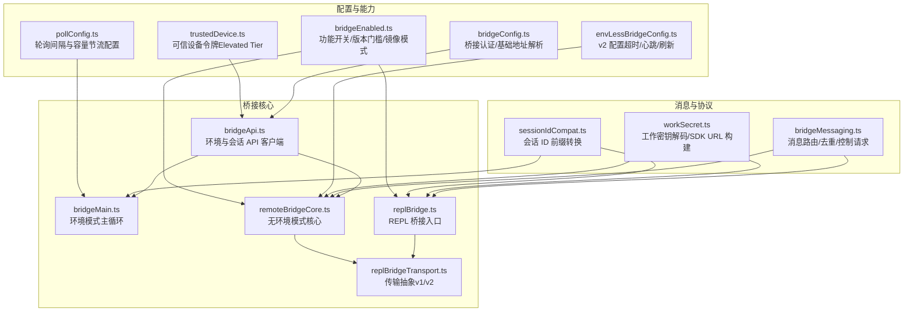
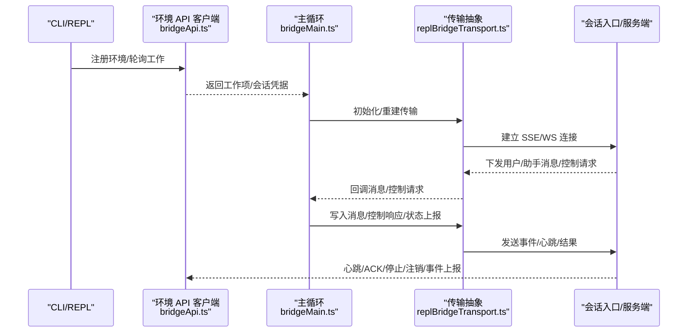
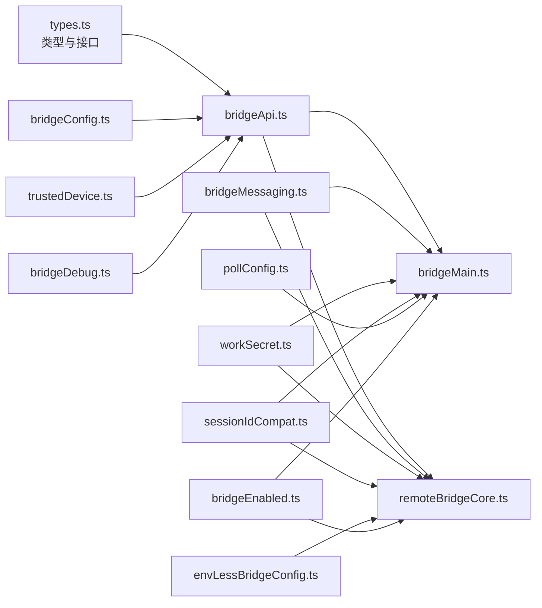

# 桥接 API

<cite>
**本文引用的文件**
- [bridgeApi.ts](file://src/bridge/bridgeApi.ts)
- [bridgeMain.ts](file://src/bridge/bridgeMain.ts)
- [bridgeMessaging.ts](file://src/bridge/bridgeMessaging.ts)
- [types.ts](file://src/bridge/types.ts)
- [remoteBridgeCore.ts](file://src/bridge/remoteBridgeCore.ts)
- [replBridge.ts](file://src/bridge/replBridge.ts)
- [replBridgeTransport.ts](file://src/bridge/replBridgeTransport.ts)
- [bridgeConfig.ts](file://src/bridge/bridgeConfig.ts)
- [envLessBridgeConfig.ts](file://src/bridge/envLessBridgeConfig.ts)
- [pollConfig.ts](file://src/bridge/pollConfig.ts)
- [bridgeEnabled.ts](file://src/bridge/bridgeEnabled.ts)
- [bridgeDebug.ts](file://src/bridge/bridgeDebug.ts)
- [workSecret.ts](file://src/bridge/workSecret.ts)
- [sessionIdCompat.ts](file://src/bridge/sessionIdCompat.ts)
- [trustedDevice.ts](file://src/bridge/trustedDevice.ts)
</cite>

## 目录
1. [简介](#简介)
2. [项目结构](#项目结构)
3. [核心组件](#核心组件)
4. [架构总览](#架构总览)
5. [详细组件分析](#详细组件分析)
6. [依赖关系分析](#依赖关系分析)
7. [性能考量](#性能考量)
8. [故障排查指南](#故障排查指南)
9. [结论](#结论)
10. [附录](#附录)

## 简介
本文件为 free-code 的桥接系统提供全面的 API 参考与实现解析，覆盖 IDE 远程控制接口、WebSocket 与 CCR v2 传输协议、消息传输机制、桥接建立流程、身份验证与可信设备策略、会话管理与状态同步、命令桥接、文件系统桥接、终端桥接与 MCP 桥接等主题。同时给出配置项、安全设置、连接故障恢复与性能优化建议，并提供桥接扩展开发、自定义桥接器与调试工具使用指南。

## 项目结构
桥接系统主要位于 src/bridge 目录，围绕“环境注册—工作轮询—会话承载—状态上报—事件处理”这一主干流程展开；同时提供两类桥接路径：基于 Environments API 的“环境模式”（env-based），以及直接对接会话入口的“无环境模式”（env-less，v2）。

图示来源
- [bridgeApi.ts:68-452](file://src/bridge/bridgeApi.ts#L68-L452)
- [bridgeMain.ts:141-800](file://src/bridge/bridgeMain.ts#L141-L800)
- [remoteBridgeCore.ts:140-800](file://src/bridge/remoteBridgeCore.ts#L140-L800)
- [replBridge.ts:70-200](file://src/bridge/replBridge.ts#L70-L200)
- [replBridgeTransport.ts:11-70](file://src/bridge/replBridgeTransport.ts#L11-L70)
- [bridgeMessaging.ts:132-462](file://src/bridge/bridgeMessaging.ts#L132-L462)
- [workSecret.ts:1-128](file://src/bridge/workSecret.ts#L1-L128)
- [sessionIdCompat.ts:1-58](file://src/bridge/sessionIdCompat.ts#L1-L58)
- [bridgeConfig.ts:1-49](file://src/bridge/bridgeConfig.ts#L1-L49)
- [envLessBridgeConfig.ts:1-166](file://src/bridge/envLessBridgeConfig.ts#L1-L166)
- [pollConfig.ts:1-111](file://src/bridge/pollConfig.ts#L1-L111)
- [bridgeEnabled.ts:1-203](file://src/bridge/bridgeEnabled.ts#L1-L203)
- [trustedDevice.ts:1-211](file://src/bridge/trustedDevice.ts#L1-L211)

章节来源
- [bridgeApi.ts:68-452](file://src/bridge/bridgeApi.ts#L68-L452)
- [bridgeMain.ts:141-800](file://src/bridge/bridgeMain.ts#L141-L800)
- [remoteBridgeCore.ts:140-800](file://src/bridge/remoteBridgeCore.ts#L140-L800)
- [replBridge.ts:70-200](file://src/bridge/replBridge.ts#L70-L200)
- [replBridgeTransport.ts:11-70](file://src/bridge/replBridgeTransport.ts#L11-L70)
- [bridgeMessaging.ts:132-462](file://src/bridge/bridgeMessaging.ts#L132-L462)
- [workSecret.ts:1-128](file://src/bridge/workSecret.ts#L1-L128)
- [sessionIdCompat.ts:1-58](file://src/bridge/sessionIdCompat.ts#L1-L58)
- [bridgeConfig.ts:1-49](file://src/bridge/bridgeConfig.ts#L1-L49)
- [envLessBridgeConfig.ts:1-166](file://src/bridge/envLessBridgeConfig.ts#L1-L166)
- [pollConfig.ts:1-111](file://src/bridge/pollConfig.ts#L1-L111)
- [bridgeEnabled.ts:1-203](file://src/bridge/bridgeEnabled.ts#L1-L203)
- [trustedDevice.ts:1-211](file://src/bridge/trustedDevice.ts#L1-L211)

## 核心组件
- 环境与会话 API 客户端：封装环境注册、工作轮询、ACK/停止、心跳、事件上报、会话归档与重连等接口，统一处理 401 刷新与错误分类。
- 环境模式主循环：在环境层下进行工作分发与会话生命周期管理，支持多会话、容量唤醒、心跳保活与断线恢复。
- 无环境模式核心：直接创建会话并获取 worker 凭据，使用 v2 传输（SSE + CCRClient）进行双向通信，支持主动刷新与 401 自愈。
- REPL 桥接入口：统一对外暴露写消息、发送控制请求/响应、结果上报与优雅关闭等接口。
- 传输抽象：屏蔽 v1（HybridTransport，WS）与 v2（SSETransport + CCRClient）差异，提供统一写入、状态上报、交付跟踪与序列号续传。
- 消息处理：类型守卫、权限响应、控制请求处理、去重环形集合、标题提取与初始历史冲刷。
- 配置与能力：认证/基础地址解析、v2 配置（超时/心跳/刷新）、轮询配置（容量节流/心跳/回收窗口）、功能开关与版本门槛、可信设备令牌。
- 工作密钥与 ID 兼容：解码工作密钥、构建 SDK URL、v2 会话 ID 前缀转换。
- 调试与故障注入：桥接调试句柄、故障注入包装器、强制断开/重连/唤醒等。

章节来源
- [bridgeApi.ts:68-452](file://src/bridge/bridgeApi.ts#L68-L452)
- [bridgeMain.ts:141-800](file://src/bridge/bridgeMain.ts#L141-L800)
- [remoteBridgeCore.ts:140-800](file://src/bridge/remoteBridgeCore.ts#L140-L800)
- [replBridge.ts:70-200](file://src/bridge/replBridge.ts#L70-L200)
- [replBridgeTransport.ts:11-70](file://src/bridge/replBridgeTransport.ts#L11-L70)
- [bridgeMessaging.ts:132-462](file://src/bridge/bridgeMessaging.ts#L132-L462)
- [workSecret.ts:1-128](file://src/bridge/workSecret.ts#L1-L128)
- [sessionIdCompat.ts:1-58](file://src/bridge/sessionIdCompat.ts#L1-L58)
- [bridgeConfig.ts:1-49](file://src/bridge/bridgeConfig.ts#L1-L49)
- [envLessBridgeConfig.ts:1-166](file://src/bridge/envLessBridgeConfig.ts#L1-L166)
- [pollConfig.ts:1-111](file://src/bridge/pollConfig.ts#L1-L111)
- [bridgeEnabled.ts:1-203](file://src/bridge/bridgeEnabled.ts#L1-L203)
- [trustedDevice.ts:1-211](file://src/bridge/trustedDevice.ts#L1-L211)
- [bridgeDebug.ts:1-136](file://src/bridge/bridgeDebug.ts#L1-L136)

## 架构总览
桥接系统分为两条主路径：

- 环境模式（env-based）
  - 通过环境 API 注册环境，轮询工作，ACK 接收，心跳保活，停止与注销，事件上报与会话归档。
  - 主循环负责多会话调度、容量唤醒、心跳保活与断线恢复。
- 无环境模式（env-less，v2）
  - 直接创建会话并获取 worker 凭据，使用 v2 传输（SSE + CCRClient）进行消息与控制交互。
  - 支持主动 JWT 刷新与 401 自愈重建传输，保证序列号续传与幂等写入。

图示来源
- [bridgeApi.ts:141-451](file://src/bridge/bridgeApi.ts#L141-L451)
- [bridgeMain.ts:600-800](file://src/bridge/bridgeMain.ts#L600-L800)
- [replBridgeTransport.ts:119-200](file://src/bridge/replBridgeTransport.ts#L119-L200)

## 详细组件分析

### 环境与会话 API 客户端（bridgeApi.ts）
- 职责
  - 统一的 HTTP 客户端封装，提供环境注册、工作轮询、ACK/停止、心跳、事件上报、会话归档、重连等方法。
  - 统一处理 401 刷新（可选 OAuth 刷新回调）、错误分类与致命错误抛出。
  - 提供 ID 校验（防止路径注入）与调试日志输出。
- 关键接口
  - registerBridgeEnvironment：注册/重用环境，返回环境 ID 与环境密钥。
  - pollForWork：轮询工作，支持 reclaim_older_than_ms 参数。
  - acknowledgeWork：确认接收工作。
  - stopWork：停止工作（支持强制停止）。
  - deregisterEnvironment：注销环境。
  - archiveSession：归档会话（幂等）。
  - reconnectSession：强制停止旧实例并重排到新会话。
  - heartbeatWork：轻量心跳，延长租约。
  - sendPermissionResponseEvent：向会话事件流发送权限响应。
- 错误处理
  - 200/204 成功；401 触发刷新或抛出致命错误；403/404/410 分类处理；429 速率限制；其他抛出通用错误。
  - 支持“可抑制 403”判断，用于非关键权限错误不打扰用户。

章节来源
- [bridgeApi.ts:68-452](file://src/bridge/bridgeApi.ts#L68-L452)

### 环境模式主循环（bridgeMain.ts）
- 职责
  - 在环境层下运行，维护活动会话映射、工作项映射、心跳保活、容量唤醒、超时监控与清理。
  - 处理断线恢复、JWT 过期重连、会话完成后的停止与归档。
  - 支持多会话模式下的容量节流与心跳组合策略。
- 关键流程
  - 心跳保活：对所有活动会话发送心跳，遇到 401/403 触发 reconnectSession。
  - 轮询：根据配置决定空闲轮询间隔或容量节流；处理已完成的工作项去重。
  - 会话生命周期：spawn、onSessionDone、stopWorkWithRetry、archiveSession。
  - 断线恢复：记录断线时间，重连后打印统计并继续。
- 配置
  - 轮询间隔配置（来自 GrowthBook），支持 at-capacity 心跳与轮询组合。
  - 退避参数（连接/一般）与停止工作重试延迟。

章节来源
- [bridgeMain.ts:141-800](file://src/bridge/bridgeMain.ts#L141-L800)
- [pollConfig.ts:102-111](file://src/bridge/pollConfig.ts#L102-L111)

### 无环境模式核心（remoteBridgeCore.ts）
- 职责
  - 直接创建会话并获取 worker 凭据，初始化 v2 传输（SSE + CCRClient），处理初始历史冲刷与去重。
  - 主动 JWT 刷新（提前 expires_in - buffer），401 自愈重建传输，序列号续传避免历史重放。
  - 提供 onUserMessage 标题推导、权限响应回调、中断/模型切换/最大思考令牌设置等控制请求处理。
- 关键流程
  - 创建会话 → 获取远程凭据（含 worker_jwt、expires_in、api_base_url、worker_epoch）→ 构造 v2 传输 → 设置回调 → 连接。
  - 刷新：scheduleFromExpiresIn + rebuildTransport；401：recoverFromAuthFailure。
  - 初始历史：flushHistory + drainFlushGate；写入：writeMessages + 去重。
  - 优雅关闭：reportState('idle') + archiveSession + 关闭传输。
- 配置
  - init_retry、http_timeout、uuid_dedup_buffer_size、heartbeat、token_refresh_buffer、teardown_archive_timeout、connect_timeout 等。

章节来源
- [remoteBridgeCore.ts:140-800](file://src/bridge/remoteBridgeCore.ts#L140-L800)
- [envLessBridgeConfig.ts:130-166](file://src/bridge/envLessBridgeConfig.ts#L130-L166)

### REPL 桥接入口（replBridge.ts）
- 职责
  - 对外暴露 writeMessages、writeSdkMessages、sendControlRequest/Response、sendResult、teardown 等接口。
  - 将内部消息映射为 SDK 消息，处理标题提取、权限响应、控制请求与去重。
  - 与传输抽象解耦，支持 v1/v2 两种传输路径。
- 关键点
  - toSDKMessages 注入式映射，避免捆绑重型依赖。
  - onUserMessage 标题推导策略（派生 at 1st/3rd 或显式设置）。
  - 与 bridgeMain 的工作密钥解码、v2 兼容 ID 转换配合。

章节来源
- [replBridge.ts:70-200](file://src/bridge/replBridge.ts#L70-L200)
- [bridgeMessaging.ts:132-462](file://src/bridge/bridgeMessaging.ts#L132-L462)
- [workSecret.ts:1-128](file://src/bridge/workSecret.ts#L1-L128)
- [sessionIdCompat.ts:1-58](file://src/bridge/sessionIdCompat.ts#L1-L58)

### 传输抽象（replBridgeTransport.ts）
- 职责
  - v1：HybridTransport（WS 读 + POST 写）。
  - v2：SSETransport（读）+ CCRClient（写、心跳、状态上报、交付跟踪）。
  - 提供 setOnData/setOnClose/setOnConnect/connect、write/writeBatch、getLastSequenceNum、droppedBatchCount、reportState/reportMetadata/reportDelivery、flush 等统一接口。
- 关键点
  - v2 写路径不走 SSETransport.write，而是通过 CCRClient 写入 /worker/*。
  - registerWorker 与 /bridge 的 epoch 协同，确保心跳与写入一致性。

章节来源
- [replBridgeTransport.ts:11-70](file://src/bridge/replBridgeTransport.ts#L11-L70)
- [remoteBridgeCore.ts:183-200](file://src/bridge/remoteBridgeCore.ts#L183-L200)

### 消息处理与协议（bridgeMessaging.ts）
- 类型守卫：isSDKMessage、isSDKControlResponse、isSDKControlRequest。
- 入站消息处理：解析、去重（echo + re-delivery）、路由至 onInboundMessage/onPermissionResponse/onControlRequest。
- 控制请求处理：initialize/set_model/set_max_thinking_tokens/set_permission_mode/interrupt 的响应与错误处理。
- 结果消息：makeResultMessage 用于会话归档前的最终事件。
- 去重集合：BoundedUUIDSet（环形缓冲 + 哈希集）。

章节来源
- [bridgeMessaging.ts:132-462](file://src/bridge/bridgeMessaging.ts#L132-L462)

### 工作密钥与 SDK URL（workSecret.ts）
- decodeWorkSecret：校验版本与必要字段，提取会话入口 JWT、API 基础 URL 等。
- buildSdkUrl/buildCCRv2SdkUrl：根据 API 基础 URL 与会话 ID 构建 SDK URL（区分本地/生产）。
- registerWorker：获取 worker_epoch，用于 v2 传输的心跳与状态上报。

章节来源
- [workSecret.ts:1-128](file://src/bridge/workSecret.ts#L1-L128)

### 会话 ID 兼容（sessionIdCompat.ts）
- toCompatSessionId：将 cse_* 转为 session_*（兼容层启用时）。
- toInfraSessionId：将 session_* 转为 cse_*（基础设施层调用）。
- 通过 setCseShimGate 注入门控，避免 SDK 构建中引入增长书依赖。

章节来源
- [sessionIdCompat.ts:1-58](file://src/bridge/sessionIdCompat.ts#L1-L58)

### 认证与基础地址（bridgeConfig.ts）
- getBridgeTokenOverride/getBridgeBaseUrlOverride：Ant 专用开发覆盖。
- getBridgeAccessToken/getBridgeBaseUrl：优先使用覆盖，否则使用 OAuth 存储与 OAuth 配置。

章节来源
- [bridgeConfig.ts:1-49](file://src/bridge/bridgeConfig.ts#L1-L49)

### v2 配置（envLessBridgeConfig.ts）
- init_retry、http_timeout、uuid_dedup_buffer_size、heartbeat、token_refresh_buffer、teardown_archive_timeout、connect_timeout 等。
- 使用 Zod 校验与默认值，支持最小版本门槛与应用升级提示。

章节来源
- [envLessBridgeConfig.ts:1-166](file://src/bridge/envLessBridgeConfig.ts#L1-L166)

### 轮询配置（pollConfig.ts）
- 支持 at-capacity 心跳与轮询组合，防紧循环约束，提供多会话轮询间隔与 reclaim_older_than_ms。

章节来源
- [pollConfig.ts:1-111](file://src/bridge/pollConfig.ts#L1-L111)

### 功能开关与版本门槛（bridgeEnabled.ts）
- isBridgeEnabled/isBridgeEnabledBlocking：Entitlement 与增长书门控。
- isEnvLessBridgeEnabled：v2 路径门控。
- checkBridgeMinVersion/checkEnvLessBridgeMinVersion：v1/v2 版本门槛检查。
- isCcrMirrorEnabled：镜像模式门控。

章节来源
- [bridgeEnabled.ts:1-203](file://src/bridge/bridgeEnabled.ts#L1-L203)

### 可信设备令牌（trustedDevice.ts）
- 在 Elevated Tier 场景下，通过 X-Trusted-Device-Token 头部增强安全。
- 支持设备注册、存储与缓存清除，Gate 开关控制是否发送。

章节来源
- [trustedDevice.ts:1-211](file://src/bridge/trustedDevice.ts#L1-L211)

### 调试与故障注入（bridgeDebug.ts）
- 注册/清除调试句柄，注入致命/瞬态故障，触发断开/重连/唤醒等动作，便于测试恢复路径。

章节来源
- [bridgeDebug.ts:1-136](file://src/bridge/bridgeDebug.ts#L1-L136)

## 依赖关系分析

图示来源
- [types.ts:133-263](file://src/bridge/types.ts#L133-L263)
- [bridgeApi.ts:68-452](file://src/bridge/bridgeApi.ts#L68-L452)
- [bridgeMain.ts:141-800](file://src/bridge/bridgeMain.ts#L141-L800)
- [remoteBridgeCore.ts:140-800](file://src/bridge/remoteBridgeCore.ts#L140-L800)
- [bridgeMessaging.ts:132-462](file://src/bridge/bridgeMessaging.ts#L132-L462)
- [workSecret.ts:1-128](file://src/bridge/workSecret.ts#L1-L128)
- [sessionIdCompat.ts:1-58](file://src/bridge/sessionIdCompat.ts#L1-L58)
- [bridgeConfig.ts:1-49](file://src/bridge/bridgeConfig.ts#L1-L49)
- [envLessBridgeConfig.ts:1-166](file://src/bridge/envLessBridgeConfig.ts#L1-L166)
- [pollConfig.ts:1-111](file://src/bridge/pollConfig.ts#L1-L111)
- [bridgeEnabled.ts:1-203](file://src/bridge/bridgeEnabled.ts#L1-L203)
- [trustedDevice.ts:1-211](file://src/bridge/trustedDevice.ts#L1-L211)
- [bridgeDebug.ts:1-136](file://src/bridge/bridgeDebug.ts#L1-L136)

## 性能考量
- 轮询与心跳
  - 使用 GrowthBook 配置动态调整 at-capacity 心跳与轮询间隔，避免空转与过度轮询。
  - 非独占心跳与轮询可组合，容量阈值内以心跳维持，容量满时按 atCapMs 轮询。
- 去重与批处理
  - BoundedUUIDSet 保持常数空间复杂度，减少 echo 与重放消息带来的重复处理。
  - v2 写入通过 CCRClient 批量上传，结合 flushGate 在历史冲刷期间排队，保证顺序与幂等。
- 超时与刷新
  - v2 主动刷新（expires_in - buffer）降低 401 风险；环境模式心跳延长租约，避免空闲断连。
- 资源清理
  - 优雅关闭先上报结果再归档，避免关闭导致的丢失；清理 pendingCleanups 与定时器，缩短退出时间。

章节来源
- [pollConfig.ts:1-111](file://src/bridge/pollConfig.ts#L1-L111)
- [remoteBridgeCore.ts:606-745](file://src/bridge/remoteBridgeCore.ts#L606-L745)
- [bridgeMain.ts:523-590](file://src/bridge/bridgeMain.ts#L523-L590)

## 故障排查指南
- 常见错误与处理
  - 401：尝试 OAuth 刷新；若失败则抛出致命错误；v2 401 触发 rebuildTransport。
  - 403：检查权限与作用域；部分可抑制的 403 不应显示给用户。
  - 404/410：环境过期或不存在，需重新注册/重启。
  - 429：轮询过于频繁，降低轮询频率。
- 断线与恢复
  - 环境模式：记录断线时间，重连后继续心跳与轮询；容量唤醒加速新工作接收。
  - v2：connect_deadline 超时检测“started 后静默”问题；401 自愈重建传输。
- 调试与注入
  - 使用 /bridge-kick 注入致命/瞬态故障，观察恢复路径；获取当前 env/session ID 描述信息。
- 可信设备
  - Elevated Tier 下未正确配置可信设备令牌会导致 403；确认 Gate 开启与令牌持久化。

章节来源
- [bridgeApi.ts:454-540](file://src/bridge/bridgeApi.ts#L454-L540)
- [remoteBridgeCore.ts:529-590](file://src/bridge/remoteBridgeCore.ts#L529-L590)
- [bridgeMain.ts:600-745](file://src/bridge/bridgeMain.ts#L600-L745)
- [bridgeDebug.ts:1-136](file://src/bridge/bridgeDebug.ts#L1-L136)
- [trustedDevice.ts:1-211](file://src/bridge/trustedDevice.ts#L1-L211)

## 结论
free-code 的桥接系统通过“环境模式”与“无环境模式”两条路径，实现了从本地 IDE 到远端会话入口的稳定、可恢复与高性能通信。其关键优势包括：
- 明确的 API 客户端与传输抽象，隔离环境层与会话层差异；
- 健壮的断线恢复与主动刷新策略，保障长连接稳定性；
- 严格的去重与批处理机制，提升吞吐与一致性；
- 丰富的配置与门控，支持动态调优与灰度发布；
- 完备的调试与故障注入工具，便于定位与验证恢复路径。

## 附录

### API 定义与使用要点

- 环境与会话 API（bridgeApi.ts）
  - registerBridgeEnvironment：注册/重用环境，返回 environment_id 与 environment_secret。
  - pollForWork：轮询工作，支持 reclaim_older_than_ms。
  - acknowledgeWork/stopWork/heartbeatWork：工作生命周期与租约管理。
  - sendPermissionResponseEvent：向会话事件流发送权限决策。
  - archiveSession/reconnectSession/deregisterEnvironment：会话与环境生命周期管理。

- 无环境模式（remoteBridgeCore.ts）
  - initEnvLessBridgeCore：创建会话、获取凭据、初始化 v2 传输、设置回调、连接与刷新。
  - writeMessages：过滤去重后写入；支持 onUserMessage 标题推导。
  - teardown：上报结果、归档会话、关闭传输。

- REPL 桥接（replBridge.ts）
  - writeMessages/writeSdkMessages/sendControlRequest/sendControlResponse/sendResult/teardown：统一对外接口。

- 传输抽象（replBridgeTransport.ts）
  - v1：HybridTransport；v2：SSETransport + CCRClient。
  - reportState/reportMetadata/reportDelivery/flush：状态与交付跟踪。

- 消息处理（bridgeMessaging.ts）
  - 入站消息解析与去重、控制请求响应、结果消息构造。

- 配置与能力（bridgeEnabled.ts/envLessBridgeConfig.ts/pollConfig.ts）
  - 功能开关、版本门槛、v2 配置、轮询配置。

- 安全与认证（bridgeConfig.ts/trustedDevice.ts）
  - 认证令牌与基础地址解析；Elevated Tier 下可信设备令牌。

章节来源
- [bridgeApi.ts:141-451](file://src/bridge/bridgeApi.ts#L141-L451)
- [remoteBridgeCore.ts:140-800](file://src/bridge/remoteBridgeCore.ts#L140-L800)
- [replBridge.ts:70-200](file://src/bridge/replBridge.ts#L70-L200)
- [replBridgeTransport.ts:11-70](file://src/bridge/replBridgeTransport.ts#L11-L70)
- [bridgeMessaging.ts:132-462](file://src/bridge/bridgeMessaging.ts#L132-L462)
- [bridgeEnabled.ts:1-203](file://src/bridge/bridgeEnabled.ts#L1-L203)
- [envLessBridgeConfig.ts:1-166](file://src/bridge/envLessBridgeConfig.ts#L1-L166)
- [pollConfig.ts:1-111](file://src/bridge/pollConfig.ts#L1-L111)
- [bridgeConfig.ts:1-49](file://src/bridge/bridgeConfig.ts#L1-L49)
- [trustedDevice.ts:1-211](file://src/bridge/trustedDevice.ts#L1-L211)