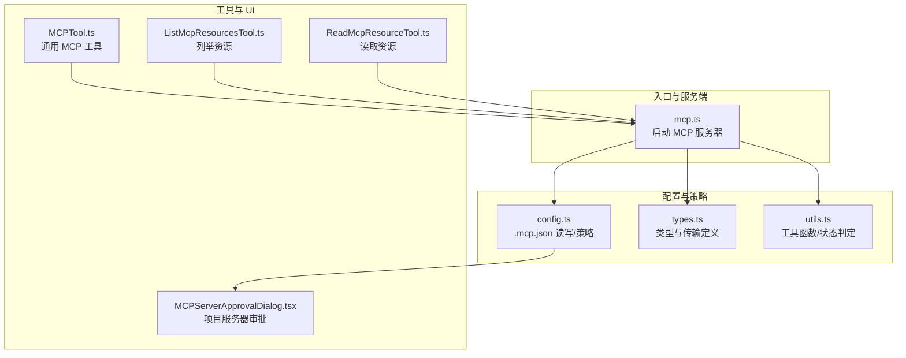
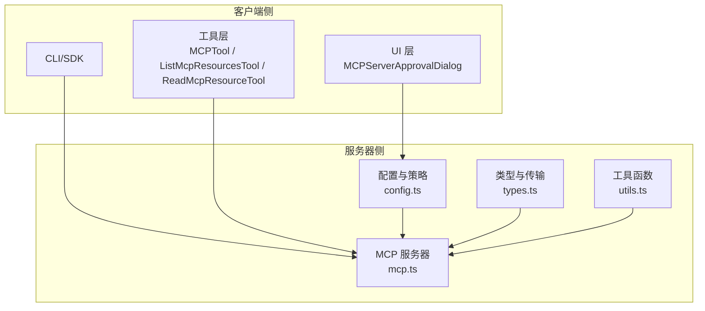
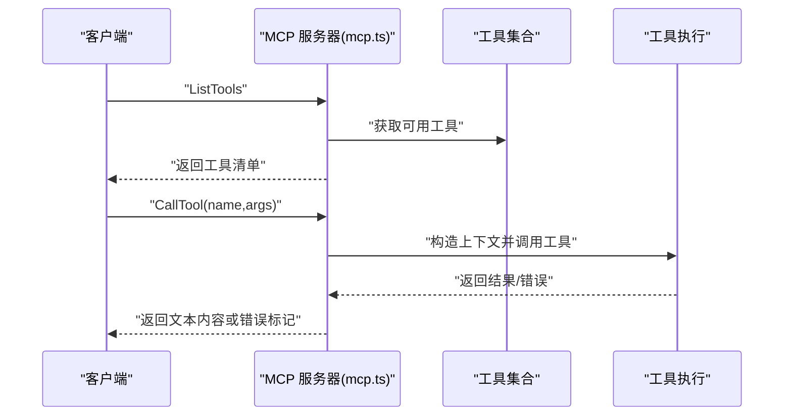
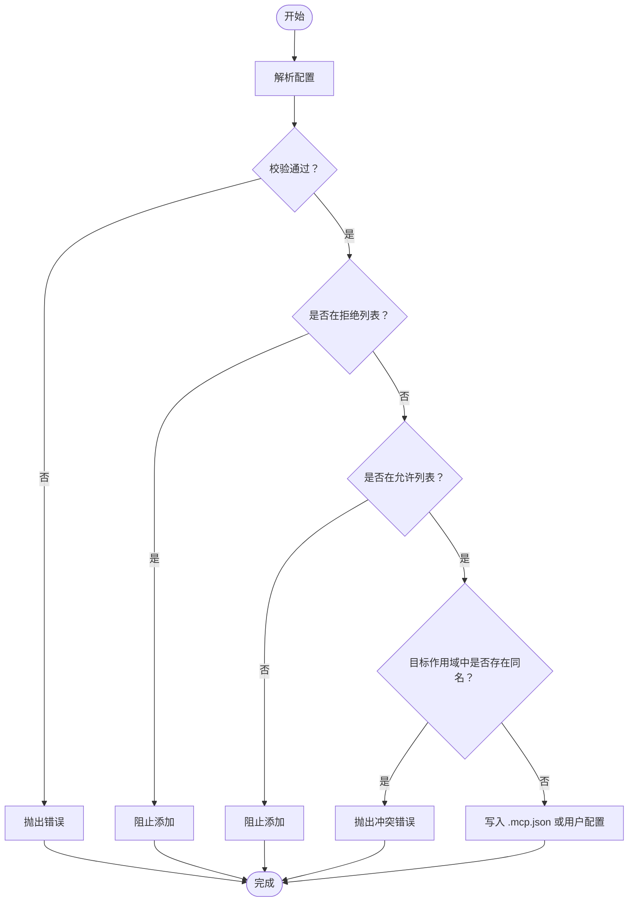
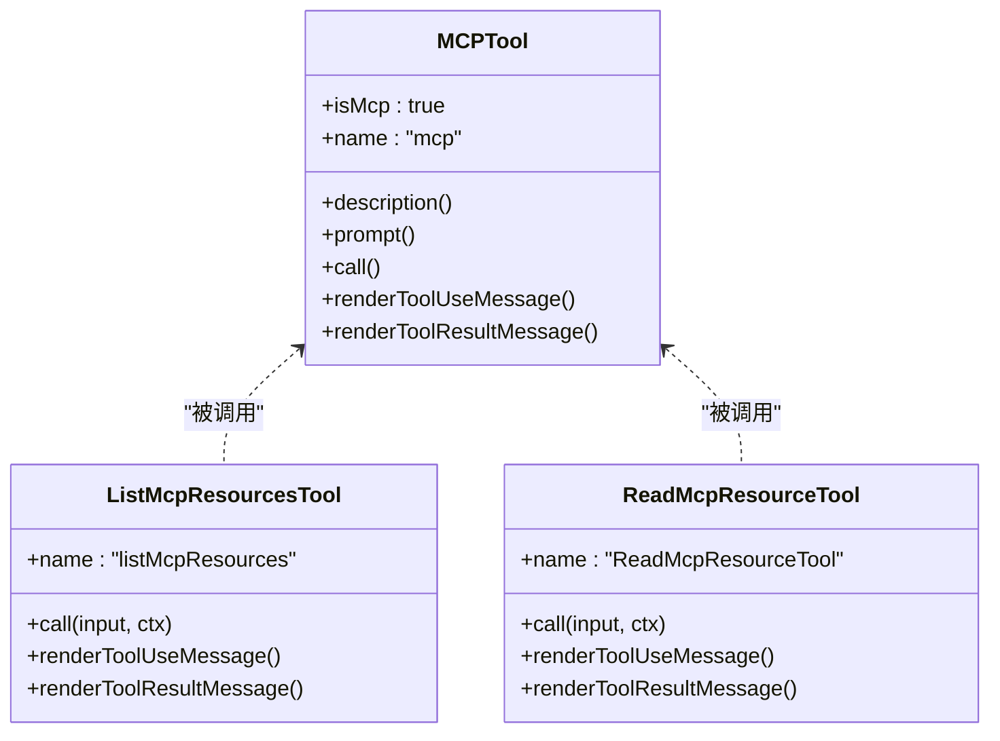
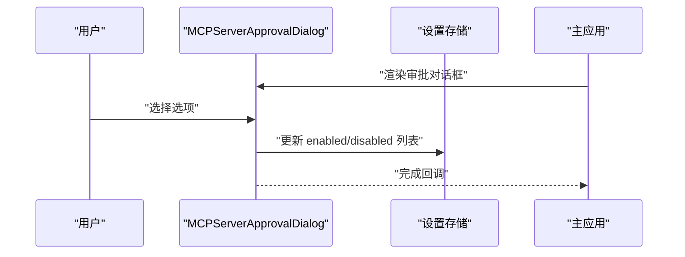
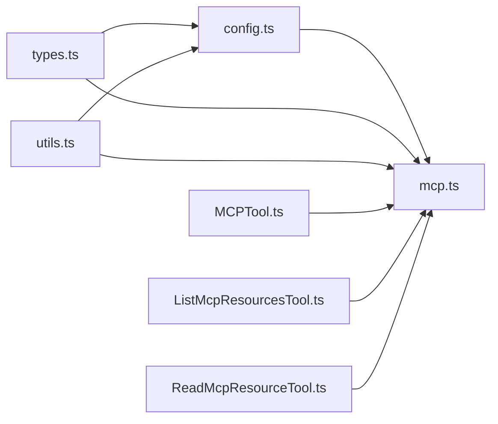

# MCP 协议支持

<cite>
**本文引用的文件**
- [mcp.ts](file://src/entrypoints/mcp.ts)
- [mcpServerApproval.tsx](file://src/services/mcpServerApproval.tsx)
- [config.ts](file://src/services/mcp/config.ts)
- [types.ts](file://src/services/mcp/types.ts)
- [utils.ts](file://src/services/mcp/utils.ts)
- [MCPTool.ts](file://src/tools/MCPTool/MCPTool.ts)
- [ListMcpResourcesTool.ts](file://src/tools/ListMcpResourcesTool/ListMcpResourcesTool.ts)
- [ReadMcpResourceTool.ts](file://src/tools/ReadMcpResourceTool/ReadMcpResourceTool.ts)
- [MCPServerApprovalDialog.tsx](file://src/components/MCPServerApprovalDialog.tsx)
</cite>

## 目录
1. [简介](#简介)
2. [项目结构](#项目结构)
3. [核心组件](#核心组件)
4. [架构总览](#架构总览)
5. [详细组件分析](#详细组件分析)
6. [依赖关系分析](#依赖关系分析)
7. [性能考量](#性能考量)
8. [故障排除指南](#故障排除指南)
9. [结论](#结论)
10. [附录](#附录)

## 简介
本文件系统性阐述 free-code（Claude Code）中的 MCP（模型协作协议）支持，覆盖架构设计、实现机制、服务器配置、客户端集成、资源管理、工具使用、能力发现与资源读取、服务器搭建与认证、与 Claude Code 的集成以及协议扩展等。文档同时提供流程图与时序图帮助理解端到端工作流，并给出可操作的排障建议。

## 项目结构
围绕 MCP 的相关模块主要分布在以下路径：
- 入口与服务端：src/entrypoints/mcp.ts 提供 MCP 服务器入口，基于 SDK 构建并处理工具能力与调用。
- 配置与策略：src/services/mcp/config.ts 负责 .mcp.json 读写、策略过滤（允许/拒绝列表）、环境变量展开、去重与签名计算。
- 类型定义：src/services/mcp/types.ts 定义传输类型、服务器配置模式、连接状态与资源类型。
- 工具与 UI：src/tools 下的 MCP 工具（MCPTool、ListMcpResourcesTool、ReadMcpResourceTool）提供能力发现、资源列举与读取；配套 UI 渲染。
- 权限与审批：src/services/mcpServerApproval.tsx 与 src/components/MCPServerApprovalDialog.tsx 负责项目级 MCP 服务器的审批弹窗与状态管理。

**图表来源**
- [mcp.ts:35-196](file://src/entrypoints/mcp.ts#L35-L196)
- [config.ts:625-761](file://src/services/mcp/config.ts#L625-L761)
- [types.ts:108-259](file://src/services/mcp/types.ts#L108-L259)
- [utils.ts:351-406](file://src/services/mcp/utils.ts#L351-L406)
- [MCPTool.ts:27-77](file://src/tools/MCPTool/MCPTool.ts#L27-L77)
- [ListMcpResourcesTool.ts:40-123](file://src/tools/ListMcpResourcesTool/ListMcpResourcesTool.ts#L40-L123)
- [ReadMcpResourceTool.ts:49-158](file://src/tools/ReadMcpResourceTool/ReadMcpResourceTool.ts#L49-L158)
- [MCPServerApprovalDialog.tsx:12-114](file://src/components/MCPServerApprovalDialog.tsx#L12-L114)

**章节来源**
- [mcp.ts:35-196](file://src/entrypoints/mcp.ts#L35-L196)
- [config.ts:625-761](file://src/services/mcp/config.ts#L625-L761)
- [types.ts:108-259](file://src/services/mcp/types.ts#L108-L259)
- [utils.ts:351-406](file://src/services/mcp/utils.ts#L351-L406)
- [MCPTool.ts:27-77](file://src/tools/MCPTool/MCPTool.ts#L27-L77)
- [ListMcpResourcesTool.ts:40-123](file://src/tools/ListMcpResourcesTool/ListMcpResourcesTool.ts#L40-L123)
- [ReadMcpResourceTool.ts:49-158](file://src/tools/ReadMcpResourceTool/ReadMcpResourceTool.ts#L49-L158)
- [MCPServerApprovalDialog.tsx:12-114](file://src/components/MCPServerApprovalDialog.tsx#L12-L114)

## 核心组件
- MCP 服务器入口：在进程启动时初始化 Server，注册 ListTools 与 CallTool 请求处理器，通过 STDIO 传输与上游客户端交互。
- 配置与策略：提供 .mcp.json 写入、命令/URL 去重、企业策略（允许/拒绝列表）、环境变量展开、签名计算与变更检测。
- 工具集：MCPTool 作为通用入口；ListMcpResourcesTool 用于列举已连接服务器的资源；ReadMcpResourceTool 用于按 URI 读取资源。
- 权限与审批：项目级 MCP 服务器首次出现时弹出审批对话框，支持“全部启用”“仅本次”“不使用”。

**章节来源**
- [mcp.ts:35-196](file://src/entrypoints/mcp.ts#L35-L196)
- [config.ts:625-761](file://src/services/mcp/config.ts#L625-L761)
- [MCPTool.ts:27-77](file://src/tools/MCPTool/MCPTool.ts#L27-L77)
- [ListMcpResourcesTool.ts:40-123](file://src/tools/ListMcpResourcesTool/ListMcpResourcesTool.ts#L40-L123)
- [ReadMcpResourceTool.ts:49-158](file://src/tools/ReadMcpResourceTool/ReadMcpResourceTool.ts#L49-L158)
- [MCPServerApprovalDialog.tsx:12-114](file://src/components/MCPServerApprovalDialog.tsx#L12-L114)

## 架构总览
下图展示 MCP 在 Claude Code 中的整体架构：CLI/SDK 侧通过 STDIO 或远程传输与 MCP 服务器交互；服务器端负责能力暴露与工具执行；配置层负责策略与去重；工具层提供资源发现与读取能力；UI 层负责项目级服务器审批。

**图表来源**
- [mcp.ts:35-196](file://src/entrypoints/mcp.ts#L35-L196)
- [config.ts:625-761](file://src/services/mcp/config.ts#L625-L761)
- [types.ts:108-259](file://src/services/mcp/types.ts#L108-L259)
- [utils.ts:351-406](file://src/services/mcp/utils.ts#L351-L406)
- [MCPTool.ts:27-77](file://src/tools/MCPTool/MCPTool.ts#L27-L77)
- [ListMcpResourcesTool.ts:40-123](file://src/tools/ListMcpResourcesTool/ListMcpResourcesTool.ts#L40-L123)
- [ReadMcpResourceTool.ts:49-158](file://src/tools/ReadMcpResourceTool/ReadMcpResourceTool.ts#L49-L158)
- [MCPServerApprovalDialog.tsx:12-114](file://src/components/MCPServerApprovalDialog.tsx#L12-L114)

## 详细组件分析

### MCP 服务器入口与请求处理
- 初始化 Server 并声明 capabilities 为 tools。
- 注册 ListTools 处理器：收集本地工具，转换输入/输出 Schema，生成工具清单返回。
- 注册 CallTool 处理器：解析工具名与参数，构造工具调用上下文，执行工具并返回文本结果或错误信息。
- 使用 STDIO 传输启动服务器。

**图表来源**
- [mcp.ts:59-187](file://src/entrypoints/mcp.ts#L59-L187)

**章节来源**
- [mcp.ts:35-196](file://src/entrypoints/mcp.ts#L35-L196)

### 配置与策略（.mcp.json 与企业策略）
- 写入 .mcp.json：原子写入临时文件后重命名，保留权限；支持命令数组、URL、头信息、OAuth 等字段。
- 去重与签名：根据命令或 URL 计算签名，避免重复；手动配置优先于插件与 claude.ai 连接器。
- 企业策略：允许/拒绝列表支持名称、命令、URL 三种维度匹配；denylist 优先于 allowlist。
- 环境变量展开：对命令、URL、头信息进行变量替换，记录缺失变量。

**图表来源**
- [config.ts:625-761](file://src/services/mcp/config.ts#L625-L761)

**章节来源**
- [config.ts:625-761](file://src/services/mcp/config.ts#L625-L761)

### 工具与资源管理
- MCPTool：通用工具入口，描述与提示由子模块提供，调用时返回字符串结果。
- ListMcpResourcesTool：列举已连接服务器的资源，支持按服务器过滤；失败不影响整体结果。
- ReadMcpResourceTool：按 URI 读取资源，自动处理二进制 blob 存储与路径替换，返回文本或保存路径。

**图表来源**
- [MCPTool.ts:27-77](file://src/tools/MCPTool/MCPTool.ts#L27-L77)
- [ListMcpResourcesTool.ts:40-123](file://src/tools/ListMcpResourcesTool/ListMcpResourcesTool.ts#L40-L123)
- [ReadMcpResourceTool.ts:49-158](file://src/tools/ReadMcpResourceTool/ReadMcpResourceTool.ts#L49-L158)

**章节来源**
- [MCPTool.ts:27-77](file://src/tools/MCPTool/MCPTool.ts#L27-L77)
- [ListMcpResourcesTool.ts:40-123](file://src/tools/ListMcpResourcesTool/ListMcpResourcesTool.ts#L40-L123)
- [ReadMcpResourceTool.ts:49-158](file://src/tools/ReadMcpResourceTool/ReadMcpResourceTool.ts#L49-L158)

### 权限与项目级服务器审批
- 首次在项目 .mcp.json 中发现服务器时，弹出审批对话框，选项包括“全部启用”“仅本次”“不使用”，并记录设置。
- 支持非交互模式下的自动批准策略（如危险模式豁免或非交互会话）。

**图表来源**
- [MCPServerApprovalDialog.tsx:12-114](file://src/components/MCPServerApprovalDialog.tsx#L12-L114)
- [mcpServerApproval.tsx:15-40](file://src/services/mcpServerApproval.tsx#L15-L40)

**章节来源**
- [MCPServerApprovalDialog.tsx:12-114](file://src/components/MCPServerApprovalDialog.tsx#L12-L114)
- [mcpServerApproval.tsx:15-40](file://src/services/mcpServerApproval.tsx#L15-L40)

## 依赖关系分析
- 类型与传输：types.ts 定义了多种服务器配置与传输类型（stdio/sse/http/ws/sdk 等），为配置解析与连接提供约束。
- 工具函数：utils.ts 提供工具/命令/资源过滤、哈希与变更检测、服务器状态判定、日志安全 URL 提取等。
- 配置与策略：config.ts 依赖 types.ts 的类型定义，结合 utils.ts 的工具函数实现策略与去重逻辑。

**图表来源**
- [types.ts:108-259](file://src/services/mcp/types.ts#L108-L259)
- [config.ts:625-761](file://src/services/mcp/config.ts#L625-L761)
- [utils.ts:351-406](file://src/services/mcp/utils.ts#L351-L406)
- [mcp.ts:35-196](file://src/entrypoints/mcp.ts#L35-L196)
- [MCPTool.ts:27-77](file://src/tools/MCPTool/MCPTool.ts#L27-L77)
- [ListMcpResourcesTool.ts:40-123](file://src/tools/ListMcpResourcesTool/ListMcpResourcesTool.ts#L40-L123)
- [ReadMcpResourceTool.ts:49-158](file://src/tools/ReadMcpResourceTool/ReadMcpResourceTool.ts#L49-L158)

**章节来源**
- [types.ts:108-259](file://src/services/mcp/types.ts#L108-L259)
- [config.ts:625-761](file://src/services/mcp/config.ts#L625-L761)
- [utils.ts:351-406](file://src/services/mcp/utils.ts#L351-L406)
- [mcp.ts:35-196](file://src/entrypoints/mcp.ts#L35-L196)
- [MCPTool.ts:27-77](file://src/tools/MCPTool/MCPTool.ts#L27-L77)
- [ListMcpResourcesTool.ts:40-123](file://src/tools/ListMcpResourcesTool/ListMcpResourcesTool.ts#L40-L123)
- [ReadMcpResourceTool.ts:49-158](file://src/tools/ReadMcpResourceTool/ReadMcpResourceTool.ts#L49-L158)

## 性能考量
- 缓存与去重：服务器能力与资源读取采用 LRU 缓存与变更检测，避免重复连接与过期数据。
- 并发与只读：资源列举与读取工具标注并发安全与只读，降低锁竞争与副作用。
- 错误隔离：资源读取失败不会阻断整体结果，提升健壮性。

[本节为通用指导，无需具体文件分析]

## 故障排除指南
- 服务器未被批准：检查项目设置中的 enabled/disabled 列表，确认是否需要在 UI 中进行审批。
- 企业策略阻止：检查 allow/deny 列表，确认服务器命令/URL 是否匹配策略规则。
- 配置写入失败：确认 .mcp.json 文件权限与磁盘空间，确保写入过程原子化成功。
- 工具调用失败：查看工具返回的错误信息，确认工具是否启用、输入参数是否有效。
- 资源读取异常：确认服务器具备 resources 能力且连接状态为 connected，必要时重新建立连接。

**章节来源**
- [MCPServerApprovalDialog.tsx:12-114](file://src/components/MCPServerApprovalDialog.tsx#L12-L114)
- [config.ts:625-761](file://src/services/mcp/config.ts#L625-L761)
- [ListMcpResourcesTool.ts:66-101](file://src/tools/ListMcpResourcesTool/ListMcpResourcesTool.ts#L66-L101)
- [ReadMcpResourceTool.ts:75-101](file://src/tools/ReadMcpResourceTool/ReadMcpResourceTool.ts#L75-L101)

## 结论
该实现以清晰的分层架构支撑 MCP 协议：入口层负责能力暴露与工具执行，配置层提供策略与去重，工具层提供资源发现与读取，UI 层保障项目级服务器的透明与可控。通过类型约束、缓存与错误隔离，系统在易用性与稳定性之间取得平衡，并为后续协议扩展预留空间。

[本节为总结，无需具体文件分析]

## 附录

### MCP 服务器搭建与认证（实践要点）
- 本地进程（stdio）：在 .mcp.json 中配置 command 与 args，必要时设置 env；通过命令行启动时注意工作目录与权限。
- 远程服务器（http/sse/ws）：配置 url 与 headers；如需 OAuth，提供 clientId/callbackPort 或 authServerMetadataUrl。
- 企业策略：通过 allow/deny 列表控制服务器可用性；denylist 优先。
- 审批流程：项目级服务器首次出现时弹窗审批，支持“全部启用”“仅本次”“不使用”。

**章节来源**
- [config.ts:625-761](file://src/services/mcp/config.ts#L625-L761)
- [types.ts:108-259](file://src/services/mcp/types.ts#L108-L259)
- [MCPServerApprovalDialog.tsx:12-114](file://src/components/MCPServerApprovalDialog.tsx#L12-L114)

### MCP 工具使用与能力发现
- 能力发现：通过 ListTools 获取工具清单，工具描述来自工具自身 prompt 方法。
- 工具调用：CallTool 接收 name 与 arguments，执行后返回文本内容；错误会被包装为 isError 并返回错误文本。
- 资源管理：使用 ListMcpResourcesTool 列举资源，使用 ReadMcpResourceTool 按 URI 读取资源，自动处理二进制内容持久化。

**章节来源**
- [mcp.ts:59-187](file://src/entrypoints/mcp.ts#L59-L187)
- [ListMcpResourcesTool.ts:40-123](file://src/tools/ListMcpResourcesTool/ListMcpResourcesTool.ts#L40-L123)
- [ReadMcpResourceTool.ts:49-158](file://src/tools/ReadMcpResourceTool/ReadMcpResourceTool.ts#L49-L158)