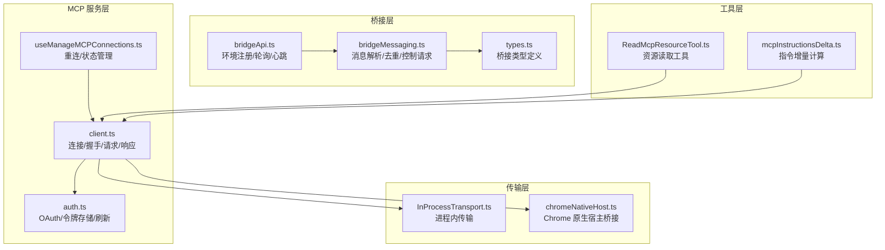
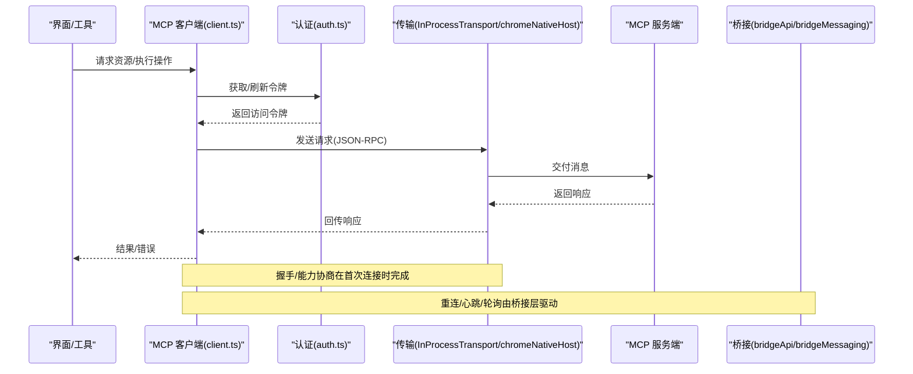
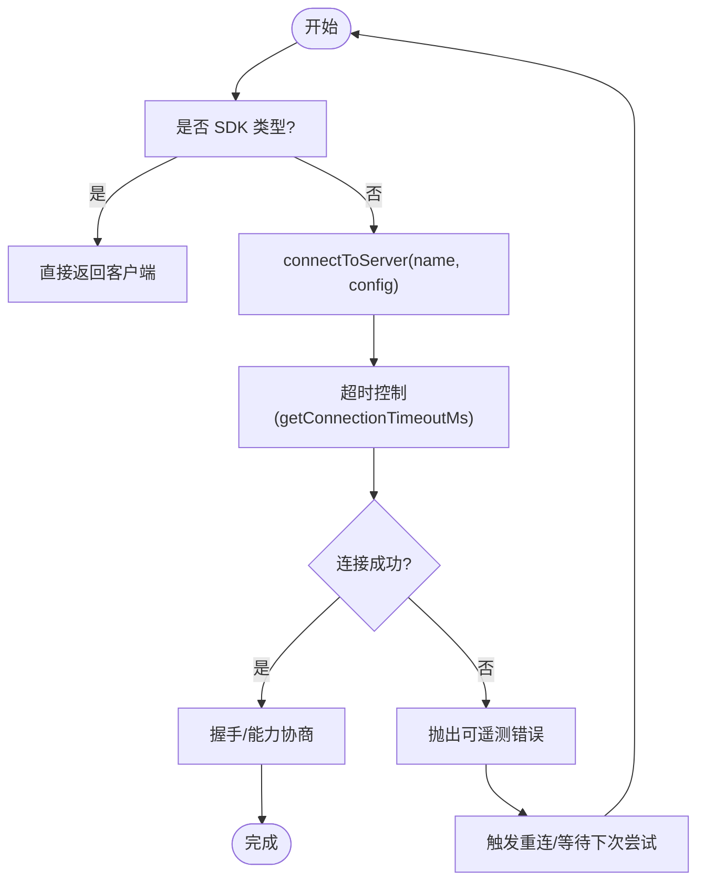
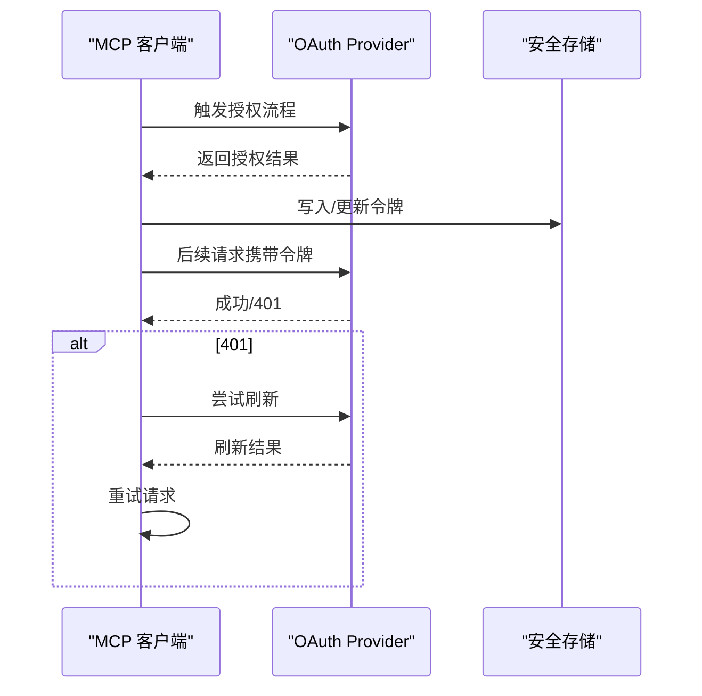
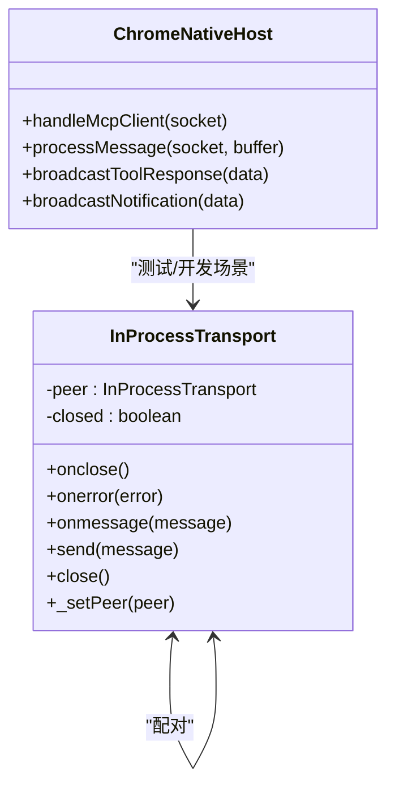
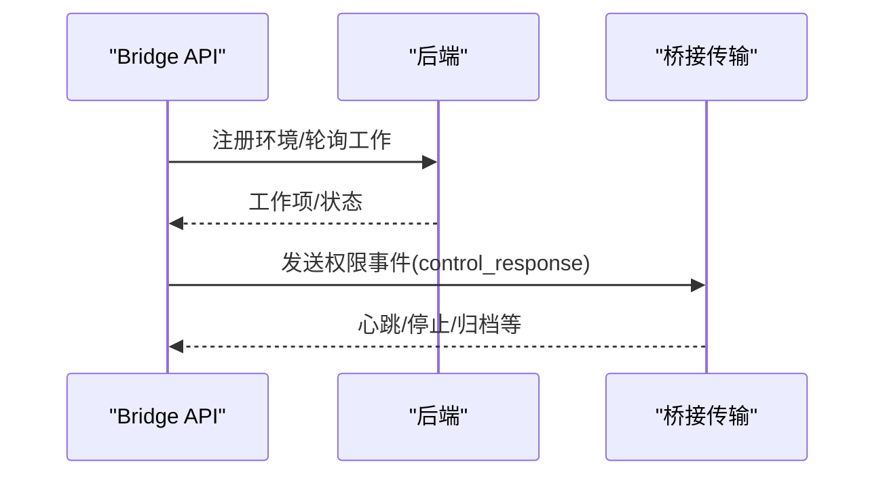
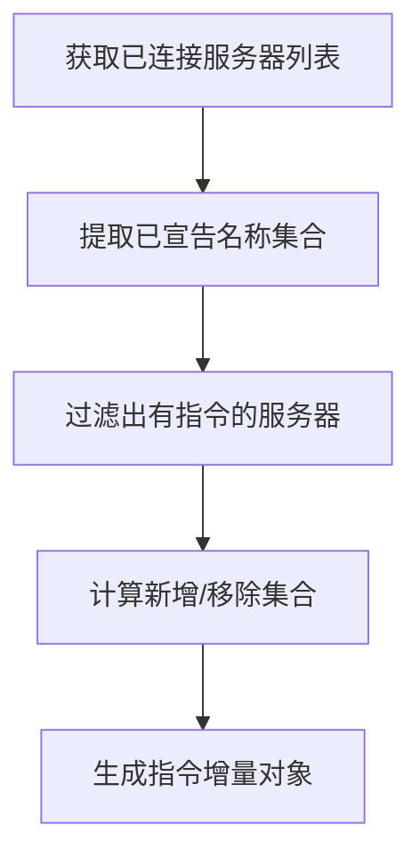
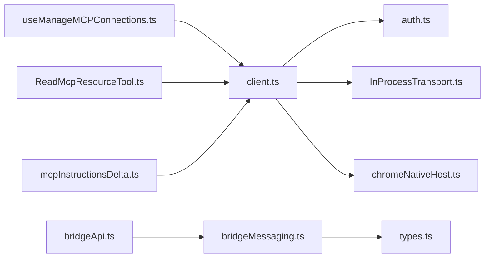

# MCP 协议架构

<cite>
**本文引用的文件**
- [src/services/mcp/client.ts](file://src/services/mcp/client.ts)
- [src/services/mcp/auth.ts](file://src/services/mcp/auth.ts)
- [src/services/mcp/useManageMCPConnections.ts](file://src/services/mcp/useManageMCPConnections.ts)
- [src/utils/claudeInChrome/chromeNativeHost.ts](file://src/utils/claudeInChrome/chromeNativeHost.ts)
- [src/services/mcp/InProcessTransport.ts](file://src/services/mcp/InProcessTransport.ts)
- [src/tools/ReadMcpResourceTool/ReadMcpResourceTool.ts](file://src/tools/ReadMcpResourceTool/ReadMcpResourceTool.ts)
- [src/utils/mcpInstructionsDelta.ts](file://src/utils/mcpInstructionsDelta.ts)
- [src/bridge/bridgeApi.ts](file://src/bridge/bridgeApi.ts)
- [src/bridge/bridgeMessaging.ts](file://src/bridge/bridgeMessaging.ts)
- [src/bridge/types.ts](file://src/bridge/types.ts)
</cite>

## 目录
1. [简介](#简介)
2. [项目结构](#项目结构)
3. [核心组件](#核心组件)
4. [架构总览](#架构总览)
5. [详细组件分析](#详细组件分析)
6. [依赖关系分析](#依赖关系分析)
7. [性能考量](#性能考量)
8. [故障排查指南](#故障排查指南)
9. [结论](#结论)
10. [附录](#附录)

## 简介
本文件系统性梳理并解释模型协作协议（Model Context Protocol，简称 MCP）在该代码库中的架构设计与实现要点。内容覆盖协议数据结构、消息格式与通信机制，协议版本管理策略、错误处理与重连机制，客户端与服务端交互模式与生命周期管理，以及协议扩展点与自定义实现指南，并补充握手过程、认证流程与安全考虑。

## 项目结构
围绕 MCP 的相关代码主要分布在以下模块：
- 服务层：MCP 客户端连接、认证与重连逻辑
- 工具层：对 MCP 资源读取等工具调用
- 传输层：本地进程内传输桥接
- 桥接层：与 Claude 平台的桥接 API 与消息处理
- 工具层：MCP 资源读取工具
- 工具层：MCP 指令增量计算

**图表来源**
- [src/services/mcp/client.ts](file://src/services/mcp/client.ts)
- [src/services/mcp/auth.ts](file://src/services/mcp/auth.ts)
- [src/services/mcp/useManageMCPConnections.ts](file://src/services/mcp/useManageMCPConnections.ts)
- [src/services/mcp/InProcessTransport.ts](file://src/services/mcp/InProcessTransport.ts)
- [src/utils/claudeInChrome/chromeNativeHost.ts](file://src/utils/claudeInChrome/chromeNativeHost.ts)
- [src/bridge/bridgeApi.ts](file://src/bridge/bridgeApi.ts)
- [src/bridge/bridgeMessaging.ts](file://src/bridge/bridgeMessaging.ts)
- [src/bridge/types.ts](file://src/bridge/types.ts)
- [src/tools/ReadMcpResourceTool/ReadMcpResourceTool.ts](file://src/tools/ReadMcpResourceTool/ReadMcpResourceTool.ts)
- [src/utils/mcpInstructionsDelta.ts](file://src/utils/mcpInstructionsDelta.ts)

**章节来源**
- [src/services/mcp/client.ts](file://src/services/mcp/client.ts)
- [src/services/mcp/auth.ts](file://src/services/mcp/auth.ts)
- [src/services/mcp/useManageMCPConnections.ts](file://src/services/mcp/useManageMCPConnections.ts)
- [src/services/mcp/InProcessTransport.ts](file://src/services/mcp/InProcessTransport.ts)
- [src/utils/claudeInChrome/chromeNativeHost.ts](file://src/utils/claudeInChrome/chromeNativeHost.ts)
- [src/bridge/bridgeApi.ts](file://src/bridge/bridgeApi.ts)
- [src/bridge/bridgeMessaging.ts](file://src/bridge/bridgeMessaging.ts)
- [src/bridge/types.ts](file://src/bridge/types.ts)
- [src/tools/ReadMcpResourceTool/ReadMcpResourceTool.ts](file://src/tools/ReadMcpResourceTool/ReadMcpResourceTool.ts)
- [src/utils/mcpInstructionsDelta.ts](file://src/utils/mcpInstructionsDelta.ts)

## 核心组件
- MCP 客户端与连接管理：负责建立连接、执行请求/响应、握手与能力协商、超时与错误处理、以及与 SDK 的集成。
- 认证与令牌管理：封装 OAuth 流程、令牌持久化与刷新、跨实例一致性。
- 重连与生命周期：自动重连、配置变更检测、连接状态跟踪与 UI 反馈。
- 进程内传输：在同进程内模拟双向传输，避免子进程开销。
- Chrome 原生宿主桥接：将 MCP 消息通过长度前缀帧转发给 Chrome 客户端。
- 桥接 API 与消息处理：与平台后端的环境注册、轮询、心跳、权限事件等交互；消息解析与去重。
- 资源读取工具：以 MCP 资源 URI 为输入，发起资源读取请求。
- 指令增量计算：基于已连接服务器集合与会话附件，计算 MCP 指令的新增/移除集合。

**章节来源**
- [src/services/mcp/client.ts](file://src/services/mcp/client.ts)
- [src/services/mcp/auth.ts](file://src/services/mcp/auth.ts)
- [src/services/mcp/useManageMCPConnections.ts](file://src/services/mcp/useManageMCPConnections.ts)
- [src/services/mcp/InProcessTransport.ts](file://src/services/mcp/InProcessTransport.ts)
- [src/utils/claudeInChrome/chromeNativeHost.ts](file://src/utils/claudeInChrome/chromeNativeHost.ts)
- [src/bridge/bridgeApi.ts](file://src/bridge/bridgeApi.ts)
- [src/bridge/bridgeMessaging.ts](file://src/bridge/bridgeMessaging.ts)
- [src/tools/ReadMcpResourceTool/ReadMcpResourceTool.ts](file://src/tools/ReadMcpResourceTool/ReadMcpResourceTool.ts)
- [src/utils/mcpInstructionsDelta.ts](file://src/utils/mcpInstructionsDelta.ts)

## 架构总览
下图展示 MCP 客户端与平台桥接的整体交互路径，包括握手、认证、资源读取、通知与工具响应的转发，以及重连与生命周期管理。

**图表来源**
- [src/services/mcp/client.ts](file://src/services/mcp/client.ts)
- [src/services/mcp/auth.ts](file://src/services/mcp/auth.ts)
- [src/services/mcp/InProcessTransport.ts](file://src/services/mcp/InProcessTransport.ts)
- [src/utils/claudeInChrome/chromeNativeHost.ts](file://src/utils/claudeInChrome/chromeNativeHost.ts)
- [src/bridge/bridgeApi.ts](file://src/bridge/bridgeApi.ts)
- [src/bridge/bridgeMessaging.ts](file://src/bridge/bridgeMessaging.ts)

## 详细组件分析

### 组件一：MCP 客户端与连接管理
- 连接建立：支持超时控制、连接失败清理、SDK 类型区分（进程内 vs 外部进程）。
- 请求/响应：统一 JSON-RPC 消息封装，错误包装为可遥测的安全错误。
- 握手与能力：在连接成功后进行能力协商，记录 capabilities 供后续使用。
- 重连策略：检测配置变化、指数退避、最大尝试次数、定时器清理与 UI 反馈。
- 生命周期：连接状态枚举（如 pending/connected/disabled），断线回调与恢复。

**图表来源**
- [src/services/mcp/client.ts](file://src/services/mcp/client.ts)
- [src/services/mcp/useManageMCPConnections.ts](file://src/services/mcp/useManageMCPConnections.ts)

**章节来源**
- [src/services/mcp/client.ts](file://src/services/mcp/client.ts)
- [src/services/mcp/useManageMCPConnections.ts](file://src/services/mcp/useManageMCPConnections.ts)

### 组件二：认证与令牌管理
- OAuth 流程：登录发现、令牌交换、JWT Bearer 验证，失败阶段记录与统计。
- 令牌存储：安全存储键值结构，按服务器键聚合，支持跨实例缓存与 TTL。
- 刷新策略：401 自动刷新，失败则透传 401；刷新后重试一次请求。
- 清理机制：按服务器键清除本地存储的令牌，确保安全。

**图表来源**
- [src/services/mcp/auth.ts](file://src/services/mcp/auth.ts)

**章节来源**
- [src/services/mcp/auth.ts](file://src/services/mcp/auth.ts)

### 组件三：进程内传输与 Chrome 桥接
- 进程内传输：成对的 InProcessTransport，消息异步投递，关闭时双向 onclose。
- Chrome 原生宿主：长度前缀帧（4 字节小端无符号整数）承载 JSON 数据，多客户端广播，异常日志与断开保护。

**图表来源**
- [src/services/mcp/InProcessTransport.ts](file://src/services/mcp/InProcessTransport.ts)
- [src/utils/claudeInChrome/chromeNativeHost.ts](file://src/utils/claudeInChrome/chromeNativeHost.ts)

**章节来源**
- [src/services/mcp/InProcessTransport.ts](file://src/services/mcp/InProcessTransport.ts)
- [src/utils/claudeInChrome/chromeNativeHost.ts](file://src/utils/claudeInChrome/chromeNativeHost.ts)

### 组件四：桥接 API 与消息处理
- 环境注册/轮询/心跳：环境级鉴权头、工作项轮询、心跳延长租期、停止工作项、归档会话、重新连接会话。
- 权限事件：向会话发送控制响应事件，用于权限决策。
- 消息处理：SDK 消息类型判定、控制请求/响应路由、去重（最近 UUID 集合）、回放防护。

**图表来源**
- [src/bridge/bridgeApi.ts](file://src/bridge/bridgeApi.ts)
- [src/bridge/bridgeMessaging.ts](file://src/bridge/bridgeMessaging.ts)
- [src/bridge/types.ts](file://src/bridge/types.ts)

**章节来源**
- [src/bridge/bridgeApi.ts](file://src/bridge/bridgeApi.ts)
- [src/bridge/bridgeMessaging.ts](file://src/bridge/bridgeMessaging.ts)
- [src/bridge/types.ts](file://src/bridge/types.ts)

### 组件五：资源读取工具与指令增量
- 资源读取工具：根据服务器名称与资源 URI，确保连接有效后发起 resources/read 请求，限制结果大小。
- 指令增量：扫描当前已连接且有指令的服务器集合，对比会话附件中已宣告的名称集合，计算新增/移除集合。

**图表来源**
- [src/tools/ReadMcpResourceTool/ReadMcpResourceTool.ts](file://src/tools/ReadMcpResourceTool/ReadMcpResourceTool.ts)
- [src/utils/mcpInstructionsDelta.ts](file://src/utils/mcpInstructionsDelta.ts)

**章节来源**
- [src/tools/ReadMcpResourceTool/ReadMcpResourceTool.ts](file://src/tools/ReadMcpResourceTool/ReadMcpResourceTool.ts)
- [src/utils/mcpInstructionsDelta.ts](file://src/utils/mcpInstructionsDelta.ts)

## 依赖关系分析
- 客户端依赖传输层与认证层；重连模块依赖客户端与配置比较函数。
- Chrome 原生宿主依赖传输层以模拟 MCP 客户端行为。
- 桥接 API 与消息处理为上层 UI 提供稳定的消息通道与权限控制。
- 工具层通过客户端访问 MCP 资源，受客户端连接状态与能力约束。

**图表来源**
- [src/services/mcp/client.ts](file://src/services/mcp/client.ts)
- [src/services/mcp/auth.ts](file://src/services/mcp/auth.ts)
- [src/services/mcp/useManageMCPConnections.ts](file://src/services/mcp/useManageMCPConnections.ts)
- [src/services/mcp/InProcessTransport.ts](file://src/services/mcp/InProcessTransport.ts)
- [src/utils/claudeInChrome/chromeNativeHost.ts](file://src/utils/claudeInChrome/chromeNativeHost.ts)
- [src/tools/ReadMcpResourceTool/ReadMcpResourceTool.ts](file://src/tools/ReadMcpResourceTool/ReadMcpResourceTool.ts)
- [src/utils/mcpInstructionsDelta.ts](file://src/utils/mcpInstructionsDelta.ts)
- [src/bridge/bridgeApi.ts](file://src/bridge/bridgeApi.ts)
- [src/bridge/bridgeMessaging.ts](file://src/bridge/bridgeMessaging.ts)
- [src/bridge/types.ts](file://src/bridge/types.ts)

**章节来源**
- [src/services/mcp/client.ts](file://src/services/mcp/client.ts)
- [src/services/mcp/auth.ts](file://src/services/mcp/auth.ts)
- [src/services/mcp/useManageMCPConnections.ts](file://src/services/mcp/useManageMCPConnections.ts)
- [src/services/mcp/InProcessTransport.ts](file://src/services/mcp/InProcessTransport.ts)
- [src/utils/claudeInChrome/chromeNativeHost.ts](file://src/utils/claudeInChrome/chromeNativeHost.ts)
- [src/tools/ReadMcpResourceTool/ReadMcpResourceTool.ts](file://src/tools/ReadMcpResourceTool/ReadMcpResourceTool.ts)
- [src/utils/mcpInstructionsDelta.ts](file://src/utils/mcpInstructionsDelta.ts)
- [src/bridge/bridgeApi.ts](file://src/bridge/bridgeApi.ts)
- [src/bridge/bridgeMessaging.ts](file://src/bridge/bridgeMessaging.ts)
- [src/bridge/types.ts](file://src/bridge/types.ts)

## 性能考量
- 进程内传输采用微任务异步投递，避免同步请求/响应导致的栈深问题。
- 消息去重使用环形缓冲区，容量固定，内存占用 O(N)，降低重复消息处理成本。
- 轮询与心跳采用超时与幂等设计，减少无效请求与资源浪费。
- 重连策略引入指数退避与最大尝试次数，避免风暴式重试。

[本节为通用指导，无需列出具体文件来源]

## 故障排查指南
- 连接超时：检查 getConnectionTimeoutMs 配置与网络状况；确认 onclose/close 行为正确清理。
- 认证失败：核对 OAuth 流程阶段与令牌存储；关注 401 自动刷新与重试逻辑。
- 重连失败：查看重连计时器清理与状态更新；确认 areMcpConfigsEqual 是否误判配置未变。
- 消息丢失/重复：检查 BoundedUUIDSet 的容量与写入索引；确认 ingress 消息解析与去重逻辑。
- Chrome 桥接异常：验证长度前缀帧校验与最大消息尺寸；确认广播路径与异常日志。

**章节来源**
- [src/services/mcp/client.ts](file://src/services/mcp/client.ts)
- [src/services/mcp/auth.ts](file://src/services/mcp/auth.ts)
- [src/services/mcp/useManageMCPConnections.ts](file://src/services/mcp/useManageMCPConnections.ts)
- [src/bridge/bridgeMessaging.ts](file://src/bridge/bridgeMessaging.ts)
- [src/utils/claudeInChrome/chromeNativeHost.ts](file://src/utils/claudeInChrome/chromeNativeHost.ts)

## 结论
该 MCP 架构在客户端连接、认证与重连、传输抽象、桥接与消息处理等方面形成了清晰的分层与职责边界。通过统一的 JSON-RPC 消息格式、严格的错误与超时处理、以及可扩展的传输与桥接机制，既满足了与外部 MCP 服务的互操作，也为本地开发与调试提供了高效路径。建议在扩展新传输或自定义认证提供商时，遵循现有接口契约与错误处理模式，确保一致的可观测性与可维护性。

[本节为总结性内容，无需列出具体文件来源]

## 附录

### 协议版本管理
- 能力协商：握手完成后记录 capabilities，作为后续功能开关依据。
- 配置比较：areMcpConfigsEqual 用于判断是否需要重建连接（如配置变更）。
- 版本兼容：SDK 类型区分（进程内/外部）避免不必要的重启。

**章节来源**
- [src/services/mcp/client.ts](file://src/services/mcp/client.ts)
- [src/services/mcp/useManageMCPConnections.ts](file://src/services/mcp/useManageMCPConnections.ts)

### 错误处理与安全
- 可遥测安全错误：统一包装连接/认证错误，便于追踪但不泄露敏感信息。
- 令牌安全：安全存储、跨实例缓存、TTL 控制；401 自动刷新与失败透传。
- 消息安全：长度前缀帧校验、最大消息尺寸限制、异常断开保护。

**章节来源**
- [src/services/mcp/client.ts](file://src/services/mcp/client.ts)
- [src/services/mcp/auth.ts](file://src/services/mcp/auth.ts)
- [src/utils/claudeInChrome/chromeNativeHost.ts](file://src/utils/claudeInChrome/chromeNativeHost.ts)

### 扩展点与自定义实现指南
- 自定义传输：实现 Transport 接口（start/send/close/onmessage/onerror/onclose），与客户端 connect/transport 集成。
- 自定义认证：实现 OAuth Provider 接口（tokens/授权流程），与 auth.ts 的令牌存储与刷新流程对接。
- 自定义桥接：在 bridgeApi.ts/bridgeMessaging.ts 中扩展消息类型与处理逻辑，保持与 SDK 消息格式一致。

**章节来源**
- [src/services/mcp/InProcessTransport.ts](file://src/services/mcp/InProcessTransport.ts)
- [src/services/mcp/auth.ts](file://src/services/mcp/auth.ts)
- [src/bridge/bridgeApi.ts](file://src/bridge/bridgeApi.ts)
- [src/bridge/bridgeMessaging.ts](file://src/bridge/bridgeMessaging.ts)