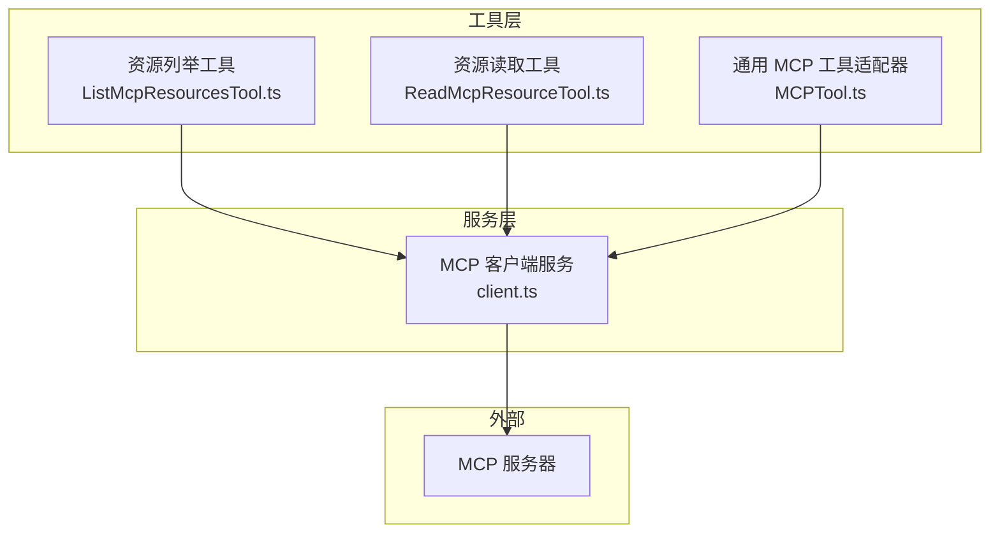
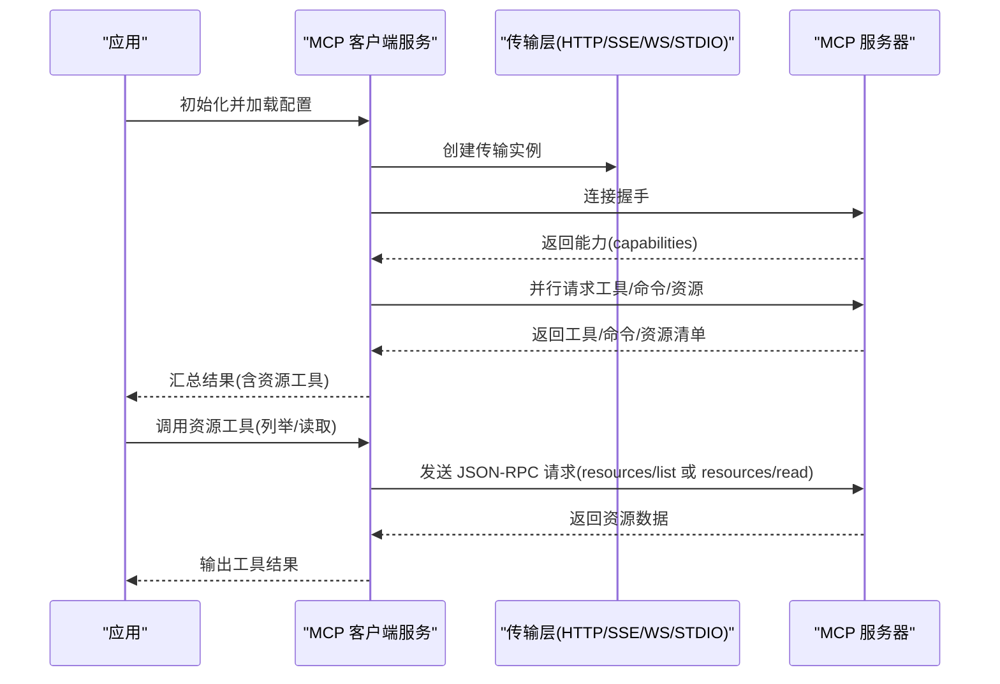
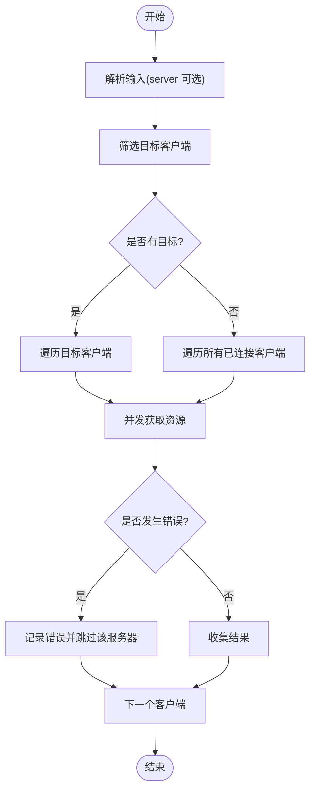
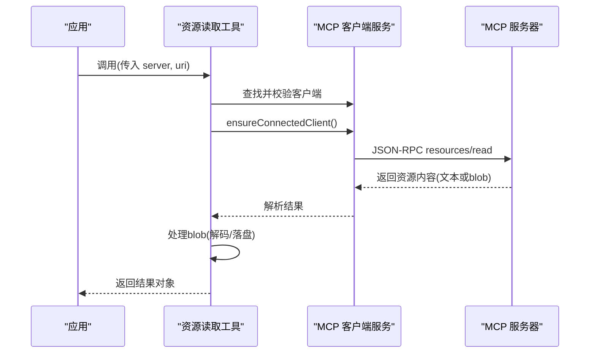
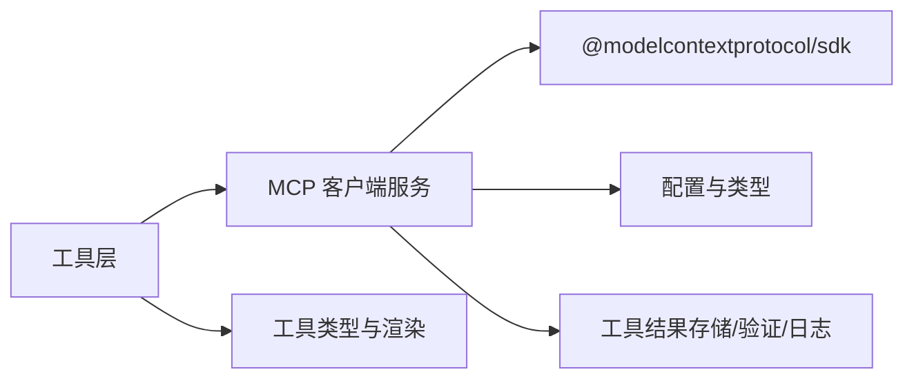
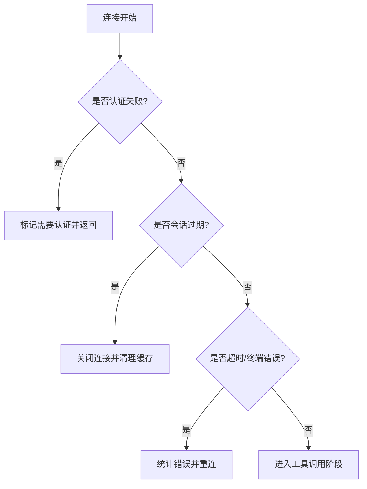

# MCP 客户端集成

<cite>
**本文引用的文件**
- [client.ts](file://src/services/mcp/client.ts)
- [ListMcpResourcesTool.ts](file://src/tools/ListMcpResourcesTool/ListMcpResourcesTool.ts)
- [ReadMcpResourceTool.ts](file://src/tools/ReadMcpResourceTool/ReadMcpResourceTool.ts)
- [MCPTool.ts](file://src/tools/MCPTool/MCPTool.ts)
- [prompt.ts（列表资源）](file://src/tools/ListMcpResourcesTool/prompt.ts)
- [prompt.ts（MCP 工具）](file://src/tools/MCPTool/prompt.ts)
</cite>

## 目录
1. [简介](#简介)
2. [项目结构](#项目结构)
3. [核心组件](#核心组件)
4. [架构总览](#架构总览)
5. [详细组件分析](#详细组件分析)
6. [依赖关系分析](#依赖关系分析)
7. [性能考量](#性能考量)
8. [故障排查指南](#故障排查指南)
9. [结论](#结论)
10. [附录](#附录)

## 简介
本文件面向希望在系统中集成 MCP（Model Context Protocol）客户端的工程师，提供从初始化、连接到工具调用的完整指南。重点覆盖两类 MCP 资源工具：资源列举工具与资源读取工具；同时阐述 MCP 工具的参数配置、权限管理、错误处理策略，以及与 MCP 服务器的交互模式与数据传输流程。文档还包含实际使用示例、最佳实践与性能优化建议。

## 项目结构
MCP 客户端集成由以下模块协同完成：
- 服务层：负责与 MCP 服务器建立连接、发现能力、拉取工具/命令/资源、缓存与重连、错误处理与日志等。
- 工具层：封装 MCP 资源工具（列举与读取）与通用 MCP 工具适配器，统一输入输出与渲染。
- 配置与类型：定义服务器配置、连接状态、能力声明与传输层选择。

图表来源
- [client.ts:1-120](file://src/services/mcp/client.ts#L1-L120)
- [ListMcpResourcesTool.ts:1-124](file://src/tools/ListMcpResourcesTool/ListMcpResourcesTool.ts#L1-L124)
- [ReadMcpResourceTool.ts:1-159](file://src/tools/ReadMcpResourceTool/ReadMcpResourceTool.ts#L1-L159)
- [MCPTool.ts:1-78](file://src/tools/MCPTool/MCPTool.ts#L1-L78)

章节来源
- [client.ts:1-120](file://src/services/mcp/client.ts#L1-L120)
- [ListMcpResourcesTool.ts:1-124](file://src/tools/ListMcpResourcesTool/ListMcpResourcesTool.ts#L1-L124)
- [ReadMcpResourceTool.ts:1-159](file://src/tools/ReadMcpResourceTool/ReadMcpResourceTool.ts#L1-L159)
- [MCPTool.ts:1-78](file://src/tools/MCPTool/MCPTool.ts#L1-L78)

## 核心组件
- MCP 客户端服务：负责连接管理、能力探测、工具/命令/资源发现、缓存与失效、错误分类与重连、超时控制与代理支持。
- 资源列举工具：按服务器过滤列出可用资源，聚合多服务器结果，支持输出截断与 UI 渲染。
- 资源读取工具：根据服务器名与资源 URI 读取资源内容，自动处理二进制 blob 存储与文本回显。
- 通用 MCP 工具适配器：承载 MCP 工具的动态名称、描述、提示与权限检查，作为工具注册入口。

章节来源
- [client.ts:1-120](file://src/services/mcp/client.ts#L1-L120)
- [ListMcpResourcesTool.ts:40-124](file://src/tools/ListMcpResourcesTool/ListMcpResourcesTool.ts#L40-L124)
- [ReadMcpResourceTool.ts:49-159](file://src/tools/ReadMcpResourceTool/ReadMcpResourceTool.ts#L49-L159)
- [MCPTool.ts:27-78](file://src/tools/MCPTool/MCPTool.ts#L27-L78)

## 架构总览
下图展示 MCP 客户端与服务器的交互路径：客户端通过不同传输层（HTTP、SSE、WebSocket、STDIO、claude.ai 代理）建立连接，探测服务器能力后并行获取工具、命令与资源，随后在工具调用阶段发起请求并接收响应。

图表来源
- [client.ts:595-1200](file://src/services/mcp/client.ts#L595-L1200)
- [ListMcpResourcesTool.ts:66-101](file://src/tools/ListMcpResourcesTool/ListMcpResourcesTool.ts#L66-L101)
- [ReadMcpResourceTool.ts:75-101](file://src/tools/ReadMcpResourceTool/ReadMcpResourceTool.ts#L75-L101)

章节来源
- [client.ts:595-1200](file://src/services/mcp/client.ts#L595-L1200)
- [ListMcpResourcesTool.ts:66-101](file://src/tools/ListMcpResourcesTool/ListMcpResourcesTool.ts#L66-L101)
- [ReadMcpResourceTool.ts:75-101](file://src/tools/ReadMcpResourceTool/ReadMcpResourceTool.ts#L75-L101)

## 详细组件分析

### 资源列举工具（ListMcpResourcesTool）
职责与行为
- 输入：可选服务器名过滤。
- 处理：对目标或全部已连接的 MCP 客户端并行执行“获取资源”操作，合并结果；单个服务器失败不影响整体返回。
- 输出：资源数组（包含 URI、名称、MIME 类型、描述与来源服务器）。
- 渲染：支持 UI 展示与截断提示。

关键实现要点
- 使用连接缓存与失效机制，确保启动预热与变更通知后结果不陈旧。
- 对每个客户端进行健康检查与必要时重建连接，保证调用成功率。
- 错误日志化但不中断整体流程。

图表来源
- [ListMcpResourcesTool.ts:66-101](file://src/tools/ListMcpResourcesTool/ListMcpResourcesTool.ts#L66-L101)
- [client.ts:2344-2379](file://src/services/mcp/client.ts#L2344-L2379)

章节来源
- [ListMcpResourcesTool.ts:1-124](file://src/tools/ListMcpResourcesTool/ListMcpResourcesTool.ts#L1-L124)
- [client.ts:2344-2379](file://src/services/mcp/client.ts#L2344-L2379)

### 资源读取工具（ReadMcpResourceTool）
职责与行为
- 输入：服务器名与资源 URI。
- 处理：定位客户端、校验连接与能力、发起资源读取请求；对二进制内容进行解码与落盘，生成可读提示。
- 输出：包含文本或二进制落盘信息的结果对象。
- 渲染：将结果序列化为消息块供 UI 展示。

关键实现要点
- 严格校验：服务器存在性、连接状态、能力支持。
- 数据处理：区分文本与 blob，blob 自动持久化并替换为本地路径提示。
- 错误处理：捕获并抛出语义化错误，便于上层识别与提示。

图表来源
- [ReadMcpResourceTool.ts:75-144](file://src/tools/ReadMcpResourceTool/ReadMcpResourceTool.ts#L75-L144)
- [client.ts:94-95](file://src/services/mcp/client.ts#L94-L95)

章节来源
- [ReadMcpResourceTool.ts:1-159](file://src/tools/ReadMcpResourceTool/ReadMcpResourceTool.ts#L1-L159)
- [client.ts:94-95](file://src/services/mcp/client.ts#L94-L95)

### 通用 MCP 工具适配器（MCPTool）
职责与行为
- 动态承载 MCP 工具的名称、描述、提示与权限检查。
- 作为工具注册的桥接层，将 MCP 服务器提供的工具以统一接口暴露给上层。

关键实现要点
- 名称与描述在运行时被覆盖，以反映具体 MCP 工具的元数据。
- 权限检查采用“透传”策略，交由上层统一处理。

章节来源
- [MCPTool.ts:1-78](file://src/tools/MCPTool/MCPTool.ts#L1-L78)
- [prompt.ts（MCP 工具）:1-4](file://src/tools/MCPTool/prompt.ts#L1-L4)

### MCP 客户端服务（连接与能力管理）
职责与行为
- 传输层选择：支持 HTTP、SSE、WebSocket、STDIO、claude.ai 代理等多种传输。
- 连接与超时：统一连接超时控制与请求级超时包装，避免信号过期问题。
- 能力探测：连接后读取服务器能力，决定是否启用资源/工具/提示等特性。
- 缓存与失效：对工具、命令、资源与技能进行 LRU 缓存，基于关闭事件与通知触发失效。
- 错误分类与重连：区分认证失败、会话过期、网络终端错误等，触发相应处理与重连。
- 日志与可观测性：详尽的日志与埋点，便于诊断连接与调用问题。

章节来源
- [client.ts:595-1200](file://src/services/mcp/client.ts#L595-L1200)
- [client.ts:1200-1599](file://src/services/mcp/client.ts#L1200-L1599)

## 依赖关系分析
- 工具依赖服务：资源工具通过客户端服务获取连接、缓存与能力信息。
- 服务依赖 SDK：使用 MCP SDK 的传输层与 JSON-RPC 能力。
- 服务依赖配置：从配置模块读取服务器列表与禁用标志，结合环境变量调整超时与批大小。
- 服务依赖工具层：在连接成功后注入资源工具与通用 MCP 工具适配器。

图表来源
- [client.ts:1-120](file://src/services/mcp/client.ts#L1-L120)
- [ListMcpResourcesTool.ts:1-14](file://src/tools/ListMcpResourcesTool/ListMcpResourcesTool.ts#L1-L14)
- [ReadMcpResourceTool.ts:1-21](file://src/tools/ReadMcpResourceTool/ReadMcpResourceTool.ts#L1-L21)
- [MCPTool.ts:1-12](file://src/tools/MCPTool/MCPTool.ts#L1-L12)

章节来源
- [client.ts:1-120](file://src/services/mcp/client.ts#L1-L120)
- [ListMcpResourcesTool.ts:1-14](file://src/tools/ListMcpResourcesTool/ListMcpResourcesTool.ts#L1-L14)
- [ReadMcpResourceTool.ts:1-21](file://src/tools/ReadMcpResourceTool/ReadMcpResourceTool.ts#L1-L21)
- [MCPTool.ts:1-12](file://src/tools/MCPTool/MCPTool.ts#L1-L12)

## 性能考量
- 并发连接与批量：支持批量连接与远程服务器批量连接，提升大规模服务器接入效率。
- 请求超时与长连接：对非 GET 请求强制设置超时，避免信号过期导致的请求失败；SSE 等长连接使用专用 fetch 包装。
- 缓存策略：工具/命令/资源与技能结果采用 LRU 缓存，配合失效事件避免陈旧数据。
- 输出截断：对大结果进行截断提示，避免上下文溢出。
- 二进制处理：资源读取中的二进制内容直接落盘并返回路径提示，减少上下文膨胀。

章节来源
- [client.ts:552-561](file://src/services/mcp/client.ts#L552-L561)
- [client.ts:492-550](file://src/services/mcp/client.ts#L492-L550)
- [client.ts:1391-1396](file://src/services/mcp/client.ts#L1391-L1396)
- [ListMcpResourcesTool.ts:105-107](file://src/tools/ListMcpResourcesTool/ListMcpResourcesTool.ts#L105-L107)
- [ReadMcpResourceTool.ts:106-139](file://src/tools/ReadMcpResourceTool/ReadMcpResourceTool.ts#L106-L139)

## 故障排查指南
常见错误与处理
- 认证失败：当服务器返回未授权时，服务会发出“需要认证”的状态并写入缓存，避免重复尝试。
- 会话过期：HTTP/代理传输中检测到特定错误码组合时，主动关闭连接并清理缓存，促使后续调用重建会话。
- 连接超时/终端错误：对远程传输设置连接超时；对连续终端错误进行统计并在阈值后触发重连。
- 工具调用异常：对工具返回的错误结果保留元数据，便于诊断与上报。

图表来源
- [client.ts:340-361](file://src/services/mcp/client.ts#L340-L361)
- [client.ts:1318-1367](file://src/services/mcp/client.ts#L1318-L1367)
- [client.ts:193-206](file://src/services/mcp/client.ts#L193-L206)

章节来源
- [client.ts:340-361](file://src/services/mcp/client.ts#L340-L361)
- [client.ts:1318-1367](file://src/services/mcp/client.ts#L1318-L1367)
- [client.ts:193-206](file://src/services/mcp/client.ts#L193-L206)

## 结论
本集成方案通过统一的 MCP 客户端服务，实现了对多种传输方式的支持、能力探测与资源工具的自动注入，并提供了稳健的错误处理与缓存策略。资源列举与读取工具以最小耦合的方式接入，既满足通用 MCP 工具的适配需求，又针对资源场景做了专门优化（如二进制落盘）。建议在生产环境中结合批量连接、超时与重连策略，配合日志与埋点持续监控连接质量与调用性能。

## 附录

### 参数配置与环境变量
- 连接超时：可通过环境变量设置连接超时时间。
- 请求超时：对非 GET 请求强制设置超时，避免信号过期问题。
- 批量大小：可配置本地与远程服务器的连接批量大小。
- 工具调用超时：可通过环境变量设置工具调用超时时间。
- 代理与 TLS：支持 HTTP/HTTPS 代理与 mTLS 选项，确保跨网络环境稳定连接。

章节来源
- [client.ts:456-463](file://src/services/mcp/client.ts#L456-L463)
- [client.ts:492-550](file://src/services/mcp/client.ts#L492-L550)
- [client.ts:552-561](file://src/services/mcp/client.ts#L552-L561)
- [client.ts:88-95](file://src/services/mcp/client.ts#L88-L95)

### 权限管理与安全
- 认证失败缓存：在认证失败时写入短期缓存，避免频繁重试。
- OAuth 刷新：在 claude.ai 代理场景下自动刷新令牌并重试。
- 会话过期检测：对特定错误码组合进行识别，主动清理缓存并重建会话。
- 头部与代理：统一注入用户代理与自定义头部，支持代理与 TLS 选项。

章节来源
- [client.ts:257-316](file://src/services/mcp/client.ts#L257-L316)
- [client.ts:372-422](file://src/services/mcp/client.ts#L372-L422)
- [client.ts:1318-1367](file://src/services/mcp/client.ts#L1318-L1367)

### 实际使用示例（步骤说明）
- 列举资源
  - 步骤：调用资源列举工具，可选传入服务器名；等待并发结果汇总。
  - 关键点：工具内部会过滤未连接或无资源能力的服务器，仅返回有效资源。
- 读取资源
  - 步骤：传入服务器名与资源 URI；若为二进制资源，工具会自动落盘并返回本地路径提示。
  - 关键点：工具会校验服务器存在性、连接状态与能力支持，失败即抛出语义化错误。

章节来源
- [ListMcpResourcesTool.ts:66-101](file://src/tools/ListMcpResourcesTool/ListMcpResourcesTool.ts#L66-L101)
- [ReadMcpResourceTool.ts:75-144](file://src/tools/ReadMcpResourceTool/ReadMcpResourceTool.ts#L75-L144)

### 最佳实践
- 合理设置超时与批量：根据服务器数量与网络状况调整批量大小与超时时间。
- 使用缓存与失效：依赖内置缓存与失效策略，避免频繁重复请求。
- 错误隔离：资源列举工具对单服务器失败进行隔离，确保整体可用性。
- 输出截断：对大结果进行截断提示，避免上下文溢出。
- 二进制落盘：优先将大体积二进制内容落盘，减少上下文污染。

章节来源
- [client.ts:492-550](file://src/services/mcp/client.ts#L492-L550)
- [client.ts:1391-1396](file://src/services/mcp/client.ts#L1391-L1396)
- [ListMcpResourcesTool.ts:105-107](file://src/tools/ListMcpResourcesTool/ListMcpResourcesTool.ts#L105-L107)
- [ReadMcpResourceTool.ts:106-139](file://src/tools/ReadMcpResourceTool/ReadMcpResourceTool.ts#L106-L139)