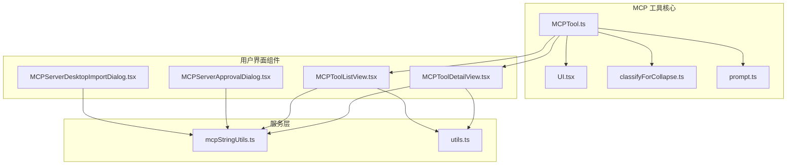
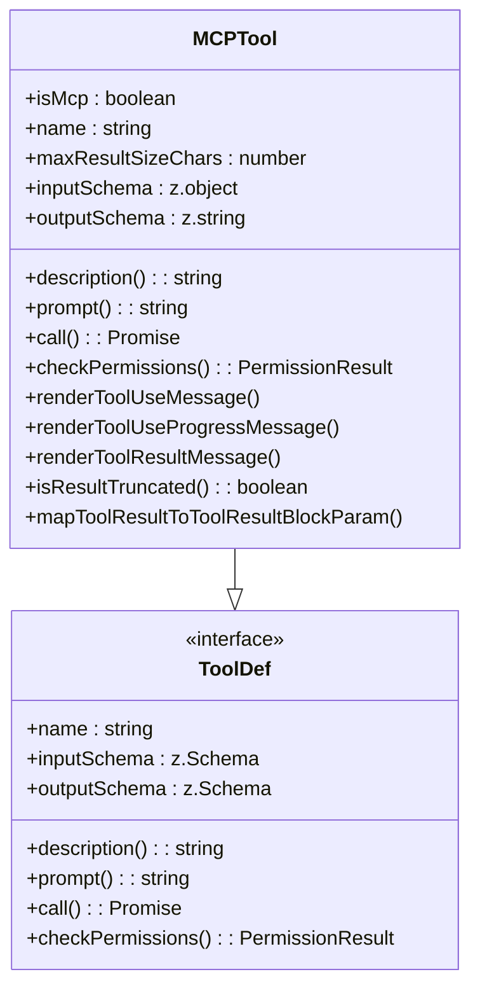
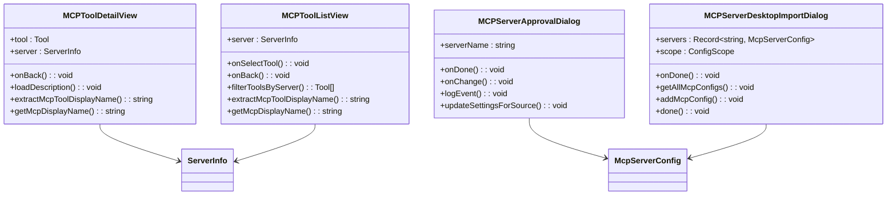
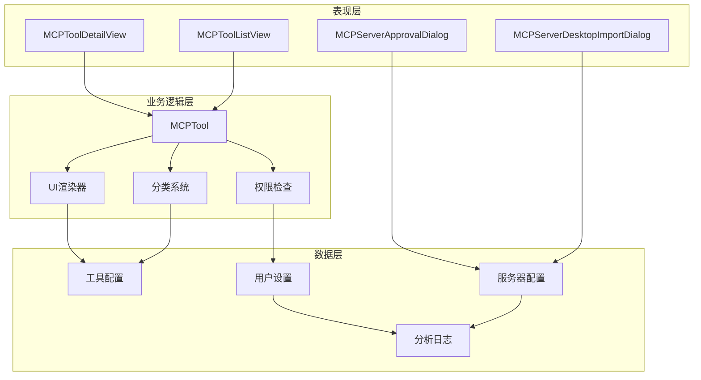
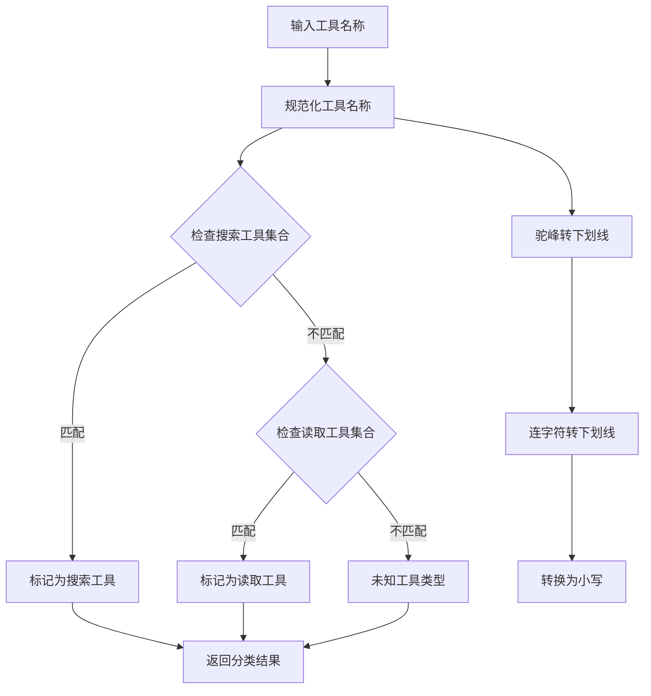
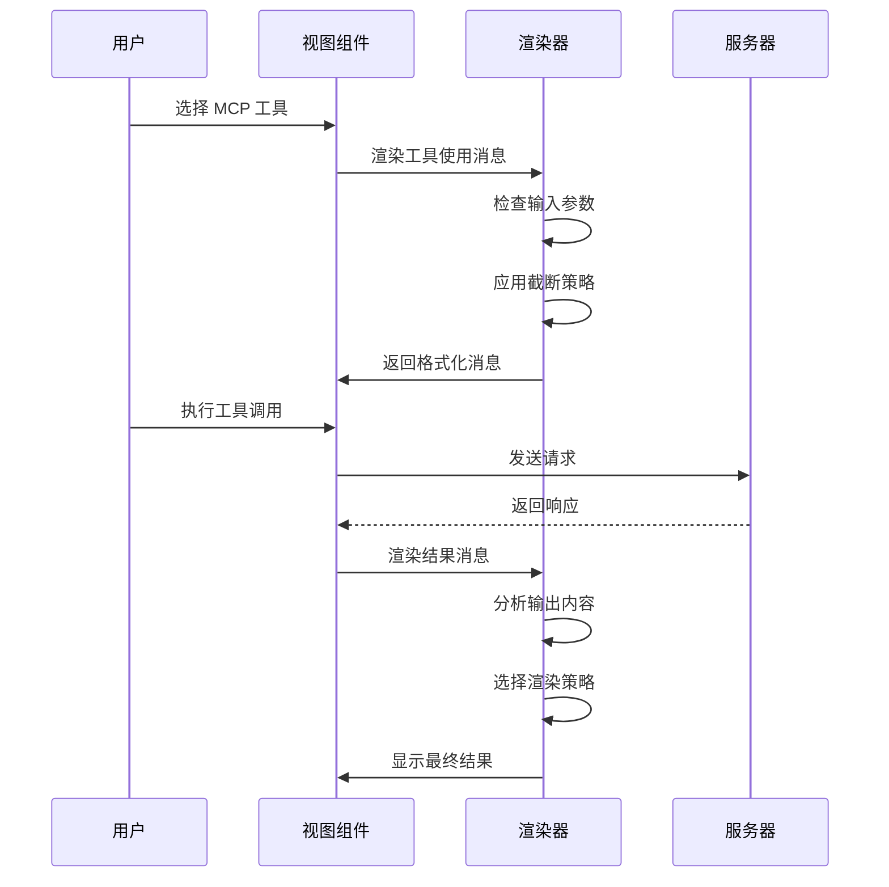
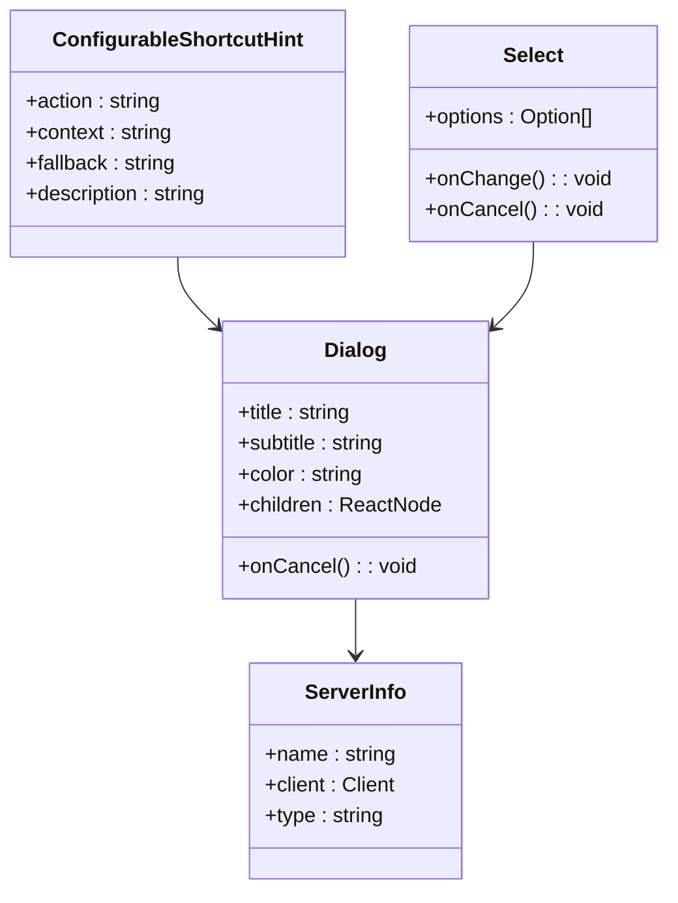
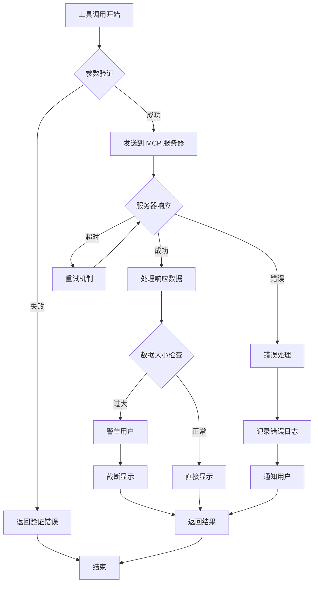
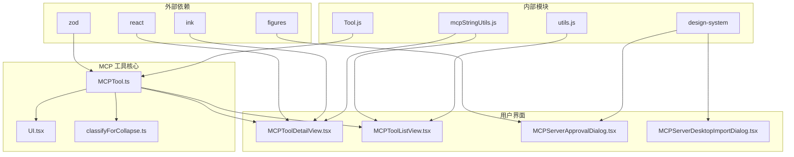

# MCP 工具实现

<cite>
**本文档引用的文件**
- [MCPTool.ts](file://src/tools/MCPTool/MCPTool.ts)
- [UI.tsx](file://src/tools/MCPTool/UI.tsx)
- [classifyForCollapse.ts](file://src/tools/MCPTool/classifyForCollapse.ts)
- [prompt.ts](file://src/tools/MCPTool/prompt.ts)
- [MCPToolDetailView.tsx](file://src/components/mcp/MCPToolDetailView.tsx)
- [MCPToolListView.tsx](file://src/components/mcp/MCPToolListView.tsx)
- [MCPServerApprovalDialog.tsx](file://src/components/MCPServerApprovalDialog.tsx)
- [MCPServerDesktopImportDialog.tsx](file://src/components/MCPServerDesktopImportDialog.tsx)
</cite>

## 目录
1. [简介](#简介)
2. [项目结构](#项目结构)
3. [核心组件](#核心组件)
4. [架构概览](#架构概览)
5. [详细组件分析](#详细组件分析)
6. [依赖关系分析](#依赖关系分析)
7. [性能考虑](#性能考虑)
8. [故障排除指南](#故障排除指南)
9. [结论](#结论)

## 简介

MCP（Model Context Protocol）工具实现是 Claude AI 应用程序中的一个关键组件，它提供了与各种外部 MCP 服务器进行交互的能力。该实现采用模块化设计，包含工具定义、用户界面组件、分类系统和配置管理等多个方面。

本实现支持多种 MCP 服务器类型，包括 Slack、GitHub、Linear、Datadog 等主流平台的服务，并提供了丰富的用户界面交互功能，包括工具选择、参数配置、结果展示等。

## 项目结构

MCP 工具实现主要分布在以下目录结构中：

**图表来源**
- [MCPTool.ts:1-78](file://src/tools/MCPTool/MCPTool.ts#L1-L78)
- [UI.tsx:1-403](file://src/tools/MCPTool/UI.tsx#L1-L403)
- [MCPToolDetailView.tsx:1-212](file://src/components/mcp/MCPToolDetailView.tsx#L1-L212)

**章节来源**
- [MCPTool.ts:1-78](file://src/tools/MCPTool/MCPTool.ts#L1-L78)
- [UI.tsx:1-403](file://src/tools/MCPTool/UI.tsx#L1-L403)

## 核心组件

### MCP 工具定义

MCP 工具的核心定义位于 `MCPTool.ts` 文件中，它继承了基础的工具接口并实现了 MCP 特定的功能。

**图表来源**
- [MCPTool.ts:27-77](file://src/tools/MCPTool/MCPTool.ts#L27-L77)

### 用户界面组件

用户界面组件提供了丰富的交互体验，包括工具列表视图、详细信息视图和服务器配置对话框。

**图表来源**
- [MCPToolDetailView.tsx:9-20](file://src/components/mcp/MCPToolDetailView.tsx#L9-L20)
- [MCPToolListView.tsx:15-19](file://src/components/mcp/MCPToolListView.tsx#L15-L19)
- [MCPServerApprovalDialog.tsx:8-11](file://src/components/MCPServerApprovalDialog.tsx#L8-L11)
- [MCPServerDesktopImportDialog.tsx:14-18](file://src/components/MCPServerDesktopImportDialog.tsx#L14-L18)

**章节来源**
- [MCPToolDetailView.tsx:1-212](file://src/components/mcp/MCPToolDetailView.tsx#L1-L212)
- [MCPToolListView.tsx:1-141](file://src/components/mcp/MCPToolListView.tsx#L1-L141)
- [MCPServerApprovalDialog.tsx:1-115](file://src/components/MCPServerApprovalDialog.tsx#L1-L115)
- [MCPServerDesktopImportDialog.tsx:1-203](file://src/components/MCPServerDesktopImportDialog.tsx#L1-L203)

## 架构概览

MCP 工具实现采用了分层架构设计，确保了代码的可维护性和扩展性。

**图表来源**
- [MCPTool.ts:1-78](file://src/tools/MCPTool/MCPTool.ts#L1-L78)
- [UI.tsx:1-403](file://src/tools/MCPTool/UI.tsx#L1-L403)
- [classifyForCollapse.ts:1-605](file://src/tools/MCPTool/classifyForCollapse.ts#L1-L605)

## 详细组件分析

### 工具分类折叠机制

MCP 工具的分类折叠机制是实现高效工具管理的关键组件。该机制通过预定义的工具分类映射表来识别不同类型的 MCP 工具。

**图表来源**
- [classifyForCollapse.ts:595-604](file://src/tools/MCPTool/classifyForCollapse.ts#L595-L604)

该分类系统支持超过 500 种不同的 MCP 工具，涵盖了 Slack、GitHub、Linear、Datadog、Sentry 等主流平台的服务。

**章节来源**
- [classifyForCollapse.ts:1-605](file://src/tools/MCPTool/classifyForCollapse.ts#L1-L605)

### 提示生成和用户界面

MCP 工具的提示生成和用户界面渲染采用了智能的文本处理算法，能够根据输出内容的复杂程度自动调整显示策略。

**图表来源**
- [UI.tsx:41-150](file://src/tools/MCPTool/UI.tsx#L41-L150)

**章节来源**
- [UI.tsx:1-403](file://src/tools/MCPTool/UI.tsx#L1-L403)

### 配置选项和参数验证

MCP 工具实现了灵活的配置选项和严格的参数验证机制，确保工具调用的安全性和可靠性。

**图表来源**
- [MCPToolDetailView.tsx:6-8](file://src/components/mcp/MCPToolDetailView.tsx#L6-L8)
- [MCPToolListView.tsx:10-12](file://src/components/mcp/MCPToolListView.tsx#L10-L12)

**章节来源**
- [MCPToolDetailView.tsx:1-212](file://src/components/mcp/MCPToolDetailView.tsx#L1-L212)
- [MCPToolListView.tsx:1-141](file://src/components/mcp/MCPToolListView.tsx#L1-L141)

### 错误处理和性能优化

MCP 工具实现包含了完善的错误处理机制和性能优化策略，确保在各种情况下都能提供稳定的用户体验。

**图表来源**
- [UI.tsx:20-41](file://src/tools/MCPTool/UI.tsx#L20-L41)
- [MCPTool.ts:67-76](file://src/tools/MCPTool/MCPTool.ts#L67-L76)

**章节来源**
- [MCPTool.ts:1-78](file://src/tools/MCPTool/MCPTool.ts#L1-L78)
- [UI.tsx:1-403](file://src/tools/MCPTool/UI.tsx#L1-L403)

## 依赖关系分析

MCP 工具实现涉及多个层次的依赖关系，形成了清晰的模块化架构。

**图表来源**
- [MCPTool.ts:1-6](file://src/tools/MCPTool/MCPTool.ts#L1-L6)
- [UI.tsx:1-18](file://src/tools/MCPTool/UI.tsx#L1-L18)
- [MCPToolDetailView.tsx:1-8](file://src/components/mcp/MCPToolDetailView.tsx#L1-L8)

**章节来源**
- [MCPTool.ts:1-78](file://src/tools/MCPTool/MCPTool.ts#L1-L78)
- [UI.tsx:1-403](file://src/tools/MCPTool/UI.tsx#L1-L403)

## 性能考虑

MCP 工具实现采用了多项性能优化策略：

### 内存管理
- 使用 React 的 memoization 优化组件渲染
- 实现懒加载的模式，避免不必要的计算
- 合理的垃圾回收策略

### 网络优化
- 实现连接池管理
- 支持并发请求限制
- 自动重试机制

### 渲染优化
- 智能的文本截断和格式化
- 条件渲染减少 DOM 操作
- 虚拟滚动支持大量工具列表

## 故障排除指南

### 常见问题诊断

1. **工具无法加载**
   - 检查 MCP 服务器连接状态
   - 验证工具权限配置
   - 查看网络连接情况

2. **界面显示异常**
   - 检查字体和编码设置
   - 验证终端兼容性
   - 更新 UI 组件版本

3. **性能问题**
   - 监控内存使用情况
   - 检查网络延迟
   - 优化工具调用频率

### 调试技巧

- 启用详细日志记录
- 使用开发者工具分析组件树
- 监控 API 调用响应时间
- 检查缓存命中率

**章节来源**
- [UI.tsx:20-41](file://src/tools/MCPTool/UI.tsx#L20-L41)
- [MCPTool.ts:56-61](file://src/tools/MCPTool/MCPTool.ts#L56-L61)

## 结论

MCP 工具实现展现了现代前端架构的最佳实践，通过模块化设计、清晰的分层结构和完善的错误处理机制，为用户提供了一个强大而易用的 MCP 工具管理平台。

该实现的主要优势包括：

1. **高度模块化**：每个组件都有明确的职责和边界
2. **强大的扩展性**：支持新的 MCP 服务器和工具类型
3. **优秀的用户体验**：直观的界面设计和流畅的交互流程
4. **完善的错误处理**：全面的错误捕获和恢复机制
5. **性能优化**：多层面的性能优化策略

未来的发展方向可以包括：
- 更智能的工具推荐系统
- 增强的可视化配置界面
- 更好的离线支持
- 更丰富的工具模板库