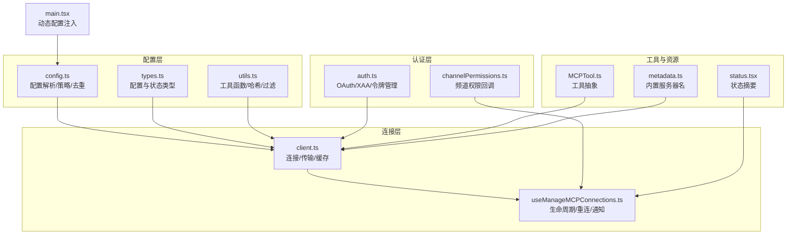
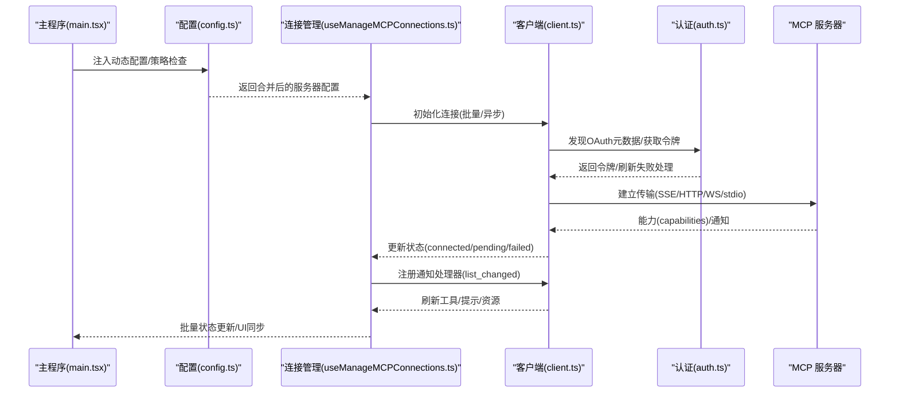
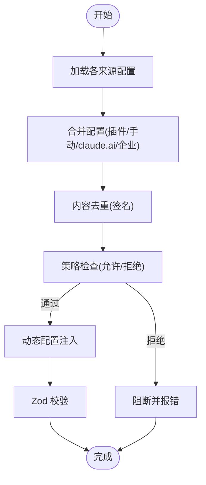
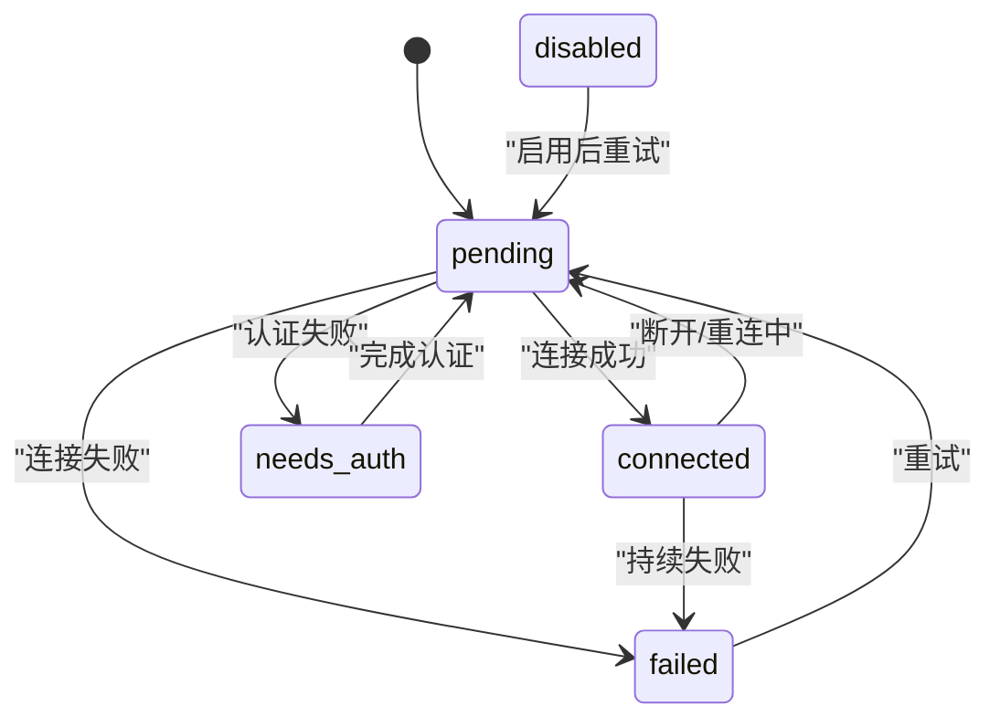
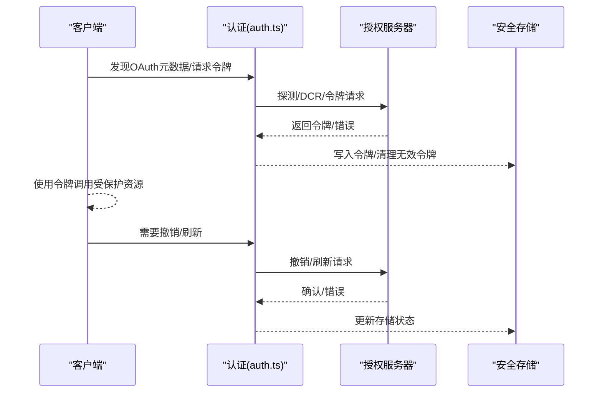
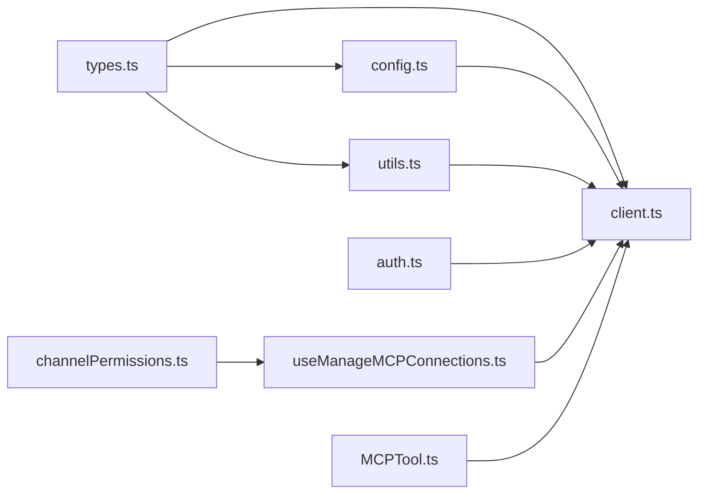

# MCP 服务器管理

<cite>
**本文档引用的文件**
- [client.ts](file://src/services/mcp/client.ts)
- [config.ts](file://src/services/mcp/config.ts)
- [useManageMCPConnections.ts](file://src/services/mcp/useManageMCPConnections.ts)
- [auth.ts](file://src/services/mcp/auth.ts)
- [types.ts](file://src/services/mcp/types.ts)
- [utils.ts](file://src/services/mcp/utils.ts)
- [channelPermissions.ts](file://src/services/mcp/channelPermissions.ts)
- [main.tsx](file://src/main.tsx)
- [status.tsx](file://src/utils/status.tsx)
- [metadata.ts](file://src/services/analytics/metadata.ts)
- [mcpTool.ts](file://src/tools/MCPTool/MCPTool.ts)
</cite>

## 目录
1. [简介](#简介)
2. [项目结构](#项目结构)
3. [核心组件](#核心组件)
4. [架构总览](#架构总览)
5. [详细组件分析](#详细组件分析)
6. [依赖关系分析](#依赖关系分析)
7. [性能考虑](#性能考虑)
8. [故障排查指南](#故障排查指南)
9. [结论](#结论)
10. [附录](#附录)

## 简介
本文件系统性阐述 MCP（Model Context Protocol）服务器管理在代码库中的实现，涵盖配置管理、连接管理、状态监控、服务器注册机制、官方服务器列表与自定义配置、认证与权限控制、连接建立流程、心跳与断线重连策略、能力发现与资源暴露机制，以及性能监控与故障诊断方法。目标是帮助开发者与运维人员快速理解并高效使用 MCP 服务器管理功能。

## 项目结构
MCP 服务器管理主要由以下模块组成：
- 配置层：负责解析、校验与合并各类来源的 MCP 服务器配置，支持企业级策略（允许/拒绝列表）、动态配置注入与去重。
- 连接层：封装多种传输类型（stdio、SSE、HTTP、WebSocket、IDE 内部通道），统一连接与会话生命周期管理。
- 认证层：集成 OAuth 发现、令牌刷新、跨应用访问（XAA）等认证流程，并提供安全存储与撤销机制。
- 状态与通知：维护服务器连接状态机，处理能力变更通知（工具/提示/资源列表变化），并进行批量状态更新与 UI 同步。
- 工具与资源：将服务器能力映射为工具与资源，支持按服务器维度过滤与聚合。
- 权限与渠道：支持通过频道（如 Telegram、Discord）进行权限确认与消息推送。

**图表来源**
- [config.ts:1-120](file://src/services/mcp/config.ts#L1-L120)
- [client.ts:1-120](file://src/services/mcp/client.ts#L1-L120)
- [useManageMCPConnections.ts:1-120](file://src/services/mcp/useManageMCPConnections.ts#L1-L120)
- [auth.ts:1-120](file://src/services/mcp/auth.ts#L1-L120)
- [types.ts:1-120](file://src/services/mcp/types.ts#L1-L120)
- [utils.ts:1-120](file://src/services/mcp/utils.ts#L1-L120)
- [channelPermissions.ts:1-120](file://src/services/mcp/channelPermissions.ts#L1-L120)
- [main.tsx:1413-1422](file://src/main.tsx#L1413-L1422)
- [status.tsx:95-127](file://src/utils/status.tsx#L95-L127)
- [metadata.ts:118-138](file://src/services/analytics/metadata.ts#L118-L138)
- [mcpTool.ts:1-78](file://src/tools/MCPTool/MCPTool.ts#L1-L78)

**章节来源**
- [config.ts:1-120](file://src/services/mcp/config.ts#L1-L120)
- [client.ts:1-120](file://src/services/mcp/client.ts#L1-L120)
- [useManageMCPConnections.ts:1-120](file://src/services/mcp/useManageMCPConnections.ts#L1-L120)
- [auth.ts:1-120](file://src/services/mcp/auth.ts#L1-L120)
- [types.ts:1-120](file://src/services/mcp/types.ts#L1-L120)
- [utils.ts:1-120](file://src/services/mcp/utils.ts#L1-L120)
- [channelPermissions.ts:1-120](file://src/services/mcp/channelPermissions.ts#L1-L120)
- [main.tsx:1413-1422](file://src/main.tsx#L1413-L1422)
- [status.tsx:95-127](file://src/utils/status.tsx#L95-L127)
- [metadata.ts:118-138](file://src/services/analytics/metadata.ts#L118-L138)
- [mcpTool.ts:1-78](file://src/tools/MCPTool/MCPTool.ts#L1-L78)

## 核心组件
- 配置与策略
  - 支持多来源配置合并与去重（插件、手动、claude.ai 连接器、企业配置）。
  - 企业级策略：允许/拒绝列表，支持名称、命令行、URL 模式匹配。
  - 动态配置注入：通过命令行参数或运行时注入，优先级高于静态配置。
- 连接与传输
  - 统一封装 stdio、SSE、HTTP、WebSocket、IDE 内部通道。
  - 连接缓存与失效、会话过期检测、自动重连（指数退避）。
  - 通知处理：工具/提示/资源列表变更事件，触发增量刷新。
- 认证与权限
  - OAuth 自动发现与令牌刷新；支持 XAA（跨应用访问）。
  - 令牌撤销与本地清理；敏感参数日志脱敏。
  - 频道权限确认：结构化回复格式，服务端声明能力后方可启用。
- 工具与资源
  - 将服务器能力映射为工具与资源，支持按服务器维度过滤与聚合。
  - 技能（skills）从资源中发现，变更时同步重建索引。
- 状态与监控
  - 服务器状态机：connected/pending/needs-auth/failed/disabled。
  - 批量状态更新与 UI 同步；状态摘要展示。
  - 安全日志：URL 去参与尾斜杠规范化，内置服务器名不脱敏。

**章节来源**
- [config.ts:357-551](file://src/services/mcp/config.ts#L357-L551)
- [client.ts:595-800](file://src/services/mcp/client.ts#L595-L800)
- [useManageMCPConnections.ts:310-763](file://src/services/mcp/useManageMCPConnections.ts#L310-L763)
- [auth.ts:256-311](file://src/services/mcp/auth.ts#L256-L311)
- [utils.ts:39-149](file://src/services/mcp/utils.ts#L39-L149)
- [status.tsx:95-127](file://src/utils/status.tsx#L95-L127)
- [metadata.ts:118-138](file://src/services/analytics/metadata.ts#L118-L138)

## 架构总览
下图展示了 MCP 服务器管理的整体架构与交互路径，包括配置来源、连接建立、认证流程、能力发现与状态管理。

**图表来源**
- [main.tsx:1413-1422](file://src/main.tsx#L1413-L1422)
- [config.ts:536-551](file://src/services/mcp/config.ts#L536-L551)
- [useManageMCPConnections.ts:765-800](file://src/services/mcp/useManageMCPConnections.ts#L765-L800)
- [client.ts:595-800](file://src/services/mcp/client.ts#L595-L800)
- [auth.ts:256-311](file://src/services/mcp/auth.ts#L256-L311)

## 详细组件分析

### 配置管理与策略
- 配置来源与合并
  - 支持项目级(.mcp.json)、用户级、本地覆盖、动态注入、企业配置、claude.ai 连接器等。
  - 插件 MCP 服务器与手动配置冲突时，采用内容去重（签名）避免重复连接。
  - claude.ai 连接器与手动配置冲突时，以手动配置为准。
- 企业策略
  - 允许/拒绝列表：支持名称、命令行数组、URL 模式匹配。
  - 策略检查在添加配置前执行，违反策略直接抛错。
- 动态配置注入
  - 通过命令行参数传入的配置字符串会被解析并合并到现有配置中，随后进行策略校验与去重。

**图表来源**
- [config.ts:223-310](file://src/services/mcp/config.ts#L223-L310)
- [config.ts:357-508](file://src/services/mcp/config.ts#L357-L508)
- [config.ts:619-761](file://src/services/mcp/config.ts#L619-L761)
- [main.tsx:1413-1422](file://src/main.tsx#L1413-L1422)

**章节来源**
- [config.ts:223-310](file://src/services/mcp/config.ts#L223-L310)
- [config.ts:357-508](file://src/services/mcp/config.ts#L357-L508)
- [config.ts:619-761](file://src/services/mcp/config.ts#L619-L761)
- [main.tsx:1413-1422](file://src/main.tsx#L1413-L1422)

### 连接管理与状态监控
- 连接状态机
  - connected：已建立连接，注册通知处理器，支持自动重连。
  - pending：初始化/重连中，显示重连尝试次数。
  - needs-auth：需要认证，写入缓存并在 UI 展示。
  - failed：连接失败，等待用户干预。
  - disabled：被禁用，不会自动重连。
- 生命周期与通知
  - onclose 触发缓存清理与自动重连（非 stdio/sdk）。
  - 注册 list_changed 通知处理器，监听工具/提示/资源变更并增量刷新。
  - 批量状态更新，避免频繁 UI 重绘。
- 断线重连
  - 指数退避（初始 1s，最大 30s），最多 5 次。
  - 可取消的重连定时器，避免竞态。
  - 会话过期检测（HTTP 404 + 特定 JSON-RPC 错误码）触发重新连接。

**图表来源**
- [useManageMCPConnections.ts:333-468](file://src/services/mcp/useManageMCPConnections.ts#L333-L468)
- [client.ts:193-206](file://src/services/mcp/client.ts#L193-L206)

**章节来源**
- [useManageMCPConnections.ts:310-763](file://src/services/mcp/useManageMCPConnections.ts#L310-L763)
- [client.ts:193-206](file://src/services/mcp/client.ts#L193-L206)

### 服务器注册机制与官方列表
- 服务器注册
  - 通过配置层合并与去重，确保同一底层服务只连接一次。
  - 插件 MCP 服务器命名空间化，避免与手动配置冲突。
- 官方服务器列表
  - claude.ai 连接器动态拉取，与手动配置去重。
  - 内置服务器名（如特定功能开关下的保留名）用于日志记录且不脱敏。
- 自定义服务器配置
  - 支持 stdio、SSE、HTTP、WebSocket、IDE 内部通道等多种类型。
  - 动态注入与策略校验保证安全性与一致性。

**章节来源**
- [config.ts:223-310](file://src/services/mcp/config.ts#L223-L310)
- [config.ts:281-310](file://src/services/mcp/config.ts#L281-L310)
- [metadata.ts:118-138](file://src/services/analytics/metadata.ts#L118-L138)
- [types.ts:28-122](file://src/services/mcp/types.ts#L28-L122)

### 认证、权限控制与访问管理
- OAuth 流程
  - 自动发现授权服务器元数据，支持配置元数据 URL。
  - 请求超时与错误体标准化，兼容非标准错误码。
  - 令牌刷新与撤销，支持 RFC 7009 标准与回退方案。
- XAA（跨应用访问）
  - 一次性 IdP 登录，后续无浏览器弹窗。
  - 多阶段失败归因（IdP 登录/发现/令牌交换/JWT Bearer）。
- 权限控制
  - 频道权限确认：服务端声明能力后，通过结构化回复格式进行确认。
  - 令牌撤销与本地清理，支持保留“提升权限”状态以便无缝重认证。

**图表来源**
- [auth.ts:256-311](file://src/services/mcp/auth.ts#L256-L311)
- [auth.ts:467-618](file://src/services/mcp/auth.ts#L467-L618)

**章节来源**
- [auth.ts:256-311](file://src/services/mcp/auth.ts#L256-L311)
- [auth.ts:467-618](file://src/services/mcp/auth.ts#L467-L618)
- [channelPermissions.ts:177-194](file://src/services/mcp/channelPermissions.ts#L177-L194)

### 连接建立、心跳检测与断线重连
- 连接建立
  - 根据配置选择传输类型，组装头部与代理设置。
  - 包装 fetch 以确保每个请求有独立超时信号，避免 SDK 的全局超时问题。
- 心跳与长连接
  - SSE 场景使用 EventSource，不应用短请求超时。
  - WebSocket 传输支持代理与 TLS 选项。
- 断线重连
  - 非 stdio/sdk 类型自动重连，指数退避，最多 5 次。
  - onclose 清理缓存并启动重连流程，支持取消与幂等。

**章节来源**
- [client.ts:492-550](file://src/services/mcp/client.ts#L492-L550)
- [client.ts:619-784](file://src/services/mcp/client.ts#L619-L784)
- [useManageMCPConnections.ts:354-468](file://src/services/mcp/useManageMCPConnections.ts#L354-L468)

### 能力发现与资源暴露
- 能力发现
  - 服务器 capabilities 中声明的 listChanged 能力触发增量刷新。
  - 工具/提示/资源三类变更分别处理，技能从资源中发现并重建索引。
- 资源暴露
  - 资源按服务器维度聚合，支持过滤与排除。
  - 工具与命令按服务器前缀区分，避免跨服务器污染。

**章节来源**
- [useManageMCPConnections.ts:616-751](file://src/services/mcp/useManageMCPConnections.ts#L616-L751)
- [utils.ts:39-149](file://src/services/mcp/utils.ts#L39-L149)

### 性能监控与可观测性
- 日志与指标
  - 安全日志：URL 去参与尾斜杠规范化，内置服务器名可安全记录。
  - 事件埋点：连接状态、重连尝试、OAuth 刷新失败原因等。
- 资源与输出
  - 工具描述长度上限，避免大体积 OpenAPI 文档影响性能。
  - 输出截断与二进制内容持久化，防止内存膨胀。

**章节来源**
- [utils.ts:555-575](file://src/services/mcp/utils.ts#L555-L575)
- [client.ts:214-229](file://src/services/mcp/client.ts#L214-L229)
- [client.ts:80-102](file://src/services/mcp/client.ts#L80-L102)

## 依赖关系分析
- 组件耦合
  - config.ts 与 types.ts 提供强类型约束与配置模型。
  - client.ts 依赖 auth.ts 实现认证，依赖 utils.ts 提供工具函数。
  - useManageMCPConnections.ts 作为协调者，调度 client.ts 的连接与通知处理。
  - channelPermissions.ts 与 useManageMCPConnections.ts 协作，实现频道权限确认。
- 外部依赖
  - MCP SDK（Client、Transport、Auth）提供协议与传输抽象。
  - 安全存储与锁文件机制保障令牌与状态一致性。

**图表来源**
- [types.ts:1-120](file://src/services/mcp/types.ts#L1-L120)
- [config.ts:1-120](file://src/services/mcp/config.ts#L1-L120)
- [client.ts:1-120](file://src/services/mcp/client.ts#L1-L120)
- [utils.ts:1-120](file://src/services/mcp/utils.ts#L1-L120)
- [auth.ts:1-120](file://src/services/mcp/auth.ts#L1-L120)
- [useManageMCPConnections.ts:1-120](file://src/services/mcp/useManageMCPConnections.ts#L1-L120)
- [channelPermissions.ts:1-120](file://src/services/mcp/channelPermissions.ts#L1-L120)
- [mcpTool.ts:1-78](file://src/tools/MCPTool/MCPTool.ts#L1-L78)

**章节来源**
- [types.ts:1-120](file://src/services/mcp/types.ts#L1-L120)
- [config.ts:1-120](file://src/services/mcp/config.ts#L1-L120)
- [client.ts:1-120](file://src/services/mcp/client.ts#L1-L120)
- [utils.ts:1-120](file://src/services/mcp/utils.ts#L1-L120)
- [auth.ts:1-120](file://src/services/mcp/auth.ts#L1-L120)
- [useManageMCPConnections.ts:1-120](file://src/services/mcp/useManageMCPConnections.ts#L1-L120)
- [channelPermissions.ts:1-120](file://src/services/mcp/channelPermissions.ts#L1-L120)
- [mcpTool.ts:1-78](file://src/tools/MCPTool/MCPTool.ts#L1-L78)

## 性能考虑
- 连接与请求
  - 每个请求独立超时信号，避免全局超时导致的延迟泄漏。
  - SSE 长连接不应用短请求超时，减少不必要的中断。
- 缓存与去重
  - 连接缓存与配置签名去重，降低重复连接成本。
  - 工具/提示/资源缓存配合 list_changed 通知，仅在变更时刷新。
- 输出与内存
  - 工具描述长度上限与内容截断，避免大体积输出占用内存。
  - 技能索引重建按需触发，减少不必要的计算。

[本节为通用指导，无需具体文件分析]

## 故障排查指南
- 认证失败
  - 检查 needs-auth 状态与缓存条目，确认 OAuth 元数据发现与令牌刷新是否成功。
  - 若出现非标准错误码，查看标准化逻辑与错误分类。
- 会话过期
  - 捕获 HTTP 404 + 特定 JSON-RPC 错误码，触发重新连接与缓存清理。
- 重连失败
  - 查看指数退避日志与最终失败状态，确认网络与服务器可达性。
- 权限问题
  - 频道权限确认需服务端声明相应能力，检查通知处理器注册情况。
- 日志与诊断
  - 使用安全日志函数记录 URL 基线，避免泄露敏感参数。
  - 在严格模式下检查策略阻断原因（允许/拒绝列表）。

**章节来源**
- [client.ts:193-206](file://src/services/mcp/client.ts#L193-L206)
- [client.ts:340-361](file://src/services/mcp/client.ts#L340-L361)
- [auth.ts:157-191](file://src/services/mcp/auth.ts#L157-L191)
- [useManageMCPConnections.ts:427-444](file://src/services/mcp/useManageMCPConnections.ts#L427-L444)
- [utils.ts:555-575](file://src/services/mcp/utils.ts#L555-L575)
- [config.ts:357-508](file://src/services/mcp/config.ts#L357-L508)

## 结论
该实现以强类型配置模型为基础，结合多传输抽象与完善的认证/权限体系，提供了高可用、可观测、可扩展的 MCP 服务器管理能力。通过策略化配置、自动重连与能力发现机制，既满足企业级安全管控需求，又兼顾了开发体验与性能优化。建议在生产环境中配合严格的策略配置与监控告警，确保稳定运行。

[本节为总结性内容，无需具体文件分析]

## 附录
- 关键类型与配置
  - 服务器配置类型：stdio、SSE、HTTP、WebSocket、IDE 内部通道、SDK 占位、claude.ai 代理。
  - 状态类型：connected、pending、needs-auth、failed、disabled。
- 常用工具函数
  - 按服务器过滤工具/命令/资源，配置哈希与去重，项目服务器状态查询。

**章节来源**
- [types.ts:28-175](file://src/services/mcp/types.ts#L28-L175)
- [utils.ts:39-149](file://src/services/mcp/utils.ts#L39-L149)
- [utils.ts:351-406](file://src/services/mcp/utils.ts#L351-L406)