# MCP 认证与授权

<cite>
**本文档引用的文件**
- [auth.ts](file://src/services/mcp/auth.ts)
- [client.ts](file://src/services/oauth/client.ts)
- [trustedDevice.ts](file://src/bridge/trustedDevice.ts)
- [bridgeApi.ts](file://src/bridge/bridgeApi.ts)
- [channelNotification.ts](file://src/services/mcp/channelNotification.ts)
- [channelAllowlist.ts](file://src/services/mcp/channelAllowlist.ts)
- [McpAuthTool.ts](file://src/tools/McpAuthTool/McpAuthTool.ts)
</cite>

## 目录
1. [简介](#简介)
2. [项目结构](#项目结构)
3. [核心组件](#核心组件)
4. [架构概览](#架构概览)
5. [详细组件分析](#详细组件分析)
6. [依赖关系分析](#依赖关系分析)
7. [性能考量](#性能考量)
8. [故障排除指南](#故障排除指南)
9. [结论](#结论)
10. [附录](#附录)

## 简介

本文档详细阐述了 Claude Code 中 MCP（Model Context Protocol）认证与授权系统的设计与实现。MCP 是一个用于连接语言模型与外部工具和服务的协议，其认证机制基于 OAuth 2.0 和 OpenID Connect 标准，结合了多种安全策略以确保在不同环境下的安全性。

该系统支持多种认证方式：
- 标准 OAuth 2.0 授权码流程
- 公共客户端的 PKCE 扩展
- 跨应用访问（XAA）机制
- 受信任设备令牌认证
- 通道权限管理与访问白名单

## 项目结构

MCP 认证与授权系统主要分布在以下模块中：

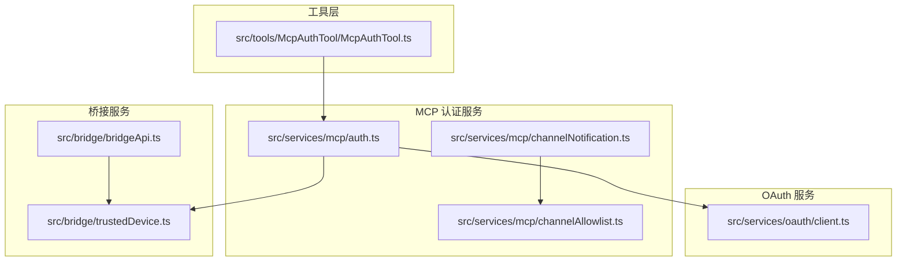

**图表来源**
- [auth.ts:1-2466](file://src/services/mcp/auth.ts#L1-2466)
- [client.ts:1-595](file://src/services/oauth/client.ts#L1-595)
- [trustedDevice.ts:1-211](file://src/bridge/trustedDevice.ts#L1-211)
- [bridgeApi.ts:1-540](file://src/bridge/bridgeApi.ts#L1-540)
- [channelNotification.ts:1-317](file://src/services/mcp/channelNotification.ts#L1-317)
- [channelAllowlist.ts:1-77](file://src/services/mcp/channelAllowlist.ts#L1-77)

**章节来源**
- [auth.ts:1-2466](file://src/services/mcp/auth.ts#L1-2466)
- [client.ts:1-595](file://src/services/oauth/client.ts#L1-595)
- [trustedDevice.ts:1-211](file://src/bridge/trustedDevice.ts#L1-211)
- [bridgeApi.ts:1-540](file://src/bridge/bridgeApi.ts#L1-540)
- [channelNotification.ts:1-317](file://src/services/mcp/channelNotification.ts#L1-317)
- [channelAllowlist.ts:1-77](file://src/services/mcp/channelAllowlist.ts#L1-77)

## 核心组件

### OAuth 认证提供者 (ClaudeAuthProvider)

ClaudeAuthProvider 实现了完整的 OAuth 2.0 客户端功能，支持动态客户端注册和令牌管理：

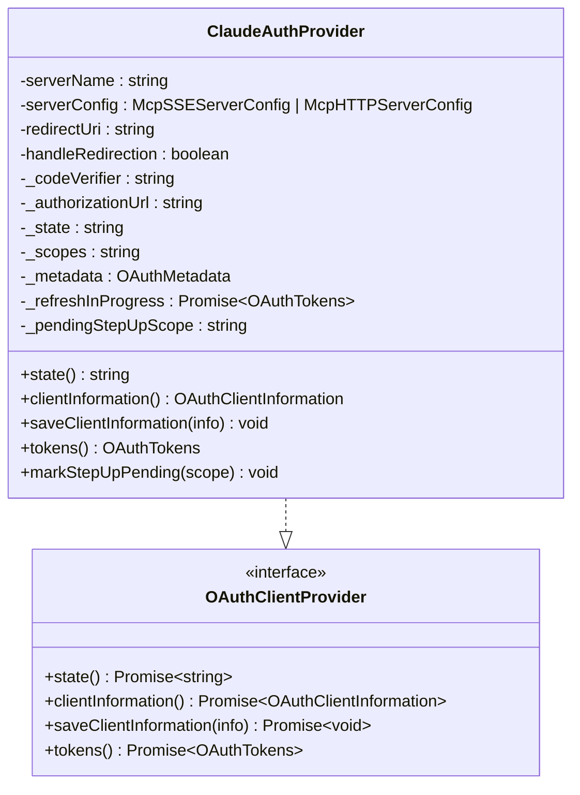

**图表来源**
- [auth.ts:1376-1599](file://src/services/mcp/auth.ts#L1376-1599)

### MCP OAuth 流程控制器

performMCPOAuthFlow 函数协调整个 OAuth 认证流程：

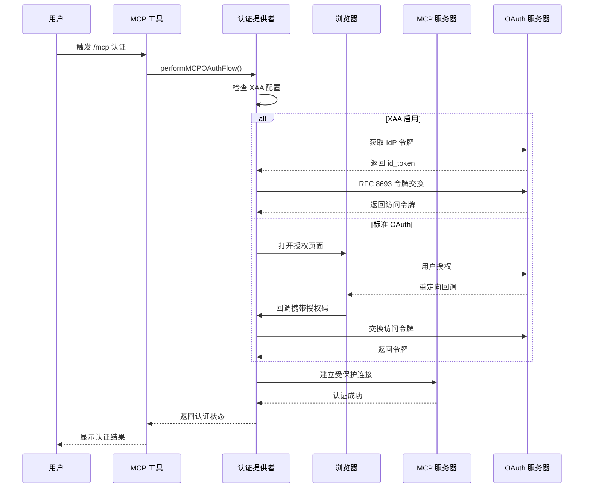

**图表来源**
- [auth.ts:847-1342](file://src/services/mcp/auth.ts#L847-1342)

**章节来源**
- [auth.ts:847-1342](file://src/services/mcp/auth.ts#L847-1342)
- [auth.ts:1376-1599](file://src/services/mcp/auth.ts#L1376-1599)

## 架构概览

MCP 认证系统采用分层架构设计，确保安全性和可扩展性：

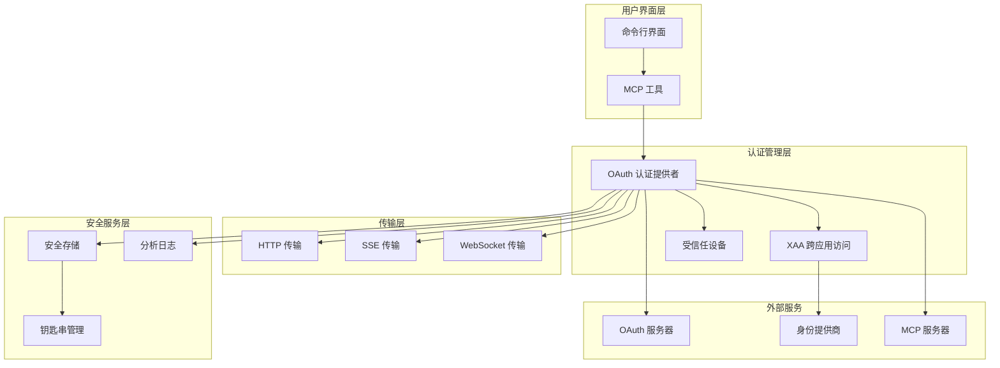

**图表来源**
- [auth.ts:1-2466](file://src/services/mcp/auth.ts#L1-2466)
- [trustedDevice.ts:1-211](file://src/bridge/trustedDevice.ts#L1-211)
- [bridgeApi.ts:1-540](file://src/bridge/bridgeApi.ts#L1-540)

## 详细组件分析

### OAuth 认证机制

#### 标准 OAuth 2.0 流程

系统实现了完整的 OAuth 2.0 授权码流程，支持 PKCE 扩展以增强安全性：

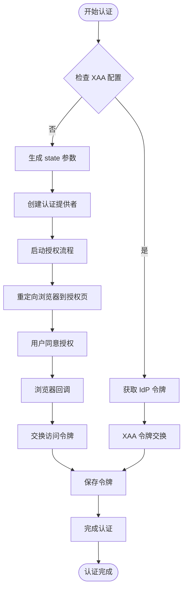

**图表来源**
- [auth.ts:1029-1258](file://src/services/mcp/auth.ts#L1029-1258)

#### 跨应用访问 (XAA) 机制

XAA 机制允许使用单一身份提供商令牌访问多个 MCP 服务器：

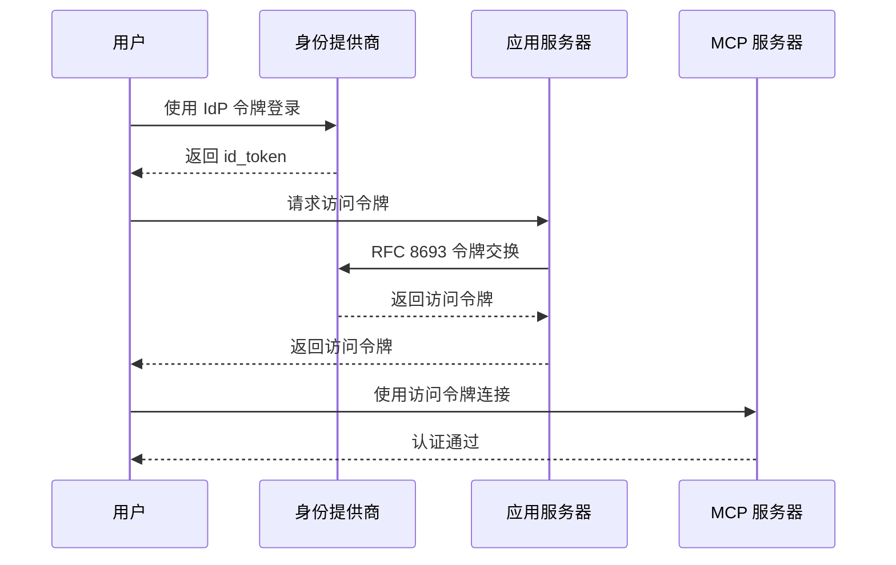

**图表来源**
- [auth.ts:664-845](file://src/services/mcp/auth.ts#L664-845)

**章节来源**
- [auth.ts:664-845](file://src/services/mcp/auth.ts#L664-845)
- [auth.ts:1029-1258](file://src/services/mcp/auth.ts#L1029-1258)

### 令牌管理与会话控制

#### 令牌存储与刷新

系统采用多层次的令牌存储策略：

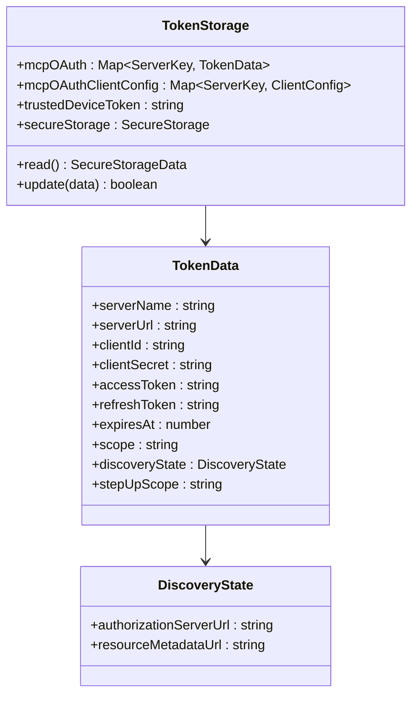

**图表来源**
- [auth.ts:1540-1599](file://src/services/mcp/auth.ts#L1540-1599)

#### 令牌刷新策略

系统实现了智能的令牌刷新机制：

| 刷新场景 | 触发条件 | 处理方式 |
|---------|---------|---------|
| 标准刷新 | 令牌即将过期 | 使用刷新令牌获取新令牌 |
| XAA 自动刷新 | XAA 令牌即将过期 | 使用 IdP 令牌进行静默交换 |
| 步进升级 | 403 insufficient_scope | 重新发起授权流程 |
| 强制刷新 | 明确的刷新请求 | 绕过缓存直接获取新令牌 |

**章节来源**
- [auth.ts:1540-1599](file://src/services/mcp/auth.ts#L1540-1599)

### 通道权限管理

#### 通道访问控制

通道权限管理系统确保只有经过授权的 MCP 服务器才能推送消息：

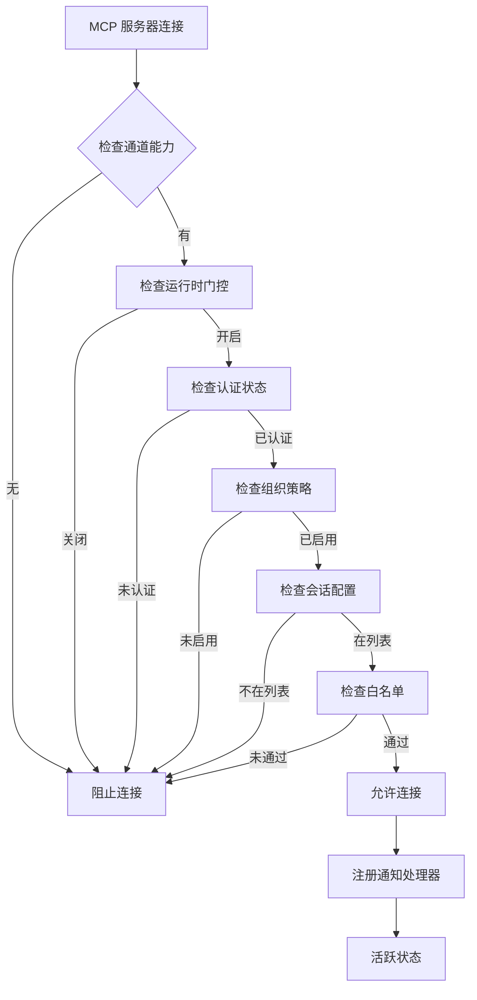

**图表来源**
- [channelNotification.ts:191-316](file://src/services/mcp/channelNotification.ts#L191-316)

#### 白名单管理

系统支持两级白名单控制：

1. **组织级白名单**：由管理员在托管设置中配置
2. **增长书白名单**：通过 A/B 测试动态更新

**章节来源**
- [channelNotification.ts:191-316](file://src/services/mcp/channelNotification.ts#L191-316)
- [channelAllowlist.ts:1-77](file://src/services/mcp/channelAllowlist.ts#L1-77)

### 受信任设备认证

#### 设备令牌机制

受信任设备认证为远程控制会话提供额外的安全层：

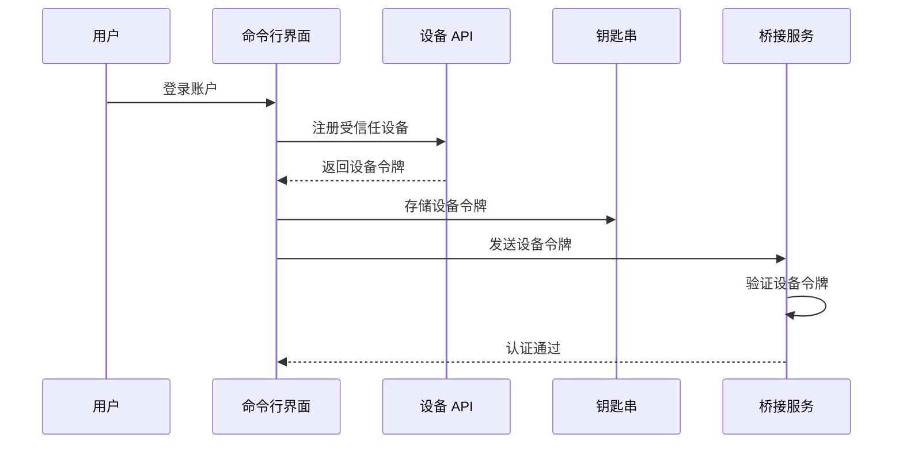

**图表来源**
- [trustedDevice.ts:98-210](file://src/bridge/trustedDevice.ts#L98-210)

**章节来源**
- [trustedDevice.ts:98-210](file://src/bridge/trustedDevice.ts#L98-210)

### OAuth 工具集成

#### MCP 认证工具

McpAuthTool 提供了便捷的命令行认证接口：

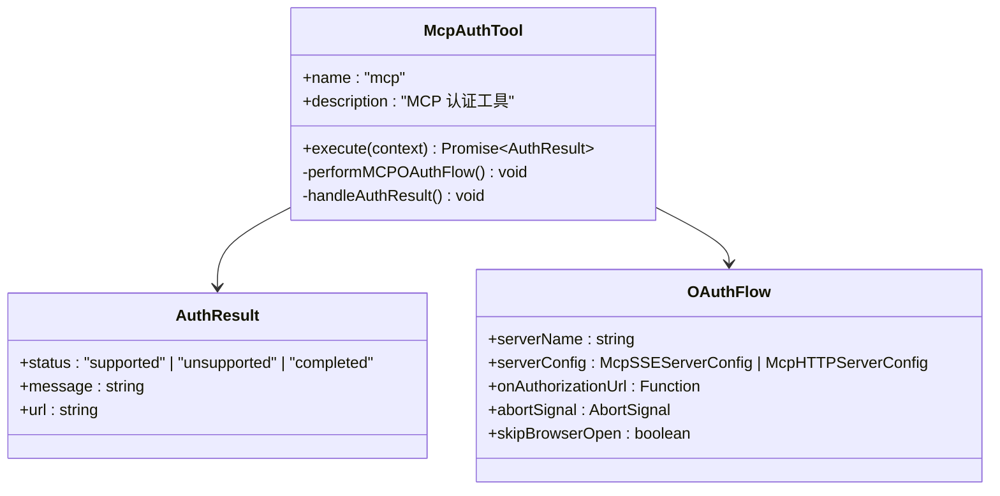

**图表来源**
- [McpAuthTool.ts:98-132](file://src/tools/McpAuthTool/McpAuthTool.ts#L98-132)

**章节来源**
- [McpAuthTool.ts:98-132](file://src/tools/McpAuthTool/McpAuthTool.ts#L98-132)

## 依赖关系分析

### 外部依赖

系统依赖以下关键外部组件：

```mermaid
graph LR
subgraph "核心依赖"
A[@modelcontextprotocol/sdk]
B[axios]
C[lodash-es]
D[zod]
end
subgraph "平台特定"
E[node:crypto]
F[node:http]
G[node:url]
H[xss]
end
subgraph "分析服务"
I[analytics]
J[growthbook]
end
Auth --> A
Auth --> B
Auth --> C
Auth --> D
Auth --> E
Auth --> F
Auth --> G
Auth --> H
Auth --> I
Auth --> J
```

**图表来源**
- [auth.ts:1-51](file://src/services/mcp/auth.ts#L1-51)

### 内部模块依赖

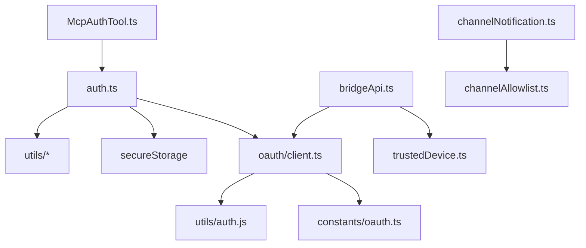

**图表来源**
- [auth.ts:1-51](file://src/services/mcp/auth.ts#L1-51)
- [bridgeApi.ts:1-36](file://src/bridge/bridgeApi.ts#L1-36)
- [channelNotification.ts:19-35](file://src/services/mcp/channelNotification.ts#L19-35)

**章节来源**
- [auth.ts:1-51](file://src/services/mcp/auth.ts#L1-51)
- [bridgeApi.ts:1-36](file://src/bridge/bridgeApi.ts#L1-36)
- [channelNotification.ts:19-35](file://src/services/mcp/channelNotification.ts#L19-35)

## 性能考量

### 缓存策略

系统采用了多层次的缓存机制来优化性能：

1. **令牌缓存**：避免频繁的钥匙串访问
2. **元数据缓存**：减少 OAuth 元数据发现的网络请求
3. **设备令牌缓存**：使用记忆化函数避免重复的系统调用

### 并发处理

系统支持并发的认证请求处理，通过以下机制保证线程安全：

- 使用锁文件防止并发客户端注册冲突
- 事件驱动的回调处理避免阻塞主线程
- 异步令牌刷新避免影响主认证流程

## 故障排除指南

### 常见认证问题

| 问题类型 | 症状 | 解决方案 |
|---------|------|---------|
| 端口占用 | OAuth 回调失败 | 使用 `lsof` 或 `netstat` 查找占用进程 |
| 状态不匹配 | CSRF 攻击防护触发 | 检查浏览器重定向是否被拦截 |
| 令牌过期 | 401 未授权错误 | 执行 `claude oauth-refresh` 刷新令牌 |
| XAA 失败 | 跨应用访问认证失败 | 检查 IdP 配置和令牌缓存状态 |
| 权限不足 | 403 访问被拒绝 | 验证用户角色和组织策略设置 |

### 调试信息收集

系统提供了详细的调试日志输出：

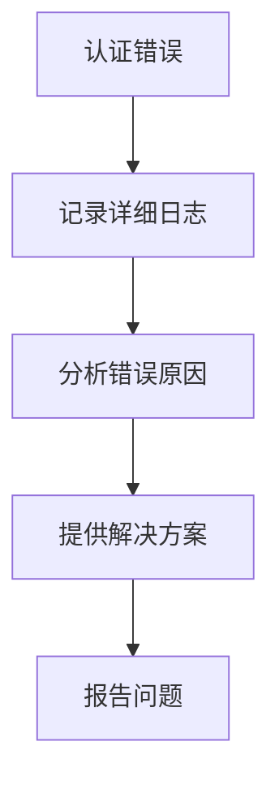

**章节来源**
- [auth.ts:1259-1341](file://src/services/mcp/auth.ts#L1259-1341)

## 结论

MCP 认证与授权系统通过多层次的安全设计和灵活的认证机制，为 Claude Code 提供了强大而安全的外部服务集成能力。系统的主要优势包括：

1. **多模式认证支持**：同时支持标准 OAuth 和 XAA 机制
2. **细粒度权限控制**：基于通道的白名单管理和组织策略
3. **安全的令牌管理**：多层次的存储和刷新策略
4. **用户体验优化**：自动化的认证流程和错误处理
5. **可扩展架构**：模块化的组件设计便于功能扩展

该系统为 MCP 协议在企业环境中的部署提供了坚实的安全基础，同时保持了良好的用户体验和开发效率。

## 附录

### 配置选项参考

#### OAuth 配置参数

| 参数名称 | 类型 | 描述 | 默认值 |
|---------|------|------|-------|
| CLIENT_ID | string | OAuth 客户端 ID | 系统配置 |
| CLIENT_SECRET | string | OAuth 客户端密钥 | 系统配置 |
| TOKEN_URL | string | 令牌交换端点 | 系统配置 |
| AUTHORIZE_URL | string | 授权端点 | 系统配置 |
| CALLBACK_PORT | number | 回调端口 | 动态分配 |

#### 安全配置建议

1. **令牌存储**：使用系统钥匙串而非明文文件存储
2. **网络通信**：始终使用 HTTPS 进行 OAuth 通信
3. **错误处理**：实现适当的超时和重试机制
4. **日志记录**：避免记录敏感的 OAuth 参数
5. **权限最小化**：仅请求必要的 OAuth 作用域