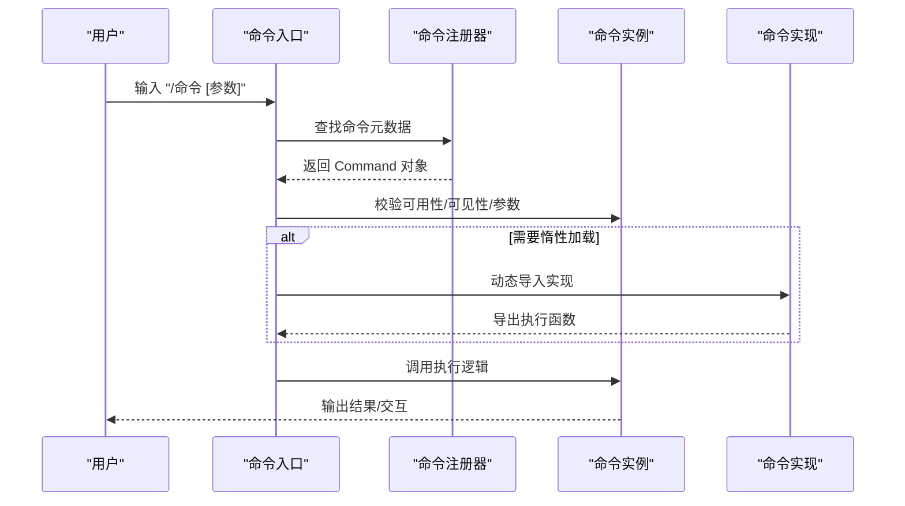
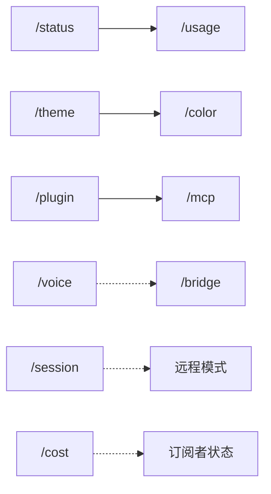

# 内置命令参考

<cite>
**本文引用的文件**
- [src/commands/help/index.ts](file://src/commands/help/index.ts)
- [src/commands/config/index.ts](file://src/commands/config/index.ts)
- [src/commands/session/index.ts](file://src/commands/session/index.ts)
- [src/commands/skills/index.ts](file://src/commands/skills/index.ts)
- [src/commands/plugin/index.tsx](file://src/commands/plugin/index.tsx)
- [src/commands/mcp/index.ts](file://src/commands/mcp/index.ts)
- [src/commands/ide/index.ts](file://src/commands/ide/index.ts)
- [src/commands/status/index.ts](file://src/commands/status/index.ts)
- [src/commands/usage/index.ts](file://src/commands/usage/index.ts)
- [src/commands/cost/index.ts](file://src/commands/cost/index.ts)
- [src/commands/stats/index.ts](file://src/commands/stats/index.ts)
- [src/commands/theme/index.ts](file://src/commands/theme/index.ts)
- [src/commands/color/index.ts](file://src/commands/color/index.ts)
- [src/commands/output-style/index.ts](file://src/commands/output-style/index.ts)
- [src/commands/voice/index.ts](file://src/commands/voice/index.ts)
- [src/commands/mobile/index.ts](file://src/commands/mobile/index.ts)
- [src/commands/bridge/index.ts](file://src/commands/bridge/index.ts)
</cite>

## 目录
1. [简介](#简介)
2. [项目结构](#项目结构)
3. [核心组件](#核心组件)
4. [架构总览](#架构总览)
5. [详细组件分析](#详细组件分析)
6. [依赖分析](#依赖分析)
7. [性能考虑](#性能考虑)
8. [故障排除指南](#故障排除指南)
9. [结论](#结论)
10. [附录](#附录)

## 简介
本参考文档面向 free-code 的内置命令体系，系统梳理基础命令、开发工具命令、系统管理命令、用户界面命令与特殊功能命令，覆盖各命令的功能、语法、参数、可用性限制、使用示例、注意事项与最佳实践，并解释命令之间的关系与组合使用方式。文档中的“代码片段路径”均以源码文件位置标注，避免直接粘贴代码内容。

## 项目结构
内置命令采用模块化注册机制：每个命令在独立目录下通过一个 index 文件导出最小元数据（名称、类型、描述、可用别名、是否立即执行、参数提示等），并通过惰性加载实现按需加载，降低启动开销。命令目录通常包含一个与命令同名的实现文件（如 help.js、config.js 等）。

```mermaid
graph TB
subgraph "命令注册层"
CMD_HELP["help/index.ts"]
CMD_CONFIG["config/index.ts"]
CMD_SESSION["session/index.ts"]
CMD_SKILLS["skills/index.ts"]
CMD_PLUGIN["plugin/index.tsx"]
CMD_MCP["mcp/index.ts"]
CMD_IDE["ide/index.ts"]
CMD_STATUS["status/index.ts"]
CMD_USAGE["usage/index.ts"]
CMD_COST["cost/index.ts"]
CMD_STATS["stats/index.ts"]
CMD_THEME["theme/index.ts"]
CMD_COLOR["color/index.ts"]
CMD_OUTPUT_STYLE["output-style/index.ts"]
CMD_VOICE["voice/index.ts"]
CMD_MOBILE["mobile/index.ts"]
CMD_BRIDGE["bridge/index.ts"]
end
subgraph "实现层"
IMPL_HELP["help.js"]
IMPL_CONFIG["config.js"]
IMPL_SESSION["session.js"]
IMPL_SKILLS["skills.js"]
IMPL_PLUGIN["plugin.js"]
IMPL_MCP["mcp.js"]
IMPL_IDE["ide.js"]
IMPL_STATUS["status.js"]
IMPL_USAGE["usage.js"]
IMPL_COST["cost.js"]
IMPL_STATS["stats.js"]
IMPL_THEME["theme.js"]
IMPL_COLOR["color.js"]
IMPL_OUTPUT_STYLE["output-style.js"]
IMPL_VOICE["voice.js"]
IMPL_MOBILE["mobile.js"]
IMPL_BRIDGE["bridge.js"]
end
CMD_HELP --> IMPL_HELP
CMD_CONFIG --> IMPL_CONFIG
CMD_SESSION --> IMPL_SESSION
CMD_SKILLS --> IMPL_SKILLS
CMD_PLUGIN --> IMPL_PLUGIN
CMD_MCP --> IMPL_MCP
CMD_IDE --> IMPL_IDE
CMD_STATUS --> IMPL_STATUS
CMD_USAGE --> IMPL_USAGE
CMD_COST --> IMPL_COST
CMD_STATS --> IMPL_STATS
CMD_THEME --> IMPL_THEME
CMD_COLOR --> IMPL_COLOR
CMD_OUTPUT_STYLE --> IMPL_OUTPUT_STYLE
CMD_VOICE --> IMPL_VOICE
CMD_MOBILE --> IMPL_MOBILE
CMD_BRIDGE --> IMPL_BRIDGE
```

图表来源
- [src/commands/help/index.ts:1-11](file://src/commands/help/index.ts#L1-L11)
- [src/commands/config/index.ts:1-12](file://src/commands/config/index.ts#L1-L12)
- [src/commands/session/index.ts:1-17](file://src/commands/session/index.ts#L1-L17)
- [src/commands/skills/index.ts:1-11](file://src/commands/skills/index.ts#L1-L11)
- [src/commands/plugin/index.tsx:1-11](file://src/commands/plugin/index.tsx#L1-L11)
- [src/commands/mcp/index.ts:1-13](file://src/commands/mcp/index.ts#L1-L13)
- [src/commands/ide/index.ts:1-12](file://src/commands/ide/index.ts#L1-L12)
- [src/commands/status/index.ts:1-13](file://src/commands/status/index.ts#L1-L13)
- [src/commands/usage/index.ts:1-10](file://src/commands/usage/index.ts#L1-L10)
- [src/commands/cost/index.ts:1-24](file://src/commands/cost/index.ts#L1-L24)
- [src/commands/stats/index.ts:1-11](file://src/commands/stats/index.ts#L1-L11)
- [src/commands/theme/index.ts:1-11](file://src/commands/theme/index.ts#L1-L11)
- [src/commands/color/index.ts:1-17](file://src/commands/color/index.ts#L1-L17)
- [src/commands/output-style/index.ts:1-12](file://src/commands/output-style/index.ts#L1-L12)
- [src/commands/voice/index.ts:1-21](file://src/commands/voice/index.ts#L1-L21)
- [src/commands/mobile/index.ts](file://src/commands/mobile/index.ts)
- [src/commands/bridge/index.ts](file://src/commands/bridge/index.ts)

章节来源
- [src/commands/help/index.ts:1-11](file://src/commands/help/index.ts#L1-L11)
- [src/commands/config/index.ts:1-12](file://src/commands/config/index.ts#L1-L12)
- [src/commands/session/index.ts:1-17](file://src/commands/session/index.ts#L1-L17)
- [src/commands/skills/index.ts:1-11](file://src/commands/skills/index.ts#L1-L11)
- [src/commands/plugin/index.tsx:1-11](file://src/commands/plugin/index.tsx#L1-L11)
- [src/commands/mcp/index.ts:1-13](file://src/commands/mcp/index.ts#L1-L13)
- [src/commands/ide/index.ts:1-12](file://src/commands/ide/index.ts#L1-L12)
- [src/commands/status/index.ts:1-13](file://src/commands/status/index.ts#L1-L13)
- [src/commands/usage/index.ts:1-10](file://src/commands/usage/index.ts#L1-L10)
- [src/commands/cost/index.ts:1-24](file://src/commands/cost/index.ts#L1-L24)
- [src/commands/stats/index.ts:1-11](file://src/commands/stats/index.ts#L1-L11)
- [src/commands/theme/index.ts:1-11](file://src/commands/theme/index.ts#L1-L11)
- [src/commands/color/index.ts:1-17](file://src/commands/color/index.ts#L1-L17)
- [src/commands/output-style/index.ts:1-12](file://src/commands/output-style/index.ts#L1-L12)
- [src/commands/voice/index.ts:1-21](file://src/commands/voice/index.ts#L1-L21)
- [src/commands/mobile/index.ts](file://src/commands/mobile/index.ts)
- [src/commands/bridge/index.ts](file://src/commands/bridge/index.ts)

## 核心组件
- 命令元数据接口：每个命令通过一个 index 文件导出一个满足 Command 接口的对象，包含 name、type、aliases、description、isEnabled、isHidden、availability、immediate、argumentHint、supportsNonInteractive、load 等字段。
- 惰性加载：命令通过 load 函数进行动态导入，减少启动时的资源占用。
- 可用性控制：部分命令受环境变量或运行模式影响（如远程模式、订阅者状态、功能开关等）。

章节来源
- [src/commands/help/index.ts:1-11](file://src/commands/help/index.ts#L1-L11)
- [src/commands/config/index.ts:1-12](file://src/commands/config/index.ts#L1-L12)
- [src/commands/session/index.ts:1-17](file://src/commands/session/index.ts#L1-L17)
- [src/commands/cost/index.ts:1-24](file://src/commands/cost/index.ts#L1-L24)
- [src/commands/voice/index.ts:1-21](file://src/commands/voice/index.ts#L1-L21)

## 架构总览
命令注册与执行流程如下：

图表来源
- [src/commands/help/index.ts:1-11](file://src/commands/help/index.ts#L1-L11)
- [src/commands/config/index.ts:1-12](file://src/commands/config/index.ts#L1-L12)
- [src/commands/session/index.ts:1-17](file://src/commands/session/index.ts#L1-L17)
- [src/commands/cost/index.ts:1-24](file://src/commands/cost/index.ts#L1-L24)
- [src/commands/voice/index.ts:1-21](file://src/commands/voice/index.ts#L1-L21)

## 详细组件分析

### 基础命令
- /help
  - 类型：本地 JSX
  - 描述：显示帮助与可用命令列表
  - 适用场景：首次使用、快速查阅命令清单
  - 代码片段路径：[src/commands/help/index.ts:1-11](file://src/commands/help/index.ts#L1-L11)
- /config
  - 别名：settings
  - 类型：本地 JSX
  - 描述：打开配置面板
  - 适用场景：调整全局设置、输出样式、主题等
  - 代码片段路径：[src/commands/config/index.ts:1-12](file://src/commands/config/index.ts#L1-L12)
- /session
  - 别名：remote
  - 类型：本地 JSX
  - 描述：显示远程会话 URL 与二维码
  - 可用性：仅在远程模式启用时可见
  - 代码片段路径：[src/commands/session/index.ts:1-17](file://src/commands/session/index.ts#L1-L17)

章节来源
- [src/commands/help/index.ts:1-11](file://src/commands/help/index.ts#L1-L11)
- [src/commands/config/index.ts:1-12](file://src/commands/config/index.ts#L1-L12)
- [src/commands/session/index.ts:1-17](file://src/commands/session/index.ts#L1-L17)

### 开发工具命令
- /skills
  - 类型：本地 JSX
  - 描述：列出可用技能
  - 适用场景：查看可调用技能集合
  - 代码片段路径：[src/commands/skills/index.ts:1-11](file://src/commands/skills/index.ts#L1-L11)
- /plugin
  - 别名：plugins, marketplace
  - 类型：本地 JSX
  - 描述：管理 Claude Code 插件
  - 立即执行：是
  - 代码片段路径：[src/commands/plugin/index.tsx:1-11](file://src/commands/plugin/index.tsx#L1-L11)
- /mcp
  - 类型：本地 JSX
  - 描述：管理 MCP 服务器
  - 立即执行：是
  - 参数提示：[enable|disable [server-name]]
  - 代码片段路径：[src/commands/mcp/index.ts:1-13](file://src/commands/mcp/index.ts#L1-L13)
- /ide
  - 类型：本地 JSX
  - 描述：管理 IDE 集成并显示状态
  - 参数提示：[open]
  - 代码片段路径：[src/commands/ide/index.ts:1-12](file://src/commands/ide/index.ts#L1-L12)

章节来源
- [src/commands/skills/index.ts:1-11](file://src/commands/skills/index.ts#L1-L11)
- [src/commands/plugin/index.tsx:1-11](file://src/commands/plugin/index.tsx#L1-L11)
- [src/commands/mcp/index.ts:1-13](file://src/commands/mcp/index.ts#L1-L13)
- [src/commands/ide/index.ts:1-12](file://src/commands/ide/index.ts#L1-L12)

### 系统管理命令
- /status
  - 类型：本地 JSX
  - 描述：显示 Claude Code 状态（版本、模型、账户、API 连接性、工具状态）
  - 立即执行：是
  - 代码片段路径：[src/commands/status/index.ts:1-13](file://src/commands/status/index.ts#L1-L13)
- /usage
  - 类型：本地 JSX
  - 描述：显示计划用量限制
  - 可用平台：claude-ai
  - 代码片段路径：[src/commands/usage/index.ts:1-10](file://src/commands/usage/index.ts#L1-L10)
- /cost
  - 类型：本地
  - 描述：显示当前会话的总费用与持续时间
  - 可见性：非订阅者默认隐藏；特定用户类型（如 ant）始终可见
  - 支持非交互式：是
  - 代码片段路径：[src/commands/cost/index.ts:1-24](file://src/commands/cost/index.ts#L1-L24)
- /stats
  - 类型：本地 JSX
  - 描述：显示 Claude Code 使用统计与活动
  - 代码片段路径：[src/commands/stats/index.ts:1-11](file://src/commands/stats/index.ts#L1-L11)

章节来源
- [src/commands/status/index.ts:1-13](file://src/commands/status/index.ts#L1-L13)
- [src/commands/usage/index.ts:1-10](file://src/commands/usage/index.ts#L1-L10)
- [src/commands/cost/index.ts:1-24](file://src/commands/cost/index.ts#L1-L24)
- [src/commands/stats/index.ts:1-11](file://src/commands/stats/index.ts#L1-L11)

### 用户界面命令
- /theme
  - 类型：本地 JSX
  - 描述：切换主题
  - 代码片段路径：[src/commands/theme/index.ts:1-11](file://src/commands/theme/index.ts#L1-L11)
- /color
  - 类型：本地 JSX
  - 描述：设置本次会话的提示栏颜色
  - 立即执行：是
  - 参数提示：<color|default>
  - 代码片段路径：[src/commands/color/index.ts:1-17](file://src/commands/color/index.ts#L1-L17)
- /output-style
  - 类型：本地 JSX
  - 描述：已弃用；建议通过 /config 更改输出样式
  - 可见性：隐藏
  - 代码片段路径：[src/commands/output-style/index.ts:1-12](file://src/commands/output-style/index.ts#L1-L12)

章节来源
- [src/commands/theme/index.ts:1-11](file://src/commands/theme/index.ts#L1-L11)
- [src/commands/color/index.ts:1-17](file://src/commands/color/index.ts#L1-L17)
- [src/commands/output-style/index.ts:1-12](file://src/commands/output-style/index.ts#L1-L12)

### 特殊功能命令
- /voice
  - 类型：本地
  - 描述：切换语音模式
  - 平台限制：claude-ai
  - 可用性：受增长实验与语音模式开关控制
  - 可见性：根据运行时状态决定
  - 支持非交互式：否
  - 代码片段路径：[src/commands/voice/index.ts:1-21](file://src/commands/voice/index.ts#L1-L21)
- /bridge
  - 类型：本地 JSX
  - 描述：桥接相关功能（具体行为由实现定义）
  - 代码片段路径：[src/commands/bridge/index.ts](file://src/commands/bridge/index.ts)
- /mobile
  - 类型：本地 JSX
  - 描述：移动端相关功能（具体行为由实现定义）
  - 代码片段路径：[src/commands/mobile/index.ts](file://src/commands/mobile/index.ts)

章节来源
- [src/commands/voice/index.ts:1-21](file://src/commands/voice/index.ts#L1-L21)
- [src/commands/bridge/index.ts](file://src/commands/bridge/index.ts)
- [src/commands/mobile/index.ts](file://src/commands/mobile/index.ts)

## 依赖分析
- 命令注册与实现解耦：命令通过 load 函数延迟导入，降低启动时的依赖链长度。
- 可用性与可见性控制：通过 isEnabled 与 isHidden 控制命令在不同环境下的展示与执行能力。
- 平台与功能开关：availability 与运行时开关（如语音模式）共同决定命令的可用范围。
- 组合使用：例如 /status 与 /usage 可配合查看服务状态与配额；/theme 与 /color 可结合提升界面体验；/plugin 与 /mcp 可协同扩展工具生态。

图表来源
- [src/commands/status/index.ts:1-13](file://src/commands/status/index.ts#L1-L13)
- [src/commands/usage/index.ts:1-10](file://src/commands/usage/index.ts#L1-L10)
- [src/commands/theme/index.ts:1-11](file://src/commands/theme/index.ts#L1-L11)
- [src/commands/color/index.ts:1-17](file://src/commands/color/index.ts#L1-L17)
- [src/commands/plugin/index.tsx:1-11](file://src/commands/plugin/index.tsx#L1-L11)
- [src/commands/mcp/index.ts:1-13](file://src/commands/mcp/index.ts#L1-L13)
- [src/commands/voice/index.ts:1-21](file://src/commands/voice/index.ts#L1-L21)
- [src/commands/bridge/index.ts](file://src/commands/bridge/index.ts)
- [src/commands/session/index.ts:1-17](file://src/commands/session/index.ts#L1-L17)
- [src/commands/cost/index.ts:1-24](file://src/commands/cost/index.ts#L1-L24)

## 性能考虑
- 惰性加载：命令通过 load 动态导入，避免一次性加载全部实现，缩短启动时间。
- 立即执行：部分命令（如 /mcp、/color）声明 immediate，可在无需等待完整初始化时快速响应。
- 可见性过滤：isHidden 与 isEnabled 在渲染前过滤不可用命令，减少无效交互。
- 非交互支持：支持非交互式命令（如 /cost）便于脚本化与自动化集成。

## 故障排除指南
- 命令不可见
  - 检查 isEnabled/isHidden 与运行时状态（如远程模式、订阅者类型、功能开关）。
  - 参考路径：[src/commands/session/index.ts:1-17](file://src/commands/session/index.ts#L1-L17)、[src/commands/cost/index.ts:1-24](file://src/commands/cost/index.ts#L1-L24)、[src/commands/voice/index.ts:1-21](file://src/commands/voice/index.ts#L1-L21)
- 命令无响应
  - 确认命令是否声明 immediate；若为本地 JSX，检查实现是否正确导出执行逻辑。
  - 参考路径：[src/commands/mcp/index.ts:1-13](file://src/commands/mcp/index.ts#L1-L13)、[src/commands/color/index.ts:1-17](file://src/commands/color/index.ts#L1-L17)
- 平台限制
  - availability 限制仅在指定平台可用（如 claude-ai），请确认当前运行环境。
  - 参考路径：[src/commands/usage/index.ts:1-10](file://src/commands/usage/index.ts#L1-L10)、[src/commands/voice/index.ts:1-21](file://src/commands/voice/index.ts#L1-L21)
- 输出样式变更
  - /output-style 已弃用，请使用 /config 进行相关设置。
  - 参考路径：[src/commands/output-style/index.ts:1-12](file://src/commands/output-style/index.ts#L1-L12)

章节来源
- [src/commands/session/index.ts:1-17](file://src/commands/session/index.ts#L1-L17)
- [src/commands/cost/index.ts:1-24](file://src/commands/cost/index.ts#L1-L24)
- [src/commands/voice/index.ts:1-21](file://src/commands/voice/index.ts#L1-L21)
- [src/commands/mcp/index.ts:1-13](file://src/commands/mcp/index.ts#L1-L13)
- [src/commands/color/index.ts:1-17](file://src/commands/color/index.ts#L1-L17)
- [src/commands/usage/index.ts:1-10](file://src/commands/usage/index.ts#L1-L10)
- [src/commands/output-style/index.ts:1-12](file://src/commands/output-style/index.ts#L1-L12)

## 结论
free-code 的内置命令体系通过清晰的元数据注册与惰性加载机制，实现了高可维护性与良好性能。命令按功能域分组（基础、开发工具、系统管理、界面、特殊功能），既保证了易用性，也便于扩展与组合使用。建议在日常工作中优先使用 /help 快速查阅，结合 /config 与 /theme 提升界面体验，利用 /status 与 /usage 关注系统状态与配额，通过 /plugin 与 /mcp 扩展工具链，并在需要时使用 /voice 等特殊功能。

## 附录
- 命令组合示例思路
  - 环境诊断：先执行 /status，再执行 /usage，最后查看 /stats 获取长期趋势。
  - 界面定制：先用 /theme 切换主题，再用 /color 设置提示栏颜色。
  - 工具扩展：先用 /plugin 安装所需插件，再用 /mcp 管理 MCP 服务器，必要时用 /ide 同步 IDE 集成状态。
  - 移动/远程：在远程模式下使用 /session 获取访问信息，结合 /bridge 或 /mobile 进行移动端协作。