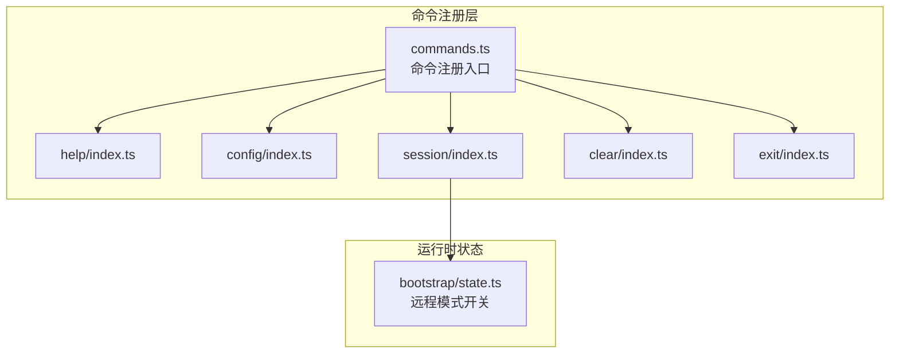
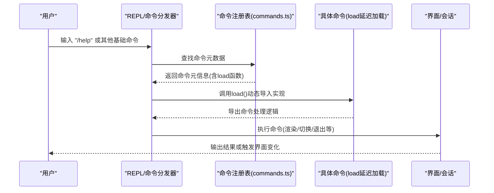
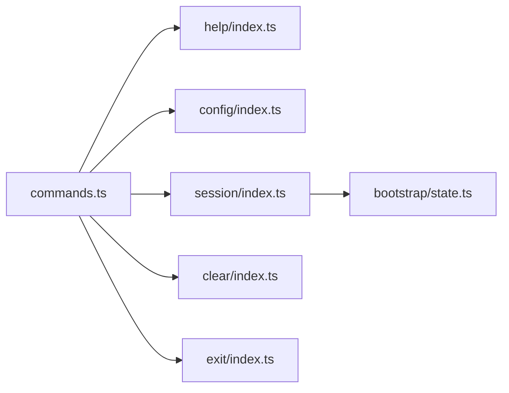

# 基础命令

<cite>
**本文引用的文件**
- [src/commands/help/index.ts](file://src/commands/help/index.ts)
- [src/commands/config/index.ts](file://src/commands/config/index.ts)
- [src/commands/session/index.ts](file://src/commands/session/index.ts)
- [src/commands/clear/index.ts](file://src/commands/clear/index.ts)
- [src/commands/exit/index.ts](file://src/commands/exit/index.ts)
- [src/bootstrap/state.ts](file://src/bootstrap/state.ts)
- [src/commands.ts](file://src/commands.ts)
</cite>

## 目录
1. [简介](#简介)
2. [项目结构](#项目结构)
3. [核心组件](#核心组件)
4. [架构总览](#架构总览)
5. [详细组件分析](#详细组件分析)
6. [依赖关系分析](#依赖关系分析)
7. [性能考量](#性能考量)
8. [故障排除指南](#故障排除指南)
9. [结论](#结论)
10. [附录](#附录)

## 简介
本章节面向初学者与日常使用者，系统化介绍 free-code 中最常用的基础命令：/help（帮助系统）、/config（配置管理）、/session（会话管理）、/clear（清屏/重置）、/exit（退出）。我们将从命令定义、功能职责、使用场景、最佳实践到与其他命令的配合使用进行完整说明，并提供常见问题解答。

## 项目结构
基础命令均以“命令元数据 + 懒加载实现”的模式组织，位于 src/commands/<command>/index.ts 中声明命令元信息，通过 load 函数懒加载对应实现模块，从而降低启动时的资源占用。部分命令还通过全局状态控制其可用性与可见性。

图表来源
- [src/commands.ts](file://src/commands.ts)
- [src/commands/help/index.ts](file://src/commands/help/index.ts)
- [src/commands/config/index.ts](file://src/commands/config/index.ts)
- [src/commands/session/index.ts](file://src/commands/session/index.ts)
- [src/commands/clear/index.ts](file://src/commands/clear/index.ts)
- [src/commands/exit/index.ts](file://src/commands/exit/index.ts)
- [src/bootstrap/state.ts](file://src/bootstrap/state.ts)

章节来源
- [src/commands.ts](file://src/commands.ts)
- [src/commands/help/index.ts](file://src/commands/help/index.ts)
- [src/commands/config/index.ts](file://src/commands/config/index.ts)
- [src/commands/session/index.ts](file://src/commands/session/index.ts)
- [src/commands/clear/index.ts](file://src/commands/clear/index.ts)
- [src/commands/exit/index.ts](file://src/commands/exit/index.ts)
- [src/bootstrap/state.ts](file://src/bootstrap/state.ts)

## 核心组件
- /help 命令：用于展示帮助与可用命令列表，属于本地 JSX 命令，按需加载。
- /config 命令：打开配置面板，支持别名 settings；属于本地 JSX 命令。
- /session 命令：在远程模式下显示远程会话 URL 与二维码；是否启用与隐藏由远程模式状态决定。
- /clear 命令：清理对话历史并释放上下文空间，支持别名 reset/new；非交互式不支持。
- /exit 命令：立即退出 REPL，属于本地 JSX 命令，标记为 immediate。

章节来源
- [src/commands/help/index.ts](file://src/commands/help/index.ts)
- [src/commands/config/index.ts](file://src/commands/config/index.ts)
- [src/commands/session/index.ts](file://src/commands/session/index.ts)
- [src/commands/clear/index.ts](file://src/commands/clear/index.ts)
- [src/commands/exit/index.ts](file://src/commands/exit/index.ts)

## 架构总览
基础命令的执行流程遵循统一的命令注册与懒加载机制：命令在注册表中声明元信息（名称、描述、类型、别名、启用条件、是否立即执行等），运行时通过 load 动态导入实现模块，确保启动性能与功能解耦。

图表来源
- [src/commands.ts](file://src/commands.ts)
- [src/commands/help/index.ts](file://src/commands/help/index.ts)
- [src/commands/config/index.ts](file://src/commands/config/index.ts)
- [src/commands/session/index.ts](file://src/commands/session/index.ts)
- [src/commands/clear/index.ts](file://src/commands/clear/index.ts)
- [src/commands/exit/index.ts](file://src/commands/exit/index.ts)

## 详细组件分析

### /help 命令
- 类型与职责
  - 类型：本地 JSX 命令
  - 描述：显示帮助与可用命令列表
  - 加载：通过 load 函数懒加载实现模块
- 使用场景
  - 初次进入 REPL 时快速了解可用命令
  - 需要查看命令别名或帮助信息时
- 实现要点
  - 元数据中包含 name、description、type、load 等字段
  - 作为本地 JSX 命令，通常会渲染一个帮助界面
- 最佳实践
  - 将 /help 作为新用户的第一个命令
  - 在复杂命令较多时，定期使用 /help 快速回顾
- 常见问题
  - 若帮助界面未显示，请确认命令已正确注册且无运行时错误

章节来源
- [src/commands/help/index.ts](file://src/commands/help/index.ts)

### /config 命令
- 类型与职责
  - 类型：本地 JSX 命令
  - 描述：打开配置面板
  - 别名：settings
  - 加载：通过 load 函数懒加载实现模块
- 使用场景
  - 修改模型、输出样式、主题等设置
  - 快速访问与调整运行参数
- 实现要点
  - 支持别名 settings，便于记忆
  - 作为本地 JSX 命令，通常会弹出或切换到配置界面
- 最佳实践
  - 在需要调整全局行为时使用 /config
  - 结合 /help 查看当前可用的配置项
- 常见问题
  - 若配置面板无法打开，请检查命令注册与界面渲染逻辑

章节来源
- [src/commands/config/index.ts](file://src/commands/config/index.ts)

### /session 命令
- 类型与职责
  - 类型：本地 JSX 命令
  - 描述：在远程模式下显示远程会话 URL 与二维码
  - 别名：remote
  - 启用条件：仅当处于远程模式时启用
  - 可见性：非远程模式下隐藏
  - 加载：通过 load 函数懒加载实现模块
- 使用场景
  - 远程协作或跨设备访问会话
  - 分享会话链接给他人协助
- 实现要点
  - 通过全局状态判断远程模式，动态控制启用与可见性
  - 仅在远程模式下展示相关 UI（URL/二维码）
- 最佳实践
  - 在开启远程模式后使用 /session 获取分享链接
  - 注意隐私与安全，避免在公共场合泄露会话链接
- 常见问题
  - 未显示远程会话信息：请确认已切换至远程模式
  - 二维码无法扫描：检查网络连接与二维码生成逻辑

章节来源
- [src/commands/session/index.ts](file://src/commands/session/index.ts)
- [src/bootstrap/state.ts](file://src/bootstrap/state.ts)

### /clear 命令
- 类型与职责
  - 类型：本地命令
  - 描述：清理对话历史并释放上下文空间
  - 别名：reset、new
  - 非交互式支持：否（应创建新会话而非在当前会话中执行）
  - 加载：通过 load 函数懒加载实现模块
- 使用场景
  - 需要开始全新对话但保留上下文窗口大小
  - 清理历史记录以减少上下文负担
- 实现要点
  - 支持别名 reset、new，便于不同习惯的用户使用
  - 不支持非交互式执行，避免误操作
- 最佳实践
  - 在需要“新开一个会话”时使用 /clear
  - 与 /session 配合，先清理再分享新链接
- 常见问题
  - 在非交互式环境中执行失败：请改用交互式输入
  - 清理后上下文仍过大：可结合模型/上下文长度设置调整

章节来源
- [src/commands/clear/index.ts](file://src/commands/clear/index.ts)

### /exit 命令
- 类型与职责
  - 类型：本地 JSX 命令
  - 描述：退出 REPL
  - 别名：quit
  - 立即执行：是（immediate）
  - 加载：通过 load 函数懒加载实现模块
- 使用场景
  - 完成工作后快速退出
  - 需要终止 REPL 进程
- 实现要点
  - 标记 immediate，表示无需等待其他流程直接退出
  - 作为本地 JSX 命令，通常会触发展示层的退出流程
- 最佳实践
  - 在确认不再需要 REPL 时使用 /exit
  - 若有未保存的工作，请先保存或导出
- 常见问题
  - 退出后无法恢复：/exit 为不可逆操作，请谨慎使用

章节来源
- [src/commands/exit/index.ts](file://src/commands/exit/index.ts)

## 依赖关系分析
- 命令注册入口：commands.ts 统一注册所有命令，包括基础命令
- 运行时状态：bootstrap/state.ts 提供远程模式状态，影响 /session 命令的启用与可见性
- 命令元数据：各命令 index.ts 文件集中声明命令名称、描述、类型、别名、启用条件、是否立即执行、懒加载函数等

图表来源
- [src/commands.ts](file://src/commands.ts)
- [src/commands/help/index.ts](file://src/commands/help/index.ts)
- [src/commands/config/index.ts](file://src/commands/config/index.ts)
- [src/commands/session/index.ts](file://src/commands/session/index.ts)
- [src/commands/clear/index.ts](file://src/commands/clear/index.ts)
- [src/commands/exit/index.ts](file://src/commands/exit/index.ts)
- [src/bootstrap/state.ts](file://src/bootstrap/state.ts)

章节来源
- [src/commands.ts](file://src/commands.ts)
- [src/bootstrap/state.ts](file://src/bootstrap/state.ts)

## 性能考量
- 懒加载策略：基础命令通过 load 函数按需加载实现模块，有助于缩短启动时间，降低内存占用
- 本地命令优先：/clear 与 /exit 属于本地命令，执行路径短、开销小
- 远程模式控制：/session 仅在远程模式下启用，避免在非目标场景下加载无关 UI

## 故障排除指南
- 帮助界面不显示
  - 检查 /help 命令是否正确注册
  - 确认命令实现模块可正常加载
- 配置面板无法打开
  - 检查 /config 命令注册与界面渲染逻辑
  - 确认命令类型为本地 JSX 命令
- /session 无输出
  - 确认已切换至远程模式
  - 检查状态读取逻辑与 UI 渲染
- /clear 执行失败（非交互式）
  - 该命令不支持非交互式执行，请在交互式环境中使用
- /exit 无法退出
  - 确认命令标记为立即执行
  - 检查是否存在阻塞任务或未完成的异步流程

## 结论
基础命令构成了 free-code REPL 的日常操作中枢。/help 提供导航，/config 管理设置，/session 支持远程协作，/clear 清理上下文，/exit 安全退出。通过懒加载与状态控制，这些命令在保证易用性的同时兼顾了性能与安全性。建议新用户从 /help 开始，逐步掌握 /config 与 /session 的使用，并在需要时配合 /clear 与 /exit 完成工作流闭环。

## 附录
- 新手友好使用指南
  - 第一步：输入 /help 查看可用命令与简要说明
  - 第二步：输入 /config 打开配置面板，根据需要调整模型与输出样式
  - 第三步：如需远程协作，先切换至远程模式，再输入 /session 获取分享链接
  - 第四步：需要新开会话时，输入 /clear 并确认
  - 第五步：完成工作后，输入 /exit 退出 REPL
- 常见问题解答
  - 如何快速回到初始状态？使用 /clear 清理历史并重新开始
  - 如何分享我的会话给他人？在远程模式下使用 /session 获取链接
  - 为什么 /session 不显示？请确认当前处于远程模式
  - 退出后还能恢复吗？/exit 为不可逆操作，请谨慎使用