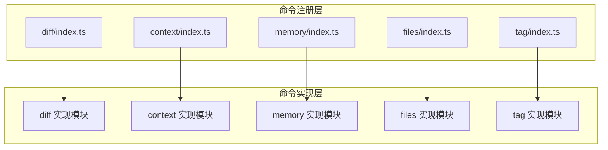
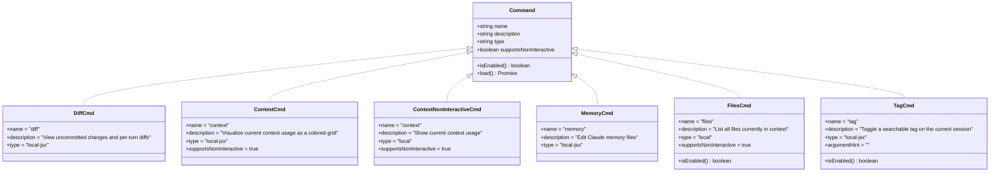
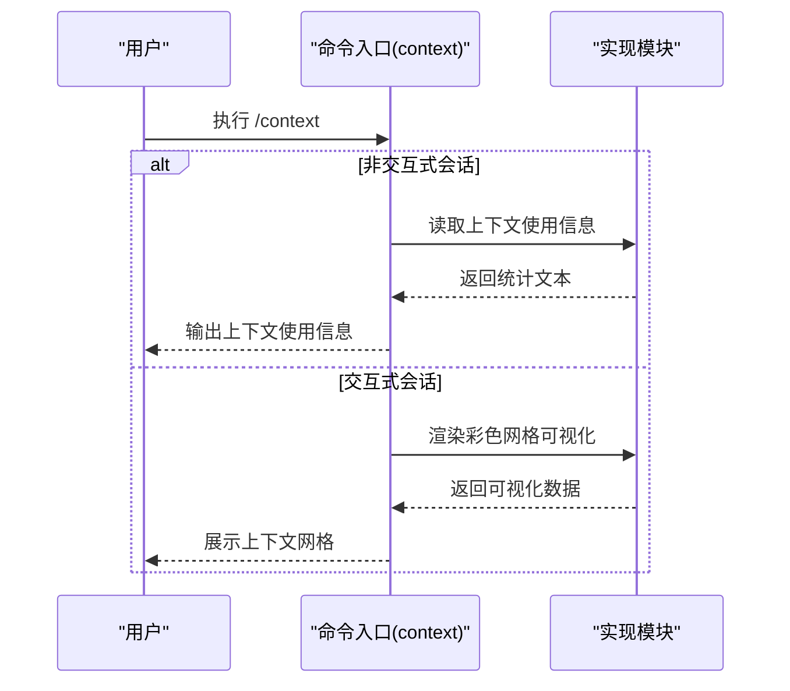
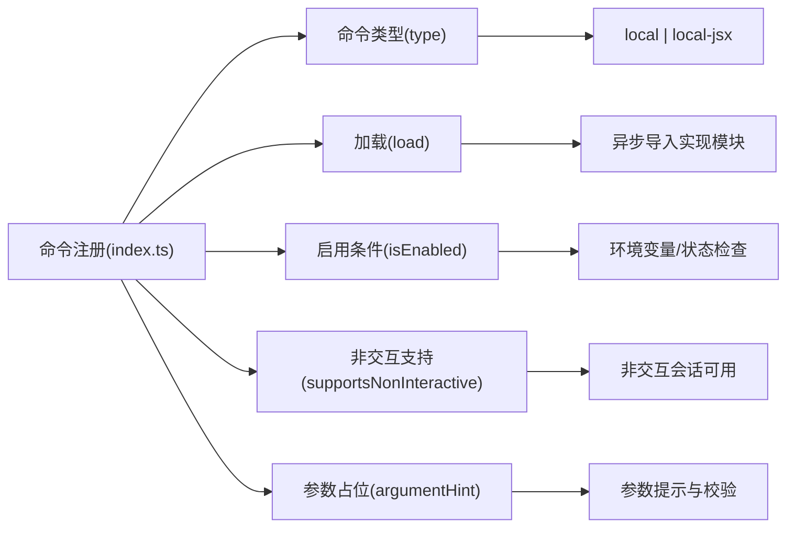

# 实用工具命令

<cite>
**本文引用的文件**
- [src/commands/diff/index.ts](file://src/commands/diff/index.ts)
- [src/commands/context/index.ts](file://src/commands/context/index.ts)
- [src/commands/memory/index.ts](file://src/commands/memory/index.ts)
- [src/commands/files/index.ts](file://src/commands/files/index.ts)
- [src/commands/tag/index.ts](file://src/commands/tag/index.ts)
</cite>

## 目录
1. [简介](#简介)
2. [项目结构](#项目结构)
3. [核心组件](#核心组件)
4. [架构总览](#架构总览)
5. [详细组件分析](#详细组件分析)
6. [依赖关系分析](#依赖关系分析)
7. [性能考量](#性能考量)
8. [故障排查指南](#故障排查指南)
9. [结论](#结论)
10. [附录](#附录)

## 简介
本文件系统性梳理 free-code 中常用的实用工具命令，覆盖以下命令：/diff（差异对比）、/context（上下文可视化与信息展示）、/memory（记忆文件编辑）、/files（文件列表查看）、/tag（会话标签切换）。文档从架构设计、组件职责、数据流、处理逻辑、集成点、错误处理与性能特征等方面进行深入解析，并提供参数选项、使用技巧与典型场景，帮助用户提升操作效率与工作质量。

## 项目结构
这些命令均以“命令注册器”形式在 src/commands 下按功能模块组织，每个命令通过一个 index.ts 暴露 Command 定义，包含名称、描述、类型、加载方式以及运行条件等元信息；具体实现由异步 import 延迟加载，确保启动时的轻量化与按需执行。

图表来源
- [src/commands/diff/index.ts:1-9](file://src/commands/diff/index.ts#L1-L9)
- [src/commands/context/index.ts:1-25](file://src/commands/context/index.ts#L1-L25)
- [src/commands/memory/index.ts:1-11](file://src/commands/memory/index.ts#L1-L11)
- [src/commands/files/index.ts:1-13](file://src/commands/files/index.ts#L1-L13)
- [src/commands/tag/index.ts:1-13](file://src/commands/tag/index.ts#L1-L13)

章节来源
- [src/commands/diff/index.ts:1-9](file://src/commands/diff/index.ts#L1-L9)
- [src/commands/context/index.ts:1-25](file://src/commands/context/index.ts#L1-L25)
- [src/commands/memory/index.ts:1-11](file://src/commands/memory/index.ts#L1-L11)
- [src/commands/files/index.ts:1-13](file://src/commands/files/index.ts#L1-L13)
- [src/commands/tag/index.ts:1-13](file://src/commands/tag/index.ts#L1-L13)

## 核心组件
- diff 命令：用于查看未提交变更与按轮次的差异，适合代码审查、回溯修改与协作审阅。
- context 命令：提供当前上下文使用的彩色网格可视化；同时支持非交互式会话下的上下文使用信息展示。
- memory 命令：用于编辑 Claude 记忆文件，便于维护长期记忆与个性化知识库。
- files 命令：列出当前上下文中所有文件，仅在特定用户类型下可用，适合快速确认上下文范围。
- tag 命令：为当前会话切换可搜索标签，便于分类检索与跨会话追踪。

章节来源
- [src/commands/diff/index.ts:1-9](file://src/commands/diff/index.ts#L1-L9)
- [src/commands/context/index.ts:1-25](file://src/commands/context/index.ts#L1-L25)
- [src/commands/memory/index.ts:1-11](file://src/commands/memory/index.ts#L1-L11)
- [src/commands/files/index.ts:1-13](file://src/commands/files/index.ts#L1-L13)
- [src/commands/tag/index.ts:1-13](file://src/commands/tag/index.ts#L1-L13)

## 架构总览
命令注册采用统一的 Command 接口，通过 type 字段区分本地命令或 JSX 交互命令；通过 supportsNonInteractive 控制是否可在非交互会话中运行；通过 isEnabled 提供运行前置条件（如环境变量限制）；通过 load 异步导入实现模块，降低启动开销。

图表来源
- [src/commands/diff/index.ts:1-9](file://src/commands/diff/index.ts#L1-L9)
- [src/commands/context/index.ts:1-25](file://src/commands/context/index.ts#L1-L25)
- [src/commands/memory/index.ts:1-11](file://src/commands/memory/index.ts#L1-L11)
- [src/commands/files/index.ts:1-13](file://src/commands/files/index.ts#L1-L13)
- [src/commands/tag/index.ts:1-13](file://src/commands/tag/index.ts#L1-L13)

## 详细组件分析

### /diff 差异对比
- 功能概述
  - 查看未提交变更与按轮次生成的差异，便于审阅改动范围、定位问题与协作评审。
- 关键属性
  - 类型：本地 JSX 命令（支持交互式界面）
  - 名称：diff
  - 描述：查看未提交变更与按轮次差异
  - 加载：通过异步 import 延迟加载实现模块
- 使用场景
  - 代码审查前快速预览改动
  - 回溯某一轮对话引入的变更
  - 协作开发中共享差异视图
- 参数与行为
  - 无显式参数定义；具体差异展示与交互由实现模块负责
- 可能的扩展
  - 支持过滤分支、文件范围与差异格式化输出

章节来源
- [src/commands/diff/index.ts:1-9](file://src/commands/diff/index.ts#L1-L9)

### /context 上下文管理
- 功能概述
  - 可视化当前上下文使用情况（彩色网格），直观反映 token 分配与内容占比；在非交互式会话中提供上下文使用信息文本输出。
- 关键属性
  - 主命令：context（JSX 交互）
    - 类型：local-jsx
    - 启用条件：非非交互式会话
  - 非交互命令：context（本地命令）
    - 类型：local
    - 支持非交互：是
    - 启用条件：仅在非交互式会话中可见与可用
- 使用场景
  - 优化提示词长度与文件选择
  - 调整上下文策略以避免超限
  - 在自动化流程中记录上下文使用统计
- 参数与行为
  - 无显式参数；交互式版本提供可视化网格；非交互式版本输出文本统计
- 交互流程（概念示意）

图表来源
- [src/commands/context/index.ts:1-25](file://src/commands/context/index.ts#L1-L25)

章节来源
- [src/commands/context/index.ts:1-25](file://src/commands/context/index.ts#L1-L25)

### /memory 记忆功能
- 功能概述
  - 编辑 Claude 记忆文件，维护长期记忆与个性化知识库，提升后续对话的一致性与准确性。
- 关键属性
  - 类型：local-jsx
  - 名称：memory
  - 描述：编辑 Claude 记忆文件
  - 加载：异步导入实现模块
- 使用场景
  - 维护个人知识库、项目背景与偏好设置
  - 在多轮对话中保持一致的人设与风格
- 参数与行为
  - 无显式参数；交互式界面负责文件选择与编辑
- 最佳实践
  - 将高频使用的知识片段拆分为小块，便于增量更新与检索

章节来源
- [src/commands/memory/index.ts:1-11](file://src/commands/memory/index.ts#L1-L11)

### /files 文件操作
- 功能概述
  - 列出当前上下文中所有文件，便于快速确认上下文范围与文件数量。
- 关键属性
  - 类型：local
  - 名称：files
  - 描述：列出当前上下文中所有文件
  - 支持非交互：是
  - 启用条件：受环境变量 USER_TYPE 限制（仅特定用户类型可用）
  - 加载：异步导入实现模块
- 使用场景
  - 审核上下文文件集合
  - 发现意外加入的大文件或敏感文件
- 参数与行为
  - 无显式参数；输出当前上下文中的文件清单
- 注意事项
  - 若 USER_TYPE 不满足启用条件，该命令不可用

章节来源
- [src/commands/files/index.ts:1-13](file://src/commands/files/index.ts#L1-L13)

### /tag 标签管理
- 功能概述
  - 为当前会话切换可搜索标签，便于分类检索与跨会话追踪。
- 关键属性
  - 类型：local-jsx
  - 名称：tag
  - 描述：切换当前会话的可搜索标签
  - 参数占位：argumentHint = "<tag-name>"
  - 启用条件：受环境变量 USER_TYPE 限制（仅特定用户类型可用）
  - 加载：异步导入实现模块
- 使用场景
  - 项目维度标签（如 feature-login、bug-fix）
  - 任务阶段标签（如 review、testing）
  - 优先级标签（如 p0、p1）
- 参数与行为
  - 需要提供标签名作为参数；实现模块负责切换与持久化
- 最佳实践
  - 统一标签命名规范，避免歧义
  - 结合检索与导出来建立标签驱动的工作流

章节来源
- [src/commands/tag/index.ts:1-13](file://src/commands/tag/index.ts#L1-L13)

## 依赖关系分析
- 命令注册与实现解耦：通过 type 与 load 字段实现延迟加载，减少启动时间与内存占用。
- 运行条件控制：通过 isEnabled 与 supportsNonInteractive 控制命令可用性与运行模式，适配不同会话类型。
- 环境变量约束：files 与 tag 命令受 USER_TYPE 限制，体现权限与能力隔离。
- 交互与非交互双形态：context 命令同时提供 JSX 交互与本地非交互两种实现，覆盖更广的使用场景。

图表来源
- [src/commands/diff/index.ts:1-9](file://src/commands/diff/index.ts#L1-L9)
- [src/commands/context/index.ts:1-25](file://src/commands/context/index.ts#L1-L25)
- [src/commands/memory/index.ts:1-11](file://src/commands/memory/index.ts#L1-L11)
- [src/commands/files/index.ts:1-13](file://src/commands/files/index.ts#L1-L13)
- [src/commands/tag/index.ts:1-13](file://src/commands/tag/index.ts#L1-L13)

章节来源
- [src/commands/diff/index.ts:1-9](file://src/commands/diff/index.ts#L1-L9)
- [src/commands/context/index.ts:1-25](file://src/commands/context/index.ts#L1-L25)
- [src/commands/memory/index.ts:1-11](file://src/commands/memory/index.ts#L1-L11)
- [src/commands/files/index.ts:1-13](file://src/commands/files/index.ts#L1-L13)
- [src/commands/tag/index.ts:1-13](file://src/commands/tag/index.ts#L1-L13)

## 性能考量
- 延迟加载：通过异步 import 减少初始加载成本，仅在调用时加载对应实现。
- 非交互优先：在非交互会话中优先使用本地命令，避免不必要的 UI 渲染。
- 条件启用：通过 isEnabled 与环境变量限制，避免无效命令占用资源。
- 上下文可视化：在交互式场景中提供网格可视化，有助于快速识别上下文热点，减少不必要的文件加入。

## 故障排查指南
- 命令不可用
  - 检查 USER_TYPE 是否满足 files 与 tag 的启用条件
  - 确认当前会话是否为非交互式，以便使用 context 的非交互版本
- 无法加载实现
  - 确认命令实现模块路径正确且存在
  - 检查异步导入链路是否抛错
- 上下文过大
  - 使用 /files 查看当前上下文文件清单，移除无关文件
  - 使用 /context 的可视化结果识别高 token 占比文件并优化
- 标签无法切换
  - 确认已提供标签名参数
  - 检查标签是否符合命名规范与检索要求

## 结论
上述五类实用工具命令围绕“差异对比、上下文管理、记忆编辑、文件查看与标签切换”构建了完整的日常辅助能力矩阵。通过统一的命令注册接口、灵活的运行模式与严格的启用条件控制，既保证了易用性，也兼顾了性能与安全性。建议结合团队规范统一标签命名与上下文策略，持续优化工作流效率。

## 附录
- 常用命令速览
  - /diff：查看未提交变更与按轮次差异
  - /context：上下文可视化（交互）与上下文使用信息（非交互）
  - /memory：编辑 Claude 记忆文件
  - /files：列出当前上下文中的文件（受 USER_TYPE 限制）
  - /tag：为当前会话切换可搜索标签（受 USER_TYPE 限制）