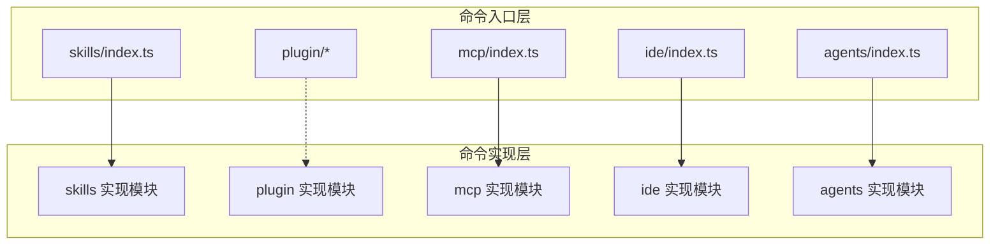
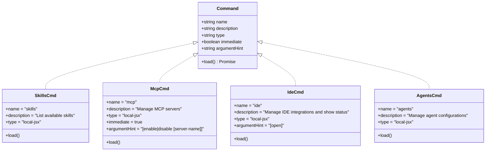
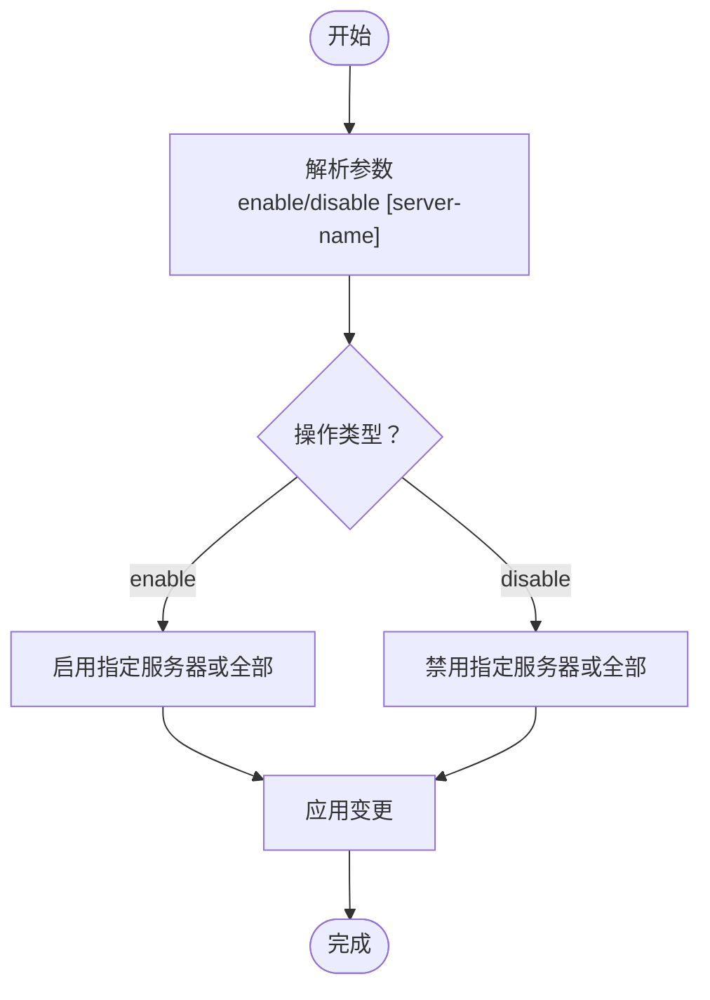
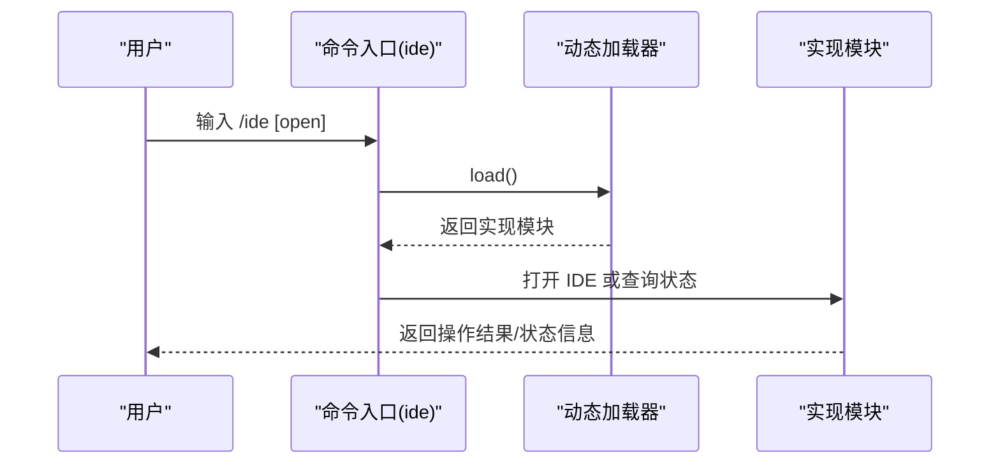
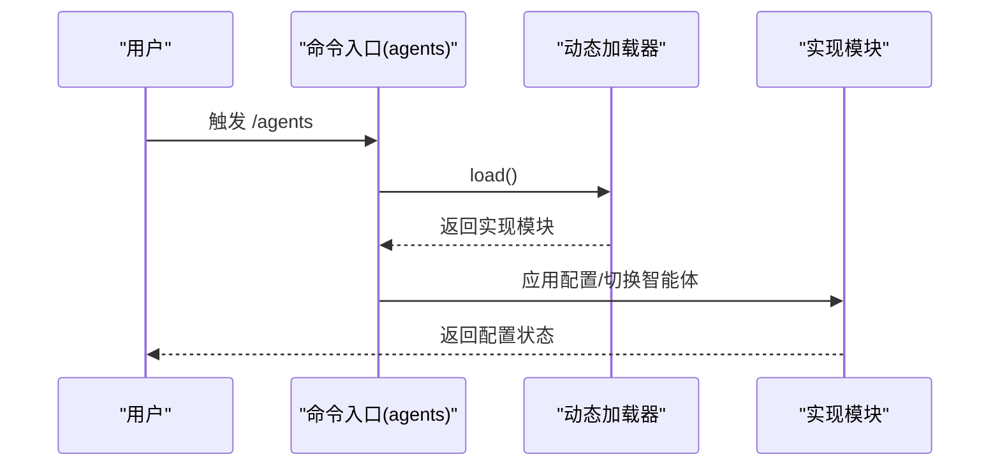
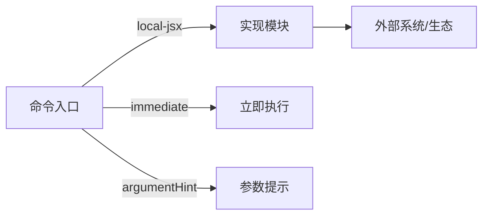

# 开发工具命令

<cite>
**本文引用的文件**
- [src/commands/skills/index.ts](file://src/commands/skills/index.ts)
- [src/commands/mcp/index.ts](file://src/commands/mcp/index.ts)
- [src/commands/ide/index.ts](file://src/commands/ide/index.ts)
- [src/commands/agents/index.ts](file://src/commands/agents/index.ts)
</cite>

## 目录
1. [简介](#简介)
2. [项目结构](#项目结构)
3. [核心组件](#核心组件)
4. [架构总览](#架构总览)
5. [详细组件分析](#详细组件分析)
6. [依赖分析](#依赖分析)
7. [性能考虑](#性能考虑)
8. [故障排查指南](#故障排查指南)
9. [结论](#结论)
10. [附录](#附录)

## 简介
本文件面向 free-code 的开发工具命令体系，聚焦与开发工作流紧密相关的四个命令：/skills（技能系统管理）、/plugin（插件管理）、/mcp（模型协作协议）、/ide（IDE 集成）、/agents（智能体管理）。文档从命令入口定义、职责边界、运行机制、配置与使用场景、以及与系统其他模块的集成关系出发，提供可操作的实践建议与最佳实践，帮助开发者快速上手并稳定地在本地或远程环境中使用这些命令。

## 项目结构
这些命令均以“命令入口文件”形式组织，位于 src/commands 下的子目录中，采用统一的命令元数据定义模式：
- 命令类型：local-jsx
- 命名与描述：用于 CLI 或 UI 中识别与展示
- 加载策略：通过动态 import 延迟加载具体实现模块
- 部分命令支持立即执行与参数提示

图表来源
- [src/commands/skills/index.ts:1-11](file://src/commands/skills/index.ts#L1-L11)
- [src/commands/mcp/index.ts:1-13](file://src/commands/mcp/index.ts#L1-L13)
- [src/commands/ide/index.ts:1-12](file://src/commands/ide/index.ts#L1-L12)
- [src/commands/agents/index.ts:1-11](file://src/commands/agents/index.ts#L1-L11)

章节来源
- [src/commands/skills/index.ts:1-11](file://src/commands/skills/index.ts#L1-L11)
- [src/commands/mcp/index.ts:1-13](file://src/commands/mcp/index.ts#L1-L13)
- [src/commands/ide/index.ts:1-12](file://src/commands/ide/index.ts#L1-L12)
- [src/commands/agents/index.ts:1-11](file://src/commands/agents/index.ts#L1-L11)

## 核心组件
- /skills（技能系统管理）
  - 类型：local-jsx
  - 功能：列出可用技能
  - 加载方式：延迟加载实现模块
  - 典型用途：查看当前已加载的技能集合，辅助调试与能力确认
- /mcp（模型协作协议）
  - 类型：local-jsx
  - 功能：管理 MCP 服务器（启用/禁用）
  - 执行特性：immediate=true（立即执行）
  - 参数提示：支持 enable/disable 与可选服务器名称
  - 典型用途：在本地或远程环境中启停 MCP 服务，便于与外部资源交互
- /ide（IDE 集成）
  - 类型：local-jsx
  - 功能：管理 IDE 集成并显示状态
  - 参数提示：支持 open 子命令
  - 典型用途：连接/打开 IDE，查看连接状态，提升开发效率
- /agents（智能体管理）
  - 类型：local-jsx
  - 功能：管理智能体配置
  - 加载方式：延迟加载实现模块
  - 典型用途：配置与切换不同智能体的工作模式与权限范围

章节来源
- [src/commands/skills/index.ts:1-11](file://src/commands/skills/index.ts#L1-L11)
- [src/commands/mcp/index.ts:1-13](file://src/commands/mcp/index.ts#L1-L13)
- [src/commands/ide/index.ts:1-12](file://src/commands/ide/index.ts#L1-L12)
- [src/commands/agents/index.ts:1-11](file://src/commands/agents/index.ts#L1-L11)

## 架构总览
命令入口通过统一的 Command 接口定义，结合动态导入实现“按需加载”。这种设计具备以下优势：
- 启动时延最小化
- 模块间低耦合
- 可扩展性强（新增命令仅需遵循相同接口）

图表来源
- [src/commands/skills/index.ts:1-11](file://src/commands/skills/index.ts#L1-L11)
- [src/commands/mcp/index.ts:1-13](file://src/commands/mcp/index.ts#L1-L13)
- [src/commands/ide/index.ts:1-12](file://src/commands/ide/index.ts#L1-L12)
- [src/commands/agents/index.ts:1-11](file://src/commands/agents/index.ts#L1-L11)

## 详细组件分析

### /skills（技能系统管理）
- 职责边界
  - 列出当前可用技能，供用户与系统内部查询
  - 作为技能系统的入口，不直接执行复杂逻辑
- 运行机制
  - 通过动态 import 加载实现模块，避免启动时阻塞
- 使用场景
  - 新增技能后快速验证是否生效
  - 在调试环境下核对技能清单
- 最佳实践
  - 将技能实现拆分为独立模块，便于增量更新与热替换
  - 保持描述字段清晰，便于 UI 展示与检索

图表来源
- [src/commands/skills/index.ts:1-11](file://src/commands/skills/index.ts#L1-L11)

章节来源
- [src/commands/skills/index.ts:1-11](file://src/commands/skills/index.ts#L1-L11)

### /mcp（模型协作协议）
- 职责边界
  - 管理 MCP 服务器的启用/禁用
  - 支持选择性针对特定服务器进行控制
- 运行机制
  - immediate=true 表示该命令会尽快执行，适合需要即时生效的操作
  - argumentHint 提供参数提示，降低误操作风险
- 使用场景
  - 在本地开发环境中启停 MCP 服务
  - 远程环境中切换 MCP 服务器以适配不同资源
- 最佳实践
  - 对于敏感操作（如禁用关键服务器），建议先检查当前状态再执行
  - 结合日志与状态监控，确保启停结果符合预期

图表来源
- [src/commands/mcp/index.ts:1-13](file://src/commands/mcp/index.ts#L1-L13)

章节来源
- [src/commands/mcp/index.ts:1-13](file://src/commands/mcp/index.ts#L1-L13)

### /ide（IDE 集成）
- 职责边界
  - 管理 IDE 集成状态与连接
  - 支持打开 IDE 界面以便进一步操作
- 运行机制
  - 通过动态加载实现模块，按需初始化 IDE 相关功能
  - argumentHint 指示 open 子命令，便于用户快捷操作
- 使用场景
  - 在终端内一键打开 IDE 并进入项目上下文
  - 查看当前 IDE 连接状态，排除连接问题
- 最佳实践
  - 在 CI 或远程环境优先使用非交互式状态查询
  - 本地开发推荐使用 open 子命令快速进入编辑器

图表来源
- [src/commands/ide/index.ts:1-12](file://src/commands/ide/index.ts#L1-L12)

章节来源
- [src/commands/ide/index.ts:1-12](file://src/commands/ide/index.ts#L1-L12)

### /agents（智能体管理）
- 职责边界
  - 管理智能体配置，支持切换与调整权限范围
- 运行机制
  - 通过动态加载实现模块，避免不必要的初始化开销
- 使用场景
  - 在多智能体协作场景下，快速切换角色与权限
  - 调试智能体行为与输出，定位配置问题
- 最佳实践
  - 为不同任务场景预设智能体配置模板
  - 结合权限与安全策略，限制高风险操作

图表来源
- [src/commands/agents/index.ts:1-11](file://src/commands/agents/index.ts#L1-L11)

章节来源
- [src/commands/agents/index.ts:1-11](file://src/commands/agents/index.ts#L1-L11)

## 依赖分析
- 命令入口与实现解耦
  - 所有命令均通过 type: local-jsx 与 load() 延迟加载实现模块
  - 降低启动时的内存与时间成本
- 命令间无直接耦合
  - 各命令独立维护自身实现，便于扩展与维护
- 外部集成点
  - /mcp 与 MCP 生态系统交互
  - /ide 与 IDE 生态系统交互
  - /agents 与智能体配置与权限系统交互
  - /skills 与技能注册与发现机制交互

图表来源
- [src/commands/skills/index.ts:1-11](file://src/commands/skills/index.ts#L1-L11)
- [src/commands/mcp/index.ts:1-13](file://src/commands/mcp/index.ts#L1-L13)
- [src/commands/ide/index.ts:1-12](file://src/commands/ide/index.ts#L1-L12)
- [src/commands/agents/index.ts:1-11](file://src/commands/agents/index.ts#L1-L11)

章节来源
- [src/commands/skills/index.ts:1-11](file://src/commands/skills/index.ts#L1-L11)
- [src/commands/mcp/index.ts:1-13](file://src/commands/mcp/index.ts#L1-L13)
- [src/commands/ide/index.ts:1-12](file://src/commands/ide/index.ts#L1-L12)
- [src/commands/agents/index.ts:1-11](file://src/commands/agents/index.ts#L1-L11)

## 性能考虑
- 延迟加载策略
  - 通过动态 import 减少初始启动时间与内存占用
- 立即执行命令
  - 对于 /mcp 等需要快速生效的命令，immediate=true 可缩短响应链路
- 参数提示
  - argumentHint 有助于减少无效调用与重试，提升整体效率

## 故障排查指南
- 命令未找到或加载失败
  - 检查命令入口文件是否存在且导出正确
  - 确认动态加载路径与模块名一致
- /mcp 启停异常
  - 先查询当前状态，再执行启停
  - 核查目标服务器名称与可用列表
- /ide 打不开或状态异常
  - 确认 IDE 是否已安装并可被系统调用
  - 使用状态查询命令确认连接情况
- /agents 配置不生效
  - 检查权限与安全策略
  - 重新应用配置并观察日志输出

## 结论
上述四个命令以统一的入口定义与延迟加载机制实现了清晰的职责划分与良好的可扩展性。配合参数提示与立即执行策略，能够在本地与远程环境中高效地完成技能、MCP、IDE 与智能体的管理工作。建议在团队内建立标准化的命令使用流程与配置模板，持续优化命令的易用性与稳定性。

## 附录
- 开发环境设置建议
  - 使用参数提示与状态查询命令进行日常巡检
  - 为关键命令（如 /mcp）建立启停脚本与回滚策略
- 插件开发参考
  - 参考命令入口的定义方式，统一接口与加载策略
- IDE 连接最佳实践
  - 优先使用 open 子命令快速进入编辑器
  - 定期检查连接状态，避免长时间无响应
- 智能体配置建议
  - 为不同任务场景准备配置模板
  - 结合权限策略，限制高风险操作