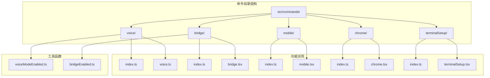
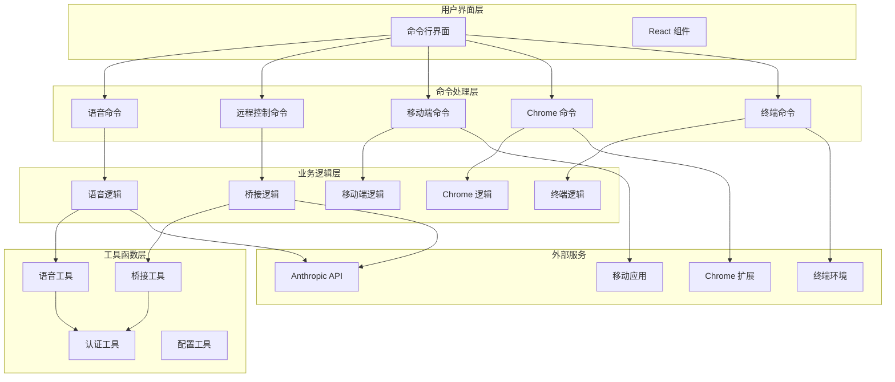
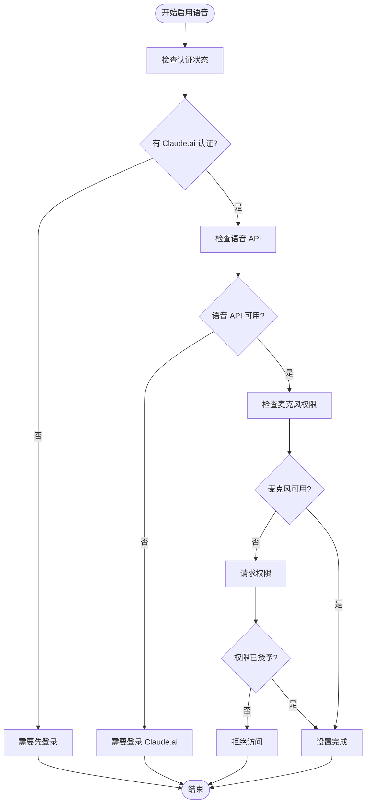
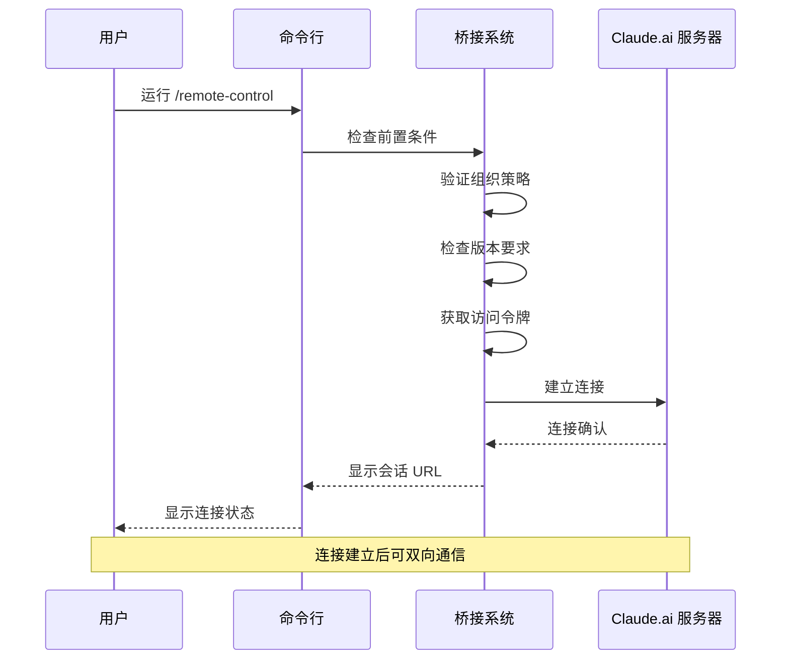
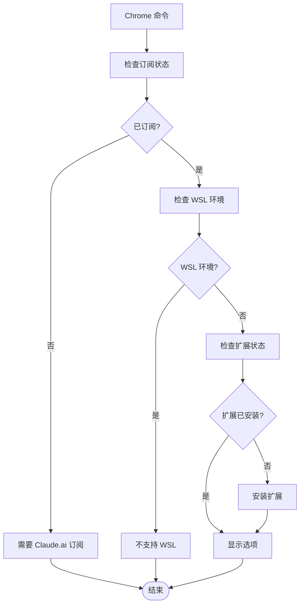
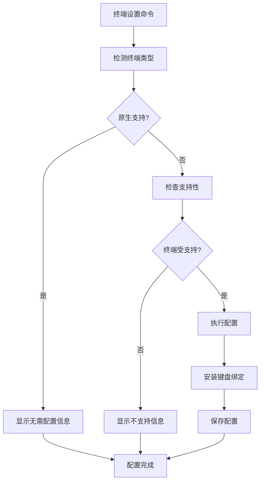
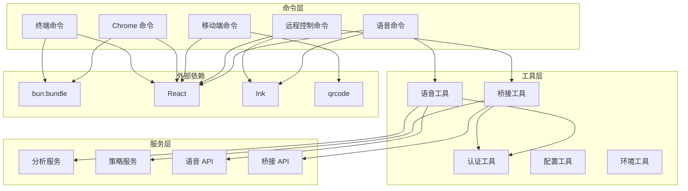

# 特殊功能命令

<cite>
**本文档引用的文件**
- [src/commands/voice/index.ts](file://src/commands/voice/index.ts)
- [src/commands/bridge/index.ts](file://src/commands/bridge/index.ts)
- [src/commands/mobile/index.ts](file://src/commands/mobile/index.ts)
- [src/commands/chrome/index.ts](file://src/commands/chrome/index.ts)
- [src/commands/terminalSetup/index.ts](file://src/commands/terminalSetup/index.ts)
- [src/voice/voiceModeEnabled.ts](file://src/voice/voiceModeEnabled.ts)
- [src/bridge/bridgeEnabled.ts](file://src/bridge/bridgeEnabled.ts)
- [src/commands/voice/voice.ts](file://src/commands/voice/voice.ts)
- [src/commands/bridge/bridge.tsx](file://src/commands/bridge/bridge.tsx)
- [src/commands/mobile/mobile.tsx](file://src/commands/mobile/mobile.tsx)
- [src/commands/chrome/chrome.tsx](file://src/commands/chrome/chrome.tsx)
- [src/commands/terminalSetup/terminalSetup.tsx](file://src/commands/terminalSetup/terminalSetup.tsx)
</cite>

## 目录
1. [简介](#简介)
2. [项目结构](#项目结构)
3. [核心组件](#核心组件)
4. [架构概览](#架构概览)
5. [详细组件分析](#详细组件分析)
6. [依赖关系分析](#依赖关系分析)
7. [性能考虑](#性能考虑)
8. [故障排除指南](#故障排除指南)
9. [结论](#结论)

## 简介

本文档详细介绍 free-code 项目中的特殊功能命令，包括语音输入、远程控制、移动端支持、Chrome 扩展和终端设置等功能。这些命令提供了增强用户体验的高级功能，需要特定的配置和权限才能使用。

## 项目结构

特殊功能命令主要位于 `src/commands/` 目录下，每个功能都有独立的模块化实现：

**图表来源**
- [src/commands/voice/index.ts:1-21](file://src/commands/voice/index.ts#L1-L21)
- [src/commands/bridge/index.ts:1-27](file://src/commands/bridge/index.ts#L1-L27)
- [src/commands/mobile/index.ts:1-12](file://src/commands/mobile/index.ts#L1-L12)
- [src/commands/chrome/index.ts:1-14](file://src/commands/chrome/index.ts#L1-L14)
- [src/commands/terminalSetup/index.ts:1-24](file://src/commands/terminalSetup/index.ts#L1-L24)

**章节来源**
- [src/commands/voice/index.ts:1-21](file://src/commands/voice/index.ts#L1-L21)
- [src/commands/bridge/index.ts:1-27](file://src/commands/bridge/index.ts#L1-L27)
- [src/commands/mobile/index.ts:1-12](file://src/commands/mobile/index.ts#L1-L12)
- [src/commands/chrome/index.ts:1-14](file://src/commands/chrome/index.ts#L1-L14)
- [src/commands/terminalSetup/index.ts:1-24](file://src/commands/terminalSetup/index.ts#L1-L24)

## 核心组件

### 语音输入命令 (/voice)

语音输入功能允许用户通过语音进行交互，需要满足以下条件：
- 需要 Claude.ai 账户认证
- 支持语音流 API
- 需要麦克风访问权限
- 需要音频录制工具

### 远程控制命令 (/remote-control)

远程控制功能提供双向桥接连接，需要：
- Claude.ai 订阅者身份
- 组织策略允许远程控制
- 符合最低版本要求
- 有效的访问令牌

### 移动端支持命令 (/mobile)

移动端支持功能提供移动应用下载链接和二维码：
- 支持 iOS 和 Android 平台
- 自动生成下载二维码
- 提供应用商店链接

### Chrome 扩展命令 (/chrome)

Chrome 扩展功能提供浏览器集成：
- 需要 Claude.ai 订阅
- 支持扩展安装和管理
- 提供权限管理和重连功能

### 终端设置命令 (/terminal-setup)

终端设置功能优化不同终端的键盘绑定：
- 支持多种终端类型
- 自动检测终端环境
- 安装必要的键盘绑定

**章节来源**
- [src/commands/voice/voice.ts:1-151](file://src/commands/voice/voice.ts#L1-L151)
- [src/commands/bridge/bridge.tsx:1-509](file://src/commands/bridge/bridge.tsx#L1-L509)
- [src/commands/mobile/mobile.tsx:1-274](file://src/commands/mobile/mobile.tsx#L1-L274)
- [src/commands/chrome/chrome.tsx:1-285](file://src/commands/chrome/chrome.tsx#L1-L285)
- [src/commands/terminalSetup/terminalSetup.tsx:1-531](file://src/commands/terminalSetup/terminalSetup.tsx#L1-L531)

## 架构概览

**图表来源**
- [src/commands/voice/voice.ts:1-151](file://src/commands/voice/voice.ts#L1-L151)
- [src/commands/bridge/bridge.tsx:1-509](file://src/commands/bridge/bridge.tsx#L1-L509)
- [src/commands/mobile/mobile.tsx:1-274](file://src/commands/mobile/mobile.tsx#L1-L274)
- [src/commands/chrome/chrome.tsx:1-285](file://src/commands/chrome/chrome.tsx#L1-L285)
- [src/commands/terminalSetup/terminalSetup.tsx:1-531](file://src/commands/terminalSetup/terminalSetup.tsx#L1-L531)

## 详细组件分析

### 语音输入功能

语音输入功能通过 `/voice` 命令启用，具有以下特性：

#### 功能特性
- 支持语音转文字输入
- 需要麦克风权限
- 支持多语言识别
- 提供语音反馈

#### 启用条件

**图表来源**
- [src/commands/voice/voice.ts:16-151](file://src/commands/voice/voice.ts#L16-L151)
- [src/voice/voiceModeEnabled.ts:1-55](file://src/voice/voiceModeEnabled.ts#L1-L55)

#### 配置步骤
1. 确保已登录 Claude.ai 账户
2. 检查麦克风权限设置
3. 安装必要的音频录制工具
4. 运行 `/voice` 命令启用功能

**章节来源**
- [src/commands/voice/index.ts:1-21](file://src/commands/voice/index.ts#L1-L21)
- [src/commands/voice/voice.ts:1-151](file://src/commands/voice/voice.ts#L1-L151)
- [src/voice/voiceModeEnabled.ts:1-55](file://src/voice/voiceModeEnabled.ts#L1-L55)

### 远程控制功能

远程控制功能通过 `/remote-control` 命令启用，提供双向桥接连接：

#### 功能特性
- 双向通信能力
- 会话 URL 共享
- 设备配对管理
- 断开连接选项

#### 启用流程

**图表来源**
- [src/commands/bridge/bridge.tsx:505-509](file://src/commands/bridge/bridge.tsx#L505-L509)
- [src/bridge/bridgeEnabled.ts:28-87](file://src/bridge/bridgeEnabled.ts#L28-L87)

#### 配置要求
- Claude.ai 订阅者身份
- 组织策略允许远程控制
- 符合最低版本要求
- 有效的访问令牌

**章节来源**
- [src/commands/bridge/index.ts:1-27](file://src/commands/bridge/index.ts#L1-L27)
- [src/commands/bridge/bridge.tsx:1-509](file://src/commands/bridge/bridge.tsx#L1-L509)
- [src/bridge/bridgeEnabled.ts:1-203](file://src/bridge/bridgeEnabled.ts#L1-L203)

### 移动端支持功能

移动端支持功能通过 `/mobile` 命令提供：

#### 功能特性
- 自动生成应用下载二维码
- 支持 iOS 和 Android 平台
- 提供应用商店链接
- 一键跳转到下载页面

#### 使用场景
- 快速获取移动应用下载链接
- 在不同设备间同步操作
- 移动端与桌面端协作

**章节来源**
- [src/commands/mobile/index.ts:1-12](file://src/commands/mobile/index.ts#L1-L12)
- [src/commands/mobile/mobile.tsx:1-274](file://src/commands/mobile/mobile.tsx#L1-L274)

### Chrome 扩展功能

Chrome 扩展功能通过 `/chrome` 命令管理：

#### 功能特性
- 扩展安装指导
- 权限管理界面
- 连接状态显示
- 默认启用设置

#### 配置选项

**图表来源**
- [src/commands/chrome/chrome.tsx:1-285](file://src/commands/chrome/chrome.tsx#L1-L285)

**章节来源**
- [src/commands/chrome/index.ts:1-14](file://src/commands/chrome/index.ts#L1-L14)
- [src/commands/chrome/chrome.tsx:1-285](file://src/commands/chrome/chrome.tsx#L1-L285)

### 终端设置功能

终端设置功能通过 `/terminal-setup` 命令优化键盘绑定：

#### 支持的终端
- Apple Terminal (macOS)
- VSCode 终端
- Cursor 终端
- Windsurf 终端
- Alacritty
- Zed
- iTerm2 (原生支持)
- WezTerm (原生支持)
- Ghostty (原生支持)
- Kitty (原生支持)
- Warp (原生支持)

#### 配置流程

**图表来源**
- [src/commands/terminalSetup/terminalSetup.tsx:73-185](file://src/commands/terminalSetup/terminalSetup.tsx#L73-L185)

**章节来源**
- [src/commands/terminalSetup/index.ts:1-24](file://src/commands/terminalSetup/index.ts#L1-L24)
- [src/commands/terminalSetup/terminalSetup.tsx:1-531](file://src/commands/terminalSetup/terminalSetup.tsx#L1-L531)

## 依赖关系分析

**图表来源**
- [src/commands/voice/index.ts:1-21](file://src/commands/voice/index.ts#L1-L21)
- [src/commands/bridge/index.ts:1-27](file://src/commands/bridge/index.ts#L1-L27)
- [src/commands/chrome/index.ts:1-14](file://src/commands/chrome/index.ts#L1-L14)
- [src/commands/terminalSetup/index.ts:1-24](file://src/commands/terminalSetup/index.ts#L1-L24)

**章节来源**
- [src/commands/voice/index.ts:1-21](file://src/commands/voice/index.ts#L1-L21)
- [src/commands/bridge/index.ts:1-27](file://src/commands/bridge/index.ts#L1-L27)
- [src/commands/chrome/index.ts:1-14](file://src/commands/chrome/index.ts#L1-L14)
- [src/commands/terminalSetup/index.ts:1-24](file://src/commands/terminalSetup/index.ts#L1-L24)

## 性能考虑

### 语音功能性能
- 语音流处理需要稳定的网络连接
- 音频录制工具的性能影响语音质量
- 微调麦克风权限避免不必要的权限提示

### 远程控制性能
- 桥接连接的建立需要时间
- 双向通信的延迟取决于网络状况
- 组织策略检查可能影响响应速度

### 终端设置性能
- 键盘绑定安装是幂等操作
- 文件系统操作需要适当的错误处理
- 配置备份机制确保数据安全

## 故障排除指南

### 语音功能问题
1. **无音频录制工具**
   - 检查系统是否安装 SoX 或其他音频录制工具
   - 运行安装命令或手动安装

2. **麦克风权限被拒绝**
   - 检查系统隐私设置中的麦克风权限
   - 重新授权应用程序访问权限

3. **语音 API 不可用**
   - 确认已登录 Claude.ai 账户
   - 检查网络连接和 API 可用性

### 远程控制问题
1. **组织策略阻止**
   - 联系管理员检查远程控制策略设置
   - 确认组织允许使用远程控制功能

2. **版本不兼容**
   - 更新到最新版本的 Claude Code
   - 检查最低版本要求

3. **访问令牌无效**
   - 重新登录获取新的访问令牌
   - 检查令牌的有效期和作用域

### Chrome 扩展问题
1. **扩展未检测到**
   - 确认 Chrome 扩展已正确安装
   - 检查扩展的启用状态

2. **权限不足**
   - 在扩展设置中管理网站权限
   - 授权 Claude 访问所需的网站

3. **连接失败**
   - 尝试重新连接扩展
   - 检查网络连接和代理设置

### 终端设置问题
1. **终端不受支持**
   - 确认当前使用的终端在支持列表中
   - 查看支持的终端类型和版本

2. **配置失败**
   - 检查文件权限和写入权限
   - 确认配置文件格式正确

3. **键盘绑定冲突**
   - 检查现有键盘绑定设置
   - 修改或移除冲突的绑定

**章节来源**
- [src/commands/voice/voice.ts:82-112](file://src/commands/voice/voice.ts#L82-L112)
- [src/commands/bridge/bridge.tsx:467-504](file://src/commands/bridge/bridge.tsx#L467-L504)
- [src/commands/chrome/chrome.tsx:189-223](file://src/commands/chrome/chrome.tsx#L189-L223)
- [src/commands/terminalSetup/terminalSetup.tsx:373-461](file://src/commands/terminalSetup/terminalSetup.tsx#L373-L461)

## 结论

free-code 项目的特殊功能命令提供了丰富的增强功能，从语音输入到远程控制，从移动端支持到 Chrome 扩展集成。每个功能都有明确的启用条件、配置步骤和使用场景。

关键要点：
- **权限管理**：所有功能都需要适当的认证和权限
- **环境检测**：自动检测支持的环境和终端类型
- **错误处理**：提供清晰的错误消息和故障排除指导
- **配置持久化**：设置更改会持久保存到配置文件

建议用户根据自己的使用场景选择合适的功能，并按照相应的配置步骤进行设置。对于企业用户，需要注意组织策略对某些功能的限制。