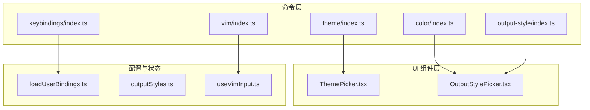
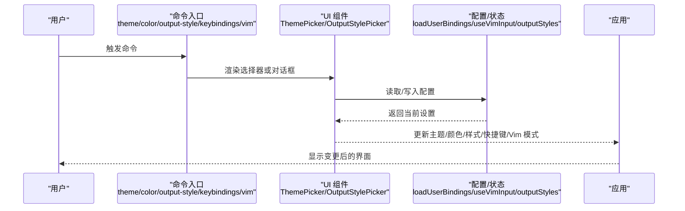
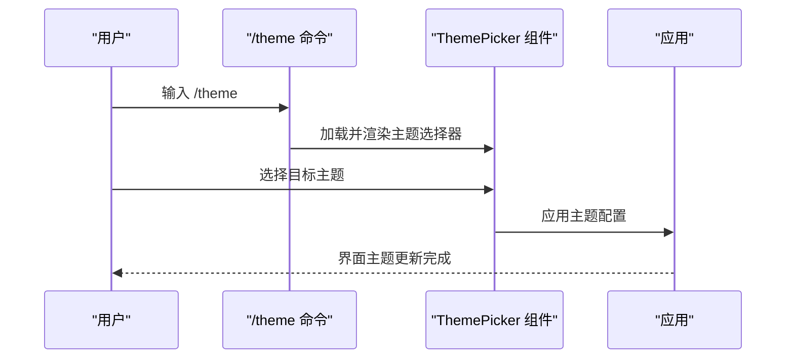
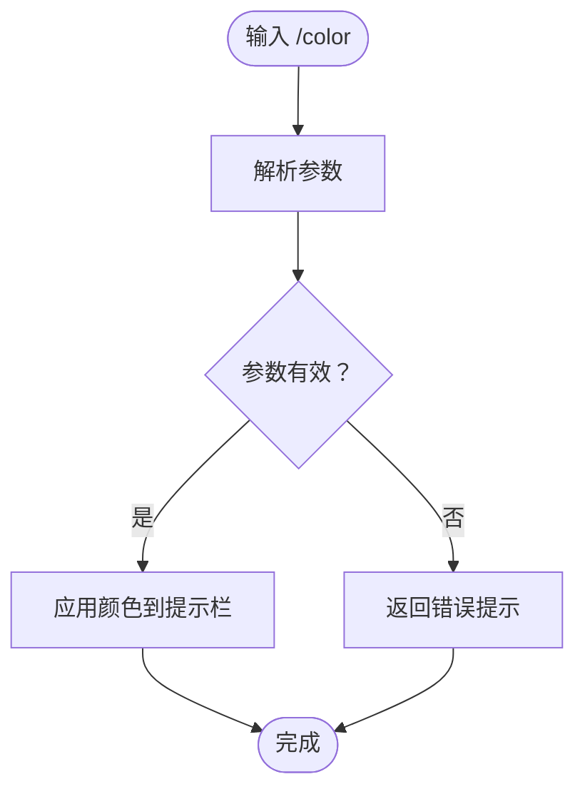
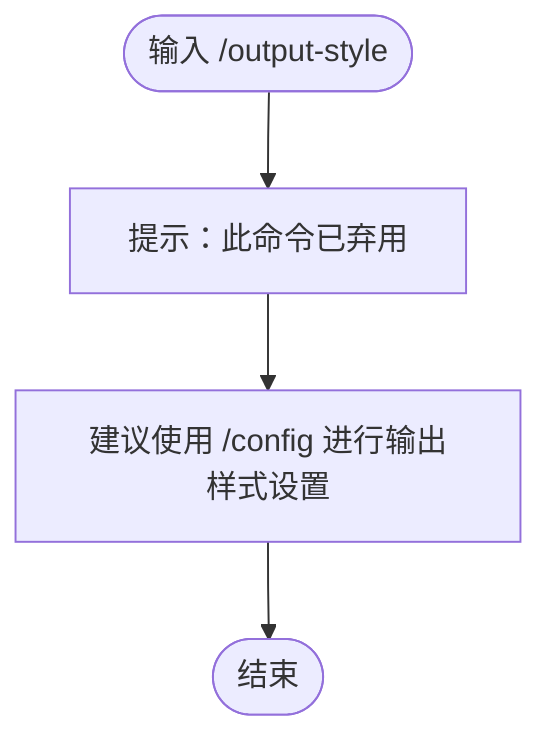
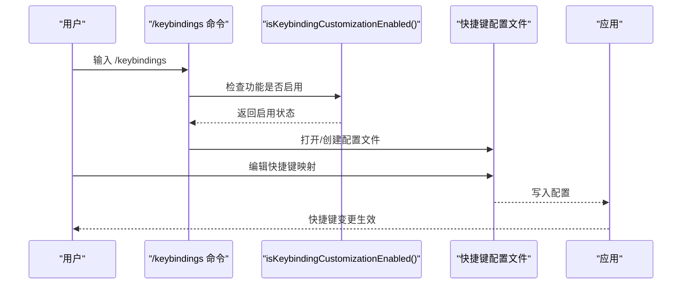
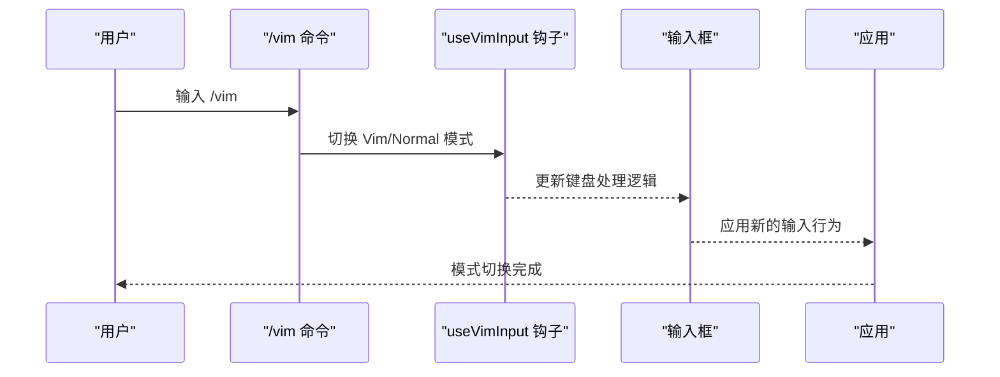
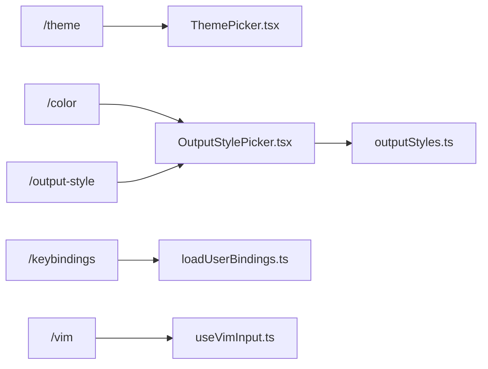

# 界面定制命令

<cite>
**本文引用的文件**
- [src/commands/theme/index.ts](file://src/commands/theme/index.ts)
- [src/commands/color/index.ts](file://src/commands/color/index.ts)
- [src/commands/output-style/index.ts](file://src/commands/output-style/index.ts)
- [src/commands/keybindings/index.ts](file://src/commands/keybindings/index.ts)
- [src/commands/vim/index.ts](file://src/commands/vim/index.ts)
- [src/keybindings/loadUserBindings.ts](file://src/keybindings/loadUserBindings.ts)
- [src/components/ThemePicker.tsx](file://src/components/ThemePicker.tsx)
- [src/components/OutputStylePicker.tsx](file://src/components/OutputStylePicker.tsx)
- [src/hooks/useVimInput.ts](file://src/hooks/useVimInput.ts)
- [src/constants/outputStyles.ts](file://src/constants/outputStyles.ts)
</cite>

## 目录
1. [简介](#简介)
2. [项目结构](#项目结构)
3. [核心组件](#核心组件)
4. [架构总览](#架构总览)
5. [详细组件分析](#详细组件分析)
6. [依赖关系分析](#依赖关系分析)
7. [性能考量](#性能考量)
8. [故障排除指南](#故障排除指南)
9. [结论](#结论)

## 简介
本文件面向 free-code 用户与开发者，系统性梳理界面定制类命令，包括：/theme（主题切换）、/color（颜色配置）、/output-style（输出样式）、/keybindings（快捷键设置）、/vim（Vim 模式）。文档从命令元数据、运行时行为、与 UI 组件的映射关系、以及与全局状态/配置系统的交互入手，帮助你快速掌握如何通过命令实现界面个性化与高效操作。

## 项目结构
界面定制命令均位于 src/commands 下的独立子目录中，每个命令以 index.ts 暴露标准化的 Command 元信息，并通过 type: 'local' 或 'local-jsx' 标识其执行方式；部分命令在首次使用时才懒加载实现模块，以降低启动开销。

**图表来源**
- [src/commands/theme/index.ts:1-11](file://src/commands/theme/index.ts#L1-L11)
- [src/commands/color/index.ts:1-17](file://src/commands/color/index.ts#L1-L17)
- [src/commands/output-style/index.ts:1-12](file://src/commands/output-style/index.ts#L1-L12)
- [src/commands/keybindings/index.ts:1-14](file://src/commands/keybindings/index.ts#L1-L14)
- [src/commands/vim/index.ts:1-12](file://src/commands/vim/index.ts#L1-L12)
- [src/components/ThemePicker.tsx](file://src/components/ThemePicker.tsx)
- [src/components/OutputStylePicker.tsx](file://src/components/OutputStylePicker.tsx)
- [src/keybindings/loadUserBindings.ts](file://src/keybindings/loadUserBindings.ts)
- [src/constants/outputStyles.ts](file://src/constants/outputStyles.ts)
- [src/hooks/useVimInput.ts](file://src/hooks/useVimInput.ts)

**章节来源**
- [src/commands/theme/index.ts:1-11](file://src/commands/theme/index.ts#L1-L11)
- [src/commands/color/index.ts:1-17](file://src/commands/color/index.ts#L1-L17)
- [src/commands/output-style/index.ts:1-12](file://src/commands/output-style/index.ts#L1-L12)
- [src/commands/keybindings/index.ts:1-14](file://src/commands/keybindings/index.ts#L1-L14)
- [src/commands/vim/index.ts:1-12](file://src/commands/vim/index.ts#L1-L12)

## 核心组件
- 命令注册与类型标识
  - 所有界面定制命令均通过 type 字段声明执行方式：type: 'local' 表示本地命令，type: 'local-jsx' 表示需要渲染 JSX 的本地命令。
  - 部分命令支持 immediate（立即执行）或非交互式模式，具体取决于命令语义与实现。
- 运行时行为
  - /theme 与 /color 属于本地 JSX 命令，通常会打开对应的 Picker 组件进行选择。
  - /output-style 当前标记为已弃用且隐藏，建议使用 /config 命令进行输出样式配置。
  - /keybindings 在启用用户自定义快捷键时才可用，否则被禁用。
  - /vim 切换编辑模式，影响输入行为与键盘处理逻辑。

**章节来源**
- [src/commands/theme/index.ts:3-8](file://src/commands/theme/index.ts#L3-L8)
- [src/commands/color/index.ts:7-14](file://src/commands/color/index.ts#L7-L14)
- [src/commands/output-style/index.ts:3-9](file://src/commands/output-style/index.ts#L3-L9)
- [src/commands/keybindings/index.ts:4-11](file://src/commands/keybindings/index.ts#L4-L11)
- [src/commands/vim/index.ts:3-9](file://src/commands/vim/index.ts#L3-L9)

## 架构总览
下图展示命令到 UI 组件与配置系统的调用链路，体现“命令入口 -> 组件渲染 -> 状态更新 -> 生效”的闭环。

**图表来源**
- [src/commands/theme/index.ts:3-8](file://src/commands/theme/index.ts#L3-L8)
- [src/commands/color/index.ts:7-14](file://src/commands/color/index.ts#L7-L14)
- [src/commands/output-style/index.ts:3-9](file://src/commands/output-style/index.ts#L3-L9)
- [src/commands/keybindings/index.ts:4-11](file://src/commands/keybindings/index.ts#L4-L11)
- [src/commands/vim/index.ts:3-9](file://src/commands/vim/index.ts#L3-L9)
- [src/components/ThemePicker.tsx](file://src/components/ThemePicker.tsx)
- [src/components/OutputStylePicker.tsx](file://src/components/OutputStylePicker.tsx)
- [src/keybindings/loadUserBindings.ts](file://src/keybindings/loadUserBindings.ts)
- [src/hooks/useVimInput.ts](file://src/hooks/useVimInput.ts)
- [src/constants/outputStyles.ts](file://src/constants/outputStyles.ts)

## 详细组件分析

### /theme 主题切换命令
- 命令元信息
  - 类型：local-jsx
  - 名称：theme
  - 描述：更改界面主题
- 运行机制
  - 通过懒加载实现模块，避免启动时额外开销。
  - 实际渲染由 ThemePicker.tsx 负责，提供可选主题列表与即时预览。
- 效果与自定义
  - 支持在可用主题间切换，界面元素（如背景、文字、边框、强调色）随之变化。
  - 自定义方法：通过主题选择器直接切换；若需扩展主题，可在主题系统中添加新条目并重新加载。

**图表来源**
- [src/commands/theme/index.ts:3-8](file://src/commands/theme/index.ts#L3-L8)
- [src/components/ThemePicker.tsx](file://src/components/ThemePicker.tsx)

**章节来源**
- [src/commands/theme/index.ts:3-8](file://src/commands/theme/index.ts#L3-L8)
- [src/components/ThemePicker.tsx](file://src/components/ThemePicker.tsx)

### /color 颜色配置命令
- 命令元信息
  - 类型：local-jsx
  - 名称：color
  - 描述：为本次会话设置提示栏颜色
  - 立即执行：true
  - 参数提示：<color|default>
- 运行机制
  - 立即执行意味着无需进入交互式选择器即可设置颜色。
  - 支持传入颜色值或 default 关键字恢复默认。
- 效果与自定义
  - 提示栏（如输入框上方的状态条）颜色随设置变化。
  - 自定义方法：直接传参设置颜色；若无合适颜色，可扩展颜色常量或选择 default。

**图表来源**
- [src/commands/color/index.ts:7-14](file://src/commands/color/index.ts#L7-L14)

**章节来源**
- [src/commands/color/index.ts:7-14](file://src/commands/color/index.ts#L7-L14)

### /output-style 输出样式命令
- 命令元信息
  - 类型：local-jsx
  - 名称：output-style
  - 描述：已弃用；建议改用 /config 更改输出样式
  - 隐藏：true
- 运行机制
  - 当前不对外暴露，建议使用 /config 命令进行输出样式的配置与切换。
- 效果与自定义
  - 输出样式控制消息呈现风格（如紧凑、宽松、代码块高亮等），可通过配置系统统一管理。

**图表来源**
- [src/commands/output-style/index.ts:3-9](file://src/commands/output-style/index.ts#L3-L9)

**章节来源**
- [src/commands/output-style/index.ts:3-9](file://src/commands/output-style/index.ts#L3-L9)
- [src/constants/outputStyles.ts](file://src/constants/outputStyles.ts)

### /keybindings 快捷键设置命令
- 命令元信息
  - 类型：local
  - 名称：keybindings
  - 描述：打开或创建你的快捷键配置文件
  - 启用条件：仅当用户自定义快捷键功能启用时可用
- 运行机制
  - 通过 isKeybindingCustomizationEnabled() 判断是否可用。
  - 懒加载实现模块，打开用户快捷键配置文件以便编辑。
- 效果与自定义
  - 修改后立即生效，影响输入、导航、操作等快捷键行为。
  - 自定义方法：在配置文件中添加或修改快捷键映射，保存后重启或刷新界面以确保生效。

**图表来源**
- [src/commands/keybindings/index.ts:4-11](file://src/commands/keybindings/index.ts#L4-L11)
- [src/keybindings/loadUserBindings.ts](file://src/keybindings/loadUserBindings.ts)

**章节来源**
- [src/commands/keybindings/index.ts:4-11](file://src/commands/keybindings/index.ts#L4-L11)
- [src/keybindings/loadUserBindings.ts](file://src/keybindings/loadUserBindings.ts)

### /vim Vim 模式命令
- 命令元信息
  - 类型：local
  - 名称：vim
  - 描述：在 Vim 与普通编辑模式之间切换
- 运行机制
  - 通过 useVimInput 钩子控制输入行为，切换后影响键盘处理与光标移动。
- 效果与自定义
  - 切换后，输入框的行为与快捷键响应发生变化，适合习惯 Vim 操作的用户。
  - 自定义方法：直接使用 /vim 切换；若需进一步定制，可在输入钩子中扩展行为。

**图表来源**
- [src/commands/vim/index.ts:3-9](file://src/commands/vim/index.ts#L3-L9)
- [src/hooks/useVimInput.ts](file://src/hooks/useVimInput.ts)

**章节来源**
- [src/commands/vim/index.ts:3-9](file://src/commands/vim/index.ts#L3-L9)
- [src/hooks/useVimInput.ts](file://src/hooks/useVimInput.ts)

## 依赖关系分析
- 命令到组件的依赖
  - /theme -> ThemePicker.tsx
  - /color -> OutputStylePicker.tsx（颜色配置与输出样式相关）
  - /output-style -> OutputStylePicker.tsx（当前已弃用）
  - /keybindings -> loadUserBindings.ts（启用状态检查）
  - /vim -> useVimInput.ts（输入模式切换）
- 配置与常量
  - outputStyles.ts 定义了可用的输出样式集合，供相关命令与组件使用。

**图表来源**
- [src/commands/theme/index.ts:3-8](file://src/commands/theme/index.ts#L3-L8)
- [src/commands/color/index.ts:7-14](file://src/commands/color/index.ts#L7-L14)
- [src/commands/output-style/index.ts:3-9](file://src/commands/output-style/index.ts#L3-L9)
- [src/commands/keybindings/index.ts:4-11](file://src/commands/keybindings/index.ts#L4-L11)
- [src/commands/vim/index.ts:3-9](file://src/commands/vim/index.ts#L3-L9)
- [src/components/ThemePicker.tsx](file://src/components/ThemePicker.tsx)
- [src/components/OutputStylePicker.tsx](file://src/components/OutputStylePicker.tsx)
- [src/keybindings/loadUserBindings.ts](file://src/keybindings/loadUserBindings.ts)
- [src/hooks/useVimInput.ts](file://src/hooks/useVimInput.ts)
- [src/constants/outputStyles.ts](file://src/constants/outputStyles.ts)

**章节来源**
- [src/components/ThemePicker.tsx](file://src/components/ThemePicker.tsx)
- [src/components/OutputStylePicker.tsx](file://src/components/OutputStylePicker.tsx)
- [src/keybindings/loadUserBindings.ts](file://src/keybindings/loadUserBindings.ts)
- [src/hooks/useVimInput.ts](file://src/hooks/useVimInput.ts)
- [src/constants/outputStyles.ts](file://src/constants/outputStyles.ts)

## 性能考量
- 懒加载策略
  - 多数界面定制命令采用 type: 'local-jsx' 并通过 load: () => import(...) 按需加载实现模块，减少启动时的资源占用。
- 立即执行命令
  - /color 设置为 immediate: true，可在无需交互的情况下快速应用颜色，提升响应速度。
- 组件复用
  - ThemePicker 与 OutputStylePicker 等组件集中管理 UI 逻辑，避免重复渲染与状态同步问题。

[本节为通用指导，无需列出章节来源]

## 故障排除指南
- /keybindings 不可用
  - 现象：输入 /keybindings 无响应或提示不可用。
  - 排查：确认 isKeybindingCustomizationEnabled() 返回 true；若未启用，请先在设置中开启用户自定义快捷键功能。
- /output-style 无效
  - 现象：使用 /output-style 无法更改输出样式。
  - 排查：该命令已弃用，请改用 /config 命令进行输出样式配置。
- /vim 模式切换无效
  - 现象：切换后输入行为未改变。
  - 排查：确认 useVimInput 钩子正常工作；若存在冲突快捷键，优先级可能覆盖切换结果。

**章节来源**
- [src/commands/keybindings/index.ts:7-11](file://src/commands/keybindings/index.ts#L7-L11)
- [src/commands/output-style/index.ts:6-8](file://src/commands/output-style/index.ts#L6-L8)
- [src/hooks/useVimInput.ts](file://src/hooks/useVimInput.ts)

## 结论
通过上述界面定制命令，你可以灵活地调整主题、颜色、输出样式、快捷键与编辑模式，从而构建符合个人偏好的高效工作流。建议优先使用 /config 进行输出样式配置，结合 /theme 与 /color 微调界面观感，并通过 /keybindings 与 /vim 深度定制交互体验。遇到问题时，可依据“故障排除指南”逐项排查。