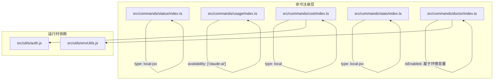
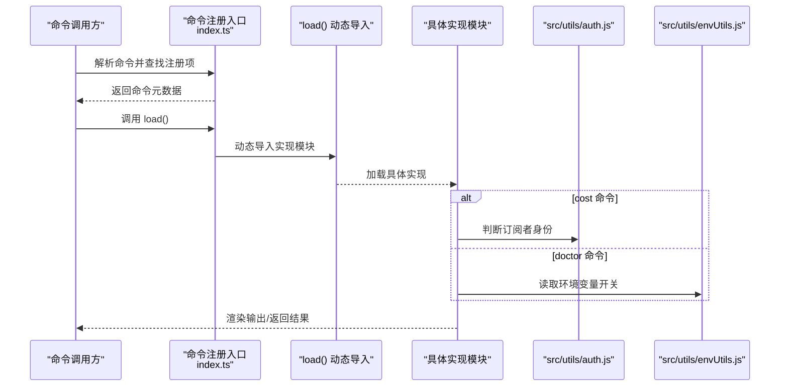
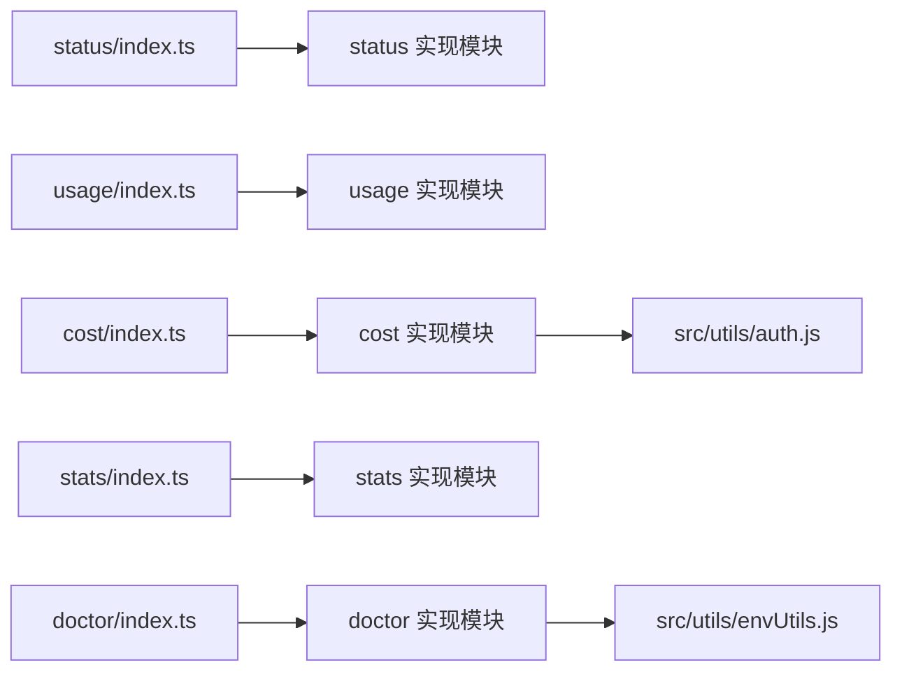

# 系统管理命令

<cite>
**本文引用的文件**
- [src/commands/status/index.ts](file://src/commands/status/index.ts)
- [src/commands/usage/index.ts](file://src/commands/usage/index.ts)
- [src/commands/cost/index.ts](file://src/commands/cost/index.ts)
- [src/commands/stats/index.ts](file://src/commands/stats/index.ts)
- [src/commands/doctor/index.ts](file://src/commands/doctor/index.ts)
- [src/utils/auth.js](file://src/utils/auth.js)
- [src/utils/envUtils.js](file://src/utils/envUtils.js)
</cite>

## 目录
1. [简介](#简介)
2. [项目结构](#项目结构)
3. [核心组件](#核心组件)
4. [架构总览](#架构总览)
5. [详细组件分析](#详细组件分析)
6. [依赖关系分析](#依赖关系分析)
7. [性能考虑](#性能考虑)
8. [故障排查指南](#故障排查指南)
9. [结论](#结论)

## 简介
本文件面向 free-code 项目的系统管理员与高级用户，系统性梳理并解释“系统管理命令”的设计与使用方式，重点覆盖以下五个命令：
- /status：状态检查，用于快速查看版本、模型、账户、API 连通性与工具状态
- /usage：使用统计，展示订阅计划的用量与限额
- /cost：费用跟踪，显示当前会话的总费用与时长
- /stats：性能统计，汇总使用统计与活动信息
- /doctor：诊断工具，对安装与配置进行自检与提示

文档将从命令入口定义、加载机制、可用性控制、输出目标与交互模式等方面进行说明，并给出健康检查、性能优化与资源监控的实践建议。

## 项目结构
这些命令均通过统一的命令注册入口暴露，采用“按需懒加载”的模块化组织方式，以降低启动时的开销。各命令在各自目录下提供 index.ts 入口与对应的实现模块（如 status.js、usage.js 等），并在命令元数据中声明类型、描述、可用平台与加载函数。

**图示来源**
- [src/commands/status/index.ts:1-13](file://src/commands/status/index.ts#L1-L13)
- [src/commands/usage/index.ts:1-10](file://src/commands/usage/index.ts#L1-L10)
- [src/commands/cost/index.ts:1-24](file://src/commands/cost/index.ts#L1-L24)
- [src/commands/stats/index.ts:1-11](file://src/commands/stats/index.ts#L1-L11)
- [src/commands/doctor/index.ts:1-13](file://src/commands/doctor/index.ts#L1-L13)
- [src/utils/auth.js](file://src/utils/auth.js)
- [src/utils/envUtils.js](file://src/utils/envUtils.js)

**章节来源**
- [src/commands/status/index.ts:1-13](file://src/commands/status/index.ts#L1-L13)
- [src/commands/usage/index.ts:1-10](file://src/commands/usage/index.ts#L1-L10)
- [src/commands/cost/index.ts:1-24](file://src/commands/cost/index.ts#L1-L24)
- [src/commands/stats/index.ts:1-11](file://src/commands/stats/index.ts#L1-L11)
- [src/commands/doctor/index.ts:1-13](file://src/commands/doctor/index.ts#L1-L13)

## 核心组件
- 命令入口与元数据：每个命令在独立目录下提供一个 index.ts 文件，导出满足 Command 接口的对象，包含 type、name、description、availability、isEnabled、supportsNonInteractive、load 等字段。
- 懒加载机制：通过 load 函数动态导入对应实现模块，减少启动时的模块解析与初始化成本。
- 可用性与可见性控制：
  - usage 仅在特定平台可用（claude-ai）
  - cost 对订阅者默认隐藏，但可通过环境变量或特殊用户类型调整
  - doctor 受环境变量开关控制启用/禁用
- 输出与交互：
  - status、stats、doctor 为本地 JSX 交互式输出
  - cost 为非交互式输出（支持非交互模式）

**章节来源**
- [src/commands/status/index.ts:3-10](file://src/commands/status/index.ts#L3-L10)
- [src/commands/usage/index.ts:3-9](file://src/commands/usage/index.ts#L3-L9)
- [src/commands/cost/index.ts:8-21](file://src/commands/cost/index.ts#L8-L21)
- [src/commands/stats/index.ts:3-8](file://src/commands/stats/index.ts#L3-L8)
- [src/commands/doctor/index.ts:4-10](file://src/commands/doctor/index.ts#L4-L10)

## 架构总览
下图展示了命令注册、可用性判断与懒加载的整体流程，以及 doctor 与 cost 命令的关键外部依赖。

**图示来源**
- [src/commands/cost/index.ts:6-21](file://src/commands/cost/index.ts#L6-L21)
- [src/commands/doctor/index.ts:2-10](file://src/commands/doctor/index.ts#L2-L10)
- [src/utils/auth.js](file://src/utils/auth.js)
- [src/utils/envUtils.js](file://src/utils/envUtils.js)

## 详细组件分析

### /status（状态检查）
- 命令类型：local-jsx
- 描述：显示 Claude Code 的版本、模型、账户、API 连通性与工具状态
- 启动特性：immediate 为真，表示该命令可立即执行，适合快速状态查询
- 实现要点：
  - 作为 JSX 交互式输出，通常会渲染表格、状态指示器与简要说明
  - 输出应包含版本号、当前模型、登录账户、API 可达性、关键工具可用性等
- 使用场景：
  - 启动后快速确认运行环境是否正常
  - 故障排查时优先执行，定位是版本、模型还是网络/权限问题

**章节来源**
- [src/commands/status/index.ts:3-10](file://src/commands/status/index.ts#L3-L10)

### /usage（使用统计）
- 命令类型：local-jsx
- 平台限制：仅在 claude-ai 平台可用
- 描述：展示订阅计划的用量与限额
- 实现要点：
  - 由于 availability 限定，非 claude-ai 环境不会显示该命令
  - 输出通常包含已用额度、剩余额度、周期时间范围与阈值提醒
- 使用场景：
  - 订阅用户关注配额使用情况，避免超额触发限制
  - 结合阈值设置进行告警与预算控制

**章节来源**
- [src/commands/usage/index.ts:3-9](file://src/commands/usage/index.ts#L3-L9)

### /cost（费用跟踪）
- 命令类型：local
- 描述：显示当前会话的总费用与时长
- 可见性控制：
  - 默认对订阅者隐藏，但当 USER_TYPE 为 ant 时始终可见
  - 通过 isHidden 属性动态决定是否展示
- 非交互模式：支持 supportsNonInteractive，便于脚本化集成
- 实现要点：
  - 与鉴权工具链协作，识别用户类型与订阅状态
  - 输出应包含累计费用、会话时长、计费粒度等
- 使用场景：
  - 企业或团队需要对会话成本进行归集与审计
  - 自动化流水线中记录每次会话的成本

**章节来源**
- [src/commands/cost/index.ts:8-21](file://src/commands/cost/index.ts#L8-L21)
- [src/utils/auth.js](file://src/utils/auth.js)

### /stats（性能统计）
- 命令类型：local-jsx
- 描述：显示你的 Claude Code 使用统计与活动
- 实现要点：
  - 作为 JSX 交互式输出，可能包含图表、趋势与摘要
  - 输出通常涵盖会话次数、平均时长、常用工具、活跃时段等
- 使用场景：
  - 个人或团队进行使用行为分析与效率评估
  - 识别高峰时段与高消耗工具，指导优化

**章节来源**
- [src/commands/stats/index.ts:3-8](file://src/commands/stats/index.ts#L3-L8)

### /doctor（诊断工具）
- 命令类型：local-jsx
- 描述：诊断并验证 Claude Code 安装与设置
- 启用控制：受环境变量 DISABLE_DOCTOR_COMMAND 控制，为真值时禁用
- 实现要点：
  - 读取环境变量进行开关判断
  - 输出通常包含安装路径、配置文件、网络连通性、权限与兼容性检查结果
- 使用场景：
  - 新环境首次部署后的健康检查
  - 升级前后的问题定位与修复建议

**章节来源**
- [src/commands/doctor/index.ts:4-10](file://src/commands/doctor/index.ts#L4-L10)
- [src/utils/envUtils.js](file://src/utils/envUtils.js)

## 依赖关系分析
- 命令注册与加载：
  - 所有命令通过 index.ts 导出统一的 Command 对象，由运行时根据名称解析并调用 load() 进行懒加载
- 可用性与可见性：
  - cost 命令依赖鉴权工具判断订阅者身份，从而决定是否可见
  - doctor 命令依赖环境工具读取开关变量，决定是否启用
- 输出与交互：
  - status、stats、doctor 采用 JSX 交互式输出，适合终端内直接查看
  - cost 采用非交互式输出，便于脚本化与自动化集成

**图示来源**
- [src/commands/status/index.ts:1-13](file://src/commands/status/index.ts#L1-L13)
- [src/commands/usage/index.ts:1-10](file://src/commands/usage/index.ts#L1-L10)
- [src/commands/cost/index.ts:1-24](file://src/commands/cost/index.ts#L1-L24)
- [src/commands/stats/index.ts:1-11](file://src/commands/stats/index.ts#L1-L11)
- [src/commands/doctor/index.ts:1-13](file://src/commands/doctor/index.ts#L1-L13)
- [src/utils/auth.js](file://src/utils/auth.js)
- [src/utils/envUtils.js](file://src/utils/envUtils.js)

## 性能考虑
- 懒加载策略：通过 load() 将实现模块延迟到真正调用时才加载，显著降低启动时的模块解析与初始化开销，尤其适用于大型命令集合
- 交互式输出优化：status、stats、doctor 采用 JSX 渲染，建议在输出前进行数据聚合与缓存，避免重复计算
- 非交互模式：cost 支持非交互输出，适合批处理与定时任务，减少不必要的 UI 渲染
- 可用性过滤：usage 仅在 claude-ai 平台可用，doctor 可通过环境变量禁用，避免在不适用的环境中执行无意义检查

[本节为通用性能建议，无需列出章节来源]

## 故障排查指南
- /status 无法显示 API 连通性
  - 检查网络代理与证书配置
  - 确认账户登录状态与权限
- /usage 不显示或不可用
  - 确认当前运行平台为 claude-ai
  - 检查订阅状态与配额
- /cost 不显示或显示异常
  - 确认 USER_TYPE 是否为 ant（若为 ant 用户则应可见）
  - 检查鉴权工具链是否正确识别订阅者身份
- /stats 数据为空或不更新
  - 确认会话历史与统计功能已启用
  - 检查数据采集与缓存逻辑
- /doctor 未出现或被禁用
  - 检查 DISABLE_DOCTOR_COMMAND 环境变量是否为真值
  - 在开发或调试环境中可临时关闭禁用开关

**章节来源**
- [src/commands/cost/index.ts:12-18](file://src/commands/cost/index.ts#L12-L18)
- [src/commands/doctor/index.ts:7-9](file://src/commands/doctor/index.ts#L7-L9)
- [src/utils/envUtils.js](file://src/utils/envUtils.js)

## 结论
上述五个系统管理命令构成了 free-code 的基础运维与监控体系：/status 提供即时状态概览，/usage 与 /stats 关注用量与行为分析，/cost 聚焦成本归集，/doctor 则负责安装与配置的健康检查。通过懒加载、可用性控制与非交互输出等设计，这些命令在保证用户体验的同时兼顾了性能与可维护性。建议在日常运维中结合阈值设置与定期巡检，确保系统稳定高效运行。