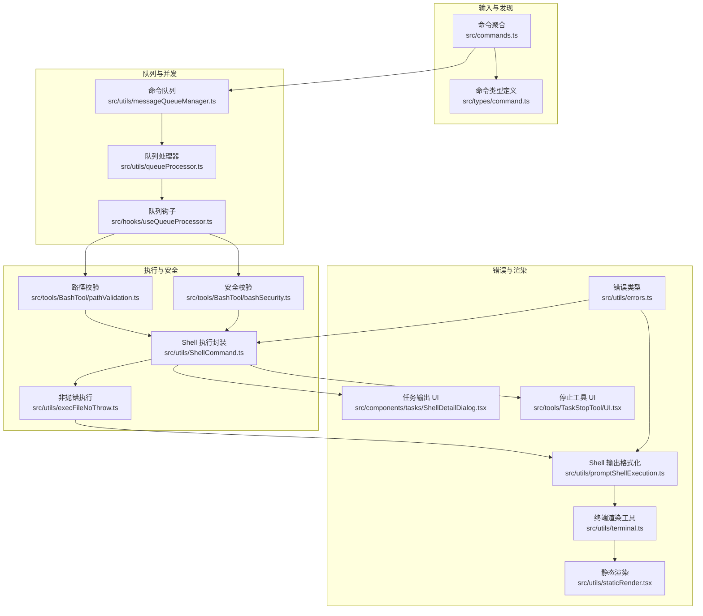
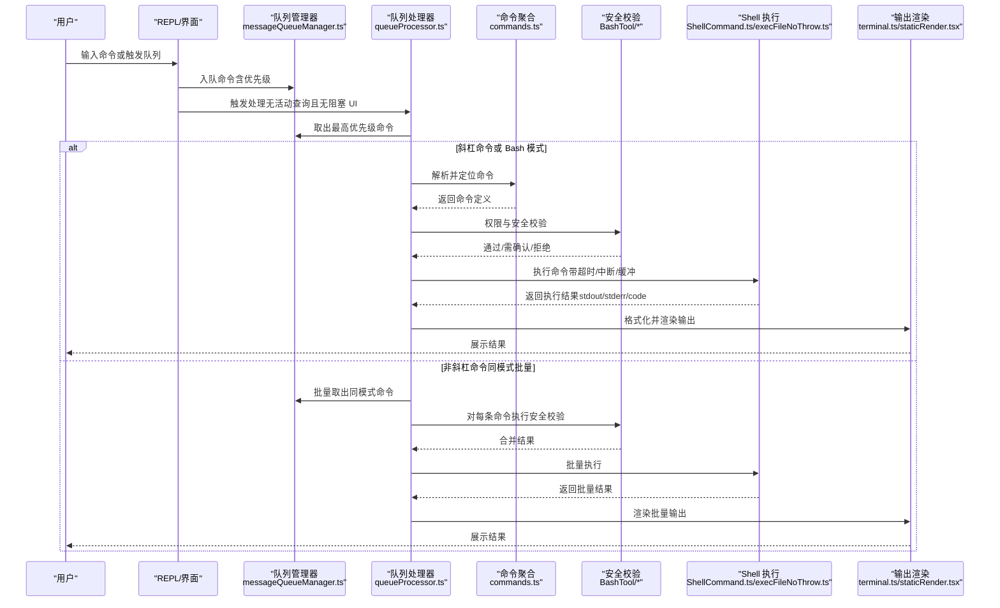
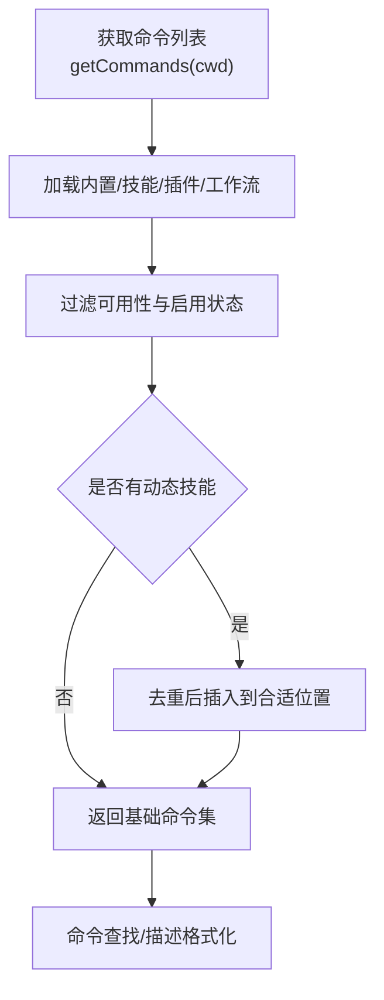
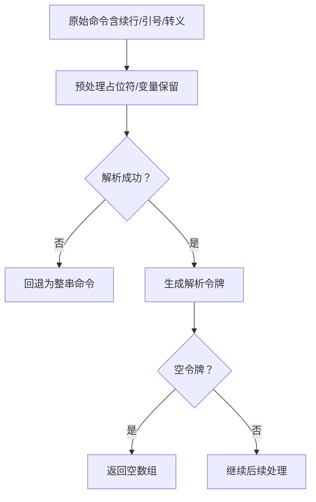
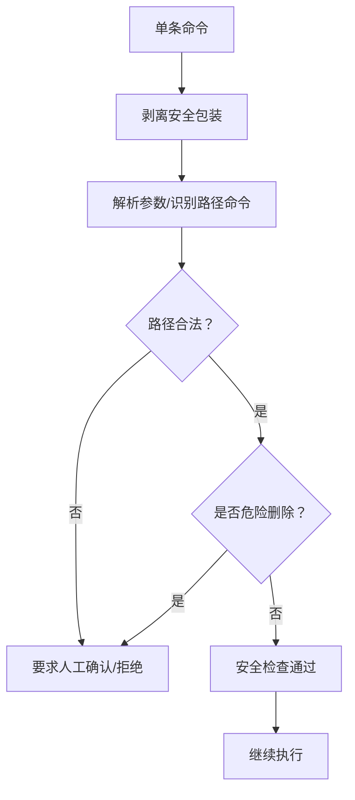
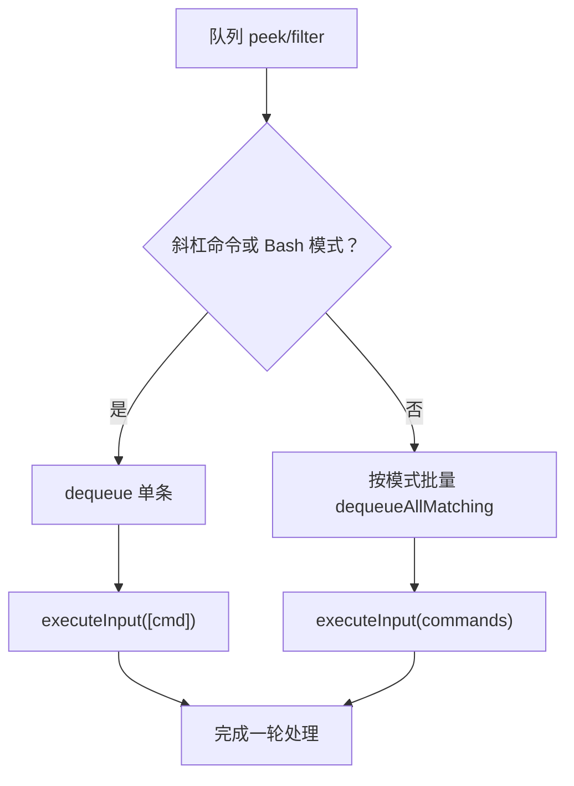
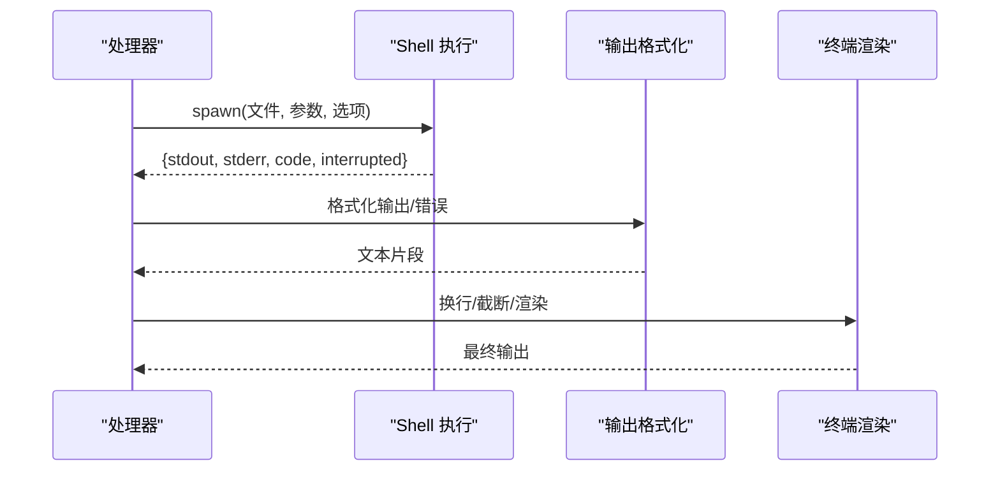
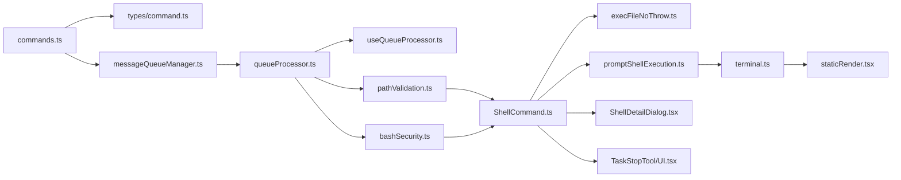

# 命令执行流程

<cite>
**本文引用的文件**
- [src/commands.ts](file://src/commands.ts)
- [src/types/command.ts](file://src/types/command.ts)
- [src/utils/messageQueueManager.ts](file://src/utils/messageQueueManager.ts)
- [src/utils/queueProcessor.ts](file://src/utils/queueProcessor.ts)
- [src/hooks/useQueueProcessor.ts](file://src/hooks/useQueueProcessor.ts)
- [src/tools/BashTool/pathValidation.ts](file://src/tools/BashTool/pathValidation.ts)
- [src/tools/BashTool/bashSecurity.ts](file://src/tools/BashTool/bashSecurity.ts)
- [src/utils/execFileNoThrow.ts](file://src/utils/execFileNoThrow.ts)
- [src/utils/ShellCommand.ts](file://src/utils/ShellCommand.ts)
- [src/utils/errors.ts](file://src/utils/errors.ts)
- [src/utils/promptShellExecution.ts](file://src/utils/promptShellExecution.ts)
- [src/utils/terminal.ts](file://src/utils/terminal.ts)
- [src/utils/staticRender.tsx](file://src/utils/staticRender.tsx)
- [src/components/tasks/ShellDetailDialog.tsx](file://src/components/tasks/ShellDetailDialog.tsx)
- [src/tools/TaskStopTool/UI.tsx](file://src/tools/TaskStopTool/UI.tsx)
</cite>

## 目录
1. [简介](#简介)
2. [项目结构](#项目结构)
3. [核心组件](#核心组件)
4. [架构总览](#架构总览)
5. [详细组件分析](#详细组件分析)
6. [依赖关系分析](#依赖关系分析)
7. [性能考量](#性能考量)
8. [故障排查指南](#故障排查指南)
9. [结论](#结论)
10. [附录](#附录)

## 简介
本文件系统性梳理 free-code 的命令执行流程，覆盖从用户输入到命令执行与结果返回的全链路：输入捕获、语法分析、参数绑定、权限验证、并发控制、错误处理与结果渲染。文档同时解释命令执行上下文、会话状态管理与命令队列处理机制，并提供执行流程图与关键代码示例路径，帮助开发者快速理解并优化命令系统的运行机制。

## 项目结构
围绕命令执行的关键模块分布如下：
- 命令定义与发现：commands.ts 聚合内置与动态命令，过滤可用命令并暴露查询接口
- 命令类型与上下文：types/command.ts 定义命令类型、本地命令上下文与结果渲染选项
- 命令队列与并发：messageQueueManager.ts 提供统一队列；queueProcessor.ts 决定批处理策略；useQueueProcessor.ts 在 UI 层触发处理
- Bash 执行与安全：BashTool 下的 pathValidation.ts 与 bashSecurity.ts 实现路径约束与安全校验；ShellCommand.ts/ execFileNoThrow.ts 提供执行与结果封装
- 错误与输出：errors.ts 统一错误类型；promptShellExecution.ts 格式化 Shell 输出；terminal.ts 与 staticRender.tsx 控制终端渲染

图表来源
- [src/commands.ts:255-346](file://src/commands.ts#L255-L346)
- [src/types/command.ts:16-217](file://src/types/command.ts#L16-L217)
- [src/utils/messageQueueManager.ts:53-149](file://src/utils/messageQueueManager.ts#L53-L149)
- [src/utils/queueProcessor.ts:52-87](file://src/utils/queueProcessor.ts#L52-L87)
- [src/hooks/useQueueProcessor.ts:28-68](file://src/hooks/useQueueProcessor.ts#L28-L68)
- [src/tools/BashTool/pathValidation.ts:1-200](file://src/tools/BashTool/pathValidation.ts#L1-L200)
- [src/tools/BashTool/bashSecurity.ts:1017-2592](file://src/tools/BashTool/bashSecurity.ts#L1017-L2592)
- [src/utils/ShellCommand.ts:275-465](file://src/utils/ShellCommand.ts#L275-L465)
- [src/utils/execFileNoThrow.ts:86-131](file://src/utils/execFileNoThrow.ts#L86-L131)
- [src/utils/errors.ts:1-239](file://src/utils/errors.ts#L1-L239)
- [src/utils/promptShellExecution.ts:164-183](file://src/utils/promptShellExecution.ts#L164-L183)
- [src/utils/terminal.ts:1-42](file://src/utils/terminal.ts#L1-L42)
- [src/utils/staticRender.tsx:93-115](file://src/utils/staticRender.tsx#L93-L115)
- [src/components/tasks/ShellDetailDialog.tsx:222-274](file://src/components/tasks/ShellDetailDialog.tsx#L222-L274)
- [src/tools/TaskStopTool/UI.tsx:1-40](file://src/tools/TaskStopTool/UI.tsx#L1-L40)

章节来源
- [src/commands.ts:255-346](file://src/commands.ts#L255-L346)
- [src/utils/messageQueueManager.ts:53-149](file://src/utils/messageQueueManager.ts#L53-L149)
- [src/utils/queueProcessor.ts:52-87](file://src/utils/queueProcessor.ts#L52-L87)
- [src/hooks/useQueueProcessor.ts:28-68](file://src/hooks/useQueueProcessor.ts#L28-L68)

## 核心组件
- 命令聚合与可用性过滤：commands.ts 负责加载内置/技能/插件/工作流命令，按可用性与启用状态筛选，并提供命令查找与描述格式化等工具函数
- 命令类型与上下文：types/command.ts 定义命令三类形态（prompt/本地/本地 JSX），以及本地命令上下文 LocalJSXCommandContext、结果渲染选项等
- 命令队列与并发控制：messageQueueManager.ts 提供统一队列、优先级与批量操作；queueProcessor.ts 按模式与斜杠命令策略进行批处理；useQueueProcessor.ts 将队列变化与 UI 渲染联动
- Bash 执行与安全：pathValidation.ts 对路径命令进行参数提取与路径合法性校验；bashSecurity.ts 提供多维安全检测与“是否需要人工确认”判定；ShellCommand.ts/execFileNoThrow.ts 提供跨平台执行与结果封装
- 错误与输出：errors.ts 定义统一错误类型；promptShellExecution.ts 将 Shell 输出格式化为可展示文本；terminal.ts/staticRender.tsx 控制终端渲染与宽度换行；ShellDetailDialog.tsx/TaskStopTool/UI.tsx 负责可视化输出与停止提示

章节来源
- [src/commands.ts:476-517](file://src/commands.ts#L476-L517)
- [src/types/command.ts:16-217](file://src/types/command.ts#L16-L217)
- [src/utils/messageQueueManager.ts:53-149](file://src/utils/messageQueueManager.ts#L53-L149)
- [src/utils/queueProcessor.ts:52-87](file://src/utils/queueProcessor.ts#L52-L87)
- [src/hooks/useQueueProcessor.ts:28-68](file://src/hooks/useQueueProcessor.ts#L28-L68)
- [src/tools/BashTool/pathValidation.ts:1-200](file://src/tools/BashTool/pathValidation.ts#L1-L200)
- [src/tools/BashTool/bashSecurity.ts:1017-2592](file://src/tools/BashTool/bashSecurity.ts#L1017-L2592)
- [src/utils/ShellCommand.ts:275-465](file://src/utils/ShellCommand.ts#L275-L465)
- [src/utils/execFileNoThrow.ts:86-131](file://src/utils/execFileNoThrow.ts#L86-L131)
- [src/utils/errors.ts:1-239](file://src/utils/errors.ts#L1-L239)
- [src/utils/promptShellExecution.ts:164-183](file://src/utils/promptShellExecution.ts#L164-L183)
- [src/utils/terminal.ts:1-42](file://src/utils/terminal.ts#L1-L42)
- [src/utils/staticRender.tsx:93-115](file://src/utils/staticRender.tsx#L93-L115)
- [src/components/tasks/ShellDetailDialog.tsx:222-274](file://src/components/tasks/ShellDetailDialog.tsx#L222-L274)
- [src/tools/TaskStopTool/UI.tsx:1-40](file://src/tools/TaskStopTool/UI.tsx#L1-L40)

## 架构总览
下图展示了从用户输入到命令执行与结果返回的整体流程，包括命令解析、参数绑定、权限验证、并发控制、错误处理与结果渲染的关键节点。

图表来源
- [src/utils/messageQueueManager.ts:128-149](file://src/utils/messageQueueManager.ts#L128-L149)
- [src/utils/queueProcessor.ts:52-87](file://src/utils/queueProcessor.ts#L52-L87)
- [src/commands.ts:688-719](file://src/commands.ts#L688-L719)
- [src/tools/BashTool/pathValidation.ts:834-845](file://src/tools/BashTool/pathValidation.ts#L834-L845)
- [src/tools/BashTool/bashSecurity.ts:2571-2592](file://src/tools/BashTool/bashSecurity.ts#L2571-L2592)
- [src/utils/ShellCommand.ts:275-465](file://src/utils/ShellCommand.ts#L275-L465)
- [src/utils/execFileNoThrow.ts:86-131](file://src/utils/execFileNoThrow.ts#L86-L131)
- [src/utils/terminal.ts:1-42](file://src/utils/terminal.ts#L1-L42)
- [src/utils/staticRender.tsx:93-115](file://src/utils/staticRender.tsx#L93-L115)

## 详细组件分析

### 命令解析与调度
- 命令聚合与可用性：commands.ts 通过 memoized 加载器聚合多种来源的命令，按 availability 与 isEnabled 过滤，支持动态技能插入与 MCP 技能筛选
- 命令查找与描述：提供 findCommand/getCommand/formatDescriptionWithSource 等工具，便于 UI 与模型侧使用
- 命令类型与上下文：types/command.ts 定义三类命令形态与本地上下文，支持 JSX 命令延迟加载与结果渲染控制

图表来源
- [src/commands.ts:449-517](file://src/commands.ts#L449-L517)
- [src/commands.ts:688-719](file://src/commands.ts#L688-L719)
- [src/types/command.ts:16-217](file://src/types/command.ts#L16-L217)

章节来源
- [src/commands.ts:449-517](file://src/commands.ts#L449-L517)
- [src/commands.ts:688-719](file://src/commands.ts#L688-L719)
- [src/types/command.ts:16-217](file://src/types/command.ts#L16-L217)

### 参数提取与语法分析
- Bash 语法分析：对包含续行、引号、转义括号等复杂情况的命令进行安全解析，必要时回退为整串字符串以避免中断
- 参数绑定：在安全解析失败时仍保证命令进入权限检查流程，确保不因解析异常而绕过安全

图表来源
- [src/utils/bash/commands.ts:141-168](file://src/utils/bash/commands.ts#L141-L168)

章节来源
- [src/utils/bash/commands.ts:141-168](file://src/utils/bash/commands.ts#L141-L168)

### 权限验证与安全校验
- 路径命令校验：针对 cd/ls/find 等路径命令，提取参数并校验是否位于允许目录内，阻止危险删除路径
- 包装命令剥离：剥离 timeout/nice/nohup/time 等包装命令，确保实际命令被正确校验
- 多维安全检测：检测 IFS 注入、/proc 环境读取等高危模式，必要时要求人工确认

图表来源
- [src/tools/BashTool/pathValidation.ts:834-845](file://src/tools/BashTool/pathValidation.ts#L834-L845)
- [src/tools/BashTool/pathValidation.ts:70-108](file://src/tools/BashTool/pathValidation.ts#L70-L108)
- [src/tools/BashTool/bashSecurity.ts:1017-1036](file://src/tools/BashTool/bashSecurity.ts#L1017-L1036)
- [src/tools/BashTool/bashSecurity.ts:1041-1046](file://src/tools/BashTool/bashSecurity.ts#L1041-L1046)

章节来源
- [src/tools/BashTool/pathValidation.ts:70-108](file://src/tools/BashTool/pathValidation.ts#L70-L108)
- [src/tools/BashTool/pathValidation.ts:834-845](file://src/tools/BashTool/pathValidation.ts#L834-L845)
- [src/tools/BashTool/bashSecurity.ts:1017-1036](file://src/tools/BashTool/bashSecurity.ts#L1017-L1036)
- [src/tools/BashTool/bashSecurity.ts:1041-1046](file://src/tools/BashTool/bashSecurity.ts#L1041-L1046)

### 并发控制与队列处理
- 单队列与优先级：统一队列按 now/next/later 排序，同优先级 FIFO；支持批量取出、过滤与移除
- 处理策略：斜杠命令与 Bash 模式逐条处理以隔离错误与进度；其他命令按模式批量处理
- UI 触发：useQueueProcessor 基于查询守卫与队列快照，在合适时机调用 processQueueIfReady

图表来源
- [src/utils/messageQueueManager.ts:167-193](file://src/utils/messageQueueManager.ts#L167-L193)
- [src/utils/messageQueueManager.ts:244-266](file://src/utils/messageQueueManager.ts#L244-L266)
- [src/utils/queueProcessor.ts:52-87](file://src/utils/queueProcessor.ts#L52-L87)
- [src/hooks/useQueueProcessor.ts:28-68](file://src/hooks/useQueueProcessor.ts#L28-L68)

章节来源
- [src/utils/messageQueueManager.ts:167-193](file://src/utils/messageQueueManager.ts#L167-L193)
- [src/utils/messageQueueManager.ts:244-266](file://src/utils/messageQueueManager.ts#L244-L266)
- [src/utils/queueProcessor.ts:52-87](file://src/utils/queueProcessor.ts#L52-L87)
- [src/hooks/useQueueProcessor.ts:28-68](file://src/hooks/useQueueProcessor.ts#L28-L68)

### 执行与结果返回
- 执行封装：ShellCommand.ts 提供统一状态机与结果封装；execFileNoThrow.ts 提供非抛错执行与超时/缓冲控制
- 输出格式化：promptShellExecution.ts 将 stdout/stderr 格式化为可展示文本；errors.ts 定义 ShellError/MalformedCommandError 等
- 结果渲染：terminal.ts 控制换行与截断；staticRender.tsx 支持静态渲染；ShellDetailDialog.tsx/TaskStopTool/UI.tsx 提供可视化输出与停止提示

图表来源
- [src/utils/ShellCommand.ts:275-465](file://src/utils/ShellCommand.ts#L275-L465)
- [src/utils/execFileNoThrow.ts:86-131](file://src/utils/execFileNoThrow.ts#L86-L131)
- [src/utils/promptShellExecution.ts:164-183](file://src/utils/promptShellExecution.ts#L164-L183)
- [src/utils/terminal.ts:1-42](file://src/utils/terminal.ts#L1-L42)
- [src/utils/staticRender.tsx:93-115](file://src/utils/staticRender.tsx#L93-L115)
- [src/components/tasks/ShellDetailDialog.tsx:222-274](file://src/components/tasks/ShellDetailDialog.tsx#L222-L274)
- [src/tools/TaskStopTool/UI.tsx:23-40](file://src/tools/TaskStopTool/UI.tsx#L23-L40)

章节来源
- [src/utils/ShellCommand.ts:275-465](file://src/utils/ShellCommand.ts#L275-L465)
- [src/utils/execFileNoThrow.ts:86-131](file://src/utils/execFileNoThrow.ts#L86-L131)
- [src/utils/promptShellExecution.ts:164-183](file://src/utils/promptShellExecution.ts#L164-L183)
- [src/utils/terminal.ts:1-42](file://src/utils/terminal.ts#L1-L42)
- [src/utils/staticRender.tsx:93-115](file://src/utils/staticRender.tsx#L93-L115)
- [src/components/tasks/ShellDetailDialog.tsx:222-274](file://src/components/tasks/ShellDetailDialog.tsx#L222-L274)
- [src/tools/TaskStopTool/UI.tsx:23-40](file://src/tools/TaskStopTool/UI.tsx#L23-L40)

## 依赖关系分析
- 命令层：commands.ts 依赖 types/command.ts 与各类加载器（技能/插件/工作流），并通过 availability/isEnabled 控制可见性
- 队列层：messageQueueManager.ts 与 queueProcessor.ts 彼此协作，前者提供数据结构与操作，后者提供处理策略
- 执行层：BashTool 的安全模块与 Shell 执行模块紧密耦合，前者决定是否放行，后者负责最终执行
- 渲染层：terminal.ts 与 staticRender.tsx 为输出层提供通用能力，UI 组件负责具体展示

图表来源
- [src/commands.ts:255-346](file://src/commands.ts#L255-L346)
- [src/types/command.ts:16-217](file://src/types/command.ts#L16-L217)
- [src/utils/messageQueueManager.ts:53-149](file://src/utils/messageQueueManager.ts#L53-L149)
- [src/utils/queueProcessor.ts:52-87](file://src/utils/queueProcessor.ts#L52-L87)
- [src/hooks/useQueueProcessor.ts:28-68](file://src/hooks/useQueueProcessor.ts#L28-L68)
- [src/tools/BashTool/pathValidation.ts:1-200](file://src/tools/BashTool/pathValidation.ts#L1-L200)
- [src/tools/BashTool/bashSecurity.ts:1017-2592](file://src/tools/BashTool/bashSecurity.ts#L1017-L2592)
- [src/utils/ShellCommand.ts:275-465](file://src/utils/ShellCommand.ts#L275-L465)
- [src/utils/execFileNoThrow.ts:86-131](file://src/utils/execFileNoThrow.ts#L86-L131)
- [src/utils/promptShellExecution.ts:164-183](file://src/utils/promptShellExecution.ts#L164-L183)
- [src/utils/terminal.ts:1-42](file://src/utils/terminal.ts#L1-L42)
- [src/utils/staticRender.tsx:93-115](file://src/utils/staticRender.tsx#L93-L115)
- [src/components/tasks/ShellDetailDialog.tsx:222-274](file://src/components/tasks/ShellDetailDialog.tsx#L222-L274)
- [src/tools/TaskStopTool/UI.tsx:1-40](file://src/tools/TaskStopTool/UI.tsx#L1-L40)

章节来源
- [src/commands.ts:255-346](file://src/commands.ts#L255-L346)
- [src/utils/messageQueueManager.ts:53-149](file://src/utils/messageQueueManager.ts#L53-L149)
- [src/utils/queueProcessor.ts:52-87](file://src/utils/queueProcessor.ts#L52-L87)
- [src/hooks/useQueueProcessor.ts:28-68](file://src/hooks/useQueueProcessor.ts#L28-L68)
- [src/tools/BashTool/pathValidation.ts:1-200](file://src/tools/BashTool/pathValidation.ts#L1-L200)
- [src/tools/BashTool/bashSecurity.ts:1017-2592](file://src/tools/BashTool/bashSecurity.ts#L1017-L2592)
- [src/utils/ShellCommand.ts:275-465](file://src/utils/ShellCommand.ts#L275-L465)
- [src/utils/execFileNoThrow.ts:86-131](file://src/utils/execFileNoThrow.ts#L86-L131)
- [src/utils/promptShellExecution.ts:164-183](file://src/utils/promptShellExecution.ts#L164-L183)
- [src/utils/terminal.ts:1-42](file://src/utils/terminal.ts#L1-L42)
- [src/utils/staticRender.tsx:93-115](file://src/utils/staticRender.tsx#L93-L115)
- [src/components/tasks/ShellDetailDialog.tsx:222-274](file://src/components/tasks/ShellDetailDialog.tsx#L222-L274)
- [src/tools/TaskStopTool/UI.tsx:1-40](file://src/tools/TaskStopTool/UI.tsx#L1-L40)

## 性能考量
- 命令加载缓存：commands.ts 使用 memoize 缓存命令加载结果，减少磁盘 I/O 与动态导入开销
- 队列批处理：非斜杠命令按模式批量处理，降低 UI 与模型交互次数
- 渲染优化：terminal.ts 的换行与截断逻辑避免长输出导致的渲染卡顿；staticRender.tsx 在非 TTY 场景下输出首帧内容
- 执行超时与缓冲：execFileNoThrow.ts 提供超时与最大缓冲限制，防止长时间阻塞与内存膨胀

章节来源
- [src/commands.ts:449-469](file://src/commands.ts#L449-L469)
- [src/utils/queueProcessor.ts:76-86](file://src/utils/queueProcessor.ts#L76-L86)
- [src/utils/terminal.ts:19-42](file://src/utils/terminal.ts#L19-L42)
- [src/utils/staticRender.tsx:93-115](file://src/utils/staticRender.tsx#L93-L115)
- [src/utils/execFileNoThrow.ts:86-131](file://src/utils/execFileNoThrow.ts#L86-L131)

## 故障排查指南
- 常见错误类型：errors.ts 定义了 AbortError、ShellError、MalformedCommandError 等，便于区分中断、Shell 失败与命令格式问题
- Shell 输出格式化：promptShellExecution.ts 将 stdout/stderr 格式化为可读文本，便于日志与 UI 展示
- 文件系统错误分类：isFsInaccessible 用于区分“文件不存在/无权限/不可达”等预期错误与异常
- 中断与超时：ShellCommand.ts 的 interrupted 字段与 SIGKILL 判断有助于识别命令被中止的情况

章节来源
- [src/utils/errors.ts:1-239](file://src/utils/errors.ts#L1-L239)
- [src/utils/promptShellExecution.ts:164-183](file://src/utils/promptShellExecution.ts#L164-L183)
- [src/utils/ShellCommand.ts:291-316](file://src/utils/ShellCommand.ts#L291-L316)

## 结论
free-code 的命令执行流程通过“统一队列 + 分类处理 + 安全校验 + 执行封装 + 渲染输出”的架构实现了高可靠性与可扩展性。命令聚合与可用性过滤确保 UI 与模型侧仅看到合适的命令；队列与并发控制保障了交互流畅与资源隔离；Bash 安全模块与执行封装提供了强健的边界保护；错误与渲染工具则提升了可观测性与用户体验。建议在新增命令时遵循现有类型与上下文约定，充分利用队列批处理与安全校验机制，以获得最佳性能与安全性。

## 附录
- 关键代码示例路径（不含具体代码内容）：
  - 命令聚合与可用性过滤：[src/commands.ts:449-517](file://src/commands.ts#L449-L517)
  - 命令类型与上下文定义：[src/types/command.ts:16-217](file://src/types/command.ts#L16-L217)
  - 命令队列入队与优先级：[src/utils/messageQueueManager.ts:128-149](file://src/utils/messageQueueManager.ts#L128-L149)
  - 队列处理器逐条与批量策略：[src/utils/queueProcessor.ts:52-87](file://src/utils/queueProcessor.ts#L52-L87)
  - UI 触发队列处理：[src/hooks/useQueueProcessor.ts:28-68](file://src/hooks/useQueueProcessor.ts#L28-L68)
  - 路径命令参数提取与危险路径检测：[src/tools/BashTool/pathValidation.ts:70-108](file://src/tools/BashTool/pathValidation.ts#L70-L108)
  - 包装命令剥离与安全检查：[src/tools/BashTool/pathValidation.ts:834-845](file://src/tools/BashTool/pathValidation.ts#L834-L845)、[src/tools/BashTool/bashSecurity.ts:1017-1036](file://src/tools/BashTool/bashSecurity.ts#L1017-L1036)
  - Shell 执行封装与非抛错执行：[src/utils/ShellCommand.ts:275-465](file://src/utils/ShellCommand.ts#L275-L465)、[src/utils/execFileNoThrow.ts:86-131](file://src/utils/execFileNoThrow.ts#L86-L131)
  - 输出格式化与终端渲染：[src/utils/promptShellExecution.ts:164-183](file://src/utils/promptShellExecution.ts#L164-L183)、[src/utils/terminal.ts:1-42](file://src/utils/terminal.ts#L1-L42)
  - 静态渲染与可视化输出：[src/utils/staticRender.tsx:93-115](file://src/utils/staticRender.tsx#L93-L115)、[src/components/tasks/ShellDetailDialog.tsx:222-274](file://src/components/tasks/ShellDetailDialog.tsx#L222-L274)、[src/tools/TaskStopTool/UI.tsx:23-40](file://src/tools/TaskStopTool/UI.tsx#L23-L40)