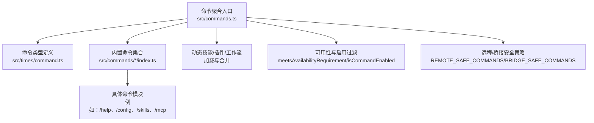
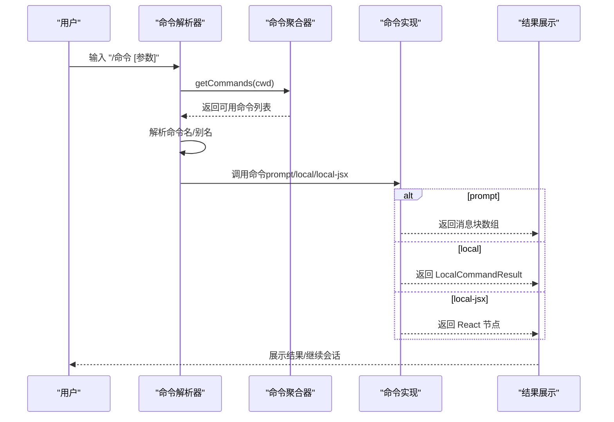
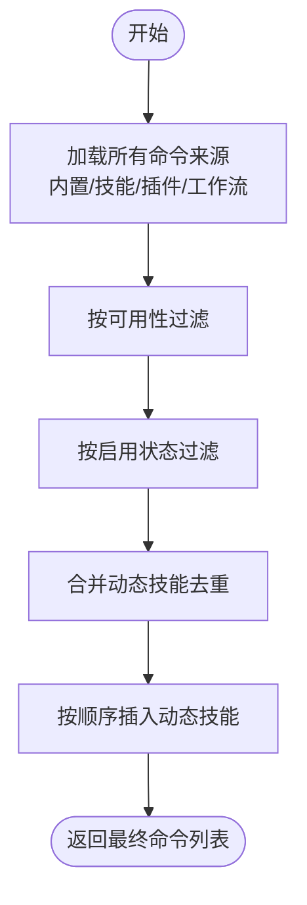
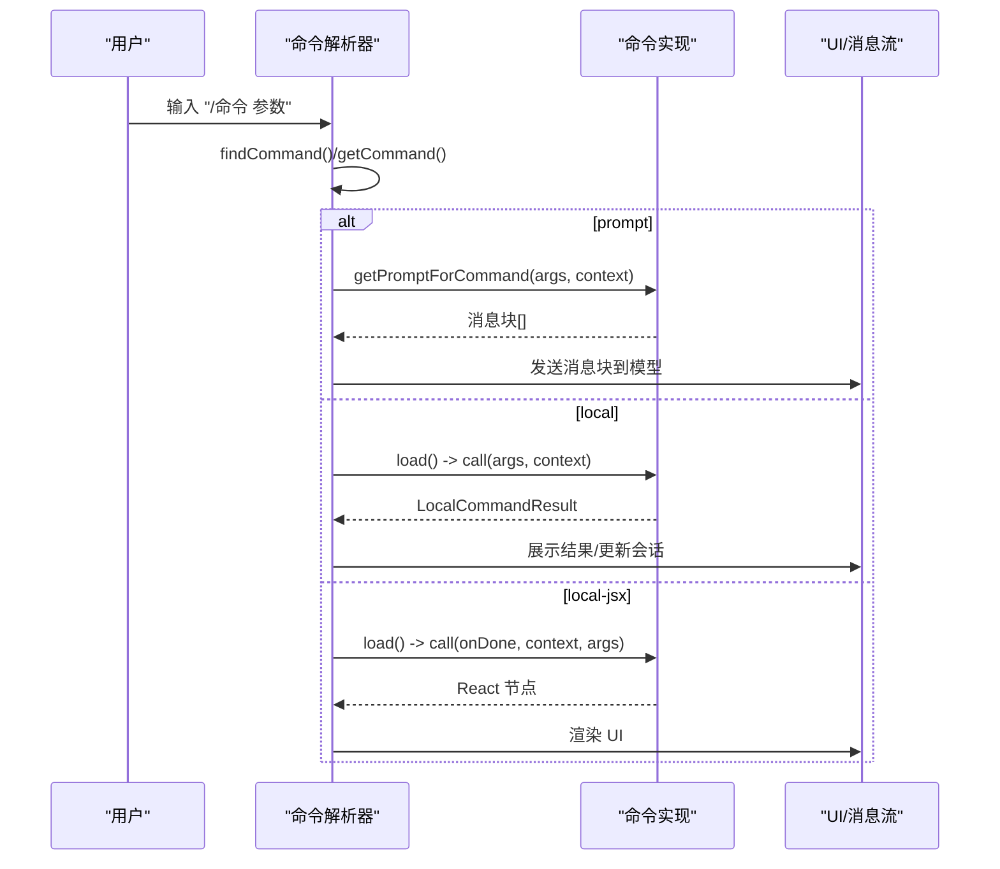
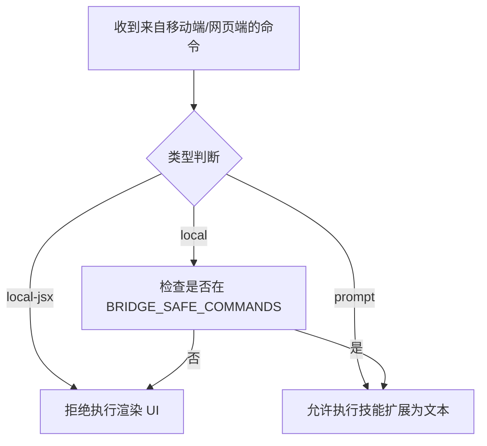
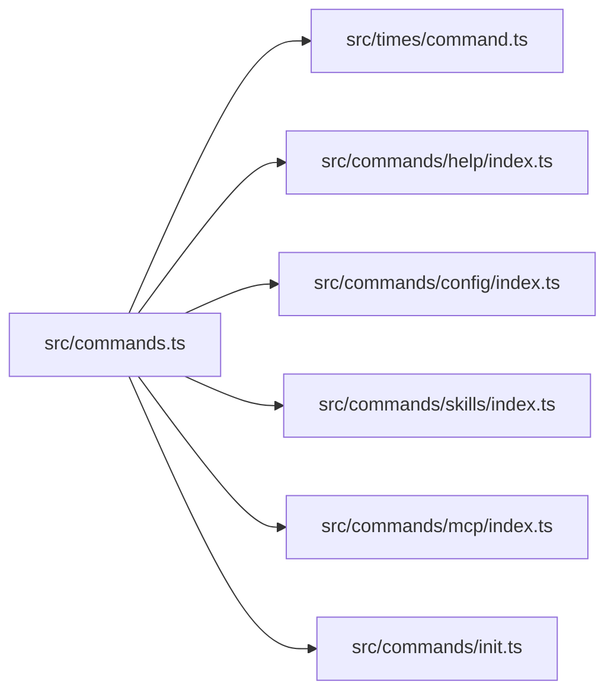

# 命令系统

<cite>
**本文引用的文件**
- [src/commands.ts](file://src/commands.ts)
- [src/commands/init.ts](file://src/commands/init.ts)
- [src/times/command.ts](file://src/times/command.ts)
- [src/commands/help/index.ts](file://src/commands/help/index.ts)
- [src/commands/config/index.ts](file://src/commands/config/index.ts)
- [src/commands/skills/index.ts](file://src/commands/skills/index.ts)
- [src/commands/mcp/index.ts](file://src/commands/mcp/index.ts)
</cite>

## 目录
1. [简介](#简介)
2. [项目结构](#项目结构)
3. [核心组件](#核心组件)
4. [架构总览](#架构总览)
5. [详细组件分析](#详细组件分析)
6. [依赖分析](#依赖分析)
7. [性能考虑](#性能考虑)
8. [故障排查指南](#故障排查指南)
9. [结论](#结论)
10. [附录：内置命令参考](#附录内置命令参考)

## 简介
本文件系统性阐述 free-code 的“斜杠命令”（/slash）命令系统的设计理念与实现机制，覆盖命令注册、解析与执行的全链路；给出内置命令的完整参考清单（含 /help、/config、/skills、/plugin、/mcp、/ide、/voice、/bridge 等），并提供自定义命令开发指南（命令定义、参数处理、权限控制）。同时解释命令系统与“工具系统”的区别与关系，并通过图示与路径指引帮助初学者建立概念理解，为有经验的开发者提供技术细节。

## 项目结构
命令系统的核心由以下部分组成：
- 命令类型与契约：统一的 Command 类型定义，涵盖 prompt、local、local-jsx 三类命令形态。
- 命令注册与聚合：集中导出与聚合所有内置命令、技能、插件技能、工作流命令等。
- 命令可用性与可见性：按用户身份、提供商环境、特性开关、启用状态进行过滤。
- 命令查找与调用：提供名称/别名查找、结果展示策略、远程/桥接安全策略等。

图表来源
- [src/commands.ts:255-346](file://src/commands.ts#L255-L346)
- [src/times/command.ts:175-206](file://src/times/command.ts#L175-L206)
- [src/commands/help/index.ts:1-11](file://src/commands/help/index.ts#L1-L11)
- [src/commands/config/index.ts:1-12](file://src/commands/config/index.ts#L1-L12)
- [src/commands/skills/index.ts:1-11](file://src/commands/skills/index.ts#L1-L11)
- [src/commands/mcp/index.ts:1-13](file://src/commands/mcp/index.ts#L1-L13)

章节来源
- [src/commands.ts:255-346](file://src/commands.ts#L255-L346)
- [src/times/command.ts:175-206](file://src/times/command.ts#L175-L206)

## 核心组件
- 命令类型与结果
  - Prompt 命令：面向模型的提示型命令，支持内容长度估算、进度消息、工具限制、上下文 fork 等。
  - Local 命令：本地执行命令，延迟加载，返回文本或紧凑化结果。
  - Local JSX 命令：渲染 UI 的本地命令，延迟加载，适合复杂交互。
- 命令元数据
  - 可用性（availability）：按 claude.ai 订阅者或 Console 直连用户过滤。
  - 启用状态（isEnabled）：受特性开关、环境变量等影响。
  - 别名（aliases）、隐藏（isHidden）、敏感参数（isSensitive）、即时执行（immediate）等。
- 结果展示策略
  - LocalCommandResult 支持 text、compact、skip 三种输出。
  - LocalJSXCommandOnDone 提供显示方式、是否继续对话、插入 meta 消息等选项。

章节来源
- [src/times/command.ts:16-24](file://src/times/command.ts#L16-L24)
- [src/times/command.ts:25-57](file://src/times/command.ts#L25-L57)
- [src/times/command.ts:74-78](file://src/times/command.ts#L74-L78)
- [src/times/command.ts:106-126](file://src/times/command.ts#L106-L126)
- [src/times/command.ts:175-203](file://src/times/command.ts#L175-L203)

## 架构总览
命令系统采用“声明式注册 + 动态聚合 + 运行时过滤”的架构：
- 声明式注册：每个命令在各自目录下以 index.ts 定义 Command 元信息与加载策略。
- 动态聚合：在运行时聚合内置命令、技能、插件技能、工作流命令，并按缓存策略避免重复 I/O。
- 运行时过滤：根据可用性、启用状态、远程/桥接安全策略生成最终可用命令集。
- 执行路径：解析命令名/别名 -> 查找命令 -> 根据类型执行（prompt 展开为消息、local 调用、local-jsx 渲染 UI）。

图表来源
- [src/commands.ts:476-517](file://src/commands.ts#L476-L517)
- [src/times/command.ts:53-56](file://src/times/command.ts#L53-L56)
- [src/times/command.ts:62-65](file://src/times/command.ts#L62-L65)
- [src/times/command.ts:131-135](file://src/times/command.ts#L131-L135)

## 详细组件分析

### 命令注册与聚合
- 内置命令注册
  - 通过集中导出文件将各命令模块导入并加入 COMMANDS 数组，支持条件特性开关与平台差异。
  - 内部仅命令（INTERNAL_ONLY_COMMANDS）仅在特定环境可见。
- 动态来源
  - 技能目录命令、插件技能、内置插件技能、工作流命令均在运行时异步加载并合并。
- 可用性与启用过滤
  - meetsAvailabilityRequirement 按 provider/订阅者身份过滤。
  - isCommandEnabled 依据命令自身 isEnabled 或默认 true。
- 动态技能注入
  - 在基础命令后插入未重复的动态技能，保持顺序：技能 -> 工作流 -> 插件 -> 内置命令。
- 缓存与失效
  - loadAllCommands、getSkillToolCommands、getSlashCommandToolSkills 使用 memoize 缓存，支持显式清理。

图表来源
- [src/commands.ts:449-469](file://src/commands.ts#L449-L469)
- [src/commands.ts:483-517](file://src/commands.ts#L483-L517)
- [src/commands.ts:417-443](file://src/commands.ts#L417-L443)
- [src/commands.ts:214-222](file://src/commands.ts#L214-L222)

章节来源
- [src/commands.ts:255-346](file://src/commands.ts#L255-L346)
- [src/commands.ts:417-443](file://src/commands.ts#L417-L443)
- [src/commands.ts:449-469](file://src/commands.ts#L449-L469)
- [src/commands.ts:476-517](file://src/commands.ts#L476-L517)

### 命令查找与调用
- 查找逻辑
  - 支持精确名、用户可见名、别名匹配。
- 调用类型
  - Prompt 命令：通过 getPromptForCommand(args, context) 返回消息块，用于扩展到模型输入。
  - Local 命令：通过 load() 延迟加载实现，返回文本或紧凑化结果。
  - Local JSX 命令：通过 load() 延迟加载实现，返回 React 节点，适合复杂 UI。
- 结果展示
  - LocalJSXCommandOnDone 支持 skip/system/user 三种展示策略，以及是否继续对话、插入 meta 消息等。

图表来源
- [src/commands.ts:688-719](file://src/commands.ts#L688-L719)
- [src/times/command.ts:53-56](file://src/times/command.ts#L53-L56)
- [src/times/command.ts:70-72](file://src/times/command.ts#L70-L72)
- [src/times/command.ts:131-135](file://src/times/command.ts#L131-L135)

章节来源
- [src/commands.ts:688-719](file://src/commands.ts#L688-L719)
- [src/times/command.ts:53-56](file://src/times/command.ts#L53-L56)
- [src/times/command.ts:70-72](file://src/times/command.ts#L70-L72)
- [src/times/command.ts:131-135](file://src/times/command.ts#L131-L135)

### 远程/桥接安全策略
- 远程安全命令（REMOTE_SAFE_COMMANDS）
  - 仅限本地状态变更、不依赖本地文件系统/IDE/MCP 等的命令。
- 桥接安全命令（BRIDGE_SAFE_COMMANDS）
  - 仅允许 prompt 命令（技能）与明确列入的 local 命令；local-jsx 命令一律禁止。
- isBridgeSafeCommand 统一判定入口。

图表来源
- [src/commands.ts:619-676](file://src/commands.ts#L619-L676)

章节来源
- [src/commands.ts:619-676](file://src/commands.ts#L619-L676)

### 自定义命令开发指南
- 命令定义
  - 在命令目录新建 index.ts，导出一个满足 Command 接口的对象，指定 type、name、description、load 等。
  - 若为 prompt 命令，需实现 getPromptForCommand(args, context)。
  - 若为 local 命令，需实现 load() 返回包含 call(args, context) 的模块。
  - 若为 local-jsx 命令，需实现 load() 返回包含 call(onDone, context, args) 的模块。
- 参数处理
  - args 字符串传入，可在实现中自行解析；可结合 argumentHint 提示用户。
  - 对敏感参数设置 isSensitive，避免记录到会话历史。
- 权限控制
  - availability：限定 claude-ai 或 console 用户可见。
  - isEnabled：按特性开关/环境变量动态启用。
  - disableModelInvocation：禁止模型自动调用该技能。
- 与工具系统的区别与关系
  - 命令（Command）：面向用户交互与会话控制，可渲染 UI、可扩展到模型、可远程执行。
  - 工具（Tool）：面向模型执行的具体能力（如 Bash、WebSearch 等），通常不可见于命令列表，但可被技能/命令组合使用。
  - 关系：命令可组合工具，技能可作为 prompt 命令被模型调用，二者共同构成“可执行的知识”。

章节来源
- [src/times/command.ts:25-57](file://src/times/command.ts#L25-L57)
- [src/times/command.ts:74-78](file://src/times/command.ts#L74-L78)
- [src/times/command.ts:144-152](file://src/times/command.ts#L144-L152)
- [src/times/command.ts:175-203](file://src/times/command.ts#L175-L203)

## 依赖分析
- 命令聚合对各子模块的依赖
  - 内置命令：通过集中导出文件统一注册。
  - 动态来源：技能目录、插件、工作流命令异步加载。
  - 类型约束：严格依赖 Command 类型定义。
- 运行时耦合
  - 可用性与启用过滤在每次查询时重新计算，确保登录状态变化后即时生效。
  - 缓存层避免重复磁盘 I/O 与动态导入成本。

图表来源
- [src/commands.ts:255-346](file://src/commands.ts#L255-L346)
- [src/times/command.ts:175-206](file://src/times/command.ts#L175-L206)
- [src/commands/help/index.ts:1-11](file://src/commands/help/index.ts#L1-L11)
- [src/commands/config/index.ts:1-12](file://src/commands/config/index.ts#L1-L12)
- [src/commands/skills/index.ts:1-11](file://src/commands/skills/index.ts#L1-L11)
- [src/commands/mcp/index.ts:1-13](file://src/commands/mcp/index.ts#L1-L13)
- [src/commands/init.ts:226-257](file://src/commands/init.ts#L226-L257)

章节来源
- [src/commands.ts:255-346](file://src/commands.ts#L255-L346)
- [src/commands/init.ts:226-257](file://src/commands/init.ts#L226-L257)

## 性能考虑
- 懒加载与延迟初始化
  - local-jsx 命令通过 load() 延迟加载，减少启动时内存占用。
- 缓存策略
  - loadAllCommands、getSkillToolCommands、getSlashCommandToolSkills 使用 memoize，按 cwd 缓存，显著降低重复加载成本。
- 并发加载
  - 技能、插件、工作流命令通过 Promise.all 并发加载，缩短首屏可用时间。
- 过滤与排序
  - 可用性与启用状态在每次 getCommands 调用时重新评估，避免缓存陈旧导致的不可用命令暴露。

## 故障排查指南
- 命令找不到
  - 使用 getCommand(name, commands) 会抛出异常，异常信息包含可用命令列表（含别名），便于核对拼写。
- 命令不可见
  - 检查 availability 是否与当前用户身份匹配；检查 isEnabled 是否启用；检查 isHidden 是否隐藏。
- 远程/桥接不可用
  - 确认命令类型与安全策略：local-jsx 命令一律不可用；prompt 命令可用；local 命令需在 BRIDGE_SAFE_COMMANDS 中。
- 动态技能未出现
  - 确认动态技能未与内置命令重名；检查 meetsAvailabilityRequirement 与 isCommandEnabled；必要时清理缓存并重试。

章节来源
- [src/commands.ts:704-719](file://src/commands.ts#L704-L719)
- [src/commands.ts:417-443](file://src/commands.ts#L417-L443)
- [src/commands.ts:619-676](file://src/commands.ts#L619-L676)

## 结论
free-code 的命令系统以“声明式注册 + 动态聚合 + 运行时过滤”为核心，兼顾灵活性与性能。通过清晰的类型定义与安全策略，既保证了命令的易扩展性，也确保了在远程/桥接场景下的可控执行。与工具系统的边界清晰：命令面向用户交互与会话控制，工具面向模型执行的具体能力，二者协同构建完整的智能体执行面。

## 附录：内置命令参考
以下为常用内置命令的简要说明与典型用途（以命令名/别名呈现）。更详细的参数与行为请参考对应命令模块的实现与类型定义。

- /help
  - 类型：local-jsx
  - 用途：展示帮助与可用命令列表。
  - 参考路径：[src/commands/help/index.ts:1-11](file://src/commands/help/index.ts#L1-L11)

- /config（别名：settings）
  - 类型：local-jsx
  - 用途：打开配置面板。
  - 参考路径：[src/commands/config/index.ts:1-12](file://src/commands/config/index.ts#L1-L12)

- /skills
  - 类型：local-jsx
  - 用途：列出可用技能。
  - 参考路径：[src/commands/skills/index.ts:1-11](file://src/commands/skills/index.ts#L1-L11)

- /mcp
  - 类型：local-jsx
  - 用途：管理 MCP 服务器（支持 enable/disable 子命令与服务器名参数）。
  - 参考路径：[src/commands/mcp/index.ts:1-13](file://src/commands/mcp/index.ts#L1-L13)

- /plugin
  - 类型：local-jsx
  - 用途：插件管理（安装、卸载、刷新等）。
  - 参考路径：[src/commands/plugin/index.tsx](file://src/commands/plugin/index.tsx)

- /ide
  - 类型：local-jsx
  - 用途：IDE 集成与状态管理。
  - 参考路径：[src/commands/ide/index.js](file://src/commands/ide/index.js)

- /voice
  - 类型：local-jsx
  - 用途：语音相关功能（如语音输入、状态切换）。
  - 参考路径：[src/commands/voice/index.js](file://src/commands/voice/index.js)

- /bridge
  - 类型：local-jsx
  - 用途：桥接控制（远程/移动端连接、状态管理）。
  - 参考路径：[src/commands/bridge/index.js](file://src/commands/bridge/index.js)

- /init
  - 类型：prompt
  - 用途：初始化 CLAUDE.md、技能与钩子，引导新项目上手。
  - 参考路径：[src/commands/init.ts:226-257](file://src/commands/init.ts#L226-L257)

- 其他常用命令
  - /clear、/theme、/copy、/cost、/usage、/files、/status、/tasks、/sessions 等，均为 local-jsx 或 prompt 命令，用于界面控制、状态查看与任务管理。

章节来源
- [src/commands/help/index.ts:1-11](file://src/commands/help/index.ts#L1-L11)
- [src/commands/config/index.ts:1-12](file://src/commands/config/index.ts#L1-L12)
- [src/commands/skills/index.ts:1-11](file://src/commands/skills/index.ts#L1-L11)
- [src/commands/mcp/index.ts:1-13](file://src/commands/mcp/index.ts#L1-L13)
- [src/commands/init.ts:226-257](file://src/commands/init.ts#L226-L257)