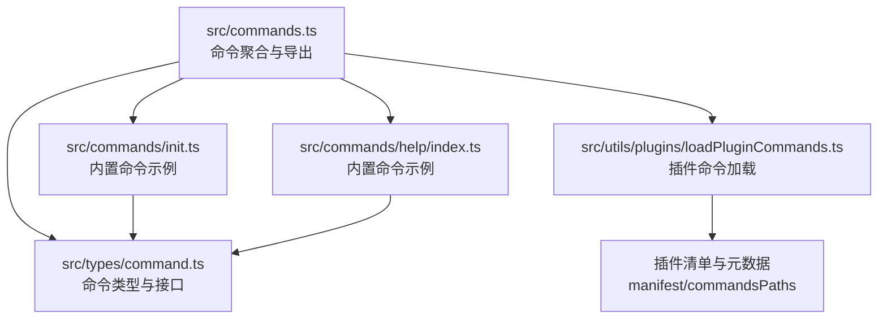
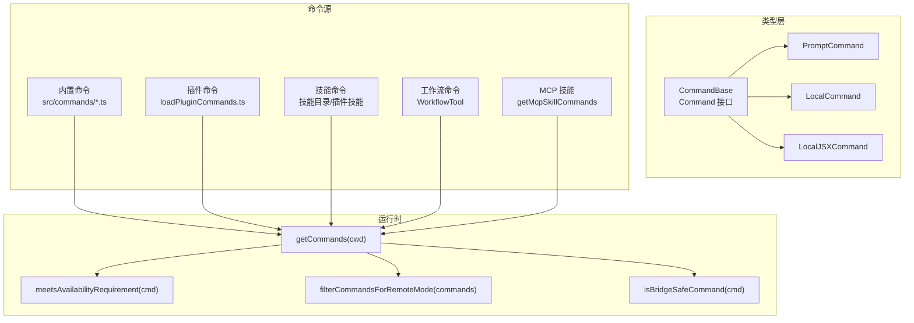
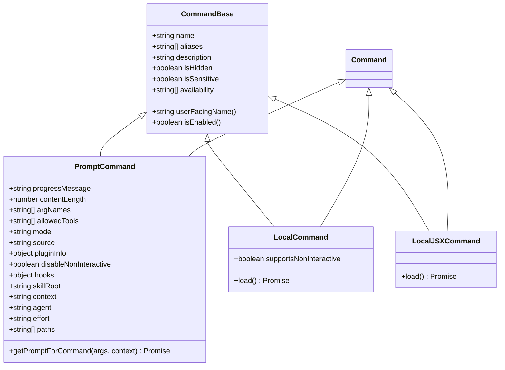
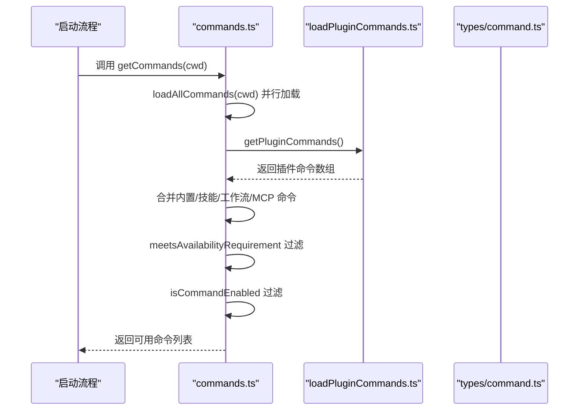
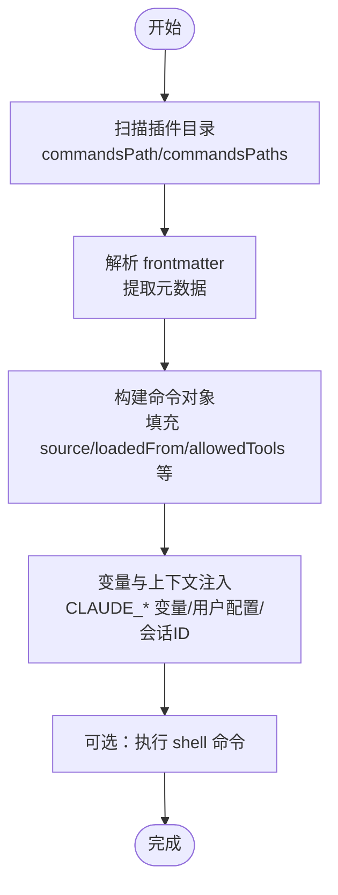
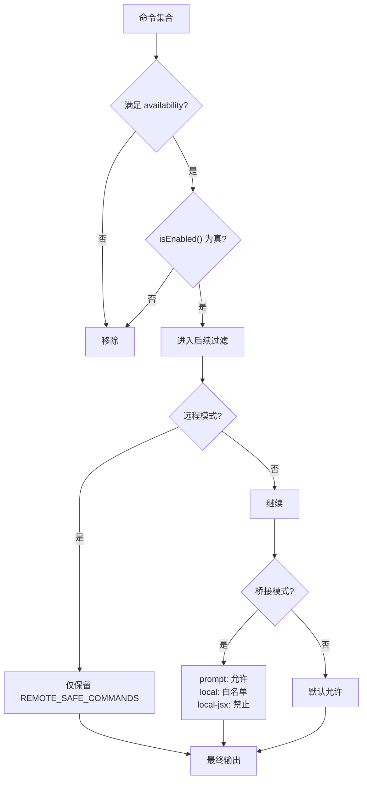
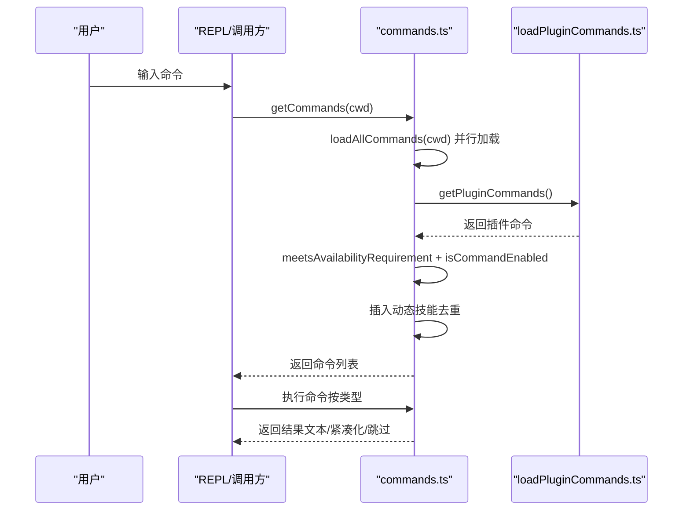
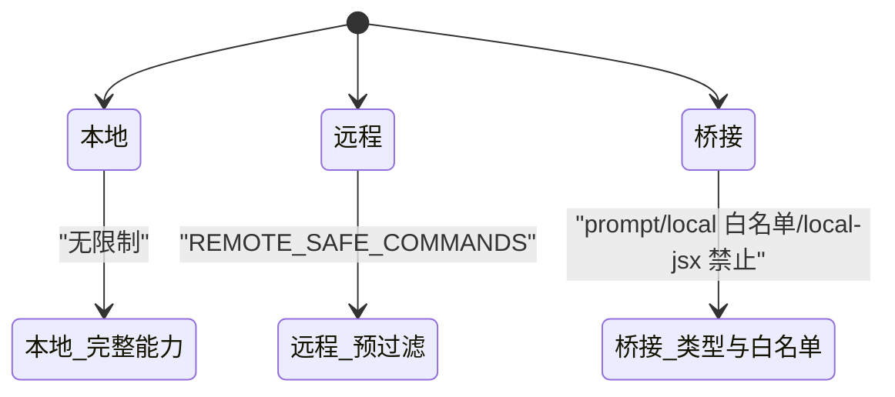
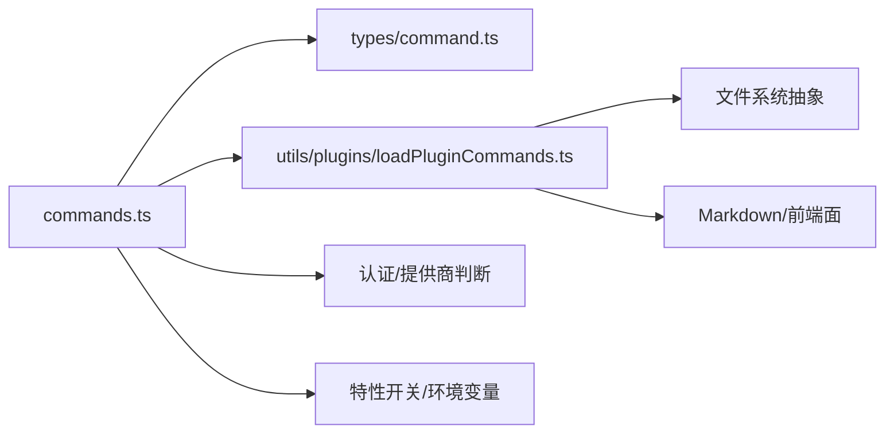

# 命令系统架构

<cite>
**本文引用的文件**
- [src/commands.ts](file://src/commands.ts)
- [src/types/command.ts](file://src/types/command.ts)
- [src/commands/init.ts](file://src/commands/init.ts)
- [src/commands/help/index.ts](file://src/commands/help/index.ts)
- [src/utils/plugins/loadPluginCommands.ts](file://src/utils/plugins/loadPluginCommands.ts)
</cite>

## 目录
1. [引言](#引言)
2. [项目结构](#项目结构)
3. [核心组件](#核心组件)
4. [架构总览](#架构总览)
5. [详细组件分析](#详细组件分析)
6. [依赖分析](#依赖分析)
7. [性能考量](#性能考量)
8. [故障排查指南](#故障排查指南)
9. [结论](#结论)
10. [附录](#附录)

## 引言
本文件系统性阐述 free-code 的命令系统架构，围绕以下目标展开：命令系统的设计理念与核心架构模式；命令注册机制、命令发现与加载流程；命令过滤与权限控制；命令类型系统（prompt、local、local-jsx）；命令生命周期管理与动态命令加载；命令与工具系统的区别与关系；不同运行模式（本地、远程、桥接）下的行为差异。文档通过多类图示与代码路径引用，帮助开发者快速理解命令系统的内部工作机制。

## 项目结构
命令系统的核心由“命令定义与聚合”“类型与接口”“插件命令加载”“内置命令示例”等模块构成。下图给出与命令系统直接相关的模块关系概览：

**图示来源**
- [src/commands.ts:1-755](file://src/commands.ts#L1-L755)
- [src/types/command.ts:1-217](file://src/types/command.ts#L1-L217)
- [src/utils/plugins/loadPluginCommands.ts:1-800](file://src/utils/plugins/loadPluginCommands.ts#L1-L800)
- [src/commands/init.ts:1-257](file://src/commands/init.ts#L1-L257)
- [src/commands/help/index.ts:1-11](file://src/commands/help/index.ts#L1-L11)

**章节来源**
- [src/commands.ts:1-755](file://src/commands.ts#L1-L755)
- [src/types/command.ts:1-217](file://src/types/command.ts#L1-L217)
- [src/utils/plugins/loadPluginCommands.ts:1-800](file://src/utils/plugins/loadPluginCommands.ts#L1-L800)
- [src/commands/init.ts:1-257](file://src/commands/init.ts#L1-L257)
- [src/commands/help/index.ts:1-11](file://src/commands/help/index.ts#L1-L11)

## 核心组件
- 命令类型系统与接口
  - 命令基础字段与可用性声明：名称、别名、描述、可用性（按认证/提供商环境）、启用状态、是否隐藏、是否敏感参数、用户可见名等。
  - 三类命令形态：
    - prompt 命令：面向模型的提示型命令，包含内容长度、进度消息、可选允许工具列表、上下文执行策略（内联/分叉）、代理类型、努力值、路径匹配、动态生成提示内容的能力。
    - local 命令：本地执行命令，支持非交互调用，延迟加载实现模块，返回文本或紧凑化结果。
    - local-jsx 命令：本地渲染 JSX 的命令，延迟加载，用于终端 UI 交互。
  - 参考路径：[命令类型与接口:16-217](file://src/types/command.ts#L16-L217)

- 命令聚合与导出
  - 统一导出命令集合、内置命令名集合、命令查找与存在性判断、描述格式化、远程/桥接安全命令集合与过滤器等。
  - 参考路径：[命令聚合与导出:255-755](file://src/commands.ts#L255-L755)

- 插件命令加载
  - 从插件目录解析 Markdown 文件，提取 frontmatter 元数据，构建命令对象；支持技能目录、自定义命令路径、内联内容、变量替换、会话 ID 注入、shell 执行等。
  - 参考路径：[插件命令加载:1-800](file://src/utils/plugins/loadPluginCommands.ts#L1-L800)

- 内置命令示例
  - init 命令：根据特性开关选择新旧初始化流程，动态返回提示内容。
  - help 命令：本地 JSX 命令，延迟加载帮助界面。
  - 参考路径：
    - [内置命令 init:226-257](file://src/commands/init.ts#L226-L257)
    - [内置命令 help:3-11](file://src/commands/help/index.ts#L3-L11)

**章节来源**
- [src/types/command.ts:16-217](file://src/types/command.ts#L16-L217)
- [src/commands.ts:255-755](file://src/commands.ts#L255-L755)
- [src/utils/plugins/loadPluginCommands.ts:1-800](file://src/utils/plugins/loadPluginCommands.ts#L1-L800)
- [src/commands/init.ts:226-257](file://src/commands/init.ts#L226-L257)
- [src/commands/help/index.ts:3-11](file://src/commands/help/index.ts#L3-L11)

## 架构总览
命令系统采用“类型中心 + 动态聚合 + 条件加载”的架构模式：
- 类型中心：统一的命令接口与类型约束，确保所有命令形态一致对外。
- 动态聚合：内置命令、插件命令、技能命令、工作流命令、MCP 技能等多源聚合，按需组合。
- 条件加载：基于特性开关、环境变量、认证状态、功能标志进行条件导入与启用。
- 安全过滤：针对远程/桥接模式提供显式白名单与类型级限制，保障跨端安全。

**图示来源**
- [src/types/command.ts:16-217](file://src/types/command.ts#L16-L217)
- [src/commands.ts:476-686](file://src/commands.ts#L476-L686)
- [src/utils/plugins/loadPluginCommands.ts:414-677](file://src/utils/plugins/loadPluginCommands.ts#L414-L677)

**章节来源**
- [src/types/command.ts:16-217](file://src/types/command.ts#L16-L217)
- [src/commands.ts:476-686](file://src/commands.ts#L476-L686)
- [src/utils/plugins/loadPluginCommands.ts:414-677](file://src/utils/plugins/loadPluginCommands.ts#L414-L677)

## 详细组件分析

### 命令类型系统与生命周期
- 类型设计要点
  - PromptCommand：面向模型的提示型命令，支持动态生成提示内容、路径过滤、上下文执行策略（内联/分叉）、代理类型、努力值、钩子设置、资源根目录等。
  - LocalCommand：本地执行命令，支持非交互调用，延迟加载实现模块，返回文本或紧凑化结果。
  - LocalJSXCommand：本地渲染 JSX 的命令，延迟加载，用于终端 UI 交互。
  - 生命周期：命令在被调用前完成注册与聚合；执行阶段根据类型走 prompt 生成、本地执行或 JSX 渲染；完成后可选择显示方式、是否继续对话、插入元消息等。
- 关键接口参考路径：
  - [命令类型与接口:16-217](file://src/types/command.ts#L16-L217)

**图示来源**
- [src/types/command.ts:16-217](file://src/types/command.ts#L16-L217)

**章节来源**
- [src/types/command.ts:16-217](file://src/types/command.ts#L16-L217)

### 命令注册机制与聚合
- 内置命令注册
  - 通过集中导出文件统一引入各内置命令模块，并在内存中构建命令数组；部分命令按特性开关条件导入。
  - 参考路径：[内置命令导入与聚合:2-180](file://src/commands.ts#L2-L180)
- 插件命令注册
  - 从插件清单中读取命令目录与自定义路径，解析 Markdown 文件与 frontmatter，构造命令对象；支持技能目录、单文件命令、内联内容等。
  - 参考路径：[插件命令加载:169-677](file://src/utils/plugins/loadPluginCommands.ts#L169-L677)
- 聚合与去重
  - 将内置命令、插件命令、技能命令、工作流命令、MCP 技能合并为统一命令集；对动态技能进行去重处理，避免与内置/插件命令重复。
  - 参考路径：[命令聚合与去重:449-517](file://src/commands.ts#L449-L517)

**图示来源**
- [src/commands.ts:476-517](file://src/commands.ts#L476-L517)
- [src/utils/plugins/loadPluginCommands.ts:414-677](file://src/utils/plugins/loadPluginCommands.ts#L414-L677)

**章节来源**
- [src/commands.ts:2-180](file://src/commands.ts#L2-L180)
- [src/utils/plugins/loadPluginCommands.ts:169-677](file://src/utils/plugins/loadPluginCommands.ts#L169-L677)
- [src/commands.ts:449-517](file://src/commands.ts#L449-L517)

### 命令发现与加载流程
- 发现与加载
  - 插件命令：遍历插件 commandsPath 与 commandsPaths，收集 Markdown 文件，解析 frontmatter，构造命令对象；支持技能目录优先策略。
  - 技能命令：扫描技能目录，识别 SKILL.md，构建技能命令；支持多层级命名空间拼接。
  - 工作流命令：按特性开关动态加载工作流脚本生成的命令。
  - MCP 技能：过滤来自 MCP 的 prompt 型命令，排除禁用模型调用的条目。
- 变量与上下文注入
  - 支持插件变量替换（如 CLAUDE_PLUGIN_ROOT、CLAUDE_PLUGIN_DATA、CLAUDE_SKILL_DIR、CLAUDE_SESSION_ID），以及用户配置注入与 shell 命令执行。
- 参考路径：
  - [插件命令发现与加载:102-677](file://src/utils/plugins/loadPluginCommands.ts#L102-677)
  - [MCP 技能过滤:547-559](file://src/commands.ts#L547-559)

**图示来源**
- [src/utils/plugins/loadPluginCommands.ts:218-412](file://src/utils/plugins/loadPluginCommands.ts#L218-L412)
- [src/commands.ts:547-559](file://src/commands.ts#L547-L559)

**章节来源**
- [src/utils/plugins/loadPluginCommands.ts:102-677](file://src/utils/plugins/loadPluginCommands.ts#L102-L677)
- [src/commands.ts:547-559](file://src/commands.ts#L547-L559)

### 命令过滤与权限控制机制
- 可用性过滤
  - 按命令声明的 availability（如 claude-ai、console）与当前认证状态匹配，仅对满足条件的用户展示命令。
  - 参考路径：[可用性检查:417-443](file://src/commands.ts#L417-L443)
- 启用状态过滤
  - 基于命令的 isEnabled 回调与全局功能标志，动态决定命令是否启用。
  - 参考路径：[命令启用状态:213-216](file://src/types/command.ts#L213-L216)
- 远程模式过滤
  - 预过滤仅保留远程安全命令（不依赖本地文件系统、IDE、MCP 等），减少渲染竞争与初始化延迟。
  - 参考路径：[远程安全命令集合:619-637](file://src/commands.ts#L619-L637)
- 桥接模式过滤
  - 对移动端/网页端输入进行细粒度安全控制：prompt 命令默认安全；local 命令需显式加入白名单；local-jsx 命令禁止。
  - 参考路径：[桥接安全命令判定:672-676](file://src/commands.ts#L672-L676)

**图示来源**
- [src/commands.ts:417-443](file://src/commands.ts#L417-L443)
- [src/commands.ts:619-637](file://src/commands.ts#L619-L637)
- [src/commands.ts:672-676](file://src/commands.ts#L672-L676)

**章节来源**
- [src/commands.ts:417-443](file://src/commands.ts#L417-L443)
- [src/commands.ts:619-637](file://src/commands.ts#L619-L637)
- [src/commands.ts:672-676](file://src/commands.ts#L672-L676)
- [src/types/command.ts:213-216](file://src/types/command.ts#L213-L216)

### 命令生命周期管理与动态命令加载
- 生命周期阶段
  - 注册阶段：命令定义与类型校验，插件命令解析与元数据注入。
  - 聚合阶段：合并多源命令，去重与排序，动态技能插入。
  - 运行阶段：按类型执行（prompt 生成、本地执行、JSX 渲染），结果处理与显示策略。
  - 缓存阶段：对昂贵操作（磁盘 I/O、动态导入）进行缓存，支持清理以响应动态变化。
- 动态命令加载
  - 技能目录命令、插件技能、工作流命令均支持按需加载与缓存；动态技能通过文件事件发现后插入到合适位置。
  - 参考路径：
    - [动态技能插入与去重:479-517](file://src/commands.ts#L479-L517)
    - [动态技能加载入口:353-398](file://src/commands.ts#L353-L398)

**图示来源**
- [src/commands.ts:476-517](file://src/commands.ts#L476-L517)
- [src/utils/plugins/loadPluginCommands.ts:414-677](file://src/utils/plugins/loadPluginCommands.ts#L414-L677)

**章节来源**
- [src/commands.ts:353-517](file://src/commands.ts#L353-L517)
- [src/utils/plugins/loadPluginCommands.ts:414-677](file://src/utils/plugins/loadPluginCommands.ts#L414-L677)

### 命令与工具系统的区别与关系
- 区别
  - 命令（Command）：面向用户交互与模型调用的指令单元，强调“做什么”和“如何呈现”，类型涵盖 prompt、local、local-jsx。
  - 工具（Tool）：面向模型使用的具体能力封装，强调“如何做”，通常由工具系统统一调度与授权。
- 关系
  - 技能工具（SkillTool）：列举所有可被模型调用的 prompt 型命令（含技能与命令），作为模型可选能力集合。
  - 命令与工具在权限与可见性上相互影响：命令的 userInvocable/disableModelInvocation、allowedTools 等会影响技能工具的筛选与展示。
- 参考路径：
  - [技能工具筛选:563-608](file://src/commands.ts#L563-L608)
  - [工具接口与上下文:1-15](file://src/types/command.ts#L1-L15)

**章节来源**
- [src/commands.ts:563-608](file://src/commands.ts#L563-L608)
- [src/types/command.ts:1-15](file://src/types/command.ts#L1-L15)

### 不同运行模式下的行为差异
- 本地模式
  - 支持全部命令类型，包括 local-jsx（终端 UI）与本地文件系统/IDE/工具链交互。
- 远程模式（--remote）
  - 预过滤仅保留远程安全命令，避免本地依赖导致的初始化问题；仅影响 UI 展示，不改变命令定义。
  - 参考路径：[远程安全命令集合与过滤:619-686](file://src/commands.ts#L619-L686)
- 桥接模式（移动端/网页端）
  - 输入命令到达后，进一步按类型与白名单进行安全判定：prompt 命令默认安全；local 命令需显式加入白名单；local-jsx 命令禁止。
  - 参考路径：[桥接安全命令判定:672-676](file://src/commands.ts#L672-L676)

**图示来源**
- [src/commands.ts:619-686](file://src/commands.ts#L619-L686)
- [src/commands.ts:672-676](file://src/commands.ts#L672-L676)

**章节来源**
- [src/commands.ts:619-686](file://src/commands.ts#L619-L686)
- [src/commands.ts:672-676](file://src/commands.ts#L672-L676)

## 依赖分析
- 组件耦合
  - commands.ts 依赖 types/command.ts 提供的类型约束；依赖插件加载模块以聚合多源命令；依赖工具与权限模块以实现过滤与安全控制。
  - 插件加载模块依赖前端面（Markdown 解析、frontmatter 解析、变量替换、会话上下文）与文件系统抽象。
- 外部依赖
  - 特性开关（feature）与环境变量驱动条件导入与启用。
  - 认证状态与提供商判断（如 claude.ai、Console API）影响命令可用性。
- 循环依赖
  - 当前结构未见明显循环依赖；类型定义位于独立文件，命令聚合与加载模块通过函数式接口解耦。

**图示来源**
- [src/commands.ts:1-755](file://src/commands.ts#L1-L755)
- [src/utils/plugins/loadPluginCommands.ts:1-800](file://src/utils/plugins/loadPluginCommands.ts#L1-L800)
- [src/types/command.ts:1-217](file://src/types/command.ts#L1-L217)

**章节来源**
- [src/commands.ts:1-755](file://src/commands.ts#L1-L755)
- [src/utils/plugins/loadPluginCommands.ts:1-800](file://src/utils/plugins/loadPluginCommands.ts#L1-L800)
- [src/types/command.ts:1-217](file://src/types/command.ts#L1-L217)

## 性能考量
- 缓存策略
  - 使用记忆化缓存（memoize）缓存命令聚合与技能加载，避免重复磁盘 I/O 与动态导入开销；提供清理接口以响应动态变化。
  - 参考路径：[命令缓存与清理:523-539](file://src/commands.ts#L523-L539)
- 并行加载
  - 插件命令与技能命令并行加载，提升启动速度。
  - 参考路径：[并行加载:432-677](file://src/utils/plugins/loadPluginCommands.ts#L432-L677)
- 动态注入与懒加载
  - prompt 命令支持延迟加载与按需生成提示内容；JSX 命令延迟加载渲染模块，降低初始内存占用。
  - 参考路径：[延迟加载与提示生成:190-202](file://src/commands.ts#L190-L202)

**章节来源**
- [src/commands.ts:523-539](file://src/commands.ts#L523-L539)
- [src/utils/plugins/loadPluginCommands.ts:432-677](file://src/utils/plugins/loadPluginCommands.ts#L432-L677)
- [src/commands.ts:190-202](file://src/commands.ts#L190-L202)

## 故障排查指南
- 命令未出现或不可用
  - 检查命令 availability 与当前认证状态是否匹配。
  - 检查命令 isEnabled 回调与全局功能标志。
  - 检查远程/桥接模式过滤是否屏蔽了该命令。
  - 参考路径：
    - [可用性检查:417-443](file://src/commands.ts#L417-L443)
    - [命令启用状态:213-216](file://src/types/command.ts#L213-L216)
    - [远程/桥接过滤:619-686](file://src/commands.ts#L619-L686)
- 插件命令未加载
  - 检查插件 commandsPath/commandsPaths 是否正确；确认 Markdown frontmatter 与文件命名规范。
  - 查看加载错误日志与重复路径检测。
  - 参考路径：[插件命令加载与错误处理:414-677](file://src/utils/plugins/loadPluginCommands.ts#L414-677)
- 动态技能未生效
  - 确认动态技能未与内置/插件命令重名；检查去重逻辑与插入索引。
  - 参考路径：[动态技能插入与去重:479-517](file://src/commands.ts#L479-L517)
- 变量与上下文注入异常
  - 检查 CLAUDE_* 变量与用户配置替换是否正确；确认会话 ID 注入与 shell 命令执行顺序。
  - 参考路径：[变量与上下文注入:326-398](file://src/utils/plugins/loadPluginCommands.ts#L326-398)

**章节来源**
- [src/commands.ts:417-443](file://src/commands.ts#L417-L443)
- [src/types/command.ts:213-216](file://src/types/command.ts#L213-L216)
- [src/commands.ts:619-686](file://src/commands.ts#L619-L686)
- [src/utils/plugins/loadPluginCommands.ts:414-677](file://src/utils/plugins/loadPluginCommands.ts#L414-L677)
- [src/commands.ts:479-517](file://src/commands.ts#L479-L517)

## 结论
free-code 的命令系统以类型为中心、以动态聚合为核心、以安全过滤为底线，实现了跨本地/远程/桥接场景的一致体验。通过插件化与特性开关，系统具备强大的扩展性与可演进性；通过缓存与并行加载，兼顾性能与稳定性。开发者可依据本文档的架构图与代码路径，快速定位实现细节并进行定制与优化。

## 附录
- 内置命令示例
  - init：根据特性开关选择新旧初始化流程，动态返回提示内容。
    - 参考路径：[内置命令 init:226-257](file://src/commands/init.ts#L226-L257)
  - help：本地 JSX 命令，延迟加载帮助界面。
    - 参考路径：[内置命令 help:3-11](file://src/commands/help/index.ts#L3-L11)