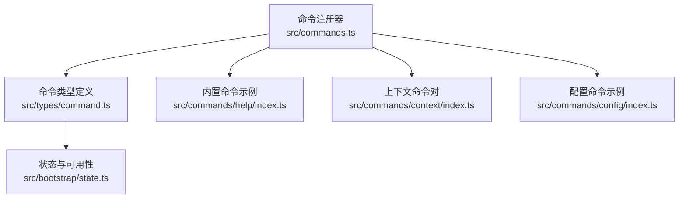
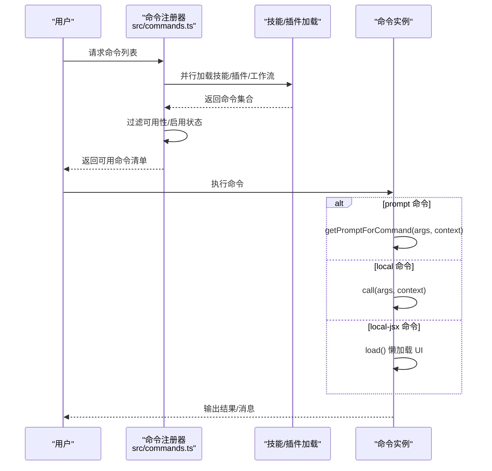
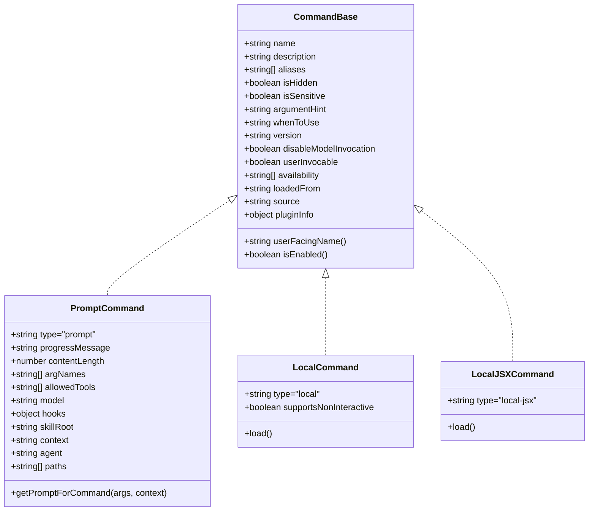
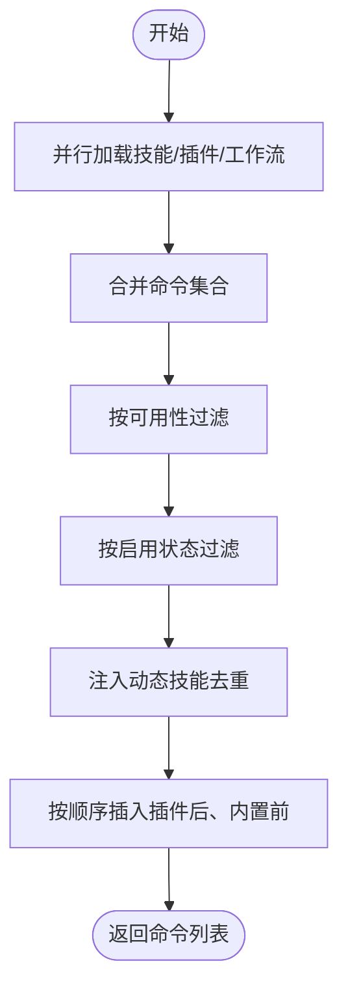
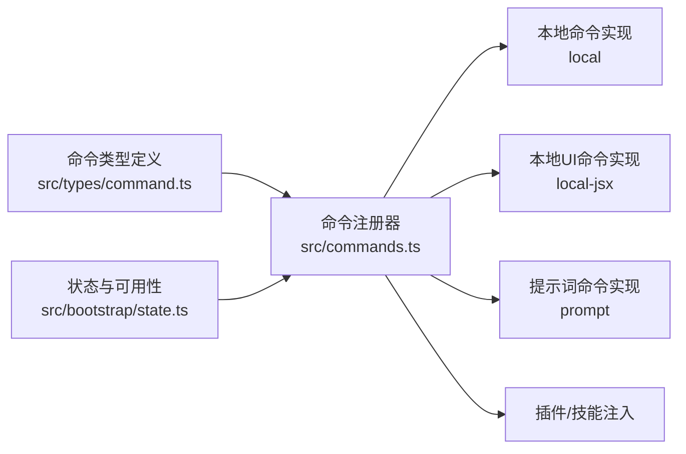

# 自定义命令开发

<cite>
**本文引用的文件**
- [src/commands.ts](file://src/commands.ts)
- [src/types/command.ts](file://src/types/command.ts)
- [src/commands/help/index.ts](file://src/commands/help/index.ts)
- [src/commands/context/index.ts](file://src/commands/context/index.ts)
- [src/commands/config/index.ts](file://src/commands/config/index.ts)
- [src/bootstrap/state.ts](file://src/bootstrap/state.ts)
</cite>

## 目录
1. [简介](#简介)
2. [项目结构](#项目结构)
3. [核心组件](#核心组件)
4. [架构总览](#架构总览)
5. [详细组件分析](#详细组件分析)
6. [依赖关系分析](#依赖关系分析)
7. [性能考量](#性能考量)
8. [故障排查指南](#故障排查指南)
9. [结论](#结论)
10. [附录](#附录)

## 简介
本指南面向在 free-code 平台上开发“自定义命令”的工程师与插件作者，系统讲解命令定义规范、参数处理机制、权限控制、错误处理、命令类型选择（prompt、local、local-jsx）、命令元数据配置、异步处理模式、与插件系统的集成、动态命令加载机制，以及测试与调试方法。文档同时提供从简单到复杂的开发示例路径与最佳实践，帮助你快速构建稳定、可维护且可被模型调用的命令。

## 项目结构
free-code 的命令体系由“内置命令注册器”“命令类型定义”“命令实现模块”三部分组成：
- 命令注册与聚合：集中导出所有命令，支持按需懒加载、动态技能注入、远程/桥接安全过滤等。
- 命令类型与元数据：通过统一的类型定义约束命令结构、能力开关与显示行为。
- 命令实现：以模块形式提供具体执行逻辑，支持纯文本输出、本地 UI 交互、提示词生成等。

图表来源
- [src/commands.ts:255-346](file://src/commands.ts#L255-L346)
- [src/types/command.ts:175-206](file://src/types/command.ts#L175-L206)
- [src/commands/help/index.ts:3-10](file://src/commands/help/index.ts#L3-L10)
- [src/commands/context/index.ts:4-24](file://src/commands/context/index.ts#L4-L24)
- [src/commands/config/index.ts:3-11](file://src/commands/config/index.ts#L3-L11)
- [src/bootstrap/state.ts:260-426](file://src/bootstrap/state.ts#L260-L426)

章节来源
- [src/commands.ts:255-346](file://src/commands.ts#L255-L346)
- [src/types/command.ts:175-206](file://src/types/command.ts#L175-L206)
- [src/commands/help/index.ts:3-10](file://src/commands/help/index.ts#L3-L10)
- [src/commands/context/index.ts:4-24](file://src/commands/context/index.ts#L4-L24)
- [src/commands/config/index.ts:3-11](file://src/commands/config/index.ts#L3-L11)
- [src/bootstrap/state.ts:260-426](file://src/bootstrap/state.ts#L260-L426)

## 核心组件
- 命令注册与聚合
  - 统一导出所有内置命令，支持条件特性开关、懒加载、动态技能注入与缓存清理。
  - 提供命令可用性过滤（按认证/提供商环境）、启用状态检查、远程/桥接安全过滤。
- 命令类型与元数据
  - 定义三类命令：prompt（提示词型，可被模型调用）、local（纯文本输出，非交互）、local-jsx（本地 UI 交互）。
  - 元数据字段覆盖描述、别名、可用性、启用状态、是否隐藏、是否敏感参数、版本、来源、是否允许模型调用等。
- 命令实现
  - prompt 命令通过 getPromptForCommand(args, context) 生成内容块；local 命令通过 call(args, context) 返回文本或压缩结果；local-jsx 命令通过 load() 懒加载并在 UI 中渲染。

章节来源
- [src/commands.ts:255-346](file://src/commands.ts#L255-L346)
- [src/commands.ts:417-443](file://src/commands.ts#L417-L443)
- [src/commands.ts:476-517](file://src/commands.ts#L476-L517)
- [src/commands.ts:619-676](file://src/commands.ts#L619-L676)
- [src/types/command.ts:16-57](file://src/types/command.ts#L16-L57)
- [src/types/command.ts:74-78](file://src/types/command.ts#L74-L78)
- [src/types/command.ts:144-152](file://src/types/command.ts#L144-L152)
- [src/types/command.ts:175-203](file://src/types/command.ts#L175-L203)

## 架构总览
命令系统采用“声明式注册 + 运行时聚合 + 动态加载”的架构，支持：
- 特性开关与条件导入，减少构建体积与启动开销。
- 按用户身份/提供商环境过滤命令可见性。
- 插件与技能目录动态注入，支持运行时刷新。
- 远程/桥接模式下的命令白名单过滤，保障安全。

图表来源
- [src/commands.ts:449-469](file://src/commands.ts#L449-L469)
- [src/commands.ts:476-517](file://src/commands.ts#L476-L517)
- [src/types/command.ts:53-56](file://src/types/command.ts#L53-L56)
- [src/types/command.ts:62-65](file://src/types/command.ts#L62-L65)
- [src/types/command.ts:131-135](file://src/types/command.ts#L131-L135)

## 详细组件分析

### 命令类型与元数据
- 类型定义
  - prompt：用于模型调用，需提供 getPromptForCommand(args, context)，支持进度提示、内容长度估算、工具限制、上下文策略等。
  - local：纯文本输出，支持非交互执行，适合批处理与自动化。
  - local-jsx：本地 UI 交互，通过 load() 懒加载，适合复杂交互与可视化。
- 元数据字段
  - 可见性与启用：availability（认证/提供商环境）、isEnabled（动态启用）、isHidden（是否隐藏）。
  - 来源与版本：loadedFrom、version、source、pluginInfo。
  - 安全与隐私：disableModelInvocation、isSensitive、argumentHint、whenToUse。
  - 显示与命名：description、name、aliases、userFacingName。

图表来源
- [src/types/command.ts:175-203](file://src/types/command.ts#L175-L203)
- [src/types/command.ts:25-57](file://src/types/command.ts#L25-L57)
- [src/types/command.ts:74-78](file://src/types/command.ts#L74-L78)
- [src/types/command.ts:144-152](file://src/types/command.ts#L144-L152)

章节来源
- [src/types/command.ts:16-57](file://src/types/command.ts#L16-L57)
- [src/types/command.ts:74-78](file://src/types/command.ts#L74-L78)
- [src/types/command.ts:144-152](file://src/types/command.ts#L144-L152)
- [src/types/command.ts:175-203](file://src/types/command.ts#L175-L203)

### 命令注册与动态加载
- 注册器职责
  - 聚合内置命令、技能、插件、工作流，按可用性与启用状态过滤。
  - 支持动态技能注入与去重，插入到插件技能之后、内置命令之前。
  - 提供远程/桥接安全命令集合与过滤函数。
- 动态加载
  - 使用 memoize 缓存加载结果，避免重复 I/O。
  - prompt 命令可通过懒加载延迟初始化重型模块。
  - 支持清除缓存以响应动态命令变更。

图表来源
- [src/commands.ts:449-469](file://src/commands.ts#L449-L469)
- [src/commands.ts:476-517](file://src/commands.ts#L476-L517)
- [src/commands.ts:519-532](file://src/commands.ts#L519-L532)

章节来源
- [src/commands.ts:255-346](file://src/commands.ts#L255-L346)
- [src/commands.ts:449-469](file://src/commands.ts#L449-L469)
- [src/commands.ts:476-517](file://src/commands.ts#L476-L517)
- [src/commands.ts:519-532](file://src/commands.ts#L519-L532)

### 命令实现示例与最佳实践

#### 示例一：简单本地命令（local）
- 目标：提供一个非交互、可被模型调用的纯文本输出命令。
- 实现要点
  - 定义 type 为 local，设置 supportsNonInteractive 为 true。
  - 在 load() 返回的模块中实现 call(args, context)。
  - 使用 LocalCommandResult 的 text 类型返回字符串。
- 参考路径
  - [src/commands/config/index.ts:3-11](file://src/commands/config/index.ts#L3-L11)

章节来源
- [src/commands/config/index.ts:3-11](file://src/commands/config/index.ts#L3-L11)
- [src/types/command.ts:74-78](file://src/types/command.ts#L74-L78)
- [src/types/command.ts:16-24](file://src/types/command.ts#L16-L24)

#### 示例二：复杂交互命令（local-jsx）
- 目标：提供需要本地 UI 交互的命令，如帮助面板、可视化工具。
- 实现要点
  - 定义 type 为 local-jsx，使用 load() 懒加载 UI 模块。
  - 在 UI 中通过 onDone 回调传递结果与后续输入。
  - 注意 remote/bridge 安全限制：local-jsx 不会被桥接端执行。
- 参考路径
  - [src/commands/help/index.ts:3-10](file://src/commands/help/index.ts#L3-10)

章节来源
- [src/commands/help/index.ts:3-10](file://src/commands/help/index.ts#L3-L10)
- [src/types/command.ts:144-152](file://src/types/command.ts#L144-L152)
- [src/commands.ts:619-676](file://src/commands.ts#L619-L676)

#### 示例三：带参数验证的命令（prompt）
- 目标：接收参数并进行校验，生成提示词内容块。
- 实现要点
  - 定义 type 为 prompt，提供 getPromptForCommand(args, context)。
  - 使用 argNames/allowedTools/contentLength 等元数据辅助模型调用。
  - 对敏感参数设置 isSensitive，避免历史记录泄露。
- 参考路径
  - [src/commands/context/index.ts:4-24](file://src/commands/context/index.ts#L4-L24)

章节来源
- [src/commands/context/index.ts:4-24](file://src/commands/context/index.ts#L4-L24)
- [src/types/command.ts:25-57](file://src/types/command.ts#L25-L57)

### 参数处理机制
- 参数解析
  - 命令实现接收 args 字符串，可在内部按空格或分隔符拆分与校验。
  - 对于复杂参数，建议提供 argumentHint 作为 UI 辅助提示。
- 非交互与交互
  - local 命令支持非交互执行，适合脚本化与批量任务。
  - local-jsx 命令仅在本地 UI 中执行，不适用于远程/桥接。
- 上下文传递
  - prompt 命令通过 ToolUseContext 获取会话与模型信息。
  - local-jsx 命令通过 LocalJSXCommandContext 获取 UI 渲染所需状态。

章节来源
- [src/types/command.ts:62-65](file://src/types/command.ts#L62-L65)
- [src/types/command.ts:131-135](file://src/types/command.ts#L131-L135)
- [src/types/command.ts:80-98](file://src/types/command.ts#L80-L98)

### 权限控制与可用性
- 可用性过滤
  - availability 支持 'claude-ai' 与 'console'，分别针对 OAuth 订阅用户与直接 Console API 用户。
  - meetsAvailabilityRequirement() 在 getCommands() 前过滤不可用命令。
- 启用状态
  - isEnabled() 可根据特性标志、环境变量等动态决定命令是否启用。
- 远程/桥接安全
  - REMOTE_SAFE_COMMANDS 与 BRIDGE_SAFE_COMMANDS 限定远程模式与移动端可执行的命令集合。
  - isBridgeSafeCommand() 判断命令是否允许通过桥接端执行。

章节来源
- [src/commands.ts:417-443](file://src/commands.ts#L417-L443)
- [src/commands.ts:619-676](file://src/commands.ts#L619-L676)
- [src/types/command.ts:169-174](file://src/types/command.ts#L169-L174)
- [src/types/command.ts:179-180](file://src/types/command.ts#L179-L180)

### 错误处理与健壮性
- 加载失败容错
  - 技能/插件加载失败时记录错误并继续运行，避免阻断主流程。
- 结果格式化
  - 使用 formatDescriptionWithSource() 为 UI 展示添加来源标注。
- 缓存与刷新
  - clearCommandMemoizationCaches()/clearCommandsCache() 用于响应动态命令变更。

章节来源
- [src/commands.ts:358-398](file://src/commands.ts#L358-L398)
- [src/commands.ts:728-754](file://src/commands.ts#L728-L754)
- [src/commands.ts:519-539](file://src/commands.ts#L519-L539)

### 异步处理模式
- 懒加载
  - local-jsx 命令通过 load() 按需加载 UI 模块，降低初始启动成本。
- 并行加载
  - getSkills() 并行加载技能与插件，提升整体可用性。
- 缓存优化
  - memoize 缓存命令列表与技能索引，避免重复计算。

章节来源
- [src/commands.ts:358-398](file://src/commands.ts#L358-L398)
- [src/commands.ts:449-469](file://src/commands.ts#L449-L469)
- [src/commands.ts:519-532](file://src/commands.ts#L519-L532)

### 与插件系统的集成
- 插件命令与技能
  - 通过 getPluginCommands()/getPluginSkills() 注入插件命令与技能。
  - 支持 clearPluginCommandCache()/clearPluginSkillsCache() 清理缓存。
- 内置插件技能
  - getBuiltinPluginSkillCommands() 注册内置插件提供的技能。
- MCP 技能
  - getMcpSkillCommands() 过滤 MCP 提供的 prompt 型技能。

章节来源
- [src/commands.ts:160-168](file://src/commands.ts#L160-L168)
- [src/commands.ts:547-559](file://src/commands.ts#L547-L559)
- [src/commands.ts:563-581](file://src/commands.ts#L563-L581)
- [src/commands.ts:586-608](file://src/commands.ts#L586-L608)

### 测试与调试方法
- 单元测试
  - 对命令的 isEnabled()/availability 与 getCommands() 过滤逻辑进行断言。
  - 对 prompt 命令的 getPromptForCommand() 输入输出进行契约测试。
- 集成测试
  - 模拟远程/桥接场景，验证 isBridgeSafeCommand() 与 REMOTE_SAFE_COMMANDS。
- 调试技巧
  - 使用 logForDebugging() 输出加载与过滤过程的关键信息。
  - 通过 clearCommandsCache() 清理缓存，验证动态命令注入与去重逻辑。

章节来源
- [src/commands.ts:417-443](file://src/commands.ts#L417-L443)
- [src/commands.ts:619-676](file://src/commands.ts#L619-L676)
- [src/commands.ts:358-398](file://src/commands.ts#L358-L398)
- [src/commands.ts:519-539](file://src/commands.ts#L519-L539)

## 依赖关系分析
命令系统的核心依赖关系如下：
- 命令注册器依赖命令类型定义与状态模块，用于过滤与命名解析。
- 命令实现依赖上下文接口，确保在不同模式（本地/远程/桥接）下正确执行。
- 插件与技能通过统一入口注入，保证一致性与可扩展性。

图表来源
- [src/types/command.ts:175-206](file://src/types/command.ts#L175-L206)
- [src/commands.ts:255-346](file://src/commands.ts#L255-L346)
- [src/bootstrap/state.ts:260-426](file://src/bootstrap/state.ts#L260-L426)

章节来源
- [src/types/command.ts:175-206](file://src/types/command.ts#L175-L206)
- [src/commands.ts:255-346](file://src/commands.ts#L255-L346)
- [src/bootstrap/state.ts:260-426](file://src/bootstrap/state.ts#L260-L426)

## 性能考量
- 懒加载与缓存
  - 使用 memoize 缓存命令列表与技能索引，避免重复 I/O。
  - prompt 命令通过懒加载延迟初始化重型模块。
- 并行加载
  - getSkills() 并行加载技能与插件，缩短可用时间。
- 远程/桥接过滤
  - 通过 REMOTE_SAFE_COMMANDS 与 BRIDGE_SAFE_COMMANDS 减少无效渲染与执行。

章节来源
- [src/commands.ts:358-398](file://src/commands.ts#L358-L398)
- [src/commands.ts:449-469](file://src/commands.ts#L449-L469)
- [src/commands.ts:619-676](file://src/commands.ts#L619-L676)

## 故障排查指南
- 命令未显示
  - 检查 availability 与 isEnabled() 是否导致过滤。
  - 确认命令未被标记为 isHidden。
- 命令无法执行
  - 对于 remote/bridge 场景，确认命令是否在安全白名单中。
  - 对于 local-jsx 命令，确认执行环境是否支持 UI 渲染。
- 动态命令未生效
  - 调用 clearCommandsCache() 或 clearCommandMemoizationCaches() 刷新缓存。
- 加载失败
  - 查看日志输出，确认技能/插件加载异常是否被捕获并继续运行。

章节来源
- [src/commands.ts:417-443](file://src/commands.ts#L417-L443)
- [src/commands.ts:619-676](file://src/commands.ts#L619-L676)
- [src/commands.ts:519-539](file://src/commands.ts#L519-L539)
- [src/commands.ts:358-398](file://src/commands.ts#L358-L398)

## 结论
通过统一的命令类型定义、灵活的注册与动态加载机制、严格的权限与安全过滤，free-code 的命令系统既保证了强大的可扩展性，又确保了在多模式（本地/远程/桥接）下的安全性与稳定性。遵循本文档的规范与最佳实践，你可以快速开发高质量的自定义命令，并将其无缝集成到插件生态中。

## 附录
- 快速参考
  - 命令类型：prompt/local/local-jsx
  - 关键元数据：availability/isEnabled/isHidden/disableModelInvocation/isSensitive
  - 安全白名单：REMOTE_SAFE_COMMANDS/BRIDGE_SAFE_COMMANDS/isBridgeSafeCommand
  - 动态注入：getSkills()/getPluginCommands()/getPluginSkills()
  - 缓存管理：clearCommandsCache()/clearCommandMemoizationCaches()