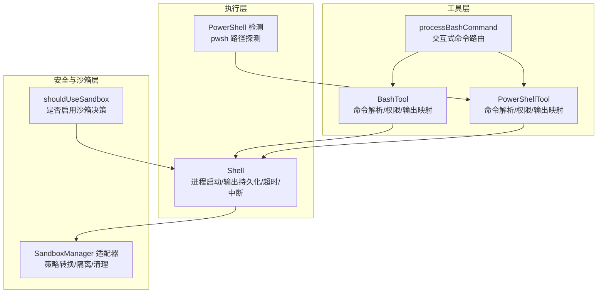
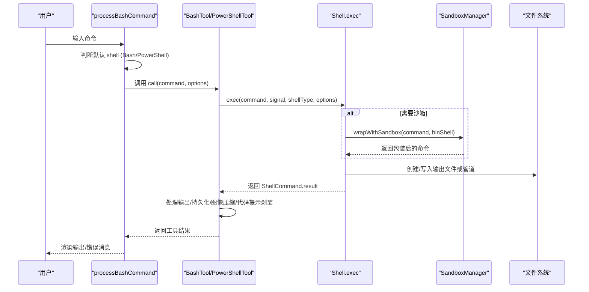
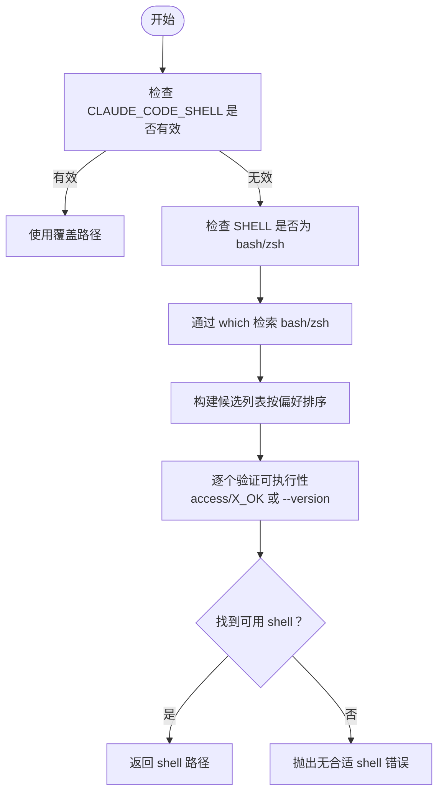
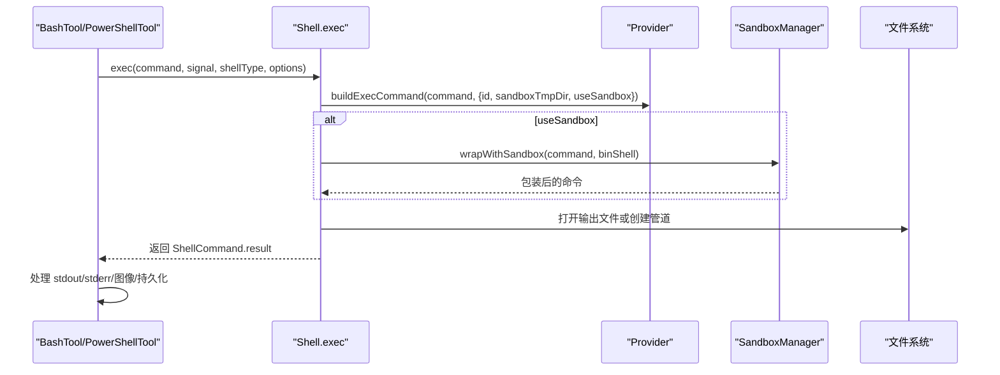
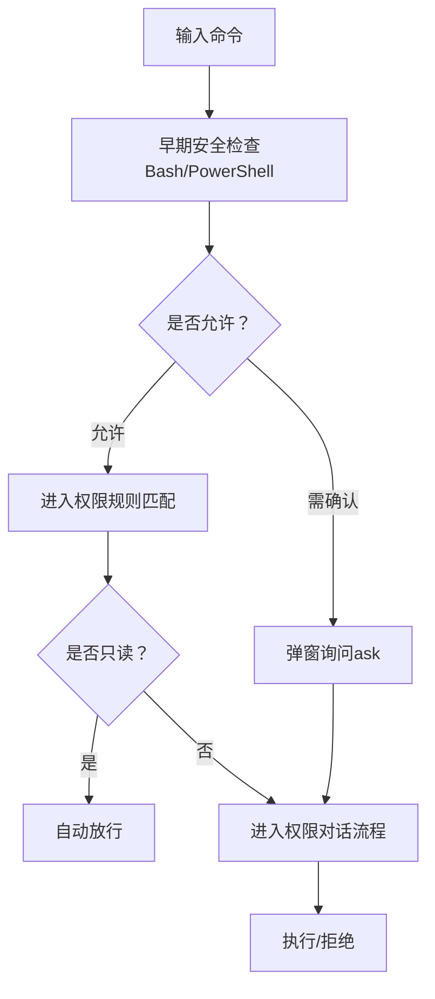
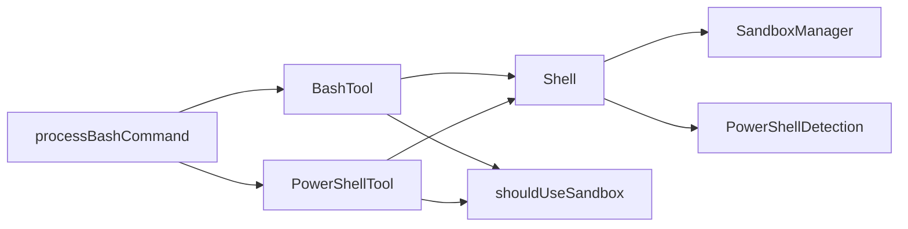

# Shell 集成工具

<cite>
**本文档引用的文件**
- [src/tools/BashTool/BashTool.tsx](file://src/tools/BashTool/BashTool.tsx)
- [src/tools/PowerShellTool/PowerShellTool.tsx](file://src/tools/PowerShellTool/PowerShellTool.tsx)
- [src/utils/processUserInput/processBashCommand.tsx](file://src/utils/processUserInput/processBashCommand.tsx)
- [src/utils/Shell.ts](file://src/utils/Shell.ts)
- [src/utils/sandbox/sandbox-adapter.ts](file://src/utils/sandbox/sandbox-adapter.ts)
- [src/utils/shell/powershellDetection.ts](file://src/utils/shell/powershellDetection.ts)
- [src/tools/BashTool/shouldUseSandbox.ts](file://src/tools/BashTool/shouldUseSandbox.ts)
- [src/tools/BashTool/bashSecurity.ts](file://src/tools/BashTool/bashSecurity.ts)
- [src/tools/PowerShellTool/powershellSecurity.ts](file://src/tools/PowerShellTool/powershellSecurity.ts)
</cite>

## 目录
1. [简介](#简介)
2. [项目结构](#项目结构)
3. [核心组件](#核心组件)
4. [架构总览](#架构总览)
5. [详细组件分析](#详细组件分析)
6. [依赖关系分析](#依赖关系分析)
7. [性能考虑](#性能考虑)
8. [故障排除指南](#故障排除指南)
9. [结论](#结论)

## 简介
本文件系统化阐述 free-code 的 Shell 集成工具，涵盖 Shell 环境检测与配置、命令执行与输出处理、Bash 与 PowerShell 兼容性、命令解析与安全执行、Shell 会话管理、脚本执行与环境隔离、扩展机制与自定义处理器、安全限制与沙箱机制，以及性能优化与并发控制等主题。目标是帮助开发者与使用者全面理解该工具链的设计与实现，并在实际使用中获得可操作的指导。

## 项目结构
Shell 集成工具由三层组成：
- 工具层：BashTool 与 PowerShellTool，负责命令输入、权限校验、UI 渲染、结果映射与错误处理。
- 执行层：Shell 工具，封装进程启动、输出持久化、超时与中断控制、工作目录跟踪与切换。
- 安全与沙箱层：SandboxManager 适配器，将用户策略转换为沙箱运行时配置，提供网络与文件系统隔离、违规记录与清理。

**图表来源**
- [src/tools/BashTool/BashTool.tsx](file://src/tools/BashTool/BashTool.tsx)
- [src/tools/PowerShellTool/PowerShellTool.tsx](file://src/tools/PowerShellTool/PowerShellTool.tsx)
- [src/utils/processUserInput/processBashCommand.tsx](file://src/utils/processUserInput/processBashCommand.tsx)
- [src/utils/Shell.ts](file://src/utils/Shell.ts)
- [src/utils/sandbox/sandbox-adapter.ts](file://src/utils/sandbox/sandbox-adapter.ts)
- [src/utils/shell/powershellDetection.ts](file://src/utils/shell/powershellDetection.ts)
- [src/tools/BashTool/shouldUseSandbox.ts](file://src/tools/BashTool/shouldUseSandbox.ts)

**章节来源**
- [src/tools/BashTool/BashTool.tsx](file://src/tools/BashTool/BashTool.tsx)
- [src/tools/PowerShellTool/PowerShellTool.tsx](file://src/tools/PowerShellTool/PowerShellTool.tsx)
- [src/utils/processUserInput/processBashCommand.tsx](file://src/utils/processUserInput/processBashCommand.tsx)
- [src/utils/Shell.ts](file://src/utils/Shell.ts)
- [src/utils/sandbox/sandbox-adapter.ts](file://src/utils/sandbox/sandbox-adapter.ts)
- [src/utils/shell/powershellDetection.ts](file://src/utils/shell/powershellDetection.ts)
- [src/tools/BashTool/shouldUseSandbox.ts](file://src/tools/BashTool/shouldUseSandbox.ts)

## 核心组件
- BashTool：面向 Bash/POSIX 的命令工具，支持只读自动判定、搜索/读取类命令折叠显示、静默命令识别、后台任务自动挂起、大输出持久化、图像输出压缩、代码提示注入剥离、权限规则匹配与安全检查。
- PowerShellTool：面向 Windows PowerShell 的命令工具，支持 PS 命令语义识别（搜索/读取）、只读自动判定、后台任务自动挂起、大输出持久化、图像输出压缩、代码提示注入剥离、权限规则匹配与安全检查。
- Shell：统一的命令执行引擎，负责进程启动、输出写入（文件或管道）、超时控制、中断处理、工作目录恢复与切换、沙箱包装、环境变量覆盖。
- SandboxManager 适配器：将用户设置与权限规则转换为沙箱运行时配置，提供网络与文件系统隔离、违规记录与清理、依赖检查与平台支持判断。
- PowerShell 检测：跨平台探测 pwsh/powershell 可执行路径，规避 snap 启动器阻塞，缓存探测结果并推断 PowerShell Edition。

**章节来源**
- [src/tools/BashTool/BashTool.tsx](file://src/tools/BashTool/BashTool.tsx)
- [src/tools/PowerShellTool/PowerShellTool.tsx](file://src/tools/PowerShellTool/PowerShellTool.tsx)
- [src/utils/Shell.ts](file://src/utils/Shell.ts)
- [src/utils/sandbox/sandbox-adapter.ts](file://src/utils/sandbox/sandbox-adapter.ts)
- [src/utils/shell/powershellDetection.ts](file://src/utils/shell/powershellDetection.ts)

## 架构总览
整体流程从用户输入开始，通过 processBashCommand 决定使用 Bash 或 PowerShell，默认 shell 由 resolveDefaultShell 决策；随后 BashTool/PowerShellTool 调用 Shell.exec 执行命令，Shell 在需要时通过 SandboxManager.wrapWithSandbox 包装命令以启用隔离；执行完成后，工具对输出进行格式化、大文件持久化、图像压缩与代码提示剥离，并返回结果。

**图表来源**
- [src/utils/processUserInput/processBashCommand.tsx](file://src/utils/processUserInput/processBashCommand.tsx)
- [src/tools/BashTool/BashTool.tsx](file://src/tools/BashTool/BashTool.tsx)
- [src/tools/PowerShellTool/PowerShellTool.tsx](file://src/tools/PowerShellTool/PowerShellTool.tsx)
- [src/utils/Shell.ts](file://src/utils/Shell.ts)
- [src/utils/sandbox/sandbox-adapter.ts](file://src/utils/sandbox/sandbox-adapter.ts)

## 详细组件分析

### Shell 环境检测与配置
- 默认 shell 选择：processBashCommand 依据 resolveDefaultShell 与 isPowerShellToolEnabled 判定使用 Bash 还是 PowerShell；若用户选择 PowerShell 且系统可用，则延迟加载 PowerShellTool 并强制禁用沙箱（用户显式要求）。
- PowerShell 探测：findPowerShell 优先 pwsh（PowerShell Core），在 Linux 上规避 snap 启动器，改用直接二进制路径；getCachedPowerShellPath 缓存探测结果；getPowerShellEdition 推断版本特性（core/desktop）用于提示生成。
- Shell 可执行性验证：findSuitableShell 支持 CLAUDE_CODE_SHELL 覆盖、SHELL 环境变量偏好、which 检索与回退路径，最终确保可执行性并通过测试 --version。

**图表来源**
- [src/utils/Shell.ts](file://src/utils/Shell.ts)
- [src/utils/processUserInput/processBashCommand.tsx](file://src/utils/processUserInput/processBashCommand.tsx)
- [src/utils/shell/powershellDetection.ts](file://src/utils/shell/powershellDetection.ts)

**章节来源**
- [src/utils/processUserInput/processBashCommand.tsx](file://src/utils/processUserInput/processBashCommand.tsx)
- [src/utils/Shell.ts](file://src/utils/Shell.ts)
- [src/utils/shell/powershellDetection.ts](file://src/utils/shell/powershellDetection.ts)

### 命令执行与输出处理
- 进程启动：Shell.exec 根据 shellType 解析 Provider，构建命令字符串，必要时通过 SandboxManager.wrapWithSandbox 包装；在 Windows 上对 PowerShell 沙箱采用特殊策略（/bin/sh -c 包装编码命令）。
- 输出持久化：默认将 stdout/stderr 写入任务输出文件，支持实时管道模式（onStdout 回调）；文件模式下 POSIX 使用 O_APPEND 原子写，Windows 使用 'w' 以避免继承句柄问题。
- 工作目录跟踪：通过临时文件记录 pwd -P 输出，执行后同步更新 cwd，失效会话环境缓存并触发钩子。
- 大输出处理：超过阈值时复制到工具结果目录，前端通过 persisted-output 包裹展示预览；图像输出进行尺寸与维度压缩。
- 中断与超时：AbortSignal 控制终止；超时时间可配置，工具层在 UI 层面提供进度反馈。

**图表来源**
- [src/utils/Shell.ts](file://src/utils/Shell.ts)
- [src/utils/sandbox/sandbox-adapter.ts](file://src/utils/sandbox/sandbox-adapter.ts)
- [src/tools/BashTool/BashTool.tsx](file://src/tools/BashTool/BashTool.tsx)
- [src/tools/PowerShellTool/PowerShellTool.tsx](file://src/tools/PowerShellTool/PowerShellTool.tsx)

**章节来源**
- [src/utils/Shell.ts](file://src/utils/Shell.ts)
- [src/tools/BashTool/BashTool.tsx](file://src/tools/BashTool/BashTool.tsx)
- [src/tools/PowerShellTool/PowerShellTool.tsx](file://src/tools/PowerShellTool/PowerShellTool.tsx)

### Bash 与 PowerShell 兼容性处理
- 命令语义识别：BashTool 识别搜索/读取/目录列出/静默命令，用于 UI 折叠与摘要；PowerShellTool 识别等价的 cmdlet 语义集合。
- 语法差异：PowerShellTool 提供 sleep/start-sleep 的阻塞检测与提示；Windows 平台不支持沙箱时拒绝执行。
- 版本特性：getPowerShellEdition 推断 core/desktop，用于提示生成与语法建议。

**章节来源**
- [src/tools/BashTool/BashTool.tsx](file://src/tools/BashTool/BashTool.tsx)
- [src/tools/PowerShellTool/PowerShellTool.tsx](file://src/tools/PowerShellTool/PowerShellTool.tsx)
- [src/utils/shell/powershellDetection.ts](file://src/utils/shell/powershellDetection.ts)

### 命令解析与安全执行
- Bash 安全检查：包含不完整命令、heredoc-in-substitution 安全模式、git commit 消息校验、jq 危险函数、shell 元字符、变量注入、重定向剥离、Zsh 危险命令等多维验证。
- PowerShell 安全检查：AST 基础的动态命令名、Invoke-Expression、下载链条（IWR/IEX）、COM 对象、New-Object 类型约束、脚本块注入、子表达式、展开字符串、Splatting、停止解析令牌、成员调用等。
- 权限与只读判定：BashTool/PowerShellTool 在工具层与权限层双重校验，支持通配符/前缀匹配与安全启发式。

**图表来源**
- [src/tools/BashTool/bashSecurity.ts](file://src/tools/BashTool/bashSecurity.ts)
- [src/tools/PowerShellTool/powershellSecurity.ts](file://src/tools/PowerShellTool/powershellSecurity.ts)
- [src/tools/BashTool/BashTool.tsx](file://src/tools/BashTool/BashTool.tsx)
- [src/tools/PowerShellTool/PowerShellTool.tsx](file://src/tools/PowerShellTool/PowerShellTool.tsx)

**章节来源**
- [src/tools/BashTool/bashSecurity.ts](file://src/tools/BashTool/bashSecurity.ts)
- [src/tools/PowerShellTool/powershellSecurity.ts](file://src/tools/PowerShellTool/powershellSecurity.ts)
- [src/tools/BashTool/BashTool.tsx](file://src/tools/BashTool/BashTool.tsx)
- [src/tools/PowerShellTool/PowerShellTool.tsx](file://src/tools/PowerShellTool/PowerShellTool.tsx)

### Shell 会话管理与脚本执行
- 会话级 cwd 管理：Shell.exec 在命令结束后读取临时文件获取新 cwd，进行规范化比较后更新状态，失效相关缓存并通知钩子。
- 脚本执行：通过 Provider 的 buildExecCommand 与 getSpawnArgs 组合命令字符串与参数；支持 Detached 模式与隐藏窗口（Windows）。
- 会话隔离：SandboxManager 在 Linux/WSL2 上通过 bubblewrap 实现文件系统与网络隔离，清理裸仓库文件与临时目录，防止逃逸。

**章节来源**
- [src/utils/Shell.ts](file://src/utils/Shell.ts)
- [src/utils/sandbox/sandbox-adapter.ts](file://src/utils/sandbox/sandbox-adapter.ts)

### Shell 环境隔离与沙箱机制
- 配置转换：convertToSandboxRuntimeConfig 将权限规则与设置转换为沙箱运行时配置，包含网络域白名单/黑名单、文件系统读写路径、ripgrep 命令与参数等。
- 依赖与平台：checkDependencies 与 isSupportedPlatform 决定沙箱可用性；enabledPlatforms 可限制启用平台。
- 违规记录与清理：SandboxViolationStore 记录违规事件；cleanupAfterCommand 与 scrubBareGitRepoFiles 在命令后清理残留文件。
- 自动放行策略：autoAllowBashIfSandboxed 与 areUnsandboxedCommandsAllowed 控制是否允许未沙箱命令执行。

**章节来源**
- [src/utils/sandbox/sandbox-adapter.ts](file://src/utils/sandbox/sandbox-adapter.ts)
- [src/tools/BashTool/shouldUseSandbox.ts](file://src/tools/BashTool/shouldUseSandbox.ts)

### 扩展机制与自定义 Shell 处理器
- Provider 抽象：Shell 通过 Provider 构建命令与参数，支持不同 Shell 的差异化行为（如 PowerShell 沙箱包装）。
- 动态加载：PowerShellTool 采用懒加载（require/import）以减少初始包体积。
- 设置驱动：SandboxManager 与权限系统通过设置源（本地/策略/标志）合并配置，支持热更新。

**章节来源**
- [src/utils/Shell.ts](file://src/utils/Shell.ts)
- [src/utils/sandbox/sandbox-adapter.ts](file://src/utils/sandbox/sandbox-adapter.ts)
- [src/utils/processUserInput/processBashCommand.tsx](file://src/utils/processUserInput/processBashCommand.tsx)

## 依赖关系分析

**图表来源**
- [src/utils/processUserInput/processBashCommand.tsx](file://src/utils/processUserInput/processBashCommand.tsx)
- [src/tools/BashTool/BashTool.tsx](file://src/tools/BashTool/BashTool.tsx)
- [src/tools/PowerShellTool/PowerShellTool.tsx](file://src/tools/PowerShellTool/PowerShellTool.tsx)
- [src/utils/Shell.ts](file://src/utils/Shell.ts)
- [src/utils/sandbox/sandbox-adapter.ts](file://src/utils/sandbox/sandbox-adapter.ts)
- [src/utils/shell/powershellDetection.ts](file://src/utils/shell/powershellDetection.ts)
- [src/tools/BashTool/shouldUseSandbox.ts](file://src/tools/BashTool/shouldUseSandbox.ts)

**章节来源**
- [src/utils/processUserInput/processBashCommand.tsx](file://src/utils/processUserInput/processBashCommand.tsx)
- [src/tools/BashTool/BashTool.tsx](file://src/tools/BashTool/BashTool.tsx)
- [src/tools/PowerShellTool/PowerShellTool.tsx](file://src/tools/PowerShellTool/PowerShellTool.tsx)
- [src/utils/Shell.ts](file://src/utils/Shell.ts)
- [src/utils/sandbox/sandbox-adapter.ts](file://src/utils/sandbox/sandbox-adapter.ts)
- [src/utils/shell/powershellDetection.ts](file://src/utils/shell/powershellDetection.ts)
- [src/tools/BashTool/shouldUseSandbox.ts](file://src/tools/BashTool/shouldUseSandbox.ts)

## 性能考虑
- 进程与 I/O：文件模式下 POSIX 使用 O_APPEND 原子写，Windows 使用 'w' 保证一致性；管道模式提供实时回调，降低内存占用。
- 超时与中断：统一的 AbortSignal 与超时控制，避免僵尸进程与资源泄漏。
- 大输出与图像：超过阈值时落盘并提供预览，图像输出进行压缩，减少前端渲染压力。
- 并发控制：后台任务注册与前台任务替换逻辑，避免重复任务与资源竞争；辅助 UI 提供进度反馈。
- 懒加载：PowerShellTool 按需加载，减少冷启动开销。

[本节为通用性能讨论，无需特定文件引用]

## 故障排除指南
- 无合适 Shell：检查 SHELL 环境变量与 PATH，确认 bash/zsh 可执行；可通过 CLAUDE_CODE_SHELL 强制指定。
- PowerShell 不可用：确认 pwsh/powershell 存在且非 snap 启动器；在 Linux 上优先直连二进制路径。
- 沙箱不可用：查看依赖检查与平台支持；若用户明确启用但不可用，将给出具体原因提示。
- 命令被拒绝：查看权限规则与安全检查日志；对于 PowerShell，注意 Windows 平台不支持沙箱时的策略拒绝。
- 输出异常：检查 persisted-output 文件是否存在与大小；确认图像解码与压缩流程是否成功。

**章节来源**
- [src/utils/Shell.ts](file://src/utils/Shell.ts)
- [src/utils/sandbox/sandbox-adapter.ts](file://src/utils/sandbox/sandbox-adapter.ts)
- [src/utils/shell/powershellDetection.ts](file://src/utils/shell/powershellDetection.ts)
- [src/tools/PowerShellTool/PowerShellTool.tsx](file://src/tools/PowerShellTool/PowerShellTool.tsx)

## 结论
该 Shell 集成工具通过清晰的分层设计实现了跨平台、可扩展、安全可控的命令执行能力。BashTool 与 PowerShellTool 在工具层提供一致的接口与体验，Shell.exec 在执行层统一了进程生命周期与输出管理，SandboxManager 适配器则提供了细粒度的隔离与合规保障。配合完善的权限与安全检查、大输出与图像优化、以及懒加载与并发控制策略，整体方案既满足易用性也兼顾安全性与性能。