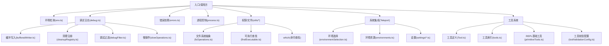
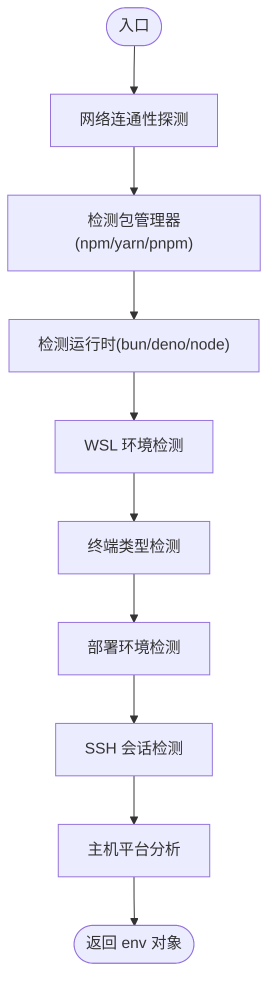
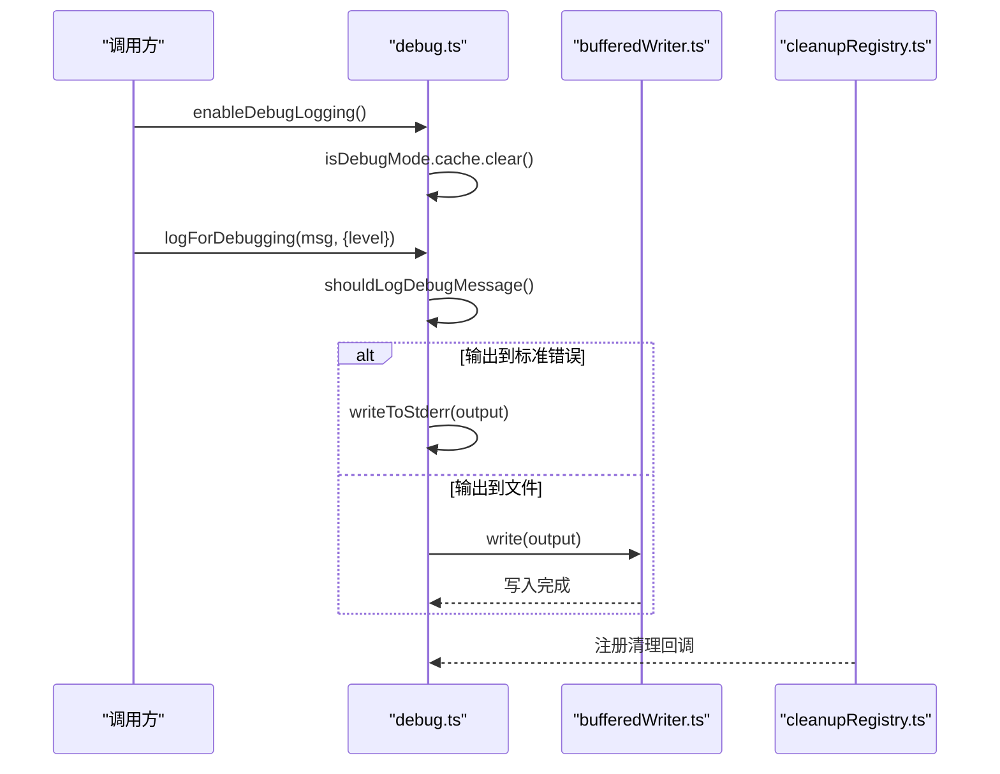
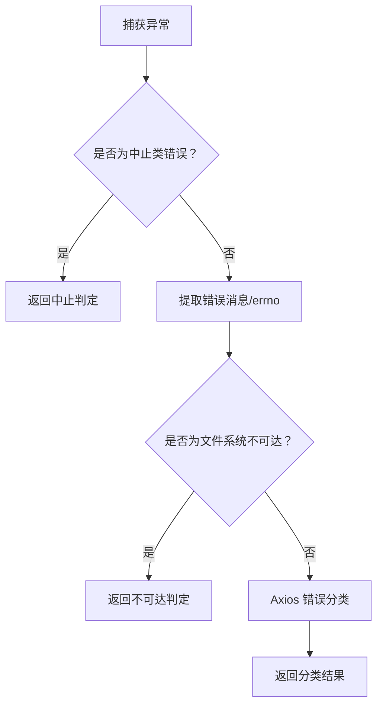
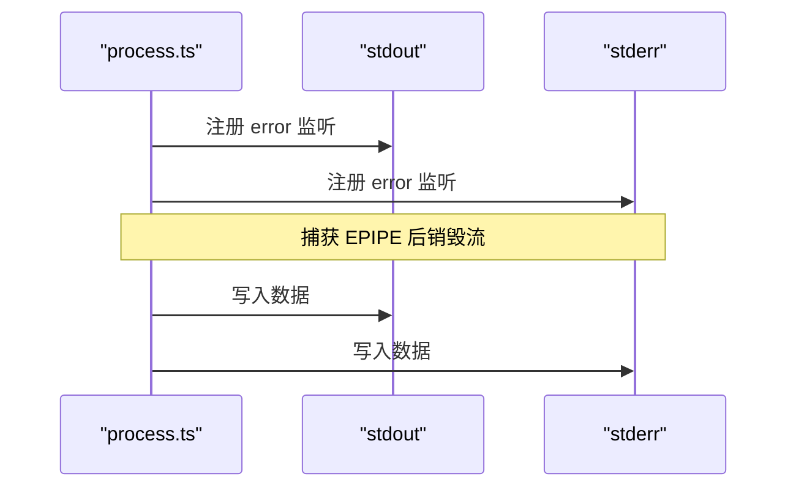
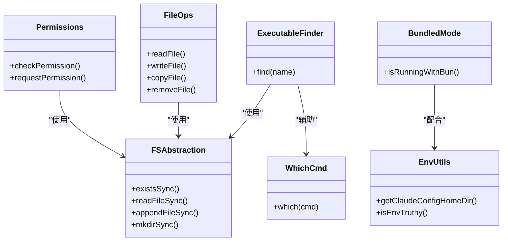
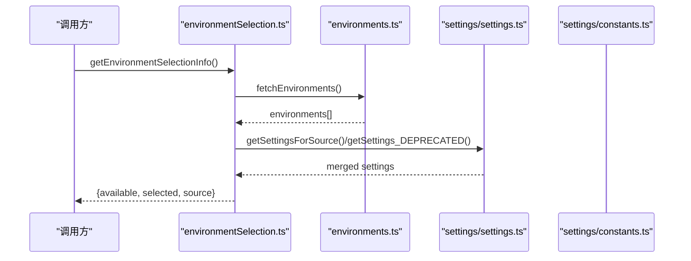
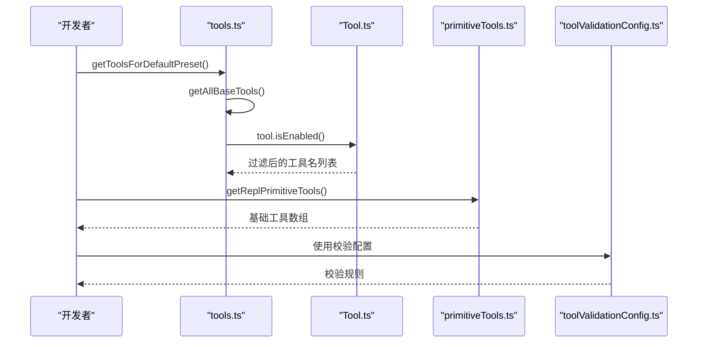
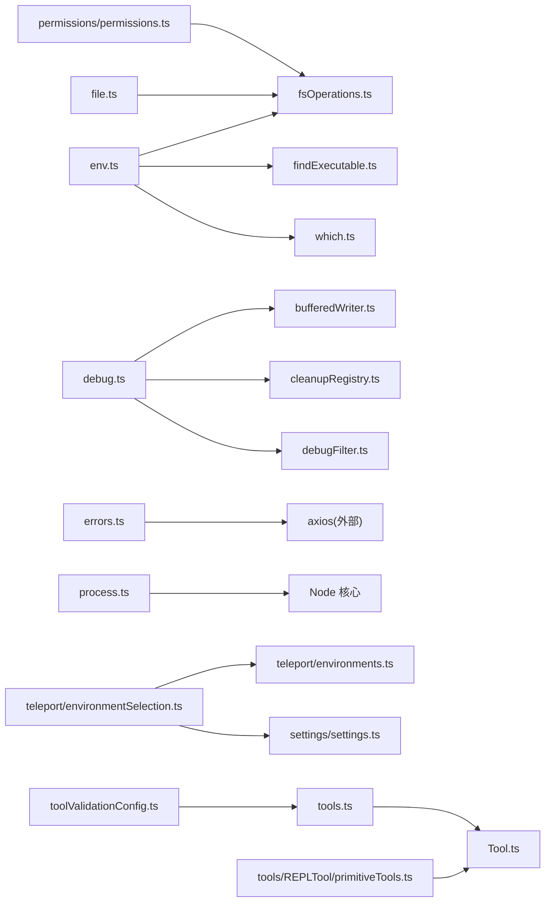

# 工具函数和实用程序

<cite>
**本文引用的文件**
- [src/utils/env.ts](file://src/utils/env.ts)
- [src/utils/debug.ts](file://src/utils/debug.ts)
- [src/utils/errors.ts](file://src/utils/errors.ts)
- [src/utils/process.ts](file://src/utils/process.ts)
- [src/utils/permissions/permissions.ts](file://src/utils/permissions/permissions.ts)
- [src/utils/file.ts](file://src/utils/file.ts)
- [src/utils/fsOperations.ts](file://src/utils/fsOperations.ts)
- [src/utils/findExecutable.ts](file://src/utils/findExecutable.ts)
- [src/utils/which.ts](file://src/utils/which.ts)
- [src/utils/bundledMode.ts](file://src/utils/bundledMode.ts)
- [src/utils/envUtils.ts](file://src/utils/envUtils.ts)
- [src/utils/slowOperations.ts](file://src/utils/slowOperations.ts)
- [src/utils/cleanupRegistry.ts](file://src/utils/cleanupRegistry.ts)
- [src/utils/bufferedWriter.ts](file://src/utils/bufferedWriter.ts)
- [src/utils/debugFilter.ts](file://src/utils/debugFilter.ts)
- [src/utils/teleport/environmentSelection.ts](file://src/utils/teleport/environmentSelection.ts)
- [src/utils/teleport/environments.ts](file://src/utils/teleport/environments.ts)
- [src/utils/settings/constants.ts](file://src/utils/settings/constants.ts)
- [src/utils/settings/settings.ts](file://src/utils/settings/settings.ts)
- [src/tools.ts](file://src/tools.ts)
- [src/Tool.ts](file://src/Tool.ts)
- [src/tools/REPLTool/primitiveTools.ts](file://src/tools/REPLTool/primitiveTools.ts)
- [src/utils/settings/toolValidationConfig.ts](file://src/utils/settings/toolValidationConfig.ts)
</cite>

## 目录
1. [简介](#简介)
2. [项目结构](#项目结构)
3. [核心组件](#核心组件)
4. [架构总览](#架构总览)
5. [详细组件分析](#详细组件分析)
6. [依赖关系分析](#依赖关系分析)
7. [性能考量](#性能考量)
8. [故障排查指南](#故障排查指南)
9. [结论](#结论)
10. [附录](#附录)

## 简介
本文件面向 free-code 工具函数与实用程序，系统性梳理其设计理念、组织结构与实现机制。内容覆盖环境检测与配置、错误处理与分类、调试日志与输出、进程与流控制、权限与文件系统工具、以及系统集成工具（如 Teleport 环境选择）。文档同时提供使用示例与最佳实践、扩展与自定义方法、性能优化建议与安全注意事项。

## 项目结构
工具函数与实用程序主要集中在 src/utils 下，并与桥接层、工具系统、设置系统等模块协同工作。整体采用“按功能域分层”的组织方式：环境检测、调试日志、错误处理、进程与流、权限与文件系统、Teleport 集成、工具与验证配置等。

```mermaid
graph TB
subgraph "工具函数层"
ENV["env.ts<br/>环境检测与配置"]
DBG["debug.ts<br/>调试日志与输出"]
ERR["errors.ts<br/>错误类型与分类"]
PROC["process.ts<br/>进程与流控制"]
PERM["permissions/permissions.ts<br/>权限工具"]
FILE["file.ts<br/>文件操作工具"]
FS["fsOperations.ts<br/>文件系统抽象"]
FIND["findExecutable.ts<br/>可执行查找"]
WHICH["which.ts<br/>命令查找"]
BUNDLED["bundledMode.ts<br/>打包模式检测"]
ENVUTILS["envUtils.ts<br/>环境工具"]
SLOW["slowOperations.ts<br/>慢操作序列化"]
CLEAN["cleanupRegistry.ts<br/>清理注册"]
BUF["bufferedWriter.ts<br/>缓冲写入器"]
DF["debugFilter.ts<br/>调试过滤"]
TENVSEL["teleport/environmentSelection.ts<br/>环境选择信息"]
TENV["teleport/environments.ts<br/>环境资源"]
SETCONST["settings/constants.ts<br/>设置常量"]
SET["settings/settings.ts<br/>设置读取"]
TVC["settings/toolValidationConfig.ts<br/>工具校验配置"]
end
subgraph "工具系统"
TOOLDEF["Tool.ts<br/>工具定义与构建"]
TOOLIDX["tools.ts<br/>工具索引与预设"]
PRIM["tools/REPLTool/primitiveTools.ts<br/>REPL基础工具"]
end
ENV --> FS
ENV --> FIND
ENV --> WHICH
ENV --> BUNDLED
ENV --> ENVUTILS
DBG --> BUF
DBG --> CLEAN
DBG --> DF
DBG --> SLOW
DBG --> PROC
PERM --> FS
FILE --> FS
TENVSEL --> TENV
TENVSEL --> SET
TENVSEL --> SETCONST
TOOLIDX --> TOOLDEF
PRIM --> TOOLDEF
TVC --> TOOLIDX
```

**图表来源**
- [src/utils/env.ts:1-348](file://src/utils/env.ts#L1-L348)
- [src/utils/debug.ts:1-269](file://src/utils/debug.ts#L1-L269)
- [src/utils/errors.ts:1-239](file://src/utils/errors.ts#L1-L239)
- [src/utils/process.ts:1-69](file://src/utils/process.ts#L1-L69)
- [src/utils/permissions/permissions.ts](file://src/utils/permissions/permissions.ts)
- [src/utils/file.ts](file://src/utils/file.ts)
- [src/utils/fsOperations.ts](file://src/utils/fsOperations.ts)
- [src/utils/findExecutable.ts](file://src/utils/findExecutable.ts)
- [src/utils/which.ts](file://src/utils/which.ts)
- [src/utils/bundledMode.ts](file://src/utils/bundledMode.ts)
- [src/utils/envUtils.ts](file://src/utils/envUtils.ts)
- [src/utils/slowOperations.ts](file://src/utils/slowOperations.ts)
- [src/utils/cleanupRegistry.ts](file://src/utils/cleanupRegistry.ts)
- [src/utils/bufferedWriter.ts](file://src/utils/bufferedWriter.ts)
- [src/utils/debugFilter.ts](file://src/utils/debugFilter.ts)
- [src/utils/teleport/environmentSelection.ts:1-36](file://src/utils/teleport/environmentSelection.ts#L1-L36)
- [src/utils/teleport/environments.ts](file://src/utils/teleport/environments.ts)
- [src/utils/settings/constants.ts](file://src/utils/settings/constants.ts)
- [src/utils/settings/settings.ts](file://src/utils/settings/settings.ts)
- [src/utils/settings/toolValidationConfig.ts:1-47](file://src/utils/settings/toolValidationConfig.ts#L1-L47)
- [src/tools.ts:143-186](file://src/tools.ts#L143-L186)
- [src/Tool.ts:773-792](file://src/Tool.ts#L773-L792)
- [src/tools/REPLTool/primitiveTools.ts:1-39](file://src/tools/REPLTool/primitiveTools.ts#L1-L39)

**章节来源**
- [src/utils/env.ts:1-348](file://src/utils/env.ts#L1-L348)
- [src/utils/debug.ts:1-269](file://src/utils/debug.ts#L1-L269)
- [src/utils/errors.ts:1-239](file://src/utils/errors.ts#L1-L239)
- [src/utils/process.ts:1-69](file://src/utils/process.ts#L1-L69)
- [src/utils/permissions/permissions.ts](file://src/utils/permissions/permissions.ts)
- [src/utils/file.ts](file://src/utils/file.ts)
- [src/utils/fsOperations.ts](file://src/utils/fsOperations.ts)
- [src/utils/findExecutable.ts](file://src/utils/findExecutable.ts)
- [src/utils/which.ts](file://src/utils/which.ts)
- [src/utils/bundledMode.ts](file://src/utils/bundledMode.ts)
- [src/utils/envUtils.ts](file://src/utils/envUtils.ts)
- [src/utils/slowOperations.ts](file://src/utils/slowOperations.ts)
- [src/utils/cleanupRegistry.ts](file://src/utils/cleanupRegistry.ts)
- [src/utils/bufferedWriter.ts](file://src/utils/bufferedWriter.ts)
- [src/utils/debugFilter.ts](file://src/utils/debugFilter.ts)
- [src/utils/teleport/environmentSelection.ts:1-36](file://src/utils/teleport/environmentSelection.ts#L1-L36)
- [src/utils/teleport/environments.ts](file://src/utils/teleport/environments.ts)
- [src/utils/settings/constants.ts](file://src/utils/settings/constants.ts)
- [src/utils/settings/settings.ts](file://src/utils/settings/settings.ts)
- [src/utils/settings/toolValidationConfig.ts:1-47](file://src/utils/settings/toolValidationConfig.ts#L1-L47)
- [src/tools.ts:143-186](file://src/tools.ts#L143-L186)
- [src/Tool.ts:773-792](file://src/Tool.ts#L773-L792)
- [src/tools/REPLTool/primitiveTools.ts:1-39](file://src/tools/REPLTool/primitiveTools.ts#L1-L39)

## 核心组件
- 环境检测与配置：统一平台、终端、包管理器、运行时、WSL、Conductor、部署环境等检测；提供主机平台分析覆盖容器/远程场景。
- 调试日志与输出：支持级别过滤、文件输出、标准错误输出、实时/缓冲写入、符号链接最新日志、运行时开启调试。
- 错误处理与分类：统一错误基类、中止类、Shell 错误、遥测安全错误、Axios 错误分类、文件系统不可达判断、短栈提取。
- 进程与流控制：优雅处理管道断开、标准输出/错误写入、退出码、stdin 数据窥探。
- 权限与文件系统：权限工具、文件操作抽象、可执行查找、which 命令解析、打包模式检测、环境工具。
- Teleport 环境选择：合并设置、可用环境获取、默认环境来源识别。
- 工具系统与验证：工具定义与构建、REPL 基础工具、工具预设与过滤、工具输入校验配置。

**章节来源**
- [src/utils/env.ts:1-348](file://src/utils/env.ts#L1-L348)
- [src/utils/debug.ts:1-269](file://src/utils/debug.ts#L1-L269)
- [src/utils/errors.ts:1-239](file://src/utils/errors.ts#L1-L239)
- [src/utils/process.ts:1-69](file://src/utils/process.ts#L1-L69)
- [src/utils/permissions/permissions.ts](file://src/utils/permissions/permissions.ts)
- [src/utils/file.ts](file://src/utils/file.ts)
- [src/utils/fsOperations.ts](file://src/utils/fsOperations.ts)
- [src/utils/findExecutable.ts](file://src/utils/findExecutable.ts)
- [src/utils/which.ts](file://src/utils/which.ts)
- [src/utils/bundledMode.ts](file://src/utils/bundledMode.ts)
- [src/utils/envUtils.ts](file://src/utils/envUtils.ts)
- [src/utils/teleport/environmentSelection.ts:1-36](file://src/utils/teleport/environmentSelection.ts#L1-L36)
- [src/utils/teleport/environments.ts](file://src/utils/teleport/environments.ts)
- [src/utils/settings/toolValidationConfig.ts:1-47](file://src/utils/settings/toolValidationConfig.ts#L1-L47)
- [src/tools.ts:143-186](file://src/tools.ts#L143-L186)
- [src/Tool.ts:773-792](file://src/Tool.ts#L773-L792)
- [src/tools/REPLTool/primitiveTools.ts:1-39](file://src/tools/REPLTool/primitiveTools.ts#L1-L39)

## 架构总览
工具函数层通过模块化设计实现高内聚低耦合，围绕“环境—调试—错误—进程—权限/文件—系统集成—工具”形成闭环。调试日志与清理注册确保生命周期可控；错误分类与短栈提取提升可观测性与安全性；文件系统抽象与可执行查找保障跨平台一致性；Teleport 环境选择与工具验证配置支撑高级功能。

**图表来源**
- [src/utils/env.ts:1-348](file://src/utils/env.ts#L1-L348)
- [src/utils/debug.ts:1-269](file://src/utils/debug.ts#L1-L269)
- [src/utils/errors.ts:1-239](file://src/utils/errors.ts#L1-L239)
- [src/utils/process.ts:1-69](file://src/utils/process.ts#L1-L69)
- [src/utils/bufferedWriter.ts](file://src/utils/bufferedWriter.ts)
- [src/utils/cleanupRegistry.ts](file://src/utils/cleanupRegistry.ts)
- [src/utils/debugFilter.ts](file://src/utils/debugFilter.ts)
- [src/utils/slowOperations.ts](file://src/utils/slowOperations.ts)
- [src/utils/fsOperations.ts](file://src/utils/fsOperations.ts)
- [src/utils/findExecutable.ts](file://src/utils/findExecutable.ts)
- [src/utils/which.ts](file://src/utils/which.ts)
- [src/utils/teleport/environmentSelection.ts:1-36](file://src/utils/teleport/environmentSelection.ts#L1-L36)
- [src/utils/teleport/environments.ts](file://src/utils/teleport/environments.ts)
- [src/utils/settings/settings.ts](file://src/utils/settings/settings.ts)
- [src/utils/settings/constants.ts](file://src/utils/settings/constants.ts)
- [src/Tool.ts:773-792](file://src/Tool.ts#L773-L792)
- [src/tools.ts:143-186](file://src/tools.ts#L143-L186)
- [src/tools/REPLTool/primitiveTools.ts:1-39](file://src/tools/REPLTool/primitiveTools.ts#L1-L39)
- [src/utils/settings/toolValidationConfig.ts:1-47](file://src/utils/settings/toolValidationConfig.ts#L1-L47)

## 详细组件分析

### 环境检测与配置（env.ts）
- 功能要点
  - 全局配置文件路径解析与缓存
  - 网络连通性探测（超时控制）
  - 包管理器与运行时检测（npm/yarn/pnpm、bun/deno/node）
  - WSL 环境与 Windows 路径识别
  - 终端类型检测（VS Code、Cursor、JetBrains、Windows Terminal、tmux、screen 等）
  - 部署环境识别（Codespaces、Gitpod、Replit、Heroku、Fly.io、Cloudflare Pages、AWS/GCP/Azure 等）
  - SSH 会话与 Conductor 检测
  - 主机平台分析覆盖容器/远程场景
- 设计特点
  - 大量使用 memoize 缓存结果，避免重复系统调用
  - 平台/终端/部署环境检测采用多源环境变量与文件系统探测
  - 提供统一 env 对象，集中暴露能力
- 使用示例
  - 获取当前终端类型：env.terminal
  - 判断是否在 CI：env.isCI
  - 获取可用包管理器列表：await env.getPackageManagers()
  - 获取部署环境：env.detectDeploymentEnvironment()

**图表来源**
- [src/utils/env.ts:28-333](file://src/utils/env.ts#L28-L333)

**章节来源**
- [src/utils/env.ts:1-348](file://src/utils/env.ts#L1-L348)

### 调试日志与输出（debug.ts）
- 功能要点
  - 日志级别与最小级别过滤（verbose/debug/info/warn/error）
  - 运行时开启调试（/debug）、命令行参数支持（--debug、--debug=pattern、--debug-file、-D）
  - 输出目标：标准错误或文件；文件输出自动维护 latest 符号链接
  - 实时/缓冲写入策略：非 ants 用户默认缓冲，ants 用户实时写入
  - 清理注册：进程退出前确保日志刷新与资源释放
  - 格式化输出兼容：多行消息转 JSON 字符串
- 设计特点
  - 通过 memoize 缓存调试状态与路径，减少重复计算
  - 写入器支持 flush 与异步追加，兼顾性能与可靠性
  - 严格区分 ants 与非 ants 的日志策略
- 使用示例
  - 开启调试：enableDebugLogging()
  - 记录调试信息：logForDebugging("message", { level: "info" })
  - 获取调试日志路径：getDebugLogPath()

**图表来源**
- [src/utils/debug.ts:64-228](file://src/utils/debug.ts#L64-L228)
- [src/utils/bufferedWriter.ts](file://src/utils/bufferedWriter.ts)
- [src/utils/cleanupRegistry.ts](file://src/utils/cleanupRegistry.ts)

**章节来源**
- [src/utils/debug.ts:1-269](file://src/utils/debug.ts#L1-L269)

### 错误处理与分类（errors.ts）
- 功能要点
  - 自定义错误基类与专用错误类型（中止、配置解析、Shell、Teleport 操作、遥测安全）
  - 中止类统一判定（AbortError、DOMException、SDK 中止）
  - 文件系统错误分类与不可达判断（ENOENT/EACCES/EPERM/ENOTDIR/ELOOP）
  - Axios 错误分类（认证、超时、网络、HTTP、其他）
  - 错误消息与 errno 提取、短栈提取（模型工具结果友好）
- 设计特点
  - 类型安全与可读性优先，避免类型断言泛滥
  - 分类函数独立，便于复用与测试
- 使用示例
  - 判定中止：isAbortError(err)
  - 分类 Axios：classifyAxiosError(err)
  - 短栈提取：shortErrorStack(err, 5)

**图表来源**
- [src/utils/errors.ts:19-239](file://src/utils/errors.ts#L19-L239)

**章节来源**
- [src/utils/errors.ts:1-239](file://src/utils/errors.ts#L1-L239)

### 进程与流控制（process.ts）
- 功能要点
  - 优雅处理 stdout/stderr 的 EPIPE（管道断开）错误
  - 标准输出/错误写入封装
  - 退出错误（统一错误输出 + 退出码 1）
  - stdin 数据窥探：区分真实管道生产者与空闲继承
- 设计特点
  - 小而精的 API，聚焦关键问题（EPIPE、管道、stdin）
  - 无阻塞写入，必要时可扩展回压处理
- 使用示例
  - 注册输出错误处理器：registerProcessOutputErrorHandlers()
  - 写入标准错误：writeToStderr("error")
  - 退出错误：exitWithError("fatal")

**图表来源**
- [src/utils/process.ts:1-69](file://src/utils/process.ts#L1-L69)

**章节来源**
- [src/utils/process.ts:1-69](file://src/utils/process.ts#L1-L69)

### 权限与文件系统工具
- 权限工具（permissions/permissions.ts）
  - 提供权限检查与授权相关能力（具体接口以实际文件为准）
- 文件操作工具（file.ts）
  - 提供文件读写、复制、删除等常用操作封装
- 文件系统抽象（fsOperations.ts）
  - 统一文件系统访问接口，便于替换实现与测试
- 可执行查找（findExecutable.ts）
  - 在 PATH 中定位可执行文件，支持多平台差异
- which 命令（which.ts）
  - 解析命令所在路径，不执行文件
- 打包模式检测（bundledMode.ts）
  - 判断是否以打包模式运行（如 Bun）
- 环境工具（envUtils.ts）
  - 环境变量真值判断、配置目录获取等

**图表来源**
- [src/utils/permissions/permissions.ts](file://src/utils/permissions/permissions.ts)
- [src/utils/file.ts](file://src/utils/file.ts)
- [src/utils/fsOperations.ts](file://src/utils/fsOperations.ts)
- [src/utils/findExecutable.ts](file://src/utils/findExecutable.ts)
- [src/utils/which.ts](file://src/utils/which.ts)
- [src/utils/bundledMode.ts](file://src/utils/bundledMode.ts)
- [src/utils/envUtils.ts](file://src/utils/envUtils.ts)

**章节来源**
- [src/utils/permissions/permissions.ts](file://src/utils/permissions/permissions.ts)
- [src/utils/file.ts](file://src/utils/file.ts)
- [src/utils/fsOperations.ts](file://src/utils/fsOperations.ts)
- [src/utils/findExecutable.ts](file://src/utils/findExecutable.ts)
- [src/utils/which.ts](file://src/utils/which.ts)
- [src/utils/bundledMode.ts](file://src/utils/bundledMode.ts)
- [src/utils/envUtils.ts](file://src/utils/envUtils.ts)

### Teleport 环境选择（teleport/environmentSelection.ts）
- 功能要点
  - 获取可用环境列表与当前选中环境
  - 合并设置决定最终使用的环境
  - 返回设置来源（SettingSource），便于诊断
- 设计特点
  - 异步获取环境列表，失败时返回空集
  - 通过设置系统合并策略确定默认环境
- 使用示例
  - 获取环境选择信息：await getEnvironmentSelectionInfo()

**图表来源**
- [src/utils/teleport/environmentSelection.ts:24-36](file://src/utils/teleport/environmentSelection.ts#L24-L36)
- [src/utils/teleport/environments.ts](file://src/utils/teleport/environments.ts)
- [src/utils/settings/settings.ts](file://src/utils/settings/settings.ts)
- [src/utils/settings/constants.ts](file://src/utils/settings/constants.ts)

**章节来源**
- [src/utils/teleport/environmentSelection.ts:1-36](file://src/utils/teleport/environmentSelection.ts#L1-L36)

### 工具系统与验证配置
- 工具定义与构建（Tool.ts）
  - 提供 buildTool 宏观构建工具对象，合并默认属性与自定义定义
- 工具索引与预设（tools.ts）
  - 工具预设（如 default）、解析预设、获取默认预设工具列表
  - 过滤禁用工具（isEnabled）
- REPL 基础工具（tools/REPLTool/primitiveTools.ts）
  - 隐藏但可在 REPL VM 中访问的基础工具集合
- 工具输入校验配置（settings/toolValidationConfig.ts）
  - 文件模式工具（glob）、Bash 前缀工具（* 与 legacy 前缀）
  - 自定义校验规则（如 WebSearch 不支持通配符）

**图表来源**
- [src/tools.ts:143-186](file://src/tools.ts#L143-L186)
- [src/Tool.ts:773-792](file://src/Tool.ts#L773-L792)
- [src/tools/REPLTool/primitiveTools.ts:28-39](file://src/tools/REPLTool/primitiveTools.ts#L28-L39)
- [src/utils/settings/toolValidationConfig.ts:26-47](file://src/utils/settings/toolValidationConfig.ts#L26-L47)

**章节来源**
- [src/tools.ts:143-186](file://src/tools.ts#L143-L186)
- [src/Tool.ts:773-792](file://src/Tool.ts#L773-L792)
- [src/tools/REPLTool/primitiveTools.ts:1-39](file://src/tools/REPLTool/primitiveTools.ts#L1-L39)
- [src/utils/settings/toolValidationConfig.ts:1-47](file://src/utils/settings/toolValidationConfig.ts#L1-L47)

## 依赖关系分析
- 模块内聚性
  - env.ts、debug.ts、errors.ts、process.ts 独立性强，职责清晰
  - 权限与文件系统工具围绕 fsOperations.ts 与 findExecutable.ts 协作
  - Teleport 环境选择依赖设置系统与环境资源
  - 工具系统依赖工具定义与校验配置
- 外部依赖
  - lodash-es/memoize 用于缓存
  - axios 用于网络探测与错误分类
  - Node.js 核心模块（fs、path、process）
- 循环依赖
  - 通过延迟导入与工厂函数规避（如 REPL 基础工具的懒加载）
  - 未发现明显循环依赖

**图表来源**
- [src/utils/env.ts:1-348](file://src/utils/env.ts#L1-L348)
- [src/utils/debug.ts:1-269](file://src/utils/debug.ts#L1-L269)
- [src/utils/errors.ts:1-239](file://src/utils/errors.ts#L1-L239)
- [src/utils/process.ts:1-69](file://src/utils/process.ts#L1-L69)
- [src/utils/permissions/permissions.ts](file://src/utils/permissions/permissions.ts)
- [src/utils/file.ts](file://src/utils/file.ts)
- [src/utils/fsOperations.ts](file://src/utils/fsOperations.ts)
- [src/utils/findExecutable.ts](file://src/utils/findExecutable.ts)
- [src/utils/which.ts](file://src/utils/which.ts)
- [src/utils/bufferedWriter.ts](file://src/utils/bufferedWriter.ts)
- [src/utils/cleanupRegistry.ts](file://src/utils/cleanupRegistry.ts)
- [src/utils/debugFilter.ts](file://src/utils/debugFilter.ts)
- [src/utils/teleport/environmentSelection.ts:1-36](file://src/utils/teleport/environmentSelection.ts#L1-L36)
- [src/utils/teleport/environments.ts](file://src/utils/teleport/environments.ts)
- [src/utils/settings/settings.ts](file://src/utils/settings/settings.ts)
- [src/utils/settings/toolValidationConfig.ts:1-47](file://src/utils/settings/toolValidationConfig.ts#L1-L47)
- [src/tools.ts:143-186](file://src/tools.ts#L143-L186)
- [src/Tool.ts:773-792](file://src/Tool.ts#L773-L792)
- [src/tools/REPLTool/primitiveTools.ts:1-39](file://src/tools/REPLTool/primitiveTools.ts#L1-L39)

**章节来源**
- [src/utils/env.ts:1-348](file://src/utils/env.ts#L1-L348)
- [src/utils/debug.ts:1-269](file://src/utils/debug.ts#L1-L269)
- [src/utils/errors.ts:1-239](file://src/utils/errors.ts#L1-L239)
- [src/utils/process.ts:1-69](file://src/utils/process.ts#L1-L69)
- [src/utils/permissions/permissions.ts](file://src/utils/permissions/permissions.ts)
- [src/utils/file.ts](file://src/utils/file.ts)
- [src/utils/fsOperations.ts](file://src/utils/fsOperations.ts)
- [src/utils/findExecutable.ts](file://src/utils/findExecutable.ts)
- [src/utils/which.ts](file://src/utils/which.ts)
- [src/utils/bufferedWriter.ts](file://src/utils/bufferedWriter.ts)
- [src/utils/cleanupRegistry.ts](file://src/utils/cleanupRegistry.ts)
- [src/utils/debugFilter.ts](file://src/utils/debugFilter.ts)
- [src/utils/teleport/environmentSelection.ts:1-36](file://src/utils/teleport/environmentSelection.ts#L1-L36)
- [src/utils/teleport/environments.ts](file://src/utils/teleport/environments.ts)
- [src/utils/settings/settings.ts](file://src/utils/settings/settings.ts)
- [src/utils/settings/toolValidationConfig.ts:1-47](file://src/utils/settings/toolValidationConfig.ts#L1-L47)
- [src/tools.ts:143-186](file://src/tools.ts#L143-L186)
- [src/Tool.ts:773-792](file://src/Tool.ts#L773-L792)
- [src/tools/REPLTool/primitiveTools.ts:1-39](file://src/tools/REPLTool/primitiveTools.ts#L1-L39)

## 性能考量
- 缓存与惰性初始化
  - 大量使用 memoize 缓存昂贵系统调用（网络探测、包管理器、运行时、WSL、终端、部署环境）
  - REPL 基础工具采用延迟初始化，避免循环依赖与初始化开销
- I/O 优化
  - 调试日志写入器支持缓冲与异步追加，降低频繁写入成本
  - 文件系统抽象统一接口，便于替换实现与测试
- 资源管理
  - 清理注册确保退出前刷新日志与释放资源，避免泄漏
- 并发与背压
  - 当前实现未显式处理写入背压，建议在高吞吐场景增加回调或流控

[本节为通用指导，无需特定文件来源]

## 故障排查指南
- 调试日志
  - 启用运行时调试：enableDebugLogging()
  - 设置最小日志级别：CLAUDE_CODE_DEBUG_LOG_LEVEL
  - 输出到标准错误：--debug-to-stderr 或 -D
  - 指定日志文件：--debug-file 或 CLAUDE_CODE_DEBUG_LOGS_DIR
  - 查看最新日志：~/.claude/debug/latest
- 错误分类
  - 中止类错误统一判定：isAbortError()
  - 文件系统不可达：isFsInaccessible()
  - Axios 错误分类：classifyAxiosError()
- 进程与流
  - 管道断开：registerProcessOutputErrorHandlers() 已处理 EPIPE
  - stdin 空管道：peekForStdinData() 区分真实生产者与空闲继承
- 环境问题
  - 终端识别异常：检查 TERM/TERM_PROGRAM/TMUX/WSL 等环境变量
  - 部署环境误判：确认 CI/云平台/容器环境变量
- Teleport 环境
  - 无可用环境：fetchEnvironments() 返回空列表
  - 默认环境来源：检查 SettingSource 与合并设置

**章节来源**
- [src/utils/debug.ts:34-253](file://src/utils/debug.ts#L34-L253)
- [src/utils/errors.ts:27-239](file://src/utils/errors.ts#L27-L239)
- [src/utils/process.ts:12-68](file://src/utils/process.ts#L12-L68)
- [src/utils/env.ts:135-305](file://src/utils/env.ts#L135-L305)
- [src/utils/teleport/environmentSelection.ts:24-36](file://src/utils/teleport/environmentSelection.ts#L24-L36)

## 结论
该工具函数与实用程序库以“模块化、可缓存、可扩展”为核心设计原则，覆盖环境检测、调试日志、错误处理、进程与流、权限与文件系统、系统集成与工具系统。通过统一抽象与清晰边界，既保证了跨平台一致性，又提供了良好的可观测性与可维护性。建议在扩展新工具或增强现有能力时遵循现有模式：使用 memoize 缓存、抽象 I/O、分离关注点、提供明确的错误分类与日志策略。

[本节为总结，无需特定文件来源]

## 附录
- 最佳实践
  - 使用 memoize 缓存昂贵操作；对易变状态使用惰性初始化
  - 统一错误类型与分类，避免裸字符串错误
  - 调试日志分级与过滤，避免生产环境噪声
  - 文件系统操作统一通过 fsOperations.ts 抽象
  - 工具输入校验前置，结合 toolValidationConfig.ts
- 扩展与自定义
  - 新增环境检测：在 env.ts 中添加检测函数并导出
  - 新增调试过滤：在 debugFilter.ts 中扩展匹配规则
  - 新增工具：使用 Tool.ts 的 buildTool 宏构建工具对象
  - 新增 Teleport 环境：在 environments.ts 中扩展资源获取逻辑
- 安全考虑
  - 遥测安全错误：TelemetrySafeError_I_VERIFIED_THIS_IS_NOT_CODE_OR_FILEPATHS
  - 短栈提取：shortErrorStack 控制模型可见栈帧数量
  - 文件系统不可达：isFsInaccessible 区分预期与非预期错误

[本节为通用指导，无需特定文件来源]