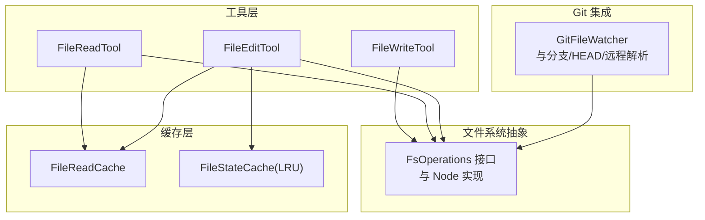
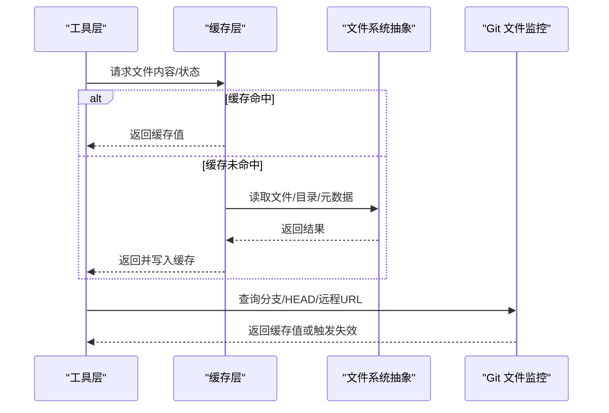
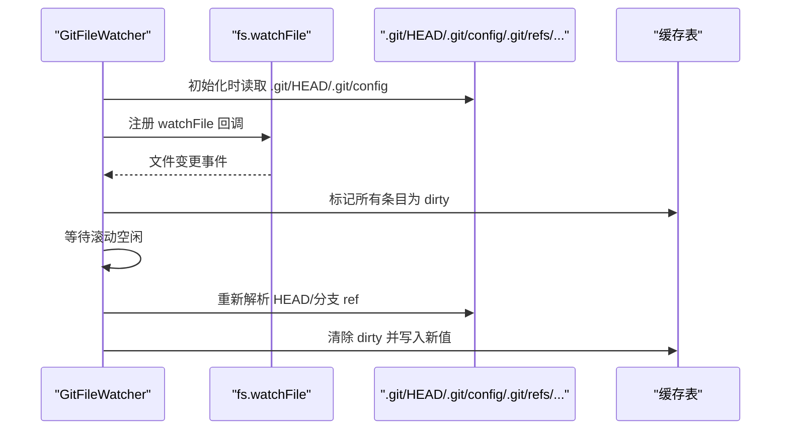
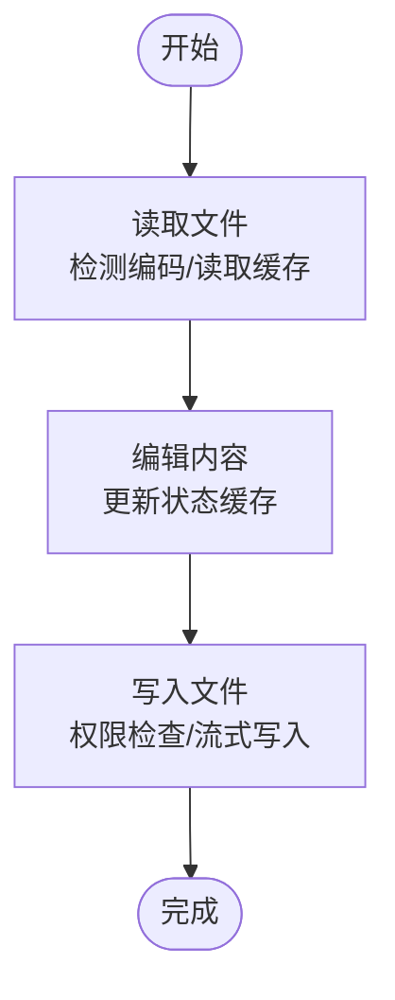
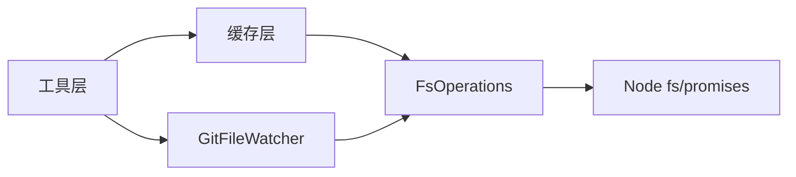

# 文件操作工具

<cite>
**本文引用的文件**
- [src/utils/fsOperations.ts](file://src/utils/fsOperations.ts)
- [src/utils/fileReadCache.ts](file://src/utils/fileReadCache.ts)
- [src/utils/fileStateCache.ts](file://src/utils/fileStateCache.ts)
- [src/utils/git/gitFilesystem.ts](file://src/utils/git/gitFilesystem.ts)
- [src/tools/FileReadTool/FileReadTool.ts](file://src/tools/FileReadTool/FileReadTool.ts)
- [src/tools/FileWriteTool/FileWriteTool](file://src/tools/FileWriteTool/FileWriteTool)
- [src/tools/FileEditTool/FileEditTool.ts](file://src/tools/FileEditTool/FileEditTool.ts)
</cite>

## 目录
1. [简介](#简介)
2. [项目结构](#项目结构)
3. [核心组件](#核心组件)
4. [架构总览](#架构总览)
5. [详细组件分析](#详细组件分析)
6. [依赖关系分析](#依赖关系分析)
7. [性能考量](#性能考量)
8. [故障排查指南](#故障排查指南)
9. [结论](#结论)
10. [附录](#附录)

## 简介
本文件操作工具集围绕“文件读写、缓存、Git 集成、文件监控与变更检测、路径与权限处理、元数据管理、批量处理、安全与访问控制、错误处理与回滚”等主题构建。其目标是为上层工具（如文件读取、编辑、写入）提供稳定、高效且安全的底层支持，并通过缓存与监控机制提升交互体验与性能。

## 项目结构
该工具集主要分布在以下模块：
- 文件系统抽象与通用操作：src/utils/fsOperations.ts
- 文件内容缓存：src/utils/fileReadCache.ts、src/utils/fileStateCache.ts
- Git 集成与文件监控：src/utils/git/gitFilesystem.ts
- 工具层（使用上述能力）：src/tools/FileReadTool、src/tools/FileWriteTool、src/tools/FileEditTool

图表来源
- [src/utils/fsOperations.ts:18-123](file://src/utils/fsOperations.ts#L18-L123)
- [src/utils/fileReadCache.ts:14-97](file://src/utils/fileReadCache.ts#L14-L97)
- [src/utils/fileStateCache.ts:30-93](file://src/utils/fileStateCache.ts#L30-L93)
- [src/utils/git/gitFilesystem.ts:333-496](file://src/utils/git/gitFilesystem.ts#L333-L496)

章节来源
- [src/utils/fsOperations.ts:18-123](file://src/utils/fsOperations.ts#L18-L123)
- [src/utils/fileReadCache.ts:14-97](file://src/utils/fileReadCache.ts#L14-L97)
- [src/utils/fileStateCache.ts:30-93](file://src/utils/fileStateCache.ts#L30-L93)
- [src/utils/git/gitFilesystem.ts:333-496](file://src/utils/git/gitFilesystem.ts#L333-L496)

## 核心组件
- 文件系统抽象与通用操作：提供统一的 FsOperations 接口及 Node.js 默认实现，封装常用同步/异步文件操作，并内置安全路径解析、重复路径检测、深层父级符号链接解析、权限检查所需路径集合计算等能力。
- 文件读取缓存：基于修改时间的内存缓存，避免重复读取；具备容量淘汰与统计接口，适用于频繁读取场景（如编辑工具）。
- 文件状态缓存：基于 LRU 的文件状态缓存，按字节大小与条目数双重限制，支持克隆、合并与序列化恢复，用于模型侧“已读取文件”的一致性管理。
- Git 文件监控与缓存：在工作树/子模块场景下解析 .git 目录、HEAD、ref、remote URL 等，使用文件监控缓存派生值，自动失效并延迟更新，降低子进程开销。
- 工具层：FileReadTool、FileWriteTool、FileEditTool 基于上述能力实现具体功能。

章节来源
- [src/utils/fsOperations.ts:138-178](file://src/utils/fsOperations.ts#L138-L178)
- [src/utils/fsOperations.ts:187-198](file://src/utils/fsOperations.ts#L187-L198)
- [src/utils/fsOperations.ts:215-270](file://src/utils/fsOperations.ts#L215-L270)
- [src/utils/fsOperations.ts:288-382](file://src/utils/fsOperations.ts#L288-L382)
- [src/utils/fileReadCache.ts:14-97](file://src/utils/fileReadCache.ts#L14-L97)
- [src/utils/fileStateCache.ts:30-93](file://src/utils/fileStateCache.ts#L30-L93)
- [src/utils/git/gitFilesystem.ts:333-496](file://src/utils/git/gitFilesystem.ts#L333-L496)

## 架构总览
整体架构以“抽象层-缓存层-监控层-工具层”分层设计，通过 FsOperations 抽象屏蔽平台差异与测试替身，通过缓存减少 IO 并保证一致性，通过 GitFileWatcher 将昂贵的子进程调用替换为文件系统监控与内存缓存。

图表来源
- [src/utils/fsOperations.ts:427-429](file://src/utils/fsOperations.ts#L427-L429)
- [src/utils/fileReadCache.ts:22-68](file://src/utils/fileReadCache.ts#L22-L68)
- [src/utils/fileStateCache.ts:41-48](file://src/utils/fileStateCache.ts#L41-L48)
- [src/utils/git/gitFilesystem.ts:568-582](file://src/utils/git/gitFilesystem.ts#L568-L582)

## 详细组件分析

### 文件系统抽象与通用操作（FsOperations）
- 设计要点
  - 统一接口：封装常用文件/目录操作，支持同步与异步版本，便于替换实现（如测试替身）。
  - 安全路径解析：safeResolvePath 在解析前阻断 UNC 路径，避免网络请求；对 FIFO/套接字/设备文件进行快速跳过，防止阻塞；返回是否为符号链接与是否规范路径。
  - 重复路径检测：isDuplicatePath 通过 realpath 解析后去重，避免重复加载。
  - 深层父级解析：resolveDeepestExistingAncestorSync 在写入新文件时，解析可能存在的父级符号链接，确保落点正确。
  - 权限检查路径集合：getPathsForPermissionCheck 收集原始路径、中间符号链接目标与最终解析路径，覆盖多级链路的安全规则。
  - 默认实现：NodeFsOperations 提供 Node fs 与 fs/promises 的适配，包含慢操作日志包装与平台兼容性处理（如 Bun/Windows 的目录只读属性）。
  - 范围读取与尾部读取：readFileRange、tailFile、readLinesReverse 支持大文件的高效读取与逆序行遍历。
- 性能与安全
  - 使用 lstat/readlink/realpath 的组合避免阻塞与循环链路。
  - 对特殊文件类型直接短路，减少无效 IO。
  - 写入新文件时优先使用原子模式（存在性竞争防护）。

章节来源
- [src/utils/fsOperations.ts:138-178](file://src/utils/fsOperations.ts#L138-L178)
- [src/utils/fsOperations.ts:187-198](file://src/utils/fsOperations.ts#L187-L198)
- [src/utils/fsOperations.ts:215-270](file://src/utils/fsOperations.ts#L215-L270)
- [src/utils/fsOperations.ts:288-382](file://src/utils/fsOperations.ts#L288-L382)
- [src/utils/fsOperations.ts:384-603](file://src/utils/fsOperations.ts#L384-L603)
- [src/utils/fsOperations.ts:644-770](file://src/utils/fsOperations.ts#L644-L770)

### 文件读取缓存（FileReadCache）
- 设计要点
  - 缓存键：文件路径；缓存值：内容、编码、mtime。
  - 失效策略：基于 mtimeMs 的精确失效；删除即失效；超过最大容量时逐出最旧条目。
  - 适用场景：频繁读取同一文件的编辑工具，避免重复 IO。
- 性能特征
  - O(1) 查找；容量上限避免内存膨胀；逐出策略简单高效。

章节来源
- [src/utils/fileReadCache.ts:14-97](file://src/utils/fileReadCache.ts#L14-L97)

### 文件状态缓存（FileStateCache）
- 设计要点
  - LRU 策略：maxEntries 与 maxSizeBytes 双重限制；按内容字节计算大小。
  - 路径归一化：normalize 规避相对路径与混合分隔符导致的不一致。
  - 克隆/合并/持久化：支持克隆缓存配置、按时间戳合并、dump/load 序列化恢复。
- 适用场景：记录模型侧“已读取文件”的状态，配合 isPartialView 字段区分部分视图与完整视图，保障后续编辑/写入的正确性。

章节来源
- [src/utils/fileStateCache.ts:30-93](file://src/utils/fileStateCache.ts#L30-L93)
- [src/utils/fileStateCache.ts:101-142](file://src/utils/fileStateCache.ts#L101-L142)

### Git 集成与文件监控（GitFileWatcher）
- 设计要点
  - 解析 .git 目录：支持工作树/子模块，解析 commondir 与 worktrees。
  - HEAD/分支/SHA 解析：安全校验 ref 名称与 SHA 格式，拒绝危险字符与路径穿越。
  - 文件监控：watchFile 监控 HEAD、config、当前分支 ref 文件；滚动空闲后再更新分支 ref，避免事件风暴。
  - 派生值缓存：get(key, compute) 提供惰性初始化与失效控制；race condition 处理：先清除 dirty，再计算，若期间再次失效则下次读取重新计算。
  - 工作树支持：独立读取 worktree 的 .git 指针文件，避免误判父仓库 HEAD。
- 安全特性
  - isSafeRefName 与 isValidGitSha 严格校验，防止注入与任意内容传播。
  - 远程 URL 与默认分支解析考虑 worktree 的 commonDir。

图表来源
- [src/utils/git/gitFilesystem.ts:353-438](file://src/utils/git/gitFilesystem.ts#L353-L438)
- [src/utils/git/gitFilesystem.ts:463-485](file://src/utils/git/gitFilesystem.ts#L463-L485)

章节来源
- [src/utils/git/gitFilesystem.ts:40-76](file://src/utils/git/gitFilesystem.ts#L40-L76)
- [src/utils/git/gitFilesystem.ts:98-131](file://src/utils/git/gitFilesystem.ts#L98-L131)
- [src/utils/git/gitFilesystem.ts:149-183](file://src/utils/git/gitFilesystem.ts#L149-L183)
- [src/utils/git/gitFilesystem.ts:203-266](file://src/utils/git/gitFilesystem.ts#L203-L266)
- [src/utils/git/gitFilesystem.ts:353-438](file://src/utils/git/gitFilesystem.ts#L353-L438)
- [src/utils/git/gitFilesystem.ts:463-485](file://src/utils/git/gitFilesystem.ts#L463-L485)
- [src/utils/git/gitFilesystem.ts:593-640](file://src/utils/git/gitFilesystem.ts#L593-L640)
- [src/utils/git/gitFilesystem.ts:667-699](file://src/utils/git/gitFilesystem.ts#L667-L699)

### 工具层（FileReadTool、FileWriteTool、FileEditTool）
- FileReadTool：利用 FsOperations 读取文件，结合 FileReadCache 与编码检测，返回内容与编码信息。
- FileWriteTool：基于 FsOperations 执行写入，支持追加与流式写入；结合权限检查路径集合确保安全写入。
- FileEditTool：结合 FileReadCache 与 FileStateCache，实现“读取-编辑-写回”的闭环，支持部分视图标记与增量更新。

图表来源
- [src/tools/FileReadTool/FileReadTool.ts](file://src/tools/FileReadTool/FileReadTool.ts)
- [src/tools/FileWriteTool/FileWriteTool](file://src/tools/FileWriteTool/FileWriteTool)
- [src/tools/FileEditTool/FileEditTool.ts](file://src/tools/FileEditTool/FileEditTool.ts)

章节来源
- [src/tools/FileReadTool/FileReadTool.ts](file://src/tools/FileReadTool/FileReadTool.ts)
- [src/tools/FileWriteTool/FileWriteTool](file://src/tools/FileWriteTool/FileWriteTool)
- [src/tools/FileEditTool/FileEditTool.ts](file://src/tools/FileEditTool/FileEditTool.ts)

## 依赖关系分析
- 工具层依赖缓存层与文件系统抽象；缓存层依赖 FsOperations；GitFileWatcher 同时依赖 FsOperations 与 Git 解析逻辑。
- 关键耦合点
  - FsOperations 作为唯一文件系统接口，向上屏蔽平台差异与测试替身。
  - FileReadCache 与 FileStateCache 分别服务于“内容读取”和“状态一致性”，避免重复 IO 并保持模型侧视图正确。
  - GitFileWatcher 将昂贵的 git 子进程调用替换为文件监控与内存缓存，显著降低开销。

图表来源
- [src/utils/fsOperations.ts:605-623](file://src/utils/fsOperations.ts#L605-L623)
- [src/utils/fileReadCache.ts:22-23](file://src/utils/fileReadCache.ts#L22-L23)
- [src/utils/fileStateCache.ts:46-47](file://src/utils/fileStateCache.ts#L46-L47)
- [src/utils/git/gitFilesystem.ts:354-356](file://src/utils/git/gitFilesystem.ts#L354-L356)

章节来源
- [src/utils/fsOperations.ts:605-623](file://src/utils/fsOperations.ts#L605-L623)
- [src/utils/fileReadCache.ts:22-23](file://src/utils/fileReadCache.ts#L22-L23)
- [src/utils/fileStateCache.ts:46-47](file://src/utils/fileStateCache.ts#L46-L47)
- [src/utils/git/gitFilesystem.ts:354-356](file://src/utils/git/gitFilesystem.ts#L354-L356)

## 性能考量
- 缓存策略
  - FileReadCache：基于 mtime 的精确失效，避免重复读取；容量上限与逐出策略控制内存占用。
  - FileStateCache：LRU + 字节大小计算，限制内存增长；支持克隆与合并，便于跨组件共享状态。
- IO 优化
  - readFileRange/tailFile：按需读取指定范围或尾部，避免整文件加载。
  - readLinesReverse：逆序行读取，适合日志类大文件的增量处理。
- 监控与并发
  - GitFileWatcher 使用 watchFile 与延迟更新，避免滚动过程中的事件风暴；race condition 处理确保缓存一致性。
- 平台兼容
  - NodeFsOperations 对 Bun/Windows 的目录只读属性进行兼容处理，减少异常中断。

章节来源
- [src/utils/fileReadCache.ts:14-97](file://src/utils/fileReadCache.ts#L14-L97)
- [src/utils/fileStateCache.ts:30-93](file://src/utils/fileStateCache.ts#L30-L93)
- [src/utils/fsOperations.ts:644-770](file://src/utils/fsOperations.ts#L644-L770)
- [src/utils/git/gitFilesystem.ts:353-438](file://src/utils/git/gitFilesystem.ts#L353-L438)

## 故障排查指南
- 文件被删除/移动
  - FileReadCache 在 stat 失败时会清理缓存项并抛出错误，确保后续读取不会返回陈旧数据。
- 符号链接与路径问题
  - 使用 safeResolvePath 与 resolveDeepestExistingAncestorSync 避免死链与阻塞；getPathsForPermissionCheck 收集完整路径链路，覆盖多级中间目标。
- 权限与安全
  - getPathsForPermissionCheck 明确列出应检查的绝对路径集合，确保即使目标经由符号链接指向敏感位置，也能被拦截。
- Git 监控异常
  - 若 HEAD/分支切换频繁导致事件风暴，GitFileWatcher 会在滚动空闲后再更新分支 ref，避免竞争；若缓存值陈旧，可调用 reset() 重置状态。
- 大文件读取
  - 使用 readFileRange/tailFile/readLinesReverse 避免一次性加载大文件；注意 UTF-8 边界与多字节字符的正确解码。

章节来源
- [src/utils/fileReadCache.ts:27-33](file://src/utils/fileReadCache.ts#L27-L33)
- [src/utils/fsOperations.ts:138-178](file://src/utils/fsOperations.ts#L138-L178)
- [src/utils/fsOperations.ts:215-270](file://src/utils/fsOperations.ts#L215-L270)
- [src/utils/fsOperations.ts:288-382](file://src/utils/fsOperations.ts#L288-L382)
- [src/utils/git/gitFilesystem.ts:488-495](file://src/utils/git/gitFilesystem.ts#L488-L495)
- [src/utils/fsOperations.ts:644-770](file://src/utils/fsOperations.ts#L644-L770)

## 结论
该文件操作工具集通过“抽象-缓存-监控-工具”四层设计，在保证安全性与正确性的前提下，提供了高性能、可扩展的文件读写能力。缓存策略有效降低 IO 成本，Git 监控将昂贵的子进程调用替换为文件系统事件，路径与权限处理确保在复杂符号链接与工作树场景下的安全与稳定。工具层基于这些能力实现文件读取、编辑与写入的闭环流程，满足大规模工程场景的需求。

## 附录
- 错误码与平台差异：NodeFsOperations 中对特定平台异常进行了兼容处理，建议在部署环境关注相关差异。
- 扩展建议：未来可在缓存层引入更细粒度的失效策略（如基于 inode 的失效），并在工具层增加批量处理的事务式写入与回滚能力。